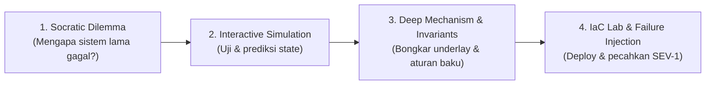

## 🧭 Jalur Belajar Berbasis Peran (MIT-Grade Learning Tracks)

Untuk mencegah *cognitive overload* dari 34 modul teknis yang mendalam, pilih **Jalur Belajar (Learning Track)** yang sesuai dengan target kompetensi dan spesialisasi Anda:

  

    

      
Track 1 • Fast Track

      <h3 class="text-base font-bold text-[var(--vp-c-text-1)] mb-1">Cloud Platform Architect</h3>
      
Fokus pada arsitektur topologi VPC, private connectivity, ingress/egress security, dan hybrid routing.

      
Modul: 01, 07, 08, 09, 10, 11, 13, 20, 23, 24, 27

    

    <a href="/cloud-network-learning-materials/modules/01-subnetting-vlsm-ipam" class="text-xs font-bold text-blue-400 hover:underline">Mulai Track Architect →</a>
  

  

    

      
Track 2 • Deep Systems

      <h3 class="text-base font-bold text-[var(--vp-c-text-1)] mb-1">Protocol & Underlay Specialist</h3>
      
Fokus pada fisika protokol RFC, konvergensi BGP, hardware Nitro/Hyperplane, MTU/PMTUD, dan MACsec.

      
Modul: 02, 03, 04, 05, 06, 14, 15, 16, 17, 21, 22, 26

    

    <a href="/cloud-network-learning-materials/modules/02-tcp-mechanics-mtu-mss" class="text-xs font-bold text-purple-400 hover:underline">Mulai Track Systems →</a>
  

  

    

      
Track 3 • SME Mastery

      <h3 class="text-base font-bold text-[var(--vp-c-text-1)] mb-1">Principal & Incident Commander</h3>
      
Kurikulum menyeluruh 34 modul, 8 Terraform Labs, dan investigasi 15 Skenario SEV-1 Outage War Room.

      
Semua Modul (01 - 34) + Labs + War Rooms

    

    <a href="/cloud-network-learning-materials/interactive/troubleshooting-drills" class="text-xs font-bold text-amber-400 hover:underline">Masuk War Rooms →</a>
  

---

## 🔬 Metodologi Pembelajaran Aktif: 4-Step Mastery Loop

Setiap topik dalam materi ini distrukturkan mengikuti siklus pembelajaran aktif sistem terdistribusi:

---

## Peta Jalan Kurikulum Master (8-Part, 34-Module Roadmap)

Kurikulum ini dirancang dengan metodologi **7-Layer Deep Technical Architecture**: setiap modul menyajikan teori protokol standar RFC, rancang bangun underlay AWS, analisis batas performa (*hard limits*), alur paket *hop-by-hop*, blueprint Terraform siap pakai, skenario *failure modes* produksi, serta kerangka *tradeoff* arsitektur level Principal.

```mermaid
graph TD
    subgraph Part1["Part 1: Foundations & Protocol Physics"]
        M01["01. Subnetting & IPAM"] --> M02["02. TCP & PMTUD"] --> M03["03. Advanced BGP-4"] --> M04["04. Overlays & SDN"]
    end

    subgraph Part2["Part 2: Hardware Underlay & VPC Core"]
        M05["05. Nitro & Hyperplane"] --> M06["06. ENI, EFA & Prefix"] --> M07["07. VPC & RAM Sharing"]
    end

    subgraph Part3["Part 3: VPC Routing & Edge Gateways"]
        M08["08. Route Tables & LPM"] --> M09["09. IGW & EIGW"] --> M10["10. NAT Gateways"] --> M11["11. VPC Peering"]
    end

    subgraph Part4["Part 4: PrivateLink & GWLB"]
        M12["12. Gateway Endpoints"] --> M13["13. AWS PrivateLink"] --> M14["14. GWLB & NGFW"]
    end

    subgraph Part5["Part 5: Hybrid & Direct Connect"]
        M15["15. DX & MACsec"] --> M16["16. VIFs & BGP Policies"] --> M17["17. DX Gateway Backbone"] --> M18["18. VPN & Accelerated VPN"] --> M19["19. Client VPN & ZTNA"]
    end

    subgraph Part6["Part 6: Enterprise WAN & Cloud WAN"]
        M20["20. TGW Core Routing"] --> M21["21. TGW Appliance & Connect"] --> M22["22. Cloud WAN Global Mesh"]
    end

    subgraph Part7["Part 7: Application Networking & DNS"]
        M23["23. ALB, NLB & mTLS"] --> M24["24. Route 53 Resolver"] --> M25["25. CloudFront & AGA"] --> M26["26. VPC Lattice & CNI"]
    end

    subgraph Part8["Part 8: Security & War Rooms"]
        M27["27. SG, NACL & Conntrack"] --> M28["28. Network Firewall"] --> M29["29. WAF & Shield"] --> M30["30. Flow Logs & Forensics"] --> M31["31. Multi-Account Backbone"] --> M32["32. Partner Interconnect & NAT"] --> M33["33. Multi-Cloud Mesh"] --> M34["34. 15 SEV-1 War Rooms"]
    end

    M04 --> M05
    M07 --> M08
    M11 --> M12
    M14 --> M15
    M19 --> M20
    M22 --> M23
    M26 --> M27
```

  

    <h3 class="text-sm font-bold text-blue-400 mb-2">Standar Bahasa & Terminologi</h3>
    

      Disajikan dalam <strong>Bahasa Indonesia</strong> teknis profesional, dengan 100% terminologi industri menggunakan istilah asli <strong>English</strong> (<em>subnet, route table, autonomous system, packet, handshake, payload, throughput, peering, advertisement, encapsulation</em>).
    

  

  

    <h3 class="text-sm font-bold text-emerald-400 mb-2">Kompetensi Inti</h3>
    

      Menguasai perancangan alokasi IP enterprise skala besar, konfigurasi Direct Connect & Cloud WAN dengan failover sub-second, inspeksi traffic tersentralisasi menggunakan Next-Gen Firewall, serta investigasi insiden jaringan kritis secara independen.
    

  

