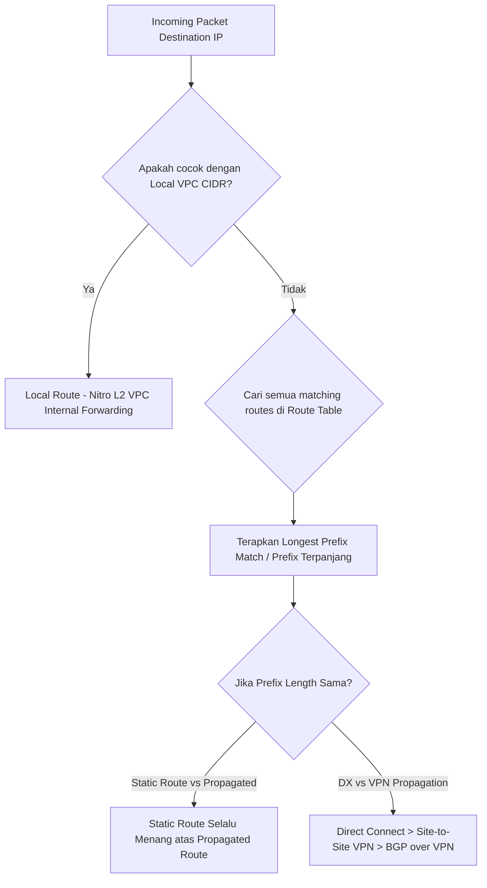

# AWS Hybrid Route Table Resolver Sandbox

<BadgeLabel type="aws" text="TGW & DXGW Engine" /> <BadgeLabel type="sme" text="LPM Simulator" />

Ketika paket data bergerak di dalam ekosistem AWS, keputusan forwarding dievaluasi berdasarkan aturan **Longest Prefix Match (LPM)** di berbagai *layer route table*: dari **VPC Subnet Route Table**, **Transit Gateway Route Table**, hingga **Direct Connect Gateway** dan **BGP Route Table**.

<AwsNetworkSandbox />

## Hirarki & Prioritas Route Table di AWS VPC

Jika terdapat beberapa *route entry* yang cocok dengan IP tujuan di dalam sebuah VPC Route Table, AWS menerapkan hirarki prioritas berikut:

### Aturan Emas Routing AWS:
1. **Local Route bersifat Immutable**: Route lokal untuk primary dan secondary CIDR VPC dibuat otomatis oleh AWS dan tidak dapat dihapus atau di-override oleh prefix yang lebih spesifik.
2. **Longest Prefix Match (LPM)**: Prefix yang lebih spesifik (misal `/28` atau `/24`) selalu mengalahkan prefix yang lebih luas (misal `/16` atau `/0`).
3. **Static Route over Propagated Route**: Jika terdapat prefix berukuran sama (misal sama-sama `10.50.0.0/16`), *static route* yang dikonfigurasi manual akan selalu mengalahkan *propagated route* dari Virtual Private Gateway (VGW).

