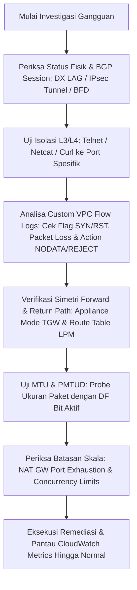

# 🚨 SME Troubleshooting War Rooms

<BadgeLabel type="sme" text="War Room Incident Drills" /> <BadgeLabel type="warning" text="Production SEV-1 Scenarios" />

Sebagai **Senior / SME Cloud Network Engineer**, kemampuan melakukan *root-cause analysis* (RCA) di bawah tekanan insiden produksi (*SEV-1 outage*) adalah pembeda utama. Latihan interaktif ini menguji ketajaman analisa Anda terhadap *telemetry log*, *asymmetric routing*, *PMTUD black holes*, dan *failover traps*.

<TroubleshootingDrill />

## 🛠️ Metodologi Standar SME untuk Network Incident Triage

Ketika menangani degradasi performa atau *packet loss* di AWS, ikuti alur investigasi sistematis:

