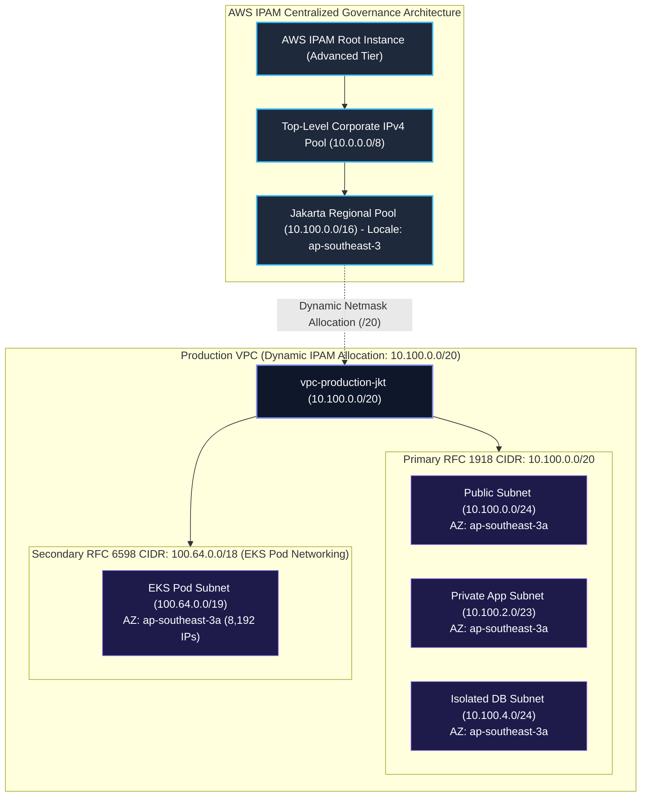

# Lab 01: Enterprise IPAM & Multi-Tier VPC with Secondary RFC 6598 CIDRs

<BadgeLabel type="sme" text="Level: Principal / SME" /> <BadgeLabel type="aws" text="AWS IPAM & VPC" /> <BadgeLabel type="lab" text="Hands-on IaC Blueprint" />

Dalam lab skala enterprise ini, Anda akan merancang dan mengimplementasikan fondasi tata kelola pengalamatan IP terpusat (*Centralized IP Governance*) menggunakan **AWS IP Address Manager (IPAM)**. Anda akan membangun hierarki pool bertingkat, mengalokasikan VPC secara dinamis tanpa konflik subnet, dan mengatasi krisis kehabisan IPv4 (*IPv4 exhaustion*) pada kluster **Amazon EKS** skala masif menggunakan *Secondary CIDR Carrier-Grade NAT (RFC 6598 `100.64.0.0/10`)*.

---

## Arsitektur Topology Lab



---

## 📂 Lokasi Kode Sumber Terraform

Repositori ini menyertakan kode Terraform lengkap yang siap di-deploy:
👉 [labs/01-enterprise-ipam-vpc/](https://github.com/robertusnegoro/cloud-network-learning-materials/tree/main/labs/01-enterprise-ipam-vpc/)

```bash
cd labs/01-enterprise-ipam-vpc
terraform init
terraform plan
terraform apply
```

---

## 🛠️ Modul Pelaksanaan Langkah-demi-Langkah (6-Point Blueprint)

---

### Step 1: Inisialisasi AWS IPAM & Root Scope Configuration

#### 1. Architectural Intent
Dalam arsitektur *Multi-Account AWS Organizations*, manajemen pengalamatan IP manual menggunakan spreadsheet atau CMDB statis sering memicu insiden tumpang tindih (*IP overlapping*), yang merusak skalabilitas routing hybrid Direct Connect dan Transit Gateway. Mengaktifkan **AWS IPAM (IP Address Manager)** mendelegasikan otoritas alokasi IP ke kontrol otomatis AWS, menyediakan audit inventaris IP real-time, mendeteksi CIDR tumpang tindih secara preventif, dan memberlakukan kepatuhan alokasi berbasis regional (*locale*).

#### 2. AWS Console Context & Parameter Mapping
* **Navigasi Konsol**: Buka **VPC Console** ➔ pilih menu **IPAM** di panel kiri ➔ klik **Create IPAM**.
* **Parameter Mapping**:
  * **IPAM tier**: Pilih `Advanced` (mendukung integrasi AWS Organizations, VPC dinamis, audit historis, dan alokasi multi-region).
  * **Operating Regions**: Tambahkan region operasional perusahaan (contoh: `ap-southeast-3` untuk Jakarta).
  * **Tags**: Key `Environment` = Value `Enterprise-Core`.

#### 3. Human-Readable Production AWS CLI
Eksekusi pembuatan instance IPAM dengan mendaftarkan region operasi yang diizinkan:

```bash
aws ec2 create-ipam \
    --description "Enterprise Core IPAM" \
    --operating-regions RegionName=ap-southeast-3 \
    --tag-specifications "ResourceType=ipam,Tags=[{Key=Name,Value=ipam-enterprise-core},{Key=Environment,Value=Production}]" \
    --query 'Ipam.{IpamId:IpamId,State:State,PrivateScopeId:PrivateDefaultScopeId}' \
    --output table
```

| Flag CLI | Penjelasan Parameter |
| :--- | :--- |
| `--operating-regions` | Membatasi replikasi metadata IPAM hanya pada region yang diotorisasi perusahaan guna mengoptimalkan biaya. |
| `--tag-specifications` | Menetapkan metadata penamaan standar enterprise untuk integrasi audit AWS Cost Allocation Tags. |
| `--query` | Filter JMESPath untuk mengekstrak `IpamId` dan `PrivateDefaultScopeId` secara terstruktur. |

#### 4. Declarative Terraform IaC
```hcl
# AWS IPAM Instance Definition
resource "aws_vpc_ipam" "main" {
  description = "Enterprise Core IPAM"
  
  operating_regions {
    region_name = var.aws_region # ap-southeast-3
  }

  tags = {
    Name        = "ipam-enterprise-core"
    Environment = "Enterprise-Core"
    ManagedBy   = "Terraform"
  }
}
```

#### 5. Under-the-Hood Mechanics
Di bawah layer abstraksi AWS, pembuatan resource IPAM menginisialisasi mesin analitik metadata terdistribusi pada *AWS Global Control Plane*. AWS IPAM secara kontinu memindai Amazon EC2 API, AWS Network Interfaces (ENI), dan Route Tables di seluruh akun terhubung dalam AWS Organizations. Mesin ini membangun graf topologi alamat IP dan memetakan pemanfaatan CIDR (*IP consumption telemetry*) secara asinkron tanpa menambah latensi pada *data plane*.

#### 6. Verification Smoke Test
Periksa status kesiapan operasional IPAM instance:

```bash
aws ec2 describe-ipams \
    --ipam-ids $(aws ec2 describe-ipams --query 'Ipams[0].IpamId' --output text) \
    --query 'Ipams[*].[IpamId,State,PrivateDefaultScopeId,OperatingRegions[0].RegionName]' \
    --output table
```

**Output Verifikasi Sukses:**
```text
-----------------------------------------------------------------------------------------
|                                     DescribeIpams                                     |
+----------------------+------------+----------------------------+----------------------+
|  ipam-0a1b2c3d4e5f67 |  available |  ipam-scope-0123456789abcdef|  ap-southeast-3      |
+----------------------+------------+----------------------------+----------------------+
```

---

### Step 2: Hierarchical IPAM Pool Construction (Top-Level & Regional Pool)

#### 1. Architectural Intent
Struktur pengalamatan IP enterprise wajib menerapkan arsitektur bertingkat (*Hierarchical Summarization*). Dengan membagi supernet korporat `10.0.0.0/8` ke dalam **Regional Pools** (seperti Jakarta `10.100.0.0/16`), tabel rute pada *backbone core router* on-premises dan AWS Transit Gateway tetap ringkas (*route summarization*). Hal ini mencegah ledakan tabel rute (*routing table bloat*) dan mengisolasi domain *failure*.

#### 2. AWS Console Context & Parameter Mapping
* **Navigasi Konsol**: Buka **VPC Console** ➔ **IPAM** ➔ **Pools** ➔ klik **Create pool**.
* **Parameter Mapping (Top-Level Pool)**:
  * **IPAM scope**: Pilih `Default private scope`.
  * **Address family**: `IPv4`.
  * **Source**: `None` (Root Pool).
  * **CIDRs to provision**: `10.0.0.0/8`.
* **Parameter Mapping (Regional Jakarta Pool)**:
  * **Source**: Pilih `Top-Level Corporate IPv4 Pool`.
  * **Locale**: `ap-southeast-3` (Mencegah alokasi CIDR ini ke region selain Jakarta).
  * **CIDRs to provision**: `10.100.0.0/16`.

#### 3. Human-Readable Production AWS CLI
Buat Top-Level Pool dan Regional Jakarta Pool secara terstruktur:

```bash
# 1. Ambil Private Scope ID
SCOPE_ID=$(aws ec2 describe-ipams --query 'Ipams[0].PrivateDefaultScopeId' --output text)

# 2. Buat Top-Level Corporate Pool (10.0.0.0/8)
TOP_POOL_ID=$(aws ec2 create-ipam-pool \
    --ipam-scope-id "$SCOPE_ID" \
    --address-family ipv4 \
    --description "Top-Level Corporate IPv4 Pool (10.0.0.0/8)" \
    --tag-specifications "ResourceType=ipam-pool,Tags=[{Key=Name,Value=ipam-pool-top-corp}]" \
    --query 'IpamPool.IpamPoolId' \
    --output text)

# 3. Provisi CIDR 10.0.0.0/8 ke Top-Level Pool
aws ec2 provision-ipam-pool-cidr \
    --ipam-pool-id "$TOP_POOL_ID" \
    --cidr 10.0.0.0/8

# 4. Buat Regional Jakarta Pool (10.100.0.0/16) turunan dari Top-Level Pool
REGIONAL_POOL_ID=$(aws ec2 create-ipam-pool \
    --ipam-scope-id "$SCOPE_ID" \
    --source-ipam-pool-id "$TOP_POOL_ID" \
    --locale ap-southeast-3 \
    --address-family ipv4 \
    --description "Jakarta Regional Pool (10.100.0.0/16)" \
    --tag-specifications "ResourceType=ipam-pool,Tags=[{Key=Name,Value=ipam-pool-regional-jkt}]" \
    --query 'IpamPool.IpamPoolId' \
    --output text)

# 5. Provisi CIDR 10.100.0.0/16 ke Jakarta Regional Pool
aws ec2 provision-ipam-pool-cidr \
    --ipam-pool-id "$REGIONAL_POOL_ID" \
    --cidr 10.100.0.0/16
```

| Flag CLI | Penjelasan Parameter |
| :--- | :--- |
| `--source-ipam-pool-id` | Mengikat hierarki relasi parent-child pool untuk alokasi terstruktur. |
| `--locale` | Menegakkan batasan geografis keras (*hard boundary*) agar CIDR regional tidak dapat digunakan di luar `ap-southeast-3`. |

#### 4. Declarative Terraform IaC
```hcl
# Top-Level Corporate Pool (10.0.0.0/8)
resource "aws_vpc_ipam_pool" "top_level" {
  address_family = "ipv4"
  ipam_scope_id  = aws_vpc_ipam.main.private_default_scope_id
  description    = "Top Level Corporate IPv4 Pool (10.0.0.0/8)"
  locale         = var.aws_region
}

resource "aws_vpc_ipam_pool_cidr" "top_level_cidr" {
  ipam_pool_id = aws_vpc_ipam_pool.top_level.id
  cidr         = "10.0.0.0/8"
}

# Jakarta Regional Sub-Pool (10.100.0.0/16)
resource "aws_vpc_ipam_pool" "regional_jkt" {
  address_family      = "ipv4"
  ipam_scope_id       = aws_vpc_ipam.main.private_default_scope_id
  source_ipam_pool_id = aws_vpc_ipam_pool.top_level.id
  description         = "Jakarta Regional Pool (10.100.0.0/16)"
  locale              = var.aws_region
}

resource "aws_vpc_ipam_pool_cidr" "regional_jkt_cidr" {
  ipam_pool_id = aws_vpc_ipam_pool.regional_jkt.id
  cidr         = "10.100.0.0/16"
}
```

#### 5. Under-the-Hood Mechanics
Di bawah arsitektur IPAM, AWS mengelola *Radix Tree (Trie Data Structure)* untuk setiap pool. Ketika CIDR `10.100.0.0/16` dialokasikan ke child pool dari supernet `10.0.0.0/8`, kontrol IPAM menandai bitmask tersebut sebagai *allocated/reserved* pada parent tree. Algoritma ini menjamin secara matematis bahwa tidak ada child pool lain yang dapat meminjam blok bitmask yang saling beririsan (*zero CIDR overlap guarantee*).

#### 6. Verification Smoke Test
Verifikasi ketersediaan dan status alokasi CIDR pada Regional Pool:

```bash
aws ec2 get-ipam-pool-cidrs \
    --ipam-pool-id "$REGIONAL_POOL_ID" \
    --query 'IpamPoolCidrs[*].[Cidr,State]' \
    --output table
```

**Output Verifikasi Sukses:**
```text
--------------------------------
|      GetIpamPoolCidrs        |
+-----------------+------------+
|  10.100.0.0/16  |  provisioned|
+-----------------+------------+
```

---

### Step 3: Dynamic VPC Provisioning via Regional IPAM Pool (`/20` Allocation)

#### 1. Architectural Intent
Membuat VPC dengan menentukan *hardcoded static CIDR* pada template IaC rawan menimbulkan konflik antar tim pengembang (*cross-team allocation drift*). Melalui integrasi IPAM, pembuatan VPC dilakukan secara deklaratif dengan meminta panjang netmask (misalnya `/20` = 4,096 IP addresses) langsung dari Regional Pool. IPAM secara otomatis memilih blok CIDR bebas berikutnya yang tersedia dan mendaftarkannya ke sistem inventaris.

#### 2. AWS Console Context & Parameter Mapping
* **Navigasi Konsol**: Buka **VPC Console** ➔ **Your VPCs** ➔ klik **Create VPC**.
* **Parameter Mapping**:
  * **IPv4 CIDR block**: Pilih **IPAM-allocated IPv4 CIDR block**.
  * **IPAM pool**: Pilih `Jakarta Regional Pool (10.100.0.0/16)`.
  * **Netmask**: Masukkan `20` (Memberikan alokasi otomatis `10.100.0.0/20`).
  * **Tenancy**: `Default`.
  * **VPC Name**: `vpc-production-jkt`.

#### 3. Human-Readable Production AWS CLI
Provisi VPC dinamis dengan meminta alokasi netmask `/20` dari IPAM:

```bash
PROD_VPC_ID=$(aws ec2 create-vpc \
    --ipv4-ipam-pool-id "$REGIONAL_POOL_ID" \
    --ipv4-netmask-length 20 \
    --tag-specifications "ResourceType=vpc,Tags=[{Key=Name,Value=vpc-production-jkt},{Key=Env,Value=Production}]" \
    --query 'Vpc.VpcId' \
    --output text)

# Aktifkan DNS Hostnames & DNS Support
aws ec2 modify-vpc-attribute --vpc-id "$PROD_VPC_ID" --enable-dns-hostnames '{"Value":true}'
aws ec2 modify-vpc-attribute --vpc-id "$PROD_VPC_ID" --enable-dns-support '{"Value":true}'
```

| Flag CLI | Penjelasan Parameter |
| :--- | :--- |
| `--ipv4-ipam-pool-id` | ID pool target sebagai penyedia pool alokasi IP. |
| `--ipv4-netmask-length` | Prefiks bitmask IPv4 yang diminta secara dinamis (panjang bit `20`). |

#### 4. Declarative Terraform IaC
```hcl
# Production VPC Provisioned dynamically via IPAM
resource "aws_vpc" "prod_vpc" {
  ipv4_ipam_pool_id   = aws_vpc_ipam_pool.regional_jkt.id
  ipv4_netmask_length = 20 # Allocates 10.100.0.0/20 (4,096 IPs)

  enable_dns_hostnames = true
  enable_dns_support   = true

  tags = {
    Name        = "vpc-production-jkt"
    Env         = "Production"
    ManagedBy   = "Terraform"
  }
}
```

#### 5. Under-the-Hood Mechanics
Ketika VPC dibuat, kontrol *Software Defined Network (SDN)* AWS mengalokasikan identitas *VPC Encapsulation Domain (VNI)* baru dan membuat entri default *Local Route Table*. Di layer hypervisor Nitro, kontroler jaringan memetakan batas isolasi tenant, mengonfigurasi gateway internal pada offset default `.1` (VPC Router Gateway) dan `.2` (Amazon Route 53 Resolver / VPC DNS), serta mengunci alokasi `10.100.0.0/20` pada metadata inventaris IPAM.

#### 6. Verification Smoke Test
Pastikan VPC berhasil dibuat dan mendapatkan blok CIDR yang valid dari IPAM:

```bash
aws ec2 describe-vpcs \
    --vpc-ids "$PROD_VPC_ID" \
    --query 'Vpcs[*].[VpcId,CidrBlock,State,Ipv4IpamPoolId]' \
    --output table
```

**Output Verifikasi Sukses:**
```text
-----------------------------------------------------------------------------------------
|                                     DescribeVpcs                                      |
+-----------------------+------------------+------------+-------------------------------+
|  vpc-03a4b5c6d7e8f9012|  10.100.0.0/20   |  available |  ipam-pool-0192837465abcdef0  |
+-----------------------+------------------+------------+-------------------------------+
```

---

### Step 4: Secondary CIDR Block Association (RFC 6598 `100.64.0.0/18` for EKS Pods)

#### 1. Architectural Intent
Kluster Kubernetes skala masif (*Amazon EKS*) dengan ratusan microservices dan autoscaling pods sering kali mengonsumsi puluhan ribu alamat IP. Jika Pod menggunakan IP dari *Primary RFC 1918 CIDR*, ruang IP enterprise akan cepat habis (*IPv4 address exhaustion*). Solusi standar industri arsitektur SME adalah mengintegrasikan **Secondary Non-Routable / Shared CIDR** dari blok **RFC 6598 Carrier-Grade NAT (`100.64.0.0/10`)** menggunakan *AWS VPC CNI Custom Networking*. Pod EKS mendapatkan alamat IP dari blok `100.64.0.0/18` (16,384 IP), sementara Node EC2 dan Load Balancer tetap berada pada RFC 1918 primer.

#### 2. AWS Console Context & Parameter Mapping
* **Navigasi Konsol**: Buka **VPC Console** ➔ **Your VPCs** ➔ pilih `vpc-production-jkt` ➔ klik menu dropdown **Actions** ➔ pilih **Edit CIDRs**.
* **Parameter Mapping**:
  * Klik **Add new IPv4 CIDR**.
  * **IPv4 CIDR**: Masukkan `100.64.0.0/18` (16,384 alamat IP).
  * Klik **Save**.

#### 3. Human-Readable Production AWS CLI
Asosiasikan blok RFC 6598 sebagai Secondary CIDR ke VPC produksi:

```bash
ASSOC_ID=$(aws ec2 associate-vpc-cidr-block \
    --vpc-id "$PROD_VPC_ID" \
    --cidr-block 100.64.0.0/18 \
    --query 'Ipv4CidrBlockAssociation.AssociationId' \
    --output text)
```

| Flag CLI | Penjelasan Parameter |
| :--- | :--- |
| `--vpc-id` | ID VPC target yang akan ditambahkan blok IP sekunder. |
| `--cidr-block` | Blok subnet RFC 6598 (`100.64.0.0/18`) yang dialokasikan khusus untuk pod networking. |

#### 4. Declarative Terraform IaC
```hcl
# Secondary CIDR Block for EKS Pods (RFC 6598 - Carrier-Grade NAT)
resource "aws_vpc_ipv4_cidr_block_association" "eks_pods" {
  vpc_id     = aws_vpc.prod_vpc.id
  cidr_block = "100.64.0.0/18" # 16,384 IPs for Kubernetes Pod ENIs
}
```

#### 5. Under-the-Hood Mechanics
Asosiasi secondary CIDR block memicu pembaruan pada tabel rute *Local Route* bawaan VPC di level *AWS Hyperplane / Nitro SDN*. Kartu Nitro pada setiap host EC2 di dalam VPC tersebut menerima pembaruan aturan rute lokal: trafik ke `10.100.0.0/20` DAN `100.64.0.0/18` keduanya dievaluasi sebagai target `local`. Hal ini memungkinkan komunikasi langsung tanpa NAT (*direct L3 routing*) antar Pod EKS dan layanan backend di dalam VPC yang sama.

#### 6. Verification Smoke Test
Periksa asosiasi CIDR pada VPC:

```bash
aws ec2 describe-vpcs \
    --vpc-ids "$PROD_VPC_ID" \
    --query 'Vpcs[*].CidrBlockAssociationSet[*].[CidrBlock,CidrBlockState.State]' \
    --output table
```

**Output Verifikasi Sukses:**
```text
---------------------------------------
|            DescribeVpcs             |
+-------------------+-----------------+
|  10.100.0.0/20    |  associated     |
|  100.64.0.0/18    |  associated     |
+-------------------+-----------------+
```

---

### Step 5: Multi-Tier Subnet Topology & EKS Secondary Subnet Partitioning

#### 1. Architectural Intent
Menerapkan pemisahan tugas (*separation of concerns*) dan isolasi keamanan network-level dengan mempartisi VPC menjadi 4 tier subnet independen:
1. **Public Subnet (`/24`)**: Untuk Internet-facing ALB dan NAT Gateway.
2. **Private App Subnet (`/23`)**: Untuk worker node EKS, compute EC2, dan business logic.
3. **Isolated DB Subnet (`/24`)**: Untuk database Aurora/RDS tanpa rute langsung ke internet (*zero egress*).
4. **EKS Pod Secondary Subnet (`/19`)**: Subnet berkapasitas masif (8,192 IP) yang di-carve dari blok `100.64.0.0/18` khusus untuk Pod ENI via AWS CNI.

#### 2. AWS Console Context & Parameter Mapping
* **Navigasi Konsol**: Buka **VPC Console** ➔ **Subnets** ➔ klik **Create subnet**.
* **Parameter Mapping**:
  * **VPC ID**: Pilih `vpc-production-jkt`.
  * **Subnet 1 (Public)**: Name `snet-public-aza`, AZ `ap-southeast-3a`, IPv4 CIDR `10.100.0.0/24`.
  * **Subnet 2 (Private App)**: Name `snet-app-aza`, AZ `ap-southeast-3a`, IPv4 CIDR `10.100.2.0/23`.
  * **Subnet 3 (Isolated DB)**: Name `snet-db-aza`, AZ `ap-southeast-3a`, IPv4 CIDR `10.100.4.0/24`.
  * **Subnet 4 (EKS Secondary)**: Name `snet-eks-pods-aza`, AZ `ap-southeast-3a`, IPv4 CIDR `100.64.0.0/19`.

#### 3. Human-Readable Production AWS CLI
Buat keempat subnet multi-tier:

```bash
# 1. Public Subnet
aws ec2 create-subnet \
    --vpc-id "$PROD_VPC_ID" \
    --cidr-block 10.100.0.0/24 \
    --availability-zone ap-southeast-3a \
    --tag-specifications "ResourceType=subnet,Tags=[{Key=Name,Value=snet-public-aza},{Key=Tier,Value=Public}]"

# 2. Private App Subnet
aws ec2 create-subnet \
    --vpc-id "$PROD_VPC_ID" \
    --cidr-block 10.100.2.0/23 \
    --availability-zone ap-southeast-3a \
    --tag-specifications "ResourceType=subnet,Tags=[{Key=Name,Value=snet-app-aza},{Key=Tier,Value=Private-App}]"

# 3. Isolated DB Subnet
aws ec2 create-subnet \
    --vpc-id "$PROD_VPC_ID" \
    --cidr-block 10.100.4.0/24 \
    --availability-zone ap-southeast-3a \
    --tag-specifications "ResourceType=subnet,Tags=[{Key=Name,Value=snet-db-aza},{Key=Tier,Value=Isolated-DB}]"

# 4. EKS Secondary Subnet (RFC 6598)
aws ec2 create-subnet \
    --vpc-id "$PROD_VPC_ID" \
    --cidr-block 100.64.0.0/19 \
    --availability-zone ap-southeast-3a \
    --tag-specifications "ResourceType=subnet,Tags=[{Key=Name,Value=snet-eks-pods-aza},{Key=Tier,Value=EKS-Secondary-CNI}]"
```

#### 4. Declarative Terraform IaC
```hcl
# Multi-AZ Subnets (AZ-A Provisioning)
resource "aws_subnet" "public_aza" {
  vpc_id            = aws_vpc.prod_vpc.id
  cidr_block        = "10.100.0.0/24"
  availability_zone = "${var.aws_region}a"
  tags = {
    Name = "snet-public-aza"
    Tier = "Public"
  }
}

resource "aws_subnet" "app_aza" {
  vpc_id            = aws_vpc.prod_vpc.id
  cidr_block        = "10.100.2.0/23"
  availability_zone = "${var.aws_region}a"
  tags = {
    Name = "snet-app-aza"
    Tier = "Private-App"
  }
}

resource "aws_subnet" "db_aza" {
  vpc_id            = aws_vpc.prod_vpc.id
  cidr_block        = "10.100.4.0/24"
  availability_zone = "${var.aws_region}a"
  tags = {
    Name = "snet-db-aza"
    Tier = "Isolated-DB"
  }
}

# Subnet untuk EKS Pods dari Secondary CIDR RFC 6598
resource "aws_subnet" "eks_pods_aza" {
  depends_on        = [aws_vpc_ipv4_cidr_block_association.eks_pods]
  vpc_id            = aws_vpc.prod_vpc.id
  cidr_block        = "100.64.0.0/19"
  availability_zone = "${var.aws_region}a"
  tags = {
    Name = "snet-eks-pods-aza"
    Tier = "EKS-Secondary-CNI"
  }
}
```

#### 5. Under-the-Hood Mechanics
Pada setiap subnet AWS VPC, sistem secara otomatis mereservasi **5 alamat IP pertama dan terakhir**:
* `x.x.x.0`: *Network address*.
* `x.x.x.1`: *VPC Router default gateway*.
* `x.x.x.2`: *Amazon DNS / Route 53 Resolver Server* (basis formula: Base IP + 2).
* `x.x.x.3`: *Reserved by AWS for future configuration*.
* `x.x.x.255`: *Network broadcast address* (AWS underlay tidak mendukung broadcast fisik, namun IP ini tetap direservasi).

Dengan mengalokasikan `100.64.0.0/19` (total 8,192 IP), jumlah IP efektif yang dapat dialokasikan untuk Pod ENI adalah **8,187 IP addresses**.

#### 6. Verification Smoke Test
Tampilkan ringkasan subnet yang terasosiasi dengan VPC produksi:

```bash
aws ec2 describe-subnets \
    --filters "Name=vpc-id,Values=$PROD_VPC_ID" \
    --query 'Subnets[*].[SubnetId,CidrBlock,AvailabilityZone,AvailableIpAddressCount,Tags[?Key==`Name`].Value|[0]]' \
    --output table
```

**Output Verifikasi Sukses:**
```text
-------------------------------------------------------------------------------------------------------------
|                                              DescribeSubnets                                              |
+--------------------------+------------------+------------------+--------------------------+---------------+
|  subnet-0111111111111111 |  10.100.0.0/24   |  ap-southeast-3a |  251                     | snet-public-aza|
|  subnet-0222222222222222 |  10.100.2.0/23   |  ap-southeast-3a |  507                     | snet-app-aza  |
|  subnet-0333333333333333 |  10.100.4.0/24   |  ap-southeast-3a |  251                     | snet-db-aza   |
|  subnet-0444444444444444 |  100.64.0.0/19   |  ap-southeast-3a |  8187                    | snet-eks-aza  |
+--------------------------+------------------+------------------+--------------------------+---------------+
```

---

::: tip STANDAR BEST PRACTICE INDUSTRI (SME RECOMMENDATION)
1. **Gunakan AWS IPAM Delegated Admin**: Konfigurasikan Akun Network Core khusus sebagai *Delegated Administrator* untuk IPAM melalui AWS Organizations, terpisah dari Root Management Account.
2. **EKS Custom Networking**: Selalu aktifkan environment variable `AWS_VPC_K8S_CNI_CUSTOM_NETWORK_CFG=true` dan `ENI_CONFIG_LABEL_DEF=topology.kubernetes.io/zone` pada daemonset `aws-node` agar ENI sekunder Pod otomatis teralokasi ke subnet RFC 6598.
3. **Locale Enforcement**: Jangan pernah mengosongkan parameter `locale` pada Regional IPAM Pool untuk mencegah penyebaran blok IP lintas region yang dapat merusak arsitektur *Route Summarization*.
:::
