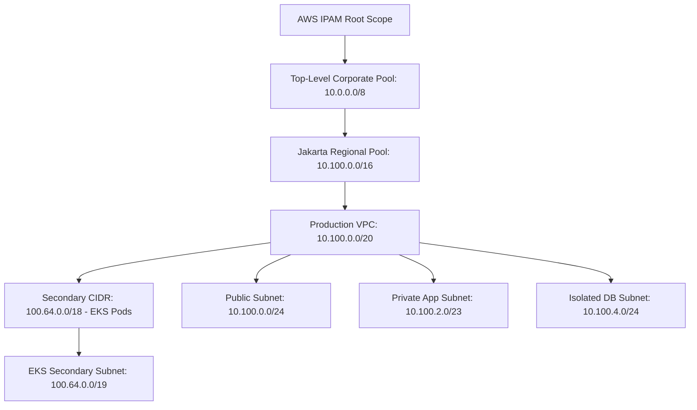

# Lab 01: Enterprise IPAM & Multi-Tier VPC with Secondary RFC 6598 CIDRs

<BadgeLabel type="sme" text="Terraform IaC" /> <BadgeLabel type="aws" text="AWS IPAM & VPC" />

Lab ini menyediakan blueprint **Infrastructure as Code (IaC) Terraform** untuk men-deploy arsitektur IPAM enterprise multi-tier dan alokasi *Carrier-Grade NAT (RFC 6598 `100.64.0.0/10`)* untuk Pod Kubernetes EKS.

---

## 🏗️ Arsitektur yang Di-deploy



---

## 📂 Lokasi File Kode Terraform

Kode sumber lengkap tersedia langsung di dalam repositori:
👉 [labs/01-enterprise-ipam-vpc/](file:///Users/robertusnegoro/workingdir/repo/cloud-network-learning-materials/labs/01-enterprise-ipam-vpc/)

### Menjalankan Deployment:

```bash
cd labs/01-enterprise-ipam-vpc
terraform init
terraform plan
terraform apply
```
