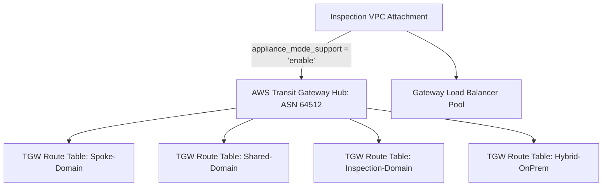

# Lab 02: TGW Hub & Central GWLB with Appliance Mode Enabled

<BadgeLabel type="sme" text="Terraform IaC" /> <BadgeLabel type="aws" text="TGW & GWLB Appliance Mode" />

Lab ini mengonfigurasi **AWS Transit Gateway (TGW)** dengan 4 *Route Table Domains* terisolasi dan mengaktifkan fitur kritis **Appliance Mode** pada attachment *Inspection VPC*.

---

## 🏗️ Arsitektur yang Di-deploy



---

## 📂 Lokasi File Kode Terraform

Kode sumber lengkap tersedia di:
👉 [labs/02-tgw-gwlb-appliance-mode/](file:///Users/robertusnegoro/workingdir/repo/cloud-network-learning-materials/labs/02-tgw-gwlb-appliance-mode/)

### Menjalankan Deployment:

```bash
cd labs/02-tgw-gwlb-appliance-mode
terraform init
terraform plan
terraform apply
```
