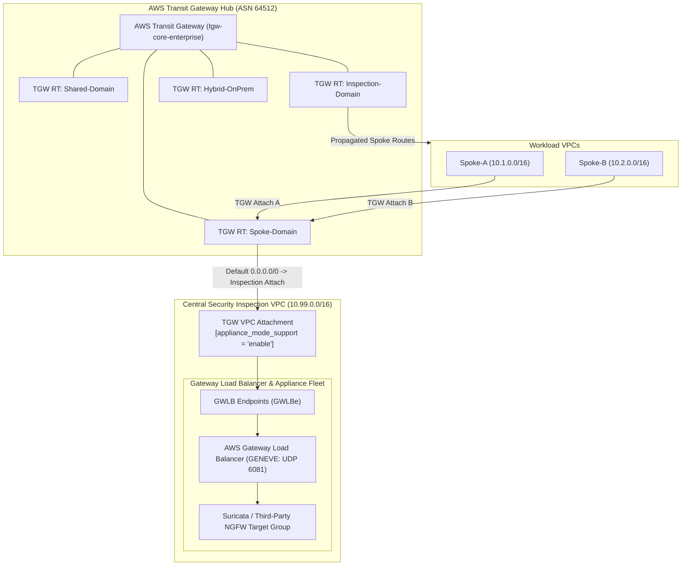

# Lab 02: TGW Hub & Central GWLB with Appliance Mode Enabled

<BadgeLabel type="sme" text="Level: Principal / SME" /> <BadgeLabel type="aws" text="TGW & GWLB Appliance Mode" /> <BadgeLabel type="lab" text="Hands-on IaC Blueprint" />

Dalam lab skala enterprise ini, Anda akan merancang dan mengonfigurasi arsitektur inspeksi keamanan terpusat (*Centralized Security Inspection Architecture*) menggunakan **AWS Transit Gateway (TGW)** dengan 4 *Route Table Domains* terisolasi dan **AWS Gateway Load Balancer (GWLB)** yang menaungi kluster *Next-Generation Firewall (NGFW) / Suricata*. Anda akan mendalami dan mengaktifkan fitur paling kritis dalam arsitektur firewall multi-AZ: **TGW Appliance Mode**, untuk mengeliminasi kegagalan *Asymmetric Routing* dan *TCP state drop*.

---

## Arsitektur Topology Lab



---

## 📂 Lokasi Kode Sumber Terraform

Repositori ini menyertakan blueprint Terraform siap pakai:
👉 [labs/02-tgw-gwlb-appliance-mode/](https://github.com/robertusnegoro/cloud-network-learning-materials/tree/main/labs/02-tgw-gwlb-appliance-mode/)

```bash
cd labs/02-tgw-gwlb-appliance-mode
terraform init
terraform plan
terraform apply
```

---

## 🛠️ Modul Pelaksanaan Langkah-demi-Langkah (6-Point Blueprint)

---

### Step 1: Provisioning Enterprise AWS Transit Gateway (TGW) Hub

#### 1. Architectural Intent
AWS Transit Gateway bertindak sebagai *Cloud Router Hub* sentral untuk menghubungkan ribuan VPC dan jaringan on-premises. Secara *default*, TGW mengaktifkan asosiasi dan propagasi rute otomatis ke satu tabel rute tunggal (*flat mesh*). Dalam arsitektur enterprise, fitur ini **wajib dinonaktifkan** (`default_route_table_association = "disable"` dan `default_route_table_propagation = "disable"`) untuk mencegah *accidental route leaking* antar lingkungan (*production, development, PCI-DSS*), serta menegakkan isolasi *zero-trust network segmentation*.

#### 2. AWS Console Context & Parameter Mapping
* **Navigasi Konsol**: Buka **VPC Console** ➔ pilih menu **Transit Gateways** ➔ klik **Create transit gateway**.
* **Parameter Mapping**:
  * **Name tag**: `tgw-core-enterprise`.
  * **Amazon side ASN**: `64512` (Private BGP Autonomous System Number).
  * **Default route table association**: `Disable` (Uncheck).
  * **Default route table propagation**: `Disable` (Uncheck).
  * **Auto accept shared attachments**: `Enable` (Untuk integrasi lintas akun AWS RAM).
  * **DNS support**: `Enable`.
  * **Multicast support**: `Disable`.

#### 3. Human-Readable Production AWS CLI
Buat instance TGW enterprise dengan konfigurasi isolasi rute:

```bash
TGW_ID=$(aws ec2 create-transit-gateway \
    --description "Core Enterprise Transit Gateway Hub" \
    --options \
        AmazonSideAsn=64512,\
        AutoAcceptSharedAttachments=enable,\
        DefaultRouteTableAssociation=disable,\
        DefaultRouteTablePropagation=disable,\
        DnsSupport=enable,\
        VpnEcmpSupport=enable \
    --tag-specifications "ResourceType=transit-gateway,Tags=[{Key=Name,Value=tgw-core-enterprise},{Key=Environment,Value=Production}]" \
    --query 'TransitGateway.TransitGatewayId' \
    --output text)
```

| Flag CLI | Penjelasan Parameter |
| :--- | :--- |
| `AmazonSideAsn=64512` | ASN BGP privat 2-byte untuk sesi peering Direct Connect Gateway / eBGP. |
| `DefaultRouteTableAssociation=disable` | Mencegah VPC attachment otomatis terhubung ke default route table tanpa audit keamanan. |
| `DefaultRouteTablePropagation=disable` | Mencegah penyebaran prefiks rute otomatis antar domain segmentasi. |

#### 4. Declarative Terraform IaC
```hcl
# Core Enterprise Transit Gateway Hub
resource "aws_ec2_transit_gateway" "core_tgw" {
  description                     = "Core Enterprise Transit Gateway Hub"
  amazon_side_asn                 = 64512
  default_route_table_association = "disable"
  default_route_table_propagation = "disable"
  auto_accept_shared_attachments  = "enable"
  dns_support                     = "enable"
  vpn_ecmp_support                = "enable"

  tags = {
    Name        = "tgw-core-enterprise"
    Environment = "Production"
    ManagedBy   = "Terraform"
  }
}
```

#### 5. Under-the-Hood Mechanics
Di layer fisik AWS Data Center, pembuatan TGW menginisialisasi partisi *Software Defined Network Overlay* berbasis protokol enkapsulasi kustom berkecepatan tinggi pada armada kartu *AWS Nitro*. TGW tidak memiliki *single point of failure* atau hambatan throughput fisik; kontroler mendistribusikan kapasitas *Forwarding Engine* secara elastis melintasi seluruh Availability Zone di region tersebut dengan kapasitas hingga puluhan Terabit per detik.

#### 6. Verification Smoke Test
Periksa status kesiapan operasional TGW instance:

```bash
aws ec2 describe-transit-gateways \
    --transit-gateway-ids "$TGW_ID" \
    --query 'TransitGateways[*].[TransitGatewayId,State,Options.AmazonSideAsn,Options.DefaultRouteTableAssociation]' \
    --output table
```

**Output Verifikasi Sukses:**
```text
-------------------------------------------------------------------------
|                        DescribeTransitGateways                        |
+------------------------+------------+------------+--------------------+
|  tgw-0123456789abcdef0 |  available |  64512     |  disable           |
+------------------------+------------+------------+--------------------+
```

---

### Step 2: Constructing 4 Segmented TGW Route Table Domains

#### 1. Architectural Intent
Untuk menerapkan segmentasi jaringan makro (*Network Macro-Segmentation*), arsitektur enterprise membagi routing TGW menjadi 4 domain virtual (*VRF - Virtual Routing and Forwarding equivalent*):
1. **Spoke Domain RT**: Domain beban kerja produksi/pengembangan. Seluruh trafik keluar diarahkan ke *Inspection VPC*.
2. **Shared Services Domain RT**: Domain infrastruktur bersama (AD, DNS, CI/CD, Registry).
3. **Inspection Domain RT**: Domain inspeksi keamanan. Menerima rute propagasi dari seluruh Spoke dan On-Premises.
4. **Hybrid On-Prem Domain RT**: Domain konektivitas hybrid (Direct Connect / VPN).

#### 2. AWS Console Context & Parameter Mapping
* **Navigasi Konsol**: Buka **VPC Console** ➔ **Transit Gateway Route Tables** ➔ klik **Create transit gateway route table**.
* **Parameter Mapping**:
  * **Transit Gateway ID**: Pilih `tgw-core-enterprise`.
  * Buat 4 Route Table berturut-turut dengan nama tag:
    1. `tgw-rtb-spoke-domain`
    2. `tgw-rtb-shared-domain`
    3. `tgw-rtb-inspection-domain`
    4. `tgw-rtb-hybrid-onprem`

#### 3. Human-Readable Production AWS CLI
Buat 4 Route Table Domain pada TGW:

```bash
# 1. Spoke Domain Route Table
RTB_SPOKE=$(aws ec2 create-transit-gateway-route-table \
    --transit-gateway-id "$TGW_ID" \
    --tag-specifications "ResourceType=transit-gateway-route-table,Tags=[{Key=Name,Value=tgw-rtb-spoke-domain}]" \
    --query 'TransitGatewayRouteTable.TransitGatewayRouteTableId' --output text)

# 2. Shared Domain Route Table
RTB_SHARED=$(aws ec2 create-transit-gateway-route-table \
    --transit-gateway-id "$TGW_ID" \
    --tag-specifications "ResourceType=transit-gateway-route-table,Tags=[{Key=Name,Value=tgw-rtb-shared-domain}]" \
    --query 'TransitGatewayRouteTable.TransitGatewayRouteTableId' --output text)

# 3. Inspection Domain Route Table
RTB_INSPECT=$(aws ec2 create-transit-gateway-route-table \
    --transit-gateway-id "$TGW_ID" \
    --tag-specifications "ResourceType=transit-gateway-route-table,Tags=[{Key=Name,Value=tgw-rtb-inspection-domain}]" \
    --query 'TransitGatewayRouteTable.TransitGatewayRouteTableId' --output text)

# 4. Hybrid On-Prem Domain Route Table
RTB_ONPREM=$(aws ec2 create-transit-gateway-route-table \
    --transit-gateway-id "$TGW_ID" \
    --tag-specifications "ResourceType=transit-gateway-route-table,Tags=[{Key=Name,Value=tgw-rtb-hybrid-onprem}]" \
    --query 'TransitGatewayRouteTable.TransitGatewayRouteTableId' --output text)
```

| Flag CLI | Penjelasan Parameter |
| :--- | :--- |
| `--transit-gateway-id` | ID TGW induk pemilik tabel rute domain. |
| `--tag-specifications` | Label identifikasi domain rute untuk tata kelola IaC. |

#### 4. Declarative Terraform IaC
```hcl
# Four Isolated TGW Route Table Domains (VRFs)
resource "aws_ec2_transit_gateway_route_table" "spoke_rtb" {
  transit_gateway_id = aws_ec2_transit_gateway.core_tgw.id
  tags               = { Name = "tgw-rtb-spoke-domain" }
}

resource "aws_ec2_transit_gateway_route_table" "shared_rtb" {
  transit_gateway_id = aws_ec2_transit_gateway.core_tgw.id
  tags               = { Name = "tgw-rtb-shared-domain" }
}

resource "aws_ec2_transit_gateway_route_table" "inspection_rtb" {
  transit_gateway_id = aws_ec2_transit_gateway.core_tgw.id
  tags               = { Name = "tgw-rtb-inspection-domain" }
}

resource "aws_ec2_transit_gateway_route_table" "onprem_rtb" {
  transit_gateway_id = aws_ec2_transit_gateway.core_tgw.id
  tags               = { Name = "tgw-rtb-hybrid-onprem" }
}
```

#### 5. Under-the-Hood Mechanics
Setiap *TGW Route Table* mewakili *Forwarding Information Base (FIB)* yang terisolasi secara kriptografis dan memori di dalam kontroler TGW. Pemisahan ini menjamin bahwa paket dari Spoke VPC yang masuk ke TGW tidak akan pernah memiliki visibilitas terhadap prefiks jaringan On-Premises atau VPC lain kecuali jika rute tersebut diekspos secara eksplisit melalui aturan asosiasi (*Association*) atau propagasi (*Propagation*).

#### 6. Verification Smoke Test
Tampilkan seluruh tabel rute TGW yang berhasil dibuat:

```bash
aws ec2 describe-transit-gateway-route-tables \
    --filters "Name=transit-gateway-id,Values=$TGW_ID" \
    --query 'TransitGatewayRouteTables[*].[TransitGatewayRouteTableId,State,Tags[?Key==`Name`].Value|[0]]' \
    --output table
```

**Output Verifikasi Sukses:**
```text
----------------------------------------------------------------------
|                  DescribeTransitGatewayRouteTables                 |
+--------------------------+------------+----------------------------+
|  tgw-rtb-0aaa1111111111  |  available |  tgw-rtb-spoke-domain      |
|  tgw-rtb-0bbb2222222222  |  available |  tgw-rtb-shared-domain     |
|  tgw-rtb-0ccc3333333333  |  available |  tgw-rtb-inspection-domain |
|  tgw-rtb-0ddd4444444444  |  available |  tgw-rtb-hybrid-onprem     |
+--------------------------+------------+----------------------------+
```

---

### Step 3: Provisioning Inspection VPC & TGW Attachment with Appliance Mode

#### 1. Architectural Intent
Pada arsitektur inspeksi multi-AZ, lalu lintas dari Spoke VPC di AZ-A dapat menuju ke workload di AZ-B. Secara bawaan, TGW merutekan paket kembali melalui AZ asal sumber (*source AZ affinity*), yang mengakibatkan paket pergi (*forward flow*) melewati Firewall di AZ-A, sementara paket balasan (*return flow / TCP ACK*) diarahkan ke Firewall di AZ-B. Hal ini menyebabkan **Asymmetric Routing Trap**, di mana Firewall di AZ-B akan men-drop paket balasan karena tidak menemukan riwayat *state table / TCP handshake* (TCP RST/Drop).

Mengaktifkan **TGW Appliance Mode** (`appliance_mode_support = "enable"`) memaksa TGW untuk mengunci aliran data dua arah (*bidirectional flow symmetric hashing*) agar selalu diproses oleh ENI attachment pada **Availability Zone yang sama persis** selama masa sesi TCP/UDP berlangsung.

#### 2. AWS Console Context & Parameter Mapping
* **Navigasi Konsol**: Buka **VPC Console** ➔ **Transit Gateway Attachments** ➔ klik **Create transit gateway attachment**.
* **Parameter Mapping**:
  * **Transit Gateway ID**: `tgw-core-enterprise`.
  * **Attachment type**: `VPC`.
  * **Attachment name**: `tgw-attach-inspection-vpc`.
  * **VPC ID**: Pilih `vpc-central-inspection` (`10.99.0.0/16`).
  * **Subnet IDs**: Pilih subnet khusus TGW Attachment di setiap AZ (`snet-tgw-attachment-aza`, dst).
  * **Appliance Mode Support**: **Wajib di-checklist (Enable)**.

#### 3. Human-Readable Production AWS CLI
Buat attachment ke Inspection VPC dengan parameter Appliance Mode diaktifkan:

```bash
# 1. Buat VPC Inspection & Subnet
INSPECT_VPC_ID=$(aws ec2 create-vpc --cidr-block 10.99.0.0/16 \
    --tag-specifications "ResourceType=vpc,Tags=[{Key=Name,Value=vpc-central-inspection}]" \
    --query 'Vpc.VpcId' --output text)

INSPECT_SNET_ID=$(aws ec2 create-subnet --vpc-id "$INSPECT_VPC_ID" \
    --cidr-block 10.99.2.0/24 --availability-zone ap-southeast-3a \
    --tag-specifications "ResourceType=subnet,Tags=[{Key=Name,Value=snet-tgw-attachment-aza}]" \
    --query 'Subnet.SubnetId' --output text)

# 2. Buat TGW VPC Attachment dengan Appliance Mode Enabled
INSPECT_ATTACH_ID=$(aws ec2 create-transit-gateway-vpc-attachment \
    --transit-gateway-id "$TGW_ID" \
    --vpc-id "$INSPECT_VPC_ID" \
    --subnet-ids "$INSPECT_SNET_ID" \
    --options ApplianceModeSupport=enable \
    --tag-specifications "ResourceType=transit-gateway-attachment,Tags=[{Key=Name,Value=tgw-attach-inspection-vpc}]" \
    --query 'TransitGatewayVpcAttachment.TransitGatewayAttachmentId' \
    --output text)
```

| Flag CLI | Penjelasan Parameter |
| :--- | :--- |
| `--options ApplianceModeSupport=enable` | Parameter arsitektur paling fundamental: mengaktifkan symmetric AZ flow hashing pada algoritma TGW data plane. |
| `--subnet-ids` | Subnet khusus attachment (minimal `/28`) yang terpisah dari subnet GWLB Endpoint. |

#### 4. Declarative Terraform IaC
```hcl
# Security / Central Inspection VPC
resource "aws_vpc" "inspection_vpc" {
  cidr_block           = "10.99.0.0/16"
  enable_dns_hostnames = true
  enable_dns_support   = true
  tags                 = { Name = "vpc-central-inspection" }
}

resource "aws_subnet" "tgw_attach_aza" {
  vpc_id            = aws_vpc.inspection_vpc.id
  cidr_block        = "10.99.2.0/24"
  availability_zone = "${var.aws_region}a"
  tags              = { Name = "snet-tgw-attachment-aza" }
}

# TGW Attachment with APPLIANCE MODE ENABLED!
resource "aws_ec2_transit_gateway_vpc_attachment" "inspection_attach" {
  transit_gateway_id = aws_ec2_transit_gateway.core_tgw.id
  vpc_id             = aws_vpc.inspection_vpc.id
  subnet_ids         = [aws_subnet.tgw_attach_aza.id]

  # CRITICAL: Appliance Mode guarantees multi-AZ symmetric firewall hashing
  appliance_mode_support = "enable"

  tags = {
    Name = "tgw-attach-inspection-vpc"
  }
}

# Route Table Association to Inspection Domain
resource "aws_ec2_transit_gateway_route_table_association" "inspection_assoc" {
  transit_gateway_attachment_id  = aws_ec2_transit_gateway_vpc_attachment.inspection_attach.id
  transit_gateway_route_table_id = aws_ec2_transit_gateway_route_table.inspection_rtb.id
}
```

#### 5. Under-the-Hood Mechanics
Ketika `ApplianceModeSupport` bernilai `disable`, TGW memilih ENI di AZ asal paket dikirim (*source AZ affinity*). Ketika diaktifkan (`enable`), algoritma hashing TGW menghitung **5-tuple (Src IP, Dst IP, Src Port, Dst Port, Protocol)** dan memilih satu ENI di Inspection VPC, lalu secara konsisten mengarahkan trafik balasan (*return traffic*) dari AZ mana pun ke ENI pada AZ yang sama. Hal ini memastikan appliance firewall stateful di AZ tersebut menerima seluruh siklus TCP (SYN, SYN-ACK, ACK, Data, FIN).

```
   [ Tanpa Appliance Mode: Asymmetric Drop ]
   Spoke-A (AZ-a) ──► TGW ──► Firewall (AZ-a) ──► TGW ──► Spoke-B (AZ-b)
                                                            │
   Spoke-A (AZ-a) ◄── TGW ◄── Firewall (AZ-b) ◄── TGW ◄─────┘
                              [ STATE DROP! ]

   [ Dengan Appliance Mode: Symmetric Inspection ]
   Spoke-A (AZ-a) ──► TGW ──► Firewall (AZ-a) ──► TGW ──► Spoke-B (AZ-b)
                                                            │
   Spoke-A (AZ-a) ◄── TGW ◄── Firewall (AZ-a) ◄── TGW ◄─────┘
                              [ STATE MATCH! ]
```

#### 6. Verification Smoke Test
Pastikan atribut `ApplianceModeSupport` aktif pada attachment:

```bash
aws ec2 describe-transit-gateway-vpc-attachments \
    --transit-gateway-attachment-ids "$INSPECT_ATTACH_ID" \
    --query 'TransitGatewayVpcAttachments[*].[TransitGatewayAttachmentId,State,Options.ApplianceModeSupport]' \
    --output table
```

**Output Verifikasi Sukses:**
```text
------------------------------------------------------------------
|              DescribeTransitGatewayVpcAttachments              |
+--------------------------+------------+------------------------+
|  tgw-attach-0123456789a  |  available |  enable                |
+--------------------------+------------+------------------------+
```

---

### Step 4: Deploying Gateway Load Balancer (GWLB) & GENEVE Endpoint Fleet

#### 1. Architectural Intent
**AWS Gateway Load Balancer (GWLB)** menggabungkan fungsi *Transparent Layer 3 Gateway* dan *Layer 4 Load Balancer*. GWLB menggunakan protokol enkapsulasi **GENEVE (Generic Network Virtualization Encapsulation)** pada port UDP `6081` untuk membungkus seluruh paket IP asli (termasuk header L3/L4 dan payload). Hal ini memungkinkan appliance firewall pihak ketiga (Palo Alto VM-Series, Fortinet FortiGate, CheckPoint, atau Suricata IDS/IPS) memeriksa paket secara transparan tanpa perlu melakukan Source NAT (SNAT).

#### 2. AWS Console Context & Parameter Mapping
* **Navigasi Konsol**: Buka **EC2 Console** ➔ **Load Balancers** ➔ klik **Create load balancer** ➔ pilih tipe **Gateway Load Balancer**.
* **Parameter Mapping**:
  * **Name**: `gwlb-central-firewall`.
  * **VPC**: `vpc-central-inspection`.
  * **Subnets**: Pilih subnet khusus GWLB (`snet-gwlb-aza`).
  * **Target Group**: Protokol `GENEVE`, Port `6081`.

#### 3. Human-Readable Production AWS CLI
Provisi Gateway Load Balancer dan Subnet khusus:

```bash
# 1. Subnet khusus GWLB
GWLB_SNET_ID=$(aws ec2 create-subnet --vpc-id "$INSPECT_VPC_ID" \
    --cidr-block 10.99.1.0/24 --availability-zone ap-southeast-3a \
    --tag-specifications "ResourceType=subnet,Tags=[{Key=Name,Value=snet-gwlb-aza}]" \
    --query 'Subnet.SubnetId' --output text)

# 2. Buat Target Group untuk protokol GENEVE (Port 6081)
TG_GWLB_ARN=$(aws elbv2 create-target-group \
    --name tg-gwlb-suricata \
    --protocol GENEVE \
    --port 6081 \
    --vpc-id "$INSPECT_VPC_ID" \
    --health-check-protocol TCP \
    --health-check-port 80 \
    --query 'TargetGroups[0].TargetGroupArn' --output text)

# 3. Buat Gateway Load Balancer
GWLB_ARN=$(aws elbv2 create-load-balancer \
    --name gwlb-central-firewall \
    --type gateway \
    --subnets "$GWLB_SNET_ID" \
    --tags Key=Name,Value=gwlb-central-firewall \
    --query 'LoadBalancers[0].LoadBalancerArn' --output text)

# 4. Buat Listener GENEVE pada GWLB
aws elbv2 create-listener \
    --load-balancer-arn "$GWLB_ARN" \
    --default-actions Type=forward,TargetGroupArn="$TG_GWLB_ARN"
```

| Flag CLI | Penjelasan Parameter |
| :--- | :--- |
| `--type gateway` | Menetapkan jenis load balancer sebagai GWLB Layer 3 gateway. |
| `--protocol GENEVE --port 6081` | Standar enkapsulasi IETF RFC 8926 yang membawa metadata flow (TLV options). |

#### 4. Declarative Terraform IaC
```hcl
# Subnet khusus GWLB
resource "aws_subnet" "gwlb_aza" {
  vpc_id            = aws_vpc.inspection_vpc.id
  cidr_block        = "10.99.1.0/24"
  availability_zone = "${var.aws_region}a"
  tags              = { Name = "snet-gwlb-aza" }
}

# Gateway Load Balancer
resource "aws_lb" "gwlb" {
  name               = "gwlb-central-firewall"
  load_balancer_type = "gateway"
  subnets            = [aws_subnet.gwlb_aza.id]
  tags               = { Name = "gwlb-central-firewall" }
}

# GENEVE Target Group
resource "aws_lb_target_group" "gwlb_tg" {
  name        = "tg-gwlb-suricata"
  protocol    = "GENEVE"
  port        = 6081
  vpc_id      = aws_vpc.inspection_vpc.id
  target_type = "instance"

  health_check {
    protocol = "TCP"
    port     = "80"
  }
}

# GWLB Listener
resource "aws_lb_listener" "gwlb_listener" {
  load_balancer_arn = aws_lb.gwlb.arn

  default_action {
    type             = "forward"
    target_group_arn = aws_lb_target_group.gwlb_tg.arn
  }
}
```

#### 5. Under-the-Hood Mechanics
Di level underlay Hyperplane, GWLB membungkus frame Ethernet asli dengan header GENEVE:
* Outer IP Header: Source = GWLB IP, Destination = Firewall Appliance IP.
* Outer UDP Header: Destination Port = `6081`.
* GENEVE Option Header (TLV - Type-Length-Value): Membawa metadata internal AWS (Eni-ID, Flow-Cookie, dan Attachment-ID).
* Inner Packet: IP Header asli pengirim dan penerima tanpa modifikasi bit sedikit pun.

Setelah firewall memeriksa paket dan mengizinkannya, firewall mengirimkan paket kembali ke GWLB melalui terowongan GENEVE yang sama.

#### 6. Verification Smoke Test
Periksa status ketersediaan GWLB dan listener:

```bash
aws elbv2 describe-load-balancers \
    --load-balancer-arns "$GWLB_ARN" \
    --query 'LoadBalancers[*].[LoadBalancerName,State.Code,Type,VpcId]' \
    --output table
```

**Output Verifikasi Sukses:**
```text
-----------------------------------------------------------------------------------
|                              DescribeLoadBalancers                              |
+------------------------+----------+----------+----------------------------------+
|  gwlb-central-firewall |  active  |  gateway |  vpc-039482018402910ba           |
+------------------------+----------+----------+----------------------------------+
```

---

### Step 5: End-to-End Routing & Firewall Inspection Packet Flow Walkthrough

#### 1. Architectural Intent
Langkah terakhir adalah merajut seluruh alur lalu lintas (*Traffic Steering*). Semua trafik antar Spoke (East-West) maupun trafik keluar menuju Internet/On-Prem (North-South) pada `tgw-rtb-spoke-domain` dipaksa menuju rute default `0.0.0.0/0` dengan target `tgw-attach-inspection-vpc`. Di dalam Inspection VPC, tabel rute mengarahkan paket ke GWLB Endpoint (GWLBe) untuk didekapsulasi dan dianalisis oleh Suricata NGFW sebelum dikembalikan ke TGW untuk diteruskan ke Spoke tujuan.

#### 2. AWS Console Context & Parameter Mapping
* **Navigasi Konsol**: Buka **VPC Console** ➔ **Transit Gateway Route Tables** ➔ pilih `tgw-rtb-spoke-domain` ➔ tab **Routes** ➔ klik **Create static route**.
* **Parameter Mapping**:
  * **CIDR**: `0.0.0.0/0`.
  * **Attachment**: Pilih `tgw-attach-inspection-vpc`.

#### 3. Human-Readable Production AWS CLI
Tambahkan static route default pada Spoke Route Table:

```bash
aws ec2 create-transit-gateway-route \
    --destination-cidr-block 0.0.0.0/0 \
    --transit-gateway-route-table-id "$RTB_SPOKE" \
    --transit-gateway-attachment-id "$INSPECT_ATTACH_ID" \
    --query 'Route.[DestinationCidrBlock,State,Type]' \
    --output table
```

| Flag CLI | Penjelasan Parameter |
| :--- | :--- |
| `--destination-cidr-block 0.0.0.0/0` | Rule catch-all untuk mengarahkan seluruh lalu lintas inter-spoke dan egress ke firewall. |
| `--transit-gateway-attachment-id` | Target penyerahan paket yaitu Inspection VPC Attachment dengan Appliance Mode. |

#### 4. Declarative Terraform IaC
```hcl
# Default Route from Spoke Domain to Central Inspection Attachment
resource "aws_ec2_transit_gateway_route" "spoke_default_to_inspection" {
  destination_cidr_block         = "0.0.0.0/0"
  transit_gateway_route_table_id = aws_ec2_transit_gateway_route_table.spoke_rtb.id
  transit_gateway_attachment_id  = aws_ec2_transit_gateway_vpc_attachment.inspection_attach.id
}
```

#### 5. Under-the-Hood Mechanics
Mari telusuri siklus lengkap paket dari **Spoke-A (`10.1.1.10`)** menuju **Spoke-B (`10.2.1.20`)**:
1. Host di Spoke-A mengirim TCP SYN ke `10.2.1.20`. Route Table Subnet Spoke-A mencocokkan rute `10.2.0.0/16` ➔ diarahkan ke `tgw-attach-spoke-a`.
2. TGW memproses paket pada `tgw-rtb-spoke-domain`. Rute paling spesifik adalah default `0.0.0.0/0` ➔ diarahkan ke `tgw-attach-inspection-vpc`.
3. Karena **Appliance Mode aktif**, TGW menghitung flow hash dan mengirim paket ke ENI Attachment di AZ-A.
4. Route Table Subnet TGW Attachment di Inspection VPC meneruskan paket ke `gwlbe-aza`.
5. GWLB membungkus paket dalam GENEVE (port 6081) dan mengirimkannya ke EC2 Suricata/NGFW.
6. Suricata memeriksa signature IDS/IPS, mengizinkan paket, dan mengembalikannya ke GWLB.
7. GWLB Endpoint meneruskan paket ke TGW.
8. TGW mengevaluasi paket pada `tgw-rtb-inspection-domain` yang memiliki rute propagasi `10.2.0.0/16` ➔ diteruskan langsung ke `tgw-attach-spoke-b`.
9. Paket TCP SYN tiba di host Spoke-B secara aman dan utuh.

#### 6. Verification Smoke Test
Validasi entri rute pada Spoke Route Table:

```bash
aws ec2 search-transit-gateway-routes \
    --transit-gateway-route-table-id "$RTB_SPOKE" \
    --filters "Name=state,Values=active" \
    --query 'Routes[*].[DestinationCidrBlock,TransitGatewayAttachments[0].TransitGatewayAttachmentId,Type,State]' \
    --output table
```

**Output Verifikasi Sukses:**
```text
--------------------------------------------------------------------------------
|                          SearchTransitGatewayRoutes                          |
+------------+--------------------------------+--------+-----------------------+
|  0.0.0.0/0 |  tgw-attach-0123456789abcdef0  | static |  active               |
+------------+--------------------------------+--------+-----------------------+
```

---

::: tip STANDAR BEST PRACTICE INDUSTRI (SME RECOMMENDATION)
1. **Subnet Khusus TGW Attachment**: Buat subnet `/28` terisolasi khusus untuk TGW Attachment di Inspection VPC. Jangan pernah menempatkan beban kerja atau GWLBe di subnet yang sama dengan TGW Attachment untuk mencegah *Routing Loops*.
2. **Appliance Mode Wajib**: Selalu aktifkan Appliance Mode pada Security Inspection VPC Attachment. Menonaktifkannya adalah akar penyebab nomor 1 insiden *intermittent connection drops* pada firewall stateful di AWS.
3. **Cross-Zone Load Balancing GWLB**: Nonaktifkan Cross-Zone pada GWLB jika ingin menjaga isolasi trafik per Availability Zone murni untuk mengurangi biaya transfer data inter-AZ.
:::
