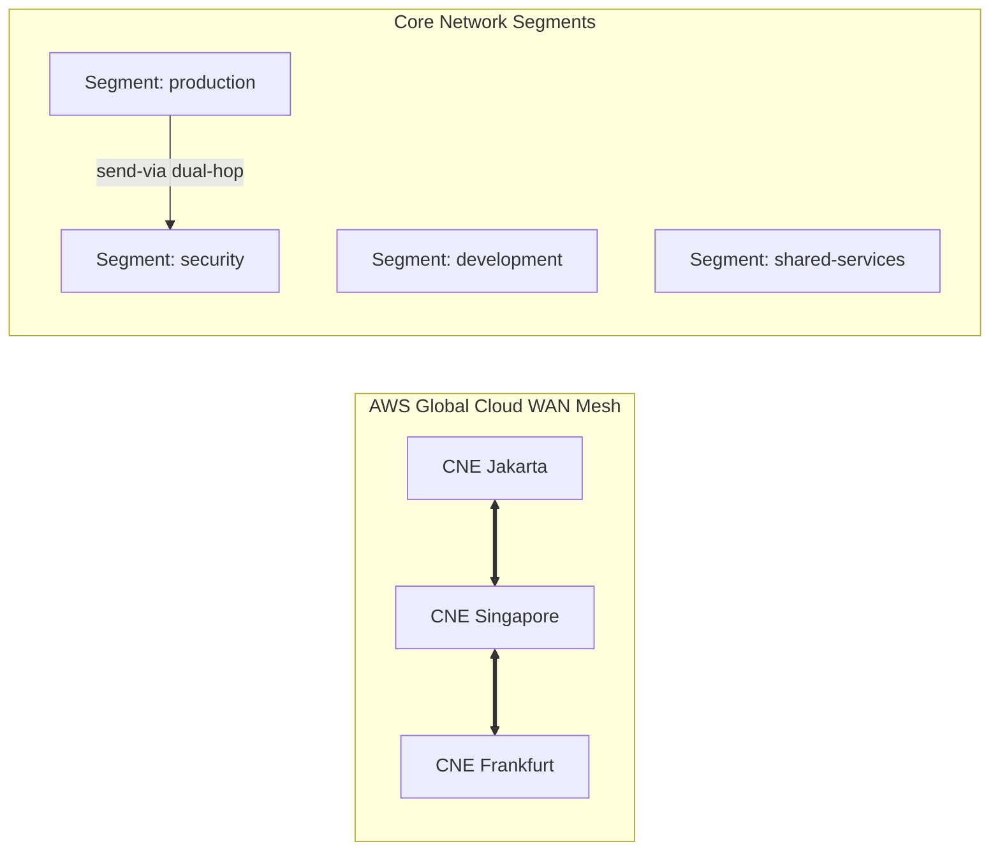

# Lab 03: AWS Cloud WAN Global SD-WAN Mesh & Core Network Policy

<BadgeLabel type="sme" text="Terraform IaC" /> <BadgeLabel type="aws" text="Cloud WAN SD-WAN" />

Lab ini mengotomatisasi provisi jaringan global multi-region melintasi Jakarta (`ap-southeast-3`), Singapore (`ap-southeast-1`), dan Frankfurt (`eu-central-1`) menggunakan **AWS Cloud WAN** dan dokumen deklaratif **Core Network Policy (CNP)**.

---

## 🏗️ Arsitektur yang Di-deploy



---

## 📂 Lokasi File Kode Terraform

Kode sumber lengkap tersedia di:
👉 [labs/03-cloud-wan-core-network/](file:///Users/robertusnegoro/workingdir/repo/cloud-network-learning-materials/labs/03-cloud-wan-core-network/)

### Menjalankan Deployment:

```bash
cd labs/03-cloud-wan-core-network
terraform init
terraform plan
terraform apply
```
