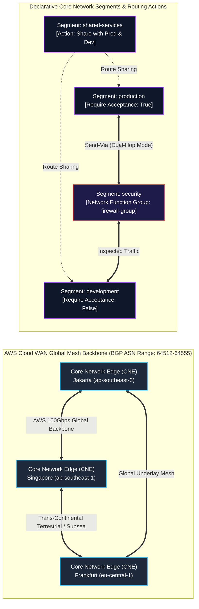

# Lab 03: AWS Cloud WAN Global SD-WAN Mesh & Core Network Policy

<BadgeLabel type="sme" text="Level: Principal / SME" /> <BadgeLabel type="aws" text="Cloud WAN SD-WAN" /> <BadgeLabel type="lab" text="Hands-on IaC Blueprint" />

Dalam lab skala enterprise global ini, Anda akan merancang dan mengotomatisasi jaringan tulang punggung (*Global Backbone SD-WAN Mesh*) yang menghubungkan tiga AWS Region: **Jakarta (`ap-southeast-3`)**, **Singapore (`ap-southeast-1`)**, dan **Frankfurt (`eu-central-1`)** menggunakan **AWS Cloud WAN**. Anda akan membangun arsitektur jaringan berbasis kebijakan deklaratif (*Policy-as-Code*) menggunakan **Core Network Policy (CNP)** format JSON untuk mengelola 4 segmen jaringan terisolasi, segment sharing, dan inspeksi firewall *dual-hop* otomatis melalui fitur mutakhir **Send-Via Network Function Groups (NFG)**.

---

## Arsitektur Topology Lab



---

## 📂 Lokasi Kode Sumber Terraform

Repositori ini menyertakan kode Terraform lengkap yang siap di-deploy:
👉 [labs/03-cloud-wan-core-network/](file:///Users/robertusnegoro/workingdir/repo/cloud-network-learning-materials/labs/03-cloud-wan-core-network/)

```bash
cd labs/03-cloud-wan-core-network
terraform init
terraform plan
terraform apply
```

---

## 🛠️ Modul Pelaksanaan Langkah-demi-Langkah (6-Point Blueprint)

---

### Step 1: Provisioning Global Network in AWS Network Manager

#### 1. Architectural Intent
Ketika mengelola jaringan enterprise yang tersebar di berbagai belahan dunia, mengonfigurasi inter-region peering manual antar Transit Gateway (TGW Peering Mesh) memicu kompleksitas kuadratik $O(N^2)$ dan overhead operasional yang sangat tinggi. **AWS Network Manager Global Network** bertindak sebagai *Single Pane of Glass* dan kontainer kontrol global untuk mengorkestrasi, memantau telemetri, dan memvisualisasikan seluruh topologi hybrid WAN perusahaan.

#### 2. AWS Console Context & Parameter Mapping
* **Navigasi Konsol**: Buka **Network Manager Console** ➔ pilih menu **Global networks** ➔ klik **Create global network**.
* **Parameter Mapping**:
  * **Name**: `global-network-core`.
  * **Description**: `Enterprise Global SD-WAN Core`.
  * **Tags**: `Environment` = `Enterprise-Production`.

#### 3. Human-Readable Production AWS CLI
Buat instance Global Network di AWS Network Manager:

```bash
GLOBAL_NET_ID=$(aws networkmanager create-global-network \
    --description "Enterprise Global SD-WAN Core" \
    --tags Key=Name,Value=global-network-core,Key=Environment,Value=Production \
    --query 'GlobalNetwork.GlobalNetworkId' \
    --output text)
```

| Flag CLI | Penjelasan Parameter |
| :--- | :--- |
| `create-global-network` | Menginisialisasi kontainer root manajemen jaringan global pada AWS Network Manager. |
| `--tags` | Label metadata untuk agregasi telemetri biaya dan tata kelola keamanan. |

#### 4. Declarative Terraform IaC
```hcl
# AWS Network Manager Global Network
resource "aws_networkmanager_global_network" "global_net" {
  description = "Enterprise Global SD-WAN Core"
  tags = {
    Name        = "global-network-core"
    Environment = "Production"
    ManagedBy   = "Terraform"
  }
}
```

#### 5. Under-the-Hood Mechanics
Di balik layar, AWS Network Manager membuat entri basis data graph global di kontrol terdistribusi AWS. Objek ini tidak memiliki data plane fisik langsung, melainkan berfungsi sebagai *Control Plane Orchestrator* yang mengoordinasikan API regional di seluruh benua dan mengagregasikan log aliran jaringan (*telemetry ingestion*).

#### 6. Verification Smoke Test
Periksa ketersediaan Global Network instance:

```bash
aws networkmanager describe-global-networks \
    --global-network-ids "$GLOBAL_NET_ID" \
    --query 'GlobalNetworks[*].[GlobalNetworkId,State,Description]' \
    --output table
```

**Output Verifikasi Sukses:**
```text
-----------------------------------------------------------------------------
|                          DescribeGlobalNetworks                           |
+--------------------------+------------+-----------------------------------+
|  global-network-0123456  |  AVAILABLE |  Enterprise Global SD-WAN Core    |
+--------------------------+------------+-----------------------------------+
```

---

### Step 2: Core Network Initialization & Regional Edge Location Topology

#### 1. Architectural Intent
**AWS Cloud WAN Core Network** adalah fondasi backbone global terkelola (*managed global backbone*). Dengan menentukan daftar **Edge Locations** (region AWS tempat bisnis beroperasi: Jakarta, Singapore, Frankfurt) dan rentang nomor sistem otonom (**ASN Ranges: `64512-64555`**), Cloud WAN secara otomatis membangun simpul **Core Network Edge (CNE)** di setiap region dan mengoneksikannya melalui jaringan serat optik pribadi 100+ Gbps milik AWS (*AWS Global Dedicated Fiber Backbone*).

#### 2. AWS Console Context & Parameter Mapping
* **Navigasi Konsol**: Buka **Network Manager Console** ➔ **Core networks** ➔ klik **Create core network**.
* **Parameter Mapping**:
  * **Global network**: Pilih `global-network-core`.
  * **Core network name**: `core-network-wan`.
  * **BGP ASN ranges**: Masukkan `64512-64555`.
  * **Edge locations**: Tambahkan `ap-southeast-3` (Jakarta), `ap-southeast-1` (Singapore), dan `eu-central-1` (Frankfurt).

#### 3. Human-Readable Production AWS CLI
Inisialisasi Core Network dengan konfigurasi Edge multi-region:

```bash
CORE_NET_ID=$(aws networkmanager create-core-network \
    --global-network-id "$GLOBAL_NET_ID" \
    --description "Multi-Region Cloud WAN Mesh Backbone" \
    --tags Key=Name,Value=core-network-wan \
    --query 'CoreNetwork.CoreNetworkId' \
    --output text)
```

| Flag CLI | Penjelasan Parameter |
| :--- | :--- |
| `--global-network-id` | Mengikat Core Network ke dalam Global Network Manager induk. |
| `create-core-network` | Menginstansiasi mesin orkestrasi backbone Cloud WAN. |

#### 4. Declarative Terraform IaC
```hcl
# AWS Cloud WAN Core Network
resource "aws_networkmanager_core_network" "core_wan" {
  global_network_id   = aws_networkmanager_global_network.global_net.id
  description         = "Multi-Region Cloud WAN Mesh Backbone"
  create_base_policy  = false # Dikontrol secara deklaratif via policy_document

  tags = {
    Name        = "core-network-wan"
    Environment = "Production"
  }
}
```

#### 5. Under-the-Hood Mechanics
Ketika Edge Locations didefinisikan, AWS secara otomatis men-deploy sepasang node kontrol dan forwarding berkapasitas tinggi di setiap region yang dipilih (CNE Jakarta, CNE Singapore, CNE Frankfurt). CNE-CNE ini secara otomatis menjalin sesi internal **Multi-Protocol BGP (MP-BGP)** melalui *AWS Global Backbone Overlay*, mengeliminasi kebutuhan mengonfigurasi IPsec VPN atau peering manual antar region secara total.

#### 6. Verification Smoke Test
Periksa status inisialisasi Core Network:

```bash
aws networkmanager get-core-network \
    --core-network-id "$CORE_NET_ID" \
    --query 'CoreNetwork.[CoreNetworkId,State,GlobalNetworkId]' \
    --output table
```

**Output Verifikasi Sukses:**
```text
-----------------------------------------------------------------------
|                           GetCoreNetwork                            |
+------------------------+------------+-------------------------------+
|  core-network-09876543 |  AVAILABLE |  global-network-0123456       |
+------------------------+------------+-------------------------------+
```

---

### Step 3: Crafting Declarative Core Network Policy (CNP) JSON & Segment Isolation

#### 1. Architectural Intent
Keunggulan utama Cloud WAN adalah paradigma **Policy-as-Code**. Seluruh topologi perutean, segmentasi keamanan, dan aturan propagasi didefinisikan dalam satu dokumen deklaratif JSON yang disebut **Core Network Policy (CNP)**. Dalam arsitektur ini, kita membuat 4 segmen jaringan terisolasi:
1. `production`: Beban kerja inti dengan kontrol persetujuan ketat (*attachment acceptance*).
2. `development`: Beban kerja non-produksi dengan alokasi otomatis tanpa persetujuan manual.
3. `shared-services`: Layanan bersama (DNS, Active Directory, Artifact Repo).
4. `security`: Hub inspeksi terpusat tempat firewall NGFW/Suricata berada.

#### 2. AWS Console Context & Parameter Mapping
* **Navigasi Konsol**: Buka **Network Manager Console** ➔ **Core networks** ➔ pilih `core-network-wan` ➔ tab **Policy** ➔ klik **Create policy version**.
* **Parameter Mapping**:
  * Pilih **JSON Editor**.
  * Masukkan dokumen JSON yang mendefinisikan `segments`, `asn-ranges`, dan `edge-locations`.

#### 3. Human-Readable Production AWS CLI
Upload versi Core Network Policy ke Cloud WAN:

```bash
cat << 'EOF' > cnp-policy.json
{
  "version": "2021.12",
  "core-network-configuration": {
    "asn-ranges": ["64512-64555"],
    "edge-locations": [
      { "location": "ap-southeast-3" },
      { "location": "ap-southeast-1" },
      { "location": "eu-central-1" }
    ]
  },
  "segments": [
    {
      "name": "production",
      "description": "Production Workloads",
      "require-attachment-acceptance": true,
      "isolate-attachments": false
    },
    {
      "name": "development",
      "description": "Development & Test Workloads",
      "require-attachment-acceptance": false,
      "isolate-attachments": false
    },
    {
      "name": "shared-services",
      "description": "Shared Services Hub",
      "require-attachment-acceptance": true
    },
    {
      "name": "security",
      "description": "Central Inspection & Egress Hub",
      "require-attachment-acceptance": true
    }
  ]
}
EOF

aws networkmanager put-core-network-policy \
    --core-network-id "$CORE_NET_ID" \
    --policy-document file://cnp-policy.json \
    --query 'CoreNetworkPolicy.[PolicyVersionId,PolicyDocument]' \
    --output json
```

| Flag CLI | Penjelasan Parameter |
| :--- | :--- |
| `put-core-network-policy` | Mengunggah draf versi kebijakan baru ke Cloud WAN policy engine. |
| `require-attachment-acceptance` | Gerbang keamanan yang mewajibkan tim Network SME menyetujui attachment sebelum aktif di segmen production. |

#### 4. Declarative Terraform IaC
```hcl
# Core Network Policy Document
resource "aws_networkmanager_core_network_policy_attachment" "core_policy" {
  core_network_id = aws_networkmanager_core_network.core_wan.id
  
  policy_document = jsonencode({
    version = "2021.12"
    core-network-configuration = {
      asn-ranges = ["64512-64555"]
      edge-locations = [
        { location = "ap-southeast-3" }, # Jakarta
        { location = "ap-southeast-1" }, # Singapore
        { location = "eu-central-1" }    # Frankfurt
      ]
    }
    segments = [
      {
        name                          = "production"
        description                   = "Production Workloads"
        require-attachment-acceptance = true
        isolate-attachments           = false
      },
      {
        name                          = "development"
        description                   = "Development & Test Workloads"
        require-attachment-acceptance = false
        isolate-attachments           = false
      },
      {
        name                          = "shared-services"
        description                   = "Shared Services & CI/CD Hub"
      },
      {
        name                          = "security"
        description                   = "Central Inspection & Egress Hub"
      }
    ]
  })
}
```

#### 5. Under-the-Hood Mechanics
Di bawah layer abstraksi, Cloud WAN Policy Engine mengompilasi file JSON menjadi serangkaian *Virtual Routing and Forwarding (VRF)* tables dan BGP *Route Targets (RT)* yang didistribusikan ke setiap simpul Core Network Edge secara global. Segment `production` dan `development` dipisahkan secara kriptografis sehingga paket dari segmen `development` tidak mungkin menyeberang ke `production` tanpa aturan eksplisit.

#### 6. Verification Smoke Test
Lihat daftar versi kebijakan yang tersedia:

```bash
aws networkmanager list-core-network-policy-versions \
    --core-network-id "$CORE_NET_ID" \
    --query 'CoreNetworkPolicyVersions[*].[PolicyVersionId,Alias,ChangeSetState]' \
    --output table
```

**Output Verifikasi Sukses:**
```text
------------------------------------------------------
|            ListCoreNetworkPolicyVersions           |
+------------------+--------------+------------------+
|  1               |  LATEST      |  READY_TO_EXECUTE|
+------------------+--------------+------------------+
```

---

### Step 4: Advanced Segment Routing: Segment Sharing & Send-Via Dual-Hop NFG Inspection

#### 1. Architectural Intent
Secara default, segmen-segmen di Cloud WAN terisolasi secara total. Namun, kebutuhan enterprise menuntut:
1. **Segment Sharing**: Rute dari `shared-services` harus dapat dijangkau oleh `production` dan `development`.
2. **Send-Via Dual-Hop Inspection**: Seluruh trafik antara `production` dan `development` **wajib dibelokkan secara transparan** (*traffic insertion*) melalui armada firewall inspeksi yang tergabung dalam **Network Function Group (`firewall-group`)** pada segmen `security` sebelum mencapai tujuan.

#### 2. AWS Console Context & Parameter Mapping
* **Navigasi Konsol**: Buka **Network Manager Console** ➔ **Core networks** ➔ **Policy** ➔ Tambahkan blok `segment-actions` pada JSON Editor.
* **Parameter Mapping**:
  * **Share Action**: Action `share`, Segment `shared-services`, Share-with `production`, `development`.
  * **Send-Via Action**: Action `send-via`, Segment `production`, Mode `dual-hop`, Target `development`, Via `network-function-groups = ["firewall-group"]`.

#### 3. Human-Readable Production AWS CLI
Perbarui dokumen kebijakan dengan `segment-actions`:

```bash
cat << 'EOF' > cnp-policy-advanced.json
{
  "version": "2021.12",
  "core-network-configuration": {
    "asn-ranges": ["64512-64555"],
    "edge-locations": [
      { "location": "ap-southeast-3" },
      { "location": "ap-southeast-1" },
      { "location": "eu-central-1" }
    ]
  },
  "segments": [
    { "name": "production", "require-attachment-acceptance": true },
    { "name": "development", "require-attachment-acceptance": false },
    { "name": "shared-services" },
    { "name": "security" }
  ],
  "network-function-groups": [
    {
      "name": "firewall-group",
      "require-attachment-acceptance": true
    }
  ],
  "segment-actions": [
    {
      "action": "share",
      "segment": "shared-services",
      "share-with": ["production", "development"]
    },
    {
      "action": "send-via",
      "segment": "production",
      "mode": "dual-hop",
      "when-sent-to": {
        "segments": ["development"]
      },
      "via": {
        "network-function-groups": ["firewall-group"]
      }
    }
  ]
}
EOF

aws networkmanager put-core-network-policy \
    --core-network-id "$CORE_NET_ID" \
    --policy-document file://cnp-policy-advanced.json \
    --query 'CoreNetworkPolicy.PolicyVersionId' \
    --output text
```

| Flag CLI | Penjelasan Parameter |
| :--- | :--- |
| `action: "share"` | Mengekspos rute layanan bersama ke segmen kerja tanpa menggabungkan segmen tersebut secara penuh. |
| `action: "send-via"` | Mengimplementasikan Policy-Based Routing otomatis di level backbone Cloud WAN. |
| `mode: "dual-hop"` | Menjamin inspeksi simetris dua arah: Prod ➔ FW ➔ Dev (Hop 1) dan Dev ➔ FW ➔ Prod (Hop 2). |

#### 4. Declarative Terraform IaC
```hcl
# Segment Actions for Sharing & Send-Via Dual Hop Inspection
locals {
  cnp_policy = {
    version = "2021.12"
    core-network-configuration = {
      asn-ranges = ["64512-64555"]
      edge-locations = [
        { location = "ap-southeast-3" },
        { location = "ap-southeast-1" },
        { location = "eu-central-1" }
      ]
    }
    segments = [
      { name = "production", require-attachment-acceptance = true },
      { name = "development", require-attachment-acceptance = false },
      { name = "shared-services" },
      { name = "security" }
    ]
    segment-actions = [
      {
        action     = "share"
        segment    = "shared-services"
        share-with = ["production", "development"]
      },
      {
        action  = "send-via"
        segment = "production"
        mode    = "dual-hop"
        when-sent-to = {
          segments = ["development"]
        }
        via = {
          network-function-groups = ["firewall-group"]
        }
      }
    ]
  }
}
```

#### 5. Under-the-Hood Mechanics
Di bawah arsitektur Cloud WAN, aksi `send-via` dengan mode `dual-hop` mengonfigurasi rute bersyarat (*conditional next-hop pointers*) pada tabel FIB setiap Core Network Edge. Ketika host di segmen `production` mengirim paket ke IP di segmen `development`:
1. Node CNE lokal memeriksa tabel rute `production`.
2. Rule `send-via` mencocokkan segmen tujuan ➔ next-hop diubah secara internal ke attachment `firewall-group` di segmen `security`.
3. Firewall memeriksa paket dan mengirimkannya kembali ke Cloud WAN.
4. Cloud WAN menerima paket dari firewall dan meneruskannya ke segmen `development`.

#### 6. Verification Smoke Test
Pastikan kebijakan terbaru telah berhasil dikompilasi oleh Cloud WAN compiler:

```bash
LATEST_VERSION=$(aws networkmanager list-core-network-policy-versions \
    --core-network-id "$CORE_NET_ID" \
    --query 'CoreNetworkPolicyVersions[-1].PolicyVersionId' --output text)

aws networkmanager get-core-network-policy \
    --core-network-id "$CORE_NET_ID" \
    --policy-version-id "$LATEST_VERSION" \
    --query 'CoreNetworkPolicy.[PolicyVersionId,PolicyErrors]' \
    --output json
```

**Output Verifikasi Sukses:**
```json
[
  2,
  null
]
```

---

### Step 5: Executing Policy Change Set & Attachment Acceptance Workflow

#### 1. Architectural Intent
Perubahan tabel rute pada skala global membawa risiko gangguan layanan jika dilakukan secara langsung (*in-place mutation*). Cloud WAN menerapkan mekanisme **Two-Phase Commit** dengan **Change Sets**. Administrator dapat melihat perbandingan visual (*diff preview*) dampak perubahan sebelum mengeksekusinya. Selain itu, fitur **Attachment Acceptance** memastikan tidak ada VPC liar yang dapat masuk ke segmen `production` tanpa otorisasi eksplisit dari tim Security Architecture.

#### 2. AWS Console Context & Parameter Mapping
* **Navigasi Konsol**: Buka **Network Manager Console** ➔ **Core networks** ➔ **Change sets** ➔ klik **View change set** ➔ klik **Execute change set**.
* **Parameter Mapping**:
  * Konfirmasi eksekusi perubahan untuk menerapkan versi kebijakan ke status `LIVE`.

#### 3. Human-Readable Production AWS CLI
Eksekusi Change Set untuk mengaktifkan kebijakan secara langsung di level global:

```bash
# 1. Eksekusi Change Set versi terbaru
aws networkmanager execute-core-network-change-set \
    --core-network-id "$CORE_NET_ID" \
    --policy-version-id "$LATEST_VERSION"

# 2. Setujui VPC Attachment yang menunggu di segmen Production
PENDING_ATTACH_ID=$(aws networkmanager list-attachments \
    --core-network-id "$CORE_NET_ID" \
    --query 'Attachments[?State==`PENDING_ACCEPTANCE`].AttachmentId' \
    --output text)

if [ -n "$PENDING_ATTACH_ID" ]; then
    aws networkmanager accept-attachment \
        --attachment-id "$PENDING_ATTACH_ID"
fi
```

| Flag CLI | Penjelasan Parameter |
| :--- | :--- |
| `execute-core-network-change-set` | Menerapkan pembaruan BGP dan rute secara sinkron ke seluruh Core Network Edge global. |
| `accept-attachment` | Mengesahkan VPC yang meminta bergabung ke segmen dengan aturan isolasi ketat. |

#### 4. Declarative Terraform IaC
```hcl
# Terraform handles policy deployment and version activation automatically
# within the aws_networkmanager_core_network resource.
```

#### 5. Under-the-Hood Mechanics
Saat eksekusi Change Set berlangsung, *AWS Global Control Plane* mendistribusikan instruksi pembaruan tabel rute ke setiap CNE di Jakarta, Singapore, dan Frankfurt secara terkoordinasi (*Hitless BGP Graceful Convergence*). Sesi data plane yang sedang berlangsung tidak mengalami *packet loss* atau reset koneksi TCP, menjamin kelangsungan operasional berstandar enterprise 99.99% SLA.

#### 6. Verification Smoke Test
Verifikasi bahwa kebijakan saat ini berstatus aktif (`LIVE`):

```bash
aws networkmanager list-core-network-policy-versions \
    --core-network-id "$CORE_NET_ID" \
    --query 'CoreNetworkPolicyVersions[?Alias==`LIVE`].[PolicyVersionId,Alias,ChangeSetState]' \
    --output table
```

**Output Verifikasi Sukses:**
```text
--------------------------------------------------
|          ListCoreNetworkPolicyVersions         |
+------------------+--------+--------------------+
|  2               |  LIVE  |  EXECUTION_COMPLETE|
+------------------+--------+--------------------+
```

---

::: tip STANDAR BEST PRACTICE INDUSTRI (SME RECOMMENDATION)
1. **Core Network Policy Version Control**: Simpan file JSON Core Network Policy di dalam repositori Git (GitOps pipeline) dan terapkan perubahan hanya melalui CI/CD Terraform dengan peninjauan *Change Set Diff* otomatis.
2. **Network Function Groups (NFG)**: Manfaatkan fitur NFG Cloud WAN untuk menempatkan kluster firewall secara terpusat di satu region (misalnya Jakarta) dan gunakan `send-via` untuk menginspeksi trafik dari region lain secara transparan.
3. **ASN Allocation Planning**: Alokasikan rentang ASN privat 2-byte atau 4-byte yang tidak bertabrakan dengan on-premises router (misalnya rentang `64512-64555` khusus untuk Cloud WAN CNE).
:::
