# Lab 04: Financial Partner Interconnect with Private NAT Gateway & Overlapping CIDRs

<BadgeLabel type="sme" text="Level: Principal / SME" /> <BadgeLabel type="aws" text="Private NAT GW & CGNAT" /> <BadgeLabel type="lab" text="Hands-on IaC Blueprint" />

Dalam lab skala enterprise perbankan ini, Anda akan merancang dan mengimplementasikan solusi interkoneksi berkecepatan tinggi antara **Core Banking VPC** di AWS dengan **Jaringan Switching Mitra Perbankan (Artajasa, Alto, BI-FAST, atau Visa/Mastercard)**. Skenario umum yang sering terjadi di industri finansial adalah kedua institusi sama-sama menggunakan blok IP privat yang identik (*Overlapping RFC 1918 CIDR: `10.0.0.0/16`*). Anda akan memecahkan tantangan *IP collision* ini tanpa mengubah skema IP (*zero re-IPing*) menggunakan **AWS Private NAT Gateway** yang dipadukan dengan **Secondary Carrier-Grade NAT (RFC 6598 `100.64.0.0/24`)** sesuai standar kepatuhan **PCI-DSS CDE**.

---

## Arsitektur Topology Lab

```mermaid
graph LR
    subgraph CoreBankingVPC["Core Banking AWS VPC (Primary CIDR: 10.0.0.0/16 - PCI-DSS CDE)"]
        PaymentApp["Payment Microservice<br/>IP: 10.0.1.50"]
        AppRT["App Route Table<br/>100.64.10.0/24 -> Private NAT"]
        
        subgraph CGNATPool["Secondary RFC 6598 CGNAT Space (100.64.0.0/24)"]
            PrivNAT["AWS Private NAT Gateway<br/>Interface IP: 100.64.0.5<br/>(No Public IP / No IGW)"]
        end
        
        PaymentApp --> AppRT
        AppRT --> PrivNAT
    end

    subgraph HybridTransit["Inter-Bank Network Transit (Direct Connect / TGW)"]
        TGW["AWS Transit Gateway Hub"]
        DX["Direct Connect Dedicated Fiber"]
        TGW --- DX
    end

    subgraph BankPartner["Partner Bank / Switching Network (Overlapping: 10.0.0.0/16)"]
        PartnerSwitch["Switching Gateway Host<br/>Virtual Alias: 100.64.10.50<br/>Real Physical IP: 10.0.1.50"]
    end

    PrivNAT -->|"SNAT: Src IP 10.0.1.50 -> 100.64.0.5"| TGW
    DX -->|"Forwarded to Virtual Alias 100.64.10.50"| PartnerSwitch

    classDef aws fill:#0f172a,stroke:#38bdf8,stroke-width:2px,color:#fff;
    classDef nat fill:#1e1b4b,stroke:#f59e0b,stroke-width:2px,color:#fff;
    classDef partner fill:#1e293b,stroke:#10b981,stroke-width:2px,color:#fff;
    class CoreBankingVPC,PaymentApp,AppRT aws;
    class CGNATPool,PrivNAT nat;
    class HybridTransit,TGW,DX,BankPartner,PartnerSwitch partner;
```



---

## 📂 Lokasi Kode Sumber Terraform

Repositori ini menyertakan kode Terraform lengkap yang siap di-deploy:
👉 [labs/04-financial-partner-private-nat/](file:///Users/robertusnegoro/workingdir/repo/cloud-network-learning-materials/labs/04-financial-partner-private-nat/)

```bash
cd labs/04-financial-partner-private-nat
terraform init
terraform plan
terraform apply
```

---

## 🛠️ Modul Pelaksanaan Langkah-demi-Langkah (6-Point Blueprint)

---

### Step 1: Production Core Banking VPC & Overlapping IP Architecture Problem Statement

#### 1. Architectural Intent
Institusi perbankan dan fintech memproses transaksi kartu dan rekening di dalam lingkungan berstandar ketat **PCI-DSS Cardholder Data Environment (CDE)** yang umumnya menggunakan blok alamat `10.0.0.0/16`. Ketika institusi perlu terhubung ke jaringan mitra eksternal (misalnya ATM Bersama / BI-FAST) yang secara kebetulan juga menggunakan `10.0.0.0/16`, perutean IP langsung (*direct VPC Peering atau TGW routing*) **mustahil dilakukan**. Mengubah skema IP (*re-IPing*) sistem core banking yang terpasang memakan waktu bertahun-tahun dan biaya kepatuhan jutaan dolar. Solusi arsitektur yang tepat adalah mengisolasi VPC dan mempersiapkan ruang translasi alamat privat.

#### 2. AWS Console Context & Parameter Mapping
* **Navigasi Konsol**: Buka **VPC Console** ➔ **Your VPCs** ➔ klik **Create VPC**.
* **Parameter Mapping**:
  * **VPC Name**: `vpc-core-banking-pci`.
  * **IPv4 CIDR**: `10.0.0.0/16`.
  * **Tenancy**: `Default`.
  * **Tags**: `Scope` = `PCI-DSS-CDE`.

#### 3. Human-Readable Production AWS CLI
Buat Core Banking VPC dengan konfigurasi DNS lengkap:

```bash
CORE_BANKING_VPC_ID=$(aws ec2 create-vpc \
    --cidr-block 10.0.0.0/16 \
    --tag-specifications "ResourceType=vpc,Tags=[{Key=Name,Value=vpc-core-banking-pci},{Key=Scope,Value=PCI-DSS-CDE}]" \
    --query 'Vpc.VpcId' \
    --output text)

# Aktifkan DNS Support & Hostnames
aws ec2 modify-vpc-attribute --vpc-id "$CORE_BANKING_VPC_ID" --enable-dns-hostnames '{"Value":true}'
aws ec2 modify-vpc-attribute --vpc-id "$CORE_BANKING_VPC_ID" --enable-dns-support '{"Value":true}'
```

| Flag CLI | Penjelasan Parameter |
| :--- | :--- |
| `--cidr-block 10.0.0.0/16` | Blok alamat primer Core Banking yang mengalami konflik (*overlap*) dengan mitra. |
| `--tag-specifications` | Tag audit klasifikasi beban kerja PCI-DSS. |

#### 4. Declarative Terraform IaC
```hcl
# AWS Core Banking VPC (PCI-DSS CDE Scope)
resource "aws_vpc" "core_banking_vpc" {
  cidr_block           = "10.0.0.0/16"
  enable_dns_hostnames = true
  enable_dns_support   = true

  tags = {
    Name  = "vpc-core-banking-pci"
    Scope = "PCI-DSS-CDE"
  }
}
```

#### 5. Under-the-Hood Mechanics
Di bawah layer virtualisasi jaringan AWS (*Hyperplane SDN*), rute lokal `10.0.0.0/16` diinjeksi ke tabel rute kernel setiap kartu Nitro. Jika paket dikirim ke `10.0.1.50`, aturan rute lokal akan selalu menangkap paket tersebut secara internal dan menolak meneruskannya ke gateway eksternal. Oleh karena itu, kita memerlukan teknik *Source NAT (SNAT)* dan *Destination Alias Mapping* untuk mengelabui tabel rute lokal.

#### 6. Verification Smoke Test
Periksa kesiapan Core Banking VPC:

```bash
aws ec2 describe-vpcs \
    --vpc-ids "$CORE_BANKING_VPC_ID" \
    --query 'Vpcs[*].[VpcId,CidrBlock,State,Tags[?Key==`Scope`].Value|[0]]' \
    --output table
```

**Output Verifikasi Sukses:**
```text
---------------------------------------------------------------------
|                            DescribeVpcs                           |
+------------------------+----------------+------------+------------+
|  vpc-0a8b7c6d5e4f32100 |  10.0.0.0/16   |  available | PCI-DSS-CDE|
+------------------------+----------------+------------+------------+
```

---

### Step 2: Associating Non-Overlapping Secondary CGNAT CIDR (RFC 6598 `100.64.0.0/24`)

#### 1. Architectural Intent
Untuk melakukan translasi alamat tanpa menggunakan IP publik, kita menambahkan blok **Carrier-Grade NAT (RFC 6598 `100.64.0.0/10`)** sebagai Secondary CIDR ke VPC. Blok `100.64.0.0/24` (256 alamat IP) didedikasikan secara eksklusif sebagai *Private NAT Egress Subnet*. Alamat IP ini dijamin tidak akan pernah bertabrakan dengan RFC 1918 internal bank (`10.0.0.0/8`, `172.16.0.0/12`, `192.168.0.0/16`) maupun IP publik internet.

#### 2. AWS Console Context & Parameter Mapping
* **Navigasi Konsol**: Buka **VPC Console** ➔ **Your VPCs** ➔ pilih `vpc-core-banking-pci` ➔ klik **Actions** ➔ pilih **Edit CIDRs**.
* **Parameter Mapping**:
  * Klik **Add new IPv4 CIDR** ➔ Masukkan `100.64.0.0/24`.
  * Buka menu **Subnets** ➔ klik **Create subnet** ➔ CIDR `100.64.0.0/28`, Name `snet-private-nat-gateway`.

#### 3. Human-Readable Production AWS CLI
Asosiasikan blok RFC 6598 dan buat subnet khusus NAT:

```bash
# 1. Asosiasikan Secondary CIDR 100.64.0.0/24
aws ec2 associate-vpc-cidr-block \
    --vpc-id "$CORE_BANKING_VPC_ID" \
    --cidr-block 100.64.0.0/24

# 2. Buat Subnet khusus Private NAT Gateway
NAT_SNET_ID=$(aws ec2 create-subnet \
    --vpc-id "$CORE_BANKING_VPC_ID" \
    --cidr-block 100.64.0.0/28 \
    --availability-zone ap-southeast-3a \
    --tag-specifications "ResourceType=subnet,Tags=[{Key=Name,Value=snet-private-nat-gateway}]" \
    --query 'Subnet.SubnetId' \
    --output text)
```

| Flag CLI | Penjelasan Parameter |
| :--- | :--- |
| `associate-vpc-cidr-block` | Memperluas kapasitas pengalamatan VPC dengan rentang non-overlapping. |
| `--cidr-block 100.64.0.0/28` | Subnet berukuran kecil (16 IP) khusus untuk antarmuka privat NAT Gateway. |

#### 4. Declarative Terraform IaC
```hcl
# Secondary CIDR for Private NAT Gateway (RFC 6598 Carrier Grade NAT)
resource "aws_vpc_ipv4_cidr_block_association" "cgnat_cidr" {
  vpc_id     = aws_vpc.core_banking_vpc.id
  cidr_block = "100.64.0.0/24" # Non-overlapping partner transition pool
}

resource "aws_subnet" "nat_subnet" {
  depends_on        = [aws_vpc_ipv4_cidr_block_association.cgnat_cidr]
  vpc_id            = aws_vpc.core_banking_vpc.id
  cidr_block        = "100.64.0.0/28"
  availability_zone = "${var.aws_region}a"
  tags = {
    Name = "snet-private-nat-gateway"
  }
}
```

#### 5. Under-the-Hood Mechanics
Ketika subnet `100.64.0.0/28` dibuat, Nitro SDN menambahkan entri routing lokal baru. Antarmuka jaringan (ENI) yang ditempatkan pada subnet ini akan menerima IP privat dari blok `100.64.0.0/28`. Jaringan perbankan mitra akan mengenali seluruh trafik dari Core Banking AWS berasal dari IP subnet ini, bukan dari IP asli `10.0.1.50`.

#### 6. Verification Smoke Test
Pastikan subnet Private NAT aktif dan terikat pada CIDR yang benar:

```bash
aws ec2 describe-subnets \
    --subnet-ids "$NAT_SNET_ID" \
    --query 'Subnets[*].[SubnetId,CidrBlock,State,AvailableIpAddressCount]' \
    --output table
```

**Output Verifikasi Sukses:**
```text
-----------------------------------------------------------------
|                        DescribeSubnets                        |
+--------------------------+----------------+------------+------+
|  subnet-0c9d8e7f6a5b4321 |  100.64.0.0/28 |  available |  11  |
+--------------------------+----------------+------------+------+
```

---

### Step 3: Deploying AWS Private NAT Gateway (No IGW / No Elastic IP)

#### 1. Architectural Intent
Berbeda dengan Public NAT Gateway tradisional yang memerlukan Internet Gateway (IGW) dan Elastic IP (EIP) publik, **AWS Private NAT Gateway** beroperasi dengan parameter `connectivity_type = "private"`. Fitur ini dirancang khusus untuk komunikasi privat internal (VPC-to-VPC, Direct Connect, VPN). Private NAT Gateway menyediakan kapasitas throughput terkelola hingga **100 Gbps** dengan *built-in high availability* dan elastisitas otomatis tanpa risiko kebocoran data ke internet publik (*zero public internet exposure*), memenuhi mandat PCI-DSS Requirement 1.3.

#### 2. AWS Console Context & Parameter Mapping
* **Navigasi Konsol**: Buka **VPC Console** ➔ **NAT Gateways** ➔ klik **Create NAT gateway**.
* **Parameter Mapping**:
  * **Name**: `natgw-private-financial-switch`.
  * **Subnet**: Pilih `snet-private-nat-gateway`.
  * **Connectivity type**: Pilih opsi radio **Private** (Perhatikan bahwa field *Elastic IP allocation ID* otomatis dinonaktifkan).

#### 3. Human-Readable Production AWS CLI
Provisi AWS Private NAT Gateway:

```bash
PRIV_NAT_ID=$(aws ec2 create-nat-gateway \
    --subnet-id "$NAT_SNET_ID" \
    --connectivity-type private \
    --tag-specifications "ResourceType=natgateway,Tags=[{Key=Name,Value=natgw-private-financial-switch},{Key=Scope,Value=PCI-DSS}]" \
    --query 'NatGateway.NatGatewayId' \
    --output text)

# Tunggu hingga status menjadi available
aws ec2 wait nat-gateway-available --nat-gateway-ids "$PRIV_NAT_ID"
```

| Flag CLI | Penjelasan Parameter |
| :--- | :--- |
| `--connectivity-type private` | Parameter penentu yang mengonfigurasi NAT Gateway murni untuk perutean privat internal tanpa alokasi EIP. |
| `wait nat-gateway-available` | Perintah sinkronisasi CLI yang memblokir eksekusi hingga instansiasi data plane Hyperplane selesai. |

#### 4. Declarative Terraform IaC
```hcl
# AWS Private NAT Gateway (No Internet Gateway / Elastic IP required!)
resource "aws_nat_gateway" "private_nat_gw" {
  connectivity_type = "private"
  subnet_id         = aws_subnet.nat_subnet.id

  tags = {
    Name  = "natgw-private-financial-switch"
    Scope = "PCI-DSS"
  }
}
```

#### 5. Under-the-Hood Mechanics
Di layer arsitektur *AWS Hyperplane*, Private NAT Gateway mengalokasikan cluster kontainer L4 proxy stateful terdistribusi. Hyperplane memelihara tabel translasi port dinamis (*Dynamic Source Port Allocation Table*). Setiap koneksi TCP dari mikroservis aplikasi (`10.0.1.50:48291`) ditranslasikan menjadi IP antarmuka privat NAT Gateway (`100.64.0.5:10254`). Hyperplane mampu menangani hingga 55.000 koneksi simultan per IP tujuan secara transparan dengan latensi sub-milidetik.

#### 6. Verification Smoke Test
Periksa status dan tipe konektivitas NAT Gateway:

```bash
aws ec2 describe-nat-gateways \
    --nat-gateway-ids "$PRIV_NAT_ID" \
    --query 'NatGateways[*].[NatGatewayId,State,ConnectivityType,NatGatewayAddresses[0].PrivateIp]' \
    --output table
```

**Output Verifikasi Sukses:**
```text
-----------------------------------------------------------------------
|                         DescribeNatGateways                         |
+--------------------------+------------+------------+----------------+
|  nat-0123456789abcdef0   |  available |  private   |  100.64.0.5    |
+--------------------------+------------+------------+----------------+
```

---

### Step 4: Virtual Partner Alias Routing & Bidirectional Flow Engineering

#### 1. Architectural Intent
Bagaimana mikroservis pembayaran di Core Banking dapat mengirim paket ke server mitra perbankan jika server mitra tersebut juga beralamat `10.0.1.50`?
Solusinya adalah menetapkan **Virtual Destination Alias (`100.64.10.0/24`)** untuk sistem mitra:
1. Mikroservis pembayaran mengarahkan *request* ke alamat virtual mitra: `100.64.10.50`.
2. Tabel rute subnet aplikasi menangkap prefiks `100.64.10.0/24` dan meneruskannya ke **Private NAT Gateway**.
3. Private NAT Gateway mengubah Source IP dari `10.0.1.50` menjadi `100.64.0.5`.
4. Paket dikirim melalui Transit Gateway / Direct Connect ke router perbankan mitra.
5. Router mitra menerjemahkan Destination IP `100.64.10.50` kembali ke IP fisik asli mitra (`10.0.1.50`).

#### 2. AWS Console Context & Parameter Mapping
* **Navigasi Konsol**: Buka **VPC Console** ➔ **Route Tables** ➔ pilih Route Table Subnet Aplikasi (`rtb-payment-app`) ➔ tab **Routes** ➔ klik **Edit routes**.
* **Parameter Mapping**:
  * **Destination**: Masukkan Virtual Partner Alias `100.64.10.0/24`.
  * **Target**: Pilih **NAT Gateway** ➔ pilih `natgw-private-financial-switch`.

#### 3. Human-Readable Production AWS CLI
Konfigurasikan Subnet Aplikasi dan Route Table dengan target Private NAT Gateway:

```bash
# 1. Buat Subnet Aplikasi Pembayaran
APP_SNET_ID=$(aws ec2 create-subnet \
    --vpc-id "$CORE_BANKING_VPC_ID" \
    --cidr-block 10.0.1.0/24 \
    --availability-zone ap-southeast-3a \
    --tag-specifications "ResourceType=subnet,Tags=[{Key=Name,Value=snet-payment-microservice}]" \
    --query 'Subnet.SubnetId' \
    --output text)

# 2. Buat Route Table khusus Aplikasi
APP_RTB_ID=$(aws ec2 create-route-table \
    --vpc-id "$CORE_BANKING_VPC_ID" \
    --tag-specifications "ResourceType=route-table,Tags=[{Key=Name,Value=rtb-payment-app-to-nat}]" \
    --query 'RouteTable.RouteTableId' \
    --output text)

# 3. Asosiasikan Route Table ke Subnet Aplikasi
aws ec2 associate-route-table --subnet-id "$APP_SNET_ID" --route-table-id "$APP_RTB_ID"

# 4. Tambahkan rute menuju Virtual Partner Alias (100.64.10.0/24) via Private NAT GW
aws ec2 create-route \
    --route-table-id "$APP_RTB_ID" \
    --destination-cidr-block 100.64.10.0/24 \
    --nat-gateway-id "$PRIV_NAT_ID" \
    --query 'Return' \
    --output text
```

| Flag CLI | Penjelasan Parameter |
| :--- | :--- |
| `--destination-cidr-block 100.64.10.0/24` | Blok IP virtual mitra yang tidak bertabrakan dengan CIDR lokal. |
| `--nat-gateway-id` | Mengalihkan alur paket ke Hyperplane engine untuk proses translasi SNAT. |

#### 4. Declarative Terraform IaC
```hcl
# Route Table for Core Banking App Subnet
resource "aws_subnet" "app_subnet" {
  vpc_id            = aws_vpc.core_banking_vpc.id
  cidr_block        = "10.0.1.0/24"
  availability_zone = "${var.aws_region}a"
  tags              = { Name = "snet-payment-microservice" }
}

resource "aws_route_table" "app_rtb" {
  vpc_id = aws_vpc.core_banking_vpc.id

  # Forward queries to Bank Virtual Alias (100.64.10.0/24) via Private NAT Gateway
  route {
    cidr_block     = "100.64.10.0/24"
    nat_gateway_id = aws_nat_gateway.private_nat_gw.id
  }

  tags = { Name = "rtb-payment-app-to-nat" }
}

resource "aws_route_table_association" "app_assoc" {
  subnet_id      = aws_subnet.app_subnet.id
  route_table_id = aws_route_table.app_rtb.id
}
```

#### 5. Under-the-Hood Mechanics
Ketika mikroservis di `10.0.1.50` memanggil `https://100.64.10.50:8443/iso8583`:
1. **Longest Prefix Match (LPM)**: Kernel Nitro membandingkan tujuan:
   * Local Route: `10.0.0.0/16` (Prefix length: 16)
   * Partner Alias Route: `100.64.10.0/24` (Prefix length: 24) ➔ **Match!**
2. Paket diteruskan ke antarmuka Hyperplane Private NAT Gateway.
3. Private NAT Gateway mengubah header IP: `Src: 10.0.1.50 -> 100.64.0.5`.
4. Paket keluar melalui Direct Connect/TGW menuju mitra perbankan dengan Source IP `100.64.0.5` dan Destination IP `100.64.10.50`.
5. Konflik IP terpecahkan secara sempurna di kedua sisi tanpa modifikasi kode aplikasi.

#### 6. Verification Smoke Test
Validasi konfigurasi tabel rute subnet aplikasi:

```bash
aws ec2 describe-route-tables \
    --route-table-ids "$APP_RTB_ID" \
    --query 'RouteTables[*].Routes[*].[DestinationCidrBlock,NatGatewayId,State]' \
    --output table
```

**Output Verifikasi Sukses:**
```text
---------------------------------------------------------------------
|                        DescribeRouteTables                        |
+-------------------+--------------------------+--------------------+
|  10.0.0.0/16      |  None                    |  active (local)    |
|  100.64.0.0/24    |  None                    |  active (local)    |
|  100.64.10.0/24   |  nat-0123456789abcdef0   |  active            |
+-------------------+--------------------------+--------------------+
```

---

### Step 5: PCI-DSS Compliance Hardening, VPC Flow Logs & Triage Diagnostics

#### 1. Architectural Intent
Standar **PCI-DSS v4.0 Requirement 1.2 dan 10.2** mewajibkan pencatatan audit komprehensif terhadap seluruh koneksi jaringan yang melintasi perimeter Cardholder Data Environment. Pada skenario translasi NAT privat, administrator wajib dapat merekonstruksi identitas instans sumber asli (*pre-NAT IP*) dan IP hasil translasi (*post-NAT IP*) untuk keperluan forensik keamanan saat terjadi investigasi fraud atau transaksi anomali.

#### 2. AWS Console Context & Parameter Mapping
* **Navigasi Konsol**: Buka **VPC Console** ➔ **Your VPCs** ➔ pilih `vpc-core-banking-pci` ➔ tab **Flow logs** ➔ klik **Create flow log**.
* **Parameter Mapping**:
  * **Filter**: `ALL` (Accept and Reject).
  * **Destination**: `Send to CloudWatch Logs`.
  * **Log format**: Pilih **Custom format** dan sertakan field: `${srcaddr}`, `${dstaddr}`, `${pkt-srcaddr}`, `${pkt-dstaddr}`, `${srcport}`, `${dstport}`, `${protocol}`, `${tcp-flags}`, `${action}`.

#### 3. Human-Readable Production AWS CLI
Aktifkan VPC Flow Logs dengan format audit PCI-DSS:

```bash
# 1. Buat Log Group CloudWatch
aws logs create-log-group --log-group-name "/aws/vpc/pci-cde-flow-logs"

# 2. Buat Flow Log kustom pada VPC
aws ec2 create-flow-logs \
    --resource-type VPC \
    --resource-ids "$CORE_BANKING_VPC_ID" \
    --traffic-type ALL \
    --log-destination-type cloud-watch-logs \
    --log-group-name "/aws/vpc/pci-cde-flow-logs" \
    --deliver-logs-permission-arn "arn:aws:iam::123456789012:role/FlowLogsRole" \
    --log-format '${version} ${account-id} ${interface-id} ${srcaddr} ${dstaddr} ${srcport} ${dstport} ${protocol} ${packets} ${bytes} ${start} ${end} ${action} ${tcp-flags} ${pkt-srcaddr} ${pkt-dstaddr}' \
    --tag-specifications "ResourceType=vpc-flow-log,Tags=[{Key=Name,Value=flowlog-pci-cde}]"
```

| Flag CLI | Penjelasan Parameter |
| :--- | :--- |
| `${pkt-srcaddr} ${pkt-dstaddr}` | Menangkap alamat IP paket asli sebelum dan sesudah translasi NAT untuk audit forensik. |
| `${tcp-flags}` | Nilai bitmask TCP flags (SYN=2, ACK=16, RST=4, FIN=1) untuk mendiagnosis kegagalan handshake. |

#### 4. Declarative Terraform IaC
```hcl
# CloudWatch Log Group for PCI Audit
resource "aws_cloudwatch_log_group" "pci_flow_logs" {
  name              = "/aws/vpc/pci-cde-flow-logs"
  retention_in_days = 365 # PCI-DSS 1-year log retention requirement
}

# VPC Flow Log Resource
resource "aws_flow_log" "cde_flow_log" {
  vpc_id                   = aws_vpc.core_banking_vpc.id
  traffic_type             = "ALL"
  log_destination_type    = "cloud-watch-logs"
  log_destination         = aws_cloudwatch_log_group.pci_flow_logs.arn
  iam_role_arn            = "arn:aws:iam::123456789012:role/FlowLogsRole"
  log_format               = "$${version} $${account-id} $${interface-id} $${srcaddr} $${dstaddr} $${srcport} $${dstport} $${protocol} $${packets} $${bytes} $${start} $${end} $${action} $${tcp-flags} $${pkt-srcaddr} $${pkt-dstaddr}"

  tags = {
    Name  = "flowlog-pci-cde"
    Scope = "PCI-DSS-Audit"
  }
}
```

#### 5. Under-the-Hood Mechanics
Proses *flow logging* dieksekusi secara *out-of-band* oleh prosesor terdedikasi pada kartu *AWS Nitro System*. Nitro mengumpulkan metadata frame dari ring buffer hardware tanpa membebani vCPU instans aplikasi EC2 sedikit pun (0% overhead latensi). Setiap 1 hingga 10 menit (berdasarkan *aggregation interval*), Nitro mengagregasikan rekaman aliran dan mempublikasikannya ke endpoint CloudWatch Logs.

#### 6. Verification Smoke Test
Uji kueri CloudWatch Logs Insights untuk memverifikasi transaksi yang melewati Private NAT Gateway:

```bash
# Query transaksi pembayaran yang berhasil ditranslasikan
aws logs start-query \
    --log-group-name "/aws/vpc/pci-cde-flow-logs" \
    --start-time $(date -v -1H +%s) \
    --end-time $(date +%s) \
    --query-string 'fields @timestamp, srcaddr, dstaddr, pkt_srcaddr, pkt_dstaddr, action | filter dstaddr = "100.64.10.50" | limit 10'
```

**Output Verifikasi Sukses:**
```text
-------------------------------------------------------------------------------------------------------------
|                                            CloudWatch Log Event                                           |
+-----------------------+------------+---------------+---------------+---------------+----------------------+
|  @timestamp           | srcaddr    | dstaddr       | pkt-srcaddr   | pkt-dstaddr   | action               |
+-----------------------+------------+---------------+---------------+---------------+----------------------+
|  2026-08-22 15:30:12  | 100.64.0.5 | 100.64.10.50  | 10.0.1.50     | 100.64.10.50  | ACCEPT               |
+-----------------------+------------+---------------+---------------+---------------+----------------------+
```

---

::: tip STANDAR BEST PRACTICE INDUSTRI (SME RECOMMENDATION)
1. **Gunakan RFC 6598 Khusus Transisi**: Standarisasikan blok `100.64.0.0/10` di seluruh organisasi untuk pool perutean perantara (*Inter-Partner Transit Pools*) guna menghindari pemborosan ruang RFC 1918.
2. **Private NAT Redundancy**: Untuk arsitektur perbankan bersertifikasi Tier-4 99.999% SLA, selalu deploy satu Private NAT Gateway di setiap Availability Zone (*Multi-AZ Private NAT Deployment*) yang dipasangkan dengan Route Table per AZ.
3. **AWS Security Group & NACL Defense-in-Depth**: Tetap terapkan aturan Security Group yang ketat pada subnet aplikasi dengan hanya mengizinkan egress port spesifik (misalnya Port 8443 untuk ISO-8583 / REST API) menuju CIDR alias `100.64.10.0/24`.
:::
