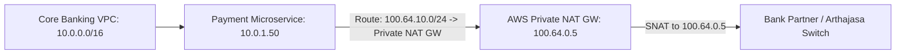

# Lab 04: Financial Partner Interconnect with Private NAT Gateway & Overlapping CIDRs

<BadgeLabel type="sme" text="Terraform IaC" /> <BadgeLabel type="aws" text="Private NAT GW & CGNAT" />

Lab ini mengimplementasikan **AWS Private NAT Gateway** untuk menyelesaikan masalah *overlapping IP* saat menghubungkan Core Banking AWS ke mitra perbankan / switching network (Arthajasa, Alto, BI-FAST).

---

## 🏗️ Arsitektur yang Di-deploy



---

## 📂 Lokasi File Kode Terraform

Kode sumber lengkap tersedia di:
👉 [labs/04-financial-partner-private-nat/](file:///Users/robertusnegoro/workingdir/repo/cloud-network-learning-materials/labs/04-financial-partner-private-nat/)

### Menjalankan Deployment:

```bash
cd labs/04-financial-partner-private-nat
terraform init
terraform plan
terraform apply
```
