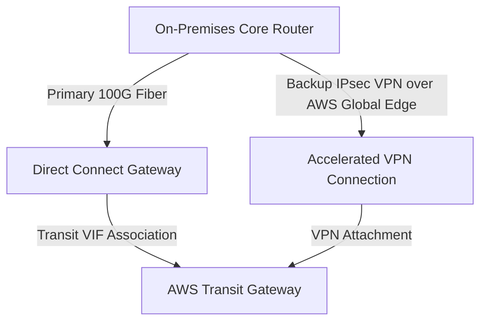

# Lab 05: Enterprise Hybrid Direct Connect with Accelerated VPN Backup & BFD

<BadgeLabel type="sme" text="Terraform IaC" /> <BadgeLabel type="aws" text="DXGW & Accelerated VPN" />

Lab ini mengonfigurasi arsitektur hibrida enterprise dengan **Direct Connect Gateway (DXGW)** sebagai jalur primer dan **AWS Accelerated Site-to-Site VPN** sebagai jalur sekunder (*failover backup*).

---

## 🏗️ Arsitektur yang Di-deploy



---

## 📂 Lokasi File Kode Terraform

Kode sumber lengkap tersedia di:
👉 [labs/05-hybrid-direct-connect-vpn-bfd/](file:///Users/robertusnegoro/workingdir/repo/cloud-network-learning-materials/labs/05-hybrid-direct-connect-vpn-bfd/)

### Menjalankan Deployment:

```bash
cd labs/05-hybrid-direct-connect-vpn-bfd
terraform init
terraform plan
terraform apply
```
