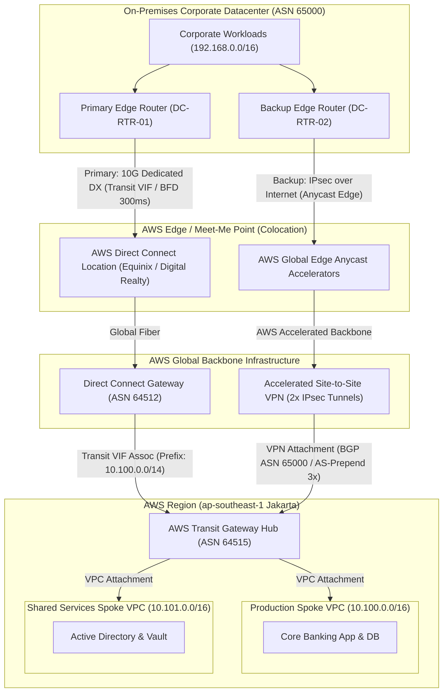

# Lab 05: Enterprise Hybrid Direct Connect with Accelerated VPN Backup & BFD Sub-Second Failover

<BadgeLabel type="sme" text="Level: Principal / SME" /> <BadgeLabel type="rfc" text="RFC 5880 (BFD) / RFC 4271 (BGP-4) / RFC 4301 (IPsec)" /> <BadgeLabel type="aws" text="DXGW, TGW & Accelerated VPN" />

Dalam skenario infrastruktur *mission-critical* perbankan dan enterprise skala besar, konektivitas hibrida (*hybrid cloud*) antara *On-Premises Corporate Datacenter* dan AWS Cloud menuntut ketersediaan tingkat tinggi (*Five-Nines Availability* / 99.999% SLA) dengan latensi deterministik dan waktu pemulihan (*failover time*) di bawah 1 detik. 

Lab ini memandu Anda membangun arsitektur interkoneksi hibrida standar industri: **Dedicated AWS Direct Connect (DX)** melalui **Direct Connect Gateway (DXGW)** dan **Transit Virtual Interface (Transit VIF)** sebagai jalur primer, dipadukan dengan **AWS Accelerated Site-to-Site VPN** melalui **AWS Global Edge Network** sebagai jalur *backup* otomatis. Untuk mengeliminasi waktu *downtime* 90 detik dari BGP *hold timer* standar saat terjadi *fiber cut* tersembunyi (*silent link failure*), Anda akan mengonfigurasi dan menguji **RFC 5880 Bidirectional Forwarding Detection (BFD)** dengan interval 300 ms untuk mencapai *sub-second failover*.

---

## Topologi Arsitektur Lab



---

## 📋 Parameter Perencanaan Alamat IP & BGP

| Komponen / Jalur | Entitas Logis | Parameter Teknis | Nilai Konfigurasi |
| :--- | :--- | :--- | :--- |
| **On-Premises Datacenter** | Autonomous System Number | BGP ASN | `65000` (Private ASN) |
| | Corporate LAN CIDR | Supernet Summary | `192.168.0.0/16` |
| | Core Router Public IP (VPN) | Public IPv4 Gateway | `203.0.113.10` |
| **AWS Direct Connect** | Direct Connect Gateway (DXGW) | Amazon-side BGP ASN | `64512` |
| | Transit Virtual Interface (VIF) | 802.1Q VLAN ID / MTU | VLAN `400` / Jumbo Frame `8500` Bytes |
| | BFD Detection Parameters | Tx / Rx Interval / Multiplier | `300 ms` / `300 ms` / `3` (Detect: `900 ms`) |
| | BGP Metric / Preference | On-Prem Local Preference | `200` (Higher = Primary Path) |
| **AWS Transit Gateway** | Regional Hub (Jakarta) | Amazon-side TGW ASN | `64515` |
| | Allowed Prefixes Advertisement | Summarized Cloud Supernet | `10.100.0.0/14` (Meliputi `10.100.0.0/16` & `10.101.0.0/16`) |
| **AWS Accelerated VPN** | Customer Gateway (CGW) | Type / BGP ASN | `ipsec.1` / ASN `65000` |
| | IPsec Inside Tunnel 1 | BGP Peering Subnet | `169.254.242.0/30` (AWS: `.1`, On-Prem: `.2`) |
| | IPsec Inside Tunnel 2 | BGP Peering Subnet | `169.254.242.4/30` (AWS: `.5`, On-Prem: `.6`) |
| | BGP Routing Policy | Outbound AS-Path Prepending | AS-Path Prepend `65000 65000 65000` (3x) |
| | Dead Peer Detection (DPD) | DPD Timeout / Action | `30` Detik / `restart` |

---

## 🛠️ Langkah-Langkah Implementasi Hands-On

Setiap langkah implementasi wajib mematuhi **6-Point Step Blueprint** berstandar arsitektur industri.

---

### Langkah 1: Provisioning Direct Connect Gateway (DXGW) & AWS Transit Gateway (TGW) Backbone

#### 1. Architectural Intent
DXGW merupakan *control-plane resource* global multi-region yang menjembatani koneksi fisik Direct Connect dengan berbagai VPC atau Transit Gateway di berbagai region AWS. TGW bertindak sebagai *regional packet router* yang mengonsolidasikan attachment VPC. Pemisahan ASN antara DXGW (`64512`) dan TGW (`64515`) memastikan batasan BGP *autonomous routing domain* yang jelas dan menghindari konflik loop AS-Path.

#### 2. AWS Console Context & Parameter Mapping
1. Buka konsol **AWS Direct Connect** > **Direct Connect gateways** > klik **Create Direct Connect gateway**.
   - **Name**: `dxgw-enterprise-global`
   - **Amazon-side ASN**: Pilih *Custom ASN* lalu masukkan `64512`.
2. Buka konsol **VPC** > **Transit gateways** > klik **Create transit gateway**.
   - **Name tag**: `tgw-hybrid-hub`
   - **Amazon side ASN**: `64515`
   - **Auto accept shared attachments**: *Enable*
   - **Default route table association / propagation**: *Enable* (atau *Disable* untuk model custom domain segregation).

#### 3. Human-Readable Production AWS CLI
```bash
# 1. Buat Direct Connect Gateway Global
aws directconnect create-direct-connect-gateway \
    --direct-connect-gateway-name "dxgw-enterprise-global" \
    --amazon-side-asn 64512 \
    --query '{DXGW_ID:directConnectGateway.directConnectGatewayId,State:directConnectGateway.directConnectGatewayState}' \
    --output table

# 2. Buat AWS Transit Gateway Regional Hub
aws ec2 create-transit-gateway \
    --description "TGW Hybrid Cloud Hub for Enterprise DX and VPN" \
    --options AmazonSideAsn=64515,AutoAcceptSharedAttachments=enable,DefaultRouteTableAssociation=enable,DefaultRouteTablePropagation=enable,DnsSupport=enable \
    --tag-specifications 'ResourceType=transit-gateway,Tags=[{Key=Name,Value=tgw-hybrid-hub},{Key=Environment,Value=Production}]' \
    --query 'TransitGateway.{TGW_ID:TransitGatewayId,ASN:Options.AmazonSideAsn,State:State}' \
    --output table
```

#### 4. Declarative Terraform IaC
```hcl
# Direct Connect Gateway (Global Control Plane)
resource "aws_dx_gateway" "dxgw" {
  name            = "dxgw-enterprise-global"
  amazon_side_asn = "64512"
}

# AWS Transit Gateway (Regional Hub)
resource "aws_ec2_transit_gateway" "tgw" {
  description                     = "TGW Hybrid Cloud Hub for Enterprise DX and VPN"
  amazon_side_asn                 = 64515
  auto_accept_shared_attachments  = "enable"
  default_route_table_association = "enable"
  default_route_table_propagation = "enable"
  dns_support                     = "enable"
  vpn_ecmp_support                = "enable"

  tags = {
    Name        = "tgw-hybrid-hub"
    Environment = "Production"
    ManagedBy   = "Terraform"
  }
}
```

#### 5. Under-the-Hood Mechanics
Ketika DXGW dibuat, AWS mendaftarkan entitas BGP ASN di seluruh *Meet-Me Points* (Colocation edge routers AWS). Pembuatan TGW menginisialisasi *Hyperplane control plane instances* terdistribusi di seluruh Availability Zone pada region target, yang siap menerima paket Geneve/VXLAN overlay dan merutekan traffic pada kecepatan *line-rate* tanpa batasan bandwidth single-node.

#### 6. Verification Smoke Test
```bash
# Verifikasi status aktif Direct Connect Gateway
aws directconnect describe-direct-connect-gateways \
    --query 'directConnectGateways[?directConnectGatewayName==`dxgw-enterprise-global`].[directConnectGatewayId,amazonSideAsn,directConnectGatewayState]' \
    --output table

# Verifikasi status Transit Gateway
aws ec2 describe-transit-gateways \
    --filters "Name=tag:Name,Values=tgw-hybrid-hub" \
    --query 'TransitGateways[*].[TransitGatewayId,Options.AmazonSideAsn,State]' \
    --output table
```

*Contoh Output Sukses:*
```
------------------------------------------------------
|           DescribeDirectConnectGateways            |
+----------------------+------------+----------------+
|  dxgw-4a5b6c7d       |  64512     |  available     |
+----------------------+------------+----------------+
------------------------------------------------------
|               DescribeTransitGateways              |
+----------------------+------------+----------------+
|  tgw-0123456789abcdef|  64515     |  available     |
+----------------------+------------+----------------+
```

---

### Langkah 2: Mengasosiasikan Direct Connect Gateway ke Transit Gateway dengan Allowed Prefix Summarization

#### 1. Architectural Intent
Secara arsitektur, Transit VIF yang terhubung ke DXGW memiliki limit maksimum *prefix advertisement* BGP (maksimal 20 prefix untuk TGW association). Mengiklankan subnet individual secara granular (`/24`) akan melanggar batas kuota AWS dan memperbesar *Routing Information Base (RIB)* router on-premises. Melalui parameter `allowed_prefixes`, arsitek mengontrol *supernet CIDR* agregat (`10.100.0.0/14`) yang diiklankan oleh AWS BGP ke router on-premises.

#### 2. AWS Console Context & Parameter Mapping
1. Buka konsol **AWS Direct Connect** > **Direct Connect gateways** > pilih `dxgw-enterprise-global`.
2. Masuk ke tab **Gateway associations** > klik **Associate gateway**.
   - **Association type**: *Transit Gateway*
   - **Transit Gateway**: Pilih `tgw-hybrid-hub`
   - **Allowed prefixes**: Masukkan CIDR agregat supernet `10.100.0.0/14`.
3. Klik **Associate gateway**. (Proses asosiasi membutuhkan waktu 5–10 menit hingga status berubah menjadi *associated*).

#### 3. Human-Readable Production AWS CLI
```bash
# Asosiasikan DXGW ke TGW dengan filter Allowed Prefixes supernet
aws directconnect create-direct-connect-gateway-association \
    --direct-connect-gateway-id "dxgw-4a5b6c7d" \
    --gateway-id "tgw-0123456789abcdef" \
    --add-allowed-prefixes-to-direct-connect-gateway cidr=10.100.0.0/14 \
    --query 'directConnectGatewayAssociation.{DXGW:directConnectGatewayId,TGW:associatedGatewayId,State:associationState}' \
    --output table
```

#### 4. Declarative Terraform IaC
```hcl
# Asosiasi DXGW ke TGW dengan Supernet Aggregation
resource "aws_dx_gateway_association" "dxgw_tgw_assoc" {
  dx_gateway_id         = aws_dx_gateway.dxgw.id
  associated_gateway_id = aws_ec2_transit_gateway.tgw.id

  # Advertised CIDR Supernet ke Datacenter On-Premises via BGP
  allowed_prefixes = [
    "10.100.0.0/14" # Mencakup seluruh VPC Production (10.100.0.0/16) dan Shared (10.101.0.0/16)
  ]
}
```

#### 5. Under-the-Hood Mechanics
Control plane AWS Direct Connect menginjeksi route filter ke edge router BGP daemon di lokasi Direct Connect. Ketika router on-premises mengirim BGP UPDATE, DXGW memfilter dan hanya meneruskan paket yang cocok dengan `allowed_prefixes` ke Transit Gateway route table. Sebaliknya, BGP speaker AWS di edge colocation mengekspor rute `10.100.0.0/14` ke BGP peer router on-premises.

#### 6. Verification Smoke Test
```bash
# Pantau status asosiasi DXGW - TGW
aws directconnect describe-direct-connect-gateway-associations \
    --direct-connect-gateway-id "dxgw-4a5b6c7d" \
    --associated-gateway-id "tgw-0123456789abcdef" \
    --query 'directConnectGatewayAssociations[*].[associationState,allowedPrefixesToDirectConnectGateway[*].cidr]' \
    --output json
```

*Contoh Output Sukses:*
```json
[
    [
        "associated",
        [
            "10.100.0.0/14"
        ]
    ]
]
```

---

### Langkah 3: Provisioning Customer Gateway (CGW) & AWS Accelerated Site-to-Site VPN Attachment

#### 1. Architectural Intent
Untuk jalur *failover backup*, koneksi VPN standar yang melintasi internet publik rentan terhadap *packet jitter*, *loss*, dan *path flapping*. **AWS Accelerated Site-to-Site VPN** menggunakan **AWS Global Accelerator / Anycast Edge IP** terdekat dengan router on-premises. Paket IPsec segera masuk ke kabel serat optik global terisolasi milik AWS di *Point of Presence (PoP)* terdekat, memangkas *round-trip time (RTT)* dan meningkatkan stabilitas tunnel.

#### 2. AWS Console Context & Parameter Mapping
1. Buka konsol **VPC** > **Customer gateways** > klik **Create customer gateway**.
   - **Name**: `cgw-onprem-datacenter-edge`
   - **BGP ASN**: `65000`
   - **IP address**: `203.0.113.10` (Public IP router on-premises).
2. Buka konsol **VPC** > **Site-to-Site VPN connections** > klik **Create VPN connection**.
   - **Target gateway type**: *Transit Gateway* -> pilih `tgw-hybrid-hub`.
   - **Customer gateway**: *Existing* -> pilih `cgw-onprem-datacenter-edge`.
   - **Routing options**: *Dynamic (requires BGP)*.
   - **Enable Acceleration**: Centang checkbox (**Enable acceleration**).
   - **Tunnel Options**:
     - Inside IPv4 CIDR Tunnel 1: `169.254.242.0/30`
     - Inside IPv4 CIDR Tunnel 2: `169.254.242.4/30`
     - DPD Timeout Action: `Restart` (agar AWS segera mereinisialisasi IKE saat tunnel drop).

#### 3. Human-Readable Production AWS CLI
```bash
# 1. Buat Customer Gateway untuk Router On-Premises
CGW_ID=$(aws ec2 create-customer-gateway \
    --type ipsec.1 \
    --public-ip 203.0.113.10 \
    --bgp-asn 65000 \
    --tag-specifications 'ResourceType=customer-gateway,Tags=[{Key=Name,Value=cgw-onprem-datacenter-edge}]' \
    --query 'CustomerGateway.CustomerGatewayId' \
    --output text)

echo "Created CGW ID: $CGW_ID"

# 2. Buat Accelerated Site-to-Site VPN Connection terhubung ke TGW
aws ec2 create-vpn-connection \
    --type ipsec.1 \
    --customer-gateway-id "$CGW_ID" \
    --transit-gateway-id "tgw-0123456789abcdef" \
    --options '{
        "EnableAcceleration": true,
        "StaticRoutesOnly": false,
        "TunnelOptions": [
            {
                "TunnelInsideCidr": "169.254.242.0/30",
                "PreSharedKey": "EnterpriseSecretAuthKey2026!",
                "DPDTimeoutAction": "restart",
                "Phase1IntegrityAlgorithms": [{"Value": "SHA2-256"}],
                "Phase1EncryptionAlgorithms": [{"Value": "AES256"}],
                "Phase2IntegrityAlgorithms": [{"Value": "SHA2-256"}],
                "Phase2EncryptionAlgorithms": [{"Value": "AES256"}]
            },
            {
                "TunnelInsideCidr": "169.254.242.4/30",
                "PreSharedKey": "EnterpriseSecretAuthKey2026!",
                "DPDTimeoutAction": "restart",
                "Phase1IntegrityAlgorithms": [{"Value": "SHA2-256"}],
                "Phase1EncryptionAlgorithms": [{"Value": "AES256"}],
                "Phase2IntegrityAlgorithms": [{"Value": "SHA2-256"}],
                "Phase2EncryptionAlgorithms": [{"Value": "AES256"}]
            }
        ]
    }' \
    --tag-specifications 'ResourceType=vpn-connection,Tags=[{Key=Name,Value=vpn-backup-to-tgw}]' \
    --query 'VpnConnection.{VPN_ID:VpnConnectionId,State:State,Accelerated:Options.EnableAcceleration}' \
    --output table
```

#### 4. Declarative Terraform IaC
```hcl
# Customer Gateway Representasi On-Premises Edge
resource "aws_customer_gateway" "onprem_cgw" {
  bgp_asn    = 65000
  ip_address = "203.0.113.10"
  type       = "ipsec.1"

  tags = {
    Name = "cgw-onprem-datacenter-edge"
  }
}

# Accelerated Site-to-Site VPN Attachment on Transit Gateway
resource "aws_vpn_connection" "backup_vpn" {
  customer_gateway_id = aws_customer_gateway.onprem_cgw.id
  transit_gateway_id  = aws_ec2_transit_gateway.tgw.id
  type                = "ipsec.1"

  # Mengaktifkan AWS Global Accelerator Anycast Underlay
  enable_acceleration = true

  # Tunnel 1 Configuration
  tunnel1_inside_cidr         = "169.254.242.0/30"
  tunnel1_preshared_key       = "EnterpriseSecretAuthKey2026!"
  tunnel1_dpd_timeout_action  = "restart"
  tunnel1_dpd_timeout_seconds = 30

  # Tunnel 2 Configuration
  tunnel2_inside_cidr         = "169.254.242.4/30"
  tunnel2_preshared_key       = "EnterpriseSecretAuthKey2026!"
  tunnel2_dpd_timeout_action  = "restart"
  tunnel2_dpd_timeout_seconds = 30

  tags = {
    Name        = "vpn-backup-to-tgw"
    Environment = "Production"
  }
}
```

#### 5. Under-the-Hood Mechanics
Dengan `EnableAcceleration: true`, AWS mengalokasikan dua pasang IP Publik statis Anycast global yang diiklankan dari seluruh edge PoP AWS di seluruh dunia. Paket ESP (IP Protocol 50) dari router on-premises masuk ke edge terdekat router AWS melalui BGP Anycast routing, didekapsulasi di *Hyperplane VPN termination gateway*, dan ditransmisikan ke TGW ENI melalui *AWS global network backbone*.

#### 6. Verification Smoke Test
```bash
# Dapatkan status endpoint Anycast dan status terowongan VPN
aws ec2 describe-vpn-connections \
    --filters "Name=tag:Name,Values=vpn-backup-to-tgw" \
    --query 'VpnConnections[*].{VPN_ID:VpnConnectionId,State:State,Tunnel1_OutsideIP:VgwTelemetry[0].OutsideIpAddress,Tunnel1_Status:VgwTelemetry[0].Status,Tunnel2_OutsideIP:VgwTelemetry[1].OutsideIpAddress,Tunnel2_Status:VgwTelemetry[1].Status}' \
    --output table
```

*Contoh Output Sukses:*
```
-------------------------------------------------------------------------------------------------------------------------
|                                                 DescribeVpnConnections                                                |
+-----------------------+----------------------+-----------------------+----------------------+-------------------------+
|      State            | Tunnel1_OutsideIP    |    Tunnel1_Status     | Tunnel2_OutsideIP    |     Tunnel2_Status      |
+-----------------------+----------------------+-----------------------+----------------------+-------------------------+
|  available            | 15.188.xx.xx (Anycast)|  UP                   | 13.248.xx.xx (Anycast)|  UP                     |
+-----------------------+----------------------+-----------------------+----------------------+-------------------------+
```

---

### Langkah 4: Konfigurasi BGP Path Manipulation & RFC 5880 Sub-Second BFD Tuning

#### 1. Architectural Intent
Ketika Direct Connect dan VPN sama-sama mengiklankan rute yang identik (`192.168.0.0/16` dan `10.100.0.0/14`), arsitektur harus menjamin bahwa **Direct Connect selalu menjadi Primary Path** dan **VPN menjadi Standby Path**. Jika terjadi asymmetric routing (traffic keluar via DX tetapi kembali via VPN), *stateful firewalls* di datacenter akan men-drop paket (TCP Out-of-State / ACK Invalid).

- **Arah AWS -> On-Premises**: AWS Transit Gateway secara deterministik memprioritaskan Direct Connect dibandingkan VPN karena rute Direct Connect memiliki prioritas *Path Selection* yang lebih tinggi di internal TGW route table.
- **Arah On-Premises -> AWS**: Router on-premises dikonfigurasi dengan `BGP Local Preference = 200` pada jalur DX dan `BGP Local Preference = 100` pada jalur VPN. Pada saat yang sama, router mengiklankan prefix corporate LAN via VPN dengan **AS-Path Prepend 3x (`65000 65000 65000`)** sebagai proteksi ganda.
- **Deteksi Link Mati Cepat (RFC 5880 BFD)**: BGP default *Keepalive = 30s* dan *Hold Time = 90s*. Jika fiber ISP terputus tanpa interface flapping, BGP membutuhkan 90 detik sebelum mencabut rute, menyebabkan blackholing 90 detik. BFD dengan interval `300ms` x `multiplier 3` mendeteksi kegagalan link dalam `900 ms` dan langsung memicu reconvergence BGP ke jalur VPN.

#### 2. AWS Console Context & Parameter Mapping
1. Buka konsol **AWS Direct Connect** > **Virtual interfaces** > pilih Transit VIF Anda (`vif-enterprise-transit`).
2. Periksa bahwa **BFD** berstatus *Enabled* (AWS Direct Connect mengaktifkan BFD secara default pada semua VIF virtual interfaces).
3. Konfigurasi router on-premises (Cisco IOS-XE / Junos) dengan parameter BFD dan BGP Neighbor di bawah ini.

#### 3. Production On-Premises Edge Router Configuration (Cisco IOS-XE & Junos)

```text
! ====================================================================
! CISCO IOS-XE: PRIMARY DIRECT CONNECT ROUTER (DC-RTR-01)
! ====================================================================
interface TenGigabitEthernet0/0/1.400
 description AWS Direct Connect Transit VIF (VLAN 400)
 encapsulation dot1Q 400
 ip address 169.254.240.2 255.255.255.252
 bfd interval 300 min_rx 300 multiplier 3
 no shutdown
!
router bgp 65000
 bgp log-neighbor-changes
 neighbor 169.254.240.1 remote-as 64512
 neighbor 169.254.240.1 description AWS-DXGW-BGP-Peer
 neighbor 169.254.240.1 fall-over bfd
 neighbor 169.254.240.1 route-map RM-AWS-DX-IN in
 neighbor 169.254.240.1 route-map RM-AWS-DX-OUT out
!
route-map RM-AWS-DX-IN permit 10
 set local-preference 200      ! Set Local-Pref TINGGI (Primary Outbound)
!
route-map RM-AWS-DX-OUT permit 10
 match ip address prefix-list PL-CORP-LAN
 ! No AS-Path Prepending (Clean Path)
!

! ====================================================================
! CISCO IOS-XE: BACKUP ACCELERATED VPN ROUTER (DC-RTR-02)
! ====================================================================
interface Tunnel1
 description AWS Accelerated Site-to-Site VPN Tunnel 1
 ip address 169.254.242.2 255.255.255.252
 tunnel source GigabitEthernet0/0/0
 tunnel mode ipsec ipv4
 tunnel destination 15.188.xx.xx
 ip tcp adjust-mss 1379         ! MSS Clamping untuk mencegah fragmentasi
!
router bgp 65000
 neighbor 169.254.242.1 remote-as 64515
 neighbor 169.254.242.1 description AWS-TGW-VPN-Tunnel1
 neighbor 169.254.242.1 route-map RM-AWS-VPN-IN in
 neighbor 169.254.242.1 route-map RM-AWS-VPN-OUT out
!
route-map RM-AWS-VPN-IN permit 10
 set local-preference 100      ! Set Local-Pref RENDAH (Standby Outbound)
!
route-map RM-AWS-VPN-OUT permit 10
 match ip address prefix-list PL-CORP-LAN
 set as-path prepend 65000 65000 65000   ! AS-Prepend 3x (Standby Inbound)
!
ip prefix-list PL-CORP-LAN seq 10 permit 192.168.0.0/16
```

#### 4. Declarative Terraform IaC
```hcl
# Tuning Parameter BGP & BFD pada Transit Virtual Interface (VIF)
resource "aws_dx_transit_virtual_interface" "transit_vif" {
  connection_id    = "dxcon-fg123456" # ID Dedicated DX Connection
  dx_gateway_id    = aws_dx_gateway.dxgw.id
  name             = "vif-enterprise-transit"
  vlan             = 400
  address_family   = "ipv4"
  bgp_asn          = 65000
  amazon_address   = "169.254.240.1/30"
  customer_address = "169.254.240.2/30"
  bgp_auth_key     = "BgpSecretAuth2026!"
  mtu              = 8500 # Jumbo Frames aktif pada Direct Connect

  tags = {
    Name = "vif-enterprise-transit"
  }
}
```

#### 5. Under-the-Hood Mechanics
- **Nitro BFD Engine**: AWS Direct Connect router hardware mengeksekusi kontrol mikro-paket UDP port `3784` (BFD control packet) setiap 300 milidetik. Jika 3 paket berturut-turut hilang (900 ms), hardware engine langsung mengirim sinyal interrupt ke BGP state machine untuk mengubah status neighbor menjadi `IDLE`.
- **TGW FIB Update**: Begitu status DX VIF mati, Transit Gateway Route Table langsung menghapus entri rute DXGW dari Forwarding Information Base (FIB) dan mengaktifkan entri rute VPN attachment yang sudah siap di memori (*sub-second convergence*).

#### 6. Verification Smoke Test
```bash
# Verifikasi status BGP Peer dan BFD pada Direct Connect VIF
aws directconnect describe-virtual-interfaces \
    --virtual-interface-id "vif-enterprise-transit" \
    --query 'virtualInterfaces[*].{VIF_ID:virtualInterfaceId,BGP_Status:bgpPeers[0].bgpStatus,BGP_State:bgpPeers[0].bgpPeerState,BFD_Status:bgpPeers[0].bfdStatus}' \
    --output table

# Verifikasi rute aktif pada Transit Gateway Route Table
aws ec2 search-transit-gateway-routes \
    --transit-gateway-route-table-id "tgw-rtb-0123456789" \
    --filters "Name=route-search.exact-match,Values=192.168.0.0/16" \
    --query 'Routes[*].{CIDR:DestinationCidrBlock,Type:Type,State:State,ActiveAttachment:TransitGatewayAttachments[0].ResourceId}' \
    --output table
```

*Contoh Output Sukses (Jalur Primer Normal):*
```
----------------------------------------------------------------------
|                     DescribeVirtualInterfaces                      |
+------------------------+-------------+---------------+-------------+
|        VIF_ID          | BGP_Status  |   BGP_State   | BFD_Status  |
+------------------------+-------------+---------------+-------------+
| vif-enterprise-transit | up          | established   | active      |
+------------------------+-------------+---------------+-------------+
-------------------------------------------------------------------------------------------
|                                SearchTransitGatewayRoutes                               |
+------------------+----------+----------+------------------------------------------------+
|       CIDR       |  Type    |  State   |                ActiveAttachment                |
+------------------+----------+----------+------------------------------------------------+
| 192.168.0.0/16   | dynamic  | active   | dxgw-4a5b6c7d (Direct Connect Gateway Primary)|
+------------------+----------+----------+------------------------------------------------+
```

---

### Langkah 5: Penyelarasan MTU, MSS Clamping & Verifikasi Path MTU Discovery (PMTUD)

#### 1. Architectural Intent
Direct Connect mendukung **Jumbo Frame MTU 8500 / 9001 Bytes**, sedangkan AWS Site-to-Site VPN dibatasi oleh MTU standar Ethernet internet (`1500 Bytes`). Setelah dikurangi enkapsulasi IPsec ESP, IV, ICV, dan header GRE/UDP (overhead total ~54–61 bytes), MTU efektif terowongan VPN adalah **1446 Bytes** dengan batas **TCP MSS 1379 Bytes**.
Jika paket berukuran 9000 bytes dari server cloud dikirim saat failover ke VPN dan bit `Don't Fragment (DF)` aktif, jika ICMP *Destination Unreachable (Type 3 Code 4: Fragmentation Needed)* diblokir oleh firewall, akan terjadi **PMTUD Blackhole** di mana aplikasi hanging saat mentransfer payload besar (misal TLS handshake atau database dump).

#### 2. AWS Console Context & Parameter Mapping
1. Buka konsol **VPC** > **Transit Gateway Attachments** > periksa opsi MTU pada VPC attachment (`MTU = 8500` didukung penuh dalam region yang sama).
2. Pada router on-premises VPN Tunnel, terapkan perintah `ip tcp adjust-mss 1379` pada interface tunnel.

#### 3. Human-Readable Production AWS CLI
```bash
# Periksa MTU pada seluruh Transit Gateway VPC Attachments
aws ec2 describe-transit-gateway-vpc-attachments \
    --filters "Name=transit-gateway-id,Values=tgw-0123456789abcdef" \
    --query 'TransitGatewayVpcAttachments[*].{VPC_Attach_ID:TransitGatewayAttachmentId,VPC_ID:VpcId,Options:Options.ApplianceModeSupport}' \
    --output table
```

#### 4. Declarative Terraform IaC
```hcl
# Transit Gateway VPC Attachment dengan Dukungan MTU Optimal
resource "aws_ec2_transit_gateway_vpc_attachment" "prod_vpc_assoc" {
  transit_gateway_id = aws_ec2_transit_gateway.tgw.id
  vpc_id             = "vpc-0123456789prod"
  subnet_ids         = ["subnet-0123456789tgw-a", "subnet-0123456789tgw-b"]

  dns_support                                     = "enable"
  transit_gateway_default_route_table_association = true
  transit_gateway_default_route_table_propagation = true

  tags = {
    Name = "tgw-attach-prod-vpc"
  }
}
```

#### 5. Under-the-Hood Mechanics
Ketika TCP SYN handshake melintasi router on-premises via VPN, router mencegat paket dan mengubah nilai field TCP Option `MSS (Maximum Segment Size)` dari `8960` (atau `1460`) menjadi `1379`. Server EC2 di cloud membaca nilai MSS ini dan membatasi ukuran payload TCP transmisi maksimal 1379 bytes. Hal ini menjamin tidak ada frame yang melebihi batas 1446 bytes MTU terowongan IPsec, mencegah fragmentasi dan packet drop secara mutlak.

#### 6. Verification Smoke Test
```bash
# Uji transmisi payload ICMP dengan bit Don't Fragment (DF) aktif dari EC2 ke On-Premises
# Uji jalur Direct Connect (MTU Jumbo Frame hingga 8400 bytes)
ping -M do -s 8400 -c 4 192.168.1.50

# Uji jalur Backup VPN (MTU Max Payload ICMP = 1418 bytes -> 1418 + 20 IP + 8 ICMP = 1446 bytes)
ping -M do -s 1418 -c 4 192.168.1.50
```

*Contoh Output Sukses (Jalur VPN Clamping Valid):*
```
PING 192.168.1.50 (192.168.1.50) 1418(1446) bytes of data.
1426 bytes from 192.168.1.50: icmp_seq=1 ttl=62 time=24.2 ms
1426 bytes from 192.168.1.50: icmp_seq=2 ttl=62 time=24.1 ms
--- 192.168.1.50 ping statistics ---
4 packets transmitted, 4 received, 0% packet loss, time 3004ms
```

---

## 🚨 Production War-Room Triage & Failover Simulation

### Skenario 1: Simulasi Link Down Direct Connect & Pengujian BFD Sub-Second Failover
1. **Pemicu Kegagalan**: Matikan interface fisik Direct Connect pada router on-premises (`shutdown interface TenGigabitEthernet0/0/1.400`).
2. **Observasi BFD & BGP**:
   ```bash
   # Pantau perubahan rute di TGW secara real-time
   watch -n 0.5 "aws ec2 search-transit-gateway-routes --transit-gateway-route-table-id tgw-rtb-0123456789 --filters Name=route-search.exact-match,Values=192.168.0.0/16 --query 'Routes[0].TransitGatewayAttachments[0].ResourceId'"
   ```
3. **Hasil yang Diharapkan**:
   - Dalam waktu `< 1000 ms`, status attachment rute `192.168.0.0/16` berpindah dari `dxgw-4a5b6c7d` ke `vpn-0123456789backup`.
   - Ping berkelanjutan (`ping -i 0.2 192.168.1.50`) hanya mengalami drop maksimal 2–3 paket ICMP sebelum konektivitas pulih normal.

### Skenario 2: Asymmetric Routing Detection & Pemulihan dengan BGP Community
Jika traffic outbound berjalan melalui Direct Connect tetapi traffic inbound kembali melalui VPN, periksa BGP Community yang dikirim ke DXGW.
- Gunakan BGP Community AWS untuk mengatur Local Preference di backbone AWS:
  - `7224:7100` = Low Preference (50)
  - `7224:7200` = Medium Preference (100)
  - `7224:7300` = High Preference (200)

::: tip STANDAR BEST PRACTICE INDUSTRI (SME RECOMMENDATION)
Selalu gunakan **BGP Community `7224:7300`** pada iklan rute Direct Connect dan jangan pernah menggunakan static routing pada arsitektur hybrid berskala enterprise. Pastikan fitur **Dead Peer Detection (DPD)** pada koneksi VPN diatur ke aksi `restart` untuk mencegah *deadlock* sesi SA (Security Association) IPsec ketika renegosiasi IKE terjadi.
:::
