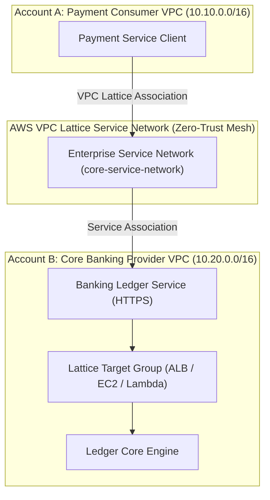

# 🕸️ Lab 06: Zero-Trust Multi-Account Microservices with AWS VPC Lattice

<BadgeLabel type="sme" text="Level: Principal / SME" /> <BadgeLabel type="lab" text="Hands-on IaC Blueprint" />

Dalam lab enterprise ini, Anda akan membangun jaringan layanan modern (*Application Layer Networking*) menggunakan **AWS VPC Lattice**. Arsitektur ini memungkinkan komunikasi privat antar microservices lintas VPC dan lintas Akun AWS tanpa memerlukan VPC Peering, Transit Gateway, atau pengelolaan CIDR rute IP yang kompleks.

---

## 🏗️ Topologi Arsitektur Lab



---

## 📋 Fitur & Komponen Utama yang Dikonfigurasi

1. **VPC Lattice Service Network**: Hub kontrol kebijakan akses dan otorisasi terpusat.
2. **Service Network VPC Association**: Menghubungkan Consumer VPC ke Service Network sehingga klien mendapatkan rute DNS lokal otomatis (`*.vpc-lattice-svcs.aws`).
3. **VPC Lattice Service**: Definisi endpoint layanan perbankan dengan listener HTTPS dan sertifikat TLS kustom.
4. **Target Group & Health Checking**: Health check adaptif untuk target instans backend.
5. **IAM Auth Policy (Zero-Trust)**: Enkripsi end-to-end dengan verifikasi identitas AWS Signature Version 4 (SigV4) di level request L7.

---

## 🛠️ Langkah Deployment Terraform

```bash
# 1. Masuk ke direktori lab
cd labs/06-vpc-lattice-microservices

# 2. Inisialisasi dan validasi Terraform
terraform init -backend=false
terraform validate

# 3. Tinjau eksekusi plan
terraform plan

# 4. Deploy infrastruktur
terraform apply -auto-approve
```

---

## 🔍 Verification & Triage Runbook

### 1. Verifikasi Service Network & Asosiasi VPC
```bash
# Cek daftar Service Network yang aktif
aws vpc-lattice list-service-networks

# Cek asosiasi VPC Consumer ke Service Network
aws vpc-lattice list-service-network-vpc-associations \
    --service-network-identifier <service-network-id>
```

### 2. Uji Konektivitas Klien ke VPC Lattice Service
```bash
# Jalankan query DNS dari EC2 Consumer
dig +short payment-ledger.core-service-network.vpc-lattice-svcs.ap-southeast-1.on.aws

# Uji HTTP GET dengan AWS SigV4 Authentication
curl -v --aws-sigv4 "aws:amz:ap-southeast-1:vpc-lattice-svcs" \
     --user "$AWS_ACCESS_KEY_ID:$AWS_SECRET_ACCESS_KEY" \
     https://payment-ledger.core-service-network.vpc-lattice-svcs.ap-southeast-1.on.aws/healthz
```

::: tip STANDAR BEST PRACTICE INDUSTRI (SME RECOMMENDATION)
Gunakan **AWS VPC Lattice** untuk komunikasi *Service-to-Service East-West* antar tim pengembang aplikasi guna mengeliminasi overhead operasional pengelolaan tabel rute IPAM, overlapping CIDR, dan aturan Security Group yang membengkak di skala ribuan microservices.
:::
