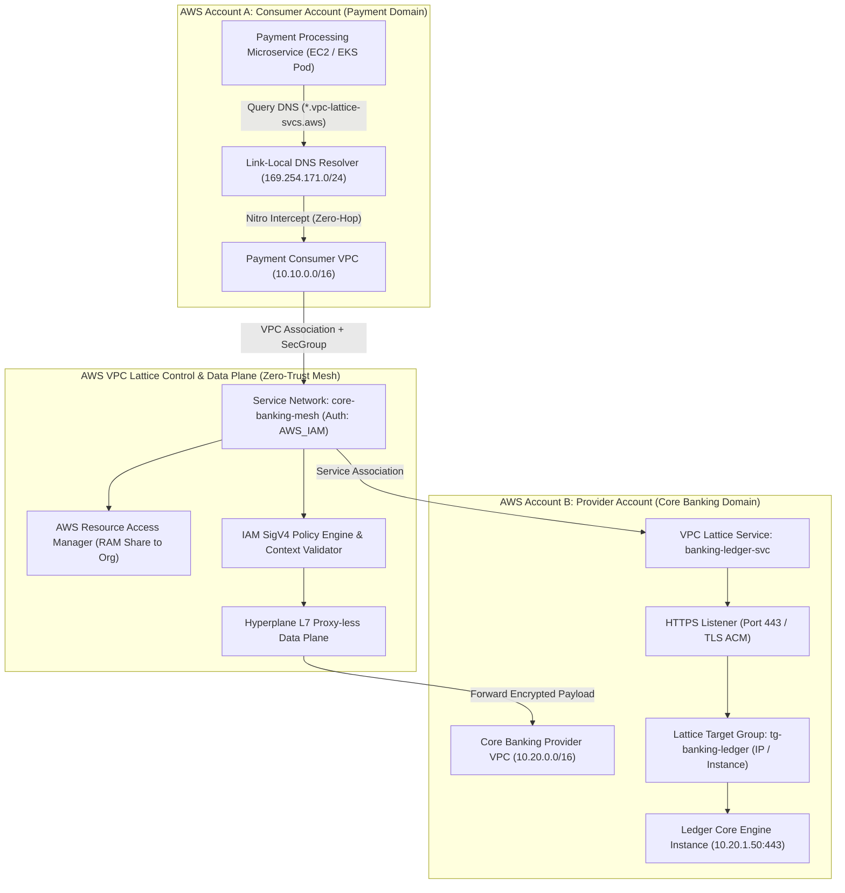

# 🕸️ Lab 06: Zero-Trust Multi-Account Microservices with AWS VPC Lattice & IAM SigV4

<BadgeLabel type="sme" text="Level: Principal / SME" /> <BadgeLabel type="rfc" text="RFC 9110 (HTTP/2) / RFC 6598 / AWS SigV4" /> <BadgeLabel type="aws" text="AWS VPC Lattice & RAM Sharing" />

Dalam arsitektur *microservices* terdistribusi skala enterprise yang tersebar di ratusan akun AWS (*Multi-Account AWS Organizations*), metode interkoneksi tradisional menggunakan **VPC Peering Mesh** atau **Transit Gateway (TGW)** menimbulkan kompleksitas eksponensial: kehabisan alokasi CIDR IP (*IPv4 exhaustion*), *overlapping IP addresses*, tabel rute raksasa (*routing table sprawl*), serta batasan Security Group L4 yang tidak mengenali konteks identitas aplikasi L7.

**AWS VPC Lattice** merevolusi arsitektur *application networking* dengan menyediakan *zero-proxy underlay application mesh*. VPC Lattice memungkinkan komunikasi *service-to-service* privat lintas VPC dan lintas akun AWS secara mulus tanpa memerlukan *VPC Peering*, *Transit Gateway*, atau modifikasi *VPC Route Tables*. Keamanan ditegakkan secara *Zero-Trust* menggunakan kriptografi **AWS Signature Version 4 (SigV4)** pada level request HTTP/2 dan gRPC.

---

## 🏗️ Topologi Arsitektur Lab



---

## 📋 Parameter Perencanaan Layanan & Jaringan

| Parameter | Domain Consumer (Account A) | Domain Provider (Account B) | Entitas VPC Lattice |
| :--- | :--- | :--- | :--- |
| **AWS Account ID** | `111122223333` (Payment App) | `444455556666` (Core Banking) | Managed by AWS RAM |
| **VPC CIDR Block** | `10.10.0.0/16` (Overlapping CIDRs OK!) | `10.20.0.0/16` (Overlapping CIDRs OK!) | None (No IP Routing Table) |
| **Subnet Aplikasi** | `10.10.1.0/24` (AZ: `ap-southeast-1a`) | `10.20.1.0/24` (AZ: `ap-southeast-1a`) | Target Subnet / ENI |
| **Service Network Name** | N/A (Associated Client) | N/A | `core-banking-mesh` |
| **Auth Type & Policy** | IAM Role: `PaymentClientRole` | IAM Policy: SigV4 Enforced | `AWS_IAM` Policy Engine |
| **Lattice Service Name**| N/A | `banking-ledger-svc` | DNS: `*.vpc-lattice-svcs.aws` |
| **Protocol / Port** | HTTPS / Port `443` | HTTPS / Port `443` | HTTP/2 & TLS 1.3 |
| **Health Check Path** | N/A | `/healthz` (Interval 30s, Code 200) | Managed Hyperplane Probe |

---

## 🛠️ Langkah-Langkah Implementasi Hands-On

Setiap langkah implementasi wajib mematuhi **6-Point Step Blueprint** berstandar arsitektur industri.

---

### Langkah 1: Provisioning Multi-Account VPC Infrastructure & DNS Support Settings

#### 1. Architectural Intent
VPC Lattice mengandalkan integrasi DNS internal VPC (*Amazon Route 53 Resolver*) untuk meresolusi nama domain Lattice yang di-generate otomatis (`*.vpc-lattice-svcs.aws`) ke alamat IP link-local khusus. Oleh karena itu, atribut `enableDnsHostnames` dan `enableDnsSupport` wajib diaktifkan pada VPC Consumer maupun Provider.

#### 2. AWS Console Context & Parameter Mapping
1. Buka konsol **VPC** > **Your VPCs**.
2. Pilih Consumer VPC (`vpc-payment-consumer`) dan Provider VPC (`vpc-core-banking-provider`).
3. Klik **Actions** > **Edit VPC settings** > pastikan centang **Enable DNS hostnames** dan **Enable DNS resolution**.

#### 3. Human-Readable Production AWS CLI
```bash
# 1. Pastikan DNS Support & DNS Hostnames aktif pada Consumer VPC
aws ec2 modify-vpc-attribute \
    --vpc-id "vpc-0111aaaabbbbcccc1" \
    --enable-dns-hostnames '{"Value": true}'

aws ec2 modify-vpc-attribute \
    --vpc-id "vpc-0111aaaabbbbcccc1" \
    --enable-dns-support '{"Value": true}'

# 2. Pastikan DNS Support & DNS Hostnames aktif pada Provider VPC
aws ec2 modify-vpc-attribute \
    --vpc-id "vpc-0222dddeeeeffff2" \
    --enable-dns-hostnames '{"Value": true}'

aws ec2 modify-vpc-attribute \
    --vpc-id "vpc-0222dddeeeeffff2" \
    --enable-dns-support '{"Value": true}'
```

#### 4. Declarative Terraform IaC
```hcl
# Consumer VPC (Account A)
resource "aws_vpc" "consumer" {
  cidr_block           = "10.10.0.0/16"
  enable_dns_hostnames = true
  enable_dns_support   = true

  tags = {
    Name        = "vpc-payment-consumer"
    Environment = "Production"
  }
}

# Provider VPC (Account B)
resource "aws_vpc" "provider" {
  cidr_block           = "10.20.0.0/16"
  enable_dns_hostnames = true
  enable_dns_support   = true

  tags = {
    Name        = "vpc-core-banking-provider"
    Environment = "Production"
  }
}
```

#### 5. Under-the-Hood Mechanics
Ketika DNS hostnames diaktifkan, Route 53 Resolver (`.2` resolver address pada subnet VPC) dikonfigurasi untuk merespons query nama domain internal. Ini penting karena ketika VPC diasosiasikan ke Service Network, AWS secara otomatis mendaftarkan zona rute lokal tersembunyi ke Nitro Card DNS stub resolver.

#### 6. Verification Smoke Test
```bash
# Verifikasi atribut DNS pada kedua VPC
aws ec2 describe-vpc-attribute \
    --vpc-id "vpc-0111aaaabbbbcccc1" \
    --attribute enableDnsHostnames \
    --query '{VPC:VpcId,DnsHostnames:EnableDnsHostnames.Value}' \
    --output table
```

*Contoh Output Sukses:*
```
--------------------------------------------
|           DescribeVpcAttribute           |
+-----------------------+------------------+
|      DnsHostnames     |       VPC        |
+-----------------------+------------------+
|  true                 | vpc-0111aaaabbb  |
+-----------------------+------------------+
```

---

### Langkah 2: Provisioning VPC Lattice Service Network & Cross-Account AWS RAM Sharing

#### 1. Architectural Intent
**Service Network** adalah batas logis (*logical boundary*) yang bertindak sebagai *central governance hub* untuk interkoneksi mikroservis. Di sini kebijakan otorisasi tingkat tinggi (IAM Auth) dan *access logging* (CloudWatch / S3 / Kinesis) didefinisikan. Service Network di-*share* lintas akun AWS menggunakan **AWS Resource Access Manager (RAM)** ke seluruh unit organisasi (*AWS Organizations OU*).

#### 2. AWS Console Context & Parameter Mapping
1. Buka konsol **VPC** > pada menu sebelah kiri pilih **VPC Lattice** > **Service networks** > klik **Create service network**.
   - **Service network name**: `core-banking-mesh`
   - **Auth type**: Pilih `AWS IAM` (Menegakkan otentikasi kriptografis SigV4).
2. Buka konsol **AWS RAM** > **Resource Shares** > klik **Create resource share**.
   - **Name**: `ram-share-lattice-mesh`
   - **Resources**: Pilih *VPC Lattice Service Networks* -> `core-banking-mesh`.
   - **Principals**: Masukkan AWS Account ID Consumer (`111122223333`) atau ID Organisasi (`o-enterprise123`).

#### 3. Human-Readable Production AWS CLI
```bash
# 1. Buat VPC Lattice Service Network dengan tipe autentikasi AWS_IAM
SN_ARN=$(aws vpc-lattice create-service-network \
    --name "core-banking-mesh" \
    --auth-type "AWS_IAM" \
    --tag-specifications 'ResourceType=service-network,Tags=[{Key=Environment,Value=Production}]' \
    --query 'arn' \
    --output text)

echo "Created Service Network ARN: $SN_ARN"

# 2. Bagikan Service Network ke Akun Consumer via AWS RAM
aws ram create-resource-share \
    --name "ram-share-lattice-mesh" \
    --resource-arns "$SN_ARN" \
    --principals "111122223333" \
    --query 'resourceShare.{ID:resourceShareArn,Status:status}' \
    --output table
```

#### 4. Declarative Terraform IaC
```hcl
# 1. Service Network dengan Enforced IAM SigV4 Authentication
resource "aws_vpclattice_service_network" "core_mesh" {
  name      = "core-banking-mesh"
  auth_type = "AWS_IAM"

  tags = {
    Name        = "sn-core-banking-mesh"
    Environment = "Production"
  }
}

# 2. AWS RAM Resource Share untuk Akses Cross-Account
resource "aws_ram_resource_share" "mesh_share" {
  name                      = "ram-share-lattice-mesh"
  allow_external_principals = false

  tags = {
    Environment = "Production"
  }
}

resource "aws_ram_resource_association" "mesh_assoc" {
  resource_arn       = aws_vpclattice_service_network.core_mesh.arn
  resource_share_arn = aws_ram_resource_share.mesh_share.arn
}

resource "aws_ram_principal_association" "consumer_account" {
  principal          = "111122223333" # Consumer Account ID
  resource_share_arn = aws_ram_resource_share.mesh_share.arn
}
```

#### 5. Under-the-Hood Mechanics
Pembuatan Service Network menginisialisasi entitas *distributed policy evaluation engine* pada control plane AWS. RAM memetakan hak akses kontrol lintas akun tanpa menduplikasi data plane atau menciptakan interface fisik baru di akun Consumer.

#### 6. Verification Smoke Test
```bash
# Verifikasi status Service Network di Akun Provider
aws vpc-lattice list-service-networks \
    --query 'items[?name==`core-banking-mesh`].[id,name,authType,arn]' \
    --output table
```

*Contoh Output Sukses:*
```
-------------------------------------------------------------------------------------------------------------------------
|                                                  ListServiceNetworks                                                  |
+----------------------+--------------------+-----------+---------------------------------------------------------------+
|  sn-0123456789abcdef | core-banking-mesh  | AWS_IAM   | arn:aws:vpc-lattice:ap-southeast-1:444455556666:servicenetwork/|
+----------------------+--------------------+-----------+---------------------------------------------------------------+
```

---

### Langkah 3: Associate Consumer VPC to Service Network & Attach Lattice Security Groups

#### 1. Architectural Intent
Dengan mengasosiasikan Consumer VPC ke Service Network, seluruh beban kerja (EC2, ECS, EKS Pod) di dalam VPC tersebut secara otomatis memiliki kemampuan untuk meresolusi dan berkomunikasi dengan seluruh *Lattice Services* yang terdaftar. Penambahan *Security Group* pada asosiasi VPC Lattice memberikan perlindungan L4 tambahan untuk membatasi traffic yang boleh keluar menuju Service Network.

#### 2. AWS Console Context & Parameter Mapping
1. Buka konsol **VPC** > **VPC Lattice** > **Service networks** > pilih `core-banking-mesh`.
2. Masuk ke tab **VPC associations** > klik **Add VPC association**.
   - **VPC**: Pilih `vpc-payment-consumer`.
   - **Security groups**: Pilih Security Group khusus klien (`sg-lattice-client-outbound`).
3. Klik **Add VPC association**.

#### 3. Human-Readable Production AWS CLI
```bash
# Asosiasikan Consumer VPC ke Service Network
aws vpc-lattice create-service-network-vpc-association \
    --service-network-identifier "sn-0123456789abcdef" \
    --vpc-identifier "vpc-0111aaaabbbbcccc1" \
    --security-group-ids "sg-0123456789consumer" \
    --tag-specifications 'ResourceType=service-network-vpc-association,Tags=[{Key=Name,Value=assoc-payment-to-mesh}]' \
    --query '{AssocID:id,Status:status,VPC:vpcId}' \
    --output table
```

#### 4. Declarative Terraform IaC
```hcl
# Asosiasi VPC Consumer ke Service Network
resource "aws_vpclattice_service_network_vpc_association" "consumer_assoc" {
  vpc_identifier             = aws_vpc.consumer.id
  service_network_identifier = aws_vpclattice_service_network.core_mesh.id
  security_group_ids         = [aws_security_group.lattice_client_sg.id]

  tags = {
    Name = "assoc-payment-to-mesh"
  }
}

resource "aws_security_group" "lattice_client_sg" {
  name        = "sg-lattice-client-outbound"
  description = "Security group for Lattice Consumer VPC association"
  vpc_id      = aws_vpc.consumer.id

  egress {
    description = "Allow HTTPS outbound to Lattice services"
    from_port   = 443
    to_port     = 443
    protocol    = "tcp"
    cidr_blocks = ["0.0.0.0/0"]
  }
}
```

#### 5. Under-the-Hood Mechanics
Ketika VPC diasosiasikan, driver AWS Nitro pada hypervisor EC2 di dalam VPC Consumer mengaktifkan *Link-Local DNS intercept*. Setiap kali instance mengirim query DNS untuk domain `*.vpc-lattice-svcs.aws`, Route 53 Resolver mengembalikan alamat IP virtual khusus dalam rentang link-local IPv4 `169.254.171.0/24` (atau IPv6 `fd00:ec2::/64`). Nitro Card mencegat traffic ke IP link-local ini dan merutekannya langsung ke *Lattice Hyperplane data plane* tanpa melintasi VPC peering atau IGW/NAT.

#### 6. Verification Smoke Test
```bash
# Verifikasi status asosiasi VPC
aws vpc-lattice list-service-network-vpc-associations \
    --service-network-identifier "sn-0123456789abcdef" \
    --query 'items[*].[id,vpcId,status]' \
    --output table
```

*Contoh Output Sukses:*
```
------------------------------------------------------------
|            ListServiceNetworkVpcAssociations             |
+--------------------------+-----------------------+-------+
|  snva-0a1b2c3d4e5f6g7h8  | vpc-0111aaaabbbbcccc1 | ACTIVE|
+--------------------------+-----------------------+-------+
```

---

### Langkah 4: Provisioning VPC Lattice Target Group with Adaptive Health Checking

#### 1. Architectural Intent
Target Group pada VPC Lattice mendefinisikan kumpulan target komputasi backend (Alamat IP, Instance ID, Application Load Balancer, atau fungsi AWS Lambda) yang menjalankan aplikasi perbankan. Target Group melakukan *health check* berkala untuk mendeteksi instans backend yang mengalami kegagalan dan secara otomatis mengeluarkan target yang *unhealthy* dari rotasi routing.

#### 2. AWS Console Context & Parameter Mapping
1. Buka konsol **VPC** > **VPC Lattice** > **Target groups** > klik **Create target group**.
   - **Target group name**: `tg-banking-ledger`
   - **Target type**: `IP addresses` (atau `Instances` / `Application Load Balancer`).
   - **Protocol**: `HTTPS` / **Port**: `443`
   - **VPC**: Pilih `vpc-core-banking-provider`.
   - **Health check**: Protocol `HTTPS`, Path `/healthz`, Port `443`, Healthy threshold `3`, Interval `30` detik.
2. Daftarkan IP backend (misal `10.20.1.50`).

#### 3. Human-Readable Production AWS CLI
```bash
# 1. Buat Target Group tipe IP untuk Backend HTTPS
TG_ID=$(aws vpc-lattice create-target-group \
    --name "tg-banking-ledger" \
    --type "IP" \
    --config '{
        "port": 443,
        "protocol": "HTTPS",
        "vpcIdentifier": "vpc-0222dddeeeeffff2",
        "ipAddressType": "IPV4",
        "healthCheck": {
            "enabled": true,
            "protocol": "HTTPS",
            "port": 443,
            "path": "/healthz",
            "healthCheckIntervalSeconds": 30,
            "healthCheckTimeoutSeconds": 5,
            "healthyThresholdCount": 3,
            "unhealthyThresholdCount": 3,
            "matcher": {"value": "200"}
        }
    }' \
    --query 'id' \
    --output text)

echo "Created Target Group ID: $TG_ID"

# 2. Daftarkan Target IP Backend ke Target Group
aws vpc-lattice register-targets \
    --target-group-identifier "$TG_ID" \
    --targets id=10.20.1.50,port=443
```

#### 4. Declarative Terraform IaC
```hcl
# Target Group VPC Lattice untuk Core Banking Ledger Backend
resource "aws_vpclattice_target_group" "banking_tg" {
  name = "tg-banking-ledger"
  type = "IP"

  config {
    port            = 443
    protocol        = "HTTPS"
    vpc_identifier  = aws_vpc.provider.id
    ip_address_type = "IPV4"

    health_check {
      enabled                       = true
      health_check_interval_seconds = 30
      health_check_timeout_seconds  = 5
      healthy_threshold_count       = 3
      unhealthy_threshold_count     = 3
      path                          = "/healthz"
      port                          = 443
      protocol                      = "HTTPS"
      matcher {
        value = "200"
      }
    }
  }

  tags = {
    Name = "tg-banking-ledger"
  }
}

# Registrasi Target IP Backend
resource "aws_vpclattice_target_group_attachment" "backend_target" {
  target_group_identifier = aws_vpclattice_target_group.banking_tg.id

  target {
    id   = "10.20.1.50"
    port = 443
  }
}
```

#### 5. Under-the-Hood Mechanics
Probe *health check* VPC Lattice dihasilkan langsung oleh managed fleet network fabric internal AWS di Availability Zone target. Berbeda dengan Target Group ALB biasa yang memerlukan port terbuka ke seluruh CIDR VPC, Lattice mengirimkan probe melalui ENI privat terkelola. Backend security group hanya perlu mengizinkan inbound HTTPS dari *prefix list* AWS VPC Lattice (`pl-xxxx`).

#### 6. Verification Smoke Test
```bash
# Verifikasi status kesehatan target backend
aws vpc-lattice list-targets \
    --target-group-identifier "$TG_ID" \
    --query 'items[*].[id,port,status]' \
    --output table
```

*Contoh Output Sukses:*
```
-----------------------------------------
|              ListTargets              |
+-------------+-------+-----------------+
|  10.20.1.50 |  443  |  HEALTHY        |
+-------------+-------+-----------------+
```

---

### Langkah 5: Define VPC Lattice Service, HTTPS Listener & Routing Rules

#### 1. Architectural Intent
**VPC Lattice Service** merepresentasikan unit aplikasi yang dapat dialamatkan secara independen. Setiap Service memiliki DNS unik yang diatur oleh AWS. Di dalam Service, kita mengonfigurasi **HTTPS Listener** pada port 443 dan mendefinisikan aturan routing L7 (*Path-based*, *Header-based*, atau *Method-based*) untuk meneruskan traffic ke Target Group yang tepat, lalu mengasosiasikan Service ini ke *Service Network*.

#### 2. AWS Console Context & Parameter Mapping
1. Buka konsol **VPC** > **VPC Lattice** > **Services** > klik **Create service**.
   - **Service name**: `banking-ledger-svc`
   - **Auth type**: `AWS IAM`
2. Pada tab **Routing**, tambahkan Listener:
   - **Protocol**: `HTTPS` / **Port**: `443`
   - **Default Action**: Forward to Target Group `tg-banking-ledger`.
3. Masuk ke tab **Service network associations** > klik **Associate service network** > pilih `core-banking-mesh`.

#### 3. Human-Readable Production AWS CLI
```bash
# 1. Buat VPC Lattice Service
SVC_ID=$(aws vpc-lattice create-service \
    --name "banking-ledger-svc" \
    --auth-type "AWS_IAM" \
    --tag-specifications 'ResourceType=service,Tags=[{Key=Name,Value=svc-banking-ledger}]' \
    --query 'id' \
    --output text)

echo "Created Service ID: $SVC_ID"

# 2. Buat HTTPS Listener pada Service
LISTENER_ID=$(aws vpc-lattice create-listener \
    --service-identifier "$SVC_ID" \
    --name "https-listener" \
    --protocol "HTTPS" \
    --port 443 \
    --default-action '{"forward": {"targetGroups": [{"targetGroupIdentifier": "'"$TG_ID"'", "weight": 100}]}}' \
    --query 'id' \
    --output text)

# 3. Asosiasikan Service ke Service Network
aws vpc-lattice create-service-network-service-association \
    --service-identifier "$SVC_ID" \
    --service-network-identifier "sn-0123456789abcdef" \
    --query '{AssocID:id,Status:status,DNS:dnsEntry.domainName}' \
    --output table
```

#### 4. Declarative Terraform IaC
```hcl
# VPC Lattice Service
resource "aws_vpclattice_service" "banking_service" {
  name      = "banking-ledger-svc"
  auth_type = "AWS_IAM"

  tags = {
    Name = "svc-banking-ledger"
  }
}

# HTTPS Listener & Default Forwarding Action
resource "aws_vpclattice_listener" "banking_listener" {
  name               = "https-443-listener"
  protocol           = "HTTPS"
  port               = 443
  service_identifier = aws_vpclattice_service.banking_service.id

  default_action {
    forward {
      target_groups {
        target_group_identifier = aws_vpclattice_target_group.banking_tg.id
        weight                  = 100
      }
    }
  }
}

# Asosiasi Service ke Service Network
resource "aws_vpclattice_service_network_service_association" "service_assoc" {
  service_identifier         = aws_vpclattice_service.banking_service.id
  service_network_identifier = aws_vpclattice_service_network.core_mesh.id

  tags = {
    Name = "assoc-banking-svc-to-mesh"
  }
}
```

#### 5. Under-the-Hood Mechanics
AWS mengalokasikan Fully Qualified Domain Name (FQDN) unik (misal `banking-ledger-svc-01a2b3c4d5.7z8y9x.vpc-lattice-svcs.ap-southeast-1.on.aws`). Saat asosiasi selesai, DNS record FQDN tersebut langsung dipublikasikan secara instan ke seluruh Route 53 Resolver pada seluruh Consumer VPC yang terhubung ke Service Network.

#### 6. Verification Smoke Test
```bash
# Ambil detail FQDN dari Lattice Service
aws vpc-lattice get-service \
    --service-identifier "$SVC_ID" \
    --query '{ID:id,Name:name,Status:status,DNS:dnsEntry.domainName}' \
    --output table
```

*Contoh Output Sukses:*
```
-----------------------------------------------------------------------------------------------------------
|                                               GetService                                                |
+-------------------------------------------------------+--------------------+-------------------+--------+
|                          DNS                          |        ID          |       Name        | Status |
+-------------------------------------------------------+--------------------+-------------------+--------+
|  banking-ledger-svc-01a2b3.vpc-lattice-svcs.aws       | svc-0123456789abc  | banking-ledger-svc| ACTIVE |
+-------------------------------------------------------+--------------------+-------------------+--------+
```

---

### Langkah 6: Enforce Zero-Trust IAM SigV4 Auth Policy & Validate End-to-End Security

#### 1. Architectural Intent
Model keamanan *Zero-Trust* mensyaratkan bahwa keberadaan di dalam jaringan privat tidak otomatis memberikan izin akses (*Never Trust, Always Verify*). Dengan menerapkan **IAM Auth Policy** pada Lattice Service, setiap request HTTP wajib menyertakan tanda tangan kriptografis **AWS SigV4**. Request tanpa identitas IAM yang valid atau dari peran yang tidak berwenang akan ditolak langsung di level underlay (*HTTP 403 Forbidden*) sebelum menyentuh komputasi backend.

#### 2. AWS Console Context & Parameter Mapping
1. Buka konsol **VPC** > **VPC Lattice** > **Services** > pilih `banking-ledger-svc`.
2. Masuk ke tab **Access settings** > klik **Edit auth policy**.
3. Masukkan policy JSON yang hanya mengizinkan IAM Role `PaymentAppRole` dari Consumer Account (`111122223333`) untuk melakukan HTTP `GET` dan `POST`.

#### 3. Human-Readable Production AWS CLI
```bash
# Terapkan IAM Auth Policy pada VPC Lattice Service
aws vpc-lattice put-auth-policy \
    --resource-identifier "$SVC_ID" \
    --policy '{
        "Version": "2012-10-17",
        "Statement": [
            {
                "Effect": "Allow",
                "Principal": {
                    "AWS": "arn:aws:iam::111122223333:role/PaymentAppRole"
                },
                "Action": "vpc-lattice-svcs:Invoke",
                "Resource": "*",
                "Condition": {
                    "StringEquals": {
                        "vpc-lattice-svcs:RequestMethod": ["GET", "POST"]
                    }
                }
            }
        ]
    }' \
    --query '{PolicyState:policy}' \
    --output json
```

#### 4. Declarative Terraform IaC
```hcl
# IAM Auth Policy untuk VPC Lattice Service (Zero-Trust Enforcement)
resource "aws_vpclattice_auth_policy" "banking_service_policy" {
  resource_identifier = aws_vpclattice_service.banking_service.arn

  policy = jsonencode({
    Version = "2012-10-17"
    Statement = [
      {
        Effect = "Allow"
        Principal = {
          AWS = "arn:aws:iam::111122223333:role/PaymentAppRole"
        }
        Action   = "vpc-lattice-svcs:Invoke"
        Resource = "*"
        Condition = {
          StringEquals = {
            "vpc-lattice-svcs:RequestMethod" = ["GET", "POST"]
          }
        }
      }
    ]
  })
}
```

#### 5. Under-the-Hood Mechanics
Data plane VPC Lattice mengekstrak header `Authorization: AWS4-HMAC-SHA256` beserta `x-amz-date` dan token sesi STS dari request masuk. Engine memverifikasi keaslian hash SHA-256 dan mencocokkan *IAM Context Keys* (`vpc-lattice-svcs:ServiceNetworkArn`, `vpc-lattice-svcs:RequestMethod`, `aws:PrincipalArn`). Jika validasi gagal, koneksi langsung di-*terminate* dengan respons L7 `403 Forbidden`, menghemat siklus CPU backend dari serangan *unauthorized probing*.

#### 6. Verification Smoke Test (Live Request Testing)
Jalankan uji konektivitas dari instance EC2 di dalam Consumer VPC:

```bash
# 1. Uji Resolusi DNS Link-Local
dig +short banking-ledger-svc-01a2b3.vpc-lattice-svcs.ap-southeast-1.on.aws
# Hasil: Mengembalikan IP Link-Local virtual (misal 169.254.171.45)

# 2. Uji Request Anonymous Tanpa SigV4 (Harus DITOLAK / HTTP 403)
curl -s -o /dev/null -w "%{http_code}\n" \
    https://banking-ledger-svc-01a2b3.vpc-lattice-svcs.ap-southeast-1.on.aws/healthz
# Output: 403

# 3. Uji Request dengan AWS SigV4 Menggunakan Authorized Role (Harus BERHASIL / HTTP 200)
curl -s -o /dev/null -w "%{http_code}\n" \
    --aws-sigv4 "aws:amz:ap-southeast-1:vpc-lattice-svcs" \
    --user "$AWS_ACCESS_KEY_ID:$AWS_SECRET_ACCESS_KEY" \
    --header "x-amz-security-token: $AWS_SESSION_TOKEN" \
    https://banking-ledger-svc-01a2b3.vpc-lattice-svcs.ap-southeast-1.on.aws/healthz
# Output: 200
```

---

## 🚨 Production War-Room Triage & Fault Injection

### Skenario 1: Kegagalan Resolusi DNS Klien (`NXDOMAIN` / No Such Host)
- **Akar Masalah**: VPC Consumer belum mengaktifkan `enableDnsHostnames` atau VPC belum diasosiasikan ke Service Network.
- **Triage Command**:
  ```bash
  # Periksa status asosiasi VPC ke Service Network
  aws vpc-lattice list-service-network-vpc-associations \
      --service-network-identifier <service-network-id> \
      --query 'items[?vpcId==`vpc-0111aaaabbbbcccc1`].status'
  ```

### Skenario 2: HTTP 403 Forbidden pada Request Terotentikasi (IAM SigV4 Failure)
- **Akar Masalah**: *Clock skew* (perbedaan waktu server lokal dengan AWS > 15 menit), atau IAM Principal ARN yang digunakan pada request tidak cocok dengan Statement Principal pada Auth Policy.
- **Triage Action**: Sinkronisasi waktu OS klien via Amazon Time Sync Service (`chrony` ke `169.254.169.123`) dan verifikasi ARN via `aws sts get-caller-identity`.

::: tip STANDAR BEST PRACTICE INDUSTRI (SME RECOMMENDATION)
Untuk arsitektur Kubernetes multi-tenant (Amazon EKS), gunakan **AWS Gateway API Controller for VPC Lattice**. Controller ini secara otomatis mensinkronkan Kubernetes Custom Resource Definition (`HTTPRoute`, `Gateway`) dengan resource AWS VPC Lattice Target Group dan Service, memberikan pengalaman GitOps murni bagi developer tanpa perlu mengelola IaC jaringan secara manual.
:::
