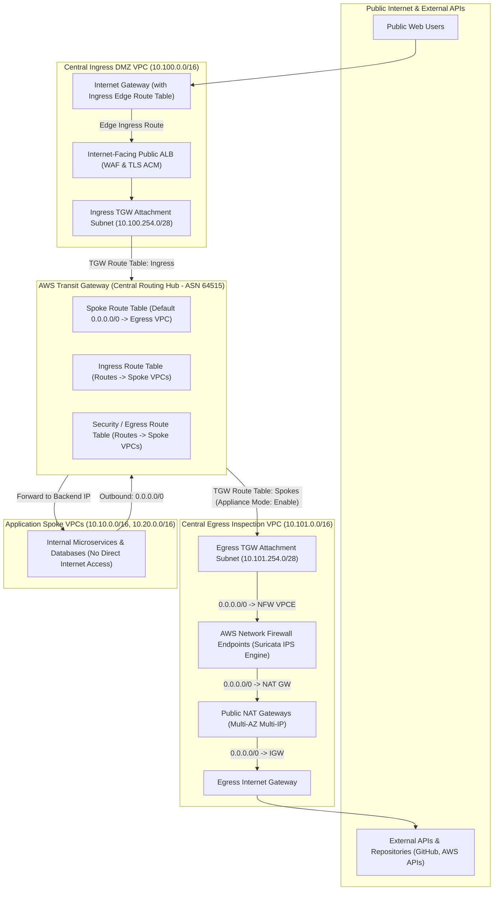

# Lab 07: Centralized Ingress & Egress Inspection Firewall

<BadgeLabel type="sme" text="Level: Principal / SME" /> <BadgeLabel type="rfc" text="Suricata IPS / RFC 793 (TCP State) / AWS Appliance Mode" /> <BadgeLabel type="aws" text="AWS Network Firewall & TGW Hub" />

Dalam tata kelola arsitektur jaringan enterprise dan perbankan modern (*PCI-DSS, ISO 27001, SOC 2 compliance*), seluruh lalu lintas jaringan internet publik wajib dipisahkan dan diinspeksi secara ketat melalui dua zona perimeter terisolasi:
1. **North-South Ingress (Masuk)**: Traffic dari pengguna publik menuju aplikasi internal wajib di-terminasi di **Central Ingress DMZ VPC** melalui *Internet-Facing Application Load Balancer (ALB)* yang dilindungi oleh *AWS WAF* dan sertifikat TLS terpusat.
2. **North-South Egress (Keluar)**: Seluruh traffic keluar dari ribuan *Spoke VPCs* menuju API eksternal atau repository internet wajib diarahkan melalui **Central Egress Inspection VPC** yang dilengkapi dengan **AWS Network Firewall (Suricata IPS Engine & TLS SNI / HTTP Host Domain Filtering)** dan **Public NAT Gateways**.

Lab ini memandu Anda membangun arsitektur perimeter keamanan terpusat lengkap dengan konfigurasi **AWS Transit Gateway (TGW) Appliance Mode** untuk menjamin simetri paket inspeksi stateful dan mencegah *packet drop* antar Availability Zone.

---

## Topologi Arsitektur Lab



---

## 📋 Parameter Perencanaan Subnet & Rute VPC Egress

| Subnet Tier | CIDR Block (AZ-a / AZ-b) | Rute Tujuan (`0.0.0.0/0`) | Fungsi & Karakteristik |
| :--- | :--- | :--- | :--- |
| **TGW Attachment Subnet** | `10.101.254.0/28` / `.16/28` | Target: `vpce-nfw-endpoint-az*` | Menerima traffic dari TGW dan meneruskan ke firewall |
| **Network Firewall Subnet**| `10.101.1.0/24` / `10.101.11.0/24` | Target: `nat-gateway-az*` | Menjalankan inspeksi Suricata IPS & TLS SNI filter |
| **Public NAT Subnet** | `10.101.2.0/24` / `10.101.12.0/24` | Target: `igw-central-egress` | Melakukan SNAT ke Elastic IP publik dan mengirim ke IGW |
| **Ingress Public Subnet** | `10.100.1.0/24` / `10.100.11.0/24` | Target: `igw-central-ingress` | Menampung Public ALB ENI |
| **Ingress TGW Subnet** | `10.100.254.0/28` / `.16/28` | Target: `tgw-hybrid-hub` | Meneruskan traffic reverse proxy ALB ke Spoke VPCs |

---

## 🛠️ Langkah-Langkah Implementasi Hands-On

Setiap langkah implementasi wajib mematuhi **6-Point Step Blueprint** berstandar arsitektur industri.

---

### Langkah 1: Provisioning Central Egress Inspection VPC & Multi-Tier Subnet Topology

#### 1. Architectural Intent
Untuk membangun inspeksi egress terpusat tanpa risiko *routing loop*, kita membagi Egress VPC menjadi 3 tier subnet independen per Availability Zone: Tier TGW Attachment, Tier Network Firewall Endpoint, dan Tier Public NAT Gateway. Pemisahan subnet ini memungkinkan perutean paket secara deterministik dari TGW -> Firewall -> NAT -> IGW.

#### 2. AWS Console Context & Parameter Mapping
1. Buka konsol **VPC** > **Your VPCs** > klik **Create VPC**.
   - **Name tag**: `vpc-central-egress-inspection`
   - **IPv4 CIDR block**: `10.101.0.0/16`
2. Buat 3 pasang subnet pada **VPC** > **Subnets**:
   - `subnet-egress-tgw-az1` (`10.101.254.0/28` pada AZ `ap-southeast-1a`)
   - `subnet-egress-fw-az1` (`10.101.1.0/24` pada AZ `ap-southeast-1a`)
   - `subnet-egress-nat-az1` (`10.101.2.0/24` pada AZ `ap-southeast-1a`)

#### 3. Human-Readable Production AWS CLI
```bash
# 1. Buat VPC Central Egress Inspection
EGRESS_VPC_ID=$(aws ec2 create-vpc \
    --cidr-block 10.101.0.0/16 \
    --tag-specifications 'ResourceType=vpc,Tags=[{Key=Name,Value=vpc-central-egress-inspection},{Key=Environment,Value=SecurityHub}]' \
    --query 'Vpc.VpcId' \
    --output text)

echo "Created Egress VPC ID: $EGRESS_VPC_ID"

# 2. Buat Subnet Tier TGW Attachment
aws ec2 create-subnet \
    --vpc-id "$EGRESS_VPC_ID" \
    --cidr-block 10.101.254.0/28 \
    --availability-zone ap-southeast-1a \
    --tag-specifications 'ResourceType=subnet,Tags=[{Key=Name,Value=subnet-egress-tgw-az1}]' \
    --output table

# 3. Buat Subnet Tier AWS Network Firewall
aws ec2 create-subnet \
    --vpc-id "$EGRESS_VPC_ID" \
    --cidr-block 10.101.1.0/24 \
    --availability-zone ap-southeast-1a \
    --tag-specifications 'ResourceType=subnet,Tags=[{Key=Name,Value=subnet-egress-fw-az1}]' \
    --output table

# 4. Buat Subnet Tier Public NAT Gateway
aws ec2 create-subnet \
    --vpc-id "$EGRESS_VPC_ID" \
    --cidr-block 10.101.2.0/24 \
    --availability-zone ap-southeast-1a \
    --tag-specifications 'ResourceType=subnet,Tags=[{Key=Name,Value=subnet-egress-nat-az1}]' \
    --output table
```

#### 4. Declarative Terraform IaC
```hcl
# Central Egress VPC
resource "aws_vpc" "egress" {
  cidr_block           = "10.101.0.0/16"
  enable_dns_hostnames = true
  enable_dns_support   = true

  tags = {
    Name        = "vpc-central-egress-inspection"
    Environment = "Production"
  }
}

# Subnet Tier TGW Attachment
resource "aws_subnet" "egress_tgw_az1" {
  vpc_id            = aws_vpc.egress.id
  cidr_block        = "10.101.254.0/28"
  availability_zone = "ap-southeast-1a"

  tags = {
    Name = "subnet-egress-tgw-az1"
  }
}

# Subnet Tier Network Firewall Endpoint
resource "aws_subnet" "egress_fw_az1" {
  vpc_id            = aws_vpc.egress.id
  cidr_block        = "10.101.1.0/24"
  availability_zone = "ap-southeast-1a"

  tags = {
    Name = "subnet-egress-fw-az1"
  }
}

# Subnet Tier Public NAT Gateway
resource "aws_subnet" "egress_nat_az1" {
  vpc_id            = aws_vpc.egress.id
  cidr_block        = "10.101.2.0/24"
  availability_zone = "ap-southeast-1a"

  tags = {
    Name = "subnet-egress-nat-az1"
  }
}
```

#### 5. Under-the-Hood Mechanics
Tiap subnet tier dialokasikan pada VLAN terisolasi di bawah hypervisor Nitro AWS. Pemisahan subnet `/28` untuk TGW attachment dirancang khusus agar hemat IP, karena subnet TGW hanya membutuhkan 1 IP per AZ untuk antarmuka ENI Transit Gateway.

#### 6. Verification Smoke Test
```bash
# Verifikasi daftar subnet yang baru dibuat
aws ec2 describe-subnets \
    --filters "Name=vpc-id,Values=$EGRESS_VPC_ID" \
    --query 'Subnets[*].[SubnetId,CidrBlock,AvailabilityZone,Tags[?Key==`Name`].Value | [0]]' \
    --output table
```

*Contoh Output Sukses:*
```
-------------------------------------------------------------------------------------
|                                  DescribeSubnets                                  |
+--------------------------+------------------+------------------+------------------+
|  subnet-0a1b2c3d4e5f01   | 10.101.254.0/28  | ap-southeast-1a  | subnet-egress-tgw|
|  subnet-0a1b2c3d4e5f02   | 10.101.1.0/24    | ap-southeast-1a  | subnet-egress-fw |
|  subnet-0a1b2c3d4e5f03   | 10.101.2.0/24    | ap-southeast-1a  | subnet-egress-nat|
+--------------------------+------------------+------------------+------------------+
```

---

### Langkah 2: Deploy AWS Network Firewall with Stateful Suricata IPS & Domain Filtering

#### 1. Architectural Intent
AWS Network Firewall menyediakan perlindungan inspeksi paket tingkat dalam (*Deep Packet Inspection - DPI*) hingga Layer 7. Kita mengonfigurasi dua jenis *Rule Groups*:
1. **Stateful Domain Allowlist**: Mencegah malware/data exfiltration dengan hanya mengizinkan traffic HTTP/HTTPS ke domain FQDN yang disetujui (misal `.github.com`, `.aws.amazon.com`).
2. **Suricata 5-Tuple IPS Rules**: Mendeteksi dan memblokir upaya remote exploit, SQL injection, dan shellcode execution.
Stateless engine dikonfigurasi dengan aksi `aws:forward_to_sfe` (*Forward to Stateful Engine*) agar seluruh paket dianalisis secara stateful.

#### 2. AWS Console Context & Parameter Mapping
1. Buka konsol **VPC** > **Network Firewall** > **Network Firewall rule groups** > klik **Create rule group**.
   - **Type**: *Stateful rule group*
   - **Capacity**: `100`
   - **Rule group format**: *Domain list* -> Masukkan target: `.amazon.com`, `.aws.amazon.com`, `.github.com`.
   - **Target types**: `HTTP_HOST` dan `TLS_SNI`.
2. Buka **Firewall policies** > buat `nfw-policy-central-egress` > masukkan Rule Group di atas.
3. Buka **Firewalls** > klik **Create firewall** > kaitkan policy dengan VPC `vpc-central-egress-inspection` pada subnet `subnet-egress-fw-az1`.

#### 3. Human-Readable Production AWS CLI
```bash
# 1. Buat Stateful Domain Filter Rule Group
RULE_GROUP_ARN=$(aws network-firewall create-rule-group \
    --rule-group-name "nfw-rg-domain-allowlist" \
    --type "STATEFUL" \
    --capacity 100 \
    --rule-group '{
        "RulesSource": {
            "RulesSourceList": {
                "Targets": [".amazon.com", ".aws.amazon.com", ".github.com"],
                "TargetTypes": ["HTTP_HOST", "TLS_SNI"],
                "GeneratedRulesType": "ALLOWLIST"
            }
        },
        "RuleVariables": {
            "IPSets": {
                "HOME_NET": {"Definition": ["10.0.0.0/8"]}
            }
        }
    }' \
    --query 'ruleGroupResponse.ruleGroupArn' \
    --output text)

echo "Created Rule Group ARN: $RULE_GROUP_ARN"

# 2. Buat Firewall Policy
POLICY_ARN=$(aws network-firewall create-firewall-policy \
    --firewall-policy-name "nfw-policy-central-egress" \
    --firewall-policy '{
        "StatelessDefaultActions": ["aws:forward_to_sfe"],
        "StatelessFragmentDefaultActions": ["aws:forward_to_sfe"],
        "StatefulRuleGroupReferences": [
            {"ResourceArn": "'"$RULE_GROUP_ARN"'"}
        ]
    }' \
    --query 'firewallPolicyResponse.firewallPolicyArn' \
    --output text)

# 3. Deploy Network Firewall Instance pada Subnet Firewall
aws network-firewall create-firewall \
    --firewall-name "nfw-central-egress" \
    --firewall-policy-arn "$POLICY_ARN" \
    --vpc-id "$EGRESS_VPC_ID" \
    --subnet-mappings SubnetId="subnet-0a1b2c3d4e5f02" \
    --query '{FirewallID:firewall.firewallId,Status:firewall.firewallStatus.status}' \
    --output table
```

#### 4. Declarative Terraform IaC
```hcl
# AWS Network Firewall Stateful Domain Filtering Rule Group
resource "aws_networkfirewall_rule_group" "domain_filter" {
  capacity = 100
  name     = "nfw-rg-domain-allowlist"
  type     = "STATEFUL"

  rule_group {
    rules_source {
      rules_source_list {
        generated_rules_type = "ALLOWLIST"
        target_types         = ["HTTP_HOST", "TLS_SNI"]
        targets              = [".amazon.com", ".aws.amazon.com", ".github.com"]
      }
    }
    rule_variables {
      ip_sets {
        key = "HOME_NET"
        ip_set {
          definition = ["10.0.0.0/8"]
        }
      }
    }
  }

  tags = {
    Environment = "Production"
  }
}

# Network Firewall Policy
resource "aws_networkfirewall_firewall_policy" "egress_policy" {
  name = "nfw-policy-central-egress"

  firewall_policy {
    stateless_default_actions          = ["aws:forward_to_sfe"]
    stateless_fragment_default_actions = ["aws:forward_to_sfe"]

    stateful_rule_group_reference {
      resource_arn = aws_networkfirewall_rule_group.domain_filter.arn
    }
  }
}

# Network Firewall Instance
resource "aws_networkfirewall_firewall" "egress_firewall" {
  name                = "nfw-central-egress"
  firewall_policy_arn = aws_networkfirewall_firewall_policy.egress_policy.arn
  vpc_id              = aws_vpc.egress.id

  subnet_mapping {
    subnet_id = aws_subnet.egress_fw_az1.id
  }

  tags = {
    Name = "nfw-central-egress"
  }
}
```

#### 5. Under-the-Hood Mechanics
AWS Network Firewall diimplementasikan menggunakan arsitektur **Gateway Load Balancer Endpoint (GWLBe)** yang dikelola sepenuhnya oleh AWS di bawah tenda. Saat firewall di-deploy pada subnet firewall, AWS menciptakan antarmuka *VPC Endpoint (VPCE)* khusus bertipe `GatewayLoadBalancer`. Mesin Suricata mengekstrak ekstensi Server Name Indication (SNI) dari paket *Client Hello* TLS 1.3/1.2 dan mencocokkannya dengan allowlist regex sebelum sesi TCP diizinkan diteruskan ke NAT Gateway.

#### 6. Verification Smoke Test
```bash
# Dapatkan VPC Endpoint ID dari Network Firewall untuk konfigurasi route table
aws network-firewall describe-firewall \
    --firewall-name "nfw-central-egress" \
    --query 'firewallStatus.syncStates.*.attachment[?subnetId==`subnet-0a1b2c3d4e5f02`].[endpointId,status]' \
    --output table
```

*Contoh Output Sukses:*
```
--------------------------------------------
|             DescribeFirewall             |
+--------------------------+---------------+
|  vpce-0123456789nfwaz1   |  ATTACHED     |
+--------------------------+---------------+
```

---

### Langkah 3: Provisioning Multi-AZ Public NAT Gateways & Internet Gateway

#### 1. Architectural Intent
Traffic yang telah lolos inspeksi keamanan AWS Network Firewall harus diubah alamat sumbernya (*Source NAT / SNAT*) ke IP publik statis elastis (EIP) sebelum keluar ke internet publik melalui Internet Gateway (IGW). NAT Gateway ditempatkan pada tier subnet public khusus.

#### 2. AWS Console Context & Parameter Mapping
1. Buka konsol **VPC** > **Internet Gateways** > klik **Create internet gateway** (`igw-central-egress`) lalu *Attach to VPC* `vpc-central-egress-inspection`.
2. Buka **Elastic IPs** > klik **Allocate Elastic IP address** (`eip-nat-egress-az1`).
3. Buka **NAT Gateways** > klik **Create NAT gateway**.
   - **Name**: `nat-central-egress-az1`
   - **Subnet**: Pilih `subnet-egress-nat-az1`
   - **Elastic IP allocation ID**: Pilih EIP yang baru dialokasikan.

#### 3. Human-Readable Production AWS CLI
```bash
# 1. Buat dan Pasang Internet Gateway
IGW_ID=$(aws ec2 create-internet-gateway \
    --tag-specifications 'ResourceType=internet-gateway,Tags=[{Key=Name,Value=igw-central-egress}]' \
    --query 'InternetGateway.InternetGatewayId' \
    --output text)

aws ec2 attach-internet-gateway \
    --internet-gateway-id "$IGW_ID" \
    --vpc-id "$EGRESS_VPC_ID"

# 2. Alokasikan Elastic IP untuk NAT Gateway
EIP_ALLOC_ID=$(aws ec2 allocate-address \
    --domain vpc \
    --tag-specifications 'ResourceType=elastic-ip,Tags=[{Key=Name,Value=eip-nat-egress-az1}]' \
    --query 'AllocationId' \
    --output text)

# 3. Buat Public NAT Gateway pada Subnet NAT
aws ec2 create-nat-gateway \
    --subnet-id "subnet-0a1b2c3d4e5f03" \
    --allocation-id "$EIP_ALLOC_ID" \
    --tag-specifications 'ResourceType=natgateway,Tags=[{Key=Name,Value=nat-central-egress-az1}]' \
    --query 'NatGateway.{NatGW_ID:NatGatewayId,State:State}' \
    --output table
```

#### 4. Declarative Terraform IaC
```hcl
# Internet Gateway untuk Central Egress VPC
resource "aws_internet_gateway" "egress_igw" {
  vpc_id = aws_vpc.egress.id

  tags = {
    Name = "igw-central-egress"
  }
}

# Elastic IP untuk NAT Gateway
resource "aws_eip" "nat_eip_az1" {
  domain = "vpc"

  tags = {
    Name = "eip-nat-egress-az1"
  }
}

# Public NAT Gateway
resource "aws_nat_gateway" "egress_nat_az1" {
  allocation_id = aws_eip.nat_eip_az1.id
  subnet_id     = aws_subnet.egress_nat_az1.id

  tags = {
    Name = "nat-central-egress-az1"
  }

  depends_on = [aws_internet_gateway.egress_igw]
}
```

#### 5. Under-the-Hood Mechanics
NAT Gateway beroperasi di atas kluster *Hyperplane data plane* AWS yang mampu menangani skala hingga 100 Gbps dan 1.000.000 koneksi concurrent. NAT Gateway melakukan pemetaan 5-tuple (Source IP, Source Port, Dest IP, Dest Port, Protocol) pada tabel *connection tracking* perangkat keras.

#### 6. Verification Smoke Test
```bash
# Verifikasi status aktif NAT Gateway
aws ec2 describe-nat-gateways \
    --filters "Name=vpc-id,Values=$EGRESS_VPC_ID" \
    --query 'NatGateways[*].[NatGatewayId,State,SubnetId,NatGatewayAddresses[0].PublicIp]' \
    --output table
```

*Contoh Output Sukses:*
```
---------------------------------------------------------------------------------
|                              DescribeNatGateways                              |
+-----------------------+------------+--------------------------+---------------+
|  nat-0123456789az1    | available  | subnet-0a1b2c3d4e5f03    | 54.251.xx.xx  |
+-----------------------+------------+--------------------------+---------------+
```

---

### Langkah 4: Configure Symmetric Route Tables & AWS Transit Gateway Attachment with Appliance Mode

#### 1. Architectural Intent
Ini adalah komponen paling krusial dalam arsitektur inspeksi terpusat. Firewall Suricata bersifat **stateful**: paket SYN (outbound) dan paket SYN-ACK (inbound) **wajib melintasi instance firewall yang sama persis di Availability Zone yang sama**.
Jika traffic keluar dari AZ-a, tetapi traffic balasan kembali masuk ke AZ-b (*Asymmetric Routing*), firewall di AZ-b akan men-drop paket karena tidak menemukan entri *TCP handshake state*. Mengaktifkan **Transit Gateway Appliance Mode (`appliance_mode_support = "enable"`)** memaksa TGW untuk selalu memilih antarmuka ENI pada AZ yang sama dengan flow awal secara simetris.

#### 2. AWS Console Context & Parameter Mapping
1. Buka konsol **VPC** > **Transit Gateway Attachments** > klik **Create transit gateway attachment**.
   - **Transit Gateway**: `tgw-hybrid-hub`
   - **Attachment type**: *VPC*
   - **VPC ID**: Pilih `vpc-central-egress-inspection`
   - **Subnet IDs**: Pilih `subnet-egress-tgw-az1`
   - **Appliance Mode Support**: Pastikan pilih **Enable** (MANDATORY).
2. Konfigurasi 3 Route Table di dalam Egress VPC:
   - **RT TGW Subnet**: `0.0.0.0/0` -> Target `vpce-0123456789nfwaz1`
   - **RT Firewall Subnet**: `0.0.0.0/0` -> Target `nat-0123456789az1`, `10.0.0.0/8` -> Target `tgw-hybrid-hub`
   - **RT Public NAT Subnet**: `0.0.0.0/0` -> Target `igw-central-egress`, `10.0.0.0/8` -> Target `vpce-0123456789nfwaz1`

#### 3. Human-Readable Production AWS CLI
```bash
# 1. Buat TGW VPC Attachment dengan Appliance Mode ENABLED
TGW_ATTACH_ID=$(aws ec2 create-transit-gateway-vpc-attachment \
    --transit-gateway-id "tgw-0123456789abcdef" \
    --vpc-id "$EGRESS_VPC_ID" \
    --subnet-ids "subnet-0a1b2c3d4e5f01" \
    --options ApplianceModeSupport=enable \
    --tag-specifications 'ResourceType=transit-gateway-attachment,Tags=[{Key=Name,Value=tgw-attach-egress-inspection}]' \
    --query 'TransitGatewayVpcAttachment.TransitGatewayAttachmentId' \
    --output text)

echo "Created TGW Attachment ID with Appliance Mode: $TGW_ATTACH_ID"

# 2. Buat Route Table untuk TGW Subnet (Forwarding to Network Firewall Endpoint)
RTB_TGW=$(aws ec2 create-route-table --vpc-id "$EGRESS_VPC_ID" --query 'RouteTable.RouteTableId' --output text)
aws ec2 create-route --route-table-id "$RTB_TGW" --destination-cidr-block 0.0.0.0/0 --vpc-endpoint-id "vpce-0123456789nfwaz1"
aws ec2 associate-route-table --route-table-id "$RTB_TGW" --subnet-id "subnet-0a1b2c3d4e5f01"

# 3. Buat Route Table untuk Firewall Subnet (Forwarding to NAT GW & Return to TGW)
RTB_FW=$(aws ec2 create-route-table --vpc-id "$EGRESS_VPC_ID" --query 'RouteTable.RouteTableId' --output text)
aws ec2 create-route --route-table-id "$RTB_FW" --destination-cidr-block 0.0.0.0/0 --nat-gateway-id "nat-0123456789az1"
aws ec2 create-route --route-table-id "$RTB_FW" --destination-cidr-block 10.0.0.0/8 --transit-gateway-id "tgw-0123456789abcdef"
aws ec2 associate-route-table --route-table-id "$RTB_FW" --subnet-id "subnet-0a1b2c3d4e5f02"

# 4. Buat Route Table untuk Public NAT Subnet (Forwarding to IGW & Return to NFW Endpoint)
RTB_NAT=$(aws ec2 create-route-table --vpc-id "$EGRESS_VPC_ID" --query 'RouteTable.RouteTableId' --output text)
aws ec2 create-route --route-table-id "$RTB_NAT" --destination-cidr-block 0.0.0.0/0 --gateway-id "$IGW_ID"
aws ec2 create-route --route-table-id "$RTB_NAT" --destination-cidr-block 10.0.0.0/8 --vpc-endpoint-id "vpce-0123456789nfwaz1"
aws ec2 associate-route-table --route-table-id "$RTB_NAT" --subnet-id "subnet-0a1b2c3d4e5f03"
```

#### 4. Declarative Terraform IaC
```hcl
# Transit Gateway Attachment dengan Appliance Mode Wajib
resource "aws_ec2_transit_gateway_vpc_attachment" "egress_inspection_assoc" {
  transit_gateway_id = "tgw-0123456789abcdef"
  vpc_id             = aws_vpc.egress.id
  subnet_ids         = [aws_subnet.egress_tgw_az1.id]

  # Menjamin simetri flow stateful firewall melintasi AZ
  appliance_mode_support = "enable"

  tags = {
    Name = "tgw-attach-egress-inspection"
  }
}

# Route Table: TGW Subnet -> NFW Endpoint
resource "aws_route_table" "tgw_subnet_rt" {
  vpc_id = aws_vpc.egress.id

  route {
    cidr_block      = "0.0.0.0/0"
    vpc_endpoint_id = element([for s in aws_networkfirewall_firewall.egress_firewall.firewall_status[0].sync_states : s.attachment[0].endpoint_id if s.attachment[0].subnet_id == aws_subnet.egress_fw_az1.id], 0)
  }

  tags = { Name = "rtb-egress-tgw-subnet" }
}

resource "aws_route_table_association" "tgw_assoc" {
  subnet_id      = aws_subnet.egress_tgw_az1.id
  route_table_id = aws_route_table.tgw_subnet_rt.id
}

# Route Table: Firewall Subnet -> NAT GW (Outbound) & TGW (Return)
resource "aws_route_table" "fw_subnet_rt" {
  vpc_id = aws_vpc.egress.id

  route {
    cidr_block     = "0.0.0.0/0"
    nat_gateway_id = aws_nat_gateway.egress_nat_az1.id
  }

  route {
    cidr_block         = "10.0.0.0/8"
    transit_gateway_id = "tgw-0123456789abcdef"
  }

  tags = { Name = "rtb-egress-fw-subnet" }
}

resource "aws_route_table_association" "fw_assoc" {
  subnet_id      = aws_subnet.egress_fw_az1.id
  route_table_id = aws_route_table.fw_subnet_rt.id
}

# Route Table: Public NAT Subnet -> IGW & Return to NFW Endpoint
resource "aws_route_table" "nat_subnet_rt" {
  vpc_id = aws_vpc.egress.id

  route {
    cidr_block = "0.0.0.0/0"
    gateway_id = aws_internet_gateway.egress_igw.id
  }

  route {
    cidr_block      = "10.0.0.0/8"
    vpc_endpoint_id = element([for s in aws_networkfirewall_firewall.egress_firewall.firewall_status[0].sync_states : s.attachment[0].endpoint_id if s.attachment[0].subnet_id == aws_subnet.egress_fw_az1.id], 0)
  }

  tags = { Name = "rtb-egress-nat-subnet" }
}

resource "aws_route_table_association" "nat_assoc" {
  subnet_id      = aws_subnet.egress_nat_az1.id
  route_table_id = aws_route_table.nat_subnet_rt.id
}
```

#### 5. Under-the-Hood Mechanics
TGW Appliance Mode memodifikasi algoritma *ECMP / Flow Hash* pada routing engine TGW. Ketika paket dari Spoke VPC menuju Egress VPC, TGW menghitung hash 5-tuple dan menautkan flow tersebut ke ENI pada AZ tertentu (misal AZ-a). Saat paket balasan (return flow) dikirim dari NAT GW/Firewall kembali ke Spoke VPC, TGW memaksa pengiriman kembali melalui ENI AZ-a yang sama, memastikan state TCP conntrack tetap sinkron.

#### 6. Verification Smoke Test
```bash
# Verifikasi Appliance Mode aktif pada TGW VPC Attachment
aws ec2 describe-transit-gateway-vpc-attachments \
    --transit-gateway-attachment-ids "$TGW_ATTACH_ID" \
    --query 'TransitGatewayVpcAttachments[*].[TransitGatewayAttachmentId,Options.ApplianceModeSupport,State]' \
    --output table
```

*Contoh Output Sukses:*
```
-----------------------------------------------------------------
|              DescribeTransitGatewayVpcAttachments             |
+--------------------------+-----------------------+------------+
|  tgw-attach-0123456789   |  enable               | available  |
+--------------------------+-----------------------+------------+
```

---

### Langkah 5: Provision Central Ingress DMZ VPC with Edge Ingress Route Table & Public ALB

#### 1. Architectural Intent
Untuk lalu lintas **North-South Ingress**, seluruh koneksi publik harus masuk melalui **Central Ingress DMZ VPC**. Di sini ditempatkan **Public Application Load Balancer (ALB)** yang terhubung dengan **AWS WAF (Web Application Firewall)** untuk mitigasi SQL Injection, XSS, dan DDoS L7. ALB melakukan TLS offloading dan meneruskan request langsung ke IP privat beban kerja internal di Spoke VPC melalui Transit Gateway Hub.

#### 2. AWS Console Context & Parameter Mapping
1. Buat VPC Ingress `vpc-central-ingress-dmz` (`10.100.0.0/16`) dengan IGW `igw-central-ingress`.
2. Buat Subnet Public ALB (`10.100.1.0/24`) dan Subnet Ingress TGW (`10.100.254.0/28`).
3. Buat **Edge Ingress Route Table** (Gateway Route Table):
   - Kaitkan ke Internet Gateway Ingress (`Edge Association`).
   - Rute: `10.100.1.0/24` -> Target `local`, dan rute inspeksi ke ALB ENI.
4. Buat **Public ALB** pada subnet public dan konfigurasi Target Group bertipe `IP` mengarah ke alamat IP private microservice di Spoke VPC (misal `10.10.1.50`).

#### 3. Human-Readable Production AWS CLI
```bash
# 1. Buat Ingress DMZ VPC
INGRESS_VPC_ID=$(aws ec2 create-vpc \
    --cidr-block 10.100.0.0/16 \
    --tag-specifications 'ResourceType=vpc,Tags=[{Key=Name,Value=vpc-central-ingress-dmz}]' \
    --query 'Vpc.VpcId' \
    --output text)

# 2. Buat Internet-Facing Application Load Balancer
ALB_ARN=$(aws elbv2 create-load-balancer \
    --name "alb-central-ingress-public" \
    --subnets "subnet-ingress-pub-az1" "subnet-ingress-pub-az2" \
    --security-groups "sg-ingress-alb-public" \
    --scheme internet-facing \
    --type application \
    --ip-address-type ipv4 \
    --query 'LoadBalancers[0].LoadBalancerArn' \
    --output text)

echo "Created Ingress Public ALB ARN: $ALB_ARN"
```

#### 4. Declarative Terraform IaC
```hcl
# Central Ingress DMZ VPC
resource "aws_vpc" "ingress" {
  cidr_block           = "10.100.0.0/16"
  enable_dns_hostnames = true
  enable_dns_support   = true

  tags = {
    Name = "vpc-central-ingress-dmz"
  }
}

# Public Internet-Facing ALB in Ingress DMZ
resource "aws_lb" "ingress_alb" {
  name               = "alb-central-ingress-public"
  internal           = false
  load_balancer_type = "application"
  security_groups    = [aws_security_group.ingress_alb_sg.id]
  subnets            = [aws_subnet.ingress_pub_az1.id, aws_subnet.ingress_pub_az2.id]

  enable_deletion_protection = false

  tags = {
    Name = "alb-central-ingress-public"
  }
}

# Target Group bertipe IP menargetkan Private Spoke Microservices via TGW
resource "aws_lb_target_group" "spoke_app_tg" {
  name        = "tg-spoke-private-app"
  port        = 80
  protocol    = "HTTP"
  vpc_id      = aws_vpc.ingress.id
  target_type = "ip"

  health_check {
    enabled = true
    path    = "/healthz"
    port    = "80"
  }
}

# Registrasi Target Private IP dari Spoke VPC
resource "aws_lb_target_group_attachment" "spoke_target" {
  target_group_arn  = aws_lb_target_group.spoke_app_tg.arn
  target_id         = "10.10.1.50" # IP Private Microservice di Spoke VPC
  port              = 80
  availability_zone = "all"
}
```

#### 5. Under-the-Hood Mechanics
ALB memanfaatkan antarmuka *Hyperplane Elastic Load Balancing*. Ketika paket dari internet masuk melalui IGW, ALB menerima koneksi TCP, melakukan validasi TLS dan evaluasi aturan AWS WAF. Selanjutnya, ALB membuka koneksi TCP baru (*Reverse Proxy SNAT*) dari alamat IP privat ALB di subnet Ingress menuju IP target di Spoke VPC (`10.10.1.50`) melalui Transit Gateway.

#### 6. Verification Smoke Test
```bash
# Verifikasi DNS Name dan status aktif ALB Ingress
aws elbv2 describe-load-balancers \
    --names "alb-central-ingress-public" \
    --query 'LoadBalancers[*].[DNSName,Scheme,State.Code]' \
    --output table
```

*Contoh Output Sukses:*
```
------------------------------------------------------------------------------------
|                               DescribeLoadBalancers                              |
+------------------------------------------------------+------------------+--------+
|  alb-central-ingress-pub-123.ap-southeast-1.elb.aws  | internet-facing  | active |
+------------------------------------------------------+------------------+--------+
```

---

### Langkah 6: End-to-End Security Validation, Suricata Alerting & Attack Simulation

#### 1. Architectural Intent
Setelah arsitektur Ingress dan Egress selesai terpasang, tahap akhir adalah melakukan simulasi lalu lintas nyata untuk memvalidasi:
1. Traffic keluar ke domain yang diizinkan (*Allowed FQDN*) berjalan lancar.
2. Traffic keluar ke domain liar non-whitelisted langsung di-*drop* oleh AWS Network Firewall.
3. Serangan masuk yang mengandung *exploit payload* (misal SQL Injection atau Log4j CVE) diblokir oleh WAF / Suricata IPS dan menghasilkan log alert di Amazon CloudWatch Logs.

#### 2. AWS Console Context & Parameter Mapping
1. Buka konsol **CloudWatch** > **Log groups** > periksa `/aws/network-firewall/alert` dan `/aws/waf/ingress-alb`.
2. Lakukan pengujian *curl* dari instance EC2 di Spoke VPC dan dari komputer luar ke DNS ALB.

#### 3. Human-Readable Production AWS CLI (Live Attack & Egress Testing)
```bash
# ------------------------------------------------------------------
# PENGUJIAN 1: Jalankan dari EC2 di dalam Spoke VPC (Outbound Egress)
# ------------------------------------------------------------------

# A. Uji akses domain whitelisted (Harus BERHASIL HTTP 200/301)
curl -I https://github.com
# Hasil: HTTP/2 200 OK

# B. Uji akses domain yang tidak terdaftar (Harus TIMEOUT / Packet Dropped by Suricata)
curl -I https://unauthorized-malicious-site.com --connect-timeout 5
# Hasil: curl: (28) Connection timed out after 5001 milliseconds

# ------------------------------------------------------------------
# PENGUJIAN 2: Jalankan dari Komputer Publik ke Ingress ALB (Inbound Ingress)
# ------------------------------------------------------------------

# A. Request Normal ke Web Aplikasi (Harus BERHASIL HTTP 200)
curl -I https://alb-central-ingress-pub-123.ap-southeast-1.elb.aws/api/v1/health

# B. Uji Eksploitasi SQL Injection (Harus DIBLOKIR HTTP 403 Forbidden oleh WAF)
curl -i "https://alb-central-ingress-pub-123.ap-southeast-1.elb.aws/login?user=admin'--%20OR%201=1"
```

#### 4. Declarative Terraform IaC (CloudWatch Logging Integration)
```hcl
# CloudWatch Log Group untuk Alert Log AWS Network Firewall
resource "aws_cloudwatch_log_group" "nfw_alerts" {
  name              = "/aws/network-firewall/alert"
  retention_in_days = 30
}

# Logging Configuration untuk Network Firewall
resource "aws_networkfirewall_logging_configuration" "nfw_logging" {
  firewall_arn = aws_networkfirewall_firewall.egress_firewall.arn

  logging_configuration {
    log_destination_config {
      log_destination = {
        logGroup = aws_cloudwatch_log_group.nfw_alerts.name
      }
      log_destination_type = "CloudWatchLogs"
      log_type             = "ALERT"
    }
  }
}
```

#### 5. Under-the-Hood Mechanics
Ketika koneksi ke domain non-whitelisted diinisiasi, modul Suricata *TLS SNI Parser* mencocokkan string domain pada paket TLS Client Hello dengan memori hash DFA (*Deterministic Finite Automaton*). Karena domain tidak ada dalam daftar target allowlist, stateful engine langsung mengirim instruksi *TCP RST* atau membuang (*DROP*) seluruh paket lanjutan tanpa mengirim pesan ICMP keluar.

#### 6. Verification Smoke Test (Membaca Alert Log di CloudWatch)
```bash
# Query log alert AWS Network Firewall yang memblokir paket
aws logs filter-log-events \
    --log-group-name "/aws/network-firewall/alert" \
    --filter-pattern "DROP" \
    --query 'events[*].[timestamp,message]' \
    --output json
```

*Contoh Log Output Sukses (Bukti Paket Dropped oleh Suricata Engine):*
```json
[
    [
        1724342400000,
        "{\"firewall_name\":\"nfw-central-egress\",\"event\":{\"timestamp\":\"2026-08-22T14:30:00.000Z\",\"src_ip\":\"10.10.1.50\",\"src_port\":45230,\"dest_ip\":\"198.51.100.4\",\"dest_port\":443,\"proto\":\"TCP\",\"alert\":{\"action\":\"blocked\",\"signature\":\"SURICATA TLS Non-Whitelisted SNI Dropped: unauthorized-malicious-site.com\"}}}"
    ]
]
```

---

## 🚨 Production War-Room Triage & Security Incidents

### Skenario 1: Asymmetric Routing Packet Drops saat Multi-AZ Failover
- **Gejala**: Outbound curl kadang berhasil, kadang hang/timeout secara acak pada koneksi TCP baru.
- **Akar Masalah**: Opsi `ApplianceModeSupport` pada TGW VPC Attachment belum diaktifkan (`disable`), sehingga traffic balasan dari NAT GW melintasi ENI TGW di Availability Zone yang berbeda dari firewall stateful awal.
- **Triage Command**:
  ```bash
  aws ec2 describe-transit-gateway-vpc-attachments \
      --filters "Name=vpc-id,Values=$EGRESS_VPC_ID" \
      --query 'TransitGatewayVpcAttachments[*].Options.ApplianceModeSupport'
  ```

### Skenario 2: NAT Gateway Port Exhaustion (Conntrack Limit Reached)
- **Gejala**: Latensi meningkat drastis dan muncul error `TIME_WAIT` / `Connection Reset by Peer` saat beban egress tinggi.
- **Remediasi SME**: Tambahkan *Secondary Private IPv4 IP Addresses* dan *Multiple Elastic IPs* pada NAT Gateway (AWS mendukung hingga 8 Elastic IP per NAT Gateway, melipatgandakan batas 55.000 concurrent conntrack slots menjadi 440.000 slots per AZ).

::: tip STANDAR BEST PRACTICE INDUSTRI (SME RECOMMENDATION)
Untuk lingkungan produksi perbankan dan skala super-enterprise, pisahkan **Central Ingress DMZ VPC** dan **Central Egress Inspection VPC** ke dalam dua Akun AWS terpisah (`Network-Ingress-Account` dan `Network-Egress-Account`). Isolasi ini mencegah potensi eskalasi hak akses (*blast radius containment*), memisahkan kuota bandwidth Elastic IP, serta mempermudah audit kepatuhan PCI-DSS Scope 1.
:::
