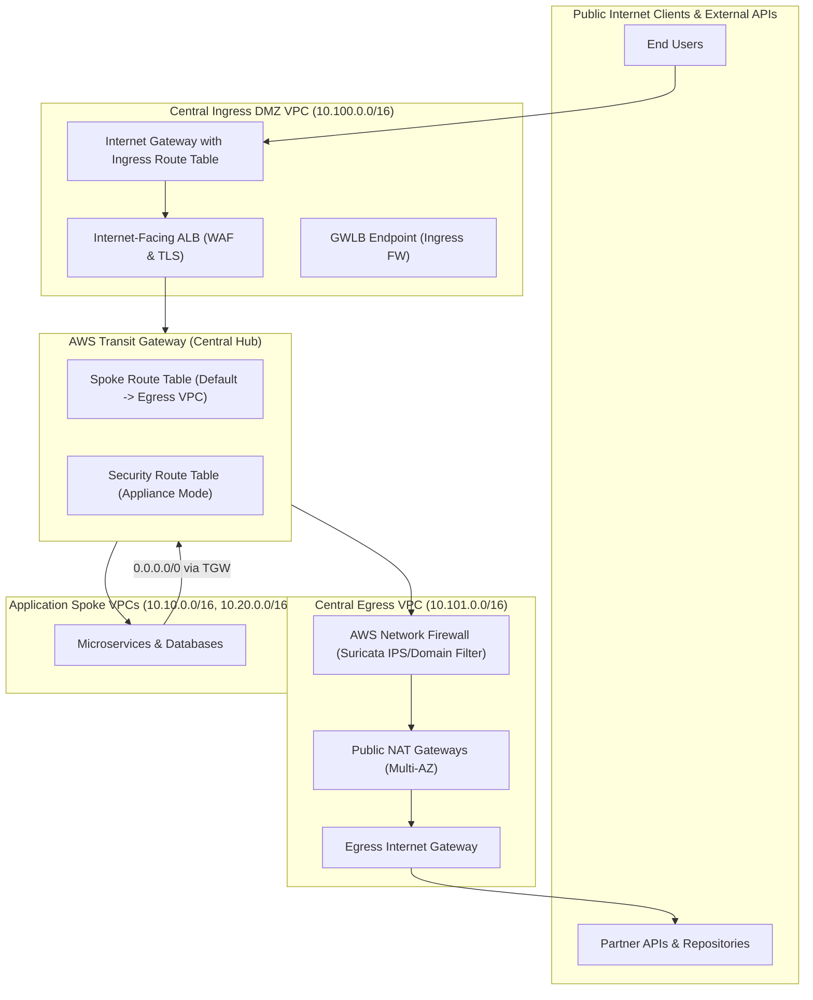

# 🛡️ Lab 07: Centralized Ingress & Egress Inspection Firewall

<BadgeLabel type="sme" text="Level: Principal / SME" /> <BadgeLabel type="lab" text="Hands-on IaC Blueprint" />

Dalam lab arsitektur tingkat lanjut ini, Anda akan membangun **Central Security & DMZ Hub** enterprise lengkap yang memisahkan dan mengamankan dua vektor traffic internet: **North-South Ingress** (traffic masuk dari publik ke aplikasi privat) dan **North-South Egress** (traffic keluar dari beban kerja internal ke internet melalui AWS Network Firewall Suricata IPS).

---

## 🏗️ Topologi Arsitektur Lab



---

## 📋 Fitur & Komponen Utama yang Dikonfigurasi

1. **Central Ingress DMZ VPC**: Menampung Public ALB, AWS WAF WebACL, dan Ingress Edge Route Table yang mencegat paket sebelum diteruskan ke TGW.
2. **Central Egress Inspection VPC**: Dilengkapi dengan AWS Network Firewall Endpoint di setiap AZ, NAT Gateway, dan rute transit simetris.
3. **AWS Network Firewall Stateful Suricata Rule Groups**:
   - Aturan deteksi Intrusion Prevention System (IPS) terhadap eksploitasi CVE, SQL Injection, dan remote shell.
   - Aturan *Domain List Filtering* (mengizinkan hanya domain whitelisted: `*.aws.amazon.com`, `*.github.com`).
4. **Transit Gateway Route Segregation**: Pemisahan `tgw-rtb-spokes`, `tgw-rtb-ingress`, dan `tgw-rtb-egress` dengan Appliance Mode aktif.

---

## 🛠️ Langkah Deployment Terraform

```bash
# 1. Masuk ke direktori lab
cd labs/07-centralized-ingress-egress-firewall

# 2. Inisialisasi dan validasi Terraform
terraform init -backend=false
terraform validate

# 3. Tinjau eksekusi plan
terraform plan

# 4. Deploy infrastruktur
terraform apply -auto-approve
```

---

## 🔍 Verification & Triage Runbook

### 1. Uji Ingress Traffic melalui Public ALB
```bash
# Kirim request HTTP normal ke Ingress ALB
curl -I https://app.enterprise-demo.com/api/v1/status

# Uji eksploitasi yang diblokir oleh WAF / Ingress Firewall (harus mengembalikan HTTP 403 Forbidden)
curl -i "https://app.enterprise-demo.com/login?user=admin'--%20OR%201=1"
```

### 2. Uji Egress Traffic & Domain Filtering dari Spoke EC2
```bash
# Uji koneksi ke domain whitelisted (harus berhasil)
curl -I https://github.com

# Uji koneksi ke domain non-whitelisted (harus di-drop oleh AWS Network Firewall)
curl -I https://unauthorized-domain-example.com --connect-timeout 5
```

### 3. Periksa Log AWS Network Firewall pada CloudWatch
```bash
aws logs filter-log-events \
    --log-group-name "/aws/network-firewall/alert" \
    --filter-pattern "DROP"
```

::: tip STANDAR BEST PRACTICE INDUSTRI (SME RECOMMENDATION)
Selalu pisahkan **Central Ingress VPC** dan **Central Egress VPC** dalam akun AWS terpisah (misal `Network-Ingress-Account` dan `Network-Egress-Account`) untuk memisahkan *blast radius*, mengisolasi sertifikat publik dan kuota bandwidth internet, serta menyederhanakan audit PCI-DSS.
:::
