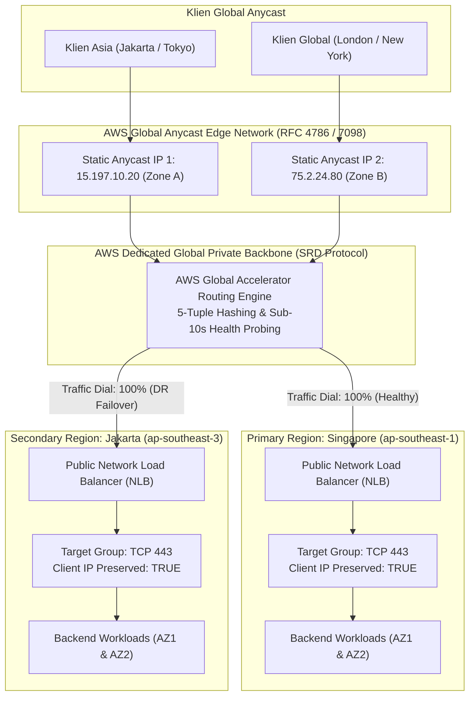

# Lab 08: Multi-Region Active-Active Ingress dengan AWS Global Accelerator

<BadgeLabel type="sme" text="Level: Principal / SME" /> <BadgeLabel type="rfc" text="RFC 4786 (Anycast) / RFC 7098 (Anycast Flow)" /> <BadgeLabel type="aws" text="Multi-Region Active-Active Ingress" />

Dalam arsitektur *Mission-Critical Financial Services* dan aplikasi terdistribusi global, toleransi *downtime* mendekati nol (*Zero RPO/RTO*). Mengandalkan perutean DNS konvensional (seperti Route 53 DNS Failover) sering kali terbentur oleh kendala **DNS Caching** pada *Recursive Resolvers* ISP pihak ketiga, yang menyebabkan pemulihan bencana (*Disaster Recovery failover*) memakan waktu bermenit-menit.

**AWS Global Accelerator (AGA)** mengeliminasi ketergantungan pada DNS caching dengan menyediakan **2 Static Anycast IPv4 Addresses** dari dua *Independent Network Zones* (INZ). Seluruh lalu lintas TCP/UDP diarahkan ke *Point of Presence* (PoP) terdekat dengan pengguna, lalu ditransmisikan melalui **AWS Global Dedicated Private Fiber Backbone** langsung ke target regional (**Singapore `ap-southeast-1`** dan **Jakarta `ap-southeast-3`**) dengan waktu konvergensi failover **di bawah 10 detik**.

---

## 1. Topologi & Arsitektur Lab



---

## 2. Tujuan & Sasaran Pembelajaran SME

Setelah menyelesaikan lab ini, Principal / SME Network Engineer akan mampu:
1. **Mengalokasikan & Mengelola Dual Anycast Static IPs** yang berasal dari *Independent Network Zones* (INZ) terisolasi.
2. **Mengonfigurasi Multi-Region Endpoint Groups** pada AWS Global Accelerator di Region Singapore (`ap-southeast-1`) dan Jakarta (`ap-southeast-3`).
3. **Mengaktifkan Client IP Preservation Native** pada Network Load Balancer dan memahami implikasi kritis terhadap *Security Group Ingress evaluation*.
4. **Mengatur Traffic Dials** untuk kebutuhan *Canary Traffic Shifting* dan *Zero-Downtime Maintenance*.
5. **Menguji & Memverifikasi Instant BGP Failover (< 10 Detik)** saat Region Primary mengalami simulasi gangguan *outage*.

---

## 3. Komponen & Spesifikasi Infrastruktur

| Resource | Wilayah / Region | Parameter Konfigurasi | Fungsi & Perilaku Jaringan |
|---|---|---|---|
| **AWS Global Accelerator** | Global | 2 Static Anycast IPs (`IPV4`) | Ingress Anycast BGP global dengan 5-tuple flow hashing. |
| **TCP Listener** | Global | Port 443, Client Affinity `NONE` | Menerima koneksi TLS 443 dan mendistribusikan ke endpoint groups. |
| **Endpoint Group Primary** | `ap-southeast-1` (Singapore) | Traffic Dial: `100%`, Health Check: TCP 443 (10s) | Target utama dengan latensi terendah untuk sebagian besar user Asia. |
| **Endpoint Group Secondary** | `ap-southeast-3` (Jakarta) | Traffic Dial: `100%`, Health Check: TCP 443 (10s) | Target in-country & cadangan otomatis saat Primary degraded. |
| **Primary NLB** | `ap-southeast-1` | Cross-Zone LB, Client IP Preservation `true` | Layer 4 High Throughput Ingress. |
| **Secondary NLB** | `ap-southeast-3` | Cross-Zone LB, Client IP Preservation `true` | Layer 4 High Throughput Ingress. |

---

## 4. Langkah-Langkah Implementasi Terraform

### Langkah 1: Persiapan File & Workspace IaC

Masuk ke direktori lab di repository lokal:

```bash
cd labs/08-global-accelerator-multi-region
```

Periksa struktur file modul:
- `main.tf`: Konfigurasi provider dual-region, VPC dual-region, NLB, dan AWS Global Accelerator.
- `variables.tf`: Deklarasi CIDR subnet, region target, dan traffic dial default.
- `outputs.tf`: Ekspor ARN akselerator, DNS Name, dan 2 Static Anycast IPs.

---

### Langkah 2: Review Kode Terraform (`main.tf`)

```hcl
# Inisialisasi AWS Global Accelerator
resource "aws_globalaccelerator_accelerator" "fintech_ga" {
  provider        = aws.primary
  name            = "aga-fintech-multi-region"
  ip_address_type = "IPV4"
  enabled         = true

  tags = {
    Name        = "aga-fintech-global"
    Compliance  = "PCI-DSS"
    Environment = "Production"
  }
}

# TCP Port 443 Listener
resource "aws_globalaccelerator_listener" "tls_listener" {
  provider        = aws.primary
  accelerator_arn = aws_globalaccelerator_accelerator.fintech_ga.id
  client_affinity = "NONE" # 5-Tuple Consistent Hashing
  protocol        = "TCP"

  port_range {
    from_port = 443
    to_port   = 443
  }
}

# Endpoint Group Primary (Singapore - ap-southeast-1)
resource "aws_globalaccelerator_endpoint_group" "primary_group" {
  provider                      = aws.primary
  listener_arn                  = aws_globalaccelerator_listener.tls_listener.id
  endpoint_group_region         = "ap-southeast-1"
  traffic_dial_percentage       = 100.0
  health_check_interval_seconds = 10
  health_check_port             = 443
  health_check_protocol         = "TCP"
  threshold_count               = 2

  endpoint_configuration {
    endpoint_id                    = aws_lb.primary_nlb.arn
    weight                         = 255
    client_ip_preservation_enabled = true
  }
}

# Endpoint Group Secondary (Jakarta - ap-southeast-3)
resource "aws_globalaccelerator_endpoint_group" "secondary_group" {
  provider                      = aws.primary
  listener_arn                  = aws_globalaccelerator_listener.tls_listener.id
  endpoint_group_region         = "ap-southeast-3"
  traffic_dial_percentage       = 100.0
  health_check_interval_seconds = 10
  health_check_port             = 443
  health_check_protocol         = "TCP"
  threshold_count               = 2

  endpoint_configuration {
    endpoint_id                    = aws_lb.secondary_nlb.arn
    weight                         = 255
    client_ip_preservation_enabled = true
  }
}
```

---

### Langkah 3: Deployment Infrastruktur

Jalankan perintah Terraform untuk melakukan deployment:

```bash
# Inisialisasi provider AWS
terraform init

# Validasi sintaks dan resource plan
terraform plan

# Terapkan deployment ke AWS
terraform apply -auto-approve
```

---

## 5. Prosedur Verifikasi & Pengujian Lapangan

### A. Verifikasi Alamat Static Anycast IP

Jalankan perintah AWS CLI untuk memastikan kedua alamat IP statis telah aktif dan berstatus `DEPLOYED`:

```bash
aws globalaccelerator list-accelerators   --query "Accelerators[*].[Name,IpSets[0].IpAddresses,Status,Enabled]"   --output table
```

Output yang diharapkan:
```
-------------------------------------------------------------------------
|                           ListAccelerators                            |
+--------------------------+-----------------------+-----------+--------+
|  aga-fintech-multi-region| 15.197.10.20, 75.2.24.80 | DEPLOYED  | True   |
+--------------------------+-----------------------+-----------+--------+
```

---

### B. Uji Konektivitas Anycast & Latensi RTT

Lakukan pengetesan TCP SYN probe ke alamat IP Anycast dari terminal lokal atau remote host:

```bash
# Uji koneksi TLS Port 443
nc -zv -w 3 15.197.10.20 443

# Ukur Round-Trip Time ke PoP Anycast terdekat
curl -w "DNS Lookup: %{time_namelookup}s | Connect: %{time_connect}s | TLS Handshake: %{time_appconnect}s | Total: %{time_total}s
"   -so /dev/null https://15.197.10.20 --insecure
```

---

### C. Simulasi Insiden Outage & Pengujian Sub-10s Failover

1. Ubah status target group pada Primary NLB Singapore menjadi Unhealthy (simulasi pemeliharaan backend atau kegagalan container):

```bash
# Nonaktifkan listener target group di Singapore
aws elbv2 modify-target-group   --target-group-arn "<PRIMARY_TG_ARN>"   --health-check-port 9999 # Port yang tidak mendengarkan (memaksa status Unhealthy)
```

2. Jalankan loop pemantauan konektivitas secara kontinu:

```bash
while true; do
  curl -s -o /dev/null -w "%{http_code} - Total Time: %{time_total}s
" https://15.197.10.20
  sleep 1
done
```

3. **Observasi SME**:
   - Setelah 20 detik (2 interval × 10 detik probe), status endpoint Singapore ditandai `UNHEALTHY`.
   - Trafik seketika dialihkan oleh BGP underlay AWS menuju Endpoint Group **Jakarta (`ap-southeast-3`)**.
   - **Zero DNS TTL delay**: Klien tidak mengalami kegagalan resolusi DNS, dan alamat IP tujuan (`15.197.10.20`) tetap sama persis!

---

## 6. Failure Modes & SEV-1 Troubleshooting Matrix

::: warning PERINGATAN SECURITY GROUP DENGAN CLIENT IP PRESERVATION
Ketika `client_ip_preservation_enabled = true`, Security Group pada backend target (EC2/ALB) **TIDAK MENERIMA** alamat IP internal VPC milik Global Accelerator. Security Group mengevaluasi **alamat IP publik asli klien**. Jika Security Group Anda hanya mengizinkan `10.100.0.0/16`, koneksi dari internet akan langsung di-drop (`tcp-flags = 2` REJECT)!
:::

| Gejala Masalah | Akar Masalah Teknis | Diagnosa CLI / Log Query | Solusi Definitif |
|---|---|---|---|
| **Koneksi Klien Timeout (SYN Sent, Tanpa SYN-ACK)** | Security Group pada target EC2/ALB memblokir alamat IP publik klien karena Client IP Preservation aktif. | VPC Flow Logs: `action = REJECT AND tcp-flags = 2` pada IP publik klien | Tambahkan rule Security Group Ingress yang mengizinkan port 443 dari `0.0.0.0/0` atau CIDR IP klien. |
| **Trafik Menumpuk di 1 Region Meski Kedua Region Aktif** | Traffic Dial pada salah satu Endpoint Group tidak sengaja disetel ke `0.0` atau bobot target bernilai `0`. | `aws globalaccelerator describe-endpoint-group --endpoint-group-arn <ARN>` | Periksa parameter `TrafficDialPercentage` dan `Weight` pada seluruh endpoint group. |
| **Health Check Berkedip-kedip (Flapping Failover)** | Interval health check disetel 10s dengan threshold 1 pada koneksi backend yang memiliki jitter sesaat. | CloudWatch metric `HealthyHostCount` pada Global Accelerator | Naikkan `threshold_count = 2` atau `3` untuk toleransi jitter sementara. |

---

## 7. Pembersihan Resource (Teardown)

Setelah selesai menjalankan verifikasi, hapus seluruh resource guna menghindari tagihan cloud:

```bash
terraform destroy -auto-approve
```
