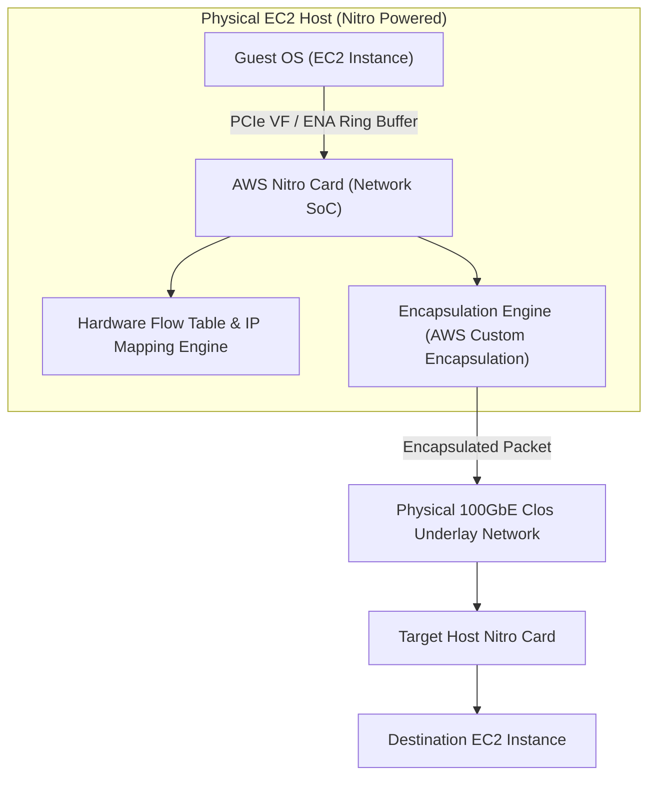
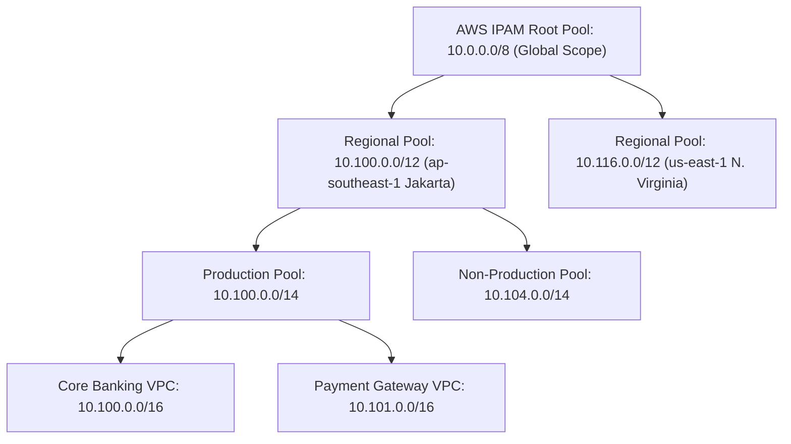
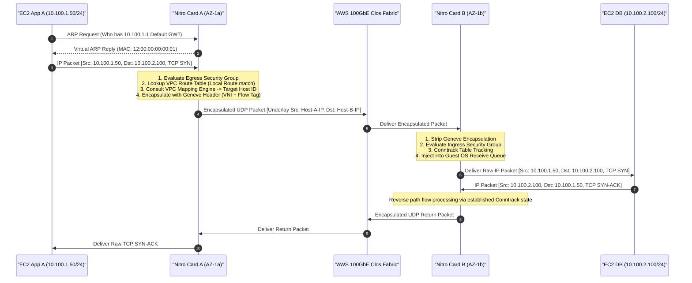
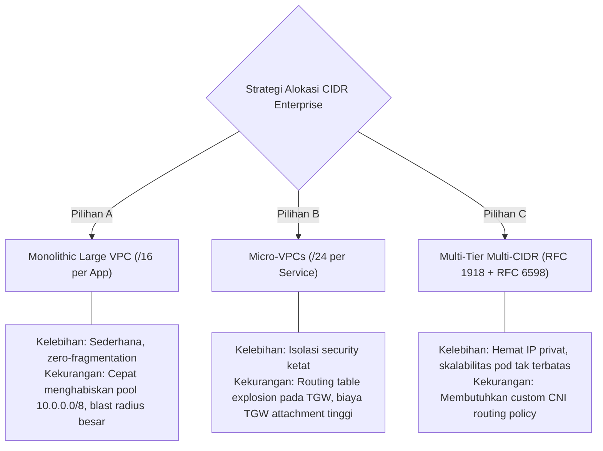

# Modul 01: Advanced Subnetting, Supernetting, VLSM & Enterprise IPAM

<BadgeLabel type="sme" text="Level: Principal / SME" /> <BadgeLabel type="rfc" text="RFC 1918 / RFC 6598 / RFC 4632" /> <BadgeLabel type="aws" text="AWS IPAM & VPC Hierarchy" />

Dalam arsitektur *cloud network* skala *multi-account* dan *multi-region*, alokasi *IP address space* adalah keputusan fundamental yang bersifat **irreversible** tanpa *downtime* migrasi yang masif. Kesalahan desain **Classless Inter-Domain Routing** (<NetworkTerm term="CIDR" />) pada tahap inisiasi fondasi *landing zone* dapat mengakibatkan **re-IPing ribuan workload**, fragmentasi *routing table*, *exhaustion* pada *cluster* Kubernetes (EKS), hingga tabrakan rute (*route collision*) pada interkoneksi *hybrid cloud* (Direct Connect / Transit Gateway).

Modul ini membedah arsitektur pengalamatan IP dari level manipulasi bit pada register CPU/ASIC hingga implementasi hierarki **IP Address Management** (<NetworkTerm term="IPAM" />) terdistribusi di AWS.

---

## 🛠️ Interactive Lab: CIDR & IPAM Hierarchy Allocator

Gunakan simulator interaktif di bawah ini untuk menghitung pembagian subnet **Variable Length Subnet Masking** (<NetworkTerm term="VLSM" />), representasi biner, network ID, broadcast, dan alokasi hierarki pool secara *real-time*:

<ClientOnly>
  <CidrCalculator />
</ClientOnly>

---

## Layer 1: Protocol Mechanics & RFC Theory

### 1.1 Anatomi 32-Bit IPv4 & Matematika Biner Bitwise

Setiap alamat IPv4 adalah integer 32-bit yang direpresentasikan dalam notasi *dotted-decimal* 4 oktet:

$$\text{IPv4 Address} = \sum_{i=0}^{31} b_i \cdot 2^{31-i} = \underbrace{b_{31}\dots b_{24}}_{\text{Oktet 1}} . \underbrace{b_{23}\dots b_{16}}_{\text{Oktet 2}} . \underbrace{b_{15}\dots b_{8}}_{\text{Oktet 3}} . \underbrace{b_{7}\dots b_{0}}_{\text{Oktet 4}}$$

```
Oktet 1          Oktet 2          Oktet 3          Oktet 4
+----------------+----------------+----------------+----------------+
| 0 0 0 0 1 0 1 0| 0 1 1 0 0 1 0 0| 1 0 0 1 0 0 0 1| 0 0 1 0 0 1 0 1| = 10.100.145.37
+----------------+----------------+----------------+----------------+
| 128 64 32 16 8 4 2 1 | 128 64 32 16 8 4 2 1 | ...                 |
```

#### Operasi Bitwise AND ($\&$) untuk Ekstraksi Network ID
Hardware *forwarding engine* (ASIC TCAM maupun virtual router AWS Nitro) mengeksekusi operasi bitwise AND secara paralel antara alamat IP tujuan (*Destination IP*) dan *Subnet Mask* untuk menentukan *Network Address*:

```
Destination IP  : 10.100.145.37  ->  00001010 . 01100100 . 10010001 . 00100101
Subnet Mask /20 : 255.255.240.0  ->  11111111 . 11111111 . 11110000 . 00000000
--------------------------------------------------------------------------------- (Bitwise AND)
Network Address : 10.100.144.0   ->  00001010 . 01100100 . 10010000 . 00000000
```

#### Operasi Bitwise OR ($|$) dengan Wildcard Mask untuk Broadcast Address
Broadcast address ditentukan dengan menegasikan subnet mask (*Bitwise NOT / Wildcard Mask*) lalu melakukan operasi bitwise OR terhadap *Network Address*:

$$\text{Wildcard Mask} = \sim\text{Subnet Mask} = \text{Subnet Mask} \oplus \text{0xFFFFFFFF}$$
$$\text{Broadcast Address} = \text{Network Address} \ | \ \text{Wildcard Mask}$$

```
Network Address : 10.100.144.0   ->  00001010 . 01100100 . 10010000 . 00000000
Wildcard Mask   : 0.0.15.255     ->  00000000 . 00000000 . 00001111 . 11111111
--------------------------------------------------------------------------------- (Bitwise OR)
Broadcast Addr  : 10.100.159.255 ->  00001010 . 01100100 . 10011111 . 11111111
```

### 1.2 Variable Length Subnet Masking (VLSM) & CIDR Summarization (RFC 4632)

VLSM memungkinkan pemecahan *address space* menjadi blok-blok berukuran dinamis sesuai kebutuhan aktual, mengeliminasi pemborosan alamat pada pengalamatan *classful* tradisional.

#### Formula Alokasi Host & Subnet
Untuk prefix berukuran $/n$:
- Jumlah total alamat IP = $2^{32-n}$
- Jumlah host yang dapat dialokasikan pada on-premise standar = $2^{32-n} - 2$ (dikurangi Network ID dan Directed Broadcast).
- Pada AWS VPC = $2^{32-n} - 5$ (dikurangi 5 AWS Reserved IP).

#### Algoritma Supernetting / Route Summarization (Longest Common Prefix)
Misalkan terdapat 4 subnet cabang regional:
- Subnet 1: `10.200.64.0/24` $\to$ `00001010.11001000.010000`**00.00000000**
- Subnet 2: `10.200.65.0/24` $\to$ `00001010.11001000.010000`**01.00000000**
- Subnet 3: `10.200.66.0/24` $\to$ `00001010.11001000.010000`**10.00000000**
- Subnet 4: `10.200.67.0/24` $\to$ `00001010.11001000.010000`**11.00000000**

Bit ke-1 hingga ke-22 bernilai identik (`00001010.11001000.010000..`). Divergensi dimulai pada bit ke-23.
Maka, **Supernet Prefix = `10.200.64.0/22`** ($2^{32-22} = 1024$ total alamat IP).

### 1.3 Perbandingan Standar RFC Ruang Pengalamatan

| Spesifikasi RFC | Range Alamat IP | Total Alamat | Karakteristik & Use Case Cloud |
| :--- | :--- | :--- | :--- |
| **RFC 1918 (Class A)** | `10.0.0.0/8` | 16,777,216 | *Backbone* korporasi, alokasi VPC multi-region, Transit Gateway. |
| **RFC 1918 (Class B)** | `172.16.0.0/12` | 1,048,576 | Workload legacy, secondary hybrid branches, isolated VPCs. |
| **RFC 1918 (Class C)** | `192.168.0.0/16` | 65,536 | Small branch offices, lab environments, point-to-point links. |
| **RFC 6598 (CGNAT)** | `100.64.0.0/10` | 4,194,304 | Secondary CIDR untuk Kubernetes (EKS) Pods, API Gateways, ephemeral workloads. Non-routable to public internet, non-overlapping with RFC 1918. |
| **RFC 2544 / 5737** | `198.18.0.0/15` | 131,072 | Benchmark / Interconnect transit staging, financial sandbox peering. |
| **RFC 3927 (Link-Local)** | `169.254.0.0/16` | 65,536 | AWS Instance Metadata Service (`169.254.169.254`), Time Sync (`169.254.169.123`), BGP Peering on Direct Connect/VPN. |

::: tip STANDAR BEST PRACTICE INDUSTRI (SME RECOMMENDATION)
Selalu gunakan **RFC 6598 (`100.64.0.0/10`)** sebagai *Secondary CIDR* untuk *Data Plane* EKS Pods / ECS Containers. Hal ini menjaga ruang alamat privat RFC 1918 `10.0.0.0/8` tetap hemat dan mencegah *IP exhaustion* akibat replikasi microservices skala besar tanpa memerlukan arsitektur Private NAT yang rumit.
:::

---

## Layer 2: AWS Distributed Underlay & Hyperplane Internals

### 2.1 AWS Nitro Card IP Mapping Table & Virtualization
Di dalam infrastruktur AWS, subnet fisik tidak eksis dalam bentuk switch VLAN/VXLAN tradisional. Seluruh isolasi jaringan dieksekusi oleh **AWS Nitro Card** (ASIC/SoC khusus yang terpasang pada motherboard server fisik EC2):



1. **Mapping Engine**: Nitro Card menyimpan tabel pemetaan (*VPC Mapping Table*) terdistribusi yang memetakan tuple `{VPC_ID, Subnet_ID, Private_IPv4}` ke `{Physical_Host_IP, Geneve/Encapsulation_VNI}` pada physical underlay.
2. **ARP Suppression**: Ketika instance mengirimkan *ARP Request* untuk mencari MAC address default gateway atau instance lain di subnet yang sama, Nitro Card langsung merespons secara lokal dengan *virtual MAC* (`12:xx:xx:...`) tanpa mem-broadcast paket ke jaringan fisik.

### 2.2 Anatomi 5 Alamat IP yang Direservasi AWS per Subnet

Pada setiap subnet AWS VPC, **5 IP addresses pertama dan terakhir direservasi** oleh AWS dan tidak dapat dialokasikan untuk ENI workload:

```
Misalkan Subnet CIDR: 10.100.10.0/24 (Total 256 IP)
├── 10.100.10.0   : Network Address (Direservasi untuk subnet base identifier)
├── 10.100.10.1   : VPC Router / Default Gateway (Direservasi untuk software router Nitro)
├── 10.100.10.2   : Amazon Provided DNS / Route 53 Resolver (Base + 2)
├── 10.100.10.3   : AWS Future Use (Direservasi untuk utilitas internal infrastruktur AWS)
├── 10.100.10.4 - 10.100.10.254 : [251 IP USABLE WORKLOAD RANGE]
└── 10.100.10.255 : Subnet Broadcast Address (AWS VPC tidak mendukung unmanaged broadcast)
```

::: tip STANDAR BEST PRACTICE INDUSTRI (SME RECOMMENDATION)
Ukuran subnet minimum yang diizinkan di AWS VPC adalah `/28` (16 IP, **11 usable**). Jangan pernah membuat subnet `/28` untuk workload dinamis seperti Application Load Balancer (ALB) atau NAT Gateway, karena ALB membutuhkan minimal 8 IP bebas per AZ untuk *scaling* dan *maintenance health checks*. Tetapkan minimal `/24` untuk subnet workload publik/privat.
:::

---

## Layer 3: AWS Resource Deep-Dive & Hard Limits

### 3.1 AWS IPAM (IP Address Manager) Multi-Account Hierarchy

AWS IPAM menyediakan manajemen inventaris dan alokasi IP otomatis terpusat di seluruh AWS Organizations:



### 3.2 Kuota & Hard Limits Subnetting / IPAM

| Parameter Resource | Default Quota | Max Adjustable Quota | Dampak Arsitektural & Engineering |
| :--- | :--- | :--- | :--- |
| **VPC IPv4 CIDR Size** | `/28` (min) s/d `/16` (max) | `/16` | Ukuran maksimum 1 blok VPC adalah 65,536 IP. Ekspansi harus melalui Secondary CIDR. |
| **Secondary CIDR blocks per VPC** | 4 blocks | 4 blocks (Hard) | Total maksimum 5 IPv4 CIDR blocks (1 Primary + 4 Secondary) per VPC. |
| **Subnets per VPC** | 200 | 1,000 (Soft) | Pembagian subnet mikro berlebih meningkatkan kompleksitas Route Table. |
| **IPAM Pools per Account** | 100 | 500 (Soft) | Hierarki pool harus mencerminkan struktur OU (Organizational Unit). |
| **BYOIP IPv4 Prefixes per Region** | 5 | 20 (Soft) | Membutuhkan validasi ROA (Route Origin Authorization) dan LOA-CFR. |

---

## Layer 4: Hop-by-Hop Packet Walkthrough & Flow Lifecycle

Diagram sequence berikut mengilustrasikan alur inisiasi koneksi TCP SYN dari EC2 Instance A ke EC2 Instance B pada subnet berbeda di dalam VPC yang sama:



---

## Layer 5: Production Terraform IaC & CLI Blueprints

Blueprint Terraform enterprise berikut mengorkestrasi **AWS IPAM Root Pool, Regional Pool, dan Multi-Tier Subnetting dengan Secondary RFC 6598 CIDR**:

```hcl
# main.tf - Enterprise IPAM & Multi-CIDR VPC Blueprint
terraform {
  required_version = ">= 1.5.0"
  required_providers {
    aws = {
      source  = "hashicorp/aws"
      version = "~> 5.0"
    }
  }
}

# 1. Root IPAM & Global Scope
resource "aws_vpc_ipam" "main" {
  description = "Enterprise Core IPAM"
  operating_regions {
    region_name = "ap-southeast-1"
  }
  tags = {
    Environment = "Production"
    ManagedBy   = "Terraform"
  }
}

# 2. Regional IPAM Pool (Jakarta)
resource "aws_vpc_ipam_pool" "regional_jakarta" {
  description                    = "Regional Pool - Jakarta (ap-southeast-1)"
  address_family                 = "ipv4"
  ipam_scope_id                  = aws_vpc_ipam.main.private_default_scope_id
  locale                         = "ap-southeast-1"
  auto_import                    = false
  publicly_advertisable          = false
}

resource "aws_vpc_ipam_pool_cidr" "jakarta_cidr" {
  ipam_pool_id = aws_vpc_ipam_pool.regional_jakarta.id
  cidr         = "10.100.0.0/16"
}

# 3. Enterprise VPC Provisioned from IPAM
resource "aws_vpc" "core_enterprise" {
  ipv4_ipam_pool_id   = aws_vpc_ipam_pool.regional_jakarta.id
  ipv4_netmask_length = 20 # Allocates 10.100.0.0/20 (4,096 IPs)
  
  enable_dns_hostnames = true
  enable_dns_support   = true

  tags = {
    Name        = "vpc-core-prod-jkt"
    Environment = "Production"
  }
  depends_on = [aws_vpc_ipam_pool_cidr.jakarta_cidr]
}

# 4. Secondary CIDR Allocation (RFC 6598 for Container/EKS Pods)
resource "aws_vpc_ipv4_cidr_block_association" "eks_secondary" {
  vpc_id     = aws_vpc.core_enterprise.id
  cidr_block = "100.64.0.0/18" # 16,384 IPs for high-density pods
}

# 5. Multi-Tier Subnetting across 3 Availability Zones
locals {
  azs = ["ap-southeast-1a", "ap-southeast-1b", "ap-southeast-1c"]
}

# Public Subnets (/24 per AZ)
resource "aws_subnet" "public" {
  count                   = 3
  vpc_id                  = aws_vpc.core_enterprise.id
  cidr_block              = cidrsubnet(aws_vpc.core_enterprise.cidr_block, 4, count.index)
  availability_zone       = local.azs[count.index]
  map_public_ip_on_launch = false

  tags = {
    Name = "snet-public-az${count.index + 1}"
    Tier = "Public"
  }
}

# Private Application Subnets (/23 per AZ for autoscaling headroom)
resource "aws_subnet" "private_app" {
  count             = 3
  vpc_id            = aws_vpc.core_enterprise.id
  cidr_block        = cidrsubnet(aws_vpc.core_enterprise.cidr_block, 3, count.index + 2)
  availability_zone = local.azs[count.index]

  tags = {
    Name = "snet-private-app-az${count.index + 1}"
    Tier = "Application"
  }
}

# EKS Pod Subnets on Secondary RFC 6598 CIDR (/20 per AZ)
resource "aws_subnet" "eks_pods" {
  count             = 3
  vpc_id            = aws_vpc.core_enterprise.id
  cidr_block        = cidrsubnet(aws_vpc_ipv4_cidr_block_association.eks_secondary.cidr_block, 2, count.index)
  availability_zone = local.azs[count.index]

  tags = {
    Name                              = "snet-eks-pods-az${count.index + 1}"
    Tier                              = "ContainerDataPlane"
    "kubernetes.io/role/internal-elb" = "1"
  }
}
```

---

## Layer 6: Failure Modes, Edge Cases & SEV-1 Troubleshooting Matrix

### 6.1 Production SEV-1 Incident Matrix

| Gejala Insiden (*Symptoms*) | *Root Cause Analysis* (RCA) | Perintah Verifikasi & Diagnosa CLI | Langkah Mitigasi & Resolusi |
| :--- | :--- | :--- | :--- |
| **EKS Pods stuck in `ContainerCreating`** status dengan error `No IP addresses available in subnet`. | Alokasi subnet primer `/24` habis terpakai oleh ENI EC2 worker node dan pod secondary IP. | `aws ec2 describe-subnets --subnet-ids <id> --query "Subnets[*].[AvailableIpAddressCount,CidrBlock]"` | Tambahkan *Secondary CIDR* RFC 6598 (`100.64.0.0/16`) pada VPC dan konfigurasikan `AWS_VPC_K8S_CNI_CUSTOM_NETWORK_CFG=true`. |
| **Direct Connect BGP Session Down** / Prefix dropped saat penambahan VPC baru. | Jumlah advertised prefix dari VPC melebihi kuota 100/200 route pada Direct Connect Gateway. | `aws directconnect describe-direct-connect-gateway-associations --direct-connect-gateway-id <id>` | Terapkan *Route Summarization* (Supernetting) pada *Allowed Prefixes* DXGW menjadi satu prefix agregat `/14` atau `/16`. |
| **Intermittent Connection Drop** pada RDS multi-AZ failover. | Subnet DB dibuat dengan netmask terlalu kecil (`/28`), tidak menyisakan IP bebas untuk replikasi dan blue/green deployment. | `aws ec2 describe-db-subnet-groups --db-subnet-group-name <name>` | Migrasikan DB Subnet Group ke subnet baru berukuran minimal `/24` dengan IP headroom memadai. |
| **VPC Peering Non-Functional** setelah *Secondary CIDR* ditambahkan. | Rute untuk *Secondary CIDR* belum ditambahkan secara manual pada *Route Table* VPC peer. | `aws ec2 describe-route-tables --filters "Name=vpc-id,Values=<id>"` | Update VPC Route Table pada kedua sisi peering untuk mereferensikan blok CIDR sekunder secara eksplisit. |

---

## Layer 7: Principal Architect Tradeoff Framework



### Matriks Keputusan Arsitektur: Alokasi Pengalamatan IP

| Dimensi Arsitektural | Monolithic Large VPC (`/16`) | Micro-VPC Per Service (`/24`) | Multi-Tier Multi-CIDR (RFC 1918 + 6598) |
| :--- | :--- | :--- | :--- |
| **Efisiensi Alokasi IP** | Sangat Rendah (Banyak IP idle) | Sedang (Terkunci per VPC) | **Sangat Tinggi (Optimized via IPAM)** |
| **Biaya Infrastruktur (TGW / NAT)** | Rendah (Sedikit VPC Attachments) | Sangat Tinggi ($$$ per VPC TGW Attachment) | **Optimal (Shared TGW Attachments)** |
| **Blast Radius Keamanan** | Luas (Perlu Security Group sangat ketat) | Sangat Terisolasi (VPC Level Boundary) | **Tinggi (Terisolasi per Subnet Tier & NACL)** |
| **Skalabilitas EKS / Container** | Terbatas pada sisa IP subnet | Rendah (Cepat terjadi exhaustion) | **Hampir Tanpa Batas (Jutaan IP via 100.64.0.0/10)** |
| **Kompleksitas Routing Table** | Sederhana | Sangat Kompleks (Ribuan rute di TGW) | **Terkendali (1 Rute Agregat per Tier)** |
