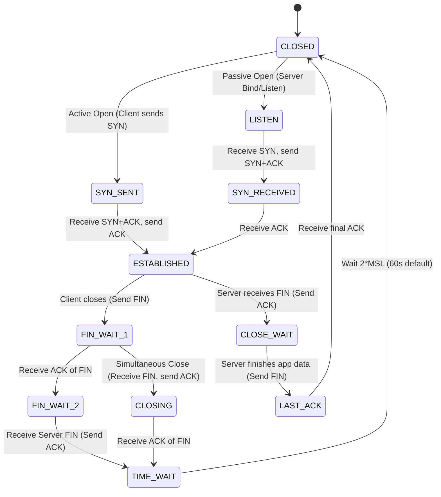
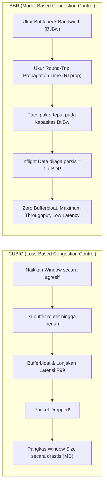
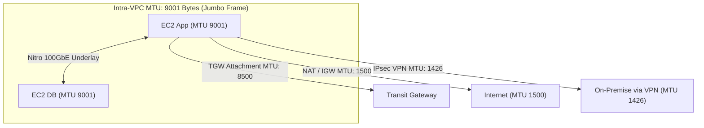
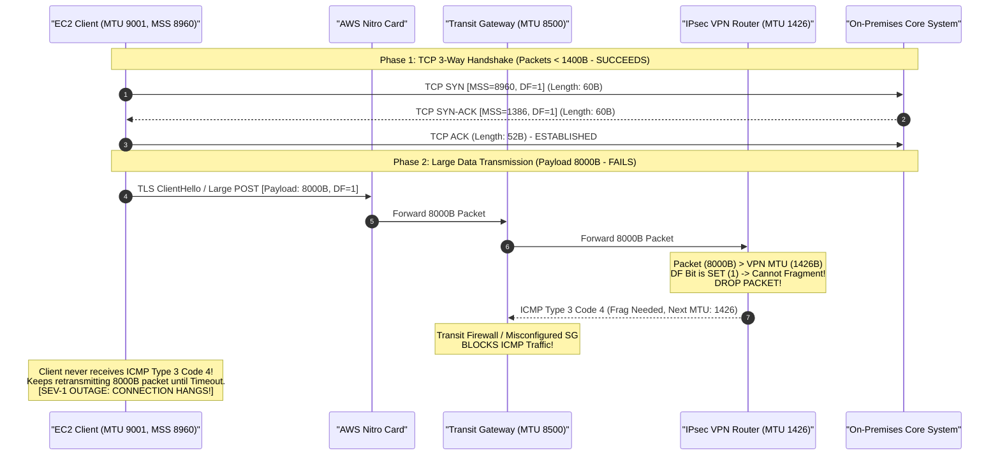
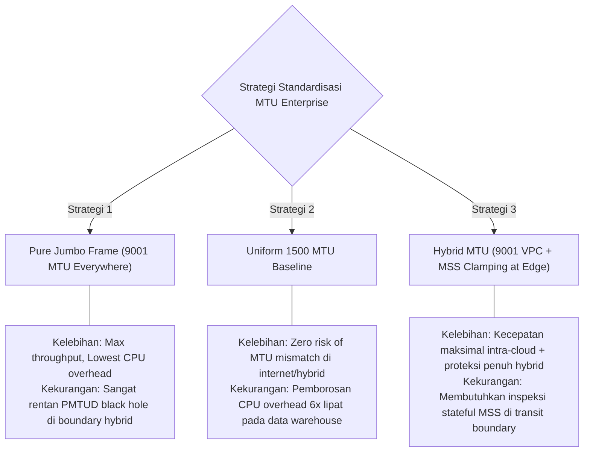

# Modul 02: TCP Transport Mechanics, PMTUD, MSS Clamping & Congestion Control

<BadgeLabel type="sme" text="Level: Principal / SME" /> <BadgeLabel type="rfc" text="RFC 793 / RFC 1191 / RFC 4821 / RFC 7323" /> <BadgeLabel type="aws" text="Nitro TCP Offload & Jumbo Frames" />

Dalam arsitektur *high-performance enterprise cloud*, kegagalan performa throughput dan latensi jarang disebabkan oleh keterbatasan fisik bandwidth *link*. Penyebab utamanya hampir selalu bermuara pada **mekanika transport layer (L4)**: *misconfigured MTU boundaries*, *ICMP black holes* yang melumpuhkan PMTUD, *TCP window exhaustion* pada koneksi *high-latency*, atau *congestion collapse* akibat algoritma kendali kemacetan yang tidak cocok dengan karakteristik *underlay*.

Modul ini mengupas tuntas protokol TCP dari level bit header dan *Finite State Machine* (FSM) hingga *hardware offload* pada AWS Nitro dan penanganan insiden transmisi paket skala produksi.

---

## Layer 1: Protocol Mechanics & RFC Theory

### 1.1 Anatomi 20-Byte Base TCP Header (RFC 793)

TCP header standar tanpa *options* memiliki panjang 20 byte (160 bit), tersusun dalam 5 baris 32-bit:

```
 0                   1                   2                   3
 0 1 2 3 4 5 6 7 8 9 0 1 2 3 4 5 6 7 8 9 0 1 2 3 4 5 6 7 8 9 0 1
+-+-+-+-+-+-+-+-+-+-+-+-+-+-+-+-+-+-+-+-+-+-+-+-+-+-+-+-+-+-+-+-+
|          Source Port          |       Destination Port        |
+-+-+-+-+-+-+-+-+-+-+-+-+-+-+-+-+-+-+-+-+-+-+-+-+-+-+-+-+-+-+-+-+
|                        Sequence Number                        |
+-+-+-+-+-+-+-+-+-+-+-+-+-+-+-+-+-+-+-+-+-+-+-+-+-+-+-+-+-+-+-+-+
|                    Acknowledgment Number                      |
+-+-+-+-+-+-+-+-+-+-+-+-+-+-+-+-+-+-+-+-+-+-+-+-+-+-+-+-+-+-+-+-+
|  Data |           |C|E|U|A|P|R|S|F|                               |
| Offset| Reserved  |W|C|R|C|S|S|Y|I|            Window             |
| (4b)  |   (4b)    |R|E|G|K|H|T|N|N|                               |
+-+-+-+-+-+-+-+-+-+-+-+-+-+-+-+-+-+-+-+-+-+-+-+-+-+-+-+-+-+-+-+-+
|           Checksum            |        Urgent Pointer         |
+-+-+-+-+-+-+-+-+-+-+-+-+-+-+-+-+-+-+-+-+-+-+-+-+-+-+-+-+-+-+-+-+
|                    Options (Variable 0 - 40B)                 |
+-+-+-+-+-+-+-+-+-+-+-+-+-+-+-+-+-+-+-+-+-+-+-+-+-+-+-+-+-+-+-+-+
```

#### Bedah Flag Kontrol Kritis:
- **SYN (Synchronize)**: Inisiasi koneksi dan sinkronisasi initial sequence number (ISN).
- **ACK (Acknowledgment)**: Mengindikasikan field Acknowledgment Number valid.
- **FIN (Finish)**: Pengirim telah selesai mentransmisikan data.
- **RST (Reset)**: Menolak atau memutus koneksi secara paksa (indikasi port tertutup, state mismatch, atau drop oleh firewall).
- **PSH (Push)**: Meminta receiver segera menyerahkan buffer data ke application layer tanpa menunggu buffer penuh.
- **ECE & CWR (RFC 3168)**: *Explicit Congestion Notification* (ECN) untuk sinyal kemacetan antrean tanpa perlu menjatuhkan paket (*zero-loss congestion signaling*).

#### TCP Options Kritis:
- **Maximum Segment Size (MSS, Option 2, 4 bytes)**: Menyatakan ukuran payload data TCP terbesar yang dapat diterima receiver.
- **Window Scale (WS, RFC 7323, Option 3, 3 bytes)**: Memperluas 16-bit Window Field hingga 1 Gigabyte dengan faktor eksponensial $2^S$ (di mana $S \le 14$).
- **Selective Acknowledgment (SACK Permitted, RFC 2018, Option 4)**: Mengizinkan receiver menginformasikan blok-blok data non-kontigu yang berhasil diterima, mencegah retransmisi seluruh stream.

### 1.2 11-State Finite State Machine (FSM) TCP

Siklus hidup setiap koneksi TCP diatur secara deterministik oleh 11 status FSM:



::: tip STANDAR BEST PRACTICE INDUSTRI (SME RECOMMENDATION)
State **TIME_WAIT** bertujuan memastikan ACK terakhir sampai di receiver dan mencegah *duplicate delayed packets* dari koneksi lama merusak koneksi baru dengan tuple 5-way yang sama. Jangan pernah mematikan TIME_WAIT dengan `tcp_tw_recycle` (telah dihapus di Linux Kernel $\ge 4.12$ karena merusak NAT). Gunakan `tcp_tw_reuse` secara aman pada client-side outbound proxies.
:::

### 1.3 Matematika Throughput: BDP, Window Scaling & Mathis Formula

#### Bandwidth-Delay Product (BDP)
BDP menentukan volume *inflight data* (data yang sedang berada di kabel jaringan dan belum di-ACK) yang dibutuhkan untuk mengisi penuh pipa jaringan:

$$\text{BDP (bits)} = \text{Bandwidth (bps)} \times \text{RTT (seconds)}$$
$$\text{BDP (Bytes)} = \frac{\text{Bandwidth (bps)} \times \text{RTT (s)}}{8}$$

*Contoh Kasus Enterprise*:
Link AWS Direct Connect 10 Gbps Jakarta ke Frankfurt dengan RTT 160 ms ($0.16 \text{ s}$):
$$\text{BDP} = \frac{10 \times 10^9 \times 0.16}{8} = 200,000,000 \text{ Bytes} \approx 200 \text{ MB}$$

Jika TCP Window Scale tidak aktif, window size maksimal hanya 16-bit ($65,535 \text{ Bytes} = 64 \text{ KB}$).
Throughput maksimum yang dapat dicapai tanpa Window Scale adalah:
$$\text{Max Throughput} = \frac{\text{Max Window Size}}{\text{RTT}} = \frac{65,535 \times 8}{0.16} \approx 3.27 \text{ Mbps}$$
*(Link 10 Gbps hanya terutilisasi **0.03%** jika buffer dan Window Scale tidak dioptimasi!)*

#### Mathis Formula untuk Packet Loss Impact
Throughput TCP dalam kondisi steady state berbanding terbalik dengan akar kuadrat dari probabilitas *packet loss* ($p$):

$$\text{Throughput} \le \frac{\text{MSS}}{\text{RTT}} \times \frac{1}{\sqrt{p}}$$

Jika loss rate $p = 1\%$ ($0.01$) pada RTT 160 ms dengan MSS 1460 Byte:
$$\text{Throughput} \le \frac{1460 \times 8}{0.16} \times \frac{1}{\sqrt{0.01}} = 73,000 \times 10 = 730 \text{ Kbps}$$
*(Hanya 1% loss memangkas throughput dari 10 Gbps menjadi 730 Kbps!)*

### 1.4 Algoritma Congestion Control: CUBIC vs BBR



---

## Layer 2: AWS Distributed Underlay & Hyperplane Internals

### 2.1 MTU Domain Boundaries di AWS
Maximum Transmission Unit (MTU) adalah ukuran frame L3 terbesar (termasuk IP header) yang dapat ditransmisikan tanpa fragmentasi:



### 2.2 AWS Nitro Hardware TCP Offloading & ENA Express (SRD)
1. **TSO (TCP Segmentation Offload)**: Guest OS mengirim buffer data besar (hingga 64 KB) ke Nitro Card. Nitro ASIC yang memotong buffer menjadi segmen-segmen MTU 9001 / 1500 dan menghitung TCP checksum di level silikon tanpa membebani vCPU EC2.
2. **LRO (Large Receive Offload)**: Nitro Card menggabungkan segmen-segmen TCP yang masuk menjadi satu payload besar sebelum menyerahkannya ke Linux network stack.
3. **ENA Express (Scalable Reliable Datagram - SRD)**: Menggantikan transmisi single-path flow hashing ECMP tradisional dengan *per-packet multi-path spraying* melalui ratusan link Clos underlay AWS secara bersamaan. ENA Express menangani reordering dan retransmission di level hardware Nitro, menghasilkan P99 latency yang stabil dan throughput single-flow hingga 25 Gbps.

::: tip STANDAR BEST PRACTICE INDUSTRI (SME RECOMMENDATION)
Aktifkan **ENA Express** pada workload dengan traffic inter-instance yang masif (misal: Apache Kafka, Cassandra, Redis clusters, dan distributed database replication) untuk mengeliminasi microburst TCP retransmissions dan memangkas p99 tail latency hingga 50%.
:::

---

## Layer 3: AWS Resource Deep-Dive & Hard Limits

### 3.1 Ringkasan Batasan MTU & Throughput di AWS

| Jalur Konektivitas (*Network Path*) | Default / Max MTU | Batasan Throughput Single-Flow | Catatan Arsitektural SME |
| :--- | :--- | :--- | :--- |
| **Intra-VPC (Same AZ / Cross AZ)** | 9001 Bytes | 5 Gbps (25 Gbps w/ ENA Express) | Jumbo Frames didukung penuh secara *native*. |
| **Transit Gateway (VPC Attachment)** | 8500 Bytes | 5 Gbps per flow (50 Gbps aggregate) | Paket > 8500 byte di-drop jika DF=1. |
| **Internet Gateway (IGW) / NAT GW** | 1500 Bytes | 5 Gbps (NAT GW 100 Gbps aggregate) | Trafik publik dibatasi standar internet 1500. |
| **Direct Connect (Transit / Private VIF)** | 1500 / 9001 | Sesuai kapasitas port fisik (1G/10G/100G)| Jumbo MTU harus diaktifkan eksplisit pada VIF. |
| **AWS Site-to-Site VPN** | 1426 / 1446 | 1.25 Gbps per tunnel (Nitro IPsec)| Overhead enkripsi ESP + outer IP = 54-74 bytes. |

---

## Layer 4: Hop-by-Hop Packet Walkthrough & Flow Lifecycle

### 4.1 Anatomi Insiden: Path MTU Discovery (PMTUD) Black Hole

Diagram berikut menunjukkan bagaimana *packet drop* terjadi ketika DF (Don't Fragment) bit diset dan ICMP Type 3 Code 4 diblokir oleh firewall:



### 4.2 Resolusi dengan MSS Clamping (RFC 4459)

Untuk mencegah PMTUD Black Hole pada jalur hybrid/VPN, router melakukan inspeksi paket SYN yang melintas dan secara paksa menulis ulang nilai MSS (*MSS Clamping*):

$$\text{Clamped MSS} = \text{Tunnel MTU} - 20 (\text{IPv4 Header}) - 20 (\text{TCP Header}) = 1426 - 40 = 1386 \text{ Bytes}$$

---

## Layer 5: Production Terraform IaC & CLI Blueprints

### 5.1 Security Group Rule untuk Mencegah PMTUD Black Hole

```hcl
# sg-pmtud-fix.tf
# Wajib diimplementasikan pada seluruh Security Group di AWS!
resource "aws_security_group_rule" "allow_pmtud_icmp" {
  type              = "ingress"
  from_port         = 3  # ICMP Type 3: Destination Unreachable
  to_port           = 4  # ICMP Code 4: Fragmentation Needed and DF Set
  protocol          = "icmp"
  cidr_blocks       = ["10.0.0.0/8", "172.16.0.0/12", "192.168.0.0/16"]
  security_group_id = "sg-0123456789abcdef0"
  description       = "MANDATORY: Allow Path MTU Discovery ICMP Type 3 Code 4"
}
```

### 5.2 Enterprise Linux Kernel Tuning (`/etc/sysctl.d/99-aws-highperf.conf`)

Terapkan konfigurasi kernel ini pada seluruh instance backend, gateway proxy, dan container host:

```ini
# Aktifkan BBR Congestion Control & FQ Pacing
net.core.default_qdisc = fq
net.ipv4.tcp_congestion_control = bbr

# Aktifkan TCP Window Scaling (RFC 7323) & SACK (RFC 2018)
net.ipv4.tcp_window_scaling = 1
net.ipv4.tcp_sack = 1
net.ipv4.tcp_dsack = 1

# Alokasi Maksimum Buffer TCP (Untuk link high-BDP hingga 10Gbps cross-region)
net.core.rmem_max = 67108864
net.core.wmem_max = 67108864
net.ipv4.tcp_rmem = 4096 87380 67108864
net.ipv4.tcp_wmem = 4096 65536 67108864

# Packetization Layer Path MTU Discovery (PLPMTUD - RFC 4821)
# Otomatis mendeteksi MTU tanpa bergantung pada sinyal ICMP Type 3 Code 4
net.ipv4.tcp_mtu_probing = 2
net.ipv4.tcp_base_mss = 1024

# Re-use TIME_WAIT socket untuk koneksi outbound proxy
net.ipv4.tcp_tw_reuse = 1
net.ipv4.tcp_fin_timeout = 15
```

### 5.3 IPTables MSS Clamping Blueprint untuk Router / Firewall EC2

```bash
# Clamp MSS otomatis ke PMTU pada antarmuka tunnel VPN/GRE
sudo iptables -t mangle -A FORWARD -p tcp --tcp-flags SYN,RST SYN \
  -j TCPMSS --clamp-mss-to-pmtu

# Atau set MSS eksplisit ke 1386 bytes untuk tunnel IPsec standar AWS
sudo iptables -t mangle -A FORWARD -p tcp --tcp-flags SYN,RST SYN \
  -j TCPMSS --set-mss 1386
```

---

## Layer 6: Failure Modes, Edge Cases & SEV-1 Troubleshooting Matrix

### 6.1 Production SEV-1 Incident Matrix

| Gejala Insiden (*Symptoms*) | *Root Cause Analysis* (RCA) | Perintah Verifikasi & Diagnosa CLI | Langkah Mitigasi & Resolusi |
| :--- | :--- | :--- | :--- |
| **Koneksi SSH hang setelah memasukkan password / TLS handshake freeze** pada API payload besar. | PMTUD ICMP Black Hole: Paket besar melebihi MTU jalur transit, ICMP Type 3 Code 4 diblokir firewall. | `tracepath -n <target-ip>` atau `ip route get <target-ip>` | 1. Buka ICMP Type 3 Code 4 pada SG.<br/>2. Terapkan MSS Clamping di router.<br/>3. Set `sysctl net.ipv4.tcp_mtu_probing=2`. |
| **Throughput Direct Connect 10G terhenti di angka 50 Mbps** pada cross-region link. | TCP Window Scale tidak aktif atau `rmem_max` Linux default terlalu kecil (BDP mismatch). | `iperf3 -c <target> -P 1` vs `iperf3 -c <target> -w 16M` | Perbesar TCP socket buffer via `sysctl` dan pastikan `tcp_window_scaling=1`. |
| **Spike Re-transmissions & CPU 100% pada Redis Cluster** saat peak load. | Microbursts melampaui single-flow bandwidth limit 5 Gbps tanpa ENA Express. | `ethtool -S eth0 \| grep -E "allowance_exceeded\|retrans"` | Aktifkan ENA Express pada ENI EC2 dan gunakan multi-stream connection pooling. |
| **Packet drops masif setelah failover Direct Connect ke Backup VPN**. | Direct Connect menggunakan MTU 9001, sedangkan VPN hanya mendukung MTU 1426. Server tidak menerima sinyal reduksi MTU. | `tcpdump -nnvv -i eth0 'tcp[tcpflags] & (tcp-syn) != 0'` | Turunkan MTU antarmuka EC2 ke 1500 atau pasang auto-MSS clamping pada VPN gateway. |

---

## Layer 7: Principal Architect Tradeoff Framework



### Matriks Keputusan Arsitektur: Manajemen MTU & TCP

| Dimensi Arsitektural | Pure Jumbo Frame (9001) | Uniform 1500 MTU | Hybrid + Edge MSS Clamping |
| :--- | :--- | :--- | :--- |
| **Throughput Efisiensi Intra-VPC** | **Maksimum (99.5% payload efficiency)** | Rendah (6x packet processing count) | **Maksimum (99.5% di dalam VPC)** |
| **Overhead CPU EC2 (Packets/Sec)** | **Sangat Rendah** | Tinggi (Banyak interupsi packet) | **Sangat Rendah** |
| **Resiko PMTUD Black Hole** | Sangat Tinggi | **Nol (Zero Risk)** | **Nol (Dieliminasi oleh MSS Clamping)** |
| **Kompatibilitas Direct Connect** | Butuh aktivasi Jumbo VIF | Universal | Universal |
| **Rekomendasi Arsitektur** | Khusus HPC / Big Data Isolat | Workload publik murni | **Standar Enterprise Rekomendasi SME** |
