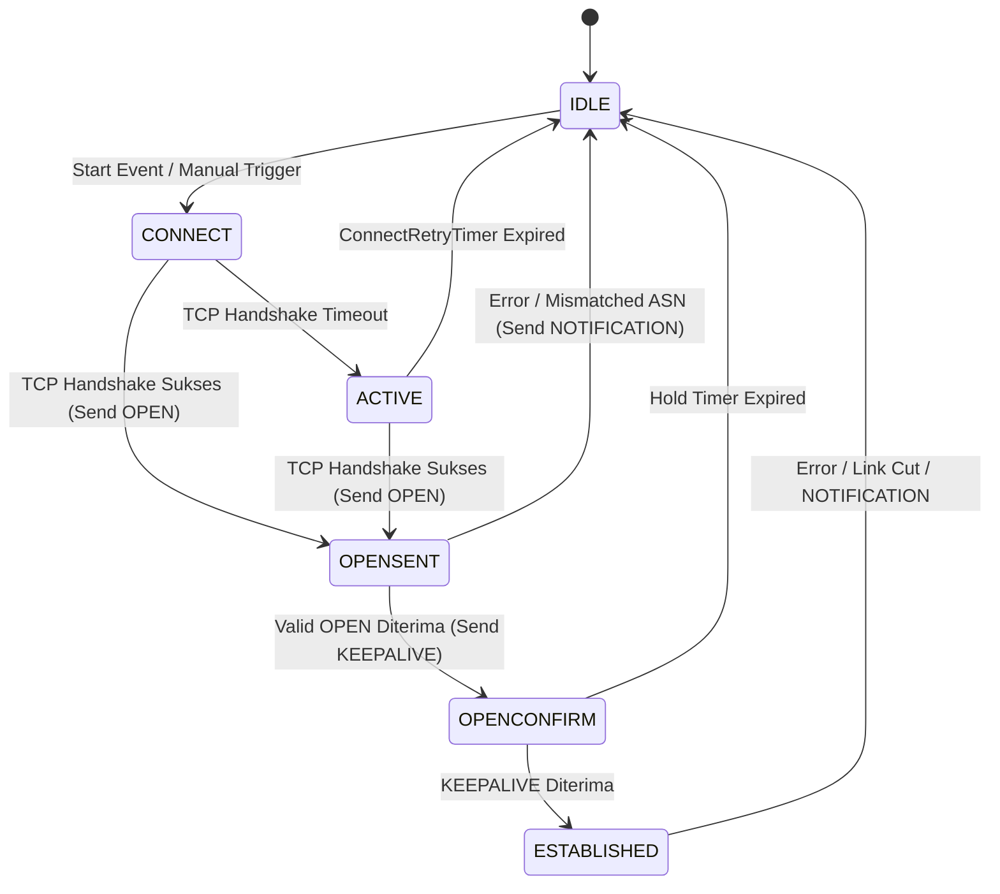
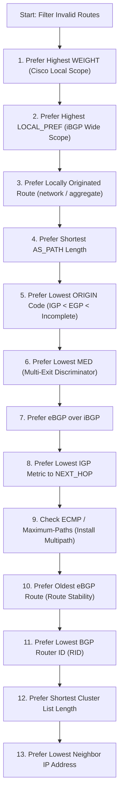
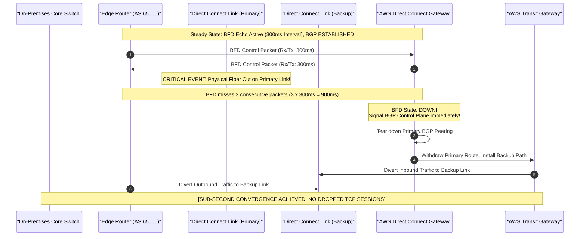
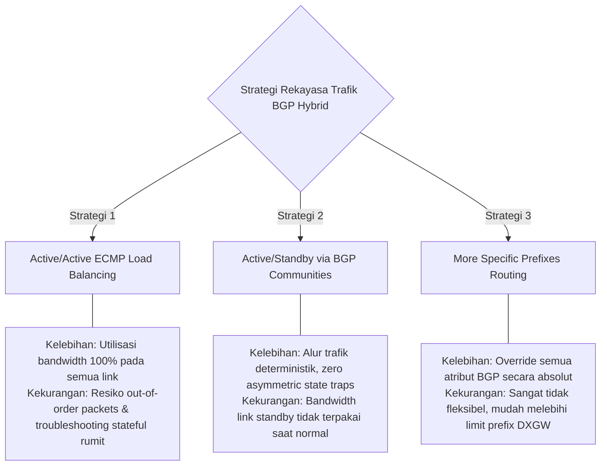

# Modul 03: Advanced Dynamic Routing, BGP-4 Deep-Dive & Sub-Second Convergence

<BadgeLabel type="sme" text="Level: Principal / SME" /> <BadgeLabel type="rfc" text="RFC 4271 / RFC 5880 / RFC 7911 / RFC 1997" /> <BadgeLabel type="aws" text="Direct Connect, TGW & Cloud WAN BGP" />

Dalam arsitektur jaringan *hybrid cloud* skala enterprise, **Border Gateway Protocol (BGP-4)** adalah *lingua franca* yang menghubungkan on-premise datacenter, *co-location facilities*, dan AWS Cloud Backbone. Ketiadaan pemahaman komprehensif atas *attribute ordering*, *path election algorithm*, dan *asymmetric routing traps* sering kali berujung pada insiden SEV-1: *blackholing*, *traffic oscillation*, atau *failover delay* hingga 90 detik saat link fisik terputus.

Modul ini membedah BGP-4 dari struktur pesan biner dan 13-step election algorithm hingga integrasi BFD untuk *sub-second failover* pada Direct Connect dan Transit Gateway.

---

## 🛠️ Interactive Lab: BGP 13-Step Decision Simulator

Gunakan simulator interaktif di bawah ini untuk mengeksplorasi kalkulasi bobot atribut BGP (Local Pref, AS Path, MED, Origin, dsb.) dalam menentukan *Best Path*:

<ClientOnly>
  <BgpSimulator />
</ClientOnly>

---

## Layer 1: Protocol Mechanics & RFC Theory

### 1.1 Arsitektur Protokol BGP-4 (RFC 4271)

BGP-4 adalah *Path-Vector Routing Protocol* yang beroperasi di atas transport **TCP Port 179**. Berbeda dengan IGP (OSPF/IS-IS) yang berfokus pada *shortest cost path* di dalam satu Autonomous System, BGP dirancang untuk *policy-based inter-domain routing*.

#### 4 Tipe Pesan BGP:
1. **OPEN (Type 1)**: Inisiasi sesi BGP, negosiasi ASN, Hold Time, BGP Identifier (Router ID), dan *Multiprotocol Capabilities* (RFC 5492).
2. **UPDATE (Type 2)**: Mengumumkan rute baru yang dapat dijangkau (*NLRI - Network Layer Reachability Information*) beserta atributnya (*Path Attributes*), atau menarik rute (*Withdrawn Routes*).
3. **NOTIFICATION (Type 3)**: Mengindikasikan terjadinya error fatal (misal: Hold Timer Expired, Bad BGP Identifier). Sesi BGP langsung di-reset ke status IDLE.
4. **KEEPALIVE (Type 4)**: Pesan periodik 19-byte untuk memvalidasi liveness peer (default 1/3 dari Hold Time).

### 1.2 6-State Finite State Machine (FSM) BGP



### 1.3 Taksonomi BGP Path Attributes

| Kategori Atribut | Definisi & Sifat Propagasi | Contoh Atribut BGP |
| :--- | :--- | :--- |
| **Well-Known Mandatory** | Wajib ada di setiap pesan UPDATE. Dikenali dan diteruskan oleh semua router. | `ORIGIN`, `AS_PATH`, `NEXT_HOP` |
| **Well-Known Discretionary** | Wajib dikenali semua router, namun opsional dicantumkan dalam UPDATE. | `LOCAL_PREF`, `ATOMIC_AGGREGATE` |
| **Optional Transitive** | Tidak harus didukung semua router; jika tidak didukung, tetap wajib diteruskan ke peer lain. | `COMMUNITY` (RFC 1997), `AGGREGATOR` |
| **Optional Non-Transitive** | Jika router tidak mendukung atribut ini, atribut dibuang secara diam-diam dan tidak diteruskan. | `MED` (Multi-Exit Discriminator), `ORIGINATOR_ID` |

### 1.4 Algoritma 13-Step BGP Best Path Selection

Ketika router menerima beberapa rute menuju prefix tujuan yang sama, router mengevaluasi atribut secara sekuensial berdasarkan hirarki 13 langkah berikut hingga ditemukan pemenang tunggal (*deterministic winner*):



### 1.5 Bidirectional Forwarding Detection (BFD - RFC 5880)

Standar BGP Keepalive timer (30 detik) dan Hold timer (90 detik) terlalu lambat untuk lingkungan enterprise yang menuntut *zero-interruption failover*. **BFD** menyediakan deteksi kegagalan jalur fisik sub-detik (*sub-second failure detection*):

$$\text{Detection Time} = \text{Detect Multiplier} \times \text{Agreed Rx/Tx Interval}$$

*Contoh Parameter Standar AWS Direct Connect*:
- Interval: $300 \text{ ms}$
- Multiplier: $3$
$$\text{Detection Time} = 3 \times 300 \text{ ms} = 900 \text{ ms} \quad (< 1 \text{ Detik!})$$

::: tip STANDAR BEST PRACTICE INDUSTRI (SME RECOMMENDATION)
Selalu aktifkan **BFD** pada seluruh BGP peering di atas AWS Direct Connect Dedicated/Hosted Connections. BFD memangkas waktu pemulihan insiden (*failover time*) dari **90 detik menjadi di bawah 1 detik**, mencegah TCP session timeout pada aplikasi perbankan dan transaksi kritis.
:::

---

## Layer 2: AWS Distributed Underlay & Hyperplane Internals

### 2.1 AWS Virtual BGP Daemons & Dynamic Route Propagation

Di AWS, BGP tidak berjalan pada router fisik tunggal, melainkan pada arsitektur perangkat lunak terdistribusi (*fleet of virtual routing engines*):

```mermaid
graph TD
    subgraph OnPrem["On-Premises Data Center"]
        EdgeRouter["Customer Gateway (Edge BGP)"]
    end

    subgraph AWSCloud["AWS Global Infrastructure"]
        DXGW["Direct Connect Gateway (Virtual BGP Fleet)"]
        TGW["AWS Transit Gateway (Hyperplane Route Controller)"]
        VPC1["VPC Spoke Production"]
        VPC2["VPC Spoke Payment"]
    end

    EdgeRouter <-->|BGP Peering + BFD (ASN 65000)| DXGW
    DXGW <-->|Transit VIF BGP Peering| TGW
    TGW -->|Route Propagation| VPC1
    TGW -->|Route Propagation| VPC2
```

1. **BGP Control Plane**: Direct Connect Gateway (DXGW) dan Transit Gateway (TGW) menjalankan BGP engine terisolasi yang mengonsumsi advertised prefix dari router on-premise.
2. **Propagasi ke Data Plane**: Rute yang diterima di-inject ke dalam *TGW Route Tables* dan *VPC Route Tables* (jika route propagation aktif).
3. **Hyperplane ECMP Hashing**: Nitro dan Hyperplane router mengeksekusi 5-tuple hash (*Src IP, Dst IP, Protocol, Src Port, Dst Port*) untuk mendistribusikan trafik secara merata di atas link BGP yang memiliki metrik identik (*Equal-Cost Multi-Path*).

---

## Layer 3: AWS Resource Deep-Dive & Hard Limits

### 3.1 Standard AWS BGP Communities (Traffic Engineering)

AWS menyediakan *BGP Communities* standar untuk mengontrol preferensi rute masuk (*Inbound Traffic Engineering*) dari AWS menuju on-premise:

| AWS BGP Community | Nilai Preferensi | Deskripsi & Perilaku Routing |
| :--- | :--- | :--- |
| `7224:7100` | Low Local Preference | Menetapkan Local Preference rendah di backbone AWS (Jalur Standby / Backup). |
| `7224:7200` | Medium Local Preference | Menetapkan Local Preference normal/sedang. |
| `7224:7300` | High Local Preference | Menetapkan Local Preference tinggi di backbone AWS (Jalur Utama / Primary). |
| `7224:9100` | Local AWS Region Scope | Iklankan rute hanya di dalam region lokal Direct Connect point of presence. |
| `7224:9200` | Continental Scope | Iklankan rute ke seluruh AWS Region di benua yang sama. |
| `7224:9300` | Global Scope | Iklankan rute ke seluruh AWS Region secara global. |

### 3.2 Kuota & Hard Limits BGP AWS

| Parameter Resource | Kuota Maksimum | Dampak Arsitektural & Engineering |
| :--- | :--- | :--- |
| **Max Advertised Routes to Direct Connect Gateway** | 100 s/d 200 Routes (Hard) | Melampaui kuota ini menyebabkan sesi BGP langsung di-drop (NOTIFICATION). Wajib ringkas via Supernetting. |
| **Transit Gateway Route Table Entries** | 10,000 Routes | Kapasitas rute dinamis + statis pada TGW. |
| **VPC Route Table Max Routes** | 50 (Default) / 100 (Adjustable) | Pembatasan rute lokal yang di-propagate dari TGW/VGW. |
| **BGP Autonomous System Numbers (ASN)** | 1 s/d 4294967294 | Mendukung 2-Byte dan 4-Byte ASN (RFC 6793). Private ASN: `64512-65534` & `4200000000-4294967294`. |

::: tip STANDAR BEST PRACTICE INDUSTRI (SME RECOMMENDATION)
Untuk skenario Active/Passive Hybrid Cloud, kombinasikan **BGP Community `7224:7300`** pada link primer dan **BGP Community `7224:7100` + AS-Path Prepending (3x)** pada link sekunder. Pendekatan ini menjamin traffic rekayasa simetris masuk dan keluar dari AWS tanpa menimbulkan *asymmetric routing loops*.
:::

---

## Layer 4: Hop-by-Hop Packet Walkthrough & Flow Lifecycle

### 4.1 Siklus Hidup Failover Sub-Detik (BFD + BGP)

Diagram sequence berikut memvisualisasikan bagaimana BFD mendeteksi pemutusan kabel fisik dan memicu pemulihan BGP dalam waktu < 1 detik:



---

## Layer 5: Production Terraform IaC & CLI Blueprints

### 5.1 Terraform Blueprint: AWS VPN Connection dengan BGP & BFD

```hcl
# vpn-bgp-bfd.tf
resource "aws_customer_gateway" "cgw" {
  bgp_asn    = 65000
  ip_address = "203.0.113.10" # Public IP on-premise edge router
  type       = "ipsec.1"

  tags = {
    Name = "cgw-enterprise-hq"
  }
}

resource "aws_ec2_transit_gateway" "tgw" {
  description                     = "Core Enterprise Transit Gateway"
  amazon_side_asn                 = 64512
  auto_accept_shared_attachments  = "enable"
  default_route_table_association = "enable"
  default_route_table_propagation = "enable"

  tags = {
    Name = "tgw-core-hub"
  }
}

resource "aws_vpn_connection" "hybrid_vpn" {
  customer_gateway_id = aws_customer_gateway.cgw.id
  transit_gateway_id  = aws_ec2_transit_gateway.tgw.id
  type                = "ipsec.1"
  static_routes_only  = false # Enables Dynamic BGP

  # Tunnel 1 Configuration with BFD Timers
  tunnel1_inside_cidr   = "169.254.100.0/30"
  tunnel1_preshared_key = "EnterpriseSecretKey2026Secure!"
  tunnel1_dpd_timeout_action = "restart"

  # Tunnel 2 Configuration (Redundancy)
  tunnel2_inside_cidr   = "169.254.100.4/30"
  tunnel2_preshared_key = "EnterpriseSecretKey2026Secure!"
  tunnel2_dpd_timeout_action = "restart"

  tags = {
    Name = "vpn-tgw-to-hq-bgp"
  }
}
```

### 5.2 FRRouting (FRR) / Cisco IOS-XE BGP Configuration Snippet

```text
! Konfigurasi BGP Router Enterprise dengan BFD dan AWS BGP Communities
router bgp 65000
 bgp router-id 10.200.0.1
 neighbor 169.254.100.1 remote-as 64512
 neighbor 169.254.100.1 description AWS-TGW-Primary
 neighbor 169.254.100.1 fall-over bfd
 neighbor 169.254.100.1 route-map RM-AWS-PRIMARY-OUT out
 !
 neighbor 169.254.100.5 remote-as 64512
 neighbor 169.254.100.5 description AWS-TGW-Backup
 neighbor 169.254.100.5 fall-over bfd
 neighbor 169.254.100.5 route-map RM-AWS-BACKUP-OUT out
!
route-map RM-AWS-PRIMARY-OUT permit 10
 set community 7224:7300  ! Set High Local Preference di AWS
!
route-map RM-AWS-BACKUP-OUT permit 10
 set community 7224:7100  ! Set Low Local Preference di AWS
 set as-path prepend 65000 65000 65000  ! AS Path Prepending 3x
!
bfd
 interval 300 min_rx 300 multiplier 3
!
```

---

## Layer 6: Failure Modes, Edge Cases & SEV-1 Troubleshooting Matrix

### 6.1 Production SEV-1 Incident Matrix

| Gejala Insiden (*Symptoms*) | *Root Cause Analysis* (RCA) | Perintah Verifikasi & Diagnosa CLI | Langkah Mitigasi & Resolusi |
| :--- | :--- | :--- | :--- |
| **Sesi BGP Direct Connect putus mendadak** (Status `DOWN`). | Advertised prefix dari router on-premise melebihi batas 100/200 rute pada Direct Connect Gateway. | `aws directconnect describe-virtual-interfaces --virtual-interface-id <id>` | Terapkan *BGP prefix-list filter* dan lakukan route summarization ke agregat prefix `/16`. |
| **Trafik keluar dari AWS melalui link lambat (VPN)** padahal link Direct Connect aktif. | Asymmetric Routing: Rute via VPN diiklankan dengan prefix lebih spesifik (`/24`) daripada rute DX (`/16`), mengalahkan BGP path attributes (LPM rule). | `vtysh -c "show ip bgp summary"` & `aws ec2 get-transit-gateway-route-table-propagations` | Pastikan spesifisitas subnet CIDR identik pada kedua link dan gunakan BGP Communities untuk rekayasa jalur. |
| **BGP Route Flapping** setiap beberapa menit. | Hold timer timeout akibat paket BGP Keepalive terperangkap antrean drop buffer (QoS starvation). | `tcpdump -nnvv -i eth0 port 179` | Konfigurasikan DSCP CS6 / IP Precedence 6 untuk paket BGP pada antarmuka edge router. |
| **Trafik inter-VPC terisolasi** setelah BGP di-setup. | Route propagation belum diaktifkan pada VPC Spoke Route Table. | `aws ec2 describe-route-tables --filters "Name=route.gateway-id,Values=tgw-xxxx"` | Aktifkan `enable_route_propagation` pada resource VPC route table. |

---

## Layer 7: Principal Architect Tradeoff Framework



### Matriks Keputusan Arsitektur: Pola BGP Hybrid Routing

| Dimensi Arsitektural | Active/Active ECMP | Active/Standby (Communities) | More Specific Prefixes |
| :--- | :--- | :--- | :--- |
| **Efisiensi Utilisasi Bandwidth** | **Sangat Tinggi (2x Throughput)** | Sedang (50% Idle Backup) | **Tinggi (Split per Subnet)** |
| **Resiko Asymmetric Routing Firewall** | Tinggi (Butuh sync session state) | **Nol (Zero Asymmetry)** | Rendah-Sedang |
| **Waktu Konvergensi Failover** | Instantaneous (ECMP Hash Remap) | **< 1 Detik (dengan BFD)** | < 1 Detik (dengan BFD) |
| **Kemudahan Operasional & Debugging** | Kompleks | **Sangat Sederhana & Terprediksi** | Rumit (Rentan human error) |
| **Rekomendasi Arsitektur Perbankan** | Khusus Stateless Workload | **Standar Rekomendasi Regulasi SME** | Khusus Migrasi Transisional |
