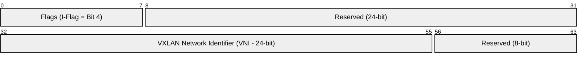
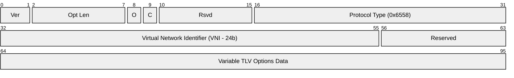
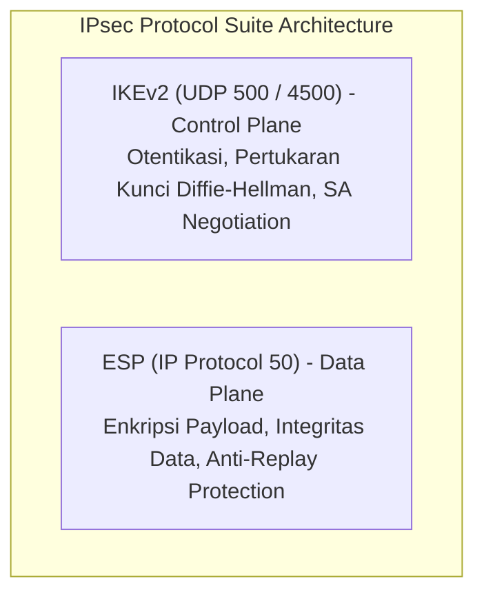
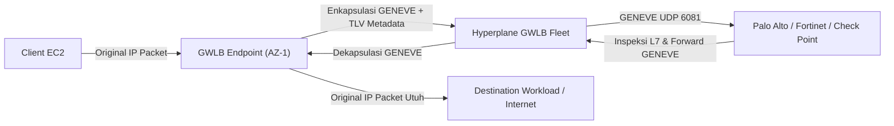
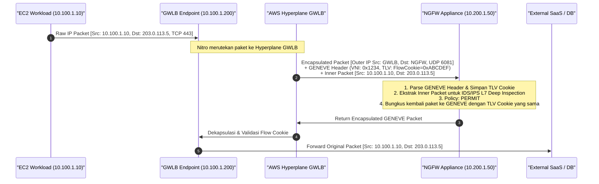
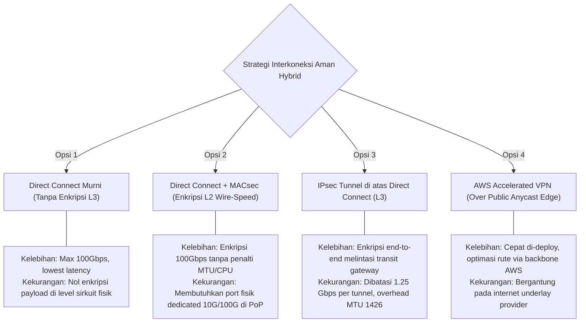

# Modul 04: Overlay Networks, SDN Encapsulation & IPsec VPN Internals

<BadgeLabel type="sme" text="Level: Principal / SME" /> <BadgeLabel type="rfc" text="RFC 7348 / RFC 8926 / RFC 7296 / RFC 4301" /> <BadgeLabel type="aws" text="Geneve, VXLAN & AWS VPN Underlay" />

**Software-Defined Networking** (<NetworkTerm term="SDWAN" full="Software-Defined Networking (SDN)" desc="Paradigma arsitektur jaringan yang memisahkan control plane dari data plane fisik untuk orkestrasi dinamis.">SDN</NetworkTerm>) modern bertumpu pada konsep **Network Virtualization Overlays (NVO3)**: memisahkan identitas logis (*Endpoint Identifier - EID*) dari lokasi fisik perangkat pada topologi fisik (*Routing Locator - RLOC*). Di AWS, teknologi *overlay* menggerakkan seluruh ekosistem isolasi VPC, enkripsi IPsec VPN, dan penyisipan *inline security appliances* melalui **Gateway Load Balancer** (<NetworkTerm term="GWLB" />) berbasis **Generic Network Virtualization Encapsulation** (<NetworkTerm term="GENEVE" />).

Modul ini membedah protokol enkapsulasi overlay dari struktur bit header dan kriptografi ESP hingga implementasi inspeksi firewall *zero-loss* skala enterprise.

---

## 🛠️ Interactive Lab: Packet Flow & Encapsulation Tracer

Gunakan simulator interaktif di bawah ini untuk menelusuri bagaimana frame L2, paket L3, dan payload L4 dienkapsulasi ke dalam header <NetworkTerm term="GENEVE" />, **Virtual Extensible LAN** (<NetworkTerm term="VXLAN" />), dan ESP secara *hop-by-hop*:

<ClientOnly>
  <PacketTracer />
</ClientOnly>

---

## Layer 1: Protocol Mechanics & RFC Theory

### 1.1 Anatomi Byte-Level Protokol Enkapsulasi Overlay

```
+-----------------------------------------------------------------------------------+
| Outer Eth (14B) | Outer IP (20B) | Outer UDP (8B) | Tunnel Header | Inner Frame   |
+-----------------------------------------------------------------------------------+
```

#### A. VXLAN Header (RFC 7348) - 8 Byte Fixed Header
VXLAN beroperasi di atas **UDP Port 4789**. Overhead total adalah **50 Byte** ($14\text{B Ethernet} + 20\text{B IP} + 8\text{B UDP} + 8\text{B VXLAN}$).


- **I-Flag (Bit 4)**: Wajib diset bernilai 1 untuk menandakan VNI valid.
- **24-bit VNI**: Menyediakan $2^{24} = 16,777,216$ segmen virtual terisolasi (menggantikan limit 4,096 VLAN ID).

#### B. GENEVE Header (RFC 8926) - Variable Length Header
GENEVE beroperasi di atas **UDP Port 6081**. Protokol ini menjadi standar modern pada AWS Gateway Load Balancer karena mendukung penyisipan metadata dinamis melalui opsi *Type-Length-Value (TLV)*:



### 1.2 Suite IPsec: IKEv2 & Encapsulating Security Payload (ESP)

Suite IPsec (RFC 4301 / RFC 7296) menyediakan kerangka kerja keamanan kriptografis L3:



#### Anatomi Paket IPsec ESP Tunnel Mode (RFC 4303):
```
+---------------+------------+---------+-------------------+----------+-------------+---------+
| Outer IP (20B)| ESP Header |   IV    | Encrypted Payload | ESP Pad  | ESP Trailer | ESP ICV |
|  Protocol 50  | SPI + Seq  | (8-16B) | (Inner IP + Data) | (0-255B) | PadLen+Next | (16B)   |
+---------------+------------+---------+-------------------+----------+-------------+---------+
```

- **Security Parameters Index (SPI - 32 bit)**: Mengidentifikasi Security Association (SA) yang aktif pada receiver.
- **Sequence Number (32 bit)**: Perlindungan terhadap serangan *Anti-Replay*.
- **NAT-Traversal (NAT-T, RFC 3948)**: Ketika router perantara menjalankan NAT, ESP (Protocol 50 tanpa port) dibungkus ke dalam **UDP Port 4500** dengan menyisipkan 4-byte *Non-ESP Marker* (`0x00000000`) di awal paket.

::: tip STANDAR BEST PRACTICE INDUSTRI (SME RECOMMENDATION)
Selalu gunakan **AES-256-GCM** (Galois/Counter Mode) sebagai algoritma enkripsi Phase 2 IPsec ESP. Berbeda dengan CBC mode yang membutuhkan proses hashing HMAC terpisah (misal: SHA2-256), AES-GCM menyediakan *Authenticated Encryption with Associated Data (AEAD)* dalam satu siklus clock silikon, mengurangi latensi enkripsi Nitro hingga 60%.
:::

---

## Layer 2: AWS Distributed Underlay & Hyperplane Internals

### 2.1 Mekanisme AWS Gateway Load Balancer (GWLB) & GENEVE TLV

AWS GWLB menggunakan arsitektur **2-Arm Transparent Bump-in-the-Wire** bertenaga GENEVE:



#### Struktur Metadata GENEVE TLV yang Diinjeksi AWS GWLB:
AWS menyisipkan opsi TLV khusus (*Option Class `0x0108`*) pada setiap paket:
1. **Flow Cookie**: Token 64-bit unik yang memetakan sesi aliran bidirectional.
2. **Endpoint ID**: ID unik VPC Endpoint (`vpce-xxxx`) tempat paket berasal.
3. **Attachment ID**: ID asosiasi Transit Gateway / VPC attachment.

*Keuntungan Arsitektural*: Firewall appliance dapat menginspeksi trafik tanpa perlu melakukan Source NAT (SNAT). Alamat IP asli client dan server tetap terlindungi secara transparan (*Full IP Transparency*).

---

## Layer 3: AWS Resource Deep-Dive & Hard Limits

### 3.1 Kuota & Hard Limits VPN & GWLB

| Parameter Resource | Batasan Hard / Quota | Karakteristik & Rekomendasi SME |
| :--- | :--- | :--- |
| **AWS Site-to-Site VPN Bandwidth** | 1.25 Gbps per Tunnel | Batasan pemrosesan kriptografi Nitro per tunnel. |
| **AWS Site-to-Site VPN Packets Per Second** | 140,000 PPS per Tunnel | Melebihi limit ini akan memicu packet drops (`TunnelDataInDrops`). |
| **Transit Gateway ECMP VPN Scaling** | Maks 50 Gbps (hingga 20-40 Tunnels) | Agregasi bandwidth dengan mengaktifkan dynamic BGP multipath. |
| **GWLB MTU Support** | 8500 Bytes | Memastikan paket Jumbo VPC (8500) dapat dienkapsulasi GENEVE tanpa drop. |
| **NAT-T Keepalive Timeout** | 20 Detik | Mencegah state table NAT firewall perantara terhapus (*idle eviction*). |

---

## Layer 4: Hop-by-Hop Packet Walkthrough & Flow Lifecycle

Diagram sequence berikut membedah aliran data inspeksi NGFW menggunakan enkapsulasi GENEVE:



---

## Layer 5: Production Terraform IaC & CLI Blueprints

### 5.1 Terraform Blueprint: AWS Accelerated Site-to-Site VPN dengan AES-GCM

```hcl
# accelerated-vpn.tf
resource "aws_customer_gateway" "main" {
  bgp_asn    = 65100
  ip_address = "198.51.100.25"
  type       = "ipsec.1"

  tags = {
    Name = "cgw-onprem-primary"
  }
}

resource "aws_vpn_connection" "accelerated_vpn" {
  customer_gateway_id   = aws_customer_gateway.main.id
  transit_gateway_id    = "tgw-0123456789abcdef0"
  type                  = "ipsec.1"
  enable_acceleration   = true # Rute trafik via AWS Global Anycast Edge Network!

  # Kriptografi Modern Phase 1 (IKEv2)
  tunnel1_ike_versions                 = ["ikev2"]
  tunnel1_phase1_encryption_algorithms = ["AES256-GCM-16"]
  tunnel1_phase1_integrity_algorithms  = ["SHA2-384"]
  tunnel1_phase1_dh_group_numbers      = [19, 20] # ECP 256 / 384
  tunnel1_phase1_lifetime_seconds      = 28800

  # Kriptografi Modern Phase 2 (ESP AEAD)
  tunnel1_phase2_encryption_algorithms = ["AES256-GCM-16"]
  tunnel1_phase2_integrity_algorithms  = ["SHA2-384"]
  tunnel1_phase2_dh_group_numbers      = [19, 20]
  tunnel1_phase2_lifetime_seconds      = 3600

  # Dead Peer Detection & Startup Triggers
  tunnel1_dpd_timeout_action           = "restart"
  tunnel1_dpd_timeout_seconds          = 30
  tunnel1_startup_action               = "start" # AWS actively initiates IKE

  tags = {
    Name = "vpn-accelerated-enterprise-hub"
  }
}
```

### 5.2 Konfigurasi StrongSwan Linux (`/etc/ipsec.conf`) untuk AWS Phase 1/2

```text
conn aws-tgw-tunnel1
    authby=secret
    auto=start
    type=tunnel
    left=%defaultroute
    leftid=198.51.100.25
    leftsubnet=0.0.0.0/0
    right=15.230.12.34 # AWS VPN Anycast Endpoint
    rightid=15.230.12.34
    rightsubnet=0.0.0.0/0
    keyexchange=ikev2
    ike=aes256gcm16-sha384-ecp384!
    esp=aes256gcm16-sha384-ecp384!
    dpdaction=restart
    dpddelay=10s
    dpdtimeout=30s
    closeaction=restart
    keyingtries=%forever
```

---

## Layer 6: Failure Modes, Edge Cases & SEV-1 Troubleshooting Matrix

### 6.1 Production SEV-1 Incident Matrix

| Gejala Insiden (*Symptoms*) | *Root Cause Analysis* (RCA) | Perintah Verifikasi & Diagnosa CLI | Langkah Mitigasi & Resolusi |
| :--- | :--- | :--- | :--- |
| **Sesi IPsec gagal tersambung** (`NO_PROPOSAL_CHOSEN` pada log IKE). | Ketidakcocokan enkripsi Phase 1 / Phase 2 (misal: AWS diset AES-GCM-256 namun router on-premise mengajukan AES-CBC). | `journalctl -u strongswan -f` atau `show crypto ikev2 sa` | Samakan parameter IKE version, cipher suite, DH group, dan SHA hashing pada kedua ujung tunnel. |
| **Trafik VPN putus tepat setelah inisiasi** (IKE UP namun data stream macet). | Stateful firewall perantara memblokir ESP (IP Protocol 50) karena tidak ada port L4. NAT-T UDP 4500 tidak aktif. | `tcpdump -nnvv -i any 'proto 50 or port 4500'` | Paksa pengaktifan NAT-T UDP 4500 pada router edge on-premise (`forceencaps=yes`). |
| **GWLB menjatuhkan seluruh return traffic** dari firewall appliance. | Firewall appliance membuang (*stripping*) GENEVE TLV Option Class `0x0108` saat mem-forward paket. | `tcpdump -nnvv -i eth0 port 6081 -X` | Pastikan firewall OS mendukung penuh GENEVE TLV Option Preservation (aktifkan *Preserve GENEVE metadata* pada vendor appliance). |
| **Enkripsi IPsec mengalami drop paket acak (*Anti-Replay drops*)** pada koneksi multi-path. | Jitter tinggi pada internet publik menyebabkan paket tiba tidak berurutan (*out of order*), melampaui window anti-replay 64-packet. | `netstat -s \| grep -i replay` | Perbesar window anti-replay di router on-premise menjadi 1024 atau aktifkan AWS Accelerated VPN. |

---

## Layer 7: Principal Architect Tradeoff Framework



### Matriks Keputusan Arsitektur: Teknologi Interkoneksi Aman

| Dimensi Arsitektural | Direct Connect Murni | DX + MACsec (802.1AE) | IPsec over Direct Connect | Accelerated Site-to-Site VPN |
| :--- | :--- | :--- | :--- | :--- |
| **Kapasitas Throughput** | **Hingga 100 Gbps** | **Hingga 100 Gbps** | 1.25 Gbps / tunnel (ECMP max 50G) | 1.25 Gbps / tunnel (ECMP max 50G) |
| **Tingkat Latensi** | **Terendah (< 2 ms)** | **Terendah (< 2 ms)** | Menengah (+5 ms enkripsi) | Menengah (+10-20 ms Anycast) |
| **Tingkat Enkripsi Data** | Tidak ada | **Layer 2 (Wire-Speed)** | **Layer 3 (End-to-End)** | **Layer 3 (End-to-End)** |
| **Dampak Terhadap MTU** | Jumbo 9001 Byte | **Jumbo 9001 Byte (No Impact)**| Turun ke 1426 Byte (Frag Risk) | Turun ke 1426 Byte |
| **Biaya Implementasi** | Sedang | Tinggi (Dedicated Port) | Sedang | **Sangat Terjangkau** |
