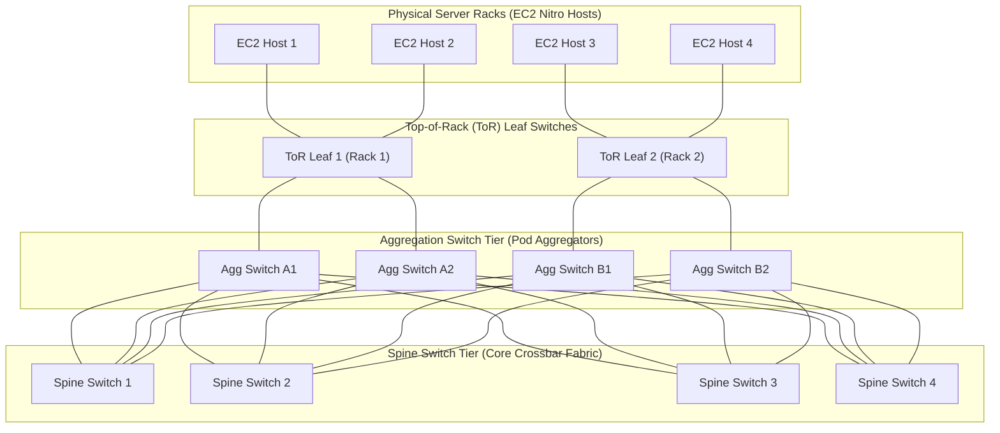
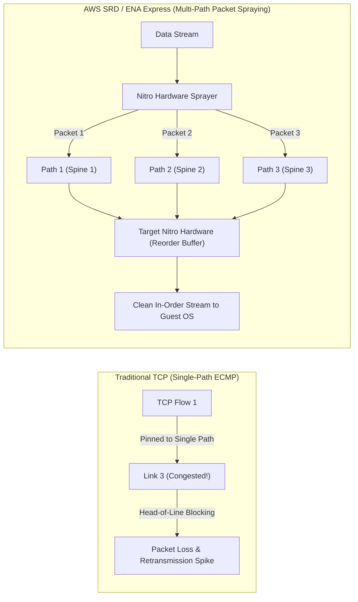
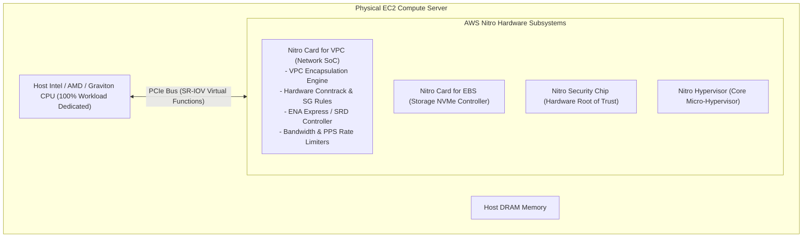
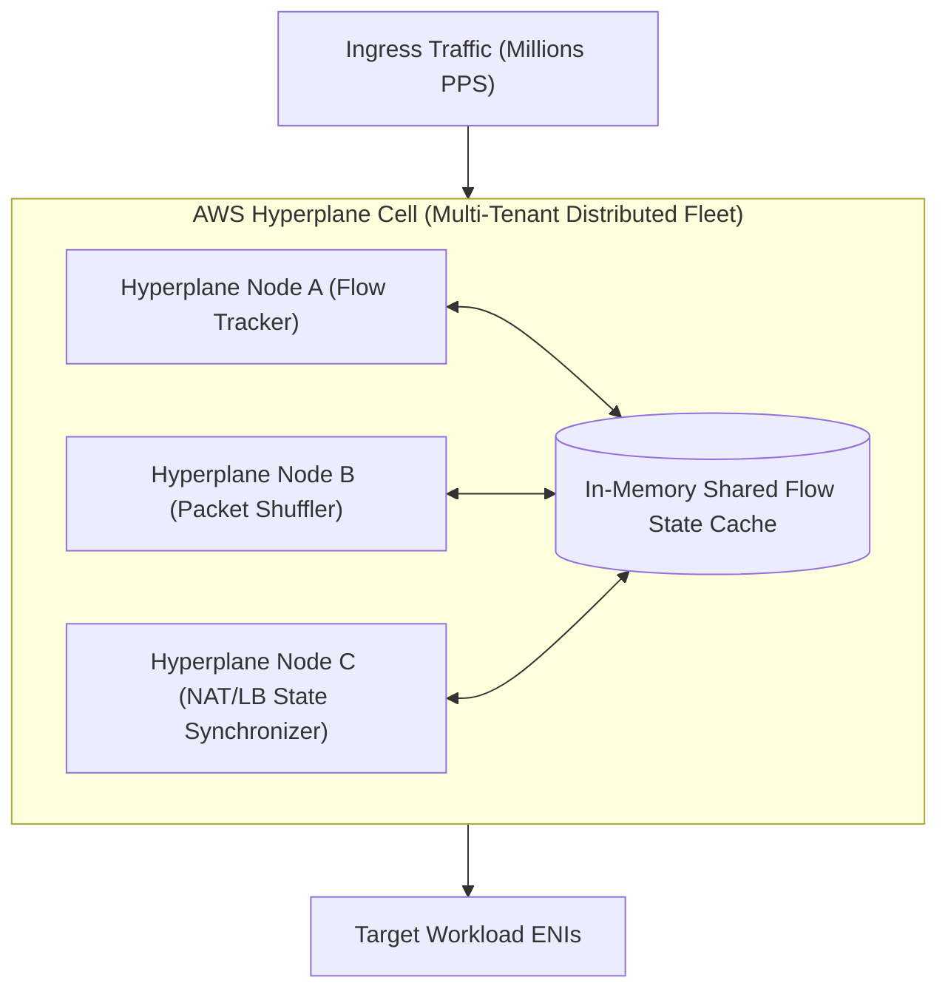
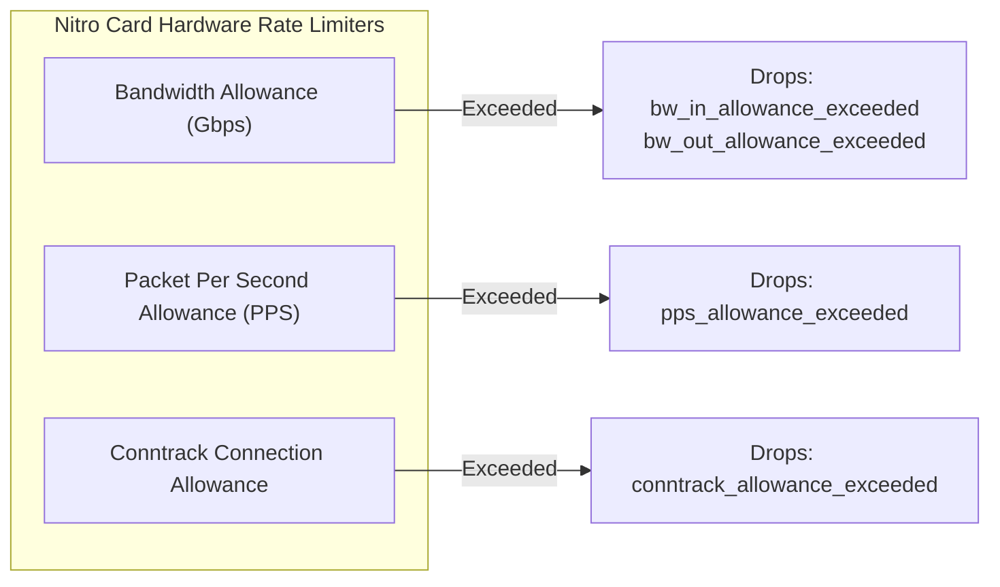
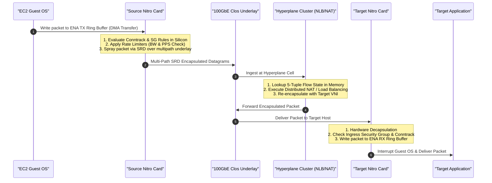
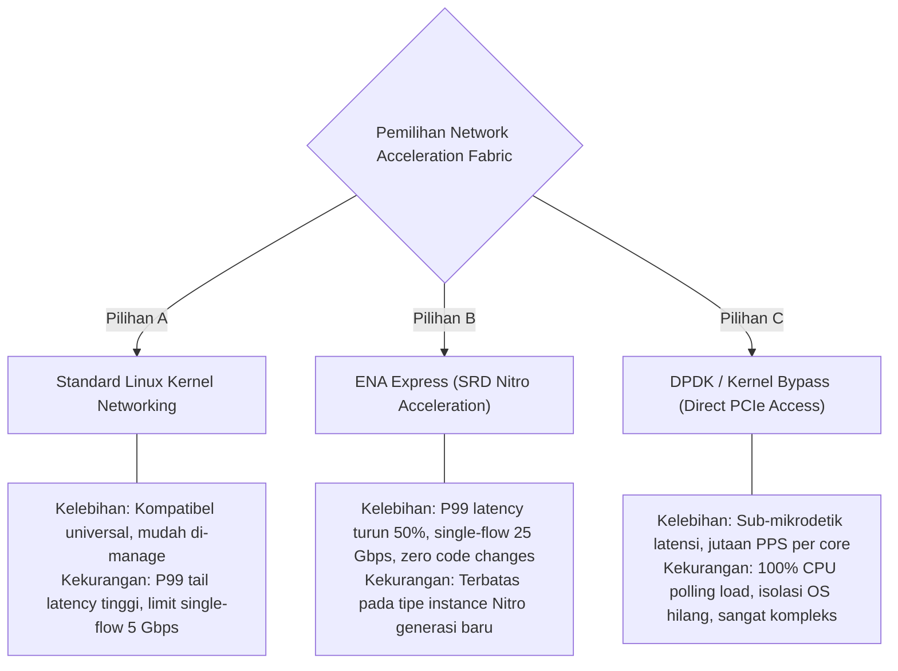

# Modul 05: AWS Hardware Underlay, Nitro System, ENA Express & Hyperplane

<BadgeLabel type="sme" text="Level: Principal / SME" /> <BadgeLabel type="aws" text="Nitro Hardware & Hyperplane Flow Engine" /> <BadgeLabel type="infra" text="Physical Clos Underlay & SRD" />

Di balik abstraksi software-defined VPC yang sederhana, AWS mengoperasikan salah satu infrastruktur jaringan fisik dan sistem komputasi terdistribusi paling masif di dunia. Pemahaman mendalam tentang **arsitektur perangkat keras AWS Nitro, underlay Clos fabric, dan engine distributed flow state Hyperplane** adalah pembeda utama antara administrator cloud konvensional dan *Principal Cloud Network Architect*.

Modul ini mengupas tuntas apa yang terjadi di level silikon dan kabel serat optik ketika sebuah paket ditransmisikan melintasi datacenter AWS.

---

## Layer 1: Physical Underlay & Hardware Virtualization Theory

### 1.1 Topologi Fisik Datacenter: Non-Blocking Clos Network

Infrastruktur fisik AWS Availability Zone dibangun di atas topologi **Multi-Tier Clos Network (Leaf-Spine Architecture)**:



#### Karakteristik Fisik Clos Fabric:
- **Non-Blocking Bisectional Bandwidth**: Setiap server fisik dapat berkomunikasi dengan server fisik lain di dalam AZ yang sama pada kecepatan penuh (*full line-rate 100G/200G/400G*) tanpa *oversubscription*.
- **Kelemahan TCP Tradisional di Clos Network**: Algoritma ECMP tradisional melakukan hashing 5-tuple flow ke 1 jalur tetap. Jika terjadi *hash collision* (beberapa aliran besar berbagi link fisik yang sama), akan timbul **incast congestion**, antrean buffer meledak (*bufferbloat*), dan lonjakan latensi ekor (**P99 / P99.9 tail latency spike**).

### 1.2 Protokol Scalable Reliable Datagram (SRD)

Untuk mengatasi kelemahan TCP di atas topologi Clos, AWS mengembangkan protokol transport proprietary bernama **SRD (Scalable Reliable Datagram)**:



- **Per-Packet Multipath Spraying**: SRD memecah payload dan menyebarkan setiap paket ke ratusan jalur Clos yang berbeda secara simultan.
- **Out-of-Order Delivery at Underlay**: Nitro Card receiver menangani *reordering buffer* di level silikon dalam waktu sub-mikrodetik sebelum menyerahkan data ke OS tamu.
- **Sub-Microsecond Congestion Response**: Menggunakan pengukuran RTT presisi tinggi untuk menghindari jalur fisik yang sedang mengalami mikro-kongesti (*congestion avoidance*).

::: tip STANDAR BEST PRACTICE INDUSTRI (SME RECOMMENDATION)
Aktifkan **ENA Express** pada instans EC2 generasi terbaru (misal: c6i, m6i, r6i, c7g) untuk komunikasi inter-node yang membutuhkan latensi ultra-rendah dan throughput konsisten. ENA Express secara otomatis membungkus trafik TCP/UDP di dalam protokol SRD di level Nitro tanpa memerlukan perubahan kode aplikasi apa pun.
:::

---

## Layer 2: AWS Distributed Underlay & Hyperplane Internals

### 2.1 Arsitektur AWS Nitro System

Sistem AWS Nitro mengalihkan (*offload*) seluruh fungsi virtualisasi jaringan, storage, dan keamanan dari CPU host server ke kartu ASIC/SoC terdedikasi:



### 2.2 AWS Hyperplane: Distributed State Machine Engine

**Hyperplane** adalah platform internal AWS terdistribusi berskala masif (*massively scalable distributed flow tracking engine*) yang menjadi fondasi layanan stateful AWS, termasuk:
- **AWS NAT Gateway**
- **Network Load Balancer (NLB)**
- **Gateway Load Balancer (GWLB)**
- **AWS PrivateLink (Interface Endpoints)**
- **Amazon EFS**



#### Cara Kerja Hyperplane Flow State:
1. **Cell-Based Isolation**: Hyperplane dibagi menjadi sel-sel terisolasi per Availability Zone. Kegagalan pada 1 sel tidak akan berdampak pada sel lainnya.
2. **Stateless Resiliency with In-Memory State**: State koneksi TCP disinkronkan di antara armada node Hyperplane secara *lock-free*. Jika 1 node Hyperplane mengalami crash fisik, paket berikutnya langsung diproses oleh node pengganti tanpa memutuskan koneksi TCP klien (*Zero-TCP-Drop Failover*).

---

## Layer 3: AWS Resource Deep-Dive & Hard Limits

### 3.1 Hard Limits & Allowance Metrics Nitro

AWS menerapkan mekanisme *credit bucket* pada level perangkat keras Nitro untuk membatasi pemakaian jaringan instance:



| Metrik Allowance Nitro | Tipe Throttling | Dampak pada Aplikasi | Solusi Arsitektural SME |
| :--- | :--- | :--- | :--- |
| `bw_in_allowance_exceeded` | Bandwidth Ingress | Packet drop pada transfer file besar / backup. | Upgrade instance size atau aktifkan network burstable bandwidth. |
| `bw_out_allowance_exceeded`| Bandwidth Egress | Latensi meningkat, throughput terhenti di batas baseline. | Gunakan instance keluarga `-n` (misal: `c6in.32xlarge` hingga 200 Gbps). |
| `pps_allowance_exceeded` | Packets Per Second | Drop pada trafik DNS, microservices REST payload kecil, atau game server. | Gabungkan paket kecil (Jumbo frame / TSO) atau scale-out instance. |
| `conntrack_allowance_exceeded` | Max Stateful Flows | Koneksi TCP baru ditolak secara acak (*Connection refused/timeout*). | Gunakan Stateless Security Group rules, pisahkan trafik via NLB, atau perbesar ukuran instance. |

---

## Layer 4: Hop-by-Hop Packet Walkthrough & Flow Lifecycle

Diagram sequence berikut memvisualisasikan bagaimana sebuah paket diproses oleh **Nitro Card dan Hyperplane** dari host pengirim hingga host penerima:



---

## Layer 5: Production Terraform IaC & CLI Blueprints

### 5.1 Terraform Blueprint: Launch Template dengan ENA Express (SRD)

```hcl
# launch-template-ena-express.tf
resource "aws_launch_template" "high_perf_workload" {
  name_prefix   = "lt-high-perf-srd-"
  image_id      = "ami-0123456789abcdef0" # Amazon Linux 2023 AMI
  instance_type = "c6i.4xlarge"

  network_interfaces {
    associate_public_ip_address = false
    device_index                = 0
    security_groups             = ["sg-0123456789abcdef0"]
    delete_on_termination       = true

    # Aktifkan ENA Express (SRD) pada Network Interface
    ena_srd_specification {
      ena_srd_enabled = true
      ena_srd_udp_specification {
        ena_srd_udp_enabled = true
      }
    }
  }

  tag_specifications {
    resource_type = "instance"
    tags = {
      Name = "high-performance-srd-node"
      Role = "Core-Database-Replica"
    }
  }
}
```

### 5.2 Skrip Diagnosa Metrik Allowance Nitro (`ethtool`)

Jalankan perintah ini di dalam instance Linux untuk memverifikasi apakah ada paket yang dijatuhkan oleh kartu Nitro:

```bash
#!/bin/bash
# nitro-diagnostics.sh - Verifikasi Throttling Hardware Nitro
echo "=== MEMERIKSA STATUS ENA EXPRESS & SRD ==="
ethtool -S eth0 | grep -E "ena_srd"

echo -e "\n=== MEMERIKSA PACKET DROPS PADA LEVEL HARDWARE NITRO ==="
ethtool -S eth0 | grep -E "allowance_exceeded"

# Output yang diharapkan jika sehat:
# bw_in_allowance_exceeded: 0
# bw_out_allowance_exceeded: 0
# pps_allowance_exceeded: 0
# conntrack_allowance_exceeded: 0
# linklocal_allowance_exceeded: 0
```

---

## Layer 6: Failure Modes, Edge Cases & SEV-1 Troubleshooting Matrix

### 6.1 Production SEV-1 Incident Matrix

| Gejala Insiden (*Symptoms*) | *Root Cause Analysis* (RCA) | Perintah Verifikasi & Diagnosa CLI | Langkah Mitigasi & Resolusi |
| :--- | :--- | :--- | :--- |
| **API Latency melonjak ke 500ms** pada cluster microservices saat jam sibuk (*microbursts*). | `pps_allowance_exceeded`: Jumlah paket per detik melampaui kuota Nitro instance type kecil (`t3.medium`/`c5.large`). | `ethtool -S eth0 \| grep pps_allowance_exceeded` | 1. Naikkan ukuran instance (*vertical scale*).<br/>2. Aktifkan TCP connection keepalive & HTTP/2 multiplexing. |
| **Koneksi baru ke database gagal acak** (`Connection timed out`), koneksi lama tetap hidup. | `conntrack_allowance_exceeded`: Tabel state tracking hardware Nitro penuh akibat ribuan koneksi pendek (*connection churn*). | `ethtool -S eth0 \| grep conntrack_allowance_exceeded` | Pasang connection pooler (misal: AWS RDS Proxy / PgBouncer) dan gunakan stateless NACLs untuk bypass conntrack. |
| **Kinerja transfer data drop drastis setelah kernel update**. | Driver ENA out-of-tree terhapus saat kernel upgrade, sistem fallback ke emulasi lama tanpa fitur offload. | `modinfo ena` & `ethtool -i eth0` | Pasang driver ENA versi terbaru (`dkms install amzn-drivers`) dan re-generate initramfs. |
| **Throughput NAT Gateway lambat di 1 AZ** sementara AZ lain normal. | Hyperplane AZ Imbalance: Trafik terkonsentrasi pada 1 NAT Gateway di 1 AZ melintasi cross-AZ routing. | CloudWatch metric: `PacketsDropCount` & `BytesInFromDestination` per NAT GW | Pasangkan 1 NAT Gateway per Availability Zone (*AZ-independent architecture*). |

---

## Layer 7: Principal Architect Tradeoff Framework



### Matriks Keputusan Arsitektur: Teknologi Pemrosesan Paket

| Dimensi Arsitektural | Standard Linux Kernel | ENA Express (SRD) | DPDK Kernel Bypass |
| :--- | :--- | :--- | :--- |
| **Single-Flow Bandwidth Limit** | 5 Gbps | **25 Gbps** | Line-Rate (100G+) |
| **P99 Tail Latency Stability** | Sedang (Terdampak Hash Collisions) | **Sangat Stabil (SRD Multipath)** | **Ultra Rendah (Sub-mikrodetik)** |
| **Beban Penggunaan CPU Host** | Rendah-Sedang | **Nol (Offload ke Nitro ASIC)** | Sangat Tinggi (1 Core 100% Polling) |
| **Kompatibilitas Aplikasi** | 100% Transparan | **100% Transparan (Zero Changes)**| Perlu Rewrite Kode Aplikasi |
| **Rekomendasi Arsitektur Enterprise** | Workload Umum | **Standar Rekomendasi SME Production** | Khusus HFT (High-Frequency Trading) |
