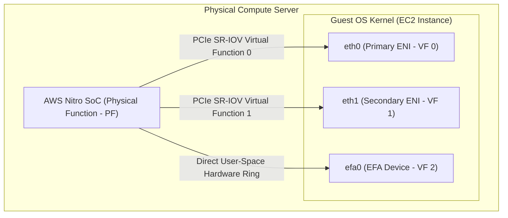
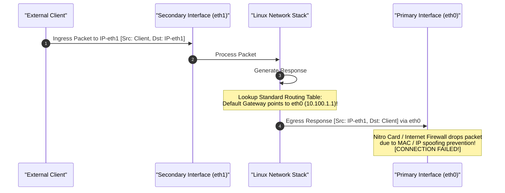
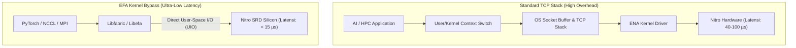
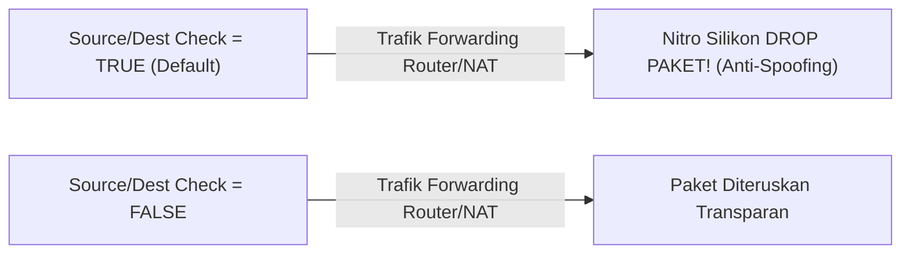
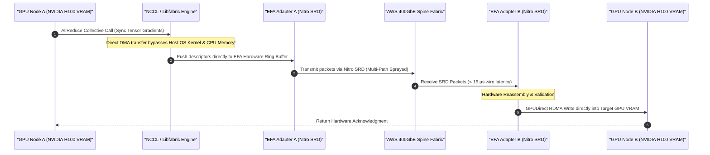
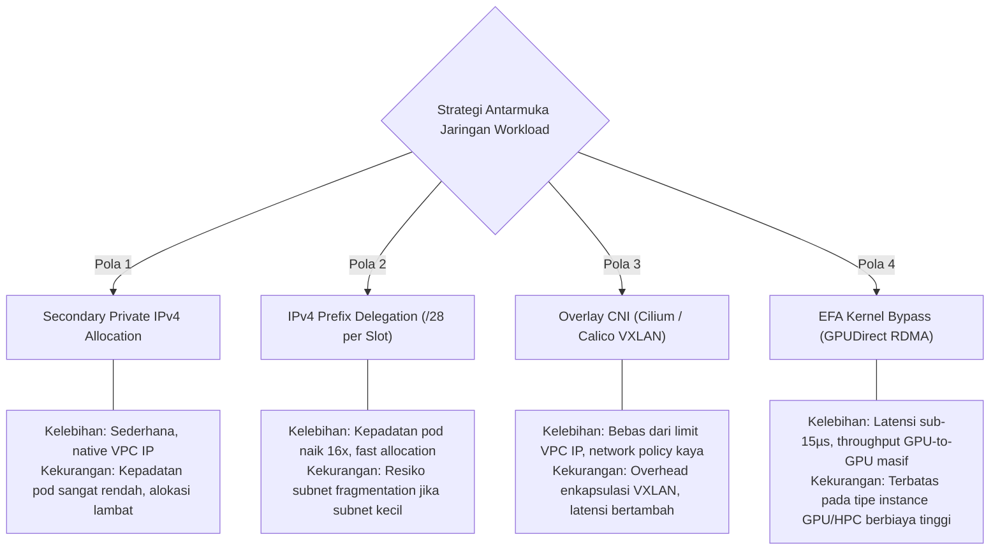

# Modul 06: Elastic Network Interfaces (ENI), EFA for AI/HPC & Prefix Delegation

<BadgeLabel type="sme" text="Level: Principal / SME" /> <BadgeLabel type="aws" text="ENI, EFA & AWS VPC CNI" /> <BadgeLabel type="perf" text="High Performance Computing & AI/ML" />

Dalam arsitektur *cloud compute*, **Elastic Network Interface (ENI)** adalah komponen virtualisasi yang menghubungkan instans komputasi dengan *VPC Data Plane*. Perkembangan beban kerja modern—mulai dari *high-density container orchestration* (Amazon EKS) hingga *distributed Large Language Model (LLM) training*—menuntut arsitektur antarmuka jaringan khusus: **IPv4 Prefix Delegation** untuk mengeliminasi batasan kuota IP pod, dan **Elastic Fabric Adapter (EFA)** dengan *OS Kernel Bypass* untuk komunikasi GPU-to-GPU berlatensi ultra-rendah.

Modul ini mengupas tuntas ENI dan EFA dari *PCIe Virtual Functions* dan tabel *Linux policy routing* hingga orkestrasi cluster AI skala enterprise.

---

## Layer 1: Network Interface Architecture & OS Kernel Plumbing

### 1.1 Anatomi ENI pada Level Perangkat Keras (PCIe SR-IOV)

ENI bukanlah interface software loopback semata, melainkan sebuah **Virtual Function (VF)** pada bus PCIe fisik server yang di-expose langsung oleh AWS Nitro SoC ke guest OS:



### 1.2 Masalah Asymmetric Routing pada Multi-Homed Linux Instances

Ketika instance EC2 memiliki lebih dari satu ENI (`eth0` dan `eth1`), Linux kernel secara default hanya memiliki **1 Default Gateway** (biasanya diarahkan ke `eth0`). Hal ini memicu *Asymmetric Routing Drop*:



#### Solusi: Source-Based Policy Routing (`iprule` & `iproute2`)
Untuk mengatasi masalah ini, setiap ENI sekunder harus memiliki tabel *routing table* independen yang dipetakan berdasarkan alamat IP sumber (*source-based policy routing*):

```bash
# Buat tabel routing terpisah untuk eth1 (Tabel 200)
echo "200 custom_eth1" | sudo tee -a /etc/iproute2/rt_tables

# Tambahkan default route khusus untuk subnet eth1
sudo ip route add 10.100.2.0/24 dev eth1 src 10.100.2.50 table 200
sudo ip route add default via 10.100.2.1 dev eth1 table 200

# Rute seluruh trafik dengan Source IP eth1 melalui Tabel 200
sudo ip rule add from 10.100.2.50/32 table 200
sudo ip rule add to 10.100.2.50/32 table 200
```

### 1.3 Elastic Fabric Adapter (EFA) & OS Kernel Bypass

Beban kerja AI terdistribusi (LLM pre-training seperti Llama 3 atau DeepSeek) membutuhkan sinkronisasi miliaran bobot tensor gradien (*AllReduce collectives*) antar ribuan GPU. Protokol TCP standar memiliki *overhead* CPU dan latensi yang terlalu tinggi untuk kebutuhan ini.



- **Libfabric API (OpenFabrics Interfaces)**: Antarmuka standar industri yang memungkinkan aplikasi PyTorch/NCCL berkomunikasi langsung dengan kartu hardware EFA.
- **Zero Kernel Context-Switch**: Menghindari alokasi memori buffer kernel OS; data disalin langsung dari GPU Memory (VRAM) ke antarmuka jaringan Nitro via **GPUDirect RDMA**.

### 1.4 IPv4 Prefix Delegation (RFC 3633 in AWS)

Alih-alih mengalokasikan satu IP sekunder per slot ENI, **IPv4 Prefix Delegation** mengalokasikan satu blok subnet **/28 (16 alamat IP)** utuh ke setiap slot IP ENI:

```
Standar ENI Slot Alokasi:
ENI Slot 1 ──> 10.100.1.15 (1 IP Address)

Prefix Delegation Slot Alokasi:
ENI Slot 1 ──> 10.100.1.16/28 (16 IP Addresses: 10.100.1.16 s/d 10.100.1.31)
```

::: tip STANDAR BEST PRACTICE INDUSTRI (SME RECOMMENDATION)
Selalu aktifkan **IPv4 Prefix Delegation** pada Amazon EKS cluster dengan VPC CNI versi $\ge 1.9.0$. Fitur ini meningkatkan kapasitas jumlah pod per node EC2 hingga **16x lipat** tanpa perlu beralih ke tipe instance besar hanya demi mendapatkan kuota ENI yang lebih banyak.
:::

---

## Layer 2: AWS Distributed Underlay & Hyperplane Internals

### 2.1 Tipe-Tipe Attachment ENI
1. **Primary ENI (`eth0`)**: Terpasang otomatis pada `device-index=0` saat instance dibuat. Tidak dapat dicopot (*non-detachable*) selama instance hidup.
2. **Secondary ENI (`eth1`..`ethN`)**: Antarmuka jaringan tambahan yang dapat dipasang dan dicopot (*hot-pluggable*) secara dinamis antar instance di AZ yang sama.
3. **Trunk ENI**: Digunakan oleh AWS VPC CNI pada instance berbasis Nitro untuk memasang puluhan *Branch ENIs* melalui satu PCIe interface fisik.

### 2.2 Mekanisme Source / Destination Check
Secara default, kartu AWS Nitro memvalidasi bahwa setiap paket yang keluar atau masuk ke ENI memiliki IP dan MAC address yang persis terdaftar pada database VPC.



*Aturan Arsitektural*: Untuk instance yang bertindak sebagai **NAT Instance, VPN Gateway, atau Third-Party Firewall Appliance**, atribut `SourceDestCheck` **WAJIB dimatikan** (`false`).

---

## Layer 3: AWS Resource Deep-Dive & Hard Limits

### 3.1 Formula Kepadatan Pod EKS (Pod Density Calculation)

Kapasitas maksimum pod pada satu instance worker node dihitung dengan formula matematis berikut:

$$\text{Max Pods (Standard)} = (\text{Jumlah ENI} \times (\text{Jumlah IPv4 per ENI} - 1)) + 2$$
$$\text{Max Pods (Prefix Delegation)} = (\text{Jumlah ENI} \times (\text{Jumlah Prefixes per ENI} \times 16)) + 2$$
*(Catatan: $+2$ dialokasikan untuk `kube-proxy` dan `aws-node` pod host-networking).*

### 3.2 Tabel Perbandingan Kapasitas ENI & EFA per Instance Family

| Tipe Instance EC2 | Max ENIs | Max IPv4 / ENI | Max Pods (Standard) | Max Pods (Prefix Delegation) | EFA Support |
| :--- | :--- | :--- | :--- | :--- | :--- |
| `t3.medium` | 3 | 6 | 17 | N/A (Non-Nitro PD) | Tidak |
| `c6i.large` | 3 | 10 | 29 | **110 Pods** (Kubelet Max) | Tidak |
| `c6i.4xlarge` | 8 | 30 | 234 | **110 / 250 Pods** | Opsional (1 EFA) |
| `p4de.24xlarge` (8x A100 GPU)| 4 | 50 | 198 | **110 / 250 Pods** | **4x EFA (400 Gbps)** |
| `p5.48xlarge` (8x H100 GPU) | 8 | 50 | 394 | **110 / 250 Pods** | **32x EFA (3,200 Gbps)** |

---

## Layer 4: Hop-by-Hop Packet Walkthrough & Flow Lifecycle

Diagram sequence berikut mendeskripsikan siklus hidup transmisi gradien AI antar GPU Node menggunakan antarmuka **EFA & GPUDirect RDMA**:



---

## Layer 5: Production Terraform IaC & CLI Blueprints

### 5.1 Terraform Blueprint: Cluster AI/HPC dengan EFA & Cluster Placement Group

```hcl
# efa-ai-cluster.tf
resource "aws_placement_group" "hpc_cluster" {
  name     = "pg-ai-training-cluster"
  strategy = "cluster" # Menempatkan node pada rack fisik terdekat di AZ yang sama
}

resource "aws_security_group" "efa_sg" {
  name        = "sg-efa-nodes"
  description = "Security Group for EFA inter-node communication"
  vpc_id      = "vpc-0123456789abcdef0"

  # Wajib: Self-referencing ingress rule untuk traffic EFA antar GPU
  ingress {
    from_port = 0
    to_port   = 0
    protocol  = "-1"
    self      = true
  }

  egress {
    from_port   = 0
    to_port     = 0
    protocol    = "-1"
    cidr_blocks = ["0.0.0.0/0"]
  }
}

resource "aws_network_interface" "efa_interface" {
  subnet_id       = "subnet-0123456789abcdef0"
  security_groups = [aws_security_group.efa_sg.id]
  interface_type  = "efa" # Tipe antarmuka EFA terdedikasi

  tags = {
    Name = "eni-efa-gpu-node-01"
  }
}

resource "aws_instance" "gpu_worker" {
  ami                  = "ami-0123456789abcdef0" # Deep Learning AMI (DLAMI)
  instance_type        = "g5.8xlarge"
  placement_group      = aws_placement_group.hpc_cluster.id

  network_interface {
    network_interface_id = aws_network_interface.efa_interface.id
    device_index         = 0
  }

  tags = {
    Name = "ai-training-worker-01"
  }
}
```

### 5.2 Mengaktifkan Prefix Delegation pada AWS EKS VPC CNI

```bash
# Terapkan konfigurasi Prefix Delegation pada DaemonSet VPC CNI
kubectl set env daemonset aws-node -n kube-system ENABLE_PREFIX_DELEGATION=true
kubectl set env daemonset aws-node -n kube-system WARM_PREFIX_TARGET=1
kubectl set env daemonset aws-node -n kube-system MINIMUM_IP_TARGET=5

# Verifikasi alokasi prefix /28 pada worker node
kubectl describe node <node-name> | grep -A 5 "Allocatable:"
```

---

## Layer 6: Failure Modes, Edge Cases & SEV-1 Troubleshooting Matrix

### 6.1 Production SEV-1 Incident Matrix

| Gejala Insiden (*Symptoms*) | *Root Cause Analysis* (RCA) | Perintah Verifikasi & Diagnosa CLI | Langkah Mitigasi & Resolusi |
| :--- | :--- | :--- | :--- |
| **Paket di-drop saat EC2 bertindak sebagai NAT Gateway / Router** software. | Atribut `SourceDestCheck` aktif pada ENI, memicu drop anti-spoofing oleh silikon Nitro. | `aws ec2 describe-network-interfaces --network-interface-ids <id> --query "NetworkInterfaces[*].SourceDestCheck"` | Nonaktifkan atribut: `aws ec2 modify-network-interface-attribute --network-interface-id <id> --no-source-dest-check`. |
| **Worker node EKS gagal scale-out** dengan error `FailedToAllocateIPAddress`. | Subnet IPv4 mengalami fragmentasi biner; tidak tersedia blok `/28` kontigu (16 IP berturutan) yang bebas. | `aws ec2 describe-subnets --subnet-ids <id>` | Pasang *Secondary CIDR* RFC 6598 bersih atau gunakan subnet khusus berukuran `/20` untuk EKS worker nodes. |
| **Job Distributed PyTorch LLM Training hang** saat inisiasi NCCL barrier. | Security Group node GPU tidak mengizinkan *self-referencing ingress* untuk port komunikasi internal EFA. | `nccl-tests / all_reduce_perf -b 8 -e 128M -f 2` | Tambahkan rule `self = true` (all traffic permit antar instance di SG yang sama). |
| **Koneksi ke Secondary ENI (`eth1`) putus** saat diakses dari luar subnet. | Asymmetric Routing: Response packet dikirim via default gateway `eth0` dan di-drop firewall. | `ip rule show` & `ip route show table 200` | Pasang *Source-Based Policy Routing* (`ip rule add from <eth1-ip> table 200`). |

---

## Layer 7: Principal Architect Tradeoff Framework



### Matriks Keputusan Arsitektur: Arsitektur Jaringan Antarmuka Komputasi

| Dimensi Arsitektural | Secondary IP Biasa | Prefix Delegation (/28) | Overlay CNI (VXLAN) | EFA Kernel Bypass |
| :--- | :--- | :--- | :--- | :--- |
| **Kepadatan Pod / Kontainer** | Rendah (~30 per node) | **Tinggi (110-250 per node)**| **Tinggi (Tak terbatas VPC)** | N/A (Dedicated Host) |
| **Overhead Enkapsulasi CPU** | Nol (Wire-speed) | **Nol (Wire-speed)** | 3-5% CPU (VXLAN) | **Nol (Hardware Offload)** |
| **Tingkat Latensi Transmisi** | Normal (~50 µs) | Normal (~50 µs) | Sedang (~70 µs) | **Ultra Rendah (< 15 µs)** |
| **Kebutuhan Subnetting** | Subnet biasa | **Wajib Subnet Besar (/20)**| Hanya 1 IP per Node | Subnet biasa + Cluster PG |
| **Use Case Utama** | Legacy Apps / Static IPs | **Standar Produksi EKS** | Multi-Cloud Mesh | **AI / LLM Distributed Training** |
