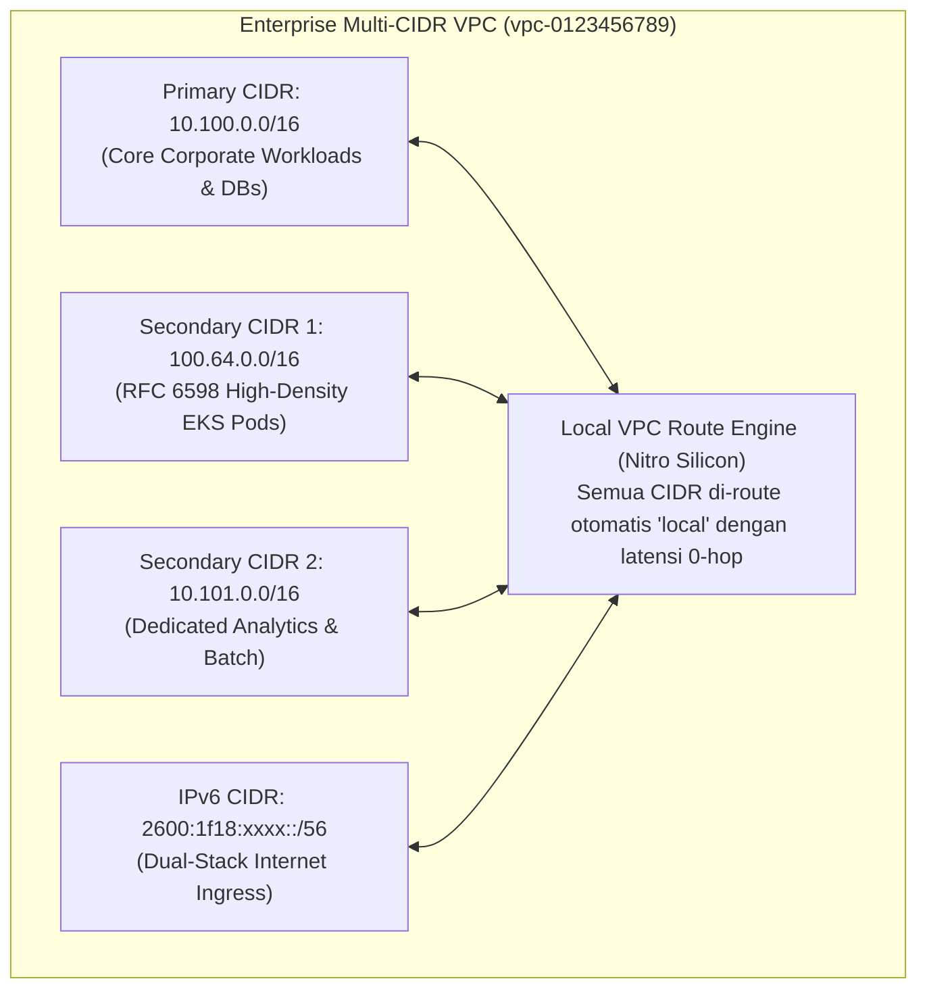
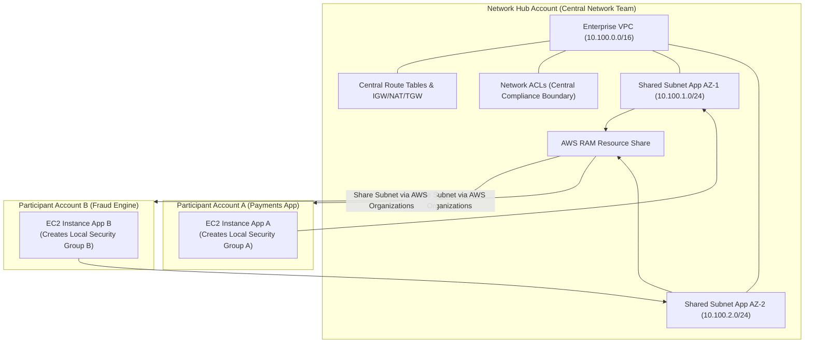
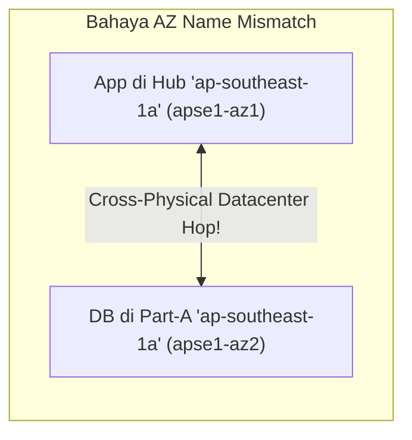
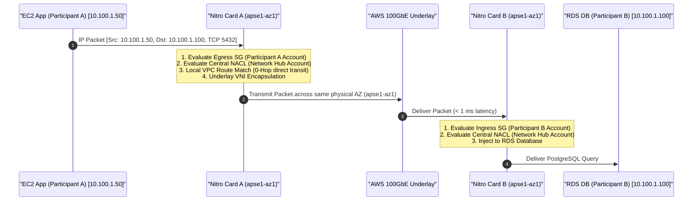
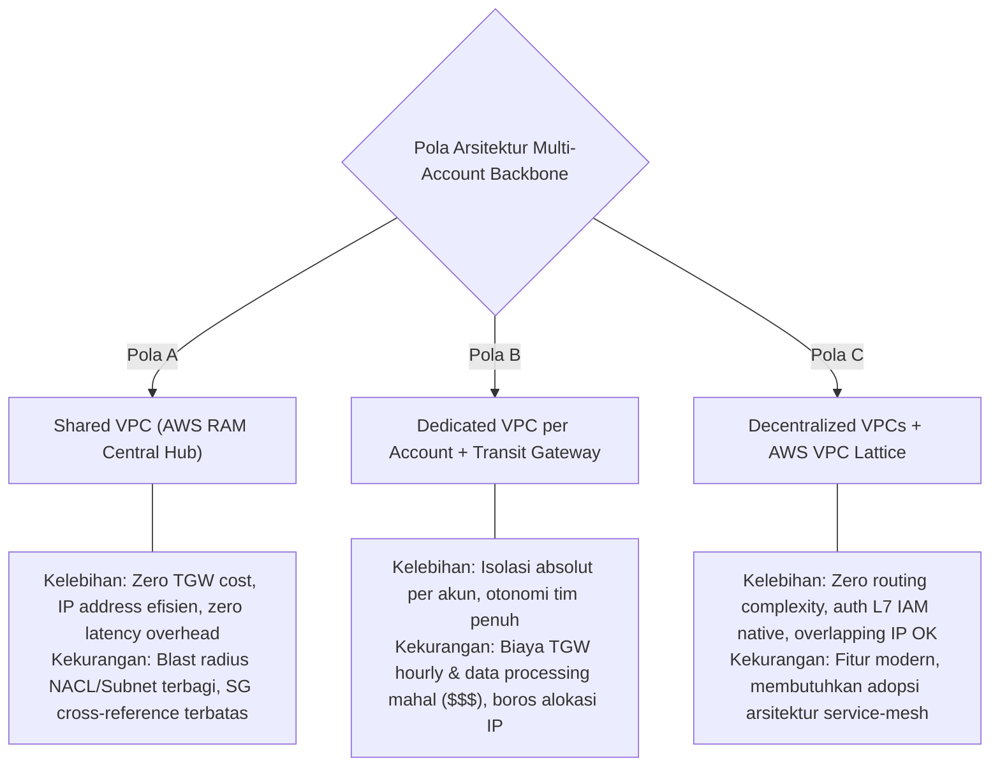

# Modul 07: AWS VPC Architecture, Multi-CIDR Strategies & Resource Access Manager (RAM) Sharing

<BadgeLabel type="sme" text="Level: Principal / SME" /> <BadgeLabel type="aws" text="Multi-CIDR VPC & AWS RAM" /> <BadgeLabel type="arch" text="Enterprise Multi-Account Backbone" />

Dalam organisasi berskala enterprise dengan ratusan akun AWS (*multi-account landing zone*), perdebatan arsitektural klasik selalu berkisar pada: **apakah setiap akun harus memiliki VPC sendiri yang saling dihubungkan via Transit Gateway, ataukah menggunakan pola Shared VPC berbasis AWS Resource Access Manager (RAM)?**

Kesalahan dalam memilih pola arsitektur ini berdampak langsung pada tagihan *cross-AZ data transfer*, kompleksitas *Transit Gateway route tables*, dan fragmentasi *IP address space*. Modul ini membedah arsitektur VPC multi-CIDR dan pola *VPC Subnet Sharing* terdistribusi dari level underlay routing hingga blueprint otomasi Terraform.

---

## Layer 1: VPC Architectural Foundations & Multi-CIDR Theory

### 1.1 VPC sebagai Batas Isolasi Logis L3

Virtual Private Cloud (VPC) adalah partisi virtual jaringan terisolasi di atas *AWS software-defined infrastructure*.



### 1.2 Aturan Baku & Validasi Secondary CIDR Blocks

Setiap VPC diawali dengan 1 Primary IPv4 CIDR Block (`/16` s/d `/28`). Jika kapasitas IP habis, Anda dapat mengasosiasikan hingga **4 Secondary CIDR Blocks**:

1. **Non-Overlapping Rule**: Secondary CIDR tidak boleh tumpang tindih dengan CIDR yang sudah ada di dalam VPC, atau dengan CIDR pada VPC lain yang terhubung via *VPC Peering* aktif.
2. **Immutability of CIDR Size**: Ukuran blok CIDR yang telah di-attach tidak dapat diubah ukurannya (*non-resizable*). Untuk mengubah ukuran, blok harus di-detach (setelah semua subnet di dalamnya dihapus) lalu di-attach kembali dengan ukuran baru.
3. **Pilihan Ruang Alamat**:
   - RFC 1918 Private Ranges (`10.0.0.0/8`, `172.16.0.0/12`, `192.168.0.0/16`).
   - RFC 6598 Carrier-Grade NAT (`100.64.0.0/10`).
   - BYOIP (Bring Your Own IP) Public IPv4 Range.
   - Amazon-provided `/56` IPv6 CIDR Block.

::: tip STANDAR BEST PRACTICE INDUSTRI (SME RECOMMENDATION)
Terapkan arsitektur **VPC Multi-CIDR Dual-Scope**: gunakan blok RFC 1918 (`10.100.0.0/16`) khusus untuk *Node/Host Infrastructure, Load Balancers, dan Databases*, serta blok RFC 6598 (`100.64.0.0/16`) khusus untuk *Container / EKS Pod Data Plane*. Pola ini menjaga integrasi hybrid Direct Connect tetap bersih tanpa ancaman kehabisan IP privat korporasi.
:::

---

## Layer 2: AWS Distributed Underlay & Hyperplane Internals

### 2.1 AWS RAM (Resource Access Manager) Subnet Sharing Underlay

Dalam model **Shared VPC**, akun sentral jaringan (*Network Hub Account*) membuat VPC dan subnet, lalu membagikan subnet tersebut ke akun-akun aplikasi (*Participant Accounts*) melalui AWS RAM:



#### Pemisahan Kewenangan (Separation of Concerns):
- **Network Owner Account**: Mengontrol penuh VPC, Subnetting, CIDR association, Route Tables, Internet Gateways, NAT Gateways, Transit Gateway attachments, VPC Endpoints, dan Network ACLs.
- **Participant Accounts**: Mengontrol *compute resources* (EC2, EKS, RDS) dan **Security Groups** lokal di dalam akun masing-masing.
- **Isolasi Security Group**: Security Groups bersifat *account-scoped*. Participant Account A tidak dapat melihat atau mereferensikan Security Group milik Participant Account B secara langsung, kecuali menggunakan VPC Lattice atau deklarasi IP CIDR.

---

## Layer 3: AWS Resource Deep-Dive & Hard Limits

### 3.1 Availability Zone Mapping Discrepancy (AZ Name vs AZ ID)

Setiap akun AWS memiliki pemetaan acak (*randomized mapping*) antara nama logis AZ (`ap-southeast-1a`) dan fasilitas fisik datacenter:

```
Akun Network Hub  : "ap-southeast-1a" ──> Physical Datacenter "apse1-az1"
Akun Participant A: "ap-southeast-1a" ──> Physical Datacenter "apse1-az2" (MISMATCH!)
```



::: tip STANDAR BEST PRACTICE INDUSTRI (SME RECOMMENDATION)
Dalam arsitektur *Shared VPC* dan multi-account, **JANGAN PERNAH** mereferensikan Availability Zone menggunakan string nama (`availability_zone = "ap-southeast-1a"`). Selalu gunakan **Availability Zone ID fisik** (`availability_zone_id = "apse1-az1"`) pada kode Terraform untuk menjamin penempatan workload berada di ruang fisik yang sama, mengeliminasi latensi *cross-datacenter* dan biaya *Inter-AZ Data Transfer* ($0.01/GB).
:::

### 3.2 Kuota & Hard Limits VPC

| Parameter Resource | Default Quota | Max Limit | Karakteristik Engineering |
| :--- | :--- | :--- | :--- |
| **VPCs per Region per Account** | 5 | 100 (Adjustable) | Pembatasan partisi VPC. |
| **IPv4 CIDR blocks per VPC** | 5 (1 Primary + 4 Sec) | 5 (Hard Limit) | Total alokasi subnet dibatasi 5 blok. |
| **Subnets per VPC** | 200 | 1,000 (Adjustable) | Jumlah partisi subnet tier. |
| **Route Tables per VPC** | 200 | 500 (Adjustable) | Pengelompokan kebijakan routing. |
| **Routes per Route Table** | 50 | 100 (Adjustable) | Penambahan rute di atas 50 dapat mempengaruhi performa propagasi BGP. |

---

## Layer 4: Hop-by-Hop Packet Walkthrough & Flow Lifecycle

Diagram sequence berikut memvalidasi komunikasi antar instans di akun yang berbeda di dalam sebuah **Shared VPC**:



---

## Layer 5: Production Terraform IaC & CLI Blueprints

### 5.1 Terraform Blueprint: Central Shared VPC dengan AWS RAM

```hcl
# shared-vpc-hub.tf (Dijalankan di Akun Central Network)
terraform {
  required_version = ">= 1.5.0"
  required_providers {
    aws = {
      source  = "hashicorp/aws"
      version = "~> 5.0"
    }
  }
}

# 1. Enterprise VPC dengan Primary dan Secondary CIDR
resource "aws_vpc" "shared_vpc" {
  cidr_block           = "10.100.0.0/16"
  enable_dns_hostnames = true
  enable_dns_support   = true

  tags = {
    Name        = "vpc-shared-enterprise-prod"
    Environment = "Production"
  }
}

resource "aws_vpc_ipv4_cidr_block_association" "secondary_eks" {
  vpc_id     = aws_vpc.shared_vpc.id
  cidr_block = "100.64.0.0/16"
}

# 2. Subnet dengan Explicit Availability Zone ID (Bukan AZ Name!)
resource "aws_subnet" "shared_app_az1" {
  vpc_id               = aws_vpc.shared_vpc.id
  cidr_block           = "10.100.1.0/24"
  availability_zone_id = "apse1-az1" # Immutable Physical ID

  tags = {
    Name = "snet-shared-app-apse1-az1"
    Tier = "Application"
  }
}

resource "aws_subnet" "shared_app_az2" {
  vpc_id               = aws_vpc.shared_vpc.id
  cidr_block           = "10.100.2.0/24"
  availability_zone_id = "apse1-az2" # Immutable Physical ID

  tags = {
    Name = "snet-shared-app-apse1-az2"
    Tier = "Application"
  }
}

# 3. AWS RAM Resource Share ke Seluruh Organisasi
resource "aws_ram_resource_share" "vpc_share" {
  name                      = "ram-share-enterprise-subnets"
  allow_external_principals = false

  tags = {
    Environment = "Production"
  }
}

# Hubungkan Subnet ke RAM
resource "aws_ram_resource_association" "subnet_assoc_az1" {
  resource_arn       = aws_subnet.shared_app_az1.arn
  resource_share_arn = aws_ram_resource_share.vpc_share.arn
}

resource "aws_ram_resource_association" "subnet_assoc_az2" {
  resource_arn       = aws_subnet.shared_app_az2.arn
  resource_share_arn = aws_ram_resource_share.vpc_share.arn
}

# Bagikan ke AWS Organization Principal
resource "aws_ram_principal_association" "org_assoc" {
  principal          = "arn:aws:organizations::123456789012:organization/o-abcdef1234"
  resource_share_arn = aws_ram_resource_share.vpc_share.arn
}
```

---

## Layer 6: Failure Modes, Edge Cases & SEV-1 Troubleshooting Matrix

### 6.1 Production SEV-1 Incident Matrix

| Gejala Insiden (*Symptoms*) | *Root Cause Analysis* (RCA) | Perintah Verifikasi & Diagnosa CLI | Langkah Mitigasi & Resolusi |
| :--- | :--- | :--- | :--- |
| **Lonjakan tagihan Inter-AZ Data Transfer ($$$)** pada aplikasi mikroservis di Shared VPC. | AZ Name Mismatch: Subnet diprovisikan menggunakan string `ap-southeast-1a` yang memetakan ke AZ ID fisik berbeda antar akun. | `aws ec2 describe-availability-zones --query "AvailabilityZones[*].[ZoneName,ZoneId]"` | Migrasikan subnet untuk selalu menggunakan referensi `availability_zone_id`. |
| **Participant Account tidak dapat mendeploy EC2** pada Shared Subnet. | AWS RAM share belum diterima atau asosiasi principal OU pada AWS Organizations gagal. | `aws ram get-resource-shares --resource-owner OTHER-ACCOUNTS` | Verifikasi status RAM Resource Share di console Participant Account dan accept invitation. |
| **Security Group Rule cross-account gagal di-save** (`InvalidParameterValue`). | Security Group di akun Participant A mencoba mereferensikan SG ID akun Participant B secara langsung (tidak didukung di Shared VPC). | `aws ec2 describe-security-group-rules --filter "Name=group-id,Values=<id>"` | Referensikan blok CIDR `/32` spesifik atau gunakan AWS VPC Lattice untuk abstraksi service-to-service. |
| **Secondary CIDR tidak dapat ditambahkan ke VPC**. | Blok Secondary CIDR yang diajukan beririsan (*overlaps*) dengan rute statis pada Route Table atau peering yang sedang aktif. | `aws ec2 describe-vpc-peering-connections` & `aws ec2 describe-route-tables` | Pilih blok CIDR yang sepenuhnya unik dan belum terdaftar di tabel routing VPC mana pun. |

---

## Layer 7: Principal Architect Tradeoff Framework



### Matriks Keputusan Arsitektur: Pola Jaringan Multi-Account

| Dimensi Arsitektural | Shared VPC (AWS RAM) | Dedicated VPC + Transit Gateway | Decentralized + VPC Lattice |
| :--- | :--- | :--- | :--- |
| **Biaya Jaringan (Network Cost)** | **Terendah (Tanpa biaya TGW)** | Tertinggi ($0.05/hr + $0.02/GB TGW)| Sedang (Per-request Lattice pricing)|
| **Latensi Antar-Layanan** | **Terendah (< 1 ms Wire-Speed)**| Menengah (+2-3 ms TGW Hop) | Rendah (Managed L7 Proxy) |
| **Efisiensi Alokasi Alamat IP** | **Sangat Tinggi (Shared Pools)** | Sangat Rendah (Fragmentasi CIDR) | **Maksimum (Overlapping CIDR OK)** |
| **Otonomi Tim & Blast Radius** | Sedang (Terkoneksi di 1 VPC) | **Maksimum (Isolasi Total per VPC)**| **Tinggi (Service-Level Boundary)** |
| **Rekomendasi Arsitektur** | **Standar Enterprise Core Workloads**| Sandbox & Third-Party Vendors | Microservices Modern / Kube-Mesh |
