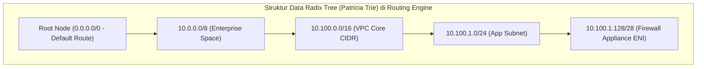
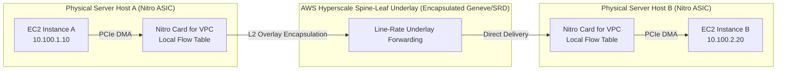
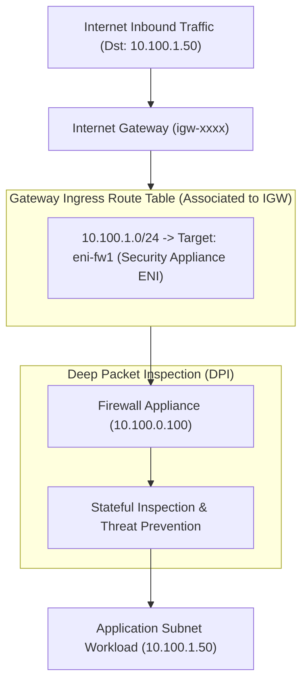

# Modul 08: Route Tables, Longest Prefix Match (LPM) & Ingress Edge Routing

<BadgeLabel type="sme" text="Level: Principal / SME" /> <BadgeLabel type="rfc" text="RFC 4632 / RFC 1812" /> <BadgeLabel type="aws" text="AWS VPC Core Routing" />

Di dalam arsitektur cloud enterprise, **VPC Route Table** bukan sekadar tabel statis sederhana, melainkan representasi logis dari pipeline evaluasi paket terdistribusi yang dieksekusi langsung pada perangkat keras **AWS Nitro Card for VPC**. Memahami hierarki resolusi rute, resolusi konflik, batas kuota, dan arsitektur *Ingress Edge Routing* adalah keahlian fundamental seorang Principal Cloud Network Architect.

---

## 🧪 Interactive Lab: AWS Hybrid Route Table Resolver Sandbox

Uji skenario resolusi routing dinamis berbasis algoritma *Longest Prefix Match (LPM)* dan evaluasi konflik rute statis vs terpropagasi di bawah ini:

<ClientOnly>
  <AwsNetworkSandbox />
</ClientOnly>

---

## 1. Layer 1: Protocol Mechanics & RFC Theory

### A. Algoritma Longest Prefix Match (LPM) & Struktur Data Radix Tree
Berdasarkan **RFC 1812 (Requirements for IP Version 4 Routers)** dan **RFC 4632 (CIDR)**, ketika sebuah router menerima paket dengan alamat IP tujuan $D$, router harus mencari entri tabel rute dengan prefiks jaringan yang cocok ($D \ \& \ \text{Mask} == \text{Prefix}$) dan memilih entri dengan **panjang subnet mask terpanjang** (spesifisitas tertinggi).

$$\text{Match Priority} = \max(\text{Prefix Length } L) \quad \text{where } (D \ \& \ \text{Netmask}(L)) = \text{Prefix}(L)$$



Secara komputasi, router perangkat keras menggunakan **TCAM (Ternary Content-Addressable Memory)** yang mengevaluasi seluruh rute dalam satu siklus clock ($O(1)$). Namun, pada perangkat lunak virtualisasi SDN dan hypervisor Nitro, lookup tabel rute diimplementasikan menggunakan algoritma **Tree Bitmap / Multi-bit Radix Tree** dengan kompleksitas waktu pencarian $O(k/w)$ (di mana $k = 32$ bit untuk IPv4 dan $w$ adalah lebar stride bit).

### B. Hierarki Prioritas Konflik Rute (Route Precedence)
Jika terdapat beberapa rute dengan panjang prefiks yang persis sama, AWS VPC Route Table menerapkan aturan deterministik berikut:

```
+-------------------------------------------------------------------------+
|                  ATURAN PRESEDENSI ROUTE TABLE AWS VPC                  |
+-------------------------------------------------------------------------+
|  Tingkat 1: Longest Prefix Match (Prefiks /32 > /28 > /24 > /16 > /0)   |
+-------------------------------------------------------------------------+
|  Tingkat 2: Jika Prefiks Sama -> Static Route SELALU Menang atas        |
|             Propagated Route (VGW / Direct Connect / Site-to-Site VPN)  |
+-------------------------------------------------------------------------+
|  Tingkat 3: Jika Prefiks Sama Antar Propagated Routes (VGW BGP/Static):  |
|             1. Direct Connect BGP Routes (AS-Path terpendek)            |
|             2. Direct Connect Static Routes                             |
|             3. Site-to-Site VPN BGP Routes                              |
|             4. Site-to-Site VPN Static Routes                           |
+-------------------------------------------------------------------------+
```

::: tip STANDAR BEST PRACTICE INDUSTRI (SME RECOMMENDATION)
Jangan pernah bergantung pada asumsi bahwa rute BGP dinamis akan menimpa kesalahan konfigurasi rute statis. Rute statis manual di VPC Route Table memiliki prioritas mutlak di atas rute terpropagasi (*propagated routes*). Selalu gunakan *Prefix List* terpusat yang dikelola via AWS RAM untuk mencegah inkonsistensi rute manual.
:::

---

## 2. Layer 2: AWS Distributed Underlay & Hyperplane Internals

Di dalam arsitektur AWS, tidak ada "router box" terpusat di dalam VPC Anda. Routing VPC sepenuhnya terdistribusi (*fully distributed forwarding engine*):



### A. Sifat Abadi "Local Route" (*Local Route Immutability*)
Setiap kali VPC dibuat dengan Primary CIDR (dan Secondary CIDR tambahan), AWS secara otomatis menyuntikkan rute `local` ke seluruh Route Table di VPC tersebut (contoh: `10.100.0.0/16 -> local`).
- Rute `local` ini **tidak dapat dihapus, diubah targetnya, atau dimodifikasi**.
- Nitro Card mengevaluasi rute `local` langsung di level hardware microcode untuk pengiriman *East-West* antar host tanpa melalui gateway perantara.
- Bahkan jika Anda menambahkan rute statis yang lebih spesifik (misalnya `10.100.1.0/24 -> tgw-xxx`), AWS VPC **akan menolak** konfigurasi tersebut jika berada di dalam cakupan CIDR lokal VPC yang sama, kecuali fitur *More Specific Local Route Interception* diaktifkan melalui Gateway Ingress Routing.

### B. Gateway Ingress Routing Architecture
*Ingress Edge Routing* memungkinkan asosiasi Route Table khusus ke **Internet Gateway (IGW)** atau **Virtual Private Gateway (VGW)**. Fitur ini memungkinkan Anda membelokkan (*steering/intercepting*) lalu lintas masuk sebelum mencapai subnet tujuan, mengarahkannya ke appliance keamanan (seperti Palo Alto, Fortinet, atau Suricata IDS/IPS):



---

## 3. Layer 3: AWS Resource Deep-Dive & Hard Limits

### A. Klasifikasi Tipe Route Table
1. **Main Route Table**: Route table default yang otomatis diasosiasikan ke subnet baru jika subnet tersebut tidak secara eksplisit diasosiasikan ke custom route table.
2. **Custom Subnet Route Table**: Route table yang diasosiasikan secara eksplisit ke satu atau lebih subnet (Public, Private, Isolated, atau Transit).
3. **Gateway Route Table (Edge Table)**: Route table yang diasosiasikan langsung ke *Internet Gateway (IGW)* atau *Virtual Private Gateway (VGW)* untuk melakukan Ingress traffic redirection.

### B. Taksonomi Target Routing VPC
| Tipe Target | Awalan Resource ID | Contoh Use Case | Dukungan Prefix List? |
| :--- | :--- | :--- | :--- |
| **Local** | `local` | Komunikasi intra-VPC internal | Otomatis |
| **Internet Gateway** | `igw-xxxxxxxx` | Akses internet langsung (Public Subnet) | Tidak |
| **NAT Gateway** | `nat-xxxxxxxx` | Akses internet keluar terkelola (Private Subnet) | Tidak |
| **Transit Gateway** | `tgw-xxxxxxxx` | Hub-and-spoke backbone inter-VPC / On-Prem | Ya |
| **VPC Peering** | `pcx-xxxxxxxx` | Interkoneksi point-to-point tanpa hop latency | Ya |
| **Gateway Load Balancer Endpoint** | `vpce-xxxxxxxx` | Inline transparent firewall inspection | Ya |
| **Network Interface (ENI)** | `eni-xxxxxxxx` | Virtual router, self-hosted NAT, legacy NGFW | Ya |
| **Egress-Only IGW** | `eigw-xxxxxxxx` | Akses keluar IPv6 khusus | Tidak |
| **Virtual Private Gateway** | `vgw-xxxxxxxx` | Direct Connect / VPN klasik | Tidak |

### C. Kuota & Batasan Keras (*Hard Limits*)
- **Maksimum Route Tables per VPC**: 200 (Default), dapat dinaikkan hingga 1,000 via Quota Increase.
- **Maksimum Static Routes per Route Table**: 50 (Default), dapat dinaikkan hingga **1,000** (namun dapat memengaruhi waktu konvergensi propagasi).
- **Maksimum Propagated BGP Routes per Route Table**: **100** (Batas Keras / Hard Limit tidak dapat dinaikkan).
- **Maksimum Gateway Route Tables per VPC**: 1 per IGW dan 1 per VGW.

::: tip STANDAR BEST PRACTICE INDUSTRI (SME RECOMMENDATION)
Selalu biarkan **Main Route Table** dalam kondisi steril dan terisolasi (hanya berisi rute default `local` tanpa `0.0.0.0/0`). Asosiasikan setiap subnet baru ke Custom Route Table secara eksplisit. Hal ini mencegah subnet baru secara tidak sengaja mendapatkan akses Internet terbuka jika engineer lupa mengonfigurasi asosiasi rute.
:::

---

## 4. Layer 4: Hop-by-Hop Packet Walkthrough & Flow Lifecycle

Diagram di bawah ini mengilustrasikan siklus hidup paket yang masuk dari Internet menuju Workload Aplikasi dengan inspeksi inline *Ingress Edge Routing*:

```
[Inbound Internet Client]
       │ (1) Dst IP: 198.51.100.50 (Elastic IP)
       ▼
[AWS VPC Border / Internet Gateway (igw-01)]
       │ (2) 1:1 NAT Translation: 198.51.100.50 -> 10.100.1.50 (Private IP)
       │ (3) Evaluasi Gateway Route Table (Attached to IGW):
       │     Lookup 10.100.1.50 -> Matches: 10.100.1.0/24 -> Target: eni-0011223344 (Firewall)
       ▼
[Firewall Instance Subnet - eni-0011223344 (10.100.0.10)]
       │ (4) Ingress Packet diterima oleh Kernel Firewall / DPDK Driver
       │ (5) Source/Destination Check dimatikan (Src/Dst Check = Disabled)
       │ (6) Deep Packet Inspection (DPI) & Threat Detection (Passed)
       │ (7) Egress Forwarding via Firewall Egress Route Table:
       │     Lookup 10.100.1.50 -> Matches: 10.100.0.0/16 (Local Route)
       ▼
[Nitro Card Host Target Workload]
       │ (8) L2 Delivery via Nitro Underlay
       ▼
[Target Application EC2 (10.100.1.50:443)]
       │ (9) Workload memproses TCP SYN dan membuat balasan TCP SYN-ACK
       │ (10) App Subnet Route Table Lookup (Dst: Internet Client IP):
       │      Matches 0.0.0.0/0 -> Target: eni-0011223344 (Firewall Egress ENI)
       ▼
[Firewall Appliance (Egress Path)]
       │ (11) Stateful Conntrack Lookup (Session Matched)
       │ (12) Forward ke IGW via Subnet Route Table (0.0.0.0/0 -> igw-01)
       ▼
[Internet Gateway] -> [Client Internet] (Koneksi Simetris Terjaga)
```

---

## 5. Layer 5: Production Terraform IaC & CLI Implementation Blueprints

Blueprint Terraform enterprise berikut mengimplementasikan arsitektur VPC Ingress Routing dengan Dedicated Firewall Subnet dan Edge IGW Association:

```hcl
# main.tf - Production Ingress Edge Routing Blueprint

terraform {
  required_version = ">= 1.6.0"
  required_providers {
    aws = {
      source  = "hashicorp/aws"
      version = "~> 5.0"
    }
  }
}

variable "vpc_cidr" {
  type    = string
  default = "10.100.0.0/16"
}

# 1. VPC Core
resource "aws_vpc" "enterprise_vpc" {
  cidr_block           = var.vpc_cidr
  enable_dns_hostnames = true
  enable_dns_support   = true

  tags = {
    Name        = "vpc-enterprise-production"
    Environment = "Production"
    ManagedBy   = "Terraform"
  }
}

# 2. Subnets
resource "aws_subnet" "security_subnet" {
  vpc_id            = aws_vpc.enterprise_vpc.id
  cidr_block        = "10.100.0.0/24"
  availability_zone = "ap-southeast-3a"

  tags = { Name = "sbn-security-ap-southeast-3a" }
}

resource "aws_subnet" "application_subnet" {
  vpc_id            = aws_vpc.enterprise_vpc.id
  cidr_block        = "10.100.1.0/24"
  availability_zone = "ap-southeast-3a"

  tags = { Name = "sbn-app-ap-southeast-3a" }
}

# 3. Internet Gateway
resource "aws_internet_gateway" "igw" {
  vpc_id = aws_vpc.enterprise_vpc.id
  tags   = { Name = "igw-enterprise-production" }
}

# 4. Security Appliance ENI (Firewall)
resource "aws_security_group" "firewall_sg" {
  name        = "sg-firewall-inline"
  description = "Allow all inspection traffic to firewall appliance"
  vpc_id      = aws_vpc.enterprise_vpc.id

  ingress {
    from_port   = 0
    to_port     = 0
    protocol    = "-1"
    cidr_blocks = ["0.0.0.0/0"]
  }

  egress {
    from_port   = 0
    to_port     = 0
    protocol    = "-1"
    cidr_blocks = ["0.0.0.0/0"]
  }
}

resource "aws_network_interface" "firewall_eni" {
  subnet_id         = aws_subnet.security_subnet.id
  private_ips       = ["10.100.0.100"]
  security_groups   = [aws_security_group.firewall_sg.id]
  source_dest_check = false # KRITIKAL: Wajib false untuk appliance router/firewall

  tags = { Name = "eni-ngfw-inline-inspector" }
}

# 5. Gateway Ingress Route Table (Attached to IGW)
resource "aws_route_table" "igw_ingress_rt" {
  vpc_id = aws_vpc.enterprise_vpc.id

  route {
    cidr_block           = aws_subnet.application_subnet.cidr_block
    network_interface_id = aws_network_interface.firewall_eni.id
  }

  tags = { Name = "rt-igw-edge-ingress" }
}

resource "aws_route_table_association" "igw_edge_assoc" {
  gateway_id     = aws_internet_gateway.igw.id
  route_table_id = aws_route_table.igw_ingress_rt.id
}

# 6. Application Subnet Route Table (Routes all outbound via Firewall)
resource "aws_route_table" "app_rt" {
  vpc_id = aws_vpc.enterprise_vpc.id

  route {
    cidr_block           = "0.0.0.0/0"
    network_interface_id = aws_network_interface.firewall_eni.id
  }

  tags = { Name = "rt-app-workload" }
}

resource "aws_route_table_association" "app_assoc" {
  subnet_id      = aws_subnet.application_subnet.id
  route_table_id = aws_route_table.app_rt.id
}

# 7. Security Subnet Route Table (Direct default route to IGW)
resource "aws_route_table" "security_rt" {
  vpc_id = aws_vpc.enterprise_vpc.id

  route {
    cidr_block = "0.0.0.0/0"
    gateway_id = aws_internet_gateway.igw.id
  }

  tags = { Name = "rt-security-dmz" }
}

resource "aws_route_table_association" "security_assoc" {
  subnet_id      = aws_subnet.security_subnet.id
  route_table_id = aws_route_table.security_rt.id
}
```

### Verifikasi via AWS CLI:
```bash
# 1. Periksa asosiasi Edge Gateway Route Table pada IGW
aws ec2 describe-route-tables \
  --filters "Name=association.gateway-id,Values=igw-xxxxxxxxxxxxxxxxx" \
  --query "RouteTables[*].{RouteTableId:RouteTableId,Routes:Routes}" \
  --output table

# 2. Cek status Source/Dest Check pada ENI Firewall
aws ec2 describe-network-interfaces \
  --network-interface-ids eni-00112233445566778 \
  --query "NetworkInterfaces[*].{ID:NetworkInterfaceId,SourceDestCheck:SourceDestCheck}"
```

---

## 6. Layer 6: Failure Modes, Edge Cases & SEV-1 Troubleshooting Matrix

| Gejala Masalah (*Symptoms*) | Akar Masalah (*Root Cause Analysis*) | Perintah Investigasi Triage CLI | Solusi Definitif (*Fix*) |
| :--- | :--- | :--- | :--- |
| Paket masuk ke subnet aplikasi drop seketika setelah implementasi IGW Route Table | `source_dest_check` pada Firewall ENI masih aktif (`true`), sehingga Nitro menjatuhkan paket yang bukan ditujukan ke IP ENI tersebut. | `aws ec2 describe-network-interfaces --network-interface-ids <eni-id> --query "NetworkInterfaces[0].SourceDestCheck"` | Nonaktifkan pengecekan: `aws ec2 modify-network-interface-attribute --network-interface-id <eni-id> --no-source-dest-check` |
| Rute menampilkan status `blackhole` di AWS Console | Target resource (ENI, Peering, atau TGW attachment) telah dihapus atau di-detach, namun rutenya masih tertinggal di Route Table. | `aws ec2 describe-route-tables --filters "Name=route.state,Values=blackhole"` | Hapus rute mati atau arahkan ke target aktif yang baru. |
| Ingress traffic melewati firewall, namun respons balik (*egress*) langsung bypass ke IGW (Asymmetric Routing) | Route Table pada subnet aplikasi memiliki rute `0.0.0.0/0 -> igw-xxx`, bukan `0.0.0.0/0 -> eni-firewall`. | `aws ec2 describe-route-tables --route-table-ids <app-rt-id>` | Update default route subnet aplikasi agar menunjuk ke ENI Firewall. |
| Kuota `Routes per route table exceeded` saat provisioning Terraform | Penambahan ratusan rute statis spesifik melebihi batas default 50 rute. | `aws service-quotas get-service-quota --service-code vpc --quota-code L-93826CBD` | Request Service Quota increase ke AWS Support (maks 1,000) atau lakukan *Route Summarization*. |

---

## 7. Layer 7: Principal Architect Tradeoff Framework

Dalam merancang perutean inspeksi keamanan enterprise, tentukan pendekatan berdasarkan matriks komparasi arsitektural berikut:

```
+---------------------------------------------------------------------------------------------------+
|                            MATRIKS ARSITEKTUR INSPEKSI TRAFFIC VPC                                |
+-----------------------+-----------------------+--------------------------+------------------------+
| Parameter Evaluasi    | Gateway Ingress Route | Transit Gateway Hub      | Gateway Load Balancer  |
+-----------------------+-----------------------+--------------------------+------------------------+
| Throughput Maksimum   | Line-rate ENI (50G+)  | 50 Gbps per AZ attach    | 100 Gbps+ (Scalable)   |
| Latensi Overhead      | ~0.1 ms (Terendah)    | ~1.0 - 2.5 ms (TGW hop)  | ~0.5 - 1.2 ms (GENEVE) |
| Skalabilitas HA       | Manual DNS / Script   | Multi-AZ Active/Standby  | Horizontal Auto-Scale  |
| Kompleksitas Operasi  | Tinggi (Banyak RT)    | Terpusat (Hub-and-Spoke) | Sangat Terstruktur     |
| Biaya Infrastruktur   | Rendah (Biaya EC2)    | Jam TGW + Data Charge    | Jam GWLB + Data Charge |
| Blast Radius          | Lokal per-VPC         | Seluruh Spoke Terhubung  | Fleksibel Multi-VPC    |
+-----------------------+-----------------------+--------------------------+------------------------+
```

### Rekomendasi Keputusan SME:
1. Gunakan **Gateway Ingress Routing (Module 08)** untuk *Single Ingress VPC DMZ* mandiri yang membutuhkan latensi sub-milidetik mutlak dan biaya transfer per-GB minimal.
2. Gunakan **Gateway Load Balancer (Module 14)** untuk arsitektur keamanan modern skala besar yang membutuhkan *transparent multi-AZ autoscaling* tanpa modifikasi packet header IP.
3. Gunakan **Transit Gateway Central Inspection (Module 20 & 21)** untuk *East-West inter-VPC* dan *Hybrid On-Premises* packet inspection.
