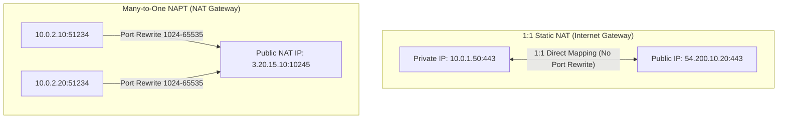
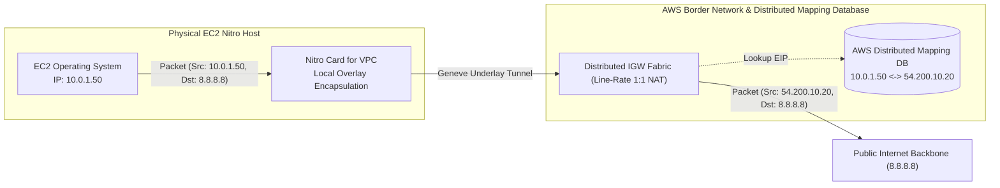

# Modul 09: Internet Gateway (IGW), Egress-Only IGW & 1:1 NAT Mechanics

<BadgeLabel type="sme" text="Level: Principal / SME" /> <BadgeLabel type="rfc" text="RFC 3022 / RFC 4862 / RFC 791" /> <BadgeLabel type="aws" text="AWS Edge Gateways" />

Salah satu kesalahpahaman terbesar dalam *cloud networking* adalah menganggap **Internet Gateway (IGW)** sebagai sebuah router fisik, virtual appliance, atau bottleneck bandwidth yang terpusat. Dalam arsitektur AWS, IGW adalah **matriks translasi perangkat lunak terdistribusi tanpa batas bandwidth (*horizontally scaled, highly available SDN translation matrix*)**.

---

## 1. Layer 1: Protocol Mechanics & RFC Theory

### A. 1:1 Static NAT vs NAPT / PAT (RFC 3022)
Berdasarkan **RFC 3022 (Network Address Translator)**, terdapat dua pendekatan translasi alamat jaringan:
1. **1:1 Static NAT (Two-Way Stateless/State-preserving Translation)**:
   - Satu alamat IPv4 privat dipetakan secara eksklusif ke satu alamat IPv4 publik.
   - Tidak ada modifikasi pada nomor port Layer 4 (*TCP/UDP source port* tidak dimodifikasi).
   - Memungkinkan komunikasi dua arah: *Outbound Initiated* dan *Inbound Initiated*.
2. **NAPT / PAT (Network Address Port Translation / Many-to-One)**:
   - Banyak alamat IPv4 privat berbagi satu atau sedikit alamat IPv4 publik.
   - Router memodifikasi *Layer 4 Source Port* untuk melacak sesi koneksi di tabel conntrack (*stateful*).
   - Hanya mendukung *Outbound Initiated Connection*.



### B. IPv6 SLAAC & Egress-Only IGW (RFC 4862 & RFC 4291)
Pada protokol IPv6:
- Setiap perangkat menerima alamat **Globally Unique IPv6 Address (GUA)** (cakupan `2000::/3`) via *Stateless Address Autoconfiguration (SLAAC)* berdasarkan **RFC 4862**.
- Tidak ada kebutuhan NAT pada IPv6 karena ketersediaan ruang alamat $2^{128}$.
- **Egress-Only Internet Gateway (EIGW)** bertindak sebagai firewall *stateful egress*: mengizinkan paket keluar (*Outbound IPv6*) dan menerima paket respons (*Established Return Traffic*), namun secara mutlak **menjatuhkan paket inisiasi koneksi dari Internet luar (*Inbound TCP SYN / UDP packets*)**.

---

## 2. Layer 2: AWS Distributed Underlay & Hyperplane Internals



### A. Mengapa IGW Memiliki "Zero Bandwidth Bottleneck"?
- IGW tidak melewatkan paket melalui satu server gateway fisik terpusat.
- Ketika paket keluar dari Nitro Card instance menuju default route `0.0.0.0/0 -> igw-xxxx`, paket dienkapsulasi melintasi *Spine-Leaf Clos Fabric* AWS langsung menuju *Border Routers*.
- Translasi 1:1 NAT dieksekusi secara terdistribusi di level router perbatasan AWS menggunakan lookup *Distributed Key-Value Mapping Database*.
- **Throughput IGW sama dengan total agregat bandwidth seluruh EC2 instance di VPC tersebut** (dapat mencapai puluhan Terabit per detik tanpa bottleneck).

### B. Rekalkulasi TCP/IP Checksum pada 1:1 NAT
Ketika IGW menimpa Source IP dari `10.0.1.50` menjadi `54.200.10.20`, *IP Header Checksum* (pada IPv4) dan *TCP Pseudo-Header Checksum* menjadi tidak valid. Perangkat lunak terdistribusi IGW melakukan rekalkulasi checksum secara *in-flight* pada kecepatan kawat (*wire-speed hardware offload*) sesuai formula **RFC 1624**.

---

## 3. Layer 3: AWS Resource Deep-Dive & Hard Limits

### A. Aturan Asosiasi & Batasan Keras Resource
- **Asosiasi IGW per VPC**: Tepat **1 IGW per 1 VPC**. Anda tidak dapat meng-attach 2 IGW ke 1 VPC.
- **Asosiasi Egress-Only IGW (EIGW)**: Tepat **1 EIGW per 1 VPC**.
- **Alokasi Elastic IP (EIP)**: Kuota default **5 EIP per Region per Akun** (dapat dinaikkan hingga ribuan melalui kuota request).
- **IPv6 Subnet Allocation**: Setiap VPC yang diaktifkan IPv6 akan menerima alokasi prefix `/56` dari pool global Amazon (atau BYOIPv6), dan setiap subnet menerima blok `/64` tetap (berisi $18,446,744,073,709,551,616$ alamat IP).

### B. Matriks Perbandingan: Public IPv4 vs Elastic IP vs IPv6 GUA
| Parameter | Auto-assigned Public IPv4 | Elastic IP (EIP) | IPv6 Global Address (GUA) |
| :--- | :--- | :--- | :--- |
| **Persistensi saat Stop/Start** | ❌ Berubah setelah instance restart | ✅ Tetap / Statis permanen | ✅ Tetap / Statis permanen |
| **Biaya AWS** | $0.005 / jam (~$3.65 / bulan) | $0.005 / jam (~$3.65 / bulan) | **$0.00 (Gratis)** |
| **Reverse DNS (PTR Record)** | Tidak dapat di-custom | Mendukung custom PTR | Mendukung custom PTR |
| **Kebutuhan NAT** | 1:1 NAT di IGW | 1:1 NAT di IGW | **Zero NAT (Direct End-to-End)** |

::: tip STANDAR BEST PRACTICE INDUSTRI (SME RECOMMENDATION)
Mengingat kebijakan AWS yang mengenakan biaya sebesar **$0.005 per jam per alamat IPv4 publik** (baik yang sedang terpasang maupun yang menganggur), lakukan migrasi beban kerja internal ke arsitektur **IPv6-Only Subnets** dengan **Egress-Only Internet Gateway** atau gunakan **NAT Gateway multi-AZ** untuk mengurangi pengeluaran ratusan ribu dolar per tahun pada fleet puluhan ribu node EKS/EC2.
:::

---

## 4. Layer 4: Hop-by-Hop Packet Walkthrough & Flow Lifecycle

```
[Workload EC2 - ap-southeast-3a]
  │ Private IP: 10.0.1.50 | EIP: 54.200.10.20 | Subnet: 10.0.1.0/24
  │ (1) Socket Application memanggil connect(8.8.8.8:443)
  │ (2) OS Kernel membentuk paket TCP SYN:
  │     SRC: 10.0.1.50:52410 | DST: 8.8.8.8:443
  ▼
[Nitro Card for VPC]
  │ (3) Evaluasi Security Group Outbound (Stateful Conntrack Entry dibuat)
  │ (4) Evaluasi Subnet Route Table:
  │     Lookup 8.8.8.8 -> Cocok dengan 0.0.0.0/0 -> Target: igw-0123456789abcdef0
  │ (5) Nitro membungkus paket dalam Geneve Underlay Header (AWS Spine-Leaf Fabric)
  ▼
[AWS Edge Border Fabric / IGW Translation Matrix]
  │ (6) Geneve decapsulation
  │ (7) Mapping DB Lookup: 10.0.1.50 -> EIP: 54.200.10.20
  │ (8) 1:1 NAT Header Rewrite:
  │     SRC IP diubah: 10.0.1.50  -->  54.200.10.20
  │     SRC Port tetap: 52410
  │ (9) Update IP & TCP Checksum
  ▼
[Internet Backbone] -> [Google DNS Server: 8.8.8.8]
  │
  │ (10) Google DNS membalas dengan TCP SYN-ACK:
  │      SRC: 8.8.8.8:443 | DST: 54.200.10.20:52410
  ▼
[AWS Edge Border Fabric / IGW Translation Matrix (Inbound)]
  │ (11) Mapping DB Lookup: 54.200.10.20 -> 10.0.1.50
  │ (12) 1:1 de-NAT Header Rewrite:
  │      DST IP diubah: 54.200.10.20  -->  10.0.1.50
  │ (13) Forwarding via AWS Underlay Fabric ke Nitro Host instance
  ▼
[Nitro Card for VPC (Inbound Target)]
  │ (14) Conntrack Match (Existing Outbound Session -> Ingress Auto-Allowed)
  │ (15) DMA Transfer ke OS Kernel EC2 -> TCP Handshake Established!
```

---

## 5. Layer 5: Production Terraform IaC & CLI Implementation Blueprints

Blueprint Terraform berikut mengonfigurasi arsitektur **Dual-Stack IPv4/IPv6** production lengkap dengan IGW untuk Public Subnet dan Egress-Only IGW untuk Private Subnet:

```hcl
# main.tf - Dual-Stack IPv4 & IPv6 Production VPC Blueprint

terraform {
  required_version = ">= 1.6.0"
  required_providers {
    aws = {
      source  = "hashicorp/aws"
      version = "~> 5.0"
    }
  }
}

variable "region" {
  type    = string
  default = "ap-southeast-3"
}

provider "aws" {
  region = var.region
}

# 1. Dual-Stack VPC
resource "aws_vpc" "dualstack_vpc" {
  cidr_block                       = "10.200.0.0/16"
  assign_generated_ipv6_cidr_block = true
  enable_dns_hostnames             = true
  enable_dns_support               = true

  tags = {
    Name        = "vpc-dualstack-production"
    Environment = "Production"
  }
}

# 2. Internet Gateway (IPv4 & IPv6 Ingress/Egress)
resource "aws_internet_gateway" "igw" {
  vpc_id = aws_vpc.dualstack_vpc.id
  tags   = { Name = "igw-dualstack-prod" }
}

# 3. Egress-Only Internet Gateway (IPv6 Outbound Only for Private Subnets)
resource "aws_egress_only_internet_gateway" "eigw" {
  vpc_id = aws_vpc.dualstack_vpc.id
  tags   = { Name = "eigw-ipv6-private-prod" }
}

# 4. Public Subnet (IPv4 + IPv6 Ingress/Egress)
resource "aws_subnet" "public_subnet" {
  vpc_id                          = aws_vpc.dualstack_vpc.id
  cidr_block                      = "10.200.1.0/24"
  ipv6_cidr_block                 = cidrsubnet(aws_vpc.dualstack_vpc.ipv6_cidr_block, 8, 1)
  availability_zone               = "${var.region}a"
  map_public_ip_on_launch         = true
  assign_ipv6_address_on_creation = true

  tags = { Name = "sbn-public-dualstack-${var.region}a" }
}

# 5. Private Subnet (IPv6 Outbound via EIGW, IPv4 Isolated)
resource "aws_subnet" "private_subnet" {
  vpc_id                          = aws_vpc.dualstack_vpc.id
  cidr_block                      = "10.200.10.0/24"
  ipv6_cidr_block                 = cidrsubnet(aws_vpc.dualstack_vpc.ipv6_cidr_block, 8, 10)
  availability_zone               = "${var.region}a"
  assign_ipv6_address_on_creation = true

  tags = { Name = "sbn-private-dualstack-${var.region}a" }
}

# 6. Public Route Table
resource "aws_route_table" "public_rt" {
  vpc_id = aws_vpc.dualstack_vpc.id

  route {
    cidr_block = "0.0.0.0/0"
    gateway_id = aws_internet_gateway.igw.id
  }

  route {
    ipv6_cidr_block = "::/0"
    gateway_id      = aws_internet_gateway.igw.id
  }

  tags = { Name = "rt-public-dualstack" }
}

resource "aws_route_table_association" "public_assoc" {
  subnet_id      = aws_subnet.public_subnet.id
  route_table_id = aws_route_table.public_rt.id
}

# 7. Private Route Table (IPv6 Egress Only via EIGW)
resource "aws_route_table" "private_rt" {
  vpc_id = aws_vpc.dualstack_vpc.id

  route {
    ipv6_cidr_block        = "::/0"
    egress_only_gateway_id = aws_egress_only_internet_gateway.eigw.id
  }

  tags = { Name = "rt-private-ipv6-egress" }
}

resource "aws_route_table_association" "private_assoc" {
  subnet_id      = aws_subnet.private_subnet.id
  route_table_id = aws_route_table.private_rt.id
}
```

### Verifikasi via AWS CLI:
```bash
# 1. Periksa IPv6 CIDR Block yang dialokasikan oleh AWS
aws ec2 describe-vpcs \
  --vpc-ids vpc-0123456789abcdef0 \
  --query "Vpcs[0].Ipv6CidrBlockAssociationSet[*].{Cidr:Ipv6CidrBlock,State:Ipv6CidrBlockState.State}"

# 2. Verifikasi Egress-Only Internet Gateway status
aws ec2 describe-egress-only-internet-gateways \
  --query "EgressOnlyInternetGateways[*].{ID:EgressOnlyInternetGatewayId,VpcId:Attachments[0].VpcId}"
```

---

## 6. Layer 6: Failure Modes, Edge Cases & SEV-1 Troubleshooting Matrix

| Gejala Masalah (*Symptoms*) | Akar Masalah (*Root Cause Analysis*) | Perintah Investigasi Triage CLI | Solusi Definitif (*Fix*) |
| :--- | :--- | :--- | :--- |
| EC2 memiliki Public IPv4 namun tidak bisa ping / curl ke Internet (`Connection timed out`) | Subnet Route Table tidak memiliki rute default `0.0.0.0/0 -> igw-xxxx` ATAU NACL Inbound memblokir ephemeral port `1024-65535`. | `aws ec2 describe-route-tables --filters "Name=association.subnet-id,Values=<subnet-id>"` | Tambahkan `0.0.0.0/0 -> igw-xxxx` pada route table dan buka port ephemeral pada Return NACL. |
| Workload IPv6 di Private Subnet dapat diakses secara publik oleh penyerang dari Internet luar | Subnet private dikonfigurasi dengan rute `::/0 -> igw-xxxx` (IGW standar), bukan menunjuk ke `eigw-xxxx`. | `aws ec2 describe-route-tables --route-table-ids <rt-id> --query "RouteTables[0].Routes"` | Ubah target rute `::/0` dari `igw-xxxx` menjadi `eigw-xxxx`. |
| Tagihan AWS membengkak akibat ratusan *Unattached Elastic IPs* | Alokasi EIP yang tidak di-attach ke instance dikenakan denda biaya idle ($0.005/jam/EIP). | `aws ec2 describe-addresses --filters "Name=association-id,Values=null"` | Jalankan skrip *cleanup automation* untuk menghapus seluruh EIP yang tidak terasosiasi. |
| Paket balasan dari Internet di-drop ketika instance berada di balik custom firewall OS | Reverse Path Filtering (rp_filter) pada Linux kernel membuang paket karena asymmetric routing. | `sysctl net.ipv4.conf.all.rp_filter` | Set `net.ipv4.conf.all.rp_filter = 2` (Loose mode) pada file `/etc/sysctl.conf`. |

---

## 7. Layer 7: Principal Architect Tradeoff Framework

```
+----------------------------------------------------------------------------------------------------+
|                          PERBANDINGAN ARSITEKTUR AKSES INTERNET KELUAR                             |
+----------------------+----------------------+----------------------+-------------------------------+
| Kriteria Desain      | Direct Public IP+IGW | AWS Managed NAT GW   | Dual-Stack IPv6 + EIGW        |
+----------------------+----------------------+----------------------+-------------------------------+
| Biaya IPv4 / Bulan   | $3.65 per Host       | $3.65 (1 NAT EIP)    | $0.00 (Zero IPv4 Cost)        |
| Biaya Data Transfer  | $0.00 per GB (VPC)   | $0.045 per GB Olah   | $0.00 per GB Olah             |
| Postur Keamanan      | Lemah (Direct Ingress)| Kuat (Egress Only)   | Kuat (Hardware Egress Only)   |
| Throughput Limit     | Line-Rate Instance   | 100 Gbps (Scalable)  | Line-Rate Instance (100G+)    |
| Kompleksitas Audit   | Tinggi (Banyak EIP)  | Sangat Rendah        | Rendah (Global IPv6 Space)    |
+----------------------+----------------------+----------------------+-------------------------------+
```

### Rekomendasi SME:
- Gunakan **Direct Public IP + IGW** HANYA untuk *Public Ingress Load Balancers (ALB/NLB)* dan *NAT Gateway ENIs*. Jangan pernah memasang Public IP langsung pada instance backend database atau microservice application!
- Gunakan **NAT Gateway Multi-AZ (Module 10)** untuk backend IPv4 privat standar industri.
- Adopsi **Dual-Stack IPv6 + EIGW** sebagai strategi masa depan jangka panjang untuk mengeliminasi 100% biaya pemrosesan NAT Gateway dan biaya alamat IPv4 publik.
