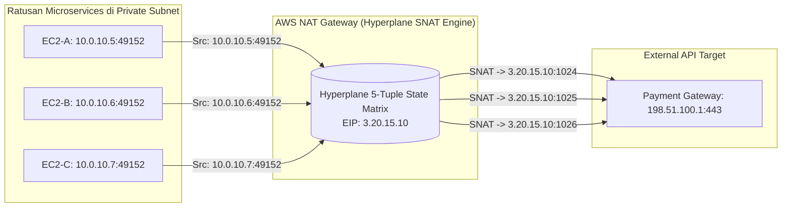
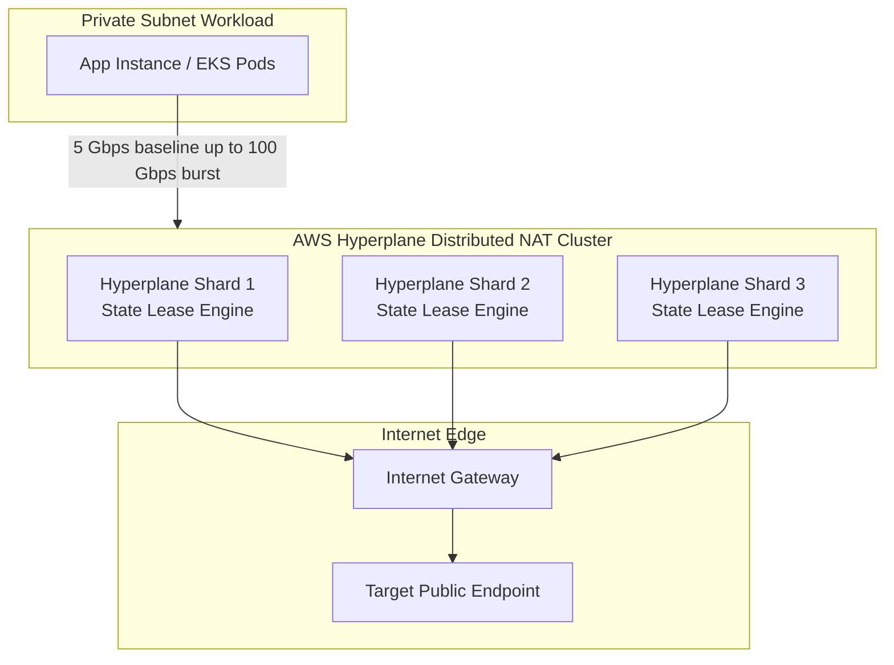

# Modul 10: AWS NAT Gateways: Public vs Private NAT & Hyperplane SNAT Engine

<BadgeLabel type="sme" text="Level: Principal / SME" /> <BadgeLabel type="rfc" text="RFC 3022 / RFC 6598" /> <BadgeLabel type="aws" text="AWS Hyperplane NAT Engine" />

**AWS NAT Gateway** adalah layanan *managed* **Network Address Translation** (<NetworkTerm term="NAT" />) berskala enterprise yang didukung oleh mesin *state-machine* terdistribusi **AWS Hyperplane**. Memahami dinamika kehabisan port (*Source Port Exhaustion*), alokasi *Secondary Elastic IP*, dan arsitektur *Private NAT Gateway* untuk menangani *overlapping CIDRs* adalah keahlian mutlak bagi Senior Cloud Network Architect.

---

## 1. Layer 1: Protocol Mechanics & RFC Theory

### A. Mekanika NAPT & Dinamika 5-Tuple (RFC 3022)
*Network Address Port Translation (NAPT)* mentranslasikan banyak alamat IPv4 privat ke satu alamat IPv4 publik dengan memodifikasi **Source IP** dan **Source Port** pada Layer 4 (TCP/UDP).

Setiap sesi koneksi diidentifikasi oleh **5-Tuple**:
$$\text{Flow Session} = (\text{Source IP}, \text{Source Port}, \text{Destination IP}, \text{Destination Port}, \text{Protocol})$$



### B. Batas Matematis 64,512 Source Ports (*Port Exhaustion*)
Sebuah alamat IP memiliki $2^{16} = 65,536$ total port TCP/UDP. AWS mengalokasikan rentang port `1024` hingga `65535` untuk translasi keluar (port `0` - `1023` adalah *well-known ports*).
- **Maksimum Concurrent Connections per Destination (IP:Port)**: Tepat **64,512 koneksi serentak**.
- Jika ratusan pod Kubernetes di VPC Anda melakukan jutaan panggilan HTTPS per detik ke **satu endpoint API eksternal yang sama** (misalnya `api.stripe.com:443` atau `s3.ap-southeast-3.amazonaws.com:443`), NAT Gateway akan kehabisan *Source Port* yang tersedia, memicu metrik CloudWatch `ErrorPortAllocation` dan mengakibatkan paket TCP SYN drop (*connection timeout*).

---

## 2. Layer 2: AWS Distributed Underlay & Hyperplane Internals



### A. Arsitektur Cell-Based AWS Hyperplane
- NAT Gateway tidak berjalan di atas satu instance EC2 virtual router tunggal.
- NAT Gateway adalah *endpoint interface* ke dalam klaster **Hyperplane Cell-Based Architecture** milik AWS.
- Secara otomatis melakukan *autoscaling* bandwidth dari **5 Gbps baseline hingga 100 Gbps** tanpa perlu intervensi manual atau downtime.
- Kehilangan satu node Hyperplane fisik di underlay AWS tidak memutus koneksi yang sedang berjalan karena status sesi (*flow state*) direplikasi secara konsisten antar node dalam satu Availability Zone (AZ).

### B. Private NAT Gateway Architecture
AWS memperkenalkan **Private NAT Gateway** untuk skenario interkoneksi hybrid / inter-VPC tanpa akses internet:
- Menggunakan alamat IP privat (misalnya RFC 6598 `100.64.0.0/10` atau Secondary RFC 1918).
- Berfungsi mentranslasikan trafik antar VPC yang memiliki **Overlapping CIDR Block** sebelum masuk ke *Transit Gateway (TGW)* atau *Direct Connect*.

---

## 3. Layer 3: AWS Resource Deep-Dive & Hard Limits

### A. Fitur Multi-IP (Secondary Elastic IP) untuk NAT Gateway
Untuk mengatasi batasan 64,512 port, AWS mendukung asosiasi hingga **8 alamat IP publik/privat per NAT Gateway** (1 Primary EIP + 7 Secondary EIPs):

$$\text{Kapasitas Koneksi Maksimum} = 8 \times 64,512 = \mathbf{516,096\text{ Concurrent Connections}} \text{ per Destination (IP:Port)}$$

### B. Matriks Perbandingan: Public NAT vs Private NAT Gateway
| Fitur / Parameter | Public NAT Gateway | Private NAT Gateway |
| :--- | :--- | :--- |
| **Tipe Subnet Penempatan** | Wajib di Public Subnet (ada rute `0.0.0.0/0 -> igw`) | Ditempatkan di Private / Transit Subnet |
| **Alamat IP yang Digunakan** | Elastic IP (Public IPv4) | Private IP (Primary & Secondary CIDR) |
| **Target Routing Tujuan** | Internet Gateway (`igw-xxxx`) | Transit Gateway, VPC Peering, Local VPC |
| **Use Case Utama** | Akses Egress Internet untuk Private Workload | Mengatasi Overlapping CIDRs antar Partner/VPC |
| **Biaya Pemrosesan** | $0.045 / jam + $0.045 / GB Data Processed | $0.045 / jam + $0.045 / GB Data Processed |

### C. CloudWatch Metrics Kritis untuk SRE & NetOps
1. **`ErrorPortAllocation`**: Nilai $> 0$ mengindikasikan kehabisan port TCP/UDP (*Port Exhaustion*). Wajib diset alarm SEV-1!
2. **`PacketsDropCount`**: Jumlah paket yang dibuang karena saturasi buffer atau ketidaksesuaian rute.
3. **`BytesInFromDestination` & `BytesInFromSource`**: Volume throughput real-time untuk audit biaya data transfer.

::: tip STANDAR BEST PRACTICE INDUSTRI (SME RECOMMENDATION)
Selalu pasang **Gateway VPC Endpoints (untuk S3 dan DynamoDB)** di seluruh Route Table private Anda! Trafik ke AWS S3 adalah penyebab #1 pembengkakan tagihan data transfer NAT Gateway ($0.045 per GB). Gateway Endpoint membelokkan trafik S3 secara gratis ($0.00/GB) langsung ke backend S3 tanpa menyentuh NAT Gateway.
:::

---

## 4. Layer 4: Hop-by-Hop Packet Walkthrough & Flow Lifecycle

```
[Client EC2 di Private Subnet: 10.0.10.5]
  │ Inisiasi TCP Connection ke HTTPS API: 198.51.100.1:443
  │ OS mengalokasikan Ephemeral Port 49152
  │ Frame dikirim: SRC 10.0.10.5:49152  -->  DST 198.51.100.1:443
  ▼
[Subnet Route Table Private]
  │ Evaluasi LPM: 198.51.100.1 -> Matches 0.0.0.0/0 -> Target: nat-0123456789abcdef0
  ▼
[Hyperplane NAT Engine - ap-southeast-3a]
  │ (1) Menerima frame pada interface privat NAT Gateway
  │ (2) Mengecek ketersediaan Source Port pada Pool EIP (misal EIP: 3.20.15.10)
  │ (3) Alokasi NAT Source Port: 10245
  │ (4) Catat conntrack entry: (10.0.10.5:49152) <-> (3.20.15.10:10245) <-> (198.51.100.1:443)
  │ (5) SNAT Rewrite: SRC IP diubah ke 3.20.15.10, SRC Port diubah ke 10245
  │ (6) Teruskan paket ke Public Subnet default route (igw-xxxx)
  ▼
[Internet Gateway & External Target]
  │ Target Server menerima paket dari 3.20.15.10:10245 dan merespons:
  │ Frame Balasan: SRC 198.51.100.1:443  -->  DST 3.20.15.10:10245
  ▼
[Hyperplane NAT Engine (Reverse Translation)]
  │ (7) Lookup Conntrack Table berdasarkan DST Port 10245
  │ (8) Ditemukan mapping ke 10.0.10.5:49152
  │ (9) de-NAT Header Rewrite: DST IP -> 10.0.10.5, DST Port -> 49152
  │ (10) Forward paket ke Private Subnet via Nitro Underlay
  ▼
[Client EC2] -> Packet Diterima & Handshake Selesai!
```

---

## 5. Layer 5: Production Terraform IaC & CLI Implementation Blueprints

Blueprint Terraform enterprise berikut menerapkan **Multi-AZ Public NAT Gateway dengan Alokasi Secondary Elastic IP** dan **CloudWatch Alarm untuk Deteksi Port Exhaustion**:

```hcl
# main.tf - Production Multi-AZ NAT Gateway with Multi-IP & Alarms

terraform {
  required_version = ">= 1.6.0"
  required_providers {
    aws = {
      source  = "hashicorp/aws"
      version = "~> 5.0"
    }
  }
}

variable "region" {
  type    = string
  default = "ap-southeast-3"
}

# 1. VPC Core
resource "aws_vpc" "main" {
  cidr_block           = "10.150.0.0/16"
  enable_dns_hostnames = true
  enable_dns_support   = true

  tags = { Name = "vpc-nat-production" }
}

# 2. Public Subnet for NAT Gateway in AZ-a
resource "aws_subnet" "public_az_a" {
  vpc_id            = aws_vpc.main.id
  cidr_block        = "10.150.1.0/24"
  availability_zone = "${var.region}a"

  tags = { Name = "sbn-public-nat-${var.region}a" }
}

# 3. Elastic IP Allocation (Primary + Secondary EIPs)
resource "aws_eip" "nat_primary_eip" {
  domain = "vpc"
  tags   = { Name = "eip-nat-primary-${var.region}a" }
}

resource "aws_eip" "nat_secondary_eip" {
  domain = "vpc"
  tags   = { Name = "eip-nat-secondary-${var.region}a" }
}

# 4. Multi-IP NAT Gateway
resource "aws_nat_gateway" "nat_gw" {
  allocation_id     = aws_eip.nat_primary_eip.id
  subnet_id         = aws_subnet.public_az_a.id
  secondary_allocation_ids = [aws_eip.nat_secondary_eip.id]

  tags = {
    Name = "nat-multi-ip-${var.region}a"
  }
}

# 5. CloudWatch Alarm for Port Exhaustion (SEV-1 Critical)
resource "aws_cloudwatch_metric_alarm" "nat_port_exhaustion_alarm" {
  alarm_name          = "SEV1-NATGateway-PortExhaustion-${aws_nat_gateway.nat_gw.id}"
  comparison_operator = "GreaterThanThreshold"
  evaluation_periods  = 1
  metric_name         = "ErrorPortAllocation"
  namespace           = "AWS/NATGateway"
  period              = 60
  statistic           = "Sum"
  threshold           = 0
  alarm_description   = "CRITICAL: NAT Gateway is dropping packets due to Source Port Exhaustion!"

  dimensions = {
    NatGatewayId = aws_nat_gateway.nat_gw.id
  }
}
```

### Verifikasi via AWS CLI:
```bash
# 1. Periksa alokasi Secondary IP pada NAT Gateway
aws ec2 describe-nat-gateways \
  --nat-gateway-ids nat-0123456789abcdef0 \
  --query "NatGateways[*].NatGatewayAddresses[*].{AllocationId:AllocationId,PublicIp:PublicIp,Status:Status}"

# 2. Cek metrik ErrorPortAllocation real-time
aws cloudwatch get-metric-data \
  --metric-data-queries file://query-nat-metrics.json \
  --start-time $(date -u -v-1H +%Y-%m-%dT%H:%M:%SZ) \
  --end-time $(date -u +%Y-%m-%dT%H:%M:%SZ)
```

---

## 6. Layer 6: Failure Modes, Edge Cases & SEV-1 Troubleshooting Matrix

| Gejala Masalah (*Symptoms*) | Akar Masalah (*Root Cause Analysis*) | Perintah Investigasi Triage CLI | Solusi Definitif (*Fix*) |
| :--- | :--- | :--- | :--- |
| `ErrorPortAllocation` melonjak, koneksi aplikasi ke external API time out | Ribuan koneksi serentak ke 1 IP destination menghabiskan 64,512 port EIP primer. | `aws cloudwatch get-metric-statistics --namespace AWS/NATGateway --metric-name ErrorPortAllocation --dimensions Name=NatGatewayId,Value=<id> --period 60 --statistics Sum` | Tambahkan *Secondary Elastic IPs* ke NAT Gateway atau aktifkan TCP keep-alive / connection pooling pada aplikasi. |
| Tagihan Cross-AZ Data Transfer melonjak tajam | Private Subnet di AZ-b me-route trafik default ke NAT Gateway yang berada di AZ-a (**AZ Hopping Anti-Pattern**). | `aws ec2 describe-route-tables --query "RouteTables[*].{Subnet:Associations[*].SubnetId,Routes:Routes}"` | Terapkan arsitektur **Multi-AZ NAT Gateway** (1 NAT GW per AZ) dan arahkan route table lokal AZ. |
| Private NAT Gateway gagal merutekan paket ke Transit Gateway | Rute balik (*Return Route*) dari remote VPC tidak mengarah kembali ke Private NAT Gateway IP. | `aws ec2 describe-transit-gateway-route-tables` | Tambahkan rute balik pada TGW Route Table yang mencakup subnet Private NAT Gateway. |
| NAT Gateway stuck dalam status `pending` atau `failed` saat pembuatan | Subnet publik yang dipilih tidak memiliki rute default `0.0.0.0/0 -> igw-xxxx`. | `aws ec2 describe-route-tables --filters "Name=association.subnet-id,Values=<subnet-id>"` | Pastikan subnet penempatan NAT Gateway adalah benar-benar Public Subnet dengan IGW route. |

---

## 7. Layer 7: Principal Architect Tradeoff Framework

```
+-------------------------------------------------------------------------------------------------------+
|                               MATRIKS TOPOLOGI EGRESS ENTERPRISE                                      |
+--------------------------+----------------------------+------------------------+----------------------+
| Kriteria Evaluasi        | Distributed Multi-AZ NAT   | Centralized Egress Hub | Self-Hosted Proxy    |
+--------------------------+----------------------------+------------------------+----------------------+
| Ketersediaan (HA)        | Tertinggi (Isolasi per AZ) | Bergantung TGW Multi-AZ| Manual ASG / LB      |
| Biaya Data Transfer      | $0.045/GB (No Cross-AZ)    | $0.045/GB + $0.02 TGW  | Hanya Biaya EC2      |
| Biaya Tetap per Bulan    | ~$32.40 per AZ             | ~$32.40 (1 Hub VPC)    | Biaya Compute EC2    |
| Inspeksi Keamanan L7/DPI | ❌ Tidak ada (Layer 4)     | ✅ Terintegrasi NGFW   | ✅ Mendukung Squid   |
| Beban Operasional        | Nol (Fully Managed AWS)    | Menengah               | Sangat Tinggi        |
+--------------------------+----------------------------+------------------------+----------------------+
```

### Rekomendasi Keputusan SME:
1. **Gunakan Distributed Multi-AZ NAT Gateway** untuk arsitektur standar production dengan beban kerja skala besar guna menghindari kegagalan lintas AZ (*blast radius containment*) dan mengeliminasi biaya *Cross-AZ Data Transfer*.
2. **Gunakan Centralized Egress VPC (via TGW / Cloud WAN)** jika perusahaan Anda memiliki regulasi kepatuhan ketat yang mewajibkan inspeksi *FQDN Egress Filtering* dan *Deep Packet Inspection (DPI)* menggunakan Firewall Appliance (Palo Alto / AWS Network Firewall).
