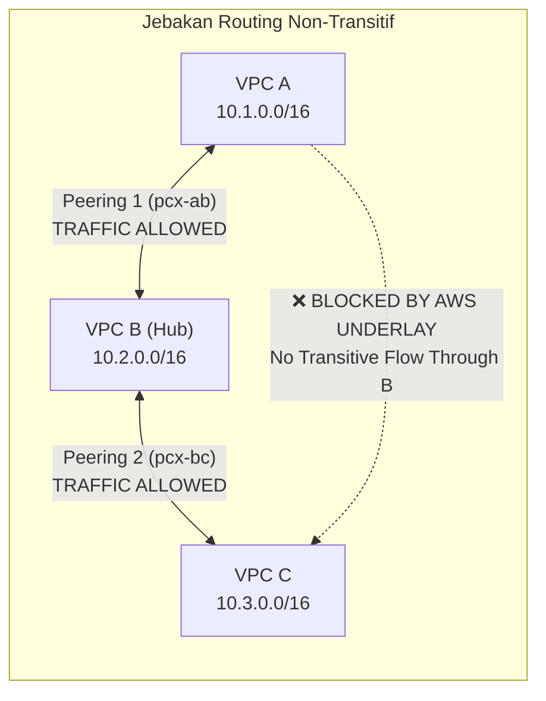
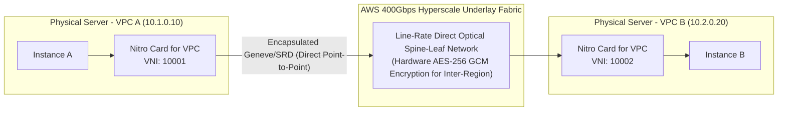

# Modul 11: VPC Peering Architecture & Underlay Mesh Routing

<BadgeLabel type="sme" text="Level: Principal / SME" /> <BadgeLabel type="rfc" text="RFC 1122 / RFC 7348" /> <BadgeLabel type="aws" text="AWS Underlay Peering" />

**AWS VPC Peering** adalah interkoneksi jaringan *point-to-point* antar dua Virtual Private Cloud yang beroperasi langsung pada tingkat **AWS Nitro Underlay Fabric**. Berbeda dengan Transit Gateway atau VPN, VPC Peering **tidak memiliki gateway perantara, tidak ada titik kegagalan tunggal (*single point of failure*), dan tidak ada pembatasan bandwidth (*zero bandwidth bottleneck*)**.

---

## 1. Layer 1: Protocol Mechanics & RFC Theory

### A. Sifat Non-Transitif Peering (*Non-Transitive Routing Principle*)
Berdasarkan prinsip isolasi keamanan jaringan dan **RFC 1122**, VPC Peering dirancang secara tegas **bersifat non-transitif (*non-transitive*)**:



- Jika VPC A terhubung ke VPC B (via `pcx-ab`), dan VPC B terhubung ke VPC C (via `pcx-bc`), **VPC A TIDAK DAPAT mengirim paket ke VPC C melalui VPC B**.
- Anda tidak dapat menggunakan VPC Peering untuk menjembatani lalu lintas dari *Direct Connect (DX)*, *VPN*, atau *Internet Gateway* milik satu VPC ke VPC lainnya (*Edge-to-Edge Routing Prohibition*).

### B. Pertimbangan MTU (Intra-Region vs Inter-Region)
- **Intra-Region VPC Peering**: Mendukung **Jumbo Frames hingga 9,001 bytes MTU** secara penuh antar instance Nitro.
- **Inter-Region VPC Peering**: Paket dibatasi pada ukuran **MTU standar 1,500 bytes**. Paket yang melebihi 1500 bytes dengan flag *Don't Fragment (DF=1)* akan memicu pesan balasan *ICMP Type 3 Code 4 (Fragmentation Needed)* untuk memicu *Path MTU Discovery (PMTUD)*.

---

## 2. Layer 2: AWS Distributed Underlay & Hyperplane Internals



### A. Mengapa VPC Peering Memiliki Latensi Terendah & Bandwidth Tertinggi?
- Pada VPC Peering, paket data **tidak pernah dialihkan ke appliance perangkat lunak, NAT engine, atau pool Hyperplane**.
- Ketika instance di VPC A mengirim paket ke `10.2.0.20`, Nitro Card membaca tabel rute lokal, mengenkapsulasi paket dengan *Virtual Network Identifier (VNI)* milik VPC B, dan langsung menembakkannya melintasi kabel optik fisik *spine-leaf fabric* ke Nitro Card tujuan di VPC B.
- **Latensi jaringan antar instance adalah latensi murni underlay fisik (< 0.2 ms dalam AZ yang sama)**.

### B. Enkripsi Hardware Inter-Region
Semua lalu lintas *Inter-Region VPC Peering* yang melintasi backbone global privat AWS secara otomatis dienkripsi pada layer fisik oleh modul kriptografi hardware Nitro menggunakan algoritma **AES-256 GCM** tanpa penurunan performa throughput.

---

## 3. Layer 3: AWS Resource Deep-Dive & Hard Limits

### A. Batasan & Aturan Ketat Resource
1. **CIDR Overlap Mutlak Dilarang**: AWS akan menolak pembuatan koneksi peering jika Primary atau Secondary CIDR dari kedua VPC saling tumpang tindih (*overlapping*), bahkan hanya sebesar 1 alamat IP.
2. **Batas Kuota Koneksi**:
   - Kuota default: **50 koneksi peering aktif per VPC**.
   - Kuota maksimum: **125 koneksi peering aktif per VPC** (Hard Limit).
3. **Kompatibilitas Fitur DNS**:
   - `AllowDNSResolutionFromRemoteVpc`: Mengizinkan instance di VPC lokal untuk me-resolve *Public IPv4 DNS Hostnames* dari VPC remote menjadi alamat IP privat lokal.
4. **Struktur Biaya**:
   - **Biaya per Jam**: **$0.00 (Gratis)** — tidak ada biaya sewa koneksi peering.
   - **Data Transfer Intra-AZ**: **$0.00 / GB** (jika kedua instance berada di AZ yang sama).
   - **Data Transfer Cross-AZ**: $0.01 / GB per arah ($0.02 / GB round-trip).
   - **Data Transfer Inter-Region**: Mengikuti tarif standar transfer data antar region AWS.

::: tip STANDAR BEST PRACTICE INDUSTRI (SME RECOMMENDATION)
Untuk lingkungan produksi dengan ratusan VPC, hindari membangun topologi *Full-Mesh VPC Peering* manual karena rumus kompleksitasnya adalah $\frac{N(N-1)}{2}$ koneksi. Gunakan **VPC Peering khusus untuk jalur berkecepatan tinggi dengan throughput gigantik (seperti Data Lake, EMR, atau klaster Kafka)**, dan gunakan **AWS Transit Gateway atau AWS Cloud WAN** untuk manajemen konektivitas korporasi skala besar.
:::

---

## 4. Layer 4: Hop-by-Hop Packet Walkthrough & Flow Lifecycle

```
[Client EC2 di VPC A: 10.1.0.10]
  │ Mengirim paket ke Database di VPC B: 10.2.0.20:5432
  ▼
[Nitro Card for VPC A]
  │ (1) Evaluasi Security Group Egress Rule VPC A (Allowed)
  │ (2) Evaluasi VPC A Subnet Route Table:
  │     Lookup 10.2.0.20 -> Matches: 10.2.0.0/16 -> Target: pcx-0123456789abcdef0
  │ (3) Nitro membaca mapping tabel underlay untuk pcx-0123456789abcdef0
  │ (4) Enkapsulasi paket ke format overlay Geneve/SRD dengan Target VNI VPC B
  ▼
[AWS Hyperscale Underlay Spine-Leaf Fabric]
  │ (5) Paket dialirkan langsung melalui jalur fisik berkecepatan tinggi
  │ (6) Zero middlebox, Zero hop latency penalty
  ▼
[Nitro Card for VPC B]
  │ (7) Menerima frame Geneve dan melakukan dekapsulasi
  │ (8) Evaluasi Security Group Ingress Rule VPC B:
  │     Mengecek apakah mengizinkan IP 10.1.0.10/32 ATAU Security Group VPC A (Peer SG)
  │ (9) Evaluasi NACL Inbound Subnet VPC B (Allowed)
  ▼
[Target Database EC2 di VPC B: 10.2.0.20]
  │ (10) Paket diserahkan ke PostgreSQL daemon pada port 5432
```

---

## 5. Layer 5: Production Terraform IaC & CLI Implementation Blueprints

Blueprint Terraform enterprise berikut mengonfigurasi **Cross-Account / Multi-VPC Peering** lengkap dengan *Auto-Acceptance*, pembaruan *Route Tables* dua arah, dan resolusi DNS privat:

```hcl
# main.tf - Production Cross-VPC Peering Blueprint

terraform {
  required_version = ">= 1.6.0"
  required_providers {
    aws = {
      source  = "hashicorp/aws"
      version = "~> 5.0"
    }
  }
}

# 1. VPC A (Requester)
resource "aws_vpc" "vpc_a" {
  cidr_block           = "10.10.0.0/16"
  enable_dns_hostnames = true
  enable_dns_support   = true

  tags = { Name = "vpc-requester-app" }
}

# 2. VPC B (Accepter)
resource "aws_vpc" "vpc_b" {
  cidr_block           = "10.20.0.0/16"
  enable_dns_hostnames = true
  enable_dns_support   = true

  tags = { Name = "vpc-accepter-data" }
}

# 3. VPC Peering Connection
resource "aws_vpc_peering_connection" "peer_conn" {
  vpc_id      = aws_vpc.vpc_a.id
  peer_vpc_id = aws_vpc.vpc_b.id
  auto_accept = true

  accepter {
    allow_remote_vpc_dns_resolution = true
  }

  requester {
    allow_remote_vpc_dns_resolution = true
  }

  tags = {
    Name = "pcx-app-to-data"
  }
}

# 4. Route Table Updates for VPC A (Points VPC B CIDR to Peering)
resource "aws_route" "route_a_to_b" {
  route_table_id            = aws_vpc.vpc_a.main_route_table_id
  destination_cidr_block    = aws_vpc.vpc_b.cidr_block
  vpc_peering_connection_id = aws_vpc.peering_connection.peer_conn.id
}

# 5. Route Table Updates for VPC B (Points VPC A CIDR to Peering)
resource "aws_route" "route_b_to_a" {
  route_table_id            = aws_vpc.vpc_b.main_route_table_id
  destination_cidr_block    = aws_vpc.vpc_a.cidr_block
  vpc_peering_connection_id = aws_vpc.peering_connection.peer_conn.id
}
```

### Verifikasi via AWS CLI:
```bash
# 1. Periksa status koneksi VPC Peering
aws ec2 describe-vpc-peering-connections \
  --vpc-peering-connection-ids pcx-0123456789abcdef0 \
  --query "VpcPeeringConnections[*].{ID:VpcPeeringConnectionId,Status:Status.Code,Requester:RequesterVpcInfo.CidrBlock,Accepter:AccepterVpcInfo.CidrBlock}"

# 2. Cek opsi DNS resolution pada peering
aws ec2 describe-vpc-peering-connections \
  --vpc-peering-connection-ids pcx-0123456789abcdef0 \
  --query "VpcPeeringConnections[*].{ReqDNS:RequesterVpcInfo.PeeringOptions,AccDNS:AccepterVpcInfo.PeeringOptions}"
```

---

## 6. Layer 6: Failure Modes, Edge Cases & SEV-1 Troubleshooting Matrix

| Gejala Masalah (*Symptoms*) | Akar Masalah (*Root Cause Analysis*) | Perintah Investigasi Triage CLI | Solusi Definitif (*Fix*) |
| :--- | :--- | :--- | :--- |
| Paket dari VPC A ke VPC C gagal saat mencoba transit via VPC B | Pelanggaran aturan *Non-Transitive Routing* pada arsitektur VPC Peering AWS. | `traceroute 10.3.0.10` dari instance di VPC A | Bangun koneksi peering langsung VPC A <-> VPC C atau migrasi ke Transit Gateway. |
| Inisiasi peering ditolak dengan pesan `InvalidCIDRBlock.Overlap` | Salah satu CIDR block sekunder atau primer pada kedua VPC memiliki rentang IP yang beririsan. | `aws ec2 describe-vpcs --vpc-ids <vpc-1> <vpc-2> --query "Vpcs[*].CidrBlockAssociationSet"` | Buat ulang VPC dengan rentang non-overlapping atau gunakan Private NAT Gateway (Module 10). |
| Koneksi Peering Cross-Account menggantung dalam status `pending-acceptance` | Akun Accepter belum menyetujui permintaan peering request dari akun Requester. | `aws ec2 describe-vpc-peering-connections --filters "Name=status-code,Values=pending-acceptance"` | Jalankan perintah `aws ec2 accept-vpc-peering-connection --vpc-peering-connection-id <id>` pada akun Accepter. |
| DNS Hostname dari instance di VPC remote me-resolve ke Public IP, bukan Private IP | Opsi `allow_remote_vpc_dns_resolution` belum diaktifkan pada atribut peering connection. | `aws ec2 describe-vpc-peering-connections --query "VpcPeeringConnections[*].*.PeeringOptions"` | Aktifkan `AllowDnsResolutionFromRemoteVpc` menggunakan `aws ec2 modify-vpc-peering-connection-options`. |

---

## 7. Layer 7: Principal Architect Tradeoff Framework

```
+---------------------------------------------------------------------------------------------------+
|                           PERBANDINGAN KONEKTIVITAS INTER-VPC ENTERPRISE                          |
+-----------------------+-----------------------+--------------------------+------------------------+
| Parameter Evaluasi    | VPC Peering           | AWS Transit Gateway (TGW)| AWS VPC Lattice        |
+-----------------------+-----------------------+--------------------------+------------------------+
| Latensi Jaringan      | < 0.2 ms (Terendah)   | ~1.0 - 2.5 ms (Hop TGW)  | ~1.5 - 3.0 ms (L7 Rev) |
| Throughput Maksimum   | Line-Rate (100G+)     | 50 Gbps per AZ Attach    | Auto-Scaled Service    |
| Kompleksitas N VPCs   | O(N^2) Full Mesh      | O(N) Hub-and-Spoke       | Service-to-Service     |
| Biaya Per Jam         | $0.00 (Gratis)        | $0.05 / AZ Attachment    | Biaya Layanan Lattice  |
| Biaya Data Transfer   | $0.00 Intra-AZ        | $0.02 / GB Olah          | $0.025 / GB Olah       |
| Routing Transitif     | ❌ Dilarang (RFC)     | ✅ Didukung Penuh        | ✅ Layer 7 Mesh        |
+-----------------------+-----------------------+--------------------------+------------------------+
```

### Rekomendasi Keputusan SME:
- Gunakan **VPC Peering** untuk interkoneksi beban kerja *Big Data, Machine Learning distributed training, dan replikasi database volume raksasa* yang membutuhkan throughput maksimal dan latensi terendah dengan biaya pemrosesan $0.
- Gunakan **AWS Transit Gateway (Module 20)** untuk jaringan korporasi multi-account multi-VPC standar (> 10 VPC) guna menjaga sentralisasi routing policy dan inspeksi keamanan terpadu.
