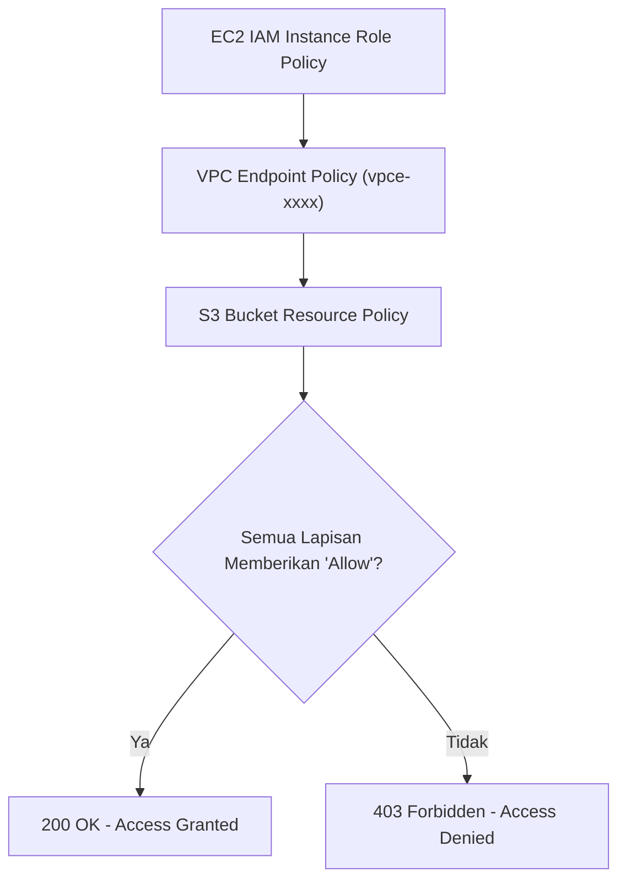
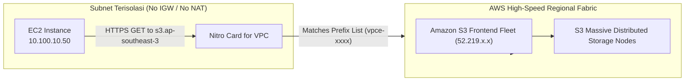

# Modul 12: Gateway VPC Endpoints (S3 & DynamoDB) Deep-Dive

<BadgeLabel type="sme" text="Level: Principal / SME" /> <BadgeLabel type="aws" text="AWS Gateway VPC Endpoints" /> <BadgeLabel type="rfc" text="Prefix List Routing" />

**Gateway VPC Endpoints** adalah mekanisme konektivitas privat generasi pertama AWS yang dirancang khusus untuk dua layanan inti: **Amazon S3** dan **Amazon DynamoDB**. Layanan ini mengarahkan trafik dari VPC langsung ke storage underlay AWS tanpa melintasi Internet Gateway atau NAT Gateway, dengan **biaya $0 (Gratis) dan performa throughput tanpa batas**.

---

## 1. Layer 1: Protocol Mechanics & RFC Theory

### A. Prefix List Injection & Resolusi Routing LPM
Berbeda dengan *Interface Endpoints* yang menempatkan Network Interface (ENI) privat di dalam subnet, Gateway Endpoint bekerja di level **VPC Route Table** dengan menyuntikkan rute berbasis **AWS-Managed Prefix List**:

```
+-----------------------------------------------------------------------------------+
|                        VPC ROUTE TABLE DENGAN GATEWAY ENDPOINT                    |
+----------------------+-----------------------+------------------------------------+
| Destination CIDR     | Target Resource       | Penjelasan Mekanisme               |
+----------------------+-----------------------+------------------------------------+
| 10.100.0.0/16        | local                 | Komunikasi internal subnet VPC     |
| pl-63a5400a (S3)     | vpce-0123456789abcdef | Injeksi rute Prefix List publik S3 |
| 0.0.0.0/0            | nat-0123456789abcdef0 | Trafik internet umum lainnya       |
+----------------------+-----------------------+------------------------------------+
```

- Ketika instance me-resolve DNS `s3.ap-southeast-3.amazonaws.com`, resolver mengembalikan alamat IP publik resmi S3 (misalnya `52.219.92.12`).
- Evaluasi **Longest Prefix Match (LPM)** memeriksa tabel rute: prefiks S3 di dalam `pl-63a5400a` (kumpulan blok `/18` s/d `/24`) memiliki prefiks yang **jauh lebih spesifik daripada default route `0.0.0.0/0`**.
- Akibatnya, trafik ke S3 otomatis dialihkan ke target `vpce-xxxx` dan **tidak pernah membebani NAT Gateway**.

### B. Matriks Evaluasi IAM Policy & Kondisi Keamanan `aws:sourceVpce`
Akses ke S3 melalui Gateway Endpoint dievaluasi melalui 3 lapisan otorisasi independen:

$$\text{Authorization} = \text{IAM Identity Policy} \ \cap \ \text{VPC Endpoint Policy} \ \cap \ \text{S3 Bucket Policy}$$



Kunci kondisi IAM kritis:
- `aws:sourceVpce`: Membatasi agar bucket S3 HANYA dapat diakses jika request berasal dari Endpoint ID tertentu (`vpce-xxxx`).
- `aws:sourceVpc`: Membatasi akses bucket hanya dari ID VPC tertentu.

---

## 2. Layer 2: AWS Distributed Underlay & Hyperplane Internals



### A. Jalur Underlay Nitro ke S3 Frontends
- Ketika Nitro Card mendeteksi bahwa IP tujuan cocok dengan rentang Prefix List Gateway Endpoint, Nitro Card **tidak melakukan enkapsulasi NAT**.
- Paket dikirimkan melintasi *Dedicated Regional Underlay Fabric* langsung ke *S3 Frontend Load Balancing Fleet*.
- Karena tidak ada node perantara atau stateful conntrack NAT, **throughput dibatasi hanya oleh kemampuan fisik network card instance EC2 (hingga 100 Gbps+ dengan ENA/SRD)**.

---

## 3. Layer 3: AWS Resource Deep-Dive & Hard Limits

### A. Karakteristik & Batasan Layanan
1. **Layanan yang Didukung**: Terbatas secara eksklusif HANYA untuk **Amazon S3** dan **Amazon DynamoDB**. Seluruh layanan AWS lainnya (seperti Secrets Manager, SQS, KMS) menggunakan *Interface Endpoints (PrivateLink)*.
2. **Biaya Pemrosesan & Sewa**:
   - **Biaya per Jam**: **$0.00 (Gratis)**.
   - **Biaya Data Transfer**: **$0.00 / GB (Gratis)** untuk trafik intra-region.
3. **Batasan Transit (No On-Premises Access)**:
   - Gateway VPC Endpoint **TIDAK DAPAT diakses dari On-Premises** melalui Direct Connect atau Site-to-Site VPN.
   - Gateway VPC Endpoint **TIDAK DAPAT diakses dari Spoke VPC lain** melalui Transit Gateway atau VPC Peering.

::: tip STANDAR BEST PRACTICE INDUSTRI (SME RECOMMENDATION)
Untuk mencegah risiko **Data Exfiltration** (karyawan atau malware mengunggah data rahasia perusahaan ke bucket S3 pribadi di luar organisasi), pasang **Restrictive VPC Endpoint Policy** pada Gateway Endpoint yang membatasi tindakan `s3:PutObject` hanya ke *Corporate Approved Bucket ARNs*.
:::

---

## 4. Layer 4: Hop-by-Hop Packet Walkthrough & Flow Lifecycle

```
[Workload di Isolated Private Subnet: 10.100.10.50]
  │ (1) Menjalankan: aws s3 cp dataset.parquet s3://corporate-data-bucket/
  │ (2) Query DNS lokal (10.100.0.2) me-resolve s3.ap-southeast-3.amazonaws.com -> 52.219.92.12
  ▼
[Nitro Card for VPC]
  │ (3) Evaluasi Route Table Subnet:
  │     Lookup 52.219.92.12 -> Cocok dengan Prefix List: pl-63a5400a -> Target: vpce-0123456789abcdef
  │ (4) Nitro mengarahkan paket ke AWS Internal S3 Transport Matrix
  ▼
[AWS S3 Frontend Service - ap-southeast-3]
  │ (5) S3 menerima request HTTPS (TLS Handshake sukses)
  │ (6) Evaluasi VPC Endpoint Policy pada vpce-0123456789abcdef:
  │     - Apakah Principal diizinkan?
  │     - Apakah target bucket s3://corporate-data-bucket tercantum di Resource whitelist? (Passed)
  │ (7) Evaluasi S3 Bucket Policy:
  │     - Memeriksa kondisi StringEquals "aws:sourceVpce": "vpce-0123456789abcdef" (Passed)
  ▼
[S3 Storage Cluster]
  │ (8) Objek ditulis ke disk storage (200 OK HTTP Response dikembalikan ke EC2)
```

---

## 5. Layer 5: Production Terraform IaC & CLI Implementation Blueprints

Blueprint Terraform enterprise berikut mengonfigurasi Gateway Endpoint untuk S3 dan DynamoDB dengan **Endpoint Policy Proteksi Data Exfiltration** dan **Bucket Policy Penguncian VPC Endpoint**:

```hcl
# main.tf - Production Secure Gateway VPC Endpoint Blueprint

terraform {
  required_version = ">= 1.6.0"
  required_providers {
    aws = {
      source  = "hashicorp/aws"
      version = "~> 5.0"
    }
  }
}

variable "region" {
  type    = string
  default = "ap-southeast-3"
}

# 1. VPC Core & Route Table
resource "aws_vpc" "main" {
  cidr_block           = "10.100.0.0/16"
  enable_dns_hostnames = true
  enable_dns_support   = true

  tags = { Name = "vpc-gateway-ep-prod" }
}

resource "aws_route_table" "private_rt" {
  vpc_id = aws_vpc.main.id
  tags   = { Name = "rt-private-workloads" }
}

# 2. S3 Bucket dengan Enforce VPC Endpoint Access Only
resource "aws_s3_bucket" "secure_bucket" {
  bucket = "corp-financial-records-${var.region}-prod"
}

# 3. Gateway VPC Endpoint for S3 with Restrictive Policy (Anti-Data Exfiltration)
resource "aws_vpc_endpoint" "s3_gateway_ep" {
  vpc_id            = aws_vpc.main.id
  service_name      = "com.amazonaws.${var.region}.s3"
  vpc_endpoint_type = "Gateway"
  route_table_ids   = [aws_route_table.private_rt.id]

  policy = jsonencode({
    Version = "2012-10-17"
    Statement = [
      {
        Sid       = "AllowCorporateBucketsOnly"
        Effect    = "Allow"
        Principal = "*"
        Action    = [
          "s3:GetObject",
          "s3:PutObject",
          "s3:ListBucket"
        ]
        Resource = [
          aws_s3_bucket.secure_bucket.arn,
          "${aws_s3_bucket.secure_bucket.arn}/*",
          "arn:aws:s3:::amazonlinux.${var.region}.amazonaws.com/*" # Akses repo patch OS
        ]
      }
    ]
  })

  tags = { Name = "vpce-s3-gateway-secure" }
}

# 4. S3 Bucket Policy Pengunci aws:sourceVpce
resource "aws_s3_bucket_policy" "enforce_vpce_only" {
  bucket = aws_s3_bucket.secure_bucket.id

  policy = jsonencode({
    Version = "2012-10-17"
    Statement = [
      {
        Sid       = "DenyAccessIfNotViaVpce"
        Effect    = "Deny"
        Principal = "*"
        Action    = "s3:*"
        Resource = [
          aws_s3_bucket.secure_bucket.arn,
          "${aws_s3_bucket.secure_bucket.arn}/*"
        ]
        Condition = {
          StringNotEquals = {
            "aws:sourceVpce" = aws_vpc_endpoint.s3_gateway_ep.id
          }
        }
      }
    ]
  })
}
```

### Verifikasi via AWS CLI:
```bash
# 1. Periksa rute Prefix List pada Route Table
aws ec2 describe-route-tables \
  --route-table-ids rtb-0123456789abcdef0 \
  --query "RouteTables[0].Routes[?PrefixListId!=null]"

# 2. Cek status Gateway Endpoint
aws ec2 describe-vpc-endpoints \
  --vpc-endpoint-ids vpce-0123456789abcdef0 \
  --query "VpcEndpoints[*].{ID:VpcEndpointId,State:State,Policy:PolicyDocument}"
```

---

## 6. Layer 6: Failure Modes, Edge Cases & SEV-1 Troubleshooting Matrix

| Gejala Masalah (*Symptoms*) | Akar Masalah (*Root Cause Analysis*) | Perintah Investigasi Triage CLI | Solusi Definitif (*Fix*) |
| :--- | :--- | :--- | :--- |
| Server On-Premises via Direct Connect gagal mengakses S3 via Gateway Endpoint | Gateway Endpoint bersifat lokal VPC dan tidak mendukung perutean transitif dari On-Premises / DX. | `traceroute s3.ap-southeast-3.amazonaws.com` dari on-prem router | Gunakan **AWS PrivateLink for S3 (Interface VPC Endpoint)** untuk akses dari On-Premises. |
| Perintah `yum update` atau `dnf install` gagal dengan error HTTP 403 Forbidden | VPC Endpoint Policy pada Gateway S3 terlalu ketat dan memblokir bucket repositori Amazon Linux OS. | Cek response code pada yum log di `/var/log/yum.log` | Tambahkan ARN bucket repo Amazon Linux regional ke dalam whitelist VPC Endpoint Policy. |
| Akses ke Bucket S3 di Region Lain (Cross-Region S3) time out | Gateway Endpoint hanya merutekan trafik untuk S3 di **Region yang sama**. Trafik lintas region diarahkan ke default route. | `aws ec2 describe-prefix-lists --filters "Name=prefix-list-name,Values=*s3*"` | Gunakan NAT Gateway untuk akses cross-region atau buat Interface Endpoint multi-region. |
| Bucket Policy `Deny` mengunci seluruh admin dan automation | Aturan `Deny` tidak mengecualikan IAM Roles kritis atau eksekusi darurat. | Cek CloudTrail Event: `AccessDenied` pada API `PutBucketPolicy` | Buka akses via root account atau modifikasi policy via IAM break-glass role. |

---

## 7. Layer 7: Principal Architect Tradeoff Framework

```
+------------------------------------------------------------------------------------------------------+
|                           KOMPARASI METODE AKSES AMAZON S3 ENTERPRISE                               |
+------------------------+--------------------------+-------------------------+------------------------+
| Parameter Evaluasi     | Gateway VPC Endpoint     | Interface Endpoint (S3) | NAT Gateway Outbound   |
+------------------------+--------------------------+-------------------------+------------------------+
| Biaya per Jam          | **$0.00 (Gratis)**       | $0.01 / jam per AZ      | $0.045 / jam per AZ    |
| Biaya Data Transfer    | **$0.00 / GB (Gratis)**  | $0.01 / GB Olah         | $0.045 / GB Olah       |
| Akses dari On-Premises | ❌ Tidak Didukung        | ✅ Didukung Penuh (IP)  | ❌ Tidak Langsung      |
| Akses Lintas Region    | ❌ Hanya Regional        | ✅ Didukung Global DNS  | ✅ Didukung Publik     |
| Throughput Limit       | Line-Rate Instance (100G)| 40 Gbps per ENI         | 100 Gbps per NAT GW    |
| Konfigurasi Routing    | Route Table Prefix List  | DNS Private / Private IP| Route Table 0.0.0.0/0  |
+------------------------+--------------------------+-------------------------+------------------------+
```

### Rekomendasi Keputusan SME:
- Selalu gunakan **Gateway VPC Endpoint (S3 & DynamoDB)** di SEMUA VPC dan SEMUA Subnet internal untuk mengeliminasi 100% biaya data transfer internal S3.
- Gunakan **Interface VPC Endpoint for S3 (PrivateLink)** HANYA jika Anda memerlukan akses dari Data Center On-Premises via Direct Connect atau interkoneksi multi-cloud.
