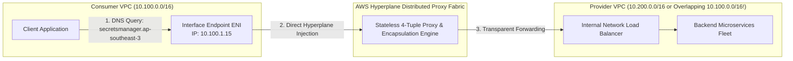
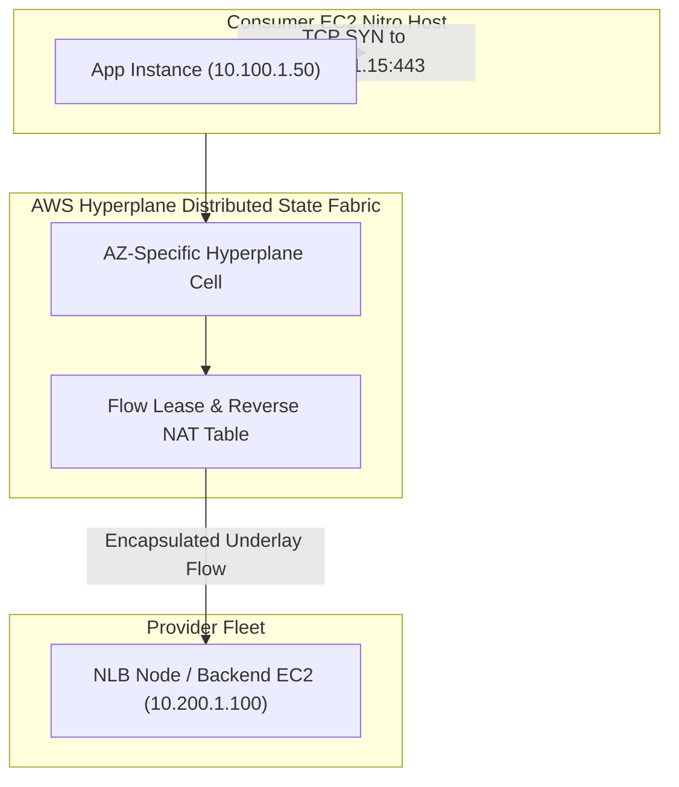

# Modul 13: AWS PrivateLink & Interface VPC Endpoints Architecture

<BadgeLabel type="sme" text="Level: Principal / SME" /> <BadgeLabel type="aws" text="AWS PrivateLink & Hyperplane" /> <BadgeLabel type="rfc" text="RFC 1035 / Split-Horizon DNS" />

**AWS PrivateLink** adalah teknologi interkoneksi privat generasi modern yang menyediakan konektivitas satu arah (*unidirectional / client-to-service*) berkecepatan tinggi dan aman antara **Consumer VPC** dan **Service Provider VPC (atau SaaS eksternal)** tanpa perlu melakukan *VPC Peering*, tanpa *Internet Gateway*, dan **kebal terhadap masalah IP address overlapping (CIDR collision)**.

---

## 1. Layer 1: Protocol Mechanics & RFC Theory

### A. Model Provider-Consumer & Private DNS Split-Horizon (RFC 1035)
PrivateLink memisahkan peran jaringan menjadi dua domain yang terisolasi secara ketat:
1. **Service Provider**: Mengekspos layanan internal di balik **Network Load Balancer (NLB)** melalui konfigurasi *VPC Endpoint Service*.
2. **Service Consumer**: Membuat **Interface VPC Endpoint** yang menyuntikkan *Elastic Network Interface (ENI)* privat langsung ke dalam subnet Consumer VPC.



### B. Mekanisme Private DNS
Ketika opsi **Enable Private DNS** diaktifkan pada Interface Endpoint:
- AWS Route 53 secara otomatis membuat *Hidden Private Hosted Zone* di VPC Consumer.
- Nama domain publik resmi AWS (contoh: `secretsmanager.ap-southeast-3.amazonaws.com` atau `api.snowflake.com`) di-override secara lokal agar me-resolve langsung ke **Private IP ENI Interface Endpoint (`10.100.1.15`)**.
- Aplikasi client tidak memerlukan perubahan kode aplikasi sama sekali dan sertifikat TLS tetap tervalidasi secara sah (*Zero TLS Validation Error*).

---

## 2. Layer 2: AWS Distributed Underlay & Hyperplane Internals



### A. Mengapa PrivateLink Kebal Terhadap Overlapping CIDRs?
- Interface Endpoint tidak merutekan seluruh paket IP secara langsung pada level Layer 3 routing (*no routing table exchange*).
- AWS Hyperplane bertindak sebagai **Distributed High-Performance Proxy**: Hyperplane memutus koneksi TCP dari Consumer dan membentuk aliran koneksi baru ke NLB Provider.
- Dengan demikian, bahkan jika Consumer VPC dan Provider VPC sama-sama menggunakan CIDR `10.0.0.0/16`, koneksi tetap berjalan sempurna tanpa konflik routing.

---

## 3. Layer 3: AWS Resource Deep-Dive & Hard Limits

### A. Karakteristik & Parameter Layanan
1. **Layanan yang Didukung**: Lebih dari 150+ AWS Services (KMS, Secrets Manager, SQS, STS, ECR, CloudWatch, dll.), serta integrasi partner SaaS (Datadog, Snowflake, MongoDB Atlas, Salesforce).
2. **Kapasitas Throughput per ENI**:
   - **Baseline**: 10 Gbps per Interface Endpoint ENI.
   - **Burst**: Hingga **40 Gbps** per ENI.
   - **Multi-AZ Scaling**: Skala throughput linear dengan menyebarkan ENI di beberapa Availability Zone.
3. **Struktur Biaya AWS**:
   - **Biaya Sewa ENI**: ~$0.01 per jam per Availability Zone (~$7.20/bulan per AZ).
   - **Biaya Pemrosesan Data**: **$0.01 per GB** data yang diproses melalui PrivateLink.

::: tip STANDAR BEST PRACTICE INDUSTRI (SME RECOMMENDATION)
Selalu gunakan **AZ ID Mapping (misal `apse3-az1`, bukan sekadar nama `ap-southeast-3a`)** saat merancang PrivateLink lintas akun AWS. Nama AZ (seperti `ap-southeast-3a`) dapat berbeda antar akun AWS (*AZ Name Shuffling*). Mencocokkan AZ ID memastikan trafik tidak terkena penalti latensi dan biaya tersembunyi *Cross-AZ Data Transfer* ($0.01/GB).
:::

---

## 4. Layer 4: Hop-by-Hop Packet Walkthrough & Flow Lifecycle

```
[Consumer Application EC2: 10.100.1.50]
  │ (1) Melakukan panggilan API HTTPS ke AWS Secrets Manager:
  │ (2) Query DNS secretsmanager.ap-southeast-3.amazonaws.com
  │     -> Route 53 Private DNS mengembalikan IP Interface Endpoint: 10.100.1.15
  │ (3) Client mengirimkan TCP SYN: SRC 10.100.1.50:51200 -> DST 10.100.1.15:443
  ▼
[Interface Endpoint ENI - ap-southeast-3a: 10.100.1.15]
  │ (4) Evaluasi Security Group pada Interface ENI (Port 443 Inbound Allowed)
  │ (5) Paket diinjeksi langsung ke AWS Hyperplane Cell Fabric
  ▼
[AWS Hyperplane Cell Layer]
  │ (6) Hyperplane memetakan flow ke VPC Endpoint Service Provider
  │ (7) Forward paket melintasi underlay ke Network Load Balancer (NLB) Provider
  ▼
[Provider Network Load Balancer (NLB)]
  │ (8) NLB menerima koneksi TCP
  │ (9) Jika Client IP Preservation aktif -> Source IP asli tetap dipertahankan
  │ (10) Forward ke Target Group EC2 Backend Microservice (10.200.1.100:8443)
  ▼
[Backend Microservice Target]
  │ (11) Memproses request dan mengirimkan balasan TCP SYN-ACK kembali ke NLB
  ▼
[Reverse Hyperplane Pathway] -> [Consumer EC2: 10.100.1.50] (Session Established!)
```

---

## 5. Layer 5: Production Terraform IaC & CLI Implementation Blueprints

Blueprint Terraform berikut mengonfigurasi **VPC Endpoint Service (Provider)** di balik NLB dan **Interface VPC Endpoint (Consumer)** dengan Private DNS dan Security Group terisolasi:

```hcl
# main.tf - Production AWS PrivateLink End-to-End Blueprint

terraform {
  required_version = ">= 1.6.0"
  required_providers {
    aws = {
      source  = "hashicorp/aws"
      version = "~> 5.0"
    }
  }
}

variable "region" {
  type    = string
  default = "ap-southeast-3"
}

# ==============================================================================
# 1. PROVIDER VPC & ENDPOINT SERVICE
# ==============================================================================
resource "aws_vpc" "provider_vpc" {
  cidr_block           = "10.200.0.0/16"
  enable_dns_hostnames = true
  tags = { Name = "vpc-privatelink-provider" }
}

resource "aws_subnet" "provider_subnet_a" {
  vpc_id            = aws_vpc.provider_vpc.id
  cidr_block        = "10.200.1.0/24"
  availability_zone = "${var.region}a"
  tags = { Name = "sbn-provider-${var.region}a" }
}

# Provider Internal NLB
resource "aws_lb" "provider_nlb" {
  name               = "nlb-service-provider"
  internal           = true
  load_balancer_type = "network"
  subnets            = [aws_subnet.provider_subnet_a.id]

  tags = { Name = "nlb-service-provider" }
}

# Endpoint Service Configuration
resource "aws_vpc_endpoint_service" "app_service" {
  acceptance_required        = false
  network_load_balancer_arns = [aws_lb.provider_nlb.arn]

  tags = { Name = "service-provider-privatelink" }
}

# ==============================================================================
# 2. CONSUMER VPC & INTERFACE ENDPOINT
# ==============================================================================
resource "aws_vpc" "consumer_vpc" {
  cidr_block           = "10.100.0.0/16"
  enable_dns_hostnames = true
  enable_dns_support   = true
  tags = { Name = "vpc-privatelink-consumer" }
}

resource "aws_subnet" "consumer_subnet_a" {
  vpc_id            = aws_vpc.consumer_vpc.id
  cidr_block        = "10.100.1.0/24"
  availability_zone = "${var.region}a"
  tags = { Name = "sbn-consumer-${var.region}a" }
}

# Security Group for Interface Endpoint ENI
resource "aws_security_group" "vpce_sg" {
  name        = "sg-interface-endpoint"
  description = "Control inbound traffic to Interface Endpoint ENIs"
  vpc_id      = aws_vpc.consumer_vpc.id

  ingress {
    description = "Allow TLS from Consumer Workload Subnets"
    from_port   = 443
    to_port     = 443
    protocol    = "tcp"
    cidr_blocks = [aws_vpc.consumer_vpc.cidr_block]
  }

  egress {
    from_port   = 0
    to_port     = 0
    protocol    = "-1"
    cidr_blocks = ["0.0.0.0/0"]
  }
}

# Interface VPC Endpoint in Consumer VPC
resource "aws_vpc_endpoint" "interface_ep" {
  vpc_id              = aws_vpc.consumer_vpc.id
  service_name        = aws_vpc_endpoint_service.app_service.service_name
  vpc_endpoint_type   = "Interface"
  subnet_ids          = [aws_subnet.consumer_subnet_a.id]
  security_group_ids  = [aws_security_group.vpce_sg.id]
  private_dns_enabled = false

  tags = { Name = "vpce-consumer-service-client" }
}
```

### Verifikasi via AWS CLI:
```bash
# 1. Periksa status koneksi Interface Endpoint
aws ec2 describe-vpc-endpoints \
  --vpc-endpoint-ids vpce-0123456789abcdef0 \
  --query "VpcEndpoints[*].{ID:VpcEndpointId,State:State,DnsEntries:DnsEntries[*].DnsName}"

# 2. Cek izin akses Principal pada Endpoint Service Provider
aws ec2 describe-vpc-endpoint-service-permissions \
  --service-id vpce-svc-0123456789abcdef0
```

---

## 6. Layer 6: Failure Modes, Edge Cases & SEV-1 Troubleshooting Matrix

| Gejala Masalah (*Symptoms*) | Akar Masalah (*Root Cause Analysis*) | Perintah Investigasi Triage CLI | Solusi Definitif (*Fix*) |
| :--- | :--- | :--- | :--- |
| Koneksi client ke Interface Endpoint time out pada port 443 | Security Group yang menempel pada **Interface Endpoint ENI** memblokir port 443 dari CIDR Consumer. | `aws ec2 describe-security-groups --group-ids <vpce-sg-id>` | Buka port 443 Inbound pada Security Group Interface Endpoint dari subnet consumer. |
| Status Interface Endpoint macet di kondisi `PendingAcceptance` | Konfigurasi `acceptance_required = true` pada Provider Service, namun admin Provider belum menyetujuinya. | `aws ec2 describe-vpc-endpoint-connections --service-id <svc-id>` | Jalankan perintah `aws ec2 accept-vpc-endpoint-connections` dari sisi Provider. |
| Gagal mengaktifkan `private_dns_enabled` pada Interface Endpoint AWS Service | Atribut VPC `enableDnsHostnames` atau `enableDnsSupport` dalam status `false` pada Consumer VPC. | `aws ec2 describe-vpc-attribute --vpc-id <id> --attribute enableDnsHostnames` | Aktifkan kedua opsi DNS attribute pada Consumer VPC. |
| Bentrok Private DNS dengan Private Hosted Zone (PHZ) kustom yang sudah ada | Route 53 PHZ dengan domain name yang persis sama sudah diasosiasikan sebelumnya ke VPC tersebut. | `aws route53 list-hosted-zones-by-vpc --vpc-id <id>` | Hapus atau sesuaikan record pada PHZ yang bentrok sebelum mengaktifkan Private DNS endpoint. |

---

## 7. Layer 7: Principal Architect Tradeoff Framework

```
+----------------------------------------------------------------------------------------------------+
|                         PERBANDINGAN METODE INTEGRASI MICROSERVICES & SAAS                         |
+------------------------+--------------------------+-----------------------+------------------------+
| Parameter Evaluasi     | AWS PrivateLink          | VPC Peering           | AWS Transit Gateway    |
+------------------------+--------------------------+-----------------------+------------------------+
| Toleransi Overlap IP   | **100% Kebal (Proxy)**   | ❌ Ditolak Mutlak     | ❌ Butuh Private NAT   |
| Model Keamanan         | Unidirectional (Least Priv)| Bidirectional L3     | Bidirectional L3       |
| Paparan Jaringan       | Hanya 1 Port / Service   | Seluruh Subnet Terbuka| Seluruh CIDR Terbuka   |
| Biaya Data Transfer    | $0.01 / GB Olah          | $0.00 Intra-AZ        | $0.02 / GB Olah        |
| Skalabilitas Eksternal | Sempurna untuk B2B SaaS  | Terbatas internal     | Terbatas inter-VPC     |
+------------------------+--------------------------+-----------------------+------------------------+
```

### Rekomendasi Keputusan SME:
- Gunakan **AWS PrivateLink** saat menghubungkan layanan antar divisi independen, vendor SaaS eksternal, atau perbankan (seperti interkoneksi BI-FAST / Payment Gateway) yang menuntut *Zero Attack Surface* dan isolasi L3 total.
- Gunakan **VPC Peering atau Transit Gateway** untuk komunikasi internal yang memerlukan konektivitas *mesh bidirectional* penuh dengan protokol non-HTTP/TCP.
