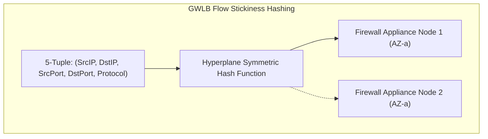
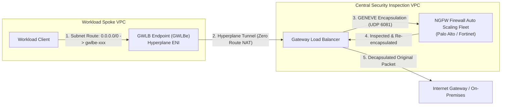

# Modul 14: Gateway Load Balancer (GWLB) & Inline NGFW Fleet Architecture

<BadgeLabel type="sme" text="Level: Principal / SME" /> <BadgeLabel type="rfc" text="RFC 8926 (GENEVE) / TLV 0x0108" /> <BadgeLabel type="aws" text="AWS GWLB & Hyperplane" />

**Gateway Load Balancer** (<NetworkTerm term="GWLB" />) menggabungkan kemampuan *transparent Layer 3 gateway* dengan *distributed Layer 4 load balancer* yang didukung oleh mesin **AWS Hyperplane**. GWLB memungkinkan penyisipan (*inline insertion*) armada Next-Generation Firewall (Palo Alto Networks VM-Series, Fortinet FortiGate, Check Point CloudGuard) secara horizontal dan transparan **tanpa mengubah header paket IP asli (Zero SNAT/DNAT)**.

---

## 1. Layer 1: Protocol Mechanics & RFC Theory

### A. Format Paket & Enkapsulasi Protokol GENEVE (RFC 8926)
GWLB membungkus seluruh paket IP asli (termasuk L2/L3/L4 headers) ke dalam datagram **Generic Network Virtualization Encapsulation** (<NetworkTerm term="GENEVE" />) yang berjalan di atas **UDP Port 6081**:

```
+-----------------------------------------------------------------------------------------------+
|                            ANATOMI PAKET GENEVE AWS GWLB (RFC 8926)                           |
+-------------------+--------------------+------------------------+-------------------------+
| Outer IP Header   | Outer UDP Header   | GENEVE Base Header     | AWS TLV Option Metadata |
| (GWLB <-> NGFW)   | (Dst Port: 6081)   | (Protocol Type 0x0800) | (Class 0x0108, Type 01) |
+-------------------+--------------------+------------------------+-------------------------+
|                                  ORIGINAL CUSTOMER IP PACKET                                  |
|               (Original Src IP, Original Dst IP, TCP/UDP Payload Tanpa Modifikasi)            |
+-----------------------------------------------------------------------------------------------+
```

### B. AWS GENEVE TLV Option Header (Class `0x0108`, Type `0x01`)
AWS menyuntikkan metadata khusus pada opsi *Type-Length-Value (TLV)*:
- **Class**: `0x0108` (Amazon Web Services Enterprise ID)
- **Type**: `0x01`
- **Payload Data**: Berisi *Client Flow Cookie*, *Attachment ID*, dan *Virtual Endpoint ID* (GWLBe) untuk melacak status sesi secara simetris.



### C. Persyaratan Kritis MTU Jaringan (8,500 Bytes)
Enkapsulasi GENEVE menambahkan overhead header sebesar **64 bytes**. Oleh karena itu:
- Interface appliance firewall yang menerima trafik GENEVE **wajib mendukung MTU minimal 8,500 bytes (atau 9,001 bytes Jumbo Frames)** untuk mencegah fragmentasi paket data pelanggan.

---

## 2. Layer 2: AWS Distributed Underlay & Hyperplane Internals



### A. Mengapa GWLB Murni Transparan?
- Pada arsitektur load balancer konvensional (ALB/NLB tanpa client IP preservation), alamat Source IP paket diubah menjadi IP load balancer.
- Pada **GWLB**, Hyperplane mempertahankan $100\%$ integritas alamat IP pengirim dan penerima asli.
- Firewall appliance dapat melihat alamat IP penyerang asli, mengeksekusi inspeksi *Layer 7 Deep Packet Inspection (DPI)*, *Intrusion Prevention (IPS)*, dan *Antivirus scanning* secara akurat.

---

## 3. Layer 3: AWS Resource Deep-Dive & Hard Limits

### A. Topologi Penempatan: 1-Arm (Single-Arm) vs 2-Arm (Dual-Arm)
1. **1-Arm (Single-Arm) Topology (Rekomendasi Utama)**:
   - Firewall hanya menggunakan **1 ENI** untuk menerima paket terenkapsulasi GENEVE dan mengembalikan paket yang telah diinspeksi ke GWLB pada ENI yang sama.
   - Menyederhanakan routing table dan eliminasi masalah *asymmetric routing*.
2. **2-Arm (Dual-Arm) Topology**:
   - Firewall menggunakan 2 ENI terpisah (ENI Ingress GENEVE dan ENI Egress Direct Subnet).
   - Membutuhkan penanganan *complex routing tables* di dalam sistem operasi firewall.

### B. Karakteristik & Kuota Keras GWLB
- **Maksimum GWLB Endpoints per VPC**: 50 per VPC.
- **Kapasitas Throughput**: Skalabilitas dinamis otomatis berbasis Hyperplane (skala hingga puluhan Gbps per AZ).
- **Target Group Registration**: Hingga **300 target** terdaftar per GWLB Target Group.
- **Protokol Health Check**: TCP, HTTP, atau HTTPS (biasanya dikonfigurasi ke port manajemen firewall atau port probe HTTP `80`/`8080`).

::: tip STANDAR BEST PRACTICE INDUSTRI (SME RECOMMENDATION)
Ketika mengintegrasikan GWLB dengan **AWS Transit Gateway (TGW)** untuk pola inspeksi terpusat (*Centralized Security Inspection VPC*), Anda **WAJIB mengaktifkan `Appliance Mode` (`appliance_mode_support = "enable"`)** pada TGW VPC Attachment. Jika tidak aktif, trafik bolak-balik (*bidirectional flow*) akan diarahkan ke AZ yang berbeda secara asimetris, menyebabkan firewall *stateful* menjatuhkan koneksi TCP.
:::

---

## 4. Layer 4: Hop-by-Hop Packet Walkthrough & Flow Lifecycle

```
[Client di Spoke VPC: 10.1.0.50]
  │ Mengirim paket HTTP GET ke API Eksternal: 198.51.100.20:80
  ▼
[Subnet Route Table Spoke VPC]
  │ Evaluasi LPM: 198.51.100.20 -> Matches 0.0.0.0/0 -> Target: gwlbe-0123456789abcdef
  ▼
[GWLB Endpoint (GWLBe) di Spoke VPC]
  │ Injeksi paket ke AWS Hyperplane cross-VPC tunnel
  ▼
[AWS Gateway Load Balancer (Security VPC)]
  │ (1) Menerima frame IP asli: (SRC 10.1.0.50 -> DST 198.51.100.20)
  │ (2) Evaluasi 5-Tuple Symmetric Hash -> Memilih Firewall EC2 di AZ yang sama
  │ (3) Membungkus paket ke dalam GENEVE Header:
  │     - Outer IP: SRC GWLB_IP -> DST NGFW_IP (Port 6081)
  │     - TLV Option 0x0108: Menempelkan Flow Cookie & Endpoint ID
  ▼
[Firewall Appliance (Palo Alto / Fortinet / Linux Daemon)]
  │ (4) Menerima paket UDP 6081
  │ (5) Melakukan Dekapsulasi GENEVE dan mengekstrak paket IP internal
  │ (6) Deep Packet Inspection (DPI) & Analisis Ancaman L7 (Traffic Valid / Clean)
  │ (7) Membungkus kembali paket yang bersih ke dalam format GENEVE dengan TLV yang persis sama
  │ (8) Mengirimkan kembali paket ke IP GWLB pada port UDP 6081
  ▼
[Gateway Load Balancer]
  │ (9) Menerima paket balik dari Firewall
  │ (10) Melepas GENEVE Outer Header
  │ (11) Meneruskan paket IP asli yang bersih ke tujuan berikutnya (Egress IGW / Target Subnet)
```

---

## 5. Layer 5: Production Terraform IaC & CLI Implementation Blueprints

Blueprint Terraform enterprise berikut mengonfigurasi arsitektur **Gateway Load Balancer (GWLB)**, GWLB Service, GWLB Endpoint (GWLBe), dan konfigurasi Target Group GENEVE:

```hcl
# main.tf - Production AWS Gateway Load Balancer (GWLB) Blueprint

terraform {
  required_version = ">= 1.6.0"
  required_providers {
    aws = {
      source  = "hashicorp/aws"
      version = "~> 5.0"
    }
  }
}

variable "region" {
  type    = string
  default = "ap-southeast-3"
}

# 1. Security VPC Core
resource "aws_vpc" "security_vpc" {
  cidr_block           = "198.18.0.0/16"
  enable_dns_hostnames = true
  tags = { Name = "vpc-security-inspection" }
}

resource "aws_subnet" "gwlb_subnet_a" {
  vpc_id            = aws_vpc.security_vpc.id
  cidr_block        = "198.18.1.0/24"
  availability_zone = "${var.region}a"
  tags = { Name = "sbn-gwlb-${var.region}a" }
}

resource "aws_subnet" "firewall_subnet_a" {
  vpc_id            = aws_vpc.security_vpc.id
  cidr_block        = "198.18.2.0/24"
  availability_zone = "${var.region}a"
  tags = { Name = "sbn-firewall-fleet-${var.region}a" }
}

# 2. Gateway Load Balancer
resource "aws_lb" "security_gwlb" {
  name               = "gwlb-enterprise-security"
  load_balancer_type = "gateway"
  subnets            = [aws_subnet.gwlb_subnet_a.id]

  tags = { Name = "gwlb-enterprise-security" }
}

# 3. GWLB Target Group (GENEVE Protocol on Port 6081)
resource "aws_lb_target_group" "gwlb_tg" {
  name        = "tg-ngfw-geneve-fleet"
  port        = 6081
  protocol    = "GENEVE"
  vpc_id      = aws_vpc.security_vpc.id
  target_type = "instance"

  health_check {
    port     = "80"
    protocol = "TCP"
    interval = 10
    timeout  = 5
  }

  tags = { Name = "tg-ngfw-geneve" }
}

# 4. GWLB Listener
resource "aws_lb_listener" "gwlb_listener" {
  load_balancer_arn = aws_lb.security_gwlb.arn

  default_action {
    type             = "forward"
    target_group_arn = aws_lb_target_group.gwlb_tg.arn
  }
}

# 5. VPC Endpoint Service (Backed by GWLB)
resource "aws_vpc_endpoint_service" "gwlb_service" {
  acceptance_required        = false
  gateway_load_balancer_arns = [aws_lb.security_gwlb.arn]

  tags = { Name = "gwlb-endpoint-service" }
}

# 6. Spoke VPC & GWLB Endpoint (GWLBe)
resource "aws_vpc" "spoke_vpc" {
  cidr_block           = "10.50.0.0/16"
  enable_dns_hostnames = true
  tags = { Name = "vpc-spoke-workload" }
}

resource "aws_subnet" "spoke_gwlbe_subnet" {
  vpc_id            = aws_vpc.spoke_vpc.id
  cidr_block        = "10.50.0.0/24"
  availability_zone = "${var.region}a"
  tags = { Name = "sbn-spoke-gwlbe-${var.region}a" }
}

resource "aws_vpc_endpoint" "gwlbe" {
  vpc_id            = aws_vpc.spoke_vpc.id
  service_name      = aws_vpc_endpoint_service.gwlb_service.service_name
  vpc_endpoint_type = "GatewayLoadBalancer"
  subnet_ids        = [aws_subnet.spoke_gwlbe_subnet.id]

  tags = { Name = "gwlbe-spoke-inspector" }
}
```

### Verifikasi via AWS CLI:
```bash
# 1. Periksa kesehatan node firewall di GWLB Target Group
aws elbv2 describe-target-health \
  --target-group-arn arn:aws:elasticloadbalancing:ap-southeast-3:123456789012:targetgroup/tg-ngfw-geneve-fleet/xxxxxxxx

# 2. Cek status GWLB Endpoint di Spoke VPC
aws ec2 describe-vpc-endpoints \
  --vpc-endpoint-ids vpce-0123456789abcdef0 \
  --query "VpcEndpoints[*].{ID:VpcEndpointId,State:State,ServiceName:ServiceName}"
```

---

## 6. Layer 6: Failure Modes, Edge Cases & SEV-1 Troubleshooting Matrix

| Gejala Masalah (*Symptoms*) | Akar Masalah (*Root Cause Analysis*) | Perintah Investigasi Triage CLI | Solusi Definitif (*Fix*) |
| :--- | :--- | :--- | :--- |
| Seluruh koneksi TCP drop setelah paket berukuran besar (> 1500 bytes) lewat | MTU interface pada firewall appliance di-set 1500 bytes, gagal menampung overhead **64-byte GENEVE header**. | `ip link show` pada Linux / OS Firewall | Ubah MTU interface firewall menjadi **8500 bytes** atau **9001 bytes** (`ip link set dev eth0 mtu 9001`). |
| Asymmetric Routing memutus sesi stateful TCP saat melintasi Transit Gateway | Fitur `Appliance Mode` tidak aktif pada TGW VPC Attachment ke Security Inspection VPC. | `aws ec2 describe-transit-gateway-vpc-attachments --filters "Name=vpc-id,Values=<sec-vpc-id>"` | Aktifkan Appliance Mode: `aws ec2 modify-transit-gateway-vpc-attachment --transit-gateway-attachment-id <id> --options ApplianceModeSupport=enable` |
| GWLB menandai seluruh target firewall sebagai `Unhealthy` | Health check probe (port 80/TCP) diblokir oleh Security Group instance Firewall. | `aws elbv2 describe-target-health --target-group-arn <tg-arn>` | Buka port probe health check (TCP 80) pada Security Group Firewall dari subnet GWLB. |
| Paket yang dikembalikan oleh Firewall di-drop oleh GWLB | Firewall memodifikasi atau menghapus **GENEVE TLV Option Header (Class 0x0108)** sebelum mengirim balik ke GWLB. | Capture paket dengan `tcpdump -i eth0 -nn -vvv port 6081` | Pastikan driver/firmware firewall mendukung opsi preserve GENEVE TLV options. |

---

## 7. Layer 7: Principal Architect Tradeoff Framework

```
+----------------------------------------------------------------------------------------------------+
|                          KOMPARASI OPSI FIREWALL INSPEKSI ENTERPRISE                               |
+------------------------+--------------------------+-----------------------+------------------------+
| Parameter Evaluasi     | AWS Gateway Load Balancer| AWS Network Firewall  | Dual-Arm EC2 Proxy     |
+------------------------+--------------------------+-----------------------+------------------------+
| Vendor NGFW Appliance  | Multi-Vendor (Palo/Forti)| Native Suricata AWS   | Multi-Vendor           |
| Enkapsulasi Flow       | GENEVE (RFC 8926)        | Native Underlay       | Routing Tradisional    |
| Kompleksitas Routing   | Rendah (Transparent GWLBe)| Rendah (VPCE Endpoint)| Sangat Tinggi (BGP/RT) |
| Latensi Overhead       | ~0.5 - 1.2 ms            | ~0.8 - 1.5 ms         | ~2.0 - 5.0 ms          |
| Scalability HA         | Horizontal Auto Scaling  | AWS Managed Scaling   | Manual Script / ASG    |
| Biaya Data Transfer    | $0.004 / GB (GWLB)       | $0.065 / GB (ANFW)    | Hanya Biaya EC2        |
+------------------------+--------------------------+-----------------------+------------------------+
```

### Rekomendasi Keputusan SME:
- Gunakan **AWS Gateway Load Balancer (GWLB)** jika organisasi Anda memiliki lisensi korporat untuk **Palo Alto Networks VM-Series, Fortinet FortiGate, atau Check Point**, serta membutuhkan fitur DPI Layer 7 kelas enterprise (Decryption, Threat Prevention, URL Filtering) dengan arsitektur auto-scaling transparan.
- Gunakan **AWS Network Firewall (Module 28)** jika Anda menginginkan solusi *fully managed Cloud-Native Suricata IPS/IDS* tanpa perlu mengelola OS dan patching instance firewall virtual.
