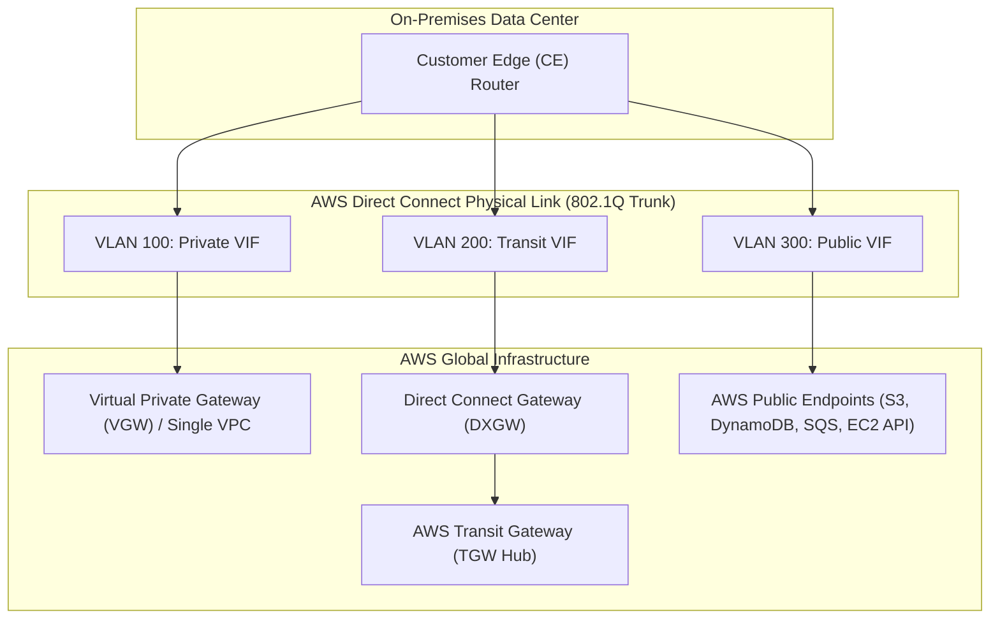
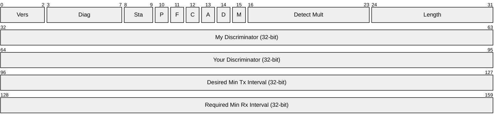

# Modul 16: Direct Connect Virtual Interfaces (VIFs) & BGP Routing Policies

<BadgeLabel type="sme" text="Level: Principal / SME" /> <BadgeLabel type="rfc" text="RFC 4271 / RFC 1997 / RFC 5880 / IEEE 802.1Q" /> <BadgeLabel type="aws" text="Direct Connect VIFs & BGP Policies" />

Setelah lapisan fisik (Layer 1) dan *Data Link* (Layer 2) terbentuk melalui port *Direct Connect*, perutean logika *hybrid* dikonfigurasi melalui **Virtual Interfaces** (<NetworkTerm term="VIF" />). Setiap VIF membawa sesi **Border Gateway Protocol** (<NetworkTerm term="BGP" />) melalui *VLAN Tagging (IEEE 802.1Q)*. Untuk seorang Principal Cloud Network Architect, pemahaman mendalam tentang *BGP Best Path Algorithm*, manipulasi metrik (AS-Path Prepending, MED, Local Preference via BGP Communities), serta failover sub-detik menggunakan **Bidirectional Forwarding Detection** (<NetworkTerm term="BFD" />) adalah penentu utama keandalan jaringan perbankan dan *enterprise critical mission*.

---

## 1. Protocol Mechanics & RFC Theory

### A. Klasifikasi 3 Tipe Virtual Interfaces (VIF)



1. **Private Virtual Interface (Private VIF)**:
   - Menghubungkan on-premises langsung ke satu **VPC tunggal** (via VGW) atau ke beberapa VPC di berbagai Region melalui **Direct Connect Gateway (DXGW)**.
   - Menggunakan alokasi IP privat RFC 1918 / RFC 6598.
2. **Transit Virtual Interface (Transit VIF)**:
   - Menghubungkan on-premises ke **AWS Transit Gateway (TGW)** melalui Direct Connect Gateway.
   - Wajib digunakan jika arsitektur mengadopsi model *Hub-and-Spoke* berskala ratusan hingga ribuan VPC.
3. **Public Virtual Interface (Public VIF)**:
   - Mengakses seluruh *AWS Public Endpoints* secara global (seperti Amazon S3, DynamoDB, API Gateway, CloudWatch) tanpa melintasi penyedia internet publik (ISP).
   - Membutuhkan verifikasi kepemilikan IP Publik (BGP ASN publik terdaftar di RIR seperti APNIC/ARIN, atau Public IP pool resmi).

::: tip STANDAR BEST PRACTICE INDUSTRI (SME RECOMMENDATION)
Jangan pernah menggunakan *Private VIF* yang di-attach langsung ke VGW untuk arsitektur modern berskala lebih dari 2 VPC. Selalu gunakan **Transit VIF via Direct Connect Gateway** yang dihubungkan ke AWS Transit Gateway atau Cloud WAN untuk menghindari pembuatan puluhan Private VIF yang menguras kuota VLAN dan membebani routing table router fisik on-premises.
:::

---

### B. AWS Direct Connect BGP Community Reference Matrix (AS7224)

AWS mendukung manipulasi BGP path selection menggunakan **BGP Communities (RFC 1997)** di mana customer meng-inject community string ke prefix yang di-advertise ke AWS:

#### 1. Ingress Traffic Engineering (AWS $\to$ On-Premises Local Preference)
Ketika Anda memiliki jalur Direct Connect ganda (Dual DX) dan ingin mengatur preferensi jalur masuk dari AWS ke On-Premises:

| BGP Community | AWS Local Preference | Perilaku Routing (AWS Engine) |
|---|---|---|
| `7224:7100` | **70** (Low Preference) | Jalur Cadangan (Secondary / Backup Link) |
| `7224:7200` | **80** (Medium Preference) | Jalur Standar / Default |
| `7224:7300` | **90** (High Preference) | **Jalur Utama (Primary Active Link)** |

#### 2. Egress Traffic Scope Communities (On-Premises $\to$ AWS Public VIF Propagation Scope)
Mengatur seberapa jauh AWS meng-advertise prefix publik on-premises Anda ke dalam jaringan global AWS:

| BGP Community | Propagation Scope | Keterangan Jangkauan |
|---|---|---|
| `7224:9100` | **Local AWS Region Only** | Hanya di-advertise ke AWS Region di mana DX terkoneksi (misal: `ap-southeast-1`). |
| `7224:9200` | **Continental AWS Region** | Di-advertise ke seluruh Region dalam satu benua (misal: seluruh Asia-Pasifik). |
| `7224:9300` | **Global AWS Backbone** | Di-advertise ke seluruh AWS Region di dunia (Default behavior). |

---

### C. BFD (Bidirectional Forwarding Detection - RFC 5880)
Secara default, BGP Keepalive timer adalah **30 detik** dan Hold timer adalah **90 detik**. Jika kabel optik di jalur perantara putus tanpa mematikan interface CE (Silent Link Failure), BGP membutuhkan hingga 90 detik untuk mendeteksi kegagalan rute, memicu pemadaman transaksi (*downtime*).



- **Tx/Rx Interval Minimum AWS**: **300 ms**
- **Detect Multiplier**: **3**
- **Waktu Deteksi Failover**:

$$\text{Failover Detection Time} = \text{Rx Interval} \times \text{Multiplier} = 300\text{ ms} \times 3 = \mathbf{900\text{ ms}}$$

---

## 2. AWS Distributed Underlay & Hyperplane Routing Engine

Di dalam AWS Edge Colocation, sesi BGP tidak diterminasi pada satu server tunggal, melainkan pada cluster perangkat keras redundan:
- **Autonomous System Number (ASN)**:
  - Sisi AWS secara default menggunakan Public ASN **AS7224** untuk Public VIF.
  - Sisi AWS Private/Transit VIF dapat dikonfigurasi menggunakan Private ASN (rentang `64512` s/d `65534` atau `4200000000` s/d `4294967294`).
- **MD5 BGP Authentication**: Seluruh sesi BGP VIF wajib dilindungi dengan Pre-Shared MD5 Hash Key untuk mencegah serangan BGP spoofing dan route poisoning.

::: tip STANDAR BEST PRACTICE INDUSTRI (SME RECOMMENDATION)
Gunakan ASN privat yang unik untuk setiap AWS Transit Gateway dan Direct Connect Gateway. Jangan menduplikasi ASN router On-Premises di sisi AWS (kecuali menggunakan mekanisme BGP AS-Override / Allowas-in), karena *BGP Loop Prevention Algorithm* akan otomatis men-drop prefix yang mengandung ASN-nya sendiri pada AS-Path.
:::

---

## 3. AWS Resource Specifications & Hard Limits

| Resource Limit | Private VIF | Transit VIF | Public VIF |
|---|---|---|---|
| **Max BGP Routes di-advertise Customer ke AWS** | **100 routes** (Hard limit) | **100 routes** (Hard limit) | **1,000 routes** (Hard limit) |
| **Max BGP Routes di-advertise AWS ke Customer** | Sesuai CIDR VPC ter-attach | Sesuai summary route TGW | $\approx 5,000+$ (Global AWS IPs) |
| **Maximum MTU Supported** | **9001 Bytes** (Jumbo Frame) | **9001 Bytes** (Jumbo Frame) | **1500 Bytes** (Standard) |
| **Target Gateway** | VGW / Direct Connect Gateway | Direct Connect Gateway (wajib) | AWS Global Edge Network |
| **BFD Liveness Detection** | Didukung (300ms / 3x) | Didukung (300ms / 3x) | Didukung (300ms / 3x) |

::: danger HARD LIMIT ALERT: 100 BGP ROUTE CEILING
Jika router on-premises meng-advertise **101 rute** ke Private atau Transit VIF, AWS akan langsung mengeksekusi *BGP Session Reset* (NOTIFY Cease Code 06 / Subcode 01 - Maximum Number of Prefixes Reached), melumpuhkan konektivitas seluruh subnet. Selalu aktifkan route summarization atau pasang `prefix-list` filter ketat di router on-premises.
:::

---

## 4. Hop-by-Hop Packet Walkthrough & Flow Lifecycle

```
[On-Premises Database: 10.0.1.50]
        |
        v
[On-Premises Core Switch / CE Router (AS 65001)]
        | 1. Route Lookup: Next-Hop 10.100.0.0/16 via BGP Peer 169.254.250.1
        | 2. VLAN Encapsulation: 802.1Q Tag = 200 (Transit VIF)
        | 3. Forward Frame to DX Single-Mode Fiber Port
        v
[AWS Direct Connect Meet-Me-Room (MMR) Router (AS 7224)]
        | 4. Ingress 802.1Q VLAN 200 de-tagging
        | 5. Verify BGP Next-Hop & Route Table in DXGW Engine
        | 6. Encapsulate into AWS Hyperplane Overlay (Geneve Encapsulation)
        v
[AWS Transit Gateway (TGW) Core Underlay]
        | 7. Route Table Lookup in TGW: Destination 10.100.1.10 -> Spoke VPC Attachment
        | 8. Forward to Spoke VPC ENI
        v
[Spoke VPC Nitro Hypervisor]
        | 9. Strip Geneve Header & Apply Security Group Inbound Conntrack
        v
[Target EC2 Application Instance: 10.100.1.10]
```

---

## 5. Production Terraform IaC & Router Configuration

### A. Terraform: Direct Connect Gateway, Transit VIF, & BGP Peering

```hcl
# 1. Direct Connect Gateway (DXGW) Multi-Region Hub
resource "aws_dx_gateway" "main_dxgw" {
  name            = "enterprise-global-dxgw"
  amazon_side_asn = "64512"
}

# 2. Transit Virtual Interface (Transit VIF)
resource "aws_dx_transit_virtual_interface" "transit_vif_primary" {
  connection_id    = "dxcon-xxxxxx" # Dedicated / Hosted Connection ID
  dx_gateway_id    = aws_dx_gateway.main_dxgw.id
  name             = "dx-vif-transit-primary-singapore"
  vlan             = 200
  address_family   = "ipv4"
  bgp_asn          = 65001 # On-Premises ASN
  amazon_address   = "169.254.250.1/30"
  customer_address = "169.254.250.2/30"
  bgp_auth_key     = "EnterpriseSecureKey2026!"
  mtu              = 9001
  enable_bfd       = true

  tags = {
    Environment = "Production"
    Role        = "Primary-Transit-VIF"
  }
}
```

### B. Cisco IOS-XE / Arista EOS BGP Route-Map & BFD Blueprint

```cisco
! 1. Konfigurasi BFD Template
bfd-template single-hop AWS-BFD-PROFILE
 interval min-tx 300 min-rx 300 multiplier 3

! 2. BGP Prefix List & Route-Map untuk Community 7224:7300 (Primary Path)
ip prefix-list ONPREM-SUMMARY permit 10.0.0.0/16 le 22

route-map AWS-DX-PRIMARY-OUT permit 10
 match ip address prefix-list ONPREM-SUMMARY
 set community 7224:7300 additive   ! Preferensi Tinggi (Active Path)
!
route-map AWS-DX-SECONDARY-OUT permit 10
 match ip address prefix-list ONPREM-SUMMARY
 set community 7224:7100 additive   ! Preferensi Rendah (Backup Path)
 set as-path prepend 65001 65001    ! Prepending 2x Hop AS

! 3. Router BGP Configuration
router bgp 65001
 bgp log-neighbor-changes
 neighbor 169.254.250.1 remote-as 64512
 neighbor 169.254.250.1 password EnterpriseSecureKey2026!
 neighbor 169.254.250.1 description BGP-to-AWS-Transit-VIF
 neighbor 169.254.250.1 fall-over bfd template AWS-BFD-PROFILE
 neighbor 169.254.250.1 send-community
 neighbor 169.254.250.1 route-map AWS-DX-PRIMARY-OUT out
 neighbor 169.254.250.1 maximum-prefix 90 80 restart 10
```

---

## 6. Failure Modes, Edge Cases & SEV-1 Troubleshooting Matrix

| Gejala Insiden (Symptom) | Root Cause Analysis (RCA) | Triage CLI & Verifikasi | Remediasi Permanen |
|---|---|---|---|
| **BGP Session Status IDLE / ACTIVE** | MD5 auth key mismatch, VLAN mismatch di sub-interface, atau BGP ASN terbalik. | `show ip bgp summary` $\to$ Cek status neighbor `169.254.250.1`. | Samakan MD5 auth key dan pastikan sub-interface router on-premise di-tag dengan VLAN yang sesuai (misal: `encapsulation dot1Q 200`). |
| **BGP Flapping Setiap 90 Detik** | BGP Keepalive drop karena ACL/Firewall on-premise memblokir TCP port 179 atau BFD packet drop. | `show log | include BGP-5-ADJCHANGE` $\to$ Cek pesan *Hold timer expired*. | Buat permit rule di firewall untuk **TCP 179** (BGP) dan **UDP 3784/3785** (BFD Control & Echo) pada link /30 point-to-point. |
| **Asymmetric Return Traffic Melalui Internet VPN** | On-premises meng-advertise prefix lebih spesifik (`/24`) melalui VPN backup dan prefix summary (`/16`) melalui DX. | `traceroute 10.100.1.10` $\to$ Traffic keluar via DX namun kembali melalui VPN. | Pastikan prefix length identik di kedua link; gunakan BGP Local Preference & AS-Path Prepending untuk kontrol deterministik. |
| **BGP Session Reset: Max Prefix Exceeded** | On-premises router melakukan redistribution IGP (OSPF/EIGRP) tanpa filter, meng-inject >100 routes ke AWS. | `show ip bgp neighbors 169.254.250.1 advertised-routes` $\to$ Total prefix $>100$. | Pasang `maximum-prefix 90 80` dan `prefix-list` ketat yang hanya mengizinkan route summary aggregate. |

---

## 7. Principal Architect Tradeoff Framework

```
                             [VIF ARCHITECTURE SELECTION]
                                          |
          +-------------------------------+-------------------------------+
          |                               |                               |
          v                               v                               v
    [Private VIF]                   [Transit VIF]                   [Public VIF]
- Target: Single VPC/VGW        - Target: AWS Transit Gateway   - Target: Global AWS Public IPs
- Max: 100 Routes               - Max: 100 Routes (via DXGW)    - Max: 1,000 Routes Advertised
- MTU: 9001 (Jumbo)             - MTU: 9001 (Jumbo)             - MTU: 1500 Only
- Best For: Simple 1-VPC link   - Best For: Hub-and-Spoke Mesh  - Best For: Direct S3/DynamoDB
```

### High-Availability Active/Passive vs Active/Active Design Matrix

| Kriteria Desain | Active / Passive (Failover) | Active / Active (ECMP / Multi-Path) |
|---|---|---|
| **BGP Configuration** | BGP Community `7224:7300` (Pri) + `7224:7100` (Sec) + AS-Path Prepend | Equal AS-Path Length & Equal Local Preference |
| **Bandwidth Utilization** | 50% Utilisasi (Link sekunder standby) | **100% Utilisasi (Traffic terdistribusi merata)** |
| **Predictability & Troubleshooting** | **Sangat Tinggi** (Alur traffic deterministik) | Sedang (Potensi out-of-order packet jika hash berbeda) |
| **Failover Convergence Time** | **< 1 Detik** dengan BFD diaktifkan | **0 Detik** (Traffic otomatis di-rehash ke link yang hidup) |
