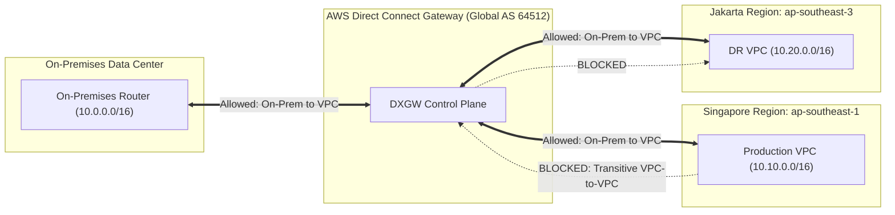

# Modul 17: AWS Direct Connect Gateway (DXGW) Multi-Account & Multi-Region Backbone

<BadgeLabel type="sme" text="Level: Principal / SME" /> <BadgeLabel type="rfc" text="RFC 4271 / RFC 7938 / Multi-Region Backbone" /> <BadgeLabel type="aws" text="AWS Direct Connect Gateway (DXGW)" />

**AWS Direct Connect Gateway (DXGW)** adalah komponen *control plane* global yang memungkinkan satu koneksi Direct Connect fisik di satu lokasi geografis untuk mengakses VPC dan Transit Gateway di seluruh AWS Region secara global (kecuali AWS China). DXGW menghilangkan keharusan menarik koneksi fisik sirkuit Direct Connect ke setiap Region terpisah. Namun, sebagai seorang SME Cloud Network Architect, Anda harus menguasai batasan kuota ketat, mekanika **Allowed Prefixes**, mitigasi benturan **Autonomous System Numbers (ASN)**, dan arsitektur otorisasi **Cross-Account** berskala enterprise.

---

## 1. Protocol Mechanics & RFC Theory

### A. Non-Transitive Routing Behavior pada DXGW
Satu prinsip dasar paling krusial pada AWS Direct Connect Gateway adalah: **DXGW adalah entitas non-transitif**.



- **Traffic yang Diizinkan**:
  1. On-Premises $\leftrightarrow$ VPC di Region Singapore (`ap-southeast-1`).
  2. On-Premises $\leftrightarrow$ VPC di Region Jakarta (`ap-southeast-3`).
- **Traffic yang DIBLOKIR secara Fisik Underlay**:
  - VPC Singapore $\leftrightarrow$ VPC Jakarta **TIDAK BISA** saling berkomunikasi melalui DXGW.
  - Untuk interkoneksi VPC-to-VPC antar-Region, arsitektur wajib menggunakan **Transit Gateway Inter-Region Peering** atau **AWS Cloud WAN**.

::: tip STANDAR BEST PRACTICE INDUSTRI (SME RECOMMENDATION)
Jangan pernah berasumsi bahwa menghubungkan beberapa VPC ke satu DXGW yang sama akan otomatis membentuk *mesh network* antar-VPC. Sifat non-transitif DXGW sengaja didesain oleh AWS untuk mencegah *traffic trombone* (di mana traffic antar-VPC cloud membebani sirkuit fisik on-premises) dan menjaga batas keamanan (*security blast radius*).
:::

---

### B. Mekanisme Allowed Prefixes Filtering & Summarization
Ketika sebuah Transit Gateway atau Virtual Private Gateway (VGW) di-associate ke DXGW, AWS secara default ingin meng-advertise seluruh subnet CIDR VPC yang terpasang. Namun, DXGW memiliki batasan ketat:

$$\sum \text{Allowed Prefixes Across Associations} \le 200 \text{ Prefixes per DXGW}$$

Jika Anda memiliki 50 VPC dengan masing-masing 5 subnet (`250 prefix`), mengasosiasikannya tanpa filtering akan memicu kegagalan asosiasi (*Association Error: Maximum allowed prefixes exceeded*).

```
Spoke VPC CIDRs:
├── VPC-01: 10.10.0.0/20 (Subnet 10.10.1.0/24, 10.10.2.0/24, ...)
├── VPC-02: 10.10.16.0/20
└── VPC-03: 10.10.32.0/20

DXGW Allowed Prefixes Filter (Injected to DXGW):
└── 10.10.0.0/16 (Single Supernet Summary Route Advertised to On-Premises BGP)
```

Dengan mengonfigurasi **Allowed Prefixes** di level asosiasi TGW/VGW, AWS hanya akan meng-advertise satu rute summary teragregasi (`10.10.0.0/16`) ke sesi BGP Direct Connect, menghemat kuota prefix dan menjaga stabilitas routing table router fisik on-premises.

---

## 2. AWS Global Backbone & Control Plane Internals

Direct Connect Gateway beroperasi di lapisan kontrol routing global AWS (*AWS Global Route Controllers*):
1. **Pemisahan Model Asosiasi (Mutual Exclusivity)**:
   - Satu DXGW dapat diasosiasikan ke **VGW (hingga 30 VPC)** ATAU ke **Transit Gateway (hingga 3 TGW)**.
   - Anda **TIDAK DAPAT MENGGABUNGKAN** asosiasi VGW dan Transit Gateway pada instans DXGW yang sama secara bersamaan.
2. **Aturan Alokasi Autonomous System Number (ASN)**:
   - DXGW memiliki ASN independen.
   - **Aturan Wajib**: ASN DXGW **HARUS BERBEDA** dari ASN On-Premises router, ASN Transit Gateway Region A, dan ASN Transit Gateway Region B.

$$\text{ASN}_{\text{On-Prem}} \ne \text{ASN}_{\text{DXGW}} \ne \text{ASN}_{\text{TGW-SG}} \ne \text{ASN}_{\text{TGW-JKT}}$$

Contoh Alokasi ASN Standar Enterprise:
- On-Premises Core BGP ASN: `65001`
- Direct Connect Gateway ASN: `64512`
- Transit Gateway Singapore ASN: `64513`
- Transit Gateway Jakarta ASN: `64514`

::: tip STANDAR BEST PRACTICE INDUSTRI (SME RECOMMENDATION)
Selalu gunakan alokasi skema ASN hierarkis privat 4-byte (misal: `4200000001` untuk DXGW, `4200010001` untuk TGW-SG, `4200010002` untuk TGW-JKT) jika enterprise Anda memiliki banyak departemen guna menghindari kehabisan alokasi ASN 2-byte (`64512 - 65534`).
:::

---

## 3. Resource Specifications & Hard Quotas

| Dimensi Parameter | Batasan Kuota (Quotas & Limits) | Catatan / Dampak Arsitektur |
|---|---|---|
| **Maksimum TGW per DXGW** | **3 Transit Gateways** | Hard Limit (Bisa lintas Region & Akun) |
| **Maksimum VGW per DXGW** | **30 Virtual Private Gateways** | Hard Limit (Khusus Private VIF model) |
| **Maksimum Allowed Prefixes per DXGW** | **200 Prefixes** | Total akumulasi dari seluruh TGW/VGW |
| **Maksimum Virtual Interfaces per DXGW** | **30 VIFs** | Private VIF atau Transit VIF |
| **Transit VIF per DXGW** | **Hingga 3 Transit VIF** | Terhubung ke dedicated/hosted DX connections |
| **Throughput Antar-Region via AWS Backbone** | Line-rate (Hingga 100 Gbps per sirkuit) | Enkripsi otomatis di backbone underlay AWS |

---

## 4. Hop-by-Hop Multi-Region Flow Lifecycle

```
[On-Premises Application Server in Jakarta DC: 10.0.5.20]
        |
        v
[On-Premises CE Router (AS 65001)]
        | 1. BGP Route Lookup: Destination 10.10.1.100 (AWS Singapore Prod)
        | 2. Next-Hop: DXGW BGP Peer (169.254.250.1)
        | 3. Egress 802.1Q Encapsulated Frame via Transit VIF (VLAN 200)
        v
[Equinix Singapore AWS DX Location (AS 7224)]
        | 4. DX Port terminates Layer 2; Ingress to DXGW Virtual Engine (AS 64512)
        v
[AWS Global Dedicated Backbone Network]
        | 5. DXGW matches Allowed Prefix: 10.10.0.0/16 -> Associated to TGW-SG (AS 64513)
        | 6. Inter-Region Encapsulation & Transport across AWS Optical Backbone
        v
[AWS Transit Gateway Singapore (ap-southeast-1)]
        | 7. TGW Route Table Lookup: Destination 10.10.1.100 -> Attachment VPC-Prod
        v
[Production VPC Subnet & Target EC2: 10.10.1.100]
```

---

## 5. Production Terraform IaC (Cross-Account Multi-Region Blueprint)

Berikut adalah blueprint produksi implementasi **Cross-Account DXGW ke Multi-Region Transit Gateway**:
- **Account A (Core Network Account)**: Memiliki Direct Connect Connection & Direct Connect Gateway.
- **Account B (Workload / Regional Network Account)**: Memiliki Transit Gateway Singapore (`ap-southeast-1`) dan Jakarta (`ap-southeast-3`).

```hcl
# ==============================================================================
# 1. CORE NETWORK ACCOUNT: Direct Connect Gateway Creation
# ==============================================================================
resource "aws_dx_gateway" "global_dxgw" {
  name            = "enterprise-global-dxgw"
  amazon_side_asn = "64512"
}

# ==============================================================================
# 2. REGIONAL WORKLOAD ACCOUNT: Propose TGW Association to DXGW
# ==============================================================================
# Provider Singapore
provider "aws" {
  alias  = "singapore"
  region = "ap-southeast-1"
}

# Transit Gateway di Singapore
resource "aws_ec2_transit_gateway" "tgw_sg" {
  provider        = aws.singapore
  description     = "Hub TGW Singapore"
  amazon_side_asn = "64513"

  tags = { Name = "tgw-primary-singapore" }
}

# Inisiasi Proposal Asosiasi Cross-Account dengan Allowed Prefixes
resource "aws_dx_gateway_association_proposal" "sg_proposal" {
  provider                  = aws.singapore
  dx_gateway_id             = aws_dx_gateway.global_dxgw.id
  dx_gateway_owner_account_id = aws_dx_gateway.global_dxgw.owner_account_id
  associated_gateway_id     = aws_ec2_transit_gateway.tgw_sg.arn

  # Wajib Summary Prefix untuk mencegah over-quota limit 200 routes!
  allowed_prefixes = [
    "10.10.0.0/16", # Singapore Production CIDR
    "10.20.0.0/16"  # Singapore Non-Production CIDR
  ]
}

# ==============================================================================
# 3. CORE NETWORK ACCOUNT: Accept Association Proposal
# ==============================================================================
resource "aws_dx_gateway_association" "accept_sg" {
  proposal_id           = aws_dx_gateway_association_proposal.sg_proposal.id
  dx_gateway_id         = aws_dx_gateway.global_dxgw.id
  associated_gateway_id = aws_ec2_transit_gateway.tgw_sg.arn
}
```

---

## 6. Failure Modes, Edge Cases & SEV-1 Troubleshooting Matrix

| Gejala Insiden (Symptom) | Root Cause Analysis (RCA) | Triage CLI & Verifikasi | Remediasi Permanen |
|---|---|---|---|
| **Association Proposal REJECTED / ERROR** | Allowed Prefixes melebihi 200 rute, atau terdapat overlapping CIDR yang bentrok dengan TGW lain di DXGW yang sama. | `aws directconnect describe-direct-connect-gateway-associations` $\to$ Cek status `failed`. | Periksa daftar `allowed_prefixes`; lakukan summarization menjadi prefix `/16` atau `/12` yang bebas dari konflik overlapping. |
| **BGP Session Reset: AS Path Loop** | ASN DXGW diset sama persis dengan ASN salah satu Transit Gateway atau On-Premises router. | `show ip bgp neighbors` pada router CE $\to$ Notification: *BGP Bad Peer AS*. | Rekonfigurasi ASN DXGW dan Transit Gateway agar seluruh node memiliki nilai ASN yang sepenuhnya unik. |
| **Traffic Drop pada Inter-Region Return Path** | Subnet VPC di Region B tidak memiliki rute kembali (*Return Route*) ke DXGW / Transit Gateway pada Route Table VPC lokal. | `aws ec2 describe-route-tables --filters "Name=vpc-id,Values=vpc-xxx"` | Tambahkan entri rute statis pada Route Table Subnet: `10.0.0.0/16` $\to$ `tgw-attach-xxxx`. |
| **DXGW Flapping Saat Maintenance Sirkuit** | Dual Transit VIF terpasang ke DXGW namun tidak ada konfigurasi Local Preference BGP, menyebabkan asimetri routing ekstrem. | `show ip bgp 10.10.0.0/16` $\to$ Cek fluktuasi best path. | Pasang BGP Community `7224:7300` (Primary) dan `7224:7100` (Secondary) pada router on-premises. |

---

## 7. Principal Architect Tradeoff Framework

```
                          [AWS HYBRID INTERCONNECT HUB]
                                        |
         +------------------------------+------------------------------+
         |                                                             |
         v                                                             v
 [Direct Connect Gateway + TGW]                               [AWS Cloud WAN (CNE)]
   - Max 3 TGW per DXGW                                         - Global Software-Defined WAN
   - Granular Route Table isolation                             - Central Declarative JSON Policy
   - Proven, Mature Architecture                                - Automated Segment Propagation
   - Complex scaling for > 4 Regions                            - Ideal for Massive Global Scale (> 4 Regions)
```

### Arsitektur Matrix: Standalone VGW vs DXGW + TGW vs Cloud WAN

| Parameter Evaluasi | Private VIF + VGW | DXGW + Transit Gateway (TGW) | AWS Cloud WAN Backbone |
|---|---|---|---|
| **Batas Skalabilitas VPC** | Max 1-30 VPC (Sangat terbatas) | **Ribuan VPC** (via TGW attachments) | Ribuan VPC (Global Core Network) |
| **Jangkauan Multi-Region** | Single Region per VGW | **Multi-Region Global** (hingga 3 TGW) | **Multi-Region Native Any-to-Any** |
| **Transitive VPC-to-VPC Routing** | Tidak Didukung | **Didukung Penuh** (via TGW Route Tables) | **Didukung Penuh** (via Segments) |
| **Biaya Data Processing** | Tidak ada biaya data TGW ($0.00/GB) | $0.02 / GB TGW Data Processing | $0.02 / GB Cloud WAN Data Processing |
| **Rekomendasi Arsitektur** | Single VPC Isolated Edge | **Standar Utama Enterprise 1-3 Regions** | **Standar Utama Global Scale > 3 Regions** |
