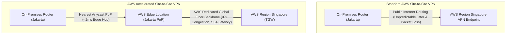
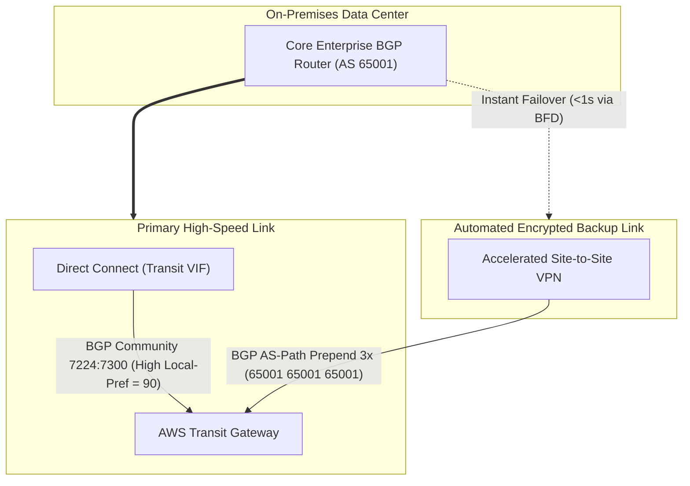

# Modul 18: AWS Site-to-Site VPN & Accelerated VPN

<BadgeLabel type="sme" text="Level: Principal / SME" /> <BadgeLabel type="rfc" text="RFC 7296 (IKEv2) / RFC 4303 (ESP) / RFC 3947 (NAT-T)" /> <BadgeLabel type="aws" text="AWS Accelerated Site-to-Site VPN" />

Meskipun *AWS Direct Connect* menjadi tulang punggung utama interkoneksi enterprise, **AWS Site-to-Site VPN** tetap menjadi pilar vital sebagai jalur cadangan terotomatisasi (*automated backup link*), konektivitas kantor cabang (*branch offices*), maupun interkoneksi terenkripsi cepat sebelum sirkuit fisik Direct Connect selesai di-provisioning. Dengan hadirnya **AWS Accelerated Site-to-Site VPN** yang ditenagai jaringan *Anycast Global Accelerator* dan kapabilitas **Equal-Cost Multi-Path (ECMP)**, seorang Principal Network Engineer dapat merancang arsitektur VPN dengan latensi terendah dan throughput agregat melampaui batas single-tunnel 1.25 Gbps.

---

## 1. Protocol Mechanics & RFC Theory

### A. Anatomi Kriptografi IPsec IKEv2 & ESP Tunnel Mode

Protokol IPsec IKEv2 (RFC 7296) mengamankan komunikasi melalui dua tahap negosiasi:

```
+-----------------------------------------------------------------------------------------------+
|                                  IPsec IKEv2 Negotiation Flow                                  |
|                                                                                               |
|  [Customer Gateway Router]                                    [AWS VPN Endpoint (Nitro Hub)]  |
|                                                                                               |
|  1. IKE_SA_INIT (UDP 500)   --------------------------------> Security Association Proposal   |
|     (DH Group 19/20, Nonce, SPI) <-------------------------------- (DH Public Key, Nonce, SPI)  |
|                                                                                               |
|  2. IKE_AUTH (UDP 4500)     --------------------------------> Pre-Shared Key (PSK) Auth      |
|     (Encrypted Identity + Auth)  <-------------------------------- (Encrypted AWS Auth Valid)  |
|                                                                                               |
|  3. CHILD_SA (ESP Traffic)  <===============================> Data Traffic Encrypted (ESP)    |
|     (AES-GCM-256, Rekeying)                                                                   |
+-----------------------------------------------------------------------------------------------+
```

#### Struktur Paket IPsec ESP Tunnel Mode (dengan NAT-Traversal):
Ketika router berada di belakang perangkat NAT on-premises, IPsec membungkus ESP di dalam header UDP port 4500 (RFC 3947):

```
+----------------+----------------+----------------+----------------+----------------+---------+
| New Outer IP   | UDP Port 4500  | ESP Header     | Original IP    | TCP / UDP      | ESP     |
| Header (20 B)  | Header (8 B)   | SPI + Seq (8B) | Header (20 B)  | Payload        | Trailer |
+----------------+----------------+----------------+----------------+----------------+---------+
|<----------------- Plaintext Outer Envelope ------>|<-------- AES-GCM-256 Encrypted -------->|
```

### B. Perhitungan MTU, IPsec Overhead & MSS Clamping
Enkripsi IPsec menambahkan *overhead* byte pada setiap paket, mereduksi payload efektif. Tanpa penyesuaian **TCP MSS (Maximum Segment Size)**, paket berukuran 1500 byte akan mengalami fragmentasi Layer 3 atau ter-drop jika *Don't Fragment (DF)* bit aktif (**PMTUD Black Hole**).

$$\text{IPsec ESP Overhead} = \underbrace{20}_{\text{Outer IP}} + \underbrace{8}_{\text{UDP NAT-T}} + \underbrace{8}_{\text{ESP Header}} + \underbrace{16}_{\text{IV/Nonce}} + \underbrace{16}_{\text{ICV/Auth}} + \underbrace{4}_{\text{Padding/PadLen}} = \mathbf{72\text{ Bytes}}$$

$$\text{Maksimum Safe MTU} = 1500 - 72 = \mathbf{1428\text{ Bytes}}$$
$$\text{Rekomendasi TCP MSS} = 1428 - 40 (\text{IP + TCP Header}) = \mathbf{1388\text{ Bytes} \dots 1375\text{ Bytes}}$$

::: tip STANDAR BEST PRACTICE INDUSTRI (SME RECOMMENDATION)
Selalu aktifkan **TCP MSS Clamping sebesar 1375 Bytes** pada physical dan tunnel interface router Customer Gateway (`ip tcp adjust-mss 1375`). Ini memberikan margin aman untuk mengakomodasi variasi enkripsi tambahan (seperti GRE atau VXLAN) dan mencegah insiden *silent packet drops* pada aplikasi TLS/HTTPS enterprise.
:::

---

## 2. AWS Distributed Underlay: Standard vs Accelerated VPN



### Keunggulan AWS Accelerated Site-to-Site VPN:
1. **Anycast Routing**: AWS mengalokasikan 2 buah alamat IP Publik Anycast global dari *AWS Global Accelerator*.
2. **Ingress di Edge PoP Terdekat**: Paket langsung masuk ke *Edge Location* AWS terdekat dari data center Anda (misal: Jakarta PoP), lalu melintasi jaringan optik backbone privat milik AWS langsung menuju Region tujuan (Singapore / Tokyo / US-East).
3. **Mereduksi Latensi & Jitter**: Menghilangkan *middle-mile internet routing hops* dari ISP publik pihak ketiga hingga $40\%-60\%$.

---

## 3. Resource Specifications, Limits & ECMP Scaling

| Parameter Teknis | Batasan Standard VPN | Accelerated VPN | ECMP Scaled via TGW |
|---|---|---|---|
| **Max Throughput per Tunnel** | **1.25 Gbps** (Nitro limits) | **1.25 Gbps** | **1.25 Gbps** per active tunnel |
| **Max Bandwidth per VPN Connection** | 2.5 Gbps (2 Tunnels) | 2.5 Gbps (2 Tunnels) | **Hingga 50 Gbps** (Multi-Attachment ECMP) |
| **BGP Dynamic Routing** | Didukung (ASN 64512-65534) | Didukung | Didukung (Equal Cost Routes) |
| **BFD Support** | Didukung (300ms) | Didukung (300ms) | Didukung (300ms) |
| **Routing Algorithm** | Static / BGP-4 | Static / BGP-4 | **BGP Multi-Path (ECMP)** |

::: tip STANDAR BEST PRACTICE INDUSTRI (SME RECOMMENDATION)
Setiap koneksi AWS VPN terdiri dari **2 buah tunnel independen** yang diterminasi pada dua Availability Zone terpisah di sisi AWS. Pastikan router Customer Gateway Anda mengaktifkan **kedua tunnel secara simultan dengan BGP** untuk menjamin *automatic failover* sub-detik tanpa intervensi manual jika terjadi pemeliharaan underlay di salah satu AZ AWS.
:::

---

## 4. Hop-by-Hop Packet Walkthrough & Flow Lifecycle

```
[On-Premises App Server: 10.0.1.25]
        |
        v
[Customer Edge Gateway (Cisco ASR / Strongswan)]
        | 1. Route Table Lookup: Destination 10.100.1.50 -> Tunnel Interface (Next-Hop 169.254.10.1)
        | 2. TCP MSS Clamped to 1375 Bytes
        | 3. IPsec Engine Encapsulation: ESP Tunnel Mode (AES-GCM-256)
        | 4. Outer IP Header: Src=CE_Public_IP, Dst=AWS_Anycast_IP_1
        v
[Nearest AWS Edge Location (Jakarta Anycast PoP)]
        | 5. Packet enters AWS Global Backbone
        | 6. Routed across AWS Congestion-Free Underlay to ap-southeast-1
        v
[AWS Transit Gateway (TGW) Singapore - VPN Attachment Hub]
        | 7. Decrypt ESP Payload in Nitro Security Core
        | 8. BGP Verification: Route match Destination 10.100.1.50 -> Spoke VPC Attachment
        v
[Target Spoke VPC & EC2 Instance: 10.100.1.50]
```

---

## 5. Production Terraform IaC & Customer Router Configuration

### A. Terraform: AWS Accelerated Site-to-Site VPN dengan TGW Attachment & ECMP

```hcl
# 1. Customer Gateway (Representing On-Premises Router)
resource "aws_customer_gateway" "onprem_cgw" {
  bgp_asn    = 65001
  ip_address = "203.0.113.10" # Public IP Router On-Premises
  type       = "ipsec.1"

  tags = {
    Name = "cgw-enterprise-jakarta-dc"
  }
}

# 2. AWS Transit Gateway with VPN ECMP Enabled
resource "aws_ec2_transit_gateway" "main_tgw" {
  description      = "Main Hub Transit Gateway"
  amazon_side_asn  = "64512"
  vpn_ecmp_support = "enable" # MANDATORY for Multi-Tunnel Bandwidth Scaling

  tags = {
    Name = "tgw-primary-hub"
  }
}

# 3. Accelerated Site-to-Site VPN Connection
resource "aws_vpn_connection" "accelerated_vpn" {
  customer_gateway_id   = aws_customer_gateway.onprem_cgw.id
  transit_gateway_id    = aws_ec2_transit_gateway.main_tgw.id
  type                  = "ipsec.1"
  enable_acceleration   = true # Enable AWS Global Accelerator Anycast Edge
  tunnel_inside_ip_version = "ipv4"

  # Tunnel 1 Configuration
  tunnel1_inside_cidr   = "169.254.10.0/30"
  tunnel1_preshared_key = "EnterpriseSecretPSK2026Vol1!"
  tunnel1_ike_versions  = ["ikev2"]
  tunnel1_phase1_encryption_algorithms = ["AES256-GCM-16"]
  tunnel1_phase1_integrity_algorithms  = ["SHA2-384"]
  tunnel1_phase1_dh_group_numbers      = [19, 20]
  tunnel1_phase2_encryption_algorithms = ["AES256-GCM-16"]
  tunnel1_phase2_integrity_algorithms  = ["SHA2-384"]
  tunnel1_phase2_dh_group_numbers      = [19, 20]

  # Tunnel 2 Configuration
  tunnel2_inside_cidr   = "169.254.11.0/30"
  tunnel2_preshared_key = "EnterpriseSecretPSK2026Vol2!"
  tunnel2_ike_versions  = ["ikev2"]

  tags = {
    Name = "vpn-accelerated-primary-hybrid"
  }
}
```

### B. Cisco IOS-XE Accelerated VPN with BGP & ECMP Configuration

```cisco
! 1. IPsec Crypto Proposal (IKEv2)
crypto ikev2 proposal AWS-IKEV2-PROPOSAL
 encryption aes-gcm-256
 prf sha384
 group 19 20

crypto ikev2 policy AWS-IKEV2-POLICY
 proposal AWS-IKEV2-PROPOSAL

! 2. IPsec Profile & Transform Set
crypto ipsec transform-set AWS-TRANSFORM-SET esp-gcm 256
 mode tunnel

crypto ipsec profile AWS-IPSEC-PROFILE
 set transform-set AWS-TRANSFORM-SET
 set ikev2-policy AWS-IKEV2-POLICY

! 3. Tunnel Interfaces dengan TCP MSS Clamping & BFD
interface Tunnel1
 description AWS-VPN-Tunnel-1
 ip address 169.254.10.2 255.255.255.252
 ip tcp adjust-mss 1375
 tunnel source GigabitEthernet0/0/0
 tunnel mode ipsec ipv4
 tunnel destination <AWS_Anycast_IP_1>
 tunnel protection ipsec profile AWS-IPSEC-PROFILE

interface Tunnel2
 description AWS-VPN-Tunnel-2
 ip address 169.254.11.2 255.255.255.252
 ip tcp adjust-mss 1375
 tunnel source GigabitEthernet0/0/0
 tunnel mode ipsec ipv4
 tunnel destination <AWS_Anycast_IP_2>
 tunnel protection ipsec profile AWS-IPSEC-PROFILE

! 4. BGP Routing dengan Dual-Tunnel ECMP Multipath
router bgp 65001
 maximum-paths 2
 neighbor 169.254.10.1 remote-as 64512
 neighbor 169.254.10.1 fall-over bfd
 neighbor 169.254.11.1 remote-as 64512
 neighbor 169.254.11.1 fall-over bfd
```

---

## 6. Failure Modes, Edge Cases & SEV-1 Troubleshooting Matrix

| Gejala Insiden (Symptom) | Root Cause Analysis (RCA) | Triage CLI & Verifikasi | Remediasi Permanen |
|---|---|---|---|
| **IKE SA State DOWN (NO_PROPOSAL_CHOSEN)** | Ketidakcocokan enkripsi Phase 1/Phase 2 (misal: AWS menunggu AES-GCM-256, CE mengirimkan AES-CBC-128). | `show crypto ikev2 sa` $\to$ State kosong atau *Negotiation Failed*. | Selaraskan IKEv2 Proposal, DH Groups (Group 19), dan Cipher Suite antara router CE dan AWS VPN options. |
| **Aplikasi Web Hang / Dropping Besar (PMTUD Trap)** | Ukuran paket melebihi batas MTU IPsec (1428 byte) dan DF bit aktif, sementara ICMP Type 3 Code 4 diblokir firewall. | `ping 10.100.1.50 size 1450 df-bit` $\to$ *Packet needs to be fragmented but DF set*. | Pasang `ip tcp adjust-mss 1375` pada seluruh tunnel interface; izinkan ICMP Type 3 Code 4 di firewall perimeter. |
| **Routing Loop Saat Direct Connect Failover** | Direct Connect putus, namun router on-premise tetap memprioritaskan default route ke DX karena static route floating metric salah. | `show ip route 10.100.0.0` $\to$ Next-hop masih mengarah ke interface DX yang down. | Gunakan **BGP Dynamic Routing di kedua jalur**; hindari static routing campuran tanpa IP SLA tracking. |
| **Asimetris Routing (Traffic Out via DX, Return via VPN)** | AWS meng-advertise prefix spesifik via VPN dan prefix summary via DX, atau AS-Path length tidak diset seimbang. | `show ip bgp 10.100.0.0/16` $\to$ Cek AS-Path dan Local Preference di kedua jalur. | Pasang BGP Local Preference `7224:7300` di DX dan `7224:7100` di VPN; atau pasang AS-Path Prepend $3\times$ di rute VPN. |

---

## 7. Principal Architect Tradeoff Framework

```
                          [HYBRID CONNECTIVITY SELECTION]
                                         |
         +-------------------------------+-------------------------------+
         |                               |                               |
         v                               v                               v
 [Standard Site-to-Site VPN]     [Accelerated Site-to-Site VPN]    [AWS Direct Connect]
   - Public Internet path          - AWS Anycast Global Backbone     - Dedicated Single-Mode Fiber
   - Cost: $0.05/hour/conn         - Cost: $0.05/hr + $0.025/hr Accel- Zero Latency Jitter
   - Throughput: 1.25 Gbps/tun     - 40% lower latency & jitter      - Up to 400 Gbps Bandwidth
   - Ideal: Low-cost branch        - Ideal: Global branch & critical - Ideal: High throughput & L2 MACsec
```

### Hybrid Failover Architecture: Direct Connect Primary + Automated VPN Backup


