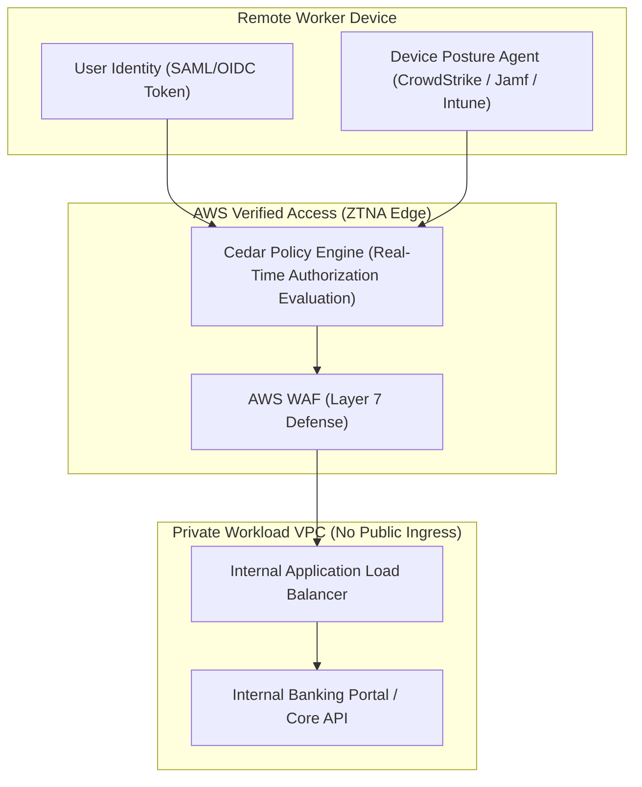

# Modul 19: AWS Client VPN & AWS Verified Access (Zero Trust Network Access)

<BadgeLabel type="sme" text="Level: Principal / SME" /> <BadgeLabel type="rfc" text="NIST SP 800-207 / RFC 5280 (mTLS) / SAML 2.0" /> <BadgeLabel type="aws" text="AWS Client VPN & AWS Verified Access" />

Kebutuhan akses kerja jarak jauh (*remote workforce*) dan integrasi pihak ketiga (*third-party contractors*) telah mengubah lanskap keamanan jaringan perusahaan. Pendekatan tradisional berbasis *tunnel* jaringan (seperti **AWS Client VPN**) yang memberikan akses jaringan Layer 3 luas mulai bertransformasi ke paradigma **Zero Trust Network Access (ZTNA)** melalui **AWS Verified Access (AVA)**. Modul ini membedah arsitektur protokol, evaluasi *device posture* berbasis standar **NIST SP 800-207**, implementasi **Cedar Policy Language**, serta strategi migrasi jaringan privat enterprise modern.

---

## 1. Protocol Mechanics & RFC Theory

### A. AWS Client VPN: OpenVPN & Transport Encapsulation
AWS Client VPN dibangun di atas protokol **OpenVPN (Layer 4 TLS over UDP/TCP)**:
- Menggunakan **UDP port 443** (default) atau **TCP port 443** untuk menembus firewall korporat yang membatasi protokol UDP.
- **Autentikasi Ganda (Dual-Factor)**:
  1. **Mutual TLS (mTLS - RFC 5280)**: Validasi sertifikat digital X.509 klien dan server yang dikelola melalui AWS Certificate Manager (ACM).
  2. **SAML 2.0 Federated Identity**: Autentikasi berbasis token IDP (seperti Okta, Microsoft Entra ID / Azure AD, PingFederate).

```
+-----------------------------------------------------------------------------------------------+
|                             Client VPN Packet Flow & SNAT Engine                              |
|                                                                                               |
|  [Remote Laptop]                      [Client VPN Subnet ENI]          [Target Application]   |
|  Client IP: 10.250.0.45               Private ENI: 10.10.1.200         Private IP: 10.10.2.50 |
|                                                                                               |
|  +-------------------------+          +-------------------------+                             |
|  | OpenVPN Tunnel          | =======> | AWS Hyperplane SNAT     | --------------------------> |
|  | Src: 10.250.0.45        |          | Src IP Translated To:   | Ingress IP: 10.10.1.200     |
|  | Dst: 10.10.2.50         |          | 10.10.1.200 (ENI IP)    |                             |
|  +-------------------------+          +-------------------------+                             |
+-----------------------------------------------------------------------------------------------+
```

::: tip STANDAR BEST PRACTICE INDUSTRI (SME RECOMMENDATION)
Selalu aktifkan **Split-Tunnel** pada AWS Client VPN. Pada mode default (*Full-Tunnel*), seluruh traffic internet dari laptop karyawan (termasuk streaming video dan update OS) akan dialirkan melalui VPC AWS, menguras kapasitas NAT Gateway dan memicu lonjakan biaya *Egress Data Transfer* yang tidak perlu.
:::

---

### B. AWS Verified Access (AVA): Zero Trust Architecture (NIST SP 800-207)
Berbeda dari VPN yang memberikan akses berbasis jaringan (Layer 3), **AWS Verified Access** beroperasi tanpa tunnel (*tunnel-less reverse proxy*) di Layer 7 HTTP/HTTPS:
- **No Ingress Port Exposure**: Aplikasi privat di dalam VPC tidak memiliki IP publik atau port yang terbuka ke internet.
- **Per-Request Evaluation**: Setiap request HTTP dievaluasi secara individual secara *real-time* terhadap identitas user dan skor postur keamanan perangkat.



---

## 2. Cedar Policy Language Deep-Dive

AWS Verified Access menggunakan bahasa kebijakan deklaratif **Cedar** yang bersifat *formally verifiable*, cepat, dan deterministik.

```cedar
// Kebijakan Cedar: Akses Aplikasi Core Finansial
permit(principal, action, resource)
when {
    // 1. Validasi Keanggotaan Grup Identity Provider (Okta / Entra ID)
    context.identity.groups.contains("Finance-Engineers") &&
    context.identity.email.endsWith("@enterprise-bank.com") &&

    // 2. Evaluasi Postur Perangkat (CrowdStrike Zero Trust Assessment Score)
    context.crowdstrike.assessment.overall >= 80 &&
    context.crowdstrike.os.version == "macOS 15.0" &&

    // 3. Validasi Device Compliance Status (Jamf / Microsoft Intune)
    context.jamf.device.is_compromised == false
};
```

---

## 3. Resource Specifications, Limits & Architecture Comparison

| Parameter Evaluasi | AWS Client VPN | AWS Verified Access (ZTNA) |
|---|---|---|
| **Lapisan Akses (OSI Layer)** | **Layer 3 (IP Packet Level)** | **Layer 7 (HTTP/HTTPS / TLS Application)** |
| **Model Koneksi** | Tunnel-based (OpenVPN Client App) | **Tunnel-less (Browser / Native HTTP Clients)** |
| **Alokasi IP Address** | Membutuhkan Client CIDR khusus (misal: `10.250.0.0/16`) | **Zero IP Address Overhead** (Reverse Proxy) |
| **Evaluasi Keamanan** | Autentikasi awal saat pembentukan tunnel | **Evaluasi granular pada setiap request HTTP** |
| **Dukungan Protokol** | Seluruh protokol IP (TCP, UDP, ICMP, SSH, RDP) | Khusus HTTP / HTTPS (Web apps, REST APIs, WebSockets) |
| **Device Posture Integration** | Terbatas (Third-party custom posture) | **Native (CrowdStrike, Jamf, Intune, JumpCloud)** |

---

## 4. Hop-by-Hop Flow Lifecycle (Verified Access)

```
[User Browser: Initiates Request to internal-portal.corp.com]
        |
        v
[Amazon Route 53 Public Anycast DNS]
        | 1. Resolves internal-portal.corp.com -> AWS Verified Access Public Endpoint IP
        v
[AWS Verified Access Edge Proxy]
        | 2. Intercepts Request; Checks for Valid AVA Session Cookie
        | 3. Redirects to Enterprise Identity Provider (Okta / Entra ID) via OIDC Authorization Code Flow
        | 4. User completes MFA; IDP issues Signed ID Token (JWT)
        | 5. Collects Device Posture Telemetry from CrowdStrike Agent via Browser Extension / ZTA API
        | 6. Executes Cedar Policy Engine: Evaluates User Groups + Device Health Score
        v
[Policy Match: ALLOW]
        | 7. Proxies Secure HTTPS Request to Internal Application Load Balancer via Hyperplane PrivateLink
        v
[Internal Microservice / Banking Portal EC2 Instance]
```

---

## 5. Production Terraform IaC Implementation

### A. Terraform: AWS Verified Access (AVA Instance, Trust Provider & Cedar Policy)

```hcl
# 1. AWS Verified Access Instance
resource "aws_verifiedaccess_instance" "enterprise_ava" {
  description = "Enterprise Global Zero Trust Network Access Instance"
  tags = {
    Name = "ava-enterprise-core"
  }
}

# 2. User Trust Provider (OIDC / Okta Integration)
resource "aws_verifiedaccess_trust_provider" "okta_idp" {
  description              = "Okta Enterprise Workforce Identity Provider"
  policy_reference_name    = "identity"
  trust_provider_type      = "user"
  user_trust_provider_type = "oidc"

  oidc_options {
    issuer                   = "https://enterprise-auth.okta.com/oauth2/default"
    authorization_endpoint   = "https://enterprise-auth.okta.com/oauth2/default/v1/authorize"
    token_endpoint           = "https://enterprise-auth.okta.com/oauth2/default/v1/token"
    user_info_endpoint       = "https://enterprise-auth.okta.com/oauth2/default/v1/userinfo"
    client_id                = "0oaxxxxxxxAWSClient"
    client_secret            = "EnterpriseSecretClientToken2026!"
    scope                    = "openid email profile groups"
  }
}

# 3. Attach Trust Provider to AVA Instance
resource "aws_verifiedaccess_instance_trust_provider_attachment" "okta_attach" {
  verifiedaccess_instance_id       = aws_verifiedaccess_instance.enterprise_ava.id
  verifiedaccess_trust_provider_id = aws_verifiedaccess_trust_provider.okta_idp.id
}

# 4. Verified Access Group with Cedar Policy Document
resource "aws_verifiedaccess_group" "finance_group" {
  verifiedaccess_instance_id = aws_verifiedaccess_instance.enterprise_ava.id
  description                = "Finance Application Secure Access Group"

  policy_document = <<-EOT
    permit(principal, action, resource)
    when {
        context.identity.groups.contains("Finance-Engineers") &&
        context.identity.email.endsWith("@enterprise-bank.com")
    };
  EOT

  tags = {
    Name = "ava-group-finance"
  }
}

# 5. Verified Access Endpoint (Targeting Internal Application Load Balancer)
resource "aws_verifiedaccess_endpoint" "finance_portal" {
  verifiedaccess_group_id = aws_verifiedaccess_group.finance_group.id
  application_domain      = "finance-portal.corp.enterprise-bank.com"
  attachment_type         = "vpc"
  domain_certificate_arn  = "arn:aws:acm:ap-southeast-1:123456789012:certificate/xxxx-xxxx"
  endpoint_type           = "load-balancer"
  endpoint_domain_prefix  = "finapp"
  security_group_ids      = ["sg-0123456789abcdef0"]

  load_balancer_options {
    load_balancer_arn = "arn:aws:elasticloadbalancing:ap-southeast-1:123456789012:loadbalancer/app/internal-fin-alb/xxxx"
    port              = 443
    protocol          = "https"
    subnet_ids        = ["subnet-01a", "subnet-01b"]
  }
}
```

---

## 6. Failure Modes, Edge Cases & SEV-1 Troubleshooting Matrix

| Gejala Insiden (Symptom) | Root Cause Analysis (RCA) | Triage CLI & Verifikasi | Remediasi Permanen |
|---|---|---|---|
| **Client VPN: Traffic Blackhole pada Subnet Spoke** | Subnet Client CIDR bentrok dengan CIDR Spoke VPC, atau tabel otorisasi (*Authorization Rules*) belum mengizinkan subnet target. | `aws ec2 describe-client-vpn-authorization-rules` $\to$ Rule missing. | Alokasikan Client CIDR yang unik (misal: `100.64.0.0/16` CGNAT); tambahkan Authorization Rule eksplisit untuk seluruh CIDR target. |
| **Verified Access: HTTP 403 Forbidden pada Valid Users** | Klaim grup pada token IDP (Okta JWT) tidak cocok dengan string nama grup di klausa Cedar Policy. | Periksa AVA Access Logs di CloudWatch $\to$ Evaluasi `policy_eval_result: DENY`. | Samakan nama klaim grup antara IDP Attribute Mapping dan Cedar script (`context.identity.groups`). |
| **Client VPN: CPU Spike & Connection Drops** | Seluruh client diterminasi pada satu Availability Zone tunggal tanpa multi-AZ Association. | `aws ec2 describe-client-vpn-target-networks` $\to$ Hanya 1 subnet terasosiasi. | Asosiasikan Client VPN Endpoint ke minimal 2 subnet di Availability Zone yang berbeda untuk load balancing otomatis. |
| **OIDC Handshake Timeout pada AVA** | AVA Endpoint tidak dapat mengakses endpoint IDP token karena Private DNS resolution gagal atau HTTPS diblokir outbound. | Cek Route 53 Resolver outbound logs. | Pastikan VPC NAT Gateway atau Public Internet Route aktif untuk resolving public IDP domain. |

---

## 7. Principal Architect Tradeoff Framework

```
                          [REMOTE ACCESS ARCHITECTURE]
                                       |
         +-----------------------------+-----------------------------+
         |                                                           |
         v                                                           v
 [AWS Client VPN]                                            [AWS Verified Access]
   - Broad Network Access (L3)                                 - Zero Trust Least Privilege (L7)
   - Good for Legacy Non-HTTP (DB, SSH)                        - Ideal for Modern Web & APIs
   - Requires Client Software (OpenVPN)                        - Zero Client Software (Browser Native)
   - Fixed Client CIDR Management                              - No IP Address Overhead
```

### Strategic Co-Existence Architecture:
Enterprise skala besar menerapkan **Hybrid Dual-Strategy**:
1. **AWS Verified Access (AVA)** sebagai pintu gerbang utama $90\%$ pengguna (akses web portals, dashboards, dan API internal).
2. **AWS Client VPN** dipagari ketat dan hanya dibuka untuk $10\%$ staf teknis (*Database Administrators & Cloud Infrastructure SMEs*) yang membutuhkan koneksi *raw* Layer 3 (seperti PostgreSQL TCP 5432, SSH TCP 22, atau Kubernetes API raw access) dengan otentikasi hardware MFA.
