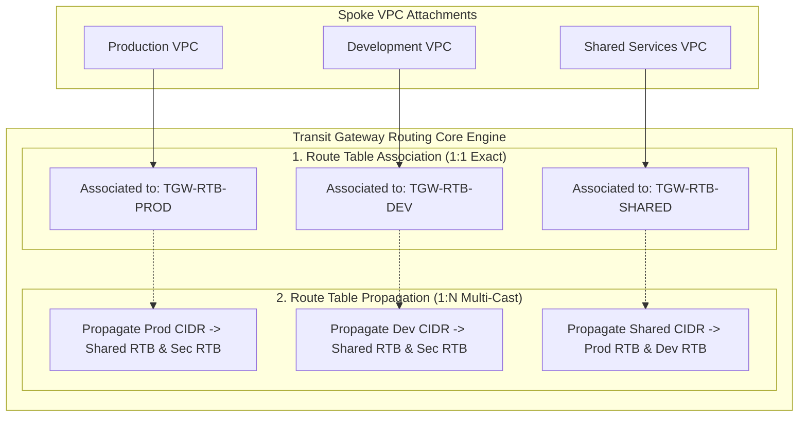

# Modul 20: AWS Transit Gateway (TGW) Core Routing & Hub-and-Spoke

<BadgeLabel type="sme" text="Level: Principal / SME" /> <BadgeLabel type="rfc" text="RFC 7938 / Hyperplane SDN / Hub-and-Spoke" /> <BadgeLabel type="aws" text="AWS Transit Gateway (TGW)" />

Ketika skala arsitektur cloud berkembang melampaui puluhan VPC, model koneksi titik-ke-titik (*point-to-point*) menggunakan **VPC Peering** menjadi tidak dapat dipertahankan karena kompleksitas kuadratik $O(N^2)$ (100 VPC membutuhkan $\frac{100 \times 99}{2} = 4,950$ koneksi peering). **AWS Transit Gateway** (<NetworkTerm term="TGW" />) hadir sebagai *Regional Virtual Router* terdistribusi yang ditenagai oleh mesin **AWS Hyperplane**. Modul ini membedah mekanika perutean *Hub-and-Spoke*, segregasi *multi-tenant* route table, *blackhole route prevention*, dan interkoneksi backbone lintas region (*TGW Inter-Region Peering*).

## 🏛️ Socratic Dilemma: The Quadratic Full-Mesh Collapse

::: tip THE ENGINEERING DILEMMA (FIRST-PRINCIPLES HOOK)
*   **The Naïve Solution**: Menghubungkan setiap VPC secara langsung menggunakan VPC Peering gratis tanpa gateway sentral.
*   **The Quadratic Scaling Wall**: Pada 10 VPC, dibutuhkan 45 peering links. Pada 100 VPC, dibutuhkan **4,950 peering links**. Selain itu, VPC Peering bersifat **non-transitive** (VPC A tidak bisa berbicara ke VPC C melalui VPC B). Mengelola ribuan entri rute statis di 100 route table yang berbeda adalah mimpi buruk operasional yang mustahil dipertahankan.
*   **The Architecture Invariant**: **"Decouple Ingress Lookup from Egress Reachability."** AWS Transit Gateway memecah perutean menjadi dua konsep terpisah: **Association (1:1)** menentukan tabel mana yang mengevaluasi paket dari spoke, sedangkan **Propagation (1:N)** menentukan ke tabel mana prefix spoke diiklankan.
:::

---

## 1. Protocol Mechanics & RFC Theory

### A. Konsep Hub-and-Spoke & Model Asosiasi Perutean
AWS Transit Gateway memisahkan alur kontrol perutean melalui dua konsep fundamental:



1. **Route Table Association (Relasi 1:1)**:
   - Setiap *attachment* (VPC, VPN, Direct Connect, atau Peering) **hanya dapat diasosiasikan ke tepat SATU** TGW Route Table.
   - Menentukan tabel rute mana yang digunakan TGW saat paket tiba dari attachment tersebut.
2. **Route Table Propagation (Relasi 1:N)**:
   - Satu *attachment* dapat mempropagasi rute CIDR-nya ke **BANYAK** TGW Route Table sekaligus.
   - Memungkinkan otomatisasi *route advertisement* tanpa perlu menulis rute statis secara manual di puluhan tabel.
3. **Blackhole Routes**:
   - Terjadi ketika sebuah rute statis atau terpropagasi di TGW mengarah ke *Attachment ID* yang telah dihapus atau berada dalam status `unreachable`. TGW akan secara *silent* membuang paket tersebut (Drop with Counter).

::: tip STANDAR BEST PRACTICE INDUSTRI (SME RECOMMENDATION)
Saat membuat AWS Transit Gateway untuk enterprise, **SELALU nonaktifkan `Default Route Table Association` dan `Default Route Table Propagation`**. Jika dibiarkan aktif (default konsol), seluruh VPC yang di-attach akan otomatis saling terhubung (*flat any-to-any network*), melanggar prinsip isolasi keamanan PCI-DSS dan SOC-2.
:::

<ClientOnly>
  <ConceptCheckpoint
    title="Pause & Predict: The TGW Association vs Propagation Disconnect"
    badge="Socratic Systems Question"
    scenario="Seorang engineer membuat VPC Dev dan menghubungkannya ke TGW via VPC Attachment. Engineer tersebut mengasosiasikan (Associate) attachment tersebut ke TGW Route Table 'TGW-RT-DEV'. Namun, saat EC2 di VPC Dev mengirim request ke database di VPC Shared Services, koneksi gagal total (100% loss). Route Table subnet di VPC Dev sudah mengarahkan 10.0.0.0/8 ke tgw-attach-dev. Mengapa paket di-drop di TGW?"
    :options="[
      {
        id: 'A',
        text: 'VPC Dev membutuhkan peering langsung ke Shared Services VPC.',
        isCorrect: false,
        feedback: 'Salah. Transit Gateway dirancang untuk menggantikan peering langsung.'
      },
      {
        id: 'B',
        text: 'Asosiasi (Association) hanya menentukan tabel mana yang dipakai untuk mengevaluasi paket MASUK dari Dev. Jika rute Shared Services belum di-propagate ke TGW-RT-DEV dan rute Dev belum di-propagate ke TGW-RT-SHARED, paket forward dan return akan di-drop.',
        isCorrect: true,
        feedback: 'Tepat! Asosiasi adalah relasi 1:1 untuk incoming packet lookup. Agar paket bisa diteruskan, TGW-RT-DEV harus memiliki rute target (via Propagation atau Static Route). Selain itu, rute balik menuju VPC Dev juga harus terdaftar pada TGW Route Table yang diasosiasikan ke Shared Services VPC.'
      },
      {
        id: 'C',
        text: 'TGW hanya mendukung protokol UDP, bukan TCP.',
        isCorrect: false,
        feedback: 'Salah. TGW adalah L3 virtual router yang mendukung TCP, UDP, dan ICMP.'
      }
    ]"
    explanation="TGW routing adalah proses evaluasi dua arah (Forward & Return path). Setiap arah membutuhkan lookup pada TGW Route Table terkait yang harus memiliki entri rute aktif."
    invariant="Invariant TGW Routing: Association (1:1) = Tabel Lookup Masuk. Propagation (1:N) = Iklankan Prefix ke Tabel Lain. Komunikasi dua arah membutuhkan rute forward DAN rute return."
  />
</ClientOnly>

---

## 2. AWS Distributed Underlay & Hyperplane Virtual Router

Transit Gateway tidak berupa perangkat router monolitik tunggal (*single virtual appliance*). Di balik layar, TGW diimplementasikan sebagai **kumpulan cluster server software-defined networking (SDN) terdistribusi yang disebut AWS Hyperplane**:

```
+-----------------------------------------------------------------------------------------------+
|                             AWS Hyperplane TGW Underlay Mesh                                  |
|                                                                                               |
|  [Spoke VPC: ap-southeast-1a]                     [Transit Subnet: ap-southeast-1a]           |
|  EC2 Workload (10.10.1.50)                        Dedicated Transit ENI (tgw-attach-xxx)      |
|         |                                                        |                            |
|         +========================================================+                            |
|                                     |                                                         |
|                                     v                                                         |
|         +--------------------------------------------------------+                            |
|         | Hyperplane Flow Tracking & Stateless Router Core Nodes |                            |
|         | - 50 Gbps Burst Bandwidth per VPC Attachment           |                            |
|         | - Cross-AZ Micro-Encapsulated Underlay Mesh            |                            |
|         +--------------------------------------------------------+                            |
|                                     |                                                         |
|         +========================================================+                            |
|         |                                                        |                            |
|  [Spoke VPC: ap-southeast-1b]                     [Transit Subnet: ap-southeast-1b]           |
|  EC2 Workload (10.20.1.80)                        Dedicated Transit ENI (tgw-attach-yyy)      |
+-----------------------------------------------------------------------------------------------+
```

### Karakteristik Underlay Hyperplane TGW:
- **Throughput Otomatis**: Mendukung burst hingga **50 Gbps** per VPC attachment.
- **Cross-AZ Traffic Pinning**: Paket yang dikirim dari AZ-a di VPC sumber akan diproses oleh Hyperplane node di AZ-a, lalu ditransmisikan langsung ke Transit ENI di AZ target.
- **Dedicated Transit Subnet**: Wajib mengalokasikan subnet khusus berukuran `/28` di setiap AZ per VPC untuk penempatan *Transit Gateway Elastic Network Interface (TGW ENI)*.

---

## 3. Resource Specifications, MTU Hierarchy & Hard Quotas

| Dimensi Parameter | Batasan Kuota (Quotas & Limits) | Catatan / Dampak Arsitektur |
|---|---|---|
| **Maksimum Attachments per TGW** | **5,000 Attachments** | Mencakup VPC, VPN, DX, dan Peering |
| **Maksimum Routes per Route Table** | **10,000 Routes** | Akumulasi rute statis & terpropagasi |
| **Maksimum TGW Route Tables** | **20 Route Tables per TGW** | Default (dapat dinaikkan via AWS Quotas) |
| **Throughput per VPC Attachment** | **50 Gbps Burst** | Terdistribusi merata di seluruh active AZ |
| **Throughput per VPN Attachment** | 1.25 Gbps per tunnel | Hingga 50 Gbps dengan ECMP |
| **MTU: Intra-Region VPC Attachment** | **9001 Bytes (Jumbo Frame)** | Line-rate jumbo frames antar-VPC |
| **MTU: Inter-Region TGW Peering** | **8500 Bytes** | Dibatasi enkripsi backbone underlay AWS |

---

## 4. Hop-by-Hop Multi-Tenant Flow Lifecycle

```
[Production Workload: 10.10.1.50 in AZ-1a]
        |
        v
[VPC Subnet Route Table (rtb-app)]
        | 1. Matches 0.0.0.0/0 -> Target: Transit Gateway Attachment (tgw-attach-prod)
        v
[VPC Transit Subnet Dedicated ENI in AZ-1a]
        | 2. Packet transferred across AWS Nitro Underlay into TGW Hyperplane Engine
        v
[TGW Hyperplane Router (TGW Route Table: tgw-rtb-prod)]
        | 3. Route Lookup: Destination 10.20.1.80 matches Propagated Route -> tgw-attach-dev
        | 4. Policy Check: If tgw-rtb-prod has no route to Dev, packet is DROPPED (Isolation)
        | 5. If Allowed: Hyperplane encapsulates packet and forwards to AZ-1b Transit ENI
        v
[Development VPC Transit Subnet Dedicated ENI in AZ-1b]
        | 6. Ingress to Target VPC
        v
[Development Workload: 10.20.1.80]
```

---

## 5. Production Terraform IaC Implementation

Blueprint arsitektur enterprise: **Hub TGW dengan Segregasi 4 Route Tables (Production, Non-Production, Shared Services, & Central Inspection)**:

```hcl
# 1. AWS Transit Gateway Core
resource "aws_ec2_transit_gateway" "core_tgw" {
  description                     = "Enterprise Core Hub Transit Gateway"
  auto_accept_shared_attachments  = "disable"
  default_route_table_association = "disable" # SME Rule: Strict Isolation
  default_route_table_propagation = "disable" # SME Rule: Strict Isolation
  dns_support                     = "enable"
  vpn_ecmp_support                = "enable"
  amazon_side_asn                 = 64512

  tags = {
    Name        = "tgw-enterprise-hub"
    Environment = "Production"
  }
}

# 2. Segregated TGW Route Tables
resource "aws_ec2_transit_gateway_route_table" "prod_rt" {
  transit_gateway_id = aws_ec2_transit_gateway.core_tgw.id
  tags               = { Name = "tgw-rtb-production" }
}

resource "aws_ec2_transit_gateway_route_table" "nonprod_rt" {
  transit_gateway_id = aws_ec2_transit_gateway.core_tgw.id
  tags               = { Name = "tgw-rtb-non-production" }
}

resource "aws_ec2_transit_gateway_route_table" "shared_rt" {
  transit_gateway_id = aws_ec2_transit_gateway.core_tgw.id
  tags               = { Name = "tgw-rtb-shared-services" }
}

resource "aws_ec2_transit_gateway_route_table" "sec_rt" {
  transit_gateway_id = aws_ec2_transit_gateway.core_tgw.id
  tags               = { Name = "tgw-rtb-security-inspection" }
}

# 3. Spoke VPC Attachments (Dedicated /28 Transit Subnets)
resource "aws_ec2_transit_gateway_vpc_attachment" "prod_attach" {
  transit_gateway_id = aws_ec2_transit_gateway.core_tgw.id
  vpc_id             = "vpc-01111111111111111"
  subnet_ids         = ["subnet-prod-transit-az1", "subnet-prod-transit-az2"]

  tags = { Name = "tgw-attach-prod-vpc" }
}

# 4. Association & Propagation Rules
resource "aws_ec2_transit_gateway_route_table_association" "prod_assoc" {
  transit_gateway_attachment_id  = aws_ec2_transit_gateway_vpc_attachment.prod_attach.id
  transit_gateway_route_table_id = aws_ec2_transit_gateway_route_table.prod_rt.id
}

# Propagasi Rute Prod ke Shared Services & Inspection RTB
resource "aws_ec2_transit_gateway_route_table_propagation" "prod_to_shared" {
  transit_gateway_attachment_id  = aws_ec2_transit_gateway_vpc_attachment.prod_attach.id
  transit_gateway_route_table_id = aws_ec2_transit_gateway_route_table.shared_rt.id
}

resource "aws_ec2_transit_gateway_route_table_propagation" "prod_to_sec" {
  transit_gateway_attachment_id  = aws_ec2_transit_gateway_vpc_attachment.prod_attach.id
  transit_gateway_route_table_id = aws_ec2_transit_gateway_route_table.sec_rt.id
}
```

---

## 6. Failure Modes, Edge Cases & SEV-1 Troubleshooting Matrix

| Gejala Insiden (Symptom) | Root Cause Analysis (RCA) | Triage CLI & Verifikasi | Remediasi Permanen |
|---|---|---|---|
| **Traffic Blackhole Drop (100% Loss)** | TGW Attachment dihapus namun entri rute statis di TGW RTB masih tersisa dalam status *Blackhole*. | `aws ec2 search-transit-gateway-routes --transit-gateway-route-table-id rtb-xxx --filters "Name=state,Values=blackhole"` | Hapus entri rute statis yang mengarah ke *blackhole* atau perbaiki attachment target. |
| **Missing Return Route di Spoke VPC** | Paket berhasil mencapai VPC target, namun Route Table subnet di VPC target tidak memiliki rute balik (`10.0.0.0/8` $\to$ `tgw-attach-xxx`). | Cek VPC Flow Logs: `action=ACCEPT` pada ingress, tidak ada respons keluar. | Tambahkan rute balik ke TGW pada Route Table Subnet Spoke VPC. |
| **MTU Truncation pada Inter-Region Peering** | EC2 mengirimkan frame 9001 byte melewati TGW Peering Attachment (MTU 8500 byte), memicu *silent packet drops* saat DF=1. | `ping -s 8472 -M do 10.200.1.10` (Fails if $>8500$ MTU). | Atur MTU interface EC2 atau transit switch menjadi 8500 byte, atau aktifkan MSS Clamping di edge. |
| **Asymmetric Cross-AZ Hairpinning Drop** | TGW attachment hanya dibuat pada AZ-1a, sementara workload EC2 berada di AZ-1b, memicu *cross-AZ latency penalty* dan potensi packet drop. | `aws ec2 describe-transit-gateway-vpc-attachments` | Selalu pasang subnet transit TGW di **seluruh AZ aktif** yang digunakan oleh workload VPC. |

---

## 7. Principal Architect Tradeoff Framework

```
                          [INTER-VPC CONNECTIVITY ENGINE]
                                         |
         +-------------------------------+-------------------------------+
         |                               |                               |
         v                               v                               v
   [VPC Peering]               [AWS Transit Gateway]             [AWS Cloud WAN]
- Non-transitive point-to-point - Centralized Regional Hub        - Global Multi-Region SD-WAN
- Zero Data Processing cost     - $0.02 / GB Data Processing      - Central Declarative JSON Policy
- Complex $O(N^2)$ scaling      - Granular Route Tables           - Automated Core Network Edges
- Best for 2-5 VPCs heavy data  - Best for 5-100 VPCs 1-3 Regions - Best for Global Scale (>3 Regions)
```

<ClientOnly>
  <DidacticBridge
    toolTitle="AWS Route Table LPM Sandbox"
    toolLink="/interactive/aws-sandbox"
    toolDesc="Simulasikan evaluasi rute LPM dan interaksi Route Table Spoke dengan TGW."
    labTitle="Lab 02: TGW Hub & GWLB Appliance Mode"
    labLink="/labs/02-tgw-gwlb-appliance-mode"
    labDesc="Deploy arsitektur hub-spoke multi-VPC dengan segregasi Route Table Prod/Dev."
    drillTitle="War Room #07: TGW Blackhole Route & Association Disconnect"
    drillLink="/interactive/troubleshooting-drills"
    drillDesc="Investigasi rute blackhole dan perbaiki kegagalan propagasi rute di TGW."
  />
</ClientOnly>

