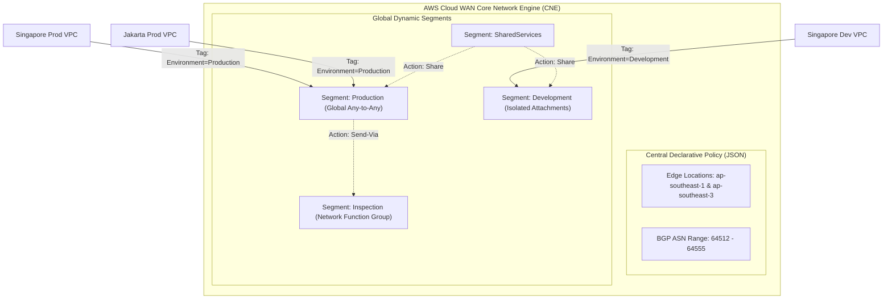

# Modul 22: AWS Cloud WAN Global Backbone & Network Policy

<BadgeLabel type="sme" text="Level: Principal / SME" /> <BadgeLabel type="rfc" text="RFC 7938 / Global SD-WAN / Policy Automation" /> <BadgeLabel type="aws" text="AWS Cloud WAN (Network Manager)" />

Seiring berkembangnya footprint infrastruktur cloud ke skala global (melintasi 3 hingga puluhan Region AWS di berbagai benua), mengelola *inter-region peering mesh* antar **AWS Transit Gateway (TGW)** secara manual memunculkan kompleksitas operasional yang tinggi. **AWS Cloud WAN** menghadirkan paradigma *Global Software-Defined WAN (SD-WAN)* di mana seluruh perutean, segmentasi multi-tenant, dan inspeksi firewall lintas-region diorkestrasi secara terpusat melalui satu dokumen deklaratif: **Global Core Network Policy (JSON)**.

---

## 1. Protocol Mechanics & RFC Theory

### A. Konsep Inti AWS Cloud WAN Core Network
AWS Cloud WAN mengabstraksikan ribuan komponen jaringan menjadi empat pilar logis utama:



1. **Global Network & Core Network**:
   - Wadah global (*single pane of glass*) di dalam AWS Network Manager yang mencakup seluruh *Edge Locations* (AWS Regions).
2. **Core Network Edge (CNE)**:
   - Instans *routing engine* terdistribusi yang dideploy secara otomatis oleh AWS di setiap Region yang Anda definisikan dalam policy.
3. **Segments (Segmen Jaringan)**:
   - Batas *routing domain* logis multi-tenant (misal: `production`, `development`, `sharedservices`, `inspection`).
4. **Segment Actions**:
   - `share`: Membagikan rute dari satu segmen ke segmen lain (misal: membagikan `sharedservices` ke `production` dan `development`).
   - `isolate`: Mengisolasi traffic antar VPC di dalam segmen yang sama (*zero spoke-to-spoke communication*).
   - `send-via`: Mencegat dan membelokkan (*service insertion*) seluruh traffic antar-segmen melewati **Network Function Group (NFG)** untuk inspeksi firewall terpusat.
5. **Attachment Policies**:
   - Aturan otomasi yang mengevaluasi tag resource (misal: `Environment = Production`) untuk secara otomatis memetakan VPC attachment ke segmen yang sesuai tanpa konfigurasi manual.

::: tip STANDAR BEST PRACTICE INDUSTRI (SME RECOMMENDATION)
Gunakan **Tag-Based Attachment Policies** pada Core Network Policy JSON. Dengan menetapkan aturan bahwa VPC dengan tag `Environment: Production` otomatis masuk ke segmen `production`, tim DevOps di berbagai belahan dunia dapat membuat VPC baru yang langsung terintegrasi secara aman ke WAN enterprise global secara deterministik (*Infrastructure as Code GitOps*).
:::

---

## 2. Interactive Global Topology Explorer

Jelajahi visualisasi interaktif arsitektur Cloud WAN Multi-Region, segmen isolasi, dan alur perutean global di bawah ini:

<ClientOnly>
  <TopologyExplorer />
</ClientOnly>

---

## 3. AWS Resource Specifications & Hard Limits

| Dimensi Parameter | Batasan Kuota (Quotas & Limits) | Catatan / Dampak Arsitektur |
|---|---|---|
| **Maksimum Edge Locations per Core Network** | **30 AWS Regions** | Mencakup seluruh Region komersial global |
| **Maksimum Segments per Core Network** | **50 Segments** | Default (Dapat dinaikkan via Service Quotas) |
| **Maksimum Attachments per Core Network** | **5,000 Attachments** | Akumulasi VPC, VPN, Connect, dan TGW |
| **Throughput per VPC Attachment** | **50 Gbps Burst** | Identik dengan TGW Hyperplane Engine |
| **MTU Antar Core Network Edges** | **8500 Bytes** | Line-rate lintas benua di atas AWS Backbone |
| **Biaya Operasional** | $0.25 / jam per Edge Location + $0.05 / jam per Attachment + $0.02 / GB Data |

---

## 4. Hop-by-Hop Global Multi-Region Flow Lifecycle (with Send-Via)

```
[Singapore Production App: 10.10.1.50]
        |
        v
[Singapore Spoke VPC Subnet Route Table]
        | 1. Matches 10.20.1.100 (Jakarta DB) -> Forward to Cloud WAN Attachment
        v
[AWS Cloud WAN Core Network Edge (CNE) in ap-southeast-1]
        | 2. Policy Evaluation: Segment = 'production'
        | 3. Send-Via Action Triggered: Traffic must pass through 'sec-firewall-nfg'
        v
[Central Security VPC (GWLB + NGFW Cluster in Singapore)]
        | 4. Next-Gen Firewall inspects payload and permits packet
        | 5. Return packet to Cloud WAN CNE
        v
[AWS Global Dedicated Fiber Backbone]
        | 6. Inter-Region Encapsulated Transport across Singapore-to-Jakarta Subsea Cable
        v
[AWS Cloud WAN Core Network Edge (CNE) in ap-southeast-3]
        | 7. Segment 'production' route lookup: Matches Destination 10.20.1.100 -> Attachment VPC-Prod-DR
        v
[Jakarta DR Production DB: 10.20.1.100]
```

---

## 5. Production Master Core Network Policy JSON & Terraform IaC

### A. Complete Production Core Network Policy (`core-network-policy.json`)

```json
{
  "version": "2021.12",
  "core-network-configuration": {
    "asn-ranges": ["64512-64555"],
    "edge-locations": [
      { "location": "ap-southeast-1", "asn": 64512 },
      { "location": "ap-southeast-3", "asn": 64513 },
      { "location": "us-east-1", "asn": 64514 }
    ],
    "inside-cidr-blocks": ["10.250.0.0/16"]
  },
  "segments": [
    {
      "name": "production",
      "require-attachment-acceptance": false,
      "isolate-attachments": false,
      "description": "Global Production Workloads"
    },
    {
      "name": "development",
      "require-attachment-acceptance": false,
      "isolate-attachments": true,
      "description": "Isolated Development Workloads"
    },
    {
      "name": "sharedservices",
      "require-attachment-acceptance": false,
      "isolate-attachments": false,
      "description": "Shared Corporate Tooling & DNS Resolvers"
    },
    {
      "name": "inspection",
      "require-attachment-acceptance": false,
      "isolate-attachments": false,
      "description": "Centralized NGFW Security Inspection Segment"
    }
  ],
  "network-function-groups": [
    {
      "name": "sec-firewall-nfg",
      "require-attachment-acceptance": false,
      "description": "Centralized Stateful Firewall Inspection Group"
    }
  ],
  "segment-actions": [
    {
      "action": "share",
      "segment": "sharedservices",
      "share-with": ["production", "development"]
    },
    {
      "action": "send-via",
      "segment": "production",
      "network-function-group-name": "sec-firewall-nfg",
      "when-sent-to": { "segments": ["*"] }
    }
  ],
  "attachment-policies": [
    {
      "rule-number": 100,
      "condition-logic": "and",
      "conditions": [
        { "type": "tag-value", "key": "Environment", "operator": "equals", "value": "Production" }
      ],
      "action": {
        "association-method": "constant",
        "segment": "production"
      }
    },
    {
      "rule-number": 200,
      "condition-logic": "and",
      "conditions": [
        { "type": "tag-value", "key": "Environment", "operator": "equals", "value": "Development" }
      ],
      "action": {
        "association-method": "constant",
        "segment": "development"
      }
    },
    {
      "rule-number": 300,
      "condition-logic": "and",
      "conditions": [
        { "type": "tag-value", "key": "NetworkRole", "operator": "equals", "value": "SecurityFirewall" }
      ],
      "action": {
        "association-method": "constant",
        "segment": "inspection",
        "tag-network-function-group": "sec-firewall-nfg"
      }
    }
  ]
}
```

### B. Production Terraform IaC Blueprint

```hcl
# 1. Global Network Manager Container
resource "aws_networkmanager_global_network" "enterprise" {
  description = "Enterprise Global Backbone Network"
  tags = {
    Name = "global-network-enterprise"
  }
}

# 2. AWS Cloud WAN Core Network Deployment
resource "aws_networkmanager_core_network" "core" {
  global_network_id = aws_networkmanager_global_network.enterprise.id
  description       = "Multi-Region Enterprise Cloud WAN (SG, JKT, US)"
  policy_document   = file("${path.module}/core-network-policy.json")

  tags = {
    Name        = "cne-enterprise-global-core"
    Environment = "Production"
  }
}

# 3. Production VPC Attachment (Auto-Associated to 'production' via Policy Rule 100)
resource "aws_networkmanager_vpc_attachment" "prod_sg_attach" {
  core_network_id = aws_networkmanager_core_network.core.id
  vpc_arn         = "arn:aws:ec2:ap-southeast-1:123456789012:vpc/vpc-0prod11111111111"
  subnet_arns     = [
    "arn:aws:ec2:ap-southeast-1:123456789012:subnet/subnet-prod-transit-1a",
    "arn:aws:ec2:ap-southeast-1:123456789012:subnet/subnet-prod-transit-1b"
  ]

  tags = {
    Name        = "wan-attach-prod-singapore"
    Environment = "Production" # Automatically matched by Policy Engine!
  }
}
```

---

## 6. Failure Modes, Edge Cases & SEV-1 Troubleshooting Matrix

| Gejala Insiden (Symptom) | Root Cause Analysis (RCA) | Triage CLI & Verifikasi | Remediasi Permanen |
|---|---|---|---|
| **Attachment Stuck in UNMAPPED State** | Tag resource pada VPC Attachment tidak cocok dengan kriteria `attachment-policies` di JSON Policy. | `aws networkmanager get-vpc-attachment --attachment-id attach-xxx` $\to$ `Segment: unmapped`. | Periksa kesesuaian penulisan tag (Case-Sensitive, misal: `Environment = Production`); update tag pada attachment. |
| **Policy JSON Execution Error (EXECUTE_FAILED)** | Terjadi konflik ASN antar Edge Location, atau CIDR overlapping pada `inside-cidr-blocks`. | `aws networkmanager get-core-network-change-set` $\to$ Cek pesan error validasi. | Pastikan setiap `edge-location` memiliki BGP ASN yang unik di rentang `asn-ranges` privat. |
| **Traffic Blackhole saat Send-Via Inspection** | Security VPC firewall belum di-tag dengan `NetworkRole = SecurityFirewall` atau firewall tidak memiliki rute kembali ke CNE. | Jalankan AWS Network Access Analyzer pada Spoke VPC CIDR. | Pasang tag NFG pada attachment Security VPC dan pastikan Route Table firewall mengarahkan traffic kembali ke Cloud WAN. |
| **Inter-Segment Route Leakage** | Aksi `share` segmen didefinisikan terlalu luas (`share-with: ["*"]`), menghubungkan `development` ke `production`. | `aws networkmanager get-core-network-routes --segment-name production` | Batasi aksi `share` hanya untuk segmen yang membutuhkan (seperti `sharedservices`). |

---

## 7. Principal Architect Tradeoff Framework

```
                          [GLOBAL NETWORK ARCHITECTURE]
                                        |
         +------------------------------+------------------------------+
         |                                                             |
         v                                                             v
 [Multi-Region Transit Gateway Peering]                        [AWS Cloud WAN]
   - Regional Decoupled Management                               - Global Centralized JSON Policy
   - Manual Peering Mesh & Static Routes                         - Native Auto-Peered Core Backbone
   - $O(N^2)$ Complexity at Scale                                - $O(1)$ Complexity at Scale
   - Ideal for 1-2 Regions                                       - Ideal for Global Multi-Region (>3 Regions)
```

### Comprehensive Comparison Matrix

| Parameter Arsitektur | Multi-Region AWS Transit Gateway (TGW) | AWS Cloud WAN (Core Network) |
|---|---|---|
| **Model Operasional** | Regional Decoupled (Dikelola per-region via Peering Attachments) | **Global Centralized (Satu deklaratif Global Network Policy JSON)** |
| **Kompleksitas Scaling** | Kompleksitas $O(N^2)$ pada banyak region | **Skala otomatis $O(1)$: Cukup tambahkan `edge-location` baru** |
| **Inter-Segment Routing Policy** | Manual Route Table Associations & Propagations | **Native Segment Actions (`share`, `isolate`, `send-via`)** |
| **Service Insertion (Firewall/IPS)** | Membutuhkan Appliance Mode pada Attachment + manual route piping | **Native Network Function Groups (NFG) dengan aksi `send-via` otomatis** |
| **MTU / Maximum Transmission Unit** | 8500 bytes antar-Region Peering, 9001 bytes intra-VPC | **8500 bytes antar Core Network Edges** |
| **Biaya Edge / Gateway Base Fee** | $0.05/attachment/jam + $0.02/GB data | $0.05/attachment/jam + $0.02/GB data + Core Network Edge fee ($0.25/jam/region) |
| **Kapan Harus Memilih?** | Cocok untuk arsitektur 1-2 Region sederhana | **Standar Emas Enterprise Multi-Region (3+ Region)** |
