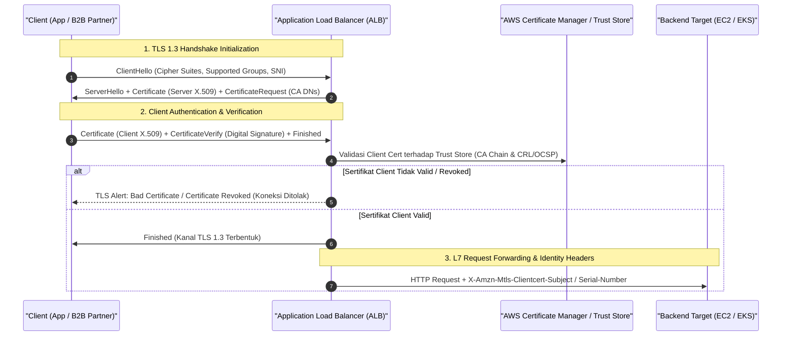
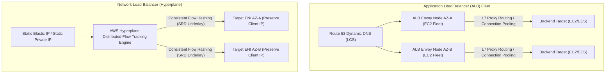
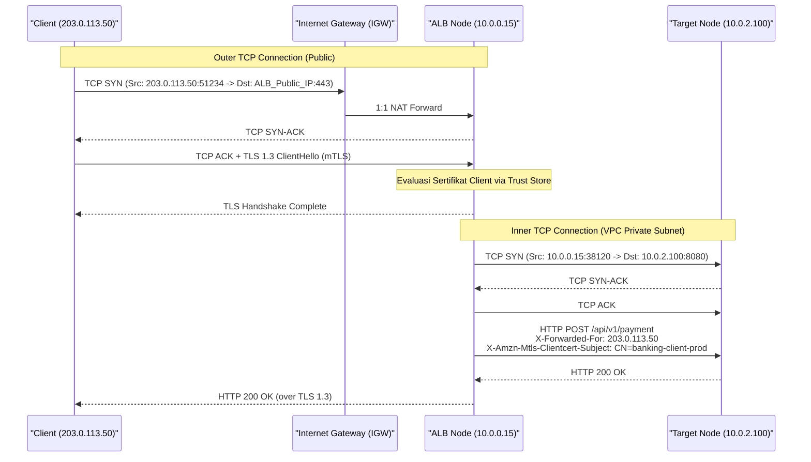
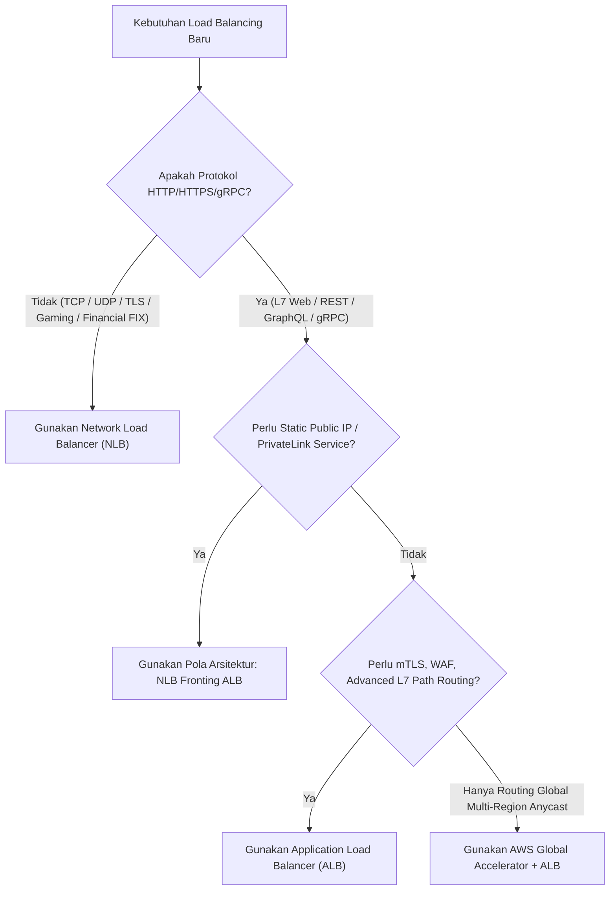

# Modul 23: Elastic Load Balancing (ALB, NLB, mTLS & Proxy Protocol)

<BadgeLabel type="sme" text="Level: Principal / SME" /> <BadgeLabel type="rfc" text="RFC 793 / RFC 7230 / RFC 8446 / HAProxy PPv2" /> <BadgeLabel type="aws" text="ELB Architecture & Hyperplane Underlay" />

Di arsitektur *cloud network* skala enterprise, **Elastic Load Balancing (ELB)** bukan sekadar pembagi beban round-robin sederhana. ELB adalah gerbang utama *application ingress* dan *service-to-service communication* yang memproses jutaan *requests per second* (RPS) dengan latensi sub-milidetik, terminasi kriptografi **Mutual TLS** (<NetworkTerm term="mTLS" />), serta penegakan integritas identitas klien melalui *Proxy Protocol v2*.

---

## 1. Layer 1: Protocol Mechanics & RFC Theory

::: tip STANDAR BEST PRACTICE INDUSTRI (SME RECOMMENDATION)
Terapkan **TLS 1.3 (RFC 8446)** secara eksklusif pada seluruh *public-facing load balancer* dengan cipher suite `TLS-AES-128-GCM-SHA256` dan `TLS-AES-256-GCM-SHA384`. Nonaktifkan protokol *legacy* (TLS 1.0, 1.1, serta TLS 1.2 CBC suites) untuk memenuhi standar PCI-DSS 4.0 dan ISO 27001. Untuk komunikasi gRPC dan microservices internal, gunakan **HTTP/2 multiplexing** dengan TCP window scaling teroptimasi guna meminimalkan koneksi TCP baru.
:::

### A. Layer 4 (RFC 793 TCP) vs Layer 7 (RFC 7230 / RFC 7540 / RFC 9114 HTTP)

Perbedaan mendasar antara **Network Load Balancer** (<NetworkTerm term="NLB" />) dan **Application Load Balancer** (<NetworkTerm term="ALB" />) berakar pada layer OSI tempat terminasi koneksi dilakukan:

```
+-----------------------------------------------------------------------------+
|                            OSI LAYER COMPARISON                             |
+-----------------------------------------------------------------------------+
| Layer 7 (ALB):                                                              |
| [Client] <== TCP Handshake + TLS ==> [ALB Proxy Engine] <== TCP/TLS ==> [Target]
|  * Dua koneksi TCP terpisah (Dual TCP State Machines).                      |
|  * L7 Header Inspection: Parsing URI, HTTP Method, Cookies, Host Headers.   |
|  * Modifikasi Payload & Headers: Injeksi X-Forwarded-For, X-Forwarded-Proto.|
+-----------------------------------------------------------------------------+
| Layer 4 (NLB):                                                              |
| [Client] <====================== Single TCP Stream ====================> [Target]
|  * Pass-through / Flow Forwarding tanpa terminasi TCP (bila non-TLS).       |
|  * Beroperasi murni pada 5-Tuple: (Src IP, Src Port, Dst IP, Dst Port, Proto).
|  * Latensi ultra-rendah (< 100 mikrosekon), throughput puluhan juta PPS.   |
+-----------------------------------------------------------------------------+
```

$$\text{5-Tuple Hash Function: } H = \text{Murmur3}(\text{SrcIP}, \text{SrcPort}, \text{DstIP}, \text{DstPort}, \text{Protocol}) \pmod N$$

### B. Mutual TLS (mTLS) Deep Dive (RFC 8446 TLS 1.3)

Mutual TLS mewajibkan kedua belah pihak—*client* dan *server* (ALB)—saling memvalidasi sertifikat digital X.509 sebelum kanal terenkripsi terbentuk.



### C. Proxy Protocol v2 (PPv2) Binary Header Specification

Ketika NLB beroperasi dalam mode Layer 4 TCP tanpa menghentikan paket atau saat target berada di belakang NAT, alamat *Source IP* asli klien harus disampaikan ke *backend target*. **Proxy Protocol v2** menyisipkan header biner 16-byte di awal stream TCP sebelum payload aplikasi:

```
 0                   1                   2                   3
 0 1 2 3 4 5 6 7 8 9 0 1 2 3 4 5 6 7 8 9 0 1 2 3 4 5 6 7 8 9 0 1
+-+-+-+-+-+-+-+-+-+-+-+-+-+-+-+-+-+-+-+-+-+-+-+-+-+-+-+-+-+-+-+-+
|       \x0D \x0A \x0D \x0A \x00 \x0D \x0A \x51 \x55 \x49 \x54 \x0A       | (12-byte Signature)
+-+-+-+-+-+-+-+-+-+-+-+-+-+-+-+-+-+-+-+-+-+-+-+-+-+-+-+-+-+-+-+-+
|  Ver (2) |Cmd | Family| Proto |            Length             | (4 bytes)
+-+-+-+-+-+-+-+-+-+-+-+-+-+-+-+-+-+-+-+-+-+-+-+-+-+-+-+-+-+-+-+-+
|                        Source IPv4 Address                    | (4 bytes)
+-+-+-+-+-+-+-+-+-+-+-+-+-+-+-+-+-+-+-+-+-+-+-+-+-+-+-+-+-+-+-+-+
|                     Destination IPv4 Address                  | (4 bytes)
+-+-+-+-+-+-+-+-+-+-+-+-+-+-+-+-+-+-+-+-+-+-+-+-+-+-+-+-+-+-+-+-+
|          Source Port          |       Destination Port        | (4 bytes)
+-+-+-+-+-+-+-+-+-+-+-+-+-+-+-+-+-+-+-+-+-+-+-+-+-+-+-+-+-+-+-+-+
|                    Additional TLV Vectors (Optional)          | (Variable)
+-+-+-+-+-+-+-+-+-+-+-+-+-+-+-+-+-+-+-+-+-+-+-+-+-+-+-+-+-+-+-+-+
```

---

## 2. Layer 2: AWS Distributed Underlay & Hyperplane Internals

::: tip STANDAR BEST PRACTICE INDUSTRI (SME RECOMMENDATION)
Untuk *workload* finansial, perbankan, dan *high-performance computing* dengan beban >100,000 PPS per node, pilih **Network Load Balancer (NLB)** dengan target type `ip`. Target type `ip` langsung memetakan traffic ke IP Pod/ENI tanpa melewati NAT layer ganda (`kube-proxy` iptables) di node level, memangkas latensi hingga 40%.
:::

### A. AWS Hyperplane Flow Engine vs Reverse Proxy Fleet

Arsitektur di balik ELB terbagi menjadi dua implementasi underlay yang sangat berbeda:



1. **ALB (Managed Proxy Fleet)**:
   - Beroperasi sebagai armada (*fleet*) reverse proxy terdistribusi (berbasis Envoy/Apache internal) yang dijalankan oleh AWS.
   - Skalabilitas dilakukan dengan menambah atau mengurangi instance proxy dan meng-update entri DNS A-record secara dinamis (*DNS round-robin*).
   - Membutuhkan minimal alokasi subnet `/27` atau `/26` di setiap Availability Zone untuk menampung IP internal saat autoscaling.

2. **NLB (Hyperplane Flow Tracker)**:
   - Tidak menggunakan proxy VM tradisional. NLB ditenagai langsung oleh **AWS Hyperplane**, platform state-tracking terdistribusi internal AWS yang sama dengan NAT Gateway dan PrivateLink.
   - Menangani jutaan koneksi baru per detik secara instan (*zero warm-up requirement*) dengan IP statis per AZ.

### B. Cross-Zone Load Balancing Mechanics

```
Tanpa Cross-Zone Load Balancing (Default NLB):
Zone A (2 Targets): Client Traffic (50%) --> Target A1 (25%), Target A2 (25%)
Zone B (8 Targets): Client Traffic (50%) --> Target B1 s/d B8 (6.25% per target) [UNBALANCED!]

Dengan Cross-Zone Load Balancing (Default ALB / Optional NLB):
Total Traffic (100%) --> Didistribusikan merata: 10% per target (10 Targets di kedua Zone)
```

::: warning BIAYA INTER-AZ DATA TRANSFER PADA NLB
Pada Network Load Balancer, mengaktifkan *Cross-Zone Load Balancing* akan mengenakan biaya standar **Regional Data Transfer ($0.01/GB in/out)** saat traffic menyeberang antar Availability Zone. Pada throughput 100 Gbps berkelanjutan, biaya transfer antar-AZ ini dapat mencapai ribuan dolar per bulan.
:::

---

## 3. Layer 3: AWS Resource Deep-Dive & Hard Limits

::: tip STANDAR BEST PRACTICE INDUSTRI (SME RECOMMENDATION)
Konfigurasikan **Deregistration Delay (Connection Draining)** minimal 300 detik pada sistem *stateful* atau *long-lived HTTP requests* (seperti ekspor laporan/batch processing), dan 15-30 detik pada microservices stateless. Selaraskan `idle_timeout` pada ALB (default 60s) dengan backend application server (pastikan `keep-alive timeout` backend > `ALB idle timeout`, misal 65 detik pada Nginx/Node.js) guna mencegah insiden **HTTP 502 Bad Gateway**.
:::

### A. Load Balancer Capacity Units (LCU & NLCU) Formula

Biaya dan kapasitas ELB dihitung berdasarkan konsumsi dimensi tertinggi dari metrik berikut:

#### 1. ALB LCU Dimension (1 LCU mencakup):
$$\text{LCU} = \max \left( \frac{\text{New Conn}}{25/\text{s}}, \frac{\text{Active Conn}}{3000/\text{min}}, \frac{\text{Bandwidth}}{1\text{ GB/hr}}, \frac{\text{Rule Evaluations}}{1000/\text{s}} \right)$$

#### 2. NLB NLCU Dimension (1 NLCU untuk TCP mencakup):
$$\text{NLCU}_{\text{TCP}} = \max \left( \frac{\text{New Flows}}{800/\text{s}}, \frac{\text{Active Flows}}{100000}, \frac{\text{Bandwidth}}{1\text{ GB/hr}} \right)$$

### B. Quota & Limits Reference Matrix

| Parameter / Resource | Application Load Balancer (ALB) | Network Load Balancer (NLB) |
|---|---|---|
| **OSI Layer** | Layer 7 (HTTP/HTTPS/gRPC) | Layer 4 (TCP/UDP/TLS) |
| **Static IP Support** | Tidak (Hanya DNS CNAME / Route 53 Alias) | **Ya (1 Static Elastic IP / Private IP per AZ)** |
| **Pre-Warming Requirement** | Diperlukan jika lonjakan >50% dalam 5 menit | **Tidak Perlu (Instan hingga jutaan RPS)** |
| **Preserve Client IP** | Via `X-Forwarded-For` header | **Native L4 Packet Header / Proxy Protocol v2** |
| **Target Types** | `instance`, `ip`, `lambda`, `alb` | `instance`, `ip`, `alb` |
| **Max Target Groups per LB** | 100 (Default) | 50 (Default) |
| **Max Targets per Target Group** | 1000 | 1000 |
| **Health Check Protocols** | HTTP, HTTPS, gRPC | TCP, HTTP, HTTPS |

---

## 4. Layer 4: Hop-by-Hop Packet Walkthrough & Flow Lifecycle

### A. NLB Flow Ingress with Client IP Preservation (`target_type = "ip"`)

```
[1. Internet Client]
   Src: 203.0.113.50:48212, Dst: 198.51.100.10:443 (NLB EIP)
       │
       ▼ (AWS Edge IGW)
[2. NLB Hyperplane Flow Router]
   * Hyperplane mengevaluasi hash 5-tuple.
   * State session disimpan dalam distributed flow table.
   * TIDAK melakukan Source NAT (SNAT).
   Src: 203.0.113.50:48212, Dst: 10.0.1.25:443 (Target Private IP)
       │
       ▼ (Nitro Underlay Routing)
[3. Target Application Pod / EC2 (AZ-A)]
   * Menerima paket dengan Source IP asli: 203.0.113.50.
   * Return Traffic: Dst IP 203.0.113.50 diarahkan kembali via Nitro default gateway.
   * Nitro underlay mengenali flow NLB dan merutekannya simetris ke Client.
```

### B. ALB Ingress Flow with Dual TCP Handshake & mTLS Termination



---

## 5. Layer 5: Production Terraform IaC & CLI Implementation Blueprints

::: tip STANDAR BEST PRACTICE INDUSTRI (SME RECOMMENDATION)
Gunakan kombinasi **NLB fronting ALB** saat Anda memerlukan fitur inspeksi Layer 7 dan integrasi WAF dari ALB, namun membutuhkan alamat **Static Elastic IP** atau integrasi **AWS PrivateLink Endpoint Service** yang hanya dapat dipasang di depan NLB.
:::

### Blueprint: Production ALB with mTLS & NLB with Proxy Protocol v2

```hcl
# 1. AWS Certificate Manager Trust Store for mTLS
resource "aws_lb_trust_store" "mtls_store" {
  name                             = "enterprise-mtls-trust-store"
  ca_certificates_bundle_s3_bucket = "enterprise-security-pki-bucket"
  ca_certificates_bundle_s3_key    = "truststores/root-and-intermediate-ca.pem"

  tags = {
    Environment = "Production"
    ManagedBy   = "Terraform"
    Compliance  = "PCI-DSS"
  }
}

# 2. Production Application Load Balancer (ALB) with mTLS
resource "aws_lb" "external_alb" {
  name               = "prod-app-alb"
  internal           = false
  load_balancer_type = "application"
  security_groups    = [aws_security_group.alb_sg.id]
  subnets            = [aws_subnet.public_az1.id, aws_subnet.public_az2.id, aws_subnet.public_az3.id]

  enable_deletion_protection = true
  idle_timeout               = 60
  drop_invalid_header_fields = true

  access_logs {
    bucket  = "enterprise-elb-access-logs"
    prefix  = "alb-production"
    enabled = true
  }

  tags = {
    Name        = "prod-alb-ingress"
    Environment = "Production"
  }
}

# 3. ALB HTTPS Listener with Mutual TLS (Passthrough to Trust Store)
resource "aws_lb_listener" "https_mtls" {
  load_balancer_arn = aws_lb.external_alb.arn
  port              = 443
  protocol          = "HTTPS"
  ssl_policy        = "ELBSecurityPolicy-TLS13-1-2-2021-06"
  certificate_arn   = "arn:aws:acm:ap-southeast-1:123456789012:certificate/abc-123-def"

  mutual_authentication {
    mode            = "verify" # Enforce strict mTLS verification
    trust_store_arn = aws_lb_trust_store.mtls_store.arn
  }

  default_action {
    type             = "forward"
    target_group_arn = aws_lb_target_group.app_tg.arn
  }
}

# 4. ALB Target Group with HTTP Keep-Alive & Strict Health Checks
resource "aws_lb_target_group" "app_tg" {
  name                 = "prod-app-tg"
  port                 = 8080
  protocol             = "HTTP"
  vpc_id               = aws_vpc.main.id
  target_type          = "ip"
  deregistration_delay = "30"

  health_check {
    enabled             = true
    path                = "/healthz"
    port                = "8080"
    protocol            = "HTTP"
    interval            = 15
    timeout             = 5
    healthy_threshold   = 2
    unhealthy_threshold = 3
    matcher             = "200"
  }

  target_group_health {
    dns_failover {
      minimum_healthy_targets_percentage = "50"
    }
  }

  tags = {
    Environment = "Production"
  }
}

# 5. Production Network Load Balancer (NLB) with Proxy Protocol v2
resource "aws_lb" "external_nlb" {
  name                             = "prod-core-nlb"
  internal                         = false
  load_balancer_type               = "network"
  subnets                          = [aws_subnet.public_az1.id, aws_subnet.public_az2.id]
  enable_cross_zone_load_balancing = true

  tags = {
    Name = "prod-nlb-tcp-ingress"
  }
}

# 6. NLB Target Group enabling Proxy Protocol v2
resource "aws_lb_target_group" "nlb_tcp_tg" {
  name        = "prod-nlb-tcp-tg"
  port        = 9000
  protocol    = "TCP"
  vpc_id      = aws_vpc.main.id
  target_type = "instance"

  proxy_protocol_v2 = true # Insert HAProxy Binary Header

  health_check {
    protocol = "TCP"
    port     = "9000"
    interval = 10
  }
}
```

---

## 6. Layer 6: Failure Modes, Edge Cases, Anti-Patterns & SEV-1 Troubleshooting Matrix

::: tip STANDAR BEST PRACTICE INDUSTRI (SME RECOMMENDATION)
Terapkan alarm CloudWatch otomatis untuk metrik `HTTPCode_ELB_5XX_Count`, `UnHealthyHostCount`, dan `TargetResponseTime`. Jika `UnHealthyHostCount` melonjak bersamaan dengan `HTTPCode_Target_5XX_Count`, segera periksa kapasitas backend pool sebelum menyalahkan layer load balancer.
:::

| Gejala / Failure Mode | Root Cause Teknis | Perintah Diagnosa / Query Log | Solusi & Mitigasi Definitif |
|---|---|---|---|
| **HTTP 502 Bad Gateway sesaat pada jam sibuk** | `keep-alive timeout` backend web server (misal 60s) lebih pendek dari `idle timeout` ALB (60s), memicu race condition TCP FIN saat ALB mengirim request baru. | `fields @timestamp, elb_status_code, target_status_code, target_processing_time` | Naikkan `keepalive_timeout` di Nginx/Node.js backend menjadi **65–75 detik** (selalu lebih besar dari ALB idle timeout). |
| **HTTP 504 Gateway Timeout** | Backend instance tidak merespons dalam jendela `idle_timeout`, atau *connection backlog* queue aplikasi penuh (*thread starvation*). | `aws elbv2 describe-target-health --target-group-arn <ARN>` | Periksa CPU/Memory target, naikkan pool worker, atau tingkatkan `idle_timeout` bila request berupa proses analitik panjang. |
| **mTLS Client Handshake Rejected (400 Bad Request)** | Sertifikat klien kedaluwarsa, ditandatangani oleh Intermediate CA yang tidak terdaftar di Trust Store, atau serial number masuk dalam CRL S3. | Periksa CloudWatch Metrics: `TargetTLSNegotiationErrorCount` dan log ALB mTLS attributes. | Update CA bundle di S3 bucket Trust Store dan trigger sinkronisasi trust store via CLI/IaC. |
| **Source IP Target terbaca sebagai Private IP ALB** | Backend membaca `Remote_Addr` TCP socket langsung, bukan header `X-Forwarded-For` atau Proxy Protocol v2. | `tcpdump -nnvv -i eth0 port 8080 -A \| grep -i "x-forwarded-for"` | Konfigurasikan modul `mod_remoteip` (Apache) atau `real_ip_header X-Forwarded-For` (Nginx) di backend application server. |
| **Target Flapping Unhealthy <-> Healthy** | `HealthCheckTimeout` terlalu dekat dengan `HealthCheckInterval` saat backend overload, memicu false timeout. | Periksa target health transitions di AWS CloudTrail Event History. | Longgarkan threshold: Interval = 15s, Timeout = 5s, Unhealthy Threshold = 3. |

---

## 7. Layer 7: Principal Architect Tradeoff Framework

::: tip STANDAR BEST PRACTICE INDUSTRI (SME RECOMMENDATION)
Sebagai Principal Architect, pilihlah **ALB** sebagai default untuk HTTP/HTTPS API microservices yang memerlukan integrasi AWS WAF, mTLS, dan path-based routing. Beralihlah ke **NLB** murni saat protokol bersifat non-HTTP (misal FIX protocol perbankan, MQTT IoT, database replication) atau saat latensi sub-milidetik (<500 mikrosekon) adalah SLA wajib yang tidak dapat dinegosiasikan.
:::

### Decision Matrix: Ingress Architecture & Load Balancing Strategy



| Parameter Arsitektur | Application Load Balancer (ALB) | Network Load Balancer (NLB) | NLB Fronting ALB Pattern |
|---|---|---|---|
| **Underlay Implementation** | Dedicated Reverse Proxy Fleet | Distributed Hyperplane Flow Engine | Combined (Hyperplane + Proxy Fleet) |
| **Latency Profile** | 1 – 4 milidetik (L7 Parsing overhead) | **< 100 mikrosekon (Wire-speed)** | 1.5 – 5 milidetik |
| **Throughput Ceiling** | Scaled via DNS Pre-warming | **Virtually Unlimited (Instan)** | Unlimited L4 front, Autoscaling L7 back |
| **Static IP / PrivateLink** | Tidak (Kecuali via Global Accelerator) | **Ya (Native EIP / PrivateLink)** | **Ya (Native EIP + PrivateLink)** |
| **WAF & mTLS Integration** | **Native WAF & Native mTLS Store** | AWS WAF via ALB / Custom TLS | **Full Native Support** |
| **Relative Cost ($)** | Base: $0.0225/hr + $0.008/LCU | Base: $0.0225/hr + $0.006/NLCU | Dua lapis billing (NLB NLCU + ALB LCU) |
