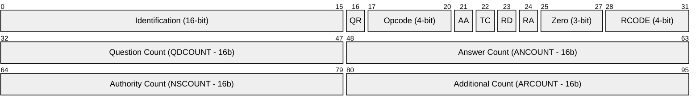
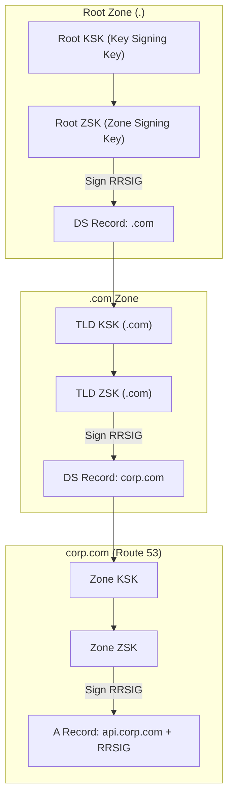
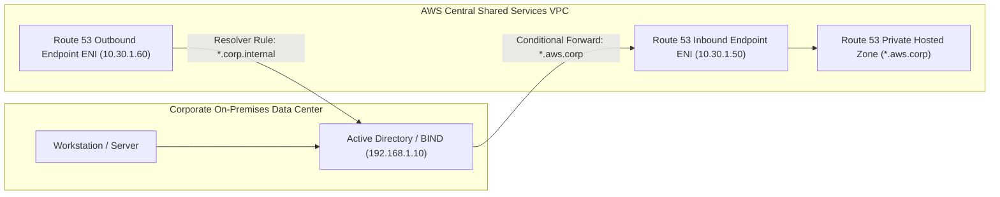
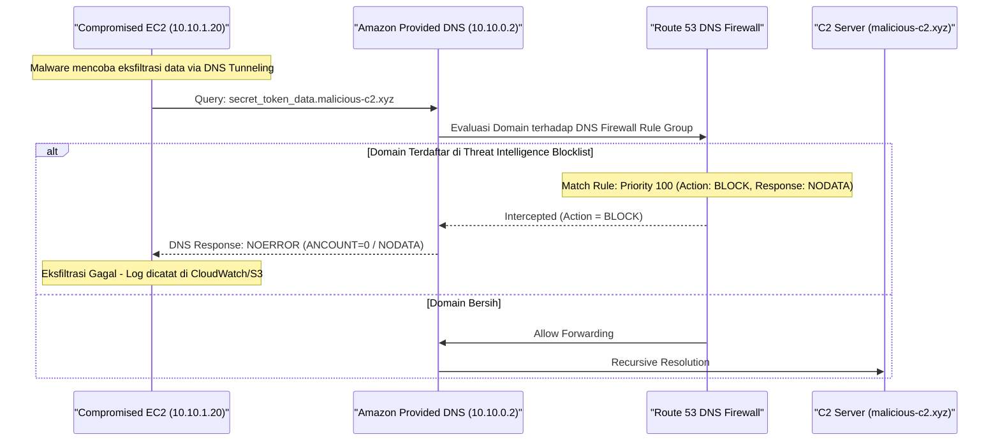
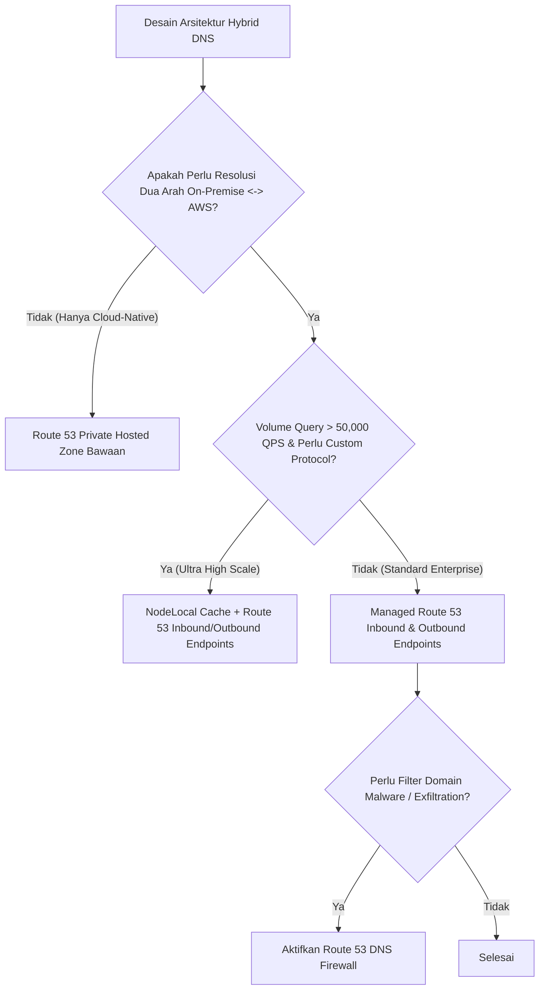

# Modul 24: Route 53 Resolver, DNS Firewall & Hybrid DNS

<BadgeLabel type="sme" text="Level: Principal / SME" /> <BadgeLabel type="rfc" text="RFC 1035 / RFC 6891 (EDNS0) / RFC 4033 (DNSSEC)" /> <BadgeLabel type="aws" text="Route 53 Resolver & DNS Firewall" />

Sistem Nama Domain (*Domain Name System* - DNS) adalah fondasi *service discovery* di seluruh ekosistem komputasi awan. Bagi seorang **Principal Cloud Network Architect**, mengelola DNS skala *hybrid multi-account* bukan sekadar membuat *A record*, melainkan merancang arsitektur resolusi *Split-Horizon*, integrasi *bidirectional forwarding* dengan Active Directory on-premise, mitigasi *throttling* 1024 QPS pada underlay Nitro, dan penegakan keamanan *Zero-Trust* via **Route 53 DNS Firewall**.

---

## 1. Layer 1: Protocol Mechanics & RFC Theory

::: tip STANDAR BEST PRACTICE INDUSTRI (SME RECOMMENDATION)
Aktifkan ekstensi **EDNS0 (RFC 6891)** dengan ukuran buffer UDP 1232–1400 bytes untuk mencegah fragmentasi IP pada paket DNS berukuran besar (seperti respons DNSSEC atau TXT records). Pastikan seluruh firewall on-premise dan Security Groups mengizinkan **TCP Port 53** di samping **UDP Port 53** sebagai mekanisme *fallback* saat *Truncation Bit (TC=1)* aktif.
:::

### A. Format Paket DNS & Mekanika Truncation (RFC 1035 / RFC 6891)

Header DNS standar memiliki ukuran fixed 12-byte:



- **Flag `TC` (Truncation)**: Jika respons DNS melebihi 512 byte (pada UDP murni) atau melebihi EDNS0 buffer, server mengaktifkan bit `TC=1`. Klien yang menerima flag ini diwajibkan membuka koneksi **TCP Port 53** untuk mengulang query.
- **Flag `RD` (Recursion Desired)** & **`RA` (Recursion Available)**: Menandai apakah resolver diizinkan melakukan query rekursif hierarkis ke Root Hints (`.`) dan TLD.

### B. DNSSEC Chain of Trust (RFC 4033 / 4034 / 4035)



---

## 2. Layer 2: AWS Distributed Underlay & Hyperplane Internals

::: tip STANDAR BEST PRACTICE INDUSTRI (SME RECOMMENDATION)
Untuk instance EC2 dengan volume query DNS masif (>1,000 QPS per instance, misal: Proxy Squid, API Gateway Envoy, atau CoreDNS node), pasang **NodeLocal DNSCache** (pada EKS) atau lokal caching daemon (`systemd-resolved` / `dnsmasq`) pada VM. Ini mengeliminasi risiko *packet drop* akibat hard limit **1024 packets/second per ENI** ke Amazon Provided DNS.
:::

### A. Amazon Provided DNS (Nitro Intercept Engine)

Di dalam VPC, alamat DNS bawaan (*Amazon Provided DNS* / Route 53 Resolver) dapat diakses melalui dua alamat:
1. **Base Subnet CIDR + 2** (Misal VPC `10.0.0.0/16` $\to$ `10.0.0.2`).
2. **Link-Local Address**: `169.254.169.253` (IPv4) dan `fd00:ec2::253` (IPv6).

```
[EC2 Instance Operating System]
  └── UDP Socket Request ke 169.254.169.253:53
        │
        ▼ (PCIe Bus)
[AWS Nitro Card ASIC]
  ├── Nitro Flow Inspector (Mengecek Quota: Max 1024 PPS per ENI)
  │     ├── Jika Rate <= 1024 PPS ──> Forward ke Hyperplane Route 53 Microservice
  │     └── Jika Rate > 1024 PPS  ──> SILENT DROP (ThrottledPackets Metric)
        │
        ▼
[AWS Route 53 Multi-Tenant Hyperplane Cluster]
  ├── Evaluasi Private Hosted Zone (PHZ) Associations
  ├── Evaluasi Route 53 Resolver Rules
  └── Evaluasi Route 53 DNS Firewall Rule Groups
```

### B. Inbound & Outbound Resolver Endpoints Architecture

Resolver Endpoints menyediakan antarmuka Layer 3 elastis (ENI khusus) untuk interkoneksi DNS *Hybrid Cloud*:



- **Inbound Endpoints**: Menerima query DNS dari On-Premises ke AWS Private Hosted Zones.
- **Outbound Endpoints**: Meneruskan (*forward*) query DNS dari AWS VPC ke Server DNS On-Premises.
- **Resolver Rules**: Dibagikan (*shared*) ke seluruh akun organisasi melalui **AWS RAM (Resource Access Manager)**.

---

## 3. Layer 3: AWS Resource Deep-Dive & Hard Limits

::: tip STANDAR BEST PRACTICE INDUSTRI (SME RECOMMENDATION)
Terapkan **Route 53 DNS Firewall** di level VPC transit / shared services dengan daftar *Threat Intelligence Managed Domain Lists* (Botnet Command & Control, Malware Domains). Konfigurasikan rule dengan aksi `BLOCK` dan parameter `BLOCK_RESPONSE = NODATA` untuk mencegah eksfiltrasi data via DNS Tunneling.
:::

### A. Routing Policies Deep-Dive

Route 53 menyediakan 7 kebijakan perutean tingkat lanjut:
1. **Simple Routing**: Pemetaan statis 1:1 atau 1:N tanpa *health check*.
2. **Weighted Routing**: Distribusi traffic berbasis persentase (e.g., Canary Release 90/10).
3. **Latency-Based Routing**: Merutekan klien ke Region AWS dengan latensi terendah berdasarkan pengukuran berkala dari jaringan AWS.
4. **Geolocation Routing**: Pembatasan atau pengalihan berbasis negara, benua, atau US State klien.
5. **Geoproximity Routing (Traffic Flow)**: Berbasis koordinat latitude/longitude dengan fitur *Bias* untuk memperluas/mempersempit cakupan geografis.
6. **Failover Routing**: Pola Active-Passive untuk *Disaster Recovery* (DR) yang dikontrol oleh status Route 53 Health Checks.
7. **Multivalue Answer Routing**: Mengembalikan hingga 8 IP acak yang lolos health check (Client-side DNS Load Balancing).

### B. Quota & Limits Architecture Matrix

| Parameter / Resource | Kuota Standar (Default) | Skalabilitas / Penyesuaian |
|---|---|---|
| **Query Rate per Instance ENI** | **1,024 PPS (Hard Limit)** | Tidak dapat dinaikkan; mitigasi via NodeLocal DNS Cache |
| **Query Rate per Resolver Endpoint IP** | **10,000 QPS (Soft Limit)** | Skala horizontal dengan menambah IP/ENI di AZ berbeda |
| **Private Hosted Zones per VPC** | 500 (Soft Limit) | Dapat dinaikkan via AWS Support |
| **Resolver Rules per Region** | 1,000 | Dapat dinaikkan |
| **DNS Firewall Rule Groups per VPC** | 5 | Maksimum 5 groups per VPC association |
| **DNS Firewall Domains per Rule Group** | 10,000 | 100,000 via Multiple Domain Lists |

---

## 4. Layer 4: Hop-by-Hop Packet Walkthrough & Flow Lifecycle

### A. Hybrid Query Flow: On-Premises to AWS Private Hosted Zone

```
[1. On-Premises Client: 192.168.1.100]
   Query: "db.aws.enterprise.internal" (Type A)
       │
       ▼
[2. On-Premises BIND / Windows AD DNS: 192.168.1.10]
   * Mencocokkan Forwarding Zone: "aws.enterprise.internal"
   * Forwarder Target: 10.30.1.50 (Route 53 Inbound Endpoint IP)
       │
       ▼ (Direct Connect / Transit Gateway)
[3. Route 53 Inbound Endpoint ENI: 10.30.1.50]
   * Hyperplane meneruskan paket ke Route 53 Internal Resolver Core.
       │
       ▼
[4. Route 53 Resolver Engine]
   * Mencari record pada Private Hosted Zone yang di-associate ke Shared VPC.
   * Menemukan: "db.aws.enterprise.internal -> 10.10.2.50".
       │
       ▼ (Return Path)
[5. Response Dikembalikan ke On-Premises DNS Server -> Client]
```

### B. DNS Firewall Filtering & DNS Exfiltration Interception



---

## 5. Layer 5: Production Terraform IaC & CLI Implementation Blueprints

::: tip STANDAR BEST PRACTICE INDUSTRI (SME RECOMMENDATION)
Selalu deploy Resolver Endpoints minimal di **2 atau 3 Availability Zones** yang berbeda untuk menjamin SLA High Availability (99.99%). Gunakan **AWS RAM** untuk mendistribusikan Resolver Rules secara terpusat dari Akun Network/Shared Services ke seluruh Akun Organisasi AWS.
:::

### Blueprint: Production Hybrid Route 53 Resolver & DNS Firewall

```hcl
# 1. Private Hosted Zone (PHZ)
resource "aws_route53_zone" "internal_zone" {
  name = "corp.aws.internal"

  vpc {
    vpc_id = aws_vpc.shared_services.id
  }

  lifecycle {
    ignore_changes = [vpc] # Allow multi-VPC associations via RAM/CLI
  }

  tags = {
    Environment = "Production"
    ZoneType    = "PrivateHostedZone"
  }
}

# 2. Inbound Resolver Endpoint (On-Prem to AWS)
resource "aws_route53_resolver_endpoint" "inbound" {
  name      = "r53-inbound-resolver-hub"
  direction = "INBOUND"

  security_group_ids = [aws_security_group.resolver_inbound_sg.id]

  ip_address {
    subnet_id = aws_subnet.shared_az1.id
  }

  ip_address {
    subnet_id = aws_subnet.shared_az2.id
  }

  tags = {
    Name = "r53-inbound-ep"
  }
}

# 3. Outbound Resolver Endpoint (AWS to On-Prem)
resource "aws_route53_resolver_endpoint" "outbound" {
  name      = "r53-outbound-resolver-hub"
  direction = "OUTBOUND"

  security_group_ids = [aws_security_group.resolver_outbound_sg.id]

  ip_address {
    subnet_id = aws_subnet.shared_az1.id
  }

  ip_address {
    subnet_id = aws_subnet.shared_az2.id
  }

  tags = {
    Name = "r53-outbound-ep"
  }
}

# 4. Forwarding Rule to On-Premise Active Directory
resource "aws_route53_resolver_rule" "forward_to_onprem" {
  domain_name          = "onprem.corp.internal"
  name                 = "forward-onprem-ad-rule"
  rule_type            = "FORWARD"
  resolver_endpoint_id = aws_route53_resolver_endpoint.outbound.id

  target_ip {
    ip   = "192.168.10.10" # Primary On-Prem AD DNS
    port = 53
  }

  target_ip {
    ip   = "192.168.20.10" # Secondary On-Prem AD DNS
    port = 53
  }

  tags = {
    Environment = "Production"
  }
}

# 5. Route 53 DNS Firewall Domain List & Rule Group
resource "aws_route53_resolver_firewall_domain_list" "c2_blocklist" {
  name = "malicious-c2-domains"
  domains = [
    "malicious-c2.xyz.",
    "*.crypto-miner-pool.org.",
    "*.dns-tunneling-exfil.com."
  ]

  tags = {
    ManagedBy = "SecuritySecOps"
  }
}

resource "aws_route53_resolver_firewall_rule_group" "core_dns_protection" {
  name = "enterprise-dns-firewall-rules"

  tags = {
    Compliance = "PCI-DSS"
  }
}

resource "aws_route53_resolver_firewall_rule" "block_malicious" {
  name                    = "block-c2-malware"
  action                  = "BLOCK"
  block_response          = "NODATA" # Return NOERROR with 0 answers
  firewall_domain_list_id = aws_route53_resolver_firewall_domain_list.c2_blocklist.id
  firewall_rule_group_id  = aws_route53_resolver_firewall_rule_group.core_dns_protection.id
  priority                = 100
}

# 6. Associate DNS Firewall Rule Group to Application VPC
resource "aws_route53_resolver_firewall_rule_group_association" "app_vpc_association" {
  name                   = "app-vpc-dns-firewall-assoc"
  firewall_rule_group_id = aws_route53_resolver_firewall_rule_group.core_dns_protection.id
  priority               = 101
  vpc_id                 = aws_vpc.app_vpc.id
  mutation_protection    = "ENABLED"
}
```

---

## 6. Layer 6: Failure Modes, Edge Cases, Anti-Patterns & SEV-1 Troubleshooting Matrix

::: tip STANDAR BEST PRACTICE INDUSTRI (SME RECOMMENDATION)
Hindari wildcard forwarding rule `.` (Root) pada Outbound Resolver Endpoint ke on-premise DNS. Praktik ini memaksa seluruh resolusi domain publik (seperti `s3.amazonaws.com` atau `github.com`) menyeberangi sirkuit Direct Connect ke on-premise, memicu latensi tinggi dan titik kegagalan tunggal (*single point of failure*).
:::

| Gejala / Failure Mode | Root Cause Teknis | Perintah Diagnosa / Log Query | Solusi & Mitigasi Definitif |
|---|---|---|---|
| **DNS Resolution Loop (CPU AD Server 100%)** | Route 53 Outbound Rule me-forward domain `corp.internal` ke On-Prem, sedangkan On-Prem DNS server mengonfigurasi forwarder `corp.internal` kembali ke Inbound Endpoint AWS. | Periksa packet capture `tcpdump -nn -i eth0 port 53` (Query ID melonjak tanpa jawaban akhir). | Hapus circular forwarding. Buat subdomain spesifik: `aws.corp.internal` $\to$ AWS Inbound, `onprem.corp.internal` $\to$ On-Prem. |
| **1024 PPS DNS Throttling pada EC2/EKS** | Microservice melakukan DNS query per request tanpa pooling, melebihi quota hardware Nitro 1024 PPS. | Periksa CloudWatch/ENA metric: `linklocal_allowance_exceeded` pada instance. | Pasang **NodeLocal DNSCache** (DaemonSet di Kubernetes) atau lokal `dnsmasq` di host OS. |
| **Split-Horizon CNAME Resolution Leak** | Record CNAME di Private Hosted Zone menunjuk ke target yang hanya ada di Public Zone tanpa fallback yang valid. | `dig +trace @10.0.0.2 api.corp.aws.internal` | Pastikan seluruh CNAME target memiliki Private Record yang dapat di-resolve oleh VPC yang sama. |
| **DNS Firewall Silent Blocking pada API Mitra** | Domain API mitra bisnis baru belum dimasukkan ke Exception / Allowlist sehingga terpicu rule block generic. | Query CloudWatch Logs Route 53 Resolver Log: `action = "BLOCK"`. | Tambahkan domain ke *Custom Whitelist Domain List* dengan prioritas rule lebih tinggi (e.g. Priority 50: `ALLOW`). |

---

## 7. Layer 7: Principal Architect Tradeoff Framework

::: tip STANDAR BEST PRACTICE INDUSTRI (SME RECOMMENDATION)
Gunakan **Route 53 Resolver Endpoints** sebagai standar enterprise de-facto daripada mengelola cluster VM BIND / Unbound manual di AWS. Efisiensi operasional (*zero patching*), integrasi native dengan IAM/RAM, dan SLA ketersediaan 99.99% AWS jauh melampaui penghematan biaya operasional VM swakelola.
:::

### Decision Matrix: Hybrid DNS Resolver Architecture



| Parameter Arsitektur | Route 53 Managed Resolver Endpoints | Self-Hosted BIND9 / CoreDNS di EC2 | Centralized Next-Gen Firewall (Palo Alto DNS Proxy) |
|---|---|---|---|
| **Operational Overhead** | **Nol (Serverless Managed Service)** | Tinggi (Patching OS, Scaling, Clustering) | Sedang (Dikelola tim Network SecOps) |
| **High Availability SLA** | **99.99% Multi-AZ bawaan** | Tergantung Auto Scaling & Health Checks | Tergantung HA Clustering VM Appliance |
| **DNS Security & Filtering** | **Route 53 DNS Firewall (Native)** | Manual Response Policy Zones (RPZ) | Advanced Threat Prevention & Sandboxing |
| **Throughput / Query Scalability** | **10,000 QPS per IP (Elastis)** | Terbatas pada ukuran CPU/RAM instance EC2 | Terbatas pada sesi lisensi firewall |
| **Cost Model** | $0.125 / ENI Endpoint / jam + $0.40 / 1M queries | Biaya EC2 instances + EBS Storage | Lisensi Software Appliance ($$$$) + EC2 |
