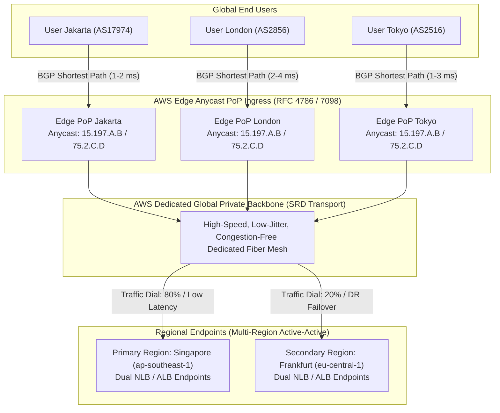
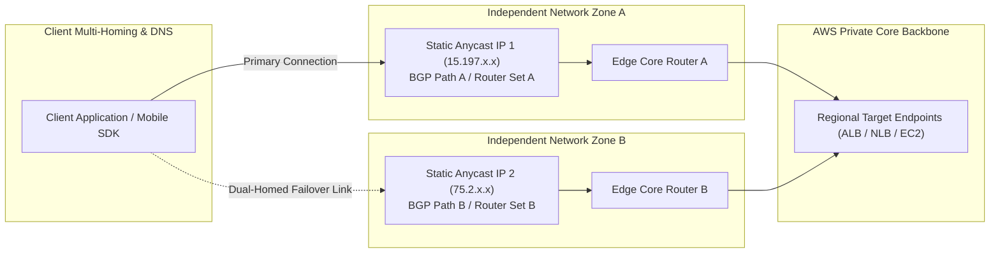
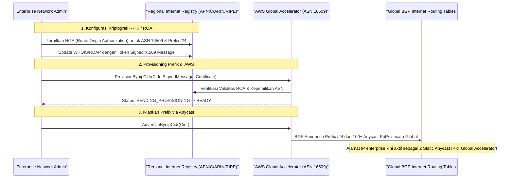
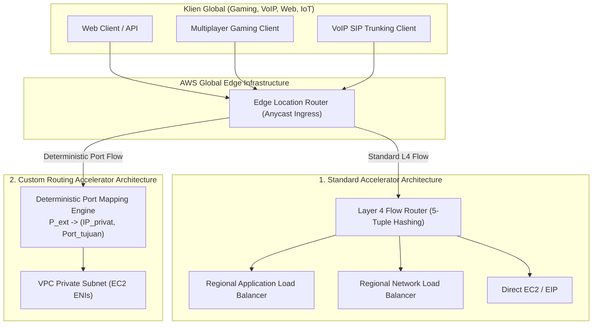
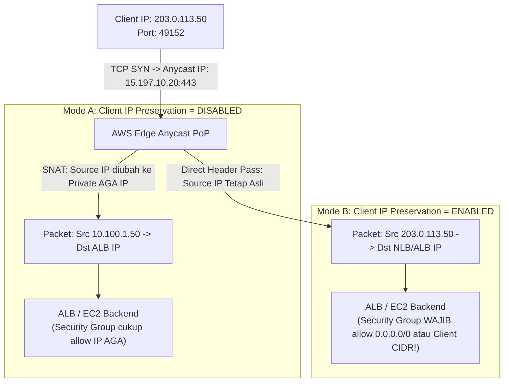
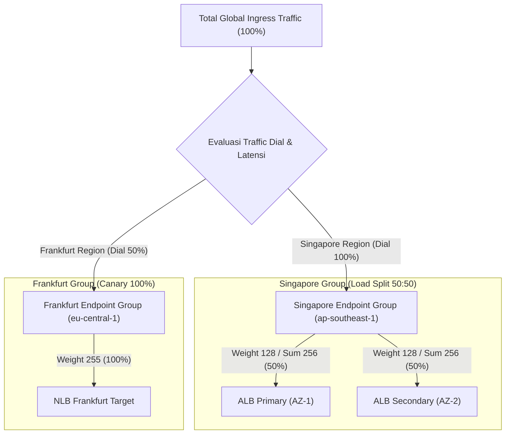
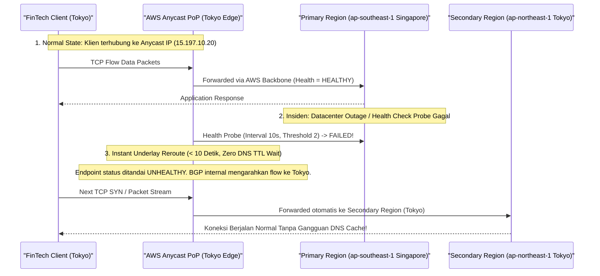
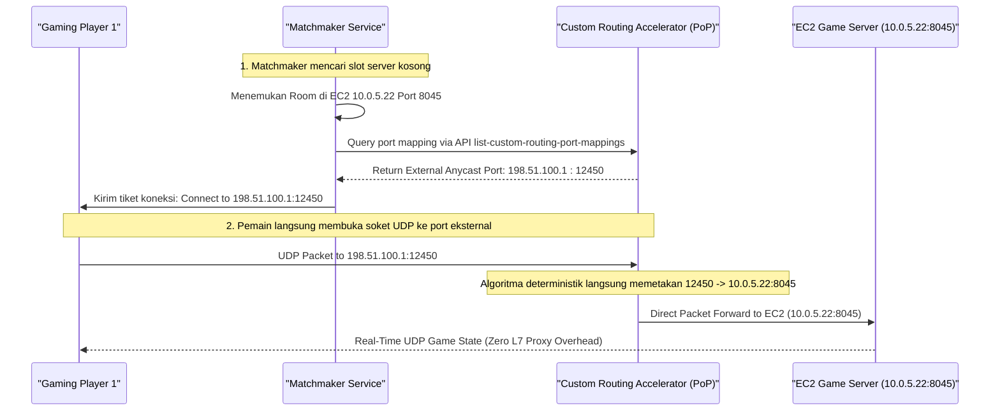
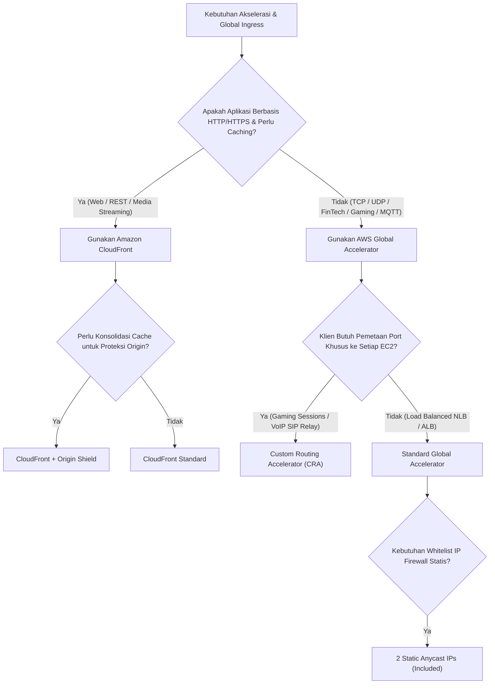

# Modul 25: Amazon CloudFront Anycast Edge & AWS Global Accelerator

<BadgeLabel type="sme" text="Level: Principal / SME" /> <BadgeLabel type="rfc" text="RFC 4786 (Anycast) / RFC 7098 (Anycast Flow) / RFC 9000 (QUIC) / RFC 8446 (TLS 1.3) / RFC 6480 (RPKI/ROA)" /> <BadgeLabel type="aws" text="Edge Ingress & Global Private Backbone" />

Ketika aplikasi enterprise melayani jutaan pengguna global, transmisi paket data melalui jaringan *public Internet* sering kali terhambat oleh *packet loss*, *jitter*, rute suboptimal ISP komersial, kongesti transit inter-AS, dan latensi *round-trip* (RTT) yang tinggi. AWS menyediakan dua pilar utama perutean *Global Ingress*:

1. **Amazon CloudFront**: Lapisan akselerasi konten Layer 7 berbasis HTTP/HTTPS/QUIC dengan arsitektur *multi-tier caching* terdistribusi (Edge PoP, Regional Edge Cache, dan Origin Shield) serta *programmable edge compute* (CloudFront Functions dan Lambda@Edge).
2. **AWS Global Accelerator (AGA)**: Layanan perutean paket Layer 4 berbasis **BGP Anycast** yang menyediakan **2 Static Anycast IP addresses** dari zona jaringan independen (*Independent Network Zones*). Global Accelerator mengarahkan lalu lintas TCP/UDP langsung dari *Edge Location* terdekat menuju aplikasi regional melalui **AWS Global Dedicated Private Fiber Backbone** dengan dukungan *Traffic Dials*, *Endpoint Weights*, *Client IP Preservation*, dan *Custom Routing Accelerator (CRA)*.

---

## 1. Layer 1: Protocol Mechanics & RFC Theory

::: tip STANDAR BEST PRACTICE INDUSTRI (SME RECOMMENDATION)
Untuk aplikasi API dinamis dan website global, kombinasikan **HTTP/3 (QUIC)** di CloudFront guna mengeliminasi *Head-of-Line (HoL) Blocking* di level transport. Untuk beban kerja non-HTTP (seperti financial FIX protocol, real-time gaming UDP, database multi-region ingress, IoT MQTT, VoIP SIP, atau enterprise TLS VPN), gunakan **AWS Global Accelerator** guna memastikan determinisme rute dan perlindungan *zero-DNS-TTL failover*.
:::

### A. BGP Anycast Routing Architecture (RFC 4786 / RFC 7098)

Pada model perutean Unicast konvensional, satu alamat IP publik hanya diasosiasikan dengan satu antarmuka fisik di satu lokasi geografis tertentu. Jika pengguna di London mengakses server di Singapura, seluruh paket harus melintasi puluhan Autonomous System (AS) publik di internet:

```
[London Client] ──(ISP A)──> (Transit Tier-1) ──> (Subsea Cable B) ──> (ISP C) ──> [Singapore Origin]
(RTT Handshake: 180-220 ms melintasi internet publik yang rentan packet loss dan jitter)
```

Sebaliknya, pada model **BGP Anycast** (RFC 4786), satu atau sepasang alamat IP yang sama (*shared IP address*) diiklankan melalui BGP (*Border Gateway Protocol*) secara simultan dari ratusan *Point of Presence* (PoP) di seluruh dunia menggunakan Autonomous System Number (ASN) AWS (misalnya AS16509):

```
[User Jakarta (AS17974)]  ──(BGP Best Path: 1 Hop) ──> [AWS Edge PoP Jakarta (Anycast IP: 15.197.x.x)]
[User London (AS2856)]    ──(BGP Best Path: 1 Hop) ──> [AWS Edge PoP London (Anycast IP: 15.197.x.x)]
[User Tokyo (AS2516)]     ──(BGP Best Path: 1 Hop) ──> [AWS Edge PoP Tokyo (Anycast IP: 15.197.x.x)]
[User New York (AS701)]   ──(BGP Best Path: 1 Hop) ──> [AWS Edge PoP New York (Anycast IP: 15.197.x.x)]
```



Keuntungan teknis fundamental BGP Anycast bagi SME Network Engineer:
1. **Reduksi RTT Koneksi Awal**: Klien menyelesaikan TCP 3-Way Handshake dan TLS 1.3 Handshake di Edge PoP lokal terdekat (RTT $1-5\text{ ms}$ bukan $180-250\text{ ms}$).
2. **Mitigasi DDoS Terdistribusi**: Serangan *volumetric flood* (seperti SYN Flood atau UDP Amplification) diserap dan disaring (*scrubbed*) di ratusan PoP edge, mencegah saturasi link pada *origin datacenter*.
3. **Isolasi Kegagalan Jaringan**: Jika satu PoP mengalami gangguan fiber lokal, BGP upstream internet otomatis mengalihkan trafik ke PoP tetangga terdekat secara transparan.

---

### B. Independent Network Zones (INZ) & Dual Anycast IP Isolation

Salah satu prinsip keandalan paling kritis di AWS Global Accelerator adalah alokasi **2 Static Anycast IPv4 Addresses** yang berasal dari dua **Independent Network Zones (INZ)** yang terpisah secara fisik dan logis:

$$\text{Static IP 1} \in \text{Network Zone A (Pool A, Upstream Transit A)}$$
$$\text{Static IP 2} \in \text{Network Zone B (Pool B, Upstream Transit B)}$$



- **Fault Domain Isolation**: Jika satu blok IP mengalami insiden *BGP route hijacking*, *route leak*, atau filter upstream ISP pihak ketiga di wilayah tertentu, klien dapat langsung menggunakan alamat IP kedua yang menggunakan jalur routing BGP independen.
- **Whitelist Firewall Statis**: Klien enterprise dan institusi finansial dapat melakukan *hard-coded IP whitelisting* pada *corporate outbound firewall* mereka tanpa khawatir alamat IP berubah seperti pada sistem DNS berbasis ALB.

---

### C. Bandwidth-Delay Product (BDP) & Transport Acceleration Physics

Formula transmisi data TCP:

$$\text{BDP (bits)} = \text{Bandwidth (bits/sec)} \times \text{RTT (sec)}$$

$$\text{Throughput}_{\text{max}} \le \frac{\text{TCP Receive Window (RWND)}}{\text{RTT}}$$

```
Perbandingan Perjalanan Paket: London Client -> Singapore Backend Origin (RTT 180 ms)

1. Public Internet (Tanpa Global Accelerator):
   - TCP SYN dikirim melintasi public WAN -> 180 ms
   - TLS 1.3 Handshake melintasi public WAN -> 180 ms
   - Waktu inisiasi koneksi sebelum data pertama: 360 ms
   - Paket data rentan drop pada peering point ISP, memicu TCP Congestion Window (CWND) collapse.

2. Melalui AWS Global Accelerator:
   - Client TCP SYN diselesaikan di Edge PoP London -> 4 ms
   - Paket data segera masuk ke AWS Dedicated Fiber Backbone (SRD transport, Zero Loss, Jitter < 1 ms)
   - Waktu inisiasi koneksi di sisi client: 4-8 ms
   - TCP Buffer selalu optimal, throughput transfer file besar meningkat hingga 60-300%!
```

---

### D. Bring Your Own IP (BYOIP) & RPKI / ROA Validation (RFC 6480 / RFC 6482)

Enterprise dengan reputasi IP yang sudah mapan atau kewajiban regulasi dapat membawa blok alamat IPv4 publik (`/24`) atau IPv6 (`/48`) milik sendiri ke AWS Global Accelerator menggunakan mekanisme **Bring Your Own IP (BYOIP)**:



---

## 2. Layer 2: AWS Distributed Underlay & Hyperplane Internals

::: tip STANDAR BEST PRACTICE INDUSTRI (SME RECOMMENDATION)
Pahami perbedaan fundamental: **Amazon CloudFront** melakukan *Layer 7 Termination* (membongkar request HTTP, memeriksa URI/Header, mengecek cache disk/memory, dan membangun koneksi HTTP baru ke origin). **AWS Global Accelerator Standard** melakukan *Layer 4 Proxying* (meneruskan TCP/UDP stream melalui flow hash 5-tuple). **Custom Routing Accelerator (CRA)** memetakan port eksternal secara deterministik ke *IP/Port EC2 internal* tanpa proxy buffer sama sekali.
:::

### A. Arsitektur Underlay: Standard vs Custom Routing Accelerator (CRA)

AWS Global Accelerator menyediakan dua varian arsitektur akselerator:



---

### B. Custom Routing Accelerator (CRA) Deterministic Port Mapping Mechanics

Pada Custom Routing Accelerator, AWS tidak menggunakan load balancing dinamis, melainkan **algoritma pemetaan port deterministik statis** (*one-to-one socket mapping*):

$$\text{Total Port Eksternal yang Dibutuhkan} = N_{\text{IP Subnet}} \times N_{\text{Target Ports per Instance}}$$

$$\text{Mapping Formula: } P_{\text{ext}} = P_{\text{base}} + (\text{Index}_{\text{ENI}} \times \Delta P_{\text{dest}}) + (P_{\text{dest}} - P_{\text{start}})$$

```
Contoh Arsitektur Gaming Matchmaker:
- Subnet Target: 10.0.10.0/28 (11 usable EC2 instances)
- Application Port Range: 8000 - 8009 (10 game sessions per server)
- External Listener Port Range: 10000 - 10109 (110 total ports)

Hasil Pemetaan Deterministik:
* External Port 10000 -> EC2 10.0.10.4 : Port 8000 (Game Room 1 Server 1)
* External Port 10001 -> EC2 10.0.10.4 : Port 8001 (Game Room 2 Server 1)
* External Port 10010 -> EC2 10.0.10.5 : Port 8000 (Game Room 1 Server 2)
* External Port 10011 -> EC2 10.0.10.5 : Port 8001 (Game Room 2 Server 2)
```

Dengan arsitektur ini, server *Matchmaking Controller* cukup memanggil API `aws globalaccelerator list-custom-routing-port-mappings` dan memberikan port eksternal `10001` kepada pemain 1–64 untuk langsung terhubung ke sesi game yang tepat tanpa melalui overhead Layer 7 load balancer.

---

### C. Client IP Preservation Underlay Internals

Ketika paket masuk ke Global Accelerator dan diteruskan ke target regional (ALB, NLB, atau EC2), arsitektur underlay memperlakukan IP header sebagai berikut:



::: warning PERINGATAN KRITIS SECURITY GROUP (CLIENT IP PRESERVATION)
Jika **`client_ip_preservation_enabled = true`**, Security Group pada backend EC2/ALB **TIDAK BISA** hanya mengizinkan CIDR internal AWS. Security Group akan mengevaluasi **alamat IP publik asli milik pengguna** (`203.0.113.50`). Jika Security Group tidak membuka port ke internet (`0.0.0.0/0` atau prefix IP klien), seluruh paket akan di-drop oleh firewall host (`tcp-flags = 2` REJECT)!
:::

---

## 3. Layer 3: AWS Resource Deep-Dive & Hard Limits

::: tip STANDAR BEST PRACTICE INDUSTRI (SME RECOMMENDATION)
Gunakan **Traffic Dials** di level Endpoint Group untuk melakukan *Canary Deployments* antar Region tanpa memodifikasi DNS record. Turunkan Traffic Dial secara bertahap dari 100% ke 0% saat melakukan pemeliharaan infrastruktur regional (*Zero-Downtime Maintenance*).
:::

### A. Matriks Komparasi: CloudFront vs Global Accelerator vs Custom Routing

| Fitur / Parameter | Amazon CloudFront | AWS Global Accelerator (Standard) | AWS Global Accelerator (Custom Routing) |
|---|---|---|---|
| **OSI Layer Operation** | **Layer 7 (HTTP/HTTPS/HTTP3)** | **Layer 4 (TCP / UDP)** | **Layer 4 (TCP / UDP)** |
| **Alamat IP Statis** | Dedicated IP via Custom SSL ($600/bln) | **2 Static Anycast IPs Bawaan (Gratis)** | **2 Static Anycast IPs Bawaan (Gratis)** |
| **Protokol yang Didukung** | HTTP, HTTPS, WebSockets, gRPC | Semua protokol TCP & UDP | Semua protokol TCP & UDP |
| **Mekanisme Routing** | Edge Caching & L7 Proxy | 5-Tuple / 2-Tuple Consistent Hashing | **Deterministic Port-to-Socket Mapping** |
| **Target Endpoints** | S3, ALB, NLB, EC2, Custom Origin | ALB, NLB, EC2 (EIP/ENI), Elastic IP | **VPC Subnets (EC2 Instance ENIs)** |
| **Client IP Preservation** | Header `X-Forwarded-For` | **Native L3 IP Header (ALB/EC2)** | **Native L3 IP Header** |
| **Caching Engine** | **Ya (450+ Edge Locations + REC)** | **Tidak Ada (Murni Stream Pass-Through)** | **Tidak Ada** |
| **Edge Compute** | CloudFront Functions / Lambda@Edge | Tidak Ada | Tidak Ada |
| **Failover Convergence Time** | Bergantung DNS TTL (10–60 detik) | **< 10 Detik (BGP Underlay Shift)** | Manual / API Driven |
| **BYOIP Support** | Ya (/24 IPv4) | Ya (/24 IPv4, /48 IPv6) | Ya (/24 IPv4) |

---

### B. Traffic Dials, Endpoint Weights & Failover Math

Global Accelerator mendistribusikan lalu lintas ke endpoint berdasarkan dua tingkatan bobot:

1. **Traffic Dial ($D_i$)**: Persentase trafik maksimum ($0\% - 100\%$) yang diizinkan masuk ke suatu **Endpoint Group Regional** tertentu.
2. **Endpoint Weight ($W_{i,j}$)**: Bobot individual ($0 - 255$) suatu endpoint di dalam satu grup regional.

$$\text{Porsi Trafik Endpoint } j \text{ di Region } i = D_i \times \frac{W_{i,j}}{\sum_{k=1}^{M} W_{i,k}}$$

```
Skenario Multi-Region Active-Active:
- Region A (Singapore): Traffic Dial = 100%
  * Endpoint 1 (ALB Primary): Weight = 128 (50% dari Region A)
  * Endpoint 2 (ALB Secondary): Weight = 128 (50% dari Region A)
- Region B (Frankfurt): Traffic Dial = 50% (Canary Region)
  * Endpoint 3 (NLB Frankfurt): Weight = 255 (100% dari Region B)
```



---

### C. Quota & Hard Limits Architecture Matrix

| Parameter / Resource Quota | Batas Default | Sifat Limit | Catatan Eskalasi Principal SME |
|---|---|---|---|
| **Accelerators per AWS Account** | **20** | Soft (Dapat dinaikkan) | Dapat mengajukan Service Quotas hingga ratusan untuk multi-tenant. |
| **Listeners per Accelerator** | **10** | Soft | Maksimal 50 listener per akselerator. |
| **Endpoint Groups per Listener** | **1 per Region** | Hard | Setiap listener dapat memiliki endpoint group di banyak region. |
| **Endpoints per Endpoint Group** | **10** | Soft | Dapat dinaikkan hingga 128 endpoint per region group. |
| **Port Range per Listener** | **65.535 port** | Hard | Mendukung port range multi-port (misal: 1000-2000). |
| **TCP Connection Idle Timeout** | **350 Detik** | Hard | Koneksi idle tanpa aktivitas akan di-terminate setelah 350 detik. |
| **Health Check Interval** | **10s atau 30s** | Hard | Setel 10s untuk failover agresif sub-10 detik. |
| **Health Check Threshold Count** | **1 sampai 10** | Hard | Standar rekomendasi: 2 atau 3 consecutive failures. |

---

## 4. Layer 4: Hop-by-Hop Packet Walkthrough & Flow Lifecycle

### A. Flow 1: Global TCP Ingress via Standard Accelerator with Client IP Preservation

```
[1. Klien di Sydney (IP: 198.51.100.25)]
    Koneksi ke Static Anycast IP (15.197.10.20:8443).
    Paket tiba di Edge PoP Sydney via BGP Best Path (RTT = 2 ms).
        │
        ▼
[2. AWS Edge Location (Sydney PoP)]
    * Evaluasi TCP SYN.
    * 5-Tuple Consistent Hash: Hash(198.51.100.25, 52140, 15.197.10.20, 8443, TCP).
    * Target Terpilih: Primary Endpoint Group di Singapore (ap-southeast-1).
    * Enkapsulasi SRD (Scalable Reliable Datagram) ke AWS Global Fiber Backbone.
        │
        ▼
[3. AWS Global Private Backbone Ingress]
    * Paket ditransmisikan melintasi kabel fiber privat terisolasi (Singapore <-> Sydney).
    * Zero internet packet loss, Jitter < 0.5 ms.
        │
        ▼
[4. Regional Gateway & NLB (ap-southeast-1 Singapore VPC)]
    * Header L3 IPv4 Source IP tetap: 198.51.100.25 (Client IP Preservation Enabled).
    * NLB meneruskan paket ke Backend EC2 di Private Subnet.
        │
        ▼
[5. Backend EC2 Instance & Application Daemon]
    * Security Group mengevaluasi Source IP: 198.51.100.25 (MATCH Ingress Rule).
    * Aplikasi menerima koneksi dengan Client IP asli secara transparan.
```

---

### B. Flow 2: Sub-10-Second Instant BGP Failover (Zero DNS TTL Delay)



---

### C. Flow 3: Custom Routing Accelerator Deterministic Port Mapping Flow



---

## 5. Layer 5: Production Terraform IaC & CLI Implementation Blueprints

::: tip STANDAR BEST PRACTICE INDUSTRI (SME RECOMMENDATION)
Terapkan **Dual-Region Multi-Endpoint Configuration** dengan `client_ip_preservation_enabled = true` dan `health_check_interval_seconds = 10` pada beban kerja produksi finansial dan mission-critical guna mencapai *Recovery Time Objective (RTO) < 10 detik*.
:::

### Blueprint: Multi-Region Global Accelerator with Dual NLB & Client IP Preservation

```hcl
terraform {
  required_version = ">= 1.5.0"
  required_providers {
    aws = {
      source  = "hashicorp/aws"
      version = "~> 5.0"
    }
  }
}

provider "aws" {
  alias  = "singapore"
  region = "ap-southeast-1"
}

provider "aws" {
  alias  = "jakarta"
  region = "ap-southeast-3"
}

# 1. AWS Global Accelerator (Global Resource)
resource "aws_globalaccelerator_accelerator" "enterprise_ga" {
  name            = "enterprise-multi-region-ga"
  ip_address_type = "IPV4"
  enabled         = true

  attributes {
    flow_logs_enabled   = true
    flow_logs_s3_bucket = "enterprise-ga-flow-logs-123456789012"
    flow_logs_s3_prefix = "global-accelerator/"
  }

  tags = {
    Environment = "Production"
    ManagedBy   = "Terraform"
    Tier        = "SME-Mastery"
  }
}

# 2. Global Accelerator TCP Listener
resource "aws_globalaccelerator_listener" "tls_listener" {
  accelerator_arn = aws_globalaccelerator_accelerator.enterprise_ga.id
  client_affinity = "NONE" # 5-tuple flow hashing
  protocol        = "TCP"

  port_range {
    from_port = 443
    to_port   = 443
  }

  port_range {
    from_port = 8443
    to_port   = 8443
  }
}

# 3. Endpoint Group Primary (Singapore Region)
resource "aws_globalaccelerator_endpoint_group" "singapore_group" {
  listener_arn                  = aws_globalaccelerator_listener.tls_listener.id
  endpoint_group_region         = "ap-southeast-1"
  traffic_dial_percentage       = 100.0
  health_check_interval_seconds = 10
  health_check_path             = "/healthz"
  health_check_port             = 443
  health_check_protocol         = "HTTPS"
  threshold_count               = 2

  endpoint_configuration {
    endpoint_id                    = "arn:aws:elasticloadbalancing:ap-southeast-1:123456789012:loadbalancer/net/singapore-nlb/abc12345"
    weight                         = 255
    client_ip_preservation_enabled = true
  }
}

# 4. Endpoint Group Secondary (Jakarta Region - DR Failover)
resource "aws_globalaccelerator_endpoint_group" "jakarta_group" {
  listener_arn                  = aws_globalaccelerator_listener.tls_listener.id
  endpoint_group_region         = "ap-southeast-3"
  traffic_dial_percentage       = 100.0
  health_check_interval_seconds = 10
  health_check_path             = "/healthz"
  health_check_port             = 443
  health_check_protocol         = "HTTPS"
  threshold_count               = 2

  endpoint_configuration {
    endpoint_id                    = "arn:aws:elasticloadbalancing:ap-southeast-3:123456789012:loadbalancer/net/jakarta-nlb/xyz67890"
    weight                         = 255
    client_ip_preservation_enabled = true
  }
}

# 5. Output Anycast Static IP Addresses
output "global_accelerator_static_ips" {
  description = "Dual Static Anycast IPv4 Addresses allocated across Independent Network Zones"
  value       = aws_globalaccelerator_accelerator.enterprise_ga.ip_sets[0].ip_addresses
}

output "global_accelerator_dns_name" {
  description = "Global Accelerator Canonical Dual-Stack DNS Name"
  value       = aws_globalaccelerator_accelerator.enterprise_ga.dns_name
}
```

---

### Perintah Diagnosis & Operasi AWS CLI

```bash
# 1. Menampilkan detail status akselerator dan 2 Static Anycast IPs
aws globalaccelerator list-accelerators --query "Accelerators[*].[Name,IpSets[0].IpAddresses,Status,Enabled]" --output table

# 2. Memeriksa status kesehatan seluruh endpoint regional
aws globalaccelerator describe-endpoint-group \
  --endpoint-group-arn "arn:aws:globalaccelerator::123456789012:accelerator/xxx/listener/yyy/endpoint-group/zzz" \
  --query "EndpointGroup.[EndpointGroupRegion,TrafficDialPercentage,HealthCheckProtocol,EndpointDescriptions]"

# 3. Mengubah Traffic Dial secara dinamis (Canary Shift 100% -> 20%)
aws globalaccelerator update-endpoint-group \
  --endpoint-group-arn "<ENDPOINT_GROUP_ARN>" \
  --traffic-dial-percentage 20.0

# 4. Memeriksa daftar pemetaan port Custom Routing Accelerator
aws globalaccelerator list-custom-routing-port-mappings \
  --accelerator-arn "<CRA_ACCELERATOR_ARN>" \
  --endpoint-group-arn "<CRA_ENDPOINT_GROUP_ARN>" \
  --max-results 20
```

---

## 6. Layer 6: Failure Modes, Anti-Patterns & SEV-1 Troubleshooting Matrix

::: tip STANDAR BEST PRACTICE INDUSTRI (SME RECOMMENDATION)
Saat melakukan investigasi insiden *Connection Refused* atau *Packet Drop* pada aplikasi di belakang Global Accelerator dengan `client_ip_preservation_enabled = true`, periksa **Security Group Ingress Rules** pada target instance/ALB. Masalah paling umum adalah Security Group hanya membuka IP subnet internal VPC dan menolak IP publik klien internet!
:::

| Gejala / Failure Mode | Root Cause Teknis | Perintah Diagnosa / Log Query | Solusi & Mitigasi Definitif |
|---|---|---|---|
| **Koneksi Klien Ditolak / Timeout Saat Mengaktifkan Client IP Preservation** | Security Group pada target EC2/ALB hanya mengizinkan CIDR VPC internal (`10.0.0.0/16`). Paket dari klien dengan IP publik di-drop oleh Security Group. | VPC Flow Logs: `action = REJECT AND tcp-flags = 2` pada IP publik klien | Tambahkan rule Security Group Ingress yang mengizinkan CIDR publik klien (`0.0.0.0/0` atau whitelist corporate IP range). |
| **Polarisasi Hash pada Long-Lived WebSocket / Mega-NAT Proxy** | Puluhan ribu koneksi dari satu korporat proxy (Source IP tunggal) menggunakan `Client Affinity = SOURCE_IP`, membebani 1 backend AZ hingga 100% CPU. | CloudWatch Metrics: `UnhealthyHostCount` dan `HealthyHostCount` per AZ | Ubah `client_affinity = NONE` (5-tuple hashing) dan aktifkan *Least Outstanding Requests* pada target load balancer. |
| **Traffic Flapping & Cascading Cross-Region Shift** | Health check interval terlalu agresif (10s) dengan `threshold_count = 1` saat terjadi micro-spike latency, memicu failover prematur. | `aws globalaccelerator describe-endpoint-group` cek riwayat flapping status | Naikkan `threshold_count = 3` dan pastikan path `/healthz` mengecek dependensi backend secara komprehensif. |
| **Asymmetric Routing Drop pada Inline NGFW** | Trafik masuk melalui Anycast GA -> NLB -> EC2, tetapi rute kembali (*return path*) keluar langsung via default IGW lokal tanpa melalui session table GA. | Analisa tabel conntrack firewall atau VPC Flow Logs TCP Flag mismatch | Pastikan routing table subnet target memiliki default route yang benar dan tidak bypass flow inspeksi. |
| **Custom Routing Port Allocation Error** | Subnet VPC terlalu kecil (`/28`) sementara jumlah target port aplikasi terlalu banyak, menyebabkan port exhaustion pada listener range. | AWS CLI: `list-custom-routing-port-mappings` | Perluas CIDR subnet VPC (misal ke `/24`) atau kurangi rentang target port per instance. |
| **PMTUD Black Hole over Edge PoP (Koneksi Freeze saat Payload Besar)** | MTU backend instance disetel 9001 (Jumbo Frame), tetapi jaringan Anycast Edge membatasi MTU ke 1500 bytes dan ICMP Type 3 Code 4 di-drop. | `ping -s 1472 -M do <Target_IP>` / tcpdump | Terapkan **TCP MSS Clamping** ke `1460` (IPv4) atau `1440` (IPv6) pada backend listener. |

---

## 7. Layer 7: Principal Architect Tradeoff Framework

::: tip STANDAR BEST PRACTICE INDUSTRI (SME RECOMMENDATION)
Pilihlah **Amazon CloudFront** jika aplikasi Anda dominan berbasis protokol Web (HTTP/HTTPS/REST/GraphQL) dan memperoleh keuntungan besar dari *Edge Caching* serta mitigasi WAF Layer 7. Pilihlah **AWS Global Accelerator** jika Anda memerlukan alamat **Static Anycast IP** yang tidak pernah berubah untuk sistem non-HTTP, game server, koneksi VPN underlay, atau API enterprise dengan kebutuhan *failover multi-region instan (< 10 detik)*.
:::

### Decision Matrix: Global Ingress Architecture



| Parameter Keputusan | Amazon CloudFront | AWS Global Accelerator (Standard) | AWS Global Accelerator (Custom Routing) | Route 53 Multi-Region ARC |
|---|---|---|---|---|
| **OSI Layer** | **Layer 7** | **Layer 4** | **Layer 4** | **Layer 3 / DNS** |
| **Static IP Support** | Dedicated IP Mahal ($600/bln) | **2 Static Anycast IPs (Included)** | **2 Static Anycast IPs (Included)** | Bergantung IP Target |
| **Edge Caching Engine** | **Ya (450+ Edge Locations + REC)** | Tidak Ada | Tidak Ada | Tidak Ada |
| **Failover Speed** | Bergantung DNS TTL (10–60 detik) | **< 10 Detik (BGP Underlay Shift)** | Manual / API Driven | 30–60 Detik (DNS Caching) |
| **Protocol Compatibility** | HTTP/1.1, HTTP/2, HTTP/3, WebSockets | **Semua Protokol TCP & UDP** | **Semua Protokol TCP & UDP** | Semua Protokol L3-L7 |
| **Client IP Preservation** | Header `X-Forwarded-For` | **Native L3 IPv4/IPv6 Header** | **Native L3 IPv4/IPv6 Header** | Native L3 |
| **WAF Integration** | AWS WAF di Edge PoP | Regional WAF (via ALB) | Tidak Didukung | Regional WAF |
| **Pricing Model** | $0.085/GB egress + Request count | $0.025/jam ($18/bln) + $0.015–0.035/GB | $0.025/jam ($18/bln) + $0.015–0.035/GB | Biaya Health Check & DNS Query |

