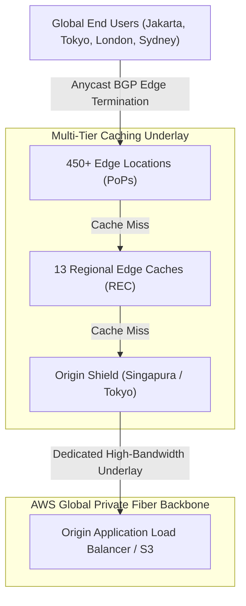
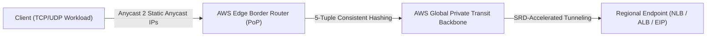
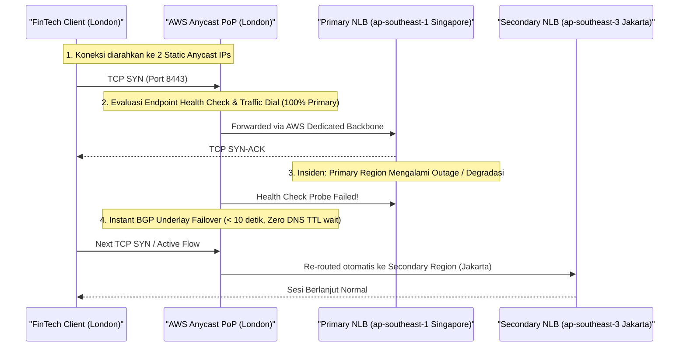
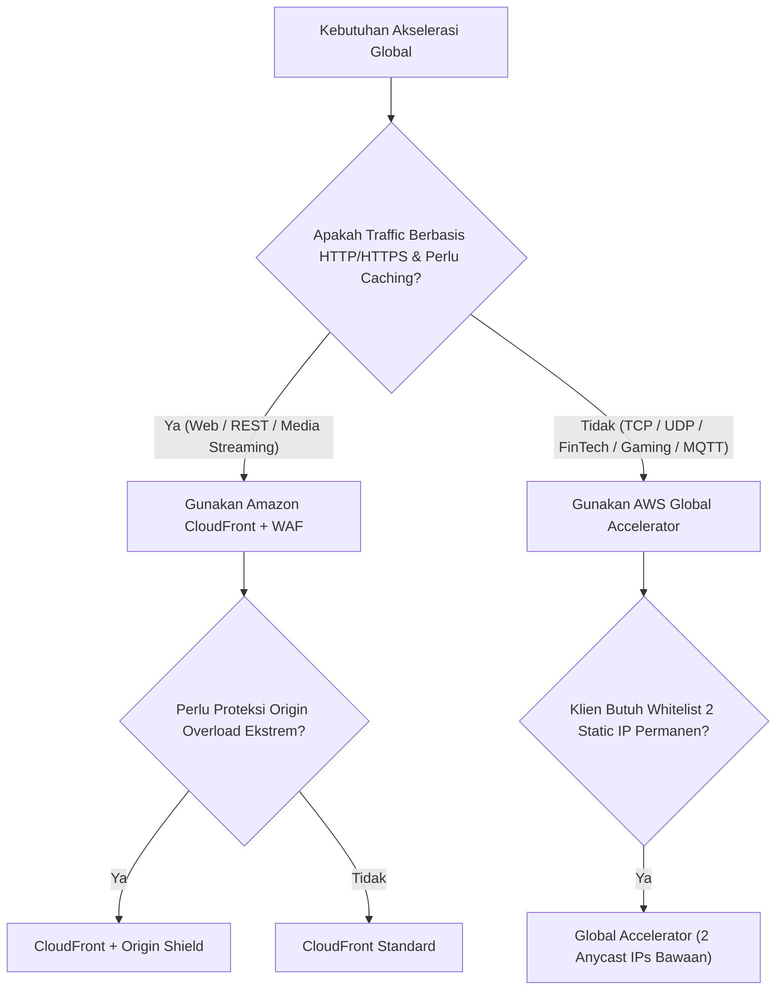

# Modul 25: CloudFront Anycast Edge & AWS Global Accelerator

<BadgeLabel type="sme" text="Level: Principal / SME" /> <BadgeLabel type="rfc" text="RFC 4786 (Anycast) / RFC 9000 (QUIC) / RFC 8446 (TLS 1.3)" /> <BadgeLabel type="aws" text="Edge Ingress & Global Backbone Routing" />

Ketika aplikasi enterprise melayani pengguna global, transmisi paket data melalui jaringan *public Internet* sering kali terhambat oleh *packet loss*, *jitter*, rute suboptimal ISP komersial, dan latensi *round-trip* (RTT) yang tinggi. AWS menyediakan dua pilar utama perutean *Edge*: **Amazon CloudFront** untuk akselerasi konten Layer 7 dengan *caching*, dan **AWS Global Accelerator** untuk perutean paket Layer 4 berbasis **BGP Anycast** melalui *dedicated global private fiber backbone* milik AWS.

---

## 1. Layer 1: Protocol Mechanics & RFC Theory

::: tip STANDAR BEST PRACTICE INDUSTRI (SME RECOMMENDATION)
Aktifkan **HTTP/3 (RFC 9000)** pada seluruh distribusi CloudFront untuk mengeliminasi fenomena *Head-of-Line (HoL) Blocking* di layer transport pada koneksi *mobile/lossy networks*. Untuk API dinamis dengan payload besar, pasang kompresi **Brotli (`br`)** dan **Gzip** secara otomatis di level edge untuk memangkas ukuran transfer data hingga 30%.
:::

### A. BGP Anycast Routing Architecture (RFC 4786 / RFC 7098)

Pada model perutean Anycast, satu atau sepasang alamat IP yang sama (*shared IP address*) diiklankan melalui BGP (*Border Gateway Protocol*) secara simultan dari ratusan *Point of Presence* (PoP) di seluruh dunia:

```
[User Jakarta (AS17974)]  ──(BGP Best Path: 2 Hops)──> [AWS Edge PoP Jakarta (Anycast IP: 13.249.x.x)]
[User London (AS2856)]    ──(BGP Best Path: 1 Hop) ──> [AWS Edge PoP London (Anycast IP: 13.249.x.x)]
[User Tokyo (AS2516)]     ──(BGP Best Path: 2 Hops)──> [AWS Edge PoP Tokyo (Anycast IP: 13.249.x.x)]
```

Keuntungan arsitektur BGP Anycast:
1. **Reduksi RTT Drastis**: Klien melakukan TCP dan TLS Handshake di PoP lokal terdekat.
2. **Mitigasi DDoS Terdistribusi**: Serangan *volumetric flood* terserap dan terbagi (*scrubbed*) di ratusan PoP edge, mencegah saturasi *origin datacenter*.

### B. Bandwidth-Delay Product (BDP) & TCP Acceleration

Formula transmisi data TCP:

$$\text{BDP} = \text{Bandwidth (bytes/sec)} \times \text{RTT (sec)}$$

```
Skenario: Client di London mengakses Origin di Singapore (RTT = 180 ms)
- Tanpa Edge (Direct Internet):
  Client harus menunggu 3x RTT (TCP 3-way Handshake + TLS 1.3 Handshake = ~540 ms) 
  sebelum byte data pertama dikirim.
  
- Dengan CloudFront / Global Accelerator:
  Client melakukan Handshake ke PoP London (RTT = 5 ms). Total handshake = ~15 ms.
  Koneksi dari PoP London ke Singapore berjalan melalui koneksi TCP Keep-Alive 
  yang sudah pre-warmed di jaringan Private AWS Backbone.
```

---

## 2. Layer 2: AWS Distributed Underlay & Hyperplane Internals

::: tip STANDAR BEST PRACTICE INDUSTRI (SME RECOMMENDATION)
Gunakan **Origin Shield** di Region yang paling dekat dengan origin backend (misal: `ap-southeast-1` jika ALB berada di Singapura). Origin Shield bertindak sebagai *centralized caching tier* tambahan yang mengonsolidasikan cache-miss dari ratusan PoP global, menurunkan beban request ke origin server hingga **90–95%**.
:::

### A. CloudFront Global Edge Infrastructure Hierarchy



1. **Edge Locations (PoPs)**: Titik kontak pertama klien untuk terminasi SSL/TLS dan *caching hot content*.
2. **Regional Edge Caches (REC)**: Cache berkapasitas sangat besar yang menampung objek *warm content* agar tidak perlu langsung memanggil origin.
3. **Origin Shield**: Lapisan cache tunggal tepat di depan origin untuk mereduksi *thundering herd problem* saat cache kedaluwarsa serentak.

### B. AWS Global Accelerator Underlay Mechanics

Berbeda dengan CloudFront yang merupakan HTTP reverse proxy, **AWS Global Accelerator** beroperasi murni pada Layer 4:



- Memberikan **2 Static Anycast IPv4 Addresses** independen (dari subnet pool yang terpisah untuk redundansi BGP).
- Lalu lintas dialihkan dari Edge PoP terdekat ke Region AWS melalui jaringan serat optik pribadi internal AWS (*congested-free backbone*).
- Mendukung protokol non-HTTP seperti WebSockets, Gaming UDP, Voice over IP (VoIP), IoT MQTT, dan Financial FIX protocol.

---

## 3. Layer 3: AWS Resource Deep-Dive & Hard Limits

::: tip STANDAR BEST PRACTICE INDUSTRI (SME RECOMMENDATION)
Gunakan **CloudFront Functions** untuk manipulasi header sederhana, normalisasi query-string, penulisan ulang URL (*URL rewrites*), dan validasi token JWT ringan pada latensi sub-milidetik (<1 ms). Gunakan **Lambda@Edge** hanya jika request memerlukan *body parsing*, panggilan database eksternal, atau komputasi kriptografi intensif.
:::

### A. Komparasi CloudFront Functions vs Lambda@Edge

| Fitur / Parameter | CloudFront Functions | Lambda@Edge |
|---|---|---|
| **Runtime Language** | JavaScript (ECMAScript 5.1+) | Node.js, Python |
| **Execution Phase** | Viewer Request / Viewer Response | Viewer Request/Response & Origin Request/Response |
| **Execution Latency** | **< 1 milidetik (Sub-ms)** | Puluhan milidetik (Cold-start possible) |
| **Max Execution Time** | **< 1 milidetik** | 5 detik (Viewer), 30 detik (Origin) |
| **Akses ke Request Body** | Tidak | **Ya (Hingga 1 MB / 40 MB streaming)** |
| **Network Access / DB Calls** | **Tidak (Sandbox Terisolasi)** | **Ya (Akses VPC / Internet / DynamoDB)** |
| **Pricing** | $0.10 per 1M invocations | $0.60 per 1M invocations + Durasi |

### B. Quota & Limits Architecture Matrix

| Parameter / Resource | Amazon CloudFront | AWS Global Accelerator |
|---|---|---|
| **Supported Protocols** | HTTP, HTTPS, HTTP/2, HTTP/3, WebSockets | **TCP, UDP** (Semua protokol L4) |
| **Static IP Address** | Dedicated IP via Custom SSL ($600/bln) | **2 Static Anycast IPs Bawaan (Gratis)** |
| **Max Single File Size** | 30 GB per object | N/A (Stream-based) |
| **Request Timeout** | 60 detik (default), max 180 detik | 350 detik (TCP connection timeout) |
| **Client IP Preservation** | Header `X-Forwarded-For` | **Client IP Preservation Native pada ALB/EC2** |
| **Traffic Shifting / Dials** | Route 53 Weighted Records | **Instant Traffic Dials (0–100%)** |

---

## 4. Layer 4: Hop-by-Hop Packet Walkthrough & Flow Lifecycle

### A. Dynamic API Ingress Flow via CloudFront with Origin Shield

```
[1. Mobile Client (Jakarta)]
   DNS Query: api.enterprise.com -> Resolves to CloudFront Anycast IP (Jakarta PoP)
   TLS 1.3 Handshake diselesaikan di PoP Jakarta (~5 ms RTT).
       │
       ▼
[2. CloudFront Edge PoP (Jakarta)]
   * Evaluasi Cache Policy: Cache-Control: no-cache -> Cache Miss.
   * Forwarding request melalui AWS Internal Backbone.
       │
       ▼
[3. Regional Edge Cache (Singapore) + Origin Shield]
   * Cek konsolidasi request.
       │
       ▼
[4. Origin Application Load Balancer (Singapore VPC)]
   * Menerima request dengan HTTP headers yang dinormalisasi + CloudFront Signature.
   * X-Forwarded-For: <Client_IP_Jakarta>, <CloudFront_PoP_IP>.
       │
       ▼
[5. Response dikirim kembali melalui AWS Backbone ke PoP Jakarta -> Mobile Client]
```

### B. TCP Traffic Flow via AWS Global Accelerator with Instant Failover



---

## 5. Layer 5: Production Terraform IaC & CLI Implementation Blueprints

::: tip STANDAR BEST PRACTICE INDUSTRI (SME RECOMMENDATION)
Kombinasikan **CloudFront Managed Cache Policies** (`CachingOptimized` atau `CachingDisabled` untuk API) dengan **Origin Request Policy** (`AllViewerExceptHostHeader`) guna menghindari konflik *Host header* dengan nama domain ALB di backend.
:::

### Blueprint: Multi-Region Global Accelerator & CloudFront with Origin Shield

```hcl
# 1. AWS Global Accelerator with Dual Static Anycast IPs
resource "aws_globalaccelerator_accelerator" "fintech_ga" {
  name            = "fintech-global-accelerator"
  ip_address_type = "IPV4"
  enabled         = true

  tags = {
    Environment = "Production"
    Compliance  = "PCI-DSS"
  }
}

# 2. Global Accelerator Listener for TCP Port 8443
resource "aws_globalaccelerator_listener" "tcp_listener" {
  accelerator_arn = aws_globalaccelerator_accelerator.fintech_ga.id
  client_affinity = "SOURCE_IP" # Sticky Session by Source IP
  protocol        = "TCP"

  port_range {
    from_port = 8443
    to_port   = 8443
  }
}

# 3. Endpoint Group Primary (Singapore) with Traffic Dial
resource "aws_globalaccelerator_endpoint_group" "singapore_eg" {
  listener_arn                  = aws_globalaccelerator_listener.tcp_listener.id
  endpoint_group_region         = "ap-southeast-1"
  traffic_dial_percentage       = 100.0
  health_check_interval_seconds = 10
  health_check_path             = "/healthz"
  health_check_port             = 8443
  health_check_protocol         = "TCP"
  threshold_count               = 2

  endpoint_configuration {
    endpoint_id                    = aws_lb.singapore_nlb.arn
    weight                         = 128
    client_ip_preservation_enabled = true
  }
}

# 4. CloudFront Distribution with Origin Shield & HTTP/3 Enabled
resource "aws_cloudfront_distribution" "api_cdn" {
  enabled             = true
  is_ipv6_enabled     = true
  http_version        = "http2and3" # Enable HTTP/3 QUIC
  price_class         = "PriceClass_All" # Global Edge Deployment
  aliases             = ["api.enterprise.com"]

  origin {
    domain_name = aws_lb.singapore_alb.dns_name
    origin_id   = "alb-origin-singapore"

    custom_origin_config {
      http_port              = 80
      https_port             = 443
      origin_protocol_policy = "https-only"
      origin_ssl_protocols   = ["TLSv1.2", "TLSv1.3"]
      origin_read_timeout    = 60
      origin_keepalive_timeout = 60
    }

    origin_shield {
      enabled              = true
      origin_shield_region = "ap-southeast-1"
    }
  }

  default_cache_behavior {
    target_origin_id       = "alb-origin-singapore"
    viewer_protocol_policy = "redirect-to-https"
    allowed_methods        = ["GET", "HEAD", "OPTIONS", "PUT", "POST", "PATCH", "DELETE"]
    cached_methods         = ["GET", "HEAD"]

    # Use AWS Managed Policies for Low Latency
    cache_policy_id          = "4135ea2d-6df8-44a3-9df3-4b5a84be39ad" # CachingDisabled for API
    origin_request_policy_id = "b689b0a8-53d0-40ab-baf2-68738e2966ac" # AllViewerExceptHostHeader

    compress = true
  }

  restrictions {
    geo_restriction {
      restriction_type = "none"
    }
  }

  viewer_certificate {
    acm_certificate_arn      = "arn:aws:acm:us-east-1:123456789012:certificate/abc-us-east-1"
    ssl_support_method       = "sni-only"
    minimum_protocol_version = "TLSv1.2_2021"
  }

  tags = {
    Environment = "Production"
  }
}
```

---

## 6. Layer 6: Failure Modes, Edge Cases, Anti-Patterns & SEV-1 Troubleshooting Matrix

::: tip STANDAR BEST PRACTICE INDUSTRI (SME RECOMMENDATION)
Saat melakukan investigasi insiden 504 Gateway Timeout di CloudFront, periksa secara terpisah metrik `OriginLatency` di CloudFront dan `TargetResponseTime` di ALB. Jika `TargetResponseTime` normal (<50 ms) tetapi CloudFront 504, masalah berada pada konektivitas MTU atau TLS negotiation antara CloudFront dan ALB.
:::

| Gejala / Failure Mode | Root Cause Teknis | Perintah Diagnosa / Log Query | Solusi & Mitigasi Definitif |
|---|---|---|---|
| **HTTP 504 Gateway Timeout dari CloudFront** | ALB Origin membutuhkan waktu lebih lama untuk merespons daripada `origin_read_timeout` (default 30s) saat database backend lock. | Athena CloudFront Access Log: `WHERE status = 504 AND time_taken > 30` | Naikkan `origin_read_timeout` di Origin Settings dan optimasi query database backend. |
| **SSL Handshake Failure ke Origin (502 Bad Gateway)** | Sertifikat SSL pada ALB backend tidak menyertakan domain yang dikirim oleh CloudFront di SNI Origin Request. | Periksa parameter `origin_ssl_protocols` dan SSL Host Header di CloudFront settings. | Pastikan nama domain pada sertifikat ACM di ALB cocok dengan domain `Origin Custom Header` atau FQDN ALB. |
| **Cache Hit Ratio Anjlok (< 20%)** | Query string dinamis (seperti timestamp `?_=162983719`) diteruskan tanpa normalisasi ke dalam cache key. | Analisa CloudFront Cache Statistics Report di AWS Console. | Gunakan **CloudFront Functions** untuk membuang (*strip*) query parameter non-esensial sebelum cache lookup. |
| **Traffic GA Tidak Merata / Macet di 1 Region** | Health check Global Accelerator gagal di satu endpoint, memicu failover 100% traffic ke region DR. | `aws globalaccelerator describe-endpoint-group --endpoint-group-arn <ARN>` | Periksa status health check endpoint target dan security group ingress port health probe. |

---

## 7. Layer 7: Principal Architect Tradeoff Framework

::: tip STANDAR BEST PRACTICE INDUSTRI (SME RECOMMENDATION)
Pilihlah **CloudFront** untuk aplikasi berbasis web/HTTP yang membutuhkan *Edge Caching*, WAF terdistribusi, dan kompresi konten statis/dinamis. Pilihlah **AWS Global Accelerator** untuk sistem perbankan/finansial, game server, koneksi IoT, atau API enterprise yang mewajibkan alamat **Static IP** yang tidak pernah berubah untuk kebutuhan *firewall whitelisting* di sisi klien korporat.
:::

### Decision Matrix: Global Ingress Strategy



| Parameter Keputusan | Amazon CloudFront | AWS Global Accelerator | Direct-to-VPC Internet Gateway |
|---|---|---|---|
| **OSI Layer Operation** | **Layer 7 (HTTP/HTTPS/HTTP3)** | **Layer 4 (TCP / UDP)** | Layer 3 / Layer 4 |
| **Edge Caching Storage** | **Ya (450+ PoP + Regional Cache)** | **Tidak Ada (Pass-Through)** | Tidak Ada |
| **Client Static IPs** | Dedicated IP Mahal ($600/bln) | **2 Static Anycast IPs (Included)** | Elastic IP per AZ (Unicast) |
| **Failover Convergence Time** | Bergantung pada DNS TTL (10–60s) | **< 10 Detik (Underlay BGP Shift)** | Tergantung DNS TTL & Route 53 |
| **DDoS Defense Capability** | AWS Shield Standard + WAF L7 | AWS Shield Standard + L4 Anycast | AWS Shield Standard (Saturasi VPC mungkin) |
| **Pricing Architecture** | $0.085/GB data transfer out + Requests | $0.025/jam ($18/bln) + $0.015–0.035/GB premium | $0.09/GB standar AWS Data Transfer |
