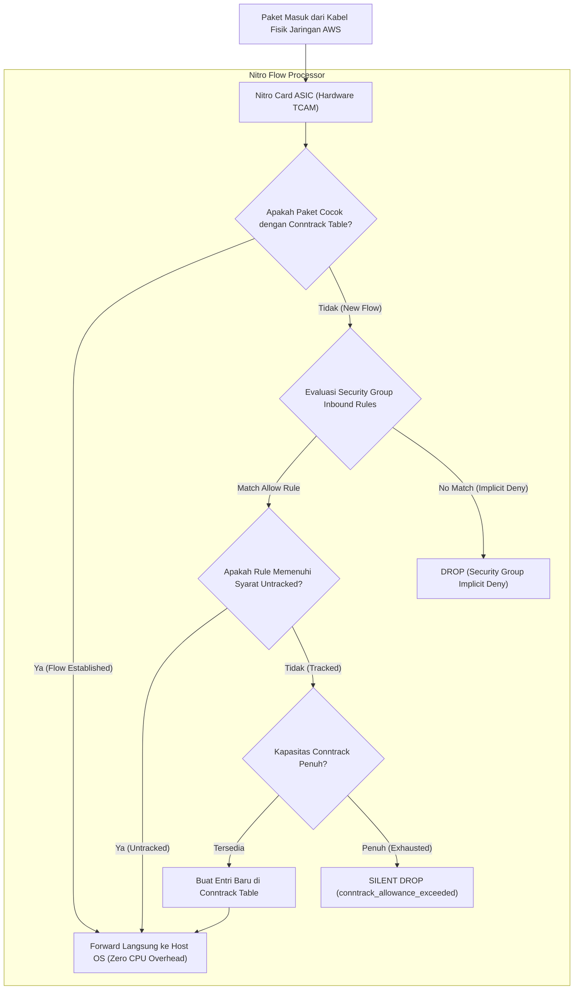
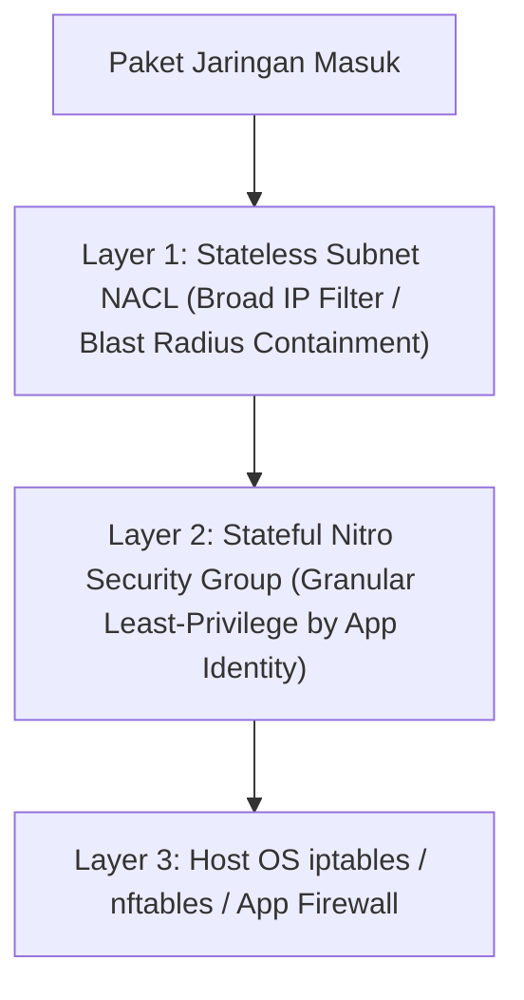

# Modul 27: Security Groups vs NACLs & Conntrack Semantics

<BadgeLabel type="sme" text="Level: Principal / SME" /> <BadgeLabel type="rfc" text="RFC 2979 / RFC 793 / RFC 6056 (Ephemeral Ports)" /> <BadgeLabel type="aws" text="Nitro Security Engine & Conntrack Mechanics" />

Di dalam Amazon VPC, keamanan jaringan tingkat paket dikendalikan oleh dua lapisan proteksi utama: **Security Groups** (stateful firewall di level ENI) dan **Network Access Control Lists / NACLs** (stateless firewall di level subnet). Bagi seorang **Principal Cloud Network Architect**, memahami perbedaan mekanika keduanya—khususnya implikasi *hardware connection tracking* pada Nitro Card dan jebakan *ephemeral return ports* pada NACLs—adalah kunci mencegah pemadaman sistem (*SEV-1 outage*) dan kebocoran keamanan.

---

## 1. Layer 1: Protocol Mechanics & RFC Theory

::: tip STANDAR BEST PRACTICE INDUSTRI (SME RECOMMENDATION)
Selalu izinkan rentang port *ephemeral* lengkap **TCP 1024–65535** pada aturan *Outbound NACL* untuk subnet privat yang menginisiasi koneksi keluar ke Internet atau API eksternal. Membatasi port *outbound* hanya ke port 80/443 pada NACL adalah kesalahan fatal (*anti-pattern*) yang akan memblokir 100% lalu lintas respons (*return traffic*).
:::

### A. Stateful Packet Inspection (SPI) vs Stateless Filtering

```
+-------------------------------------------------------------------------------+
|                    STATEFUL vs STATELESS EVALUATION FLOW                      |
+-------------------------------------------------------------------------------+
| 1. Stateful Filtering (Security Groups - RFC 2979):                          |
|    Packet Ingress -> Rule Match -> Conntrack Entry Dibuat (5-Tuple State)     |
|    Packet Egress (Reply) -> Dikenali oleh Conntrack Table -> OTOMATIS LOLOS   |
|    * Tidak memerlukan aturan Outbound eksplisit untuk traffic balasan.        |
+-------------------------------------------------------------------------------+
| 2. Stateless Filtering (Network Access Control Lists - NACLs):               |
|    Packet Ingress -> Evaluasi Inbound Rule (Rule 100, 200.. First Match)     |
|    Packet Egress (Reply) -> DIEVALUASI ULANG dari Rule 100 Outbound.          |
|    * MEMERLUKAN aturan Outbound eksplisit untuk mengizinkan Ephemeral Ports.  |
+-------------------------------------------------------------------------------+
```

### B. Ephemeral Ports & Port Randomization (RFC 6056)

Ketika klien membuka koneksi TCP/UDP ke server (misal: `10.0.1.50` menghubungi `api.github.com:443`), sistem operasi klien mengalokasikan port sumber sementara (*ephemeral port*) secara acak:

- **IANA Standard**: `49152 – 65535`
- **Linux Kernel Default (`/proc/sys/net/ipv4/ip_local_port_range`)**: `32768 – 60999`
- **Windows Server (2008 ke atas)**: `49152 – 65535`
- **AWS Elastic Load Balancing / NAT Gateway**: `1024 – 65535`

$$\text{TCP Session 5-Tuple: } (\text{SrcIP: } 10.0.1.50, \ \text{SrcPort: } \mathbf{49821}, \ \text{DstIP: } 140.82.121.4, \ \text{DstPort: } 443, \ \text{Proto: } 6)$$

---

## 2. Layer 2: AWS Distributed Underlay & Hyperplane Internals

::: tip STANDAR BEST PRACTICE INDUSTRI (SME RECOMMENDATION)
Untuk *high-throughput low-latency workloads* (seperti proxy Envoy, server DNS, atau cluster streaming Kafka) yang memproses jutaan paket UDP/TCP per detik, manfaatkan aturan **Untracked Connections** pada Security Group guna memotong beban tabel *conntrack* Nitro dan menghindari drop `conntrack_allowance_exceeded`.
:::

### A. AWS Nitro Card Security Engine & Conntrack Table

Setiap instance EC2 generasi modern (berbasis AWS Nitro System) menjalankan aturan Security Group langsung pada **ASIC Nitro Card**:



### B. Mekanika Untracked Connections

AWS Nitro mengkategorikan koneksi sebagai **Untracked** (tidak memakan kuota tabel conntrack) jika aturan Security Group memenuhi kriteria berikut secara simultan:
1. Aturan Inbound mengizinkan `0.0.0.0/0` atau subnet spesifik pada port TCP/UDP tertentu.
2. Aturan Outbound mengizinkan `0.0.0.0/0` atau subnet yang sama pada semua port (`0–65535`) atau port yang sama.

Jika koneksi berstatus *Untracked*, paket masuk dan keluar dievaluasi langsung oleh hardware ASIC tanpa membuat state di memori Nitro, memungkinkan throughput hingga puluhan juta PPS.

---

## 3. Layer 3: AWS Resource Deep-Dive & Hard Limits

::: tip STANDAR BEST PRACTICE INDUSTRI (SME RECOMMENDATION)
Hindari mereferensikan Security Group lintas VPC melalui Transit Gateway jika tidak ada VPC Peering langsung. Referensi Security Group (*Security Group Referencing*) hanya didukung secara native pada **Intra-VPC**, **VPC Peering**, dan **Transit Gateway** (hanya jika *Security Group Referencing over TGW* diaktifkan di region yang mendukung).
:::

### A. Perbandingan Komprehensif: Security Groups vs NACLs

| Dimensi Parameter | Security Group (SG) | Network Access Control List (NACL) |
|---|---|---|
| **Titik Penegakan (Attachment)** | **Elastic Network Interface (ENI)** | **Subnet Boundary** |
| **State Nature** | **Stateful** (Return traffic otomatis diizinkan) | **Stateless** (Return traffic harus diizinkan manual) |
| **Aturan yang Didukung** | **Hanya ALLOW** (Implicit Deny untuk sisanya) | **ALLOW dan DENY** |
| **Urutan Evaluasi** | Seluruh aturan dievaluasi bersamaan | **Berurutan berdasarkan nomor aturan (1–32766, First Match)** |
| **Toleransi Ephemeral Port** | Otomatis ditangani oleh Conntrack | Wajib diatur eksplisit di Inbound/Outbound |
| **Dukungan SG Referencing** | **Ya** (dapat mereferensikan `sg-xxxxxx`) | Tidak (Hanya CIDR blocks IP) |
| **Batas Quota Standar** | 60 aturan per SG, 5 SG per ENI | **20 Inbound + 20 Outbound rules per NACL** |

---

## 4. Layer 4: Hop-by-Hop Packet Walkthrough & Flow Lifecycle

### A. Complete Ingress & Return Flow (NACL + SG Interaction)

```
[1. Client di Internet: 203.0.113.10:52410]
   Mengirim HTTP GET ke Web Server di Subnet Privat: 10.0.1.50:80
       │
       ▼
[2. Subnet Boundary (Ingress NACL)]
   * Evaluasi Inbound Rules:
     - Rule 100: ALLOW TCP Port 80 from 0.0.0.0/0 -> MATCH! Paket diizinkan.
       │
       ▼
[3. Instance ENI (Ingress Security Group)]
   * Evaluasi Inbound SG Rules:
     - Rule: ALLOW TCP Port 80 from 0.0.0.0/0 -> MATCH!
   * Nitro ASIC mencatat sesi di Conntrack Table:
     [10.0.1.50:80 <-> 203.0.113.10:52410 | State: ESTABLISHED]
       │
       ▼
[4. Host OS Web Server]
   * Memproses HTTP GET dan menghasilkan HTTP 200 OK Response.
   * Return Packet: Src: 10.0.1.50:80, Dst: 203.0.113.10:52410.
       │
       ▼
[5. Instance ENI (Egress Security Group)]
   * Nitro ASIC memeriksa Conntrack Table: MATCH State ESTABLISHED!
   * Paket OTOMATIS DIIZINKAN KELUAR (Mengabaikan Outbound SG Rules).
       │
       ▼
[6. Subnet Boundary (Egress NACL)]
   * Evaluasi Outbound Rules (Stateless!):
     - Rule 100: ALLOW TCP Port 80 -> NO MATCH (Dst Port adalah 52410).
     - Rule 200: ALLOW TCP Ephemeral Ports 1024-65535 to 0.0.0.0/0 -> MATCH!
   * Paket berhasil keluar ke Internet menuju Client.
```

::: danger JEBAKAN OUTBOUND NACL DROP
Jika Rule 200 pada Egress NACL di atas tidak ada, paket HTTP 200 OK akan terkena **Default Rule `*` (DENY ALL)** pada NACL. Akibatnya, klien mengalami *connection timeout*, meskipun Security Group Inbound dan Outbound berstatus `Allow All`!
:::

---

## 5. Layer 5: Production Terraform IaC & CLI Implementation Blueprints

::: tip STANDAR BEST PRACTICE INDUSTRI (SME RECOMMENDATION)
Gunakan **Managed Prefix Lists** di Terraform untuk mengelompokkan blok IP korporat (kantor cabang, bastion host, monitoring subnet). Ini mempermudah pemeliharaan Security Group dan mencegah terlampauinya batas 60 rules per Security Group.
:::

### Blueprint: Multi-Tier Production Security Groups & Tiered Subnet NACLs

```hcl
# 1. Managed Prefix List for Corporate Bastions & Telemetry
resource "aws_ec2_managed_prefix_list" "corp_mgmt" {
  name           = "corp-management-subnets"
  address_family = "IPv4"
  max_entries    = 5

  entry {
    cidr        = "10.100.0.0/16"
    description = "Corporate HQ Singapore"
  }

  entry {
    cidr        = "10.200.0.0/16"
    description = "Corporate DR Jakarta"
  }

  tags = {
    Environment = "Production"
  }
}

# 2. Application Layer Security Group with Strict Referencing
resource "aws_security_group" "app_tier_sg" {
  name        = "prod-app-tier-sg"
  description = "Security Group for Backend App Microservices"
  vpc_id      = aws_vpc.main.id

  # Ingress strictly allowed from ALB Security Group
  ingress {
    description     = "Allow HTTP from ALB Ingress Fleet"
    from_port       = 8080
    to_port         = 8080
    protocol        = "tcp"
    security_groups = [aws_security_group.alb_sg.id]
  }

  # Ingress SSH from Corporate Prefix List
  ingress {
    description     = "Management SSH from Corp Prefix List"
    from_port       = 22
    to_port         = 22
    protocol        = "tcp"
    prefix_list_ids = [aws_ec2_managed_prefix_list.corp_mgmt.id]
  }

  # Least-Privilege Outbound to Database Tier Only
  egress {
    description     = "Allow MySQL to Database Tier SG"
    from_port       = 3306
    to_port         = 3306
    protocol        = "tcp"
    security_groups = [aws_security_group.db_tier_sg.id]
  }

  tags = {
    Name = "app-tier-sg"
  }
}

# 3. Database Subnet NACL (Strict Multi-Tier Segregation)
resource "aws_network_acl" "db_subnet_nacl" {
  vpc_id     = aws_vpc.main.id
  subnet_ids = [aws_subnet.db_az1.id, aws_subnet.db_az2.id]

  # Inbound Rule 100: Allow MySQL from App Subnet only
  ingress {
    protocol   = "tcp"
    rule_no    = 100
    action     = "allow"
    cidr_block = "10.0.1.0/24" # App Subnet CIDR
    from_port  = 3306
    to_port    = 3306
  }

  # Outbound Rule 100: Allow Ephemeral Return Traffic to App Subnet
  egress {
    protocol   = "tcp"
    rule_no    = 100
    action     = "allow"
    cidr_block = "10.0.1.0/24" # App Subnet CIDR
    from_port  = 1024
    to_port    = 65535 # MANDATORY Ephemeral Port Range for Return Packets!
  }

  tags = {
    Name = "db-tier-nacl"
  }
}
```

---

## 6. Layer 6: Failure Modes, Edge Cases, Anti-Patterns & SEV-1 Troubleshooting Matrix

::: tip STANDAR BEST PRACTICE INDUSTRI (SME RECOMMENDATION)
Jika sistem mengalami *intermittent packet loss* pada instance EC2 berukuran kecil (`t3.medium` atau `c5.large`) selama lonjakan traffic atau serangan SYN flood, periksa metrik ENA CloudWatch `conntrack_allowance_exceeded`. Segera lakukan *vertical scaling* ke instance dengan alokasi Nitro yang lebih besar atau ubah aturan SG menjadi *Untracked*.
:::

| Gejala / Failure Mode | Root Cause Teknis | Perintah Diagnosa / Log Query | Solusi & Mitigasi Definitif |
|---|---|---|---|
| **Koneksi HTTP Keluar Timeout di Subnet Baru** | Outbound NACL hanya mengizinkan port 80/443, memblokir respons TCP yang menggunakan port ephemeral klien (1024–65535). | VPC Flow Logs query di Athena: `action = 'REJECT'` pada interface ID terkait. | Tambahkan aturan Outbound NACL: Rule 200 ALLOW TCP 1024–65535 ke destination `0.0.0.0/0`. |
| **Packet Drop Misterius saat Lonjakan Traffic (SG Allow All)** | Tabel Nitro Conntrack penuh akibat jutaan koneksi UDP mikro atau SYN flood, memicu drop hardware. | Jalankan di instance EC2: `ethtool -S eth0 \| grep conntrack_allowance_exceeded` | Upgrade ukuran instance EC2 (instance lebih besar memiliki tabel conntrack lebih besar) atau buat rule SG menjadi *Untracked*. |
| **Security Group Rule Reached Limit (Error 400)** | Penambahan rule baru ditolak AWS API karena melebihi batas 60 rules per Security Group. | `aws ec2 describe-security-groups --group-ids <SG_ID>` | Konsolidasikan aturan individual ke dalam **AWS Managed Prefix Lists** atau arsitekturkan VPC Lattice. |
| **Komunikasi Antar-VPC Gagal setelah Ganti TGW** | Rule Security Group menggunakan referensi `sg-xxxx` dari VPC lain, yang tidak didukung jika peering diganti ke TGW standar tanpa SG sharing. | Uji konektivitas via `nc -zv -w 3 <Target_IP> <Port>` | Ganti referensi SG dengan CIDR block eksplisit atau aktifkan fitur TGW Security Group Referencing. |

---

## 7. Layer 7: Principal Architect Tradeoff Framework

::: tip STANDAR BEST PRACTICE INDUSTRI (SME RECOMMENDATION)
Terapkan **Security Groups sebagai garis pertahanan utama (*primary defense line*)** untuk kontrol akses mikro level host/aplikasi. Pertahankan **NACLs sebagai pagar pembatas kasar (*broad subnet boundary guardrails*)** untuk memblokir rentang IP berbahaya (seperti IP scanner atau subnet mencurigakan) sebelum paket mencapai host ENI.
:::

### Security Control Layering Matrix



| Parameter Perbandingan | Security Groups (SG) | Network ACLs (NACL) | AWS Network Firewall (NGFW) |
|---|---|---|---|
| **Lingkup Perlindungan** | Per ENI (Instance / Pod / DB / Lambda) | Per Subnet Boundary | Seluruh VPC / Transit Inspection Hub |
| **Kedalaman Inspeksi** | Layer 4 (Stateful 5-Tuple) | Layer 4 (Stateless 5-Tuple) | **Layer 7 (Deep Packet Inspection / Suricata IPS)** |
| **Performa & Latensi** | **Hardware Wire-Speed (Nitro ASIC)** | **Hardware Wire-Speed (Nitro ASIC)** | ~500 mikrosekon – 1 milidetik |
| **Dukungan Aturan DENY** | Tidak (Hanya implicit deny) | **Ya (Explicit Deny by Rule Number)** | **Ya (Stateful & Stateless Deny)** |
| **Biaya Tambahan** | **Gratis (Termasuk dalam VPC)** | **Gratis (Termasuk dalam VPC)** | $0.395/jam per AZ + $0.065/GB data |
| **Best-Practice Use Case** | Keamanan microservices standar & database | Isolasi subnet database & pemblokiran IP darurat | Inspeksi lalu lintas keluar internet & IDS/IPS regulasi |
