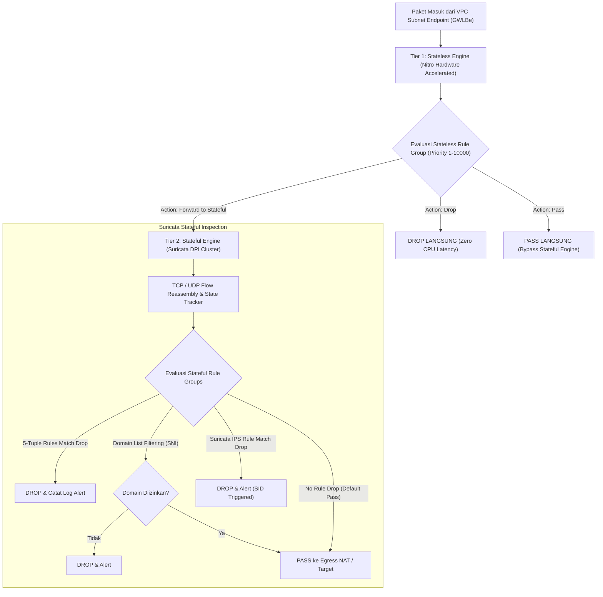
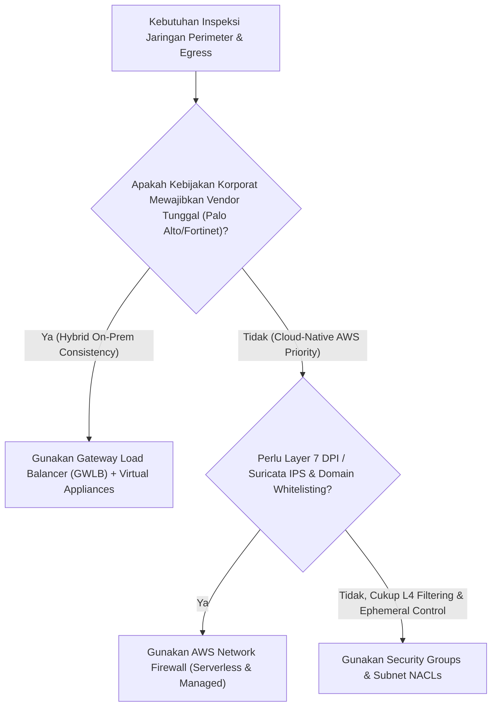

# Modul 28: AWS Network Firewall & Suricata Deep IPS

<BadgeLabel type="sme" text="Level: Principal / SME" /> <BadgeLabel type="rfc" text="Suricata Engine v7 / RFC 6066 (TLS SNI) / Deep Packet Inspection" /> <BadgeLabel type="aws" text="AWS Network Firewall & Centralized Inspection" />

Keamanan jaringan enterprise modern menuntut inspeksi lalu lintas lebih dalam daripada sekadar penyaringan 5-Tuple Layer 4. Ancaman siber tingkat lanjut—seperti *Remote Code Execution (RCE)* (misal: Log4Shell), *Command & Control (C2) beaconing*, dan eksfiltrasi data terenkripsi—memerlukan kemampuan **Deep Packet Inspection (DPI)** dan **Intrusion Prevention System (IPS)**. **AWS Network Firewall** menyediakan layanan inspeksi stateful terkelola penuh (*fully managed*) berbasis mesin open-source berstandar industri: **Suricata**.

---

## 1. Layer 1: Protocol Mechanics & RFC Theory

::: tip STANDAR BEST PRACTICE INDUSTRI (SME RECOMMENDATION)
Selalu tetapkan `flow:established,to_server` pada seluruh aturan Suricata khusus inspeksi lalu lintas keluar (*egress*) HTTP/TLS. Tanpa penandaan *flow state*, mesin Suricata akan mengevaluasi setiap paket secara individual tanpa melacak *TCP sequence number*, memicu degradasi performa inspeksi dan *false positive alert*.
:::

### A. Anatomi Sintaks Aturan Suricata (Suricata Rule Anatomy)

Sebuah signature Suricata terdiri dari dua bagian utama: **Rule Header** dan **Rule Options**:

```
alert tcp $HOME_NET any -> $EXTERNAL_NET 443 ( \
  msg:"MALWARE Cobalt Strike HTTPS Beacon Detected"; \
  flow:established,to_server; \
  content:"|16 03 01|", depth 3; \
  tls_sni; content:"c2-hidden-domain.net"; nocase; \
  classtype:trojan-activity; \
  sid:2026001; rev:1; \
)
```

```
┌────────┬──────┬───────────┬─────┬────┬───────────────┬──────┐
│ Action │ Proto│ Source IP │SPort│ Dir│ Dest IP       │DPort │ ──> RULE HEADER
├────────┼──────┼───────────┼─────┼────┼───────────────┼──────┤
│ alert  │ tcp  │ $HOME_NET │ any │ -> │ $EXTERNAL_NET │ 443  │
└────────┴──────┴───────────┴─────┴────┴───────────────┴──────┘
  │
  └─> RULE OPTIONS:
      ├── msg: "Pesan deskriptif di CloudWatch Logs"
      ├── flow: established,to_server (Mengecek status TCP handshake 3-way)
      ├── content: Pola biner / ASCII byte yang dicari dalam payload
      ├── tls_sni: Modifier inspeksi khusus Server Name Indication pada TLS ClientHello
      ├── classtype: Klasifikasi taksonomi serangan
      └── sid / rev: Signature ID unik dan nomor revisi aturan
```

### B. TLS Server Name Indication (SNI) Filtering (RFC 6066)

Pada koneksi HTTPS terenkripsi, data aplikasi dilindungi oleh TLS. Namun, nama domain target (*hostname*) dikirim dalam teks biasa (*unencrypted plaintext*) pada ekstensi **Server Name Indication (SNI)** di dalam paket **TLS ClientHello**:

```
Client ──[ TCP SYN / SYN-ACK / ACK ]──> Server
Client ──[ TLS 1.3 ClientHello ]──────> Server
           └── Extension: server_name (SNI: "api.payment-gateway.com")
               ▲
               │ (AWS Network Firewall mengekstrak SNI ini untuk Domain Filtering)
```

---

## 2. Layer 2: AWS Distributed Underlay & Hyperplane Internals

::: tip STANDAR BEST PRACTICE INDUSTRI (SME RECOMMENDATION)
Gunakan **Custom Action Order (Strict Order)** pada AWS Network Firewall Policy alih-alih Default Action Order. Custom Action Order mengevaluasi aturan dari atas ke bawah secara deterministik (mirip firewall tradisional), mencegah situasi di mana aturan `Pass` secara tidak sengaja mengabaikan (*override*) aturan `Drop` spesifik.
:::

### A. Two-Tier Processing Engine Architecture

AWS Network Firewall memproses setiap paket data melalui arsitektur pipa dua lapis terdistribusi (*two-tier processing pipeline*):



1. **Tier 1: Stateless Engine (Nitro-Accelerated)**:
   - Mengevaluasi paket secara individual tanpa melacak riwayat *flow*.
   - Mampu menangani serangan *volumetric flood* (seperti UDP Flood jutaan PPS) dengan latensi sub-mikrosekon.
2. **Tier 2: Stateful Engine (Distributed Suricata Engine)**:
   - Melakukan rekonstruksi aliran TCP (*TCP stream reassembly*), ekstraksi protokol Layer 7, dan pencocokan pola regex/pcre payload.

---

## 3. Layer 3: AWS Resource Deep-Dive & Hard Limits

::: tip STANDAR BEST PRACTICE INDUSTRI (SME RECOMMENDATION)
Untuk enterprise multi-VPC, adopsi pola **Centralized Inspection Architecture** di mana satu VPC Keamanan terpusat menampung *AWS Network Firewall Endpoints*, dihubungkan melalui *AWS Transit Gateway* dengan fitur **Appliance Mode** aktif. Pola ini memangkas biaya endpoint firewall hingga 75% dibandingkan menyebarkan firewall di setiap VPC aplikasi (*Distributed Model*).
:::

### A. Komponen Resource AWS Network Firewall

1. **Firewall (`aws_networkfirewall_firewall`)**: Titik integrasi yang menyediakan *VPC Endpoint (ENI)* di setiap Availability Zone yang dipilih.
2. **Firewall Policy (`aws_networkfirewall_firewall_policy`)**: Kumpulan *Stateless Rule Groups* dan *Stateful Rule Groups* yang mendefinisikan seluruh kebijakan inspeksi.
3. **Rule Groups**:
   - **Stateless Rule Group**: Berbasis 5-Tuple dengan prioritas angka integer (1–10,000).
   - **Stateful Rule Group (5-Tuple)**: Berbasis protokol L3/L4 dengan aksi Pass, Drop, Alert.
   - **Stateful Rule Group (Domain List)**: Menyaring HTTP Host header dan TLS SNI berdasarkan FQDN atau wildcard (`.amazonaws.com`).
   - **Stateful Rule Group (Suricata IPS Rules)**: Menggunakan sintaks aturan Suricata lengkap untuk DPI.

### B. Quota & Limits Architecture Matrix

| Parameter / Resource | Batasan Bawaan (Default Quota) | Skalabilitas |
|---|---|---|
| **Throughput per Firewall Endpoint** | **100 Gbps per AZ Endpoint** | Skala otomatis tanpa intervensi pengguna |
| **Stateless Capacity Units per Policy** | 10,000 Capacity Units | Hard Limit |
| **Stateful Capacity Units per Policy** | 30,000 Capacity Units | Dapat ditingkatkan via AWS Support |
| **Max Endpoints per Firewall** | 1 Endpoint per Availability Zone | Sesuai jumlah AZ di Region |
| **Logging Destinations** | Amazon S3, CloudWatch Logs, Kinesis Firehose | Dukungan ekspor format JSON simultan |

---

## 4. Layer 4: Hop-by-Hop Packet Walkthrough & Flow Lifecycle

### A. Centralized Outbound Egress Inspection Packet Walk

```
[1. Spoke Application VPC (10.10.1.20)]
   * Mengirim request HTTPS ke "https://api.github.com".
   * VPC Route Table: 0.0.0.0/0 -> tgw-attach-spoke.
       │
       ▼ (Transit Gateway Backbone)
[2. Central Security Inspection VPC (Transit Subnet)]
   * TGW Attachment memiliki Appliance Mode = Enabled.
   * Transit Subnet Route Table: 0.0.0.0/0 -> vpce-firewall-az1 (Firewall Endpoint).
       │
       ▼
[3. AWS Network Firewall Endpoint Subnet]
   * Stateless Engine: Mengizinkan paket masuk -> Forward to Stateful Engine.
   * Stateful Suricata Engine:
     - Melacak TCP Handshake 3-way.
     - Mengekstrak TLS ClientHello SNI: "api.github.com".
     - Mencocokkan dengan Allowed Domain List: MATCH ".github.com".
     - Keputusan: PASS.
       │
       ▼
[4. Firewall Subnet Route Table]
   * 0.0.0.0/0 -> nat-gateway-az1.
       │
       ▼
[5. Public NAT Subnet & Internet Gateway]
   * NAT Gateway melakukan SNAT -> IGW -> Public Internet.
```

---

## 5. Layer 5: Production Terraform IaC & CLI Implementation Blueprints

::: tip STANDAR BEST PRACTICE INDUSTRI (SME RECOMMENDATION)
Selalu pisahkan logging **Flow Logs** (merekam seluruh metadata koneksi TCP/UDP) dan **Alert Logs** (merekam insiden ketika aturan Suricata terpicu). Simpan Alert Logs di Amazon OpenSearch atau SIEM (Splunk/Datadog) untuk analisis ancaman SOC secara *real-time*.
:::

### Blueprint: Production AWS Network Firewall with Suricata IPS & Domain Whitelisting

```hcl
# 1. Stateful Domain Whitelist Rule Group (Allow Egress to Specific SaaS only)
resource "aws_networkfirewall_rule_group" "egress_domain_whitelist" {
  capacity = 1000
  name     = "enterprise-egress-domain-whitelist"
  type     = "STATEFUL"

  rule_group {
    rules_source {
      rules_source_list {
        generated_rules_type = "ALLOWLIST"
        target_types         = ["TLS_SNI", "HTTP_HOST"]
        targets = [
          ".amazonaws.com",
          ".github.com",
          "api.stripe.com",
          ".datadoghq.com"
        ]
      }
    }
    rule_variables {
      ip_sets {
        key = "HOME_NET"
        ip_set {
          definition = ["10.0.0.0/8", "100.64.0.0/10"]
        }
      }
    }
  }

  tags = {
    Environment = "Production"
    ManagedBy   = "SecOps"
  }
}

# 2. Stateful Suricata IPS Rule Group (Block RCE & Exploits)
resource "aws_networkfirewall_rule_group" "suricata_ips_rules" {
  capacity = 2000
  name     = "enterprise-suricata-ips-rules"
  type     = "STATEFUL"

  rule_group {
    rules_source {
      rules_string = <<EOF
# Block Log4Shell JNDI Exploit (CVE-2021-44228)
drop tcp $EXTERNAL_NET any -> $HOME_NET any (msg:"EXPLOIT-KIT Apache Log4j JNDI Exploit Attempt"; flow:to_server,established; content:"\x24\x7b\x6a\x6e\x64\x69\x3a"; nocase; classtype:attempted-admin; sid:2026101; rev:1;)

# Block Cobalt Strike C2 Beacon Traffic
drop tcp $HOME_NET any -> $EXTERNAL_NET any (msg:"MALWARE Cobalt Strike Default Beacon Pattern"; flow:established,to_server; content:"POST"; http_method; content:"/submit.php?id="; http_uri; sid:2026102; rev:1;)
EOF
    }
  }

  tags = {
    Compliance = "PCI-DSS"
  }
}

# 3. Network Firewall Policy (Strict Custom Action Order)
resource "aws_networkfirewall_firewall_policy" "sec_policy" {
  name = "enterprise-firewall-policy"

  firewall_policy {
    stateless_default_actions          = ["aws:forward_to_stateful"]
    stateless_fragment_default_actions = ["aws:drop"]

    stateful_engine_options {
      rule_order = "STRICT_ORDER" # Deterministic Top-Down Processing
    }

    stateful_default_actions = ["aws:drop_strict", "aws:alert_strict"]

    stateful_rule_group_reference {
      priority     = 10
      resource_arn = aws_networkfirewall_rule_group.egress_domain_whitelist.arn
    }

    stateful_rule_group_reference {
      priority     = 20
      resource_arn = aws_networkfirewall_rule_group.suricata_ips_rules.arn
    }
  }

  tags = {
    Environment = "Production"
  }
}

# 4. AWS Network Firewall Instance
resource "aws_networkfirewall_firewall" "central_fw" {
  name                = "central-inspection-firewall"
  firewall_policy_arn = aws_networkfirewall_firewall_policy.sec_policy.arn
  vpc_id              = aws_vpc.security_inspection_vpc.id

  subnet_mapping {
    subnet_id = aws_subnet.firewall_az1.id
  }

  subnet_mapping {
    subnet_id = aws_subnet.firewall_az2.id
  }

  delete_protection = true

  tags = {
    Name = "central-ngfw-hub"
  }
}

# 5. Logging Configuration (Alerts to CloudWatch, Flows to S3)
resource "aws_networkfirewall_logging_configuration" "fw_logs" {
  firewall_arn = aws_networkfirewall_firewall.central_fw.arn

  logging_configuration {
    log_destination_config {
      log_destination = {
        logGroup = "/aws/network-firewall/alerts"
      }
      log_destination_type = "CloudWatchLogs"
      log_type             = "ALERT"
    }

    log_destination_config {
      log_destination = {
        bucketName = "enterprise-network-firewall-flow-logs"
        prefix     = "flows"
      }
      log_destination_type = "S3"
      log_type             = "FLOW"
    }
  }
}
```

---

## 6. Layer 6: Failure Modes, Edge Cases, Anti-Patterns & SEV-1 Troubleshooting Matrix

::: tip STANDAR BEST PRACTICE INDUSTRI (SME RECOMMENDATION)
Sebelum men-deploy signature Suricata baru ke produksi, selalu uji rule tersebut dengan action `alert` terlebih dahulu selama 48–72 jam. Pantau metrik `Alert` di CloudWatch untuk memastikan tidak ada *false positive* yang dapat memutus alur data transaksi penting.
:::

| Gejala / Failure Mode | Root Cause Teknis | Perintah Diagnosa / Log Query | Solusi & Mitigasi Definitif |
|---|---|---|---|
| **Koneksi HTTPS Egress Terputus Massal** | Rule Suricata stateful tidak menyertakan `$HOME_NET` yang benar pada variabel rule, menyebabkan traffic sah teranggap anomali. | CloudWatch Logs query: `fields @timestamp, alert.signature, alert.signature_id, src_ip, dest_ip` | Definisikan variabel `$HOME_NET` secara eksplisit mencakup seluruh CIDR VPC (`10.0.0.0/8`, `100.64.0.0/10`). |
| **Drop Asimetris pada Centralized Firewall Hub** | TGW Attachment untuk Security VPC lupa diaktifkan opsi `Appliance Mode`, sehingga return flow masuk ke AZ firewall yang berbeda. | Cek status attachment: `aws ec2 describe-transit-gateway-vpc-attachments` | Aktifkan **Appliance Mode** pada Security VPC Attachment: `aws ec2 modify-transit-gateway-vpc-attachment --options ApplianceModeSupport=enable`. |
| **Bypass Domain Whitelist via Direct IP Request** | Aplikasi klien memanggil IP publik secara langsung tanpa menyertakan TLS SNI atau HTTP Host Header. | Analisa log ALERT pada CloudWatch: `tls.sni IS NULL`. | Buat aturan Drop eksplisit untuk seluruh traffic HTTP/HTTPS yang tidak memiliki SNI / Host Header yang valid. |
| **Deployment Firewall Policy Gagal / Error** | Sintaks Suricata memiliki kesalahan penulisan karakter (e.g. kurung tutup hilang atau SID duplikat). | `aws network-firewall describe-rule-group --rule-group-arn <ARN>` (Cek `StatusMessage`). | Validasi sintaks Suricata secara lokal dengan engine `suricata -T -c suricata.yaml` sebelum diterapkan ke IaC. |

---

## 7. Layer 7: Principal Architect Tradeoff Framework

::: tip STANDAR BEST PRACTICE INDUSTRI (SME RECOMMENDATION)
Pilihlah **AWS Network Firewall** untuk perlindungan terstandarisasi cloud-native, kemudahan integrasi dengan AWS Organizations, dan penghapusan *management overhead* pengelolaan cluster OS firewall. Pilihlah **Third-Party Virtual NGFW (Palo Alto / Fortinet via GWLB)** hanya jika arsitektur enterprise Anda mewajibkan keseragaman kebijakan sekuriti (*single-pane-of-glass*) antara On-Premises dan AWS.
:::

### Decision Matrix: Firewall Architecture Options



| Parameter Arsitektur | AWS Network Firewall | Third-Party NGFW via GWLB (Palo Alto / Fortinet) | Native Security Groups & NACLs |
|---|---|---|---|
| **Underlay Engine** | Fully Managed Hyperplane + Suricata | Self-Managed EC2 VM Cluster + GWLB GENEVE | Nitro Hardware ASIC TCAM |
| **Inspection Depth** | **Layer 3 s/d Layer 7 (DPI + SNI)** | **Layer 3 s/d Layer 7 (Advanced SSL Decryption, Sandboxing)** | Layer 4 (5-Tuple Stateful/Stateless) |
| **Throughput Scaling** | **Otomatis hingga 100 Gbps per AZ** | Manual via EC2 Auto Scaling Groups + GWLB | **Wire-Speed (Puluhan Gbps per VM)** |
| **Operational Overhead** | **Sangat Rendah (Serverless Managed)** | Tinggi (Patching VM, License Server, HA Tuning) | Nol (Fitur Dasar VPC) |
| **Biaya Komponen** | $0.395/jam/AZ + $0.065/GB data | Lisensi VM ($$$$) + EC2 Compute + GWLB fee | **Gratis (Zero Additional Cost)** |
