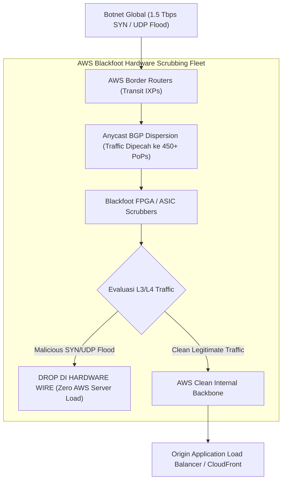
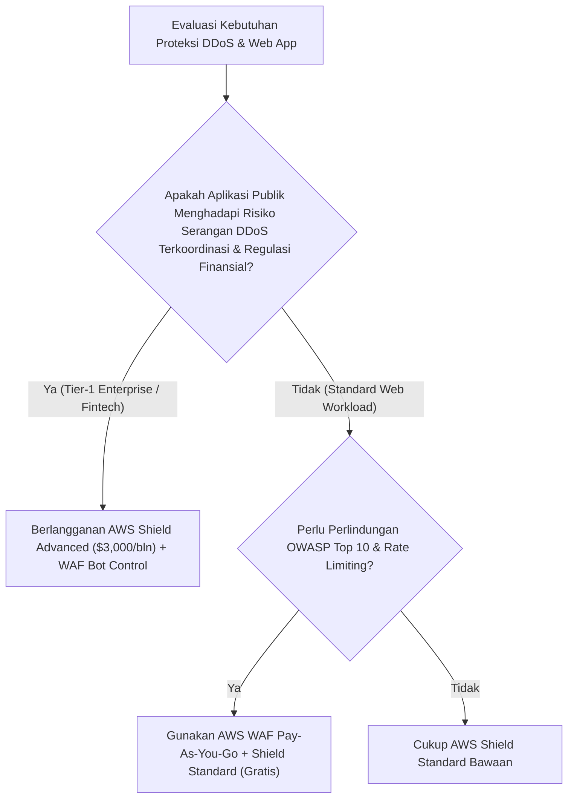

# Modul 29: AWS WAF & AWS Shield Advanced DDoS Defense

<BadgeLabel type="sme" text="Level: Principal / SME" /> <BadgeLabel type="rfc" text="RFC 4987 (SYN Flood) / RFC 7230 (Slowloris) / OWASP Top 10" /> <BadgeLabel type="aws" text="AWS WAF v2 & Shield Advanced" />

Di era komputasi modern, serangan **Distributed Denial of Service** (<NetworkTerm term="DDoS" />) dan eksploitasi web aplikasi telah berevolusi menjadi ancaman berskala multi-terabit dan serangan layer aplikasi (*Layer 7*) yang sangat canggih. Untuk melindungi ketersediaan (*availability*) dan integritas sistem enterprise, AWS menyediakan arsitektur pertahanan berlapis: **AWS Shield Standard & Advanced** pada layer transport underlay (L3/L4) dan **Web Application Firewall** (<NetworkTerm term="WAF" />) pada layer aplikasi (L7).

---

## 1. Layer 1: Protocol Mechanics & RFC Theory

::: tip STANDAR BEST PRACTICE INDUSTRI (SME RECOMMENDATION)
Untuk endpoint API publik yang menerima request *login* atau *transaksi finansial*, terapkan kombinasi **AWS WAF Rate-Based Rule** dengan *Composite Keys* (kombinasi `IP + URI` atau `IP + Session Cookie`) dan jendela evaluasi 60 atau 120 detik. Ini mencegah serangan *Brute Force* dan *Credential Stuffing* tanpa memblokir seluruh traffic dari IP NAT kantor korporat.
:::

### A. Taksonomi Serangan DDoS: L3/L4 Volumetric vs L7 Application Floods

```
+-------------------------------------------------------------------------------+
|                             DDoS ATTACK TAXONOMY                              |
+-------------------------------------------------------------------------------+
| 1. Layer 3 / 4 Infrastructure Attacks (Volumetric & State Exhaustion):       |
|    - TCP SYN Flood (RFC 4987): Membanjiri server dengan paket SYN tanpa ACK,  |
|      menghabiskan backlog queue kernel OS (SYN Queue Table Exhaustion).       |
|    - UDP Amplification (DNS, NTP, SSDP, Memcached): Memanfaatkan server open  |
|      resolver untuk memantulkan respons raksasa dengan Spoofed Source IP.    |
|    * Solusi Pertahanan: Mitigasi Hardware Anycast Underlay (AWS Shield).      |
+-------------------------------------------------------------------------------+
| 2. Layer 7 Application Attacks (Resource Exhaustion & Semantic Exploits):    |
|    - HTTP Flood / GET-POST Storm: Jutaan request HTTP sah yang memicu query   |
|      database berat (CPU / IOPS starvation).                                  |
|    - Slowloris (RFC 7230): Mengirim HTTP header secara bertahap sangat lambat|
|      untuk menahan koneksi web server tetap terbuka hingga batas MaxClients.  |
|    - OWASP Top 10: SQL Injection, Cross-Site Scripting (XSS), Log4j RCE.     |
|    * Solusi Pertahanan: AWS WAF WebACL + Rate Limiting + Bot Control.         |
+-------------------------------------------------------------------------------+
```

### B. Mekanika TCP SYN Cookies (RFC 4987)

Ketika serangan SYN Flood terdeteksi, mekanisme *SYN Cookies* mengizinkan sistem merespons tanpa mengalokasikan memori *state table*:

$$\text{Initial Sequence Number (ISN)} = f(\text{SrcIP}, \text{SrcPort}, \text{DstIP}, \text{DstPort}, \text{Timestamp}, \text{SecretKey})$$

Server merekonstruksi informasi sesi ketika paket `ACK` valid dari klien diterima, mengeliminasi risiko *SYN queue saturation*.

---

## 2. Layer 2: AWS Distributed Underlay & Hyperplane Internals

::: tip STANDAR BEST PRACTICE INDUSTRI (SME RECOMMENDATION)
Aktifkan fitur **Automatic Application Layer DDoS Mitigation** pada AWS Shield Advanced. Fitur ini menggunakan *machine learning* untuk mendeteksi anomali traffic layer 7 secara otomatis, membuat aturan mitigasi AWS WAF kustom secara real-time, mengujinya dalam mode *Count*, lalu menerapkannya dalam mode *Block* tanpa memerlukan intervensi manual tim SOC di tengah malam.
:::

### A. AWS Shield Hardware Underlay ("Blackfoot" Infrastructure)

Pertahanan Layer 3 dan Layer 4 AWS tidak bergantung pada CPU server biasa, melainkan didukung oleh armada perangkat keras filtrasi DDoS khusus bernama **Blackfoot**:



### B. Arsitektur Distribusi Inspeksi AWS WAF

AWS WAF beroperasi secara *in-line* di level Edge (Amazon CloudFront) atau di level regional VPC (Application Load Balancer, Amazon API Gateway, AWS AppSync):
- **WAF on CloudFront**: Paket diinspeksi di 450+ Edge Locations terdekat dengan penyerang, mencegah lalu lintas berbahaya memasuki jaringan internal AWS.
- **WAF on ALB**: Paket diinspeksi langsung pada armada instance proxy ALB sebelum diteruskan ke *Target Group*.

---

## 3. Layer 3: AWS Resource Deep-Dive & Hard Limits

::: tip STANDAR BEST PRACTICE INDUSTRI (SME RECOMMENDATION)
Kelola **Web ACL Capacity Units (WCU)** dengan teknik *budgeting* modular. Batas default WCU adalah 1,500 unit. Alokasikan 700 WCU untuk *AWS Managed Rules (Core Rule Set & Known Bad Inputs)*, 300 WCU untuk *Rate-Based Rules*, dan sisakan 500 WCU sebagai kapasitas cadangan darurat saat tim SecOps perlu menyuntikkan aturan mitigasi zero-day instan.
:::

### A. Komponen Resource AWS WAF v2

1. **Web ACL (`aws_wafv2_web_acl`)**: Kontainer utama kebijakan yang di-attach ke CloudFront atau ALB.
2. **Rule Groups**: Kumpulan aturan yang dapat digunakan kembali (*reusable*):
   - **AWS Managed Rule Groups**: Dikelola penuh oleh tim Threat Intelligence AWS (e.g., `AWSManagedRulesCommonRuleSet`, `AWSManagedRulesSQLiRuleSet`).
   - **Custom Rule Groups**: Disesuaikan dengan kebutuhan arsitektur internal.
3. **Rule Actions**:
   - `Allow`: Meloloskan paket ke backend.
   - `Block`: Menghentikan paket dengan opsi *Custom Response Code* (e.g. 403 Forbidden / 429 Too Many Requests).
   - `Count`: Mencatat statistik evaluasi tanpa memblokir (ideal untuk *dry-run* rule baru).
   - `CAPTCHA` & `Challenge`: Memberikan tantangan visual atau JavaScript token interaktif untuk memverifikasi human vs bot.

### B. Matriks Perbandingan: Shield Standard vs Shield Advanced

| Dimensi Fitur | AWS Shield Standard | AWS Shield Advanced |
|---|---|---|
| **Cakupan Proteksi** | **Layer 3 & Layer 4 Otomatis (Semua Akun)** | **Layer 3, Layer 4, dan Layer 7 Lengkap** |
| **Integrasi Target** | CloudFront, Route 53, ALB, EIP | CloudFront, Route 53, ALB, NLB, Elastic IPs |
| **Shield Response Team (SRT)** | Tidak Ada | **Dukungan 24/7 SRT (Tim Ahli DDoS AWS)** |
| **Cost Protection Guarantee** | Tidak Ada | **Kredit Finansial untuk Lonjakan Biaya Auto-Scaling saat DDoS** |
| **WAF & Firewall Manager Fee** | Bayar per WCU / Request | **AWS WAF & Firewall Manager Gratis (Termasuk dalam Paket)** |
| **Biaya Langganan Bulanan** | **Gratis ($0)** | **$3,000 / Bulan (Komitmen 1 Tahun untuk Seluruh Organisasi)** |

---

## 4. Layer 4: Hop-by-Hop Packet Walkthrough & Flow Lifecycle

### A. Layer 7 HTTP Flood Mitigation with Rate Limiting

```
[1. Botnet Attackers (10,000 Distributed IPs)]
   Mengirim 50,000 HTTP POST /api/v1/login per detik.
       │
       ▼
[2. CloudFront Edge Location / ALB WAF Engine]
   * WAF mengevaluasi Rule 1: "AWSManagedRulesCommonRuleSet" (Cost: 700 WCU) -> Clean payload.
   * WAF mengevaluasi Rule 2: "RateLimitByClientIPAndURI" (Cost: 100 WCU):
     - Scope: URI starts with "/api/v1/login"
     - Aggregation Key: Client IP
     - Threshold: 500 requests per 5 menit
       │
       ▼
[3. WAF Evaluator Engine]
   * Bot IP 198.51.100.45 tercatat telah mengirim 850 requests dalam 60 detik.
   * Threshold TERLAMPAUI!
       │
       ▼
[4. WAF Action Execution]
   * Paket DIBLOKIR di Edge.
   * Mengembalikan respons: HTTP 429 Too Many Requests + Header "Retry-After: 300".
   * Paket TIDAK PERNAH mencapai Backend Application Server.
```

---

## 5. Layer 5: Production Terraform IaC & CLI Implementation Blueprints

::: tip STANDAR BEST PRACTICE INDUSTRI (SME RECOMMENDATION)
Kirim log AWS WAF secara streaming ke **Amazon Kinesis Data Firehose** yang diteruskan ke Amazon S3 dalam format terkompresi Gzip. Konfigurasikan *Redacted Fields* pada WAF logging untuk menyembunyikan header sensitif seperti `Authorization`, `Cookie`, dan `x-api-key` guna mematuhi standar privasi data GDPR dan regulasi perbankan.
:::

### Blueprint: Production AWS WAF v2 WebACL with Managed Rules & Rate Limiting

```hcl
# 1. Production Web ACL for Application Load Balancer / CloudFront
resource "aws_wafv2_web_acl" "enterprise_waf" {
  name        = "enterprise-production-web-acl"
  description = "Production WAF with Managed Rules, SQLi Protection, and Rate Limiting"
  scope       = "REGIONAL" # Use "CLOUDFRONT" for Global CloudFront Distributions

  default_action {
    allow {}
  }

  # Rule 1: AWS Managed Common Rule Set (CRS)
  rule {
    name     = "AWS-AWSManagedRulesCommonRuleSet"
    priority = 10

    override_action {
      none {} # Enforce Block from Managed Rule definitions
    }

    statement {
      managed_rule_group_statement {
        name        = "AWSManagedRulesCommonRuleSet"
        vendor_name = "AWS"

        # Exclude specific rule if causing false positive in API
        rule_action_override {
          name = "SizeRestrictions_BODY"
          action_to_use {
            count {}
          }
        }
      }
    }

    visibility_config {
      cloudwatch_metrics_enabled = true
      metric_name                = "AWSCommonRuleSetMetric"
      sampled_requests_enabled   = true
    }
  }

  # Rule 2: AWS Managed SQL Database Protection
  rule {
    name     = "AWS-AWSManagedRulesSQLiRuleSet"
    priority = 20

    override_action {
      none {}
    }

    statement {
      managed_rule_group_statement {
        name        = "AWSManagedRulesSQLiRuleSet"
        vendor_name = "AWS"
      }
    }

    visibility_config {
      cloudwatch_metrics_enabled = true
      metric_name                = "AWSSQLiRuleSetMetric"
      sampled_requests_enabled   = true
    }
  }

  # Rule 3: Strict Rate-Based Rule on Login / Auth Endpoints
  rule {
    name     = "RateLimitAuthEndpoints"
    priority = 30

    action {
      block {
        custom_response {
          response_code            = 429
          custom_response_body_key = "rate_limit_exceeded_json"
        }
      }
    }

    statement {
      rate_based_statement {
        limit              = 300 # Max 300 requests per 5 minutes per IP
        aggregate_key_type = "IP"

        scope_down_statement {
          byte_match_statement {
            search_string         = "/api/v1/auth/"
            field_to_match {
              uri_path {}
            }
            text_transformation {
              priority = 0
              type     = "LOWERCASE"
            }
            positional_constraint = "STARTS_WITH"
          }
        }
      }
    }

    visibility_config {
      cloudwatch_metrics_enabled = true
      metric_name                = "RateLimitAuthMetric"
      sampled_requests_enabled   = true
    }
  }

  # Custom Response Body Definition
  custom_response_body {
    key          = "rate_limit_exceeded_json"
    content      = "{\"error\": \"Too Many Requests\", \"message\": \"Rate limit exceeded. Please retry after 5 minutes.\"}"
    content_type = "APPLICATION_JSON"
  }

  visibility_config {
    cloudwatch_metrics_enabled = true
    metric_name                = "EnterpriseProductionWebACLMetric"
    sampled_requests_enabled   = true
  }

  tags = {
    Environment = "Production"
    Compliance  = "PCI-DSS"
  }
}

# 2. Association with Application Load Balancer
resource "aws_wafv2_web_acl_association" "alb_waf_assoc" {
  resource_arn = aws_lb.external_alb.arn
  web_acl_arn  = aws_wafv2_web_acl.enterprise_waf.arn
}
```

---

## 6. Layer 6: Failure Modes, Edge Cases, Anti-Patterns & SEV-1 Troubleshooting Matrix

::: tip STANDAR BEST PRACTICE INDUSTRI (SME RECOMMENDATION)
Gunakan fitur **Sampled Requests** di AWS WAF Console untuk menginvestigasi blokir mencurigakan. Fitur ini menampilkan detail lengkap paket request (header, URI, client IP, dan rule spesifik yang memicu pemblokiran) dari 5,000 request terakhir secara gratis tanpa perlu menunggu parsing data log S3.
:::

| Gejala / Failure Mode | Root Cause Teknis | Perintah Diagnosa / Log Query | Solusi & Mitigasi Definitif |
|---|---|---|---|
| **Webhook Partner Bisnis Terblokir 403** | Rule `SizeRestrictions_BODY` atau `CrossSiteScripting_BODY` pada Core Rule Set salah mendeteksi payload XML/JSON mitra sebagai serangan. | Query Athena WAF Logs: `WHERE terminatingRuleId = 'AWSManagedRulesCommonRuleSet'` | Tambahkan pengecualian (*Rule Action Override*) ke mode `Count` untuk sub-rule terkait, atau buat *Scope-Down statement*. |
| **Karyawan Kantor Korporat Terkena Limit 429** | Seluruh kantor (ribuan user) berbagi 1 Alamat IP NAT publik yang sama sehingga memicu threshold *Rate-Based Rule*. | Periksa Top Blocked IPs di CloudWatch Dashboard WAF. | Ubah aggregasi Rate-Based Rule menjadi *Composite Key* (IP + Header `Authorization` / Session Cookie). |
| **Gagal Menambahkan Rule Baru di Tengah Serangan** | Total kapasitas rule melebihi alokasi batas 1,500 WCU pada WebACL yang ada. | `aws wafv2 describe-web-acl --name <Name> --scope <Scope>` | Minta kenaikan kuota WCU ke AWS Support (hingga 5,000 WCU) atau optimasi rule yang redundan. |
| **Biaya Auto-Scaling Meledak Akibat Serangan L7** | Serangan HTTP flood lolos ke backend ALB dan memicu auto-scaling EC2 dari 5 instance menjadi 100 instance. | Analisa metrik CloudWatch `CPUUtilization` dan `RequestCount` vs `WAF BlockedRequests`. | Aktifkan **AWS Shield Advanced** dan ajukan klaim *DDoS Cost Protection* ke AWS Support untuk mengembalikan biaya lonjakan komputasi. |

---

## 7. Layer 7: Principal Architect Tradeoff Framework

::: tip STANDAR BEST PRACTICE INDUSTRI (SME RECOMMENDATION)
Bagi organisasi dengan total tagihan cloud >$50,000/bulan atau sistem berisiko tinggi (fintech/perbankan), berinvestasilah pada **AWS Shield Advanced ($3,000/bulan)**. Fitur proteksi finansial terhadap lonjakan *auto-scaling* dan akses langsung ke *Shield Response Team (SRT)* jauh melampaui biaya langganan saat terjadi serangan multi-gigabit terkoordinasi.
:::

### Cost & Security Strategy Tradeoff Matrix



| Parameter Keputusan | AWS Shield Standard + WAF Standar | AWS Shield Advanced + WAF Suite | Solusi Pihak Ketiga (Cloudflare Magic Transit) |
|---|---|---|---|
| **Investasi Biaya Tetap** | **$0 / bulan (Pay-as-you-go per rule & request)** | **$3,000 / bulan (Fixed commitment)** | Kontrak Korporat Tahunan ($$$$) |
| **Proteksi Finansial Auto-Scaling**| Tidak Ada (Biaya lonjakan ditanggung user) | **Dijamin 100% (AWS Cost Protection Refund)** | Tidak Terkait Langsung dengan AWS Billing |
| **Dukungan Insiden 24/7** | AWS Basic / Enterprise Support biasa | **Dedicated AWS Shield Response Team (SRT)** | Dedicated SOC Tim Vendor |
| **DDoS L7 Machine Learning Auto-Mitigation** | Manual Rule Creation | **Otomatis Real-Time oleh AWS underlay** | Otomatis oleh Cloudflare Edge |
| **Kapan Harus Memilih?** | Workload non-kritis, startup, biaya < $10k/bln | **Tier-1 Banking, E-Commerce Nasional, Enterprise Besar** | Arsitektur Multi-Cloud yang mencakup On-Premise |
