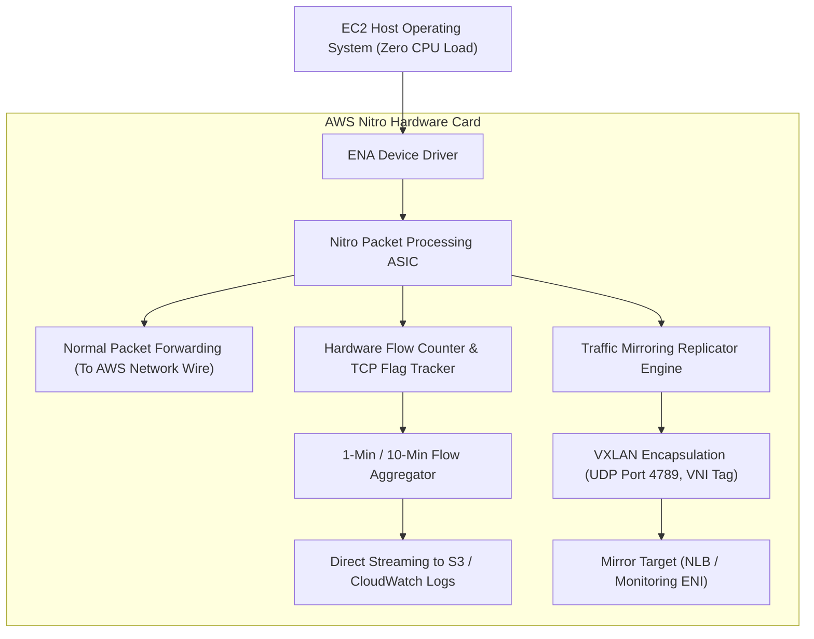
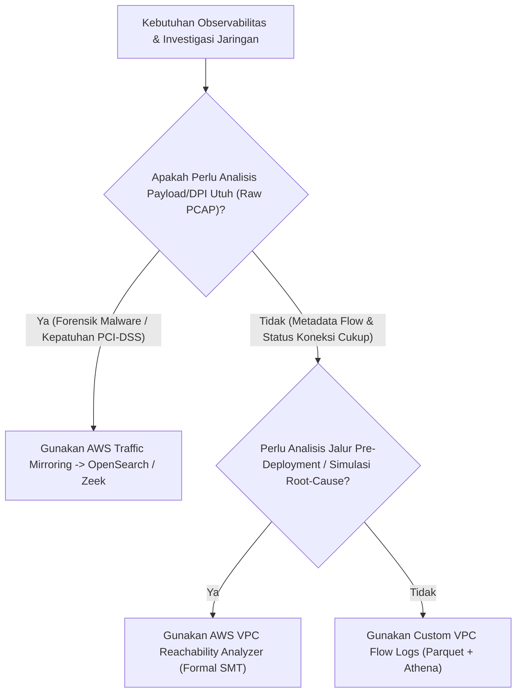

# Modul 30: Custom VPC Flow Logs, Traffic Mirroring & Reachability Analyzer

<BadgeLabel type="sme" text="Level: Principal / SME" /> <BadgeLabel type="rfc" text="RFC 7011 (IPFIX) / RFC 7348 (VXLAN Mirroring) / SMT Formal Verification" /> <BadgeLabel type="aws" text="VPC Observability & Network Forensics" />

Dalam infrastruktur cloud berskala masif, hilangnya visibilitas terhadap lalu lintas data adalah penyebab utama lambatnya penanganan insiden *SEV-1*. Seorang **Principal Cloud Network Architect** mengandalkan tiga instrumen observabilitas jaringan tingkat lanjut: **Custom VPC Flow Logs** (dengan analisis bitmask TCP Flags), **AWS Traffic Mirroring** (replikasi paket utuh berbasis VXLAN), dan **VPC Reachability Analyzer** (verifikasi matematis formal berbasis *Satisfiability Modulo Theories* tanpa menginjeksi paket uji ke jaringan produksi).

---

## 1. Layer 1: Protocol Mechanics & RFC Theory

::: tip STANDAR BEST PRACTICE INDUSTRI (SME RECOMMENDATION)
Selalu gunakan **Custom Format VPC Flow Logs** yang menyertakan field `${tcp-flags}`, `${pkt-srcaddr}`, `${pkt-dstaddr}`, `${flow-direction}`, dan `${traffic-path}`. Menganalisis nilai bitmask TCP flags memungkinkan tim SME membedakan secara instan antara koneksi yang ditolak oleh Security Group (SYN tanpa ACK), pemutusan abnormal oleh backend (TCP RST), atau kegagalan *handshake* akibat timeout.
:::

### A. Analisis Bitmask TCP Flags (RFC 793 / IPFIX RFC 7011)

Field `${tcp-flags}` pada VPC Flow Logs direkam sebagai representasi desimal dari penjumlahan biner 8-bit TCP control bits:

```
Bit Position:  7     6     5     4     3     2     1     0
Flag:         CWR   ECE   URG   ACK   PSH   RST   SYN   FIN
Bit Value:    128    64    32    16     8     4     2     1
```

$$\text{Desimal Flag Value} = \sum (\text{Active Flag Bit Values})$$

```
+-------------------------------------------------------------------------------+
|                    DEKODER BITMASK TCP FLAGS UNTUK FORENSIK                   |
+-------------------------------------------------------------------------------+
| Desimal 2  (00000010) -> SYN: Inisiasi koneksi TCP baru (SYN Sent/Received)   |
| Desimal 18 (00010010) -> SYN + ACK (2 + 16): Respons handshake server valid   |
| Desimal 16 (00010000) -> ACK: Koneksi aktif (ESTABLISHED) / Transmisi data    |
| Desimal 4  (00000100) -> RST: Koneksi di-reset paksa oleh host / firewall    |
| Desimal 20 (00010100) -> RST + ACK (4 + 16): Port tertutup / Aplikasi crash   |
| Desimal 1  (00000001) -> FIN: Penutupan koneksi normal secara sepihak         |
+-------------------------------------------------------------------------------+
```

### B. Verifikasi Formal Jaringan Berbasis SMT (Satisfiability Modulo Theories)

Berbeda dengan `ping` atau `traceroute` yang mengirim paket data aktif, **AWS VPC Reachability Analyzer** menggunakan algoritma verifikasi formal matematis:
- Membaca konfigurasi *control plane* jaringan (Route Tables, Security Groups, NACLs, IGW, NAT GW, TGW, Peering).
- Membangun model matematika *Directed Acyclic Graph (DAG)* dari topologi VPC.
- Membuktikan secara logis apakah ada jalur yang valid antara Source dan Destination tanpa pernah menginjeksi paket data nyata.

---

## 2. Layer 2: AWS Distributed Underlay & Hyperplane Internals

::: tip STANDAR BEST PRACTICE INDUSTRI (SME RECOMMENDATION)
Ekspor VPC Flow Logs langsung ke **Amazon S3 dalam format Apache Parquet dengan Hive-compatible Partitioning (`/year=YYYY/month=MM/day=DD/hour=HH/`)**. Format Parquet memangkas ukuran penyimpanan hingga **85%** dan mempercepat kecepatan query Amazon Athena hingga **10x lipat** dibandingkan format Plain Text / CSV.
:::

### A. Nitro Underlay Telemetry Capture (Zero CPU Overhead)

Pada arsitektur AWS Nitro System, proses pencatatan Flow Logs dan replikasi Traffic Mirroring dilakukan langsung pada **ASIC Nitro Card**:



### B. AWS Traffic Mirroring Header Encapsulation (RFC 7348 VXLAN)

Paket yang di-mirror akan diduplikasi di level ASIC dan dibungkus (*encapsulated*) dalam header **VXLAN (UDP Port 4789)** sebelum dikirim ke *Monitoring Appliance* (seperti Zeek, Wireshark, atau Suricata IDS):

```
+-----------------------------------------------------------------------------+
| Outer L2 MAC | Outer IP (Src: ENI Host, Dst: Mirror Target) | UDP: 4789    |
+-----------------------------------------------------------------------------+
| VXLAN Header (Flags: 0x08, VNI: 24-bit Virtual Network Identifier)         |
+-----------------------------------------------------------------------------+
| Original L2 MAC | Original IP Header | Original TCP Header | Original Payload|
+-----------------------------------------------------------------------------+
```

---

## 3. Layer 3: AWS Resource Deep-Dive & Hard Limits

::: tip STANDAR BEST PRACTICE INDUSTRI (SME RECOMMENDATION)
Batasi ukuran paket yang di-mirror menggunakan parameter `packet_length` (misal 128 bytes) jika Anda hanya memerlukan inspeksi metadata L3/L4. Membatasi ukuran paket ini menghemat *bandwidth* interface monitoring dan mencegah *packet drop* akibat saturasi buffer pada instance IDS penampung.
:::

### A. Format Kustom VPC Flow Logs Standar SME

```
${version} ${account-id} ${interface-id} ${srcaddr} ${dstaddr} ${srcport} ${dstport} ${protocol} ${packets} ${bytes} ${start} ${end} ${action} ${log-status} ${vpc-id} ${subnet-id} ${instance-id} ${tcp-flags} ${type} ${pkt-srcaddr} ${pkt-dstaddr} ${region} ${az-id} ${pkt-src-aws-service} ${pkt-dst-aws-service} ${flow-direction} ${traffic-path}
```

### B. Quota & Limits Architecture Matrix

| Parameter / Resource | Batasan Bawaan (Default Quota) | Keterangan & Karakteristik |
|---|---|---|
| **Flow Logs Aggregation Interval** | **1 Menit atau 10 Menit** | 1 menit direkomendasikan untuk investigasi insiden cepat |
| **Max Traffic Mirror Sessions per ENI** | **3 Sesi Aktif** | Hard limit di hardware Nitro Card |
| **Traffic Mirror Filter Rules per Filter** | Ingress: 10, Egress: 10 | Berbasis 5-Tuple filter |
| **Throughput Traffic Mirroring** | Berbagi alokasi bandwidth total instance | Jika bandwidth penuh, traffic mirror di-drop lebih dulu |
| **Reachability Analyzer Scopes per Region**| 100 Scopes | Analisis formal instan (<30 detik) |

---

## 4. Layer 4: Hop-by-Hop Packet Walkthrough & Flow Lifecycle

### A. Lifecycle Pencatatan VPC Flow Log

```
[1. Paket Tiba di Interface ENI: 10.0.1.25]
   Paket: TCP SYN (Src: 198.51.100.10:48120, Dst: 10.0.1.25:443).
       │
       ▼
[2. Nitro Security Group & NACL Evaluation]
   * Security Group: MATCH (ALLOW).
   * Status Keputusan: ACCEPT.
       │
       ▼
[3. Nitro Hardware Flow Counter]
   * Mencatat entri 5-Tuple di buffer lokal Nitro:
     Key: (198.51.100.10, 48120, 10.0.1.25, 443, 6, ACCEPT)
     Counters: Packets = +1, Bytes = +60, TCP Flags Bitwise OR = 2 (SYN).
       │
       ▼
[4. Jendela Waktu Agregasi Berakhir (1 Menit)]
   * Nitro mengunci record dan menghasilkan 1 baris Flow Log.
       │
       ▼
[5. Pengiriman ke S3 / CloudWatch Logs]
   * 2 123456789012 eni-01a2b3c4d5 198.51.100.10 10.0.1.25 48120 443 6 1 60 1629837100 1629837160 ACCEPT OK vpc-0123 subnet-0456 i-0789 2 IPv4 198.51.100.10 10.0.1.25 ap-southeast-1 usw2-az1 - - ingress 1
```

---

## 5. Layer 5: Production Terraform IaC & Athena SQL Forensics Blueprints

::: tip STANDAR BEST PRACTICE INDUSTRI (SME RECOMMENDATION)
Terapkan **S3 Lifecycle Rules** pada bucket penyimpanan Flow Logs: transisikan data ke *S3 Standard-IA* setelah 30 hari, ke *S3 Glacier Flexible Retrieval* setelah 90 hari, dan hapus otomatis (*Expire*) setelah 365 hari untuk mengoptimalkan biaya kepatuhan audit.
:::

### Blueprint: Production Parquet VPC Flow Logs & Amazon Athena Table Setup

```hcl
# 1. S3 Bucket for Long-Term VPC Flow Logs (Parquet Format)
resource "aws_s3_bucket" "flow_logs_bucket" {
  bucket        = "enterprise-vpc-flow-logs-parquet-prod"
  force_destroy = false

  tags = {
    Environment = "Production"
    Compliance  = "PCI-DSS"
  }
}

# 2. VPC Flow Logs with Custom Format in Apache Parquet
resource "aws_flow_log" "vpc_parquet_flow_logs" {
  log_destination      = aws_s3_bucket.flow_logs_bucket.arn
  log_destination_type = "s3"
  traffic_type         = "ALL"
  vpc_id               = aws_vpc.main.id

  # Custom 1-minute aggregation for fast forensic response
  max_aggregation_interval = 60

  destination_options {
    file_format                = "parquet"
    hive_compatible_partitions = true
    per_hour_partition         = true
  }

  log_format = "$${version} $${account-id} $${interface-id} $${srcaddr} $${dstaddr} $${srcport} $${dstport} $${protocol} $${packets} $${bytes} $${start} $${end} $${action} $${log-status} $${vpc-id} $${subnet-id} $${instance-id} $${tcp-flags} $${type} $${pkt-srcaddr} $${pkt-dstaddr} $${region} $${az-id} $${pkt-src-aws-service} $${pkt-dst-aws-service} $${flow-direction} $${traffic-path}"

  tags = {
    Name = "vpc-flow-logs-parquet"
  }
}
```

### 5 Query Athena Forensik Siap Pakai untuk Investigasi Produksi

#### 1. Menemukan Port Scanning / Serangan Reconnaissance (SYN Flood tanpa ACK)
```sql
SELECT 
    srcaddr, 
    dstaddr, 
    dstport, 
    count(*) as scan_attempts
FROM "vpc_flow_logs_db"."parquet_flow_logs"
WHERE tcp_flags = 2 AND action = 'REJECT'
GROUP BY srcaddr, dstaddr, dstport
HAVING count(*) > 100
ORDER BY scan_attempts DESC
LIMIT 20;
```

#### 2. Menemukan Traffic Asimetris / Komunikasi Gagal (SYN Dikirim tanpa SYN-ACK Balasan)
```sql
SELECT 
    srcaddr, 
    dstaddr, 
    dstport, 
    sum(packets) as total_packets
FROM "vpc_flow_logs_db"."parquet_flow_logs"
WHERE protocol = 6 AND tcp_flags = 2 AND action = 'ACCEPT'
GROUP BY srcaddr, dstaddr, dstport
ORDER BY total_packets DESC
LIMIT 15;
```

#### 3. Top Talkers: Konsumsi Bandwidth Terbesar Antar-Subnet / AZ
```sql
SELECT 
    srcaddr, 
    dstaddr, 
    az_id, 
    sum(bytes) / (1024*1024*1024.0) as gigabytes_transferred
FROM "vpc_flow_logs_db"."parquet_flow_logs"
GROUP BY srcaddr, dstaddr, az_id
ORDER BY gigabytes_transferred DESC
LIMIT 10;
```

#### 4. Investigasi Drop Security Group vs NACL
```sql
SELECT 
    srcaddr, 
    dstaddr, 
    dstport, 
    action, 
    tcp_flags
FROM "vpc_flow_logs_db"."parquet_flow_logs"
WHERE action = 'REJECT' AND dstaddr = '10.0.1.50'
LIMIT 50;
```

---

## 6. Layer 6: Failure Modes, Edge Cases, Anti-Patterns & SEV-1 Troubleshooting Matrix

::: tip STANDAR BEST PRACTICE INDUSTRI (SME RECOMMENDATION)
Gunakan **AWS VPC Reachability Analyzer** sebelum melakukan eskalasi darurat pada tim vendor firewall. Reachability Analyzer dapat mengonfirmasi apakah jalur antara dua ENI atau Internet Gateway terblokir oleh Route Table atau Security Group dalam hitungan detik secara deterministik.
:::

| Gejala / Failure Mode | Root Cause Teknis | Perintah Diagnosa / Log Query | Solusi & Mitigasi Definitif |
|---|---|---|---|
| **Delay Log saat Insiden Kritis** | Flow Logs dikonfigurasi dengan jendela agregasi 10 menit (default), menyebabkan telemetri tertunda 10–15 menit. | `aws ec2 describe-flow-logs --filter Name=resource-id,Values=<VPC_ID>` | Ubah parameter `max_aggregation_interval` menjadi **60 detik (1 menit)** pada konfigurasi Flow Log. |
| **Traffic Mirroring Menjatuhkan Paket (Drops)** | Bandwidth instance target monitoring penuh atau CPU instance IDS mencapai 100%, memicu silent drop di sisi target. | Metrik CloudWatch ENA: `mirror_target_drops` pada instance monitoring. | Terapkan NLB di depan target monitoring atau tingkatkan ukuran instance EC2 appliance IDS. |
| **Reachability Analyzer Mengembalikan NOT_REACHABLE** | Terdapat *missing route* pada subnet route table atau aturan Security Group Inbound tidak mengizinkan port spesifik. | Jalankan via CLI: `aws ec2 start-network-insights-analysis --network-insights-path-id <Path_ID>` | Baca field `Explanations` pada output JSON Reachability Analyzer untuk melihat komponen yang memblokir. |
| **Athena Query Lambat & Mahal** | Query memindai seluruh data bucket S3 tanpa menggunakan partisi tanggal (`WHERE year = '2026' AND month = '08'`). | Analisa `Data Scanned` pada execution statistics Amazon Athena. | Gunakan selalu partisi Hive pada klausa `WHERE` (`year`, `month`, `day`, `hour`). |

---

## 7. Layer 7: Principal Architect Tradeoff Framework

::: tip STANDAR BEST PRACTICE INDUSTRI (SME RECOMMENDATION)
Gunakan **Custom VPC Flow Logs** sebagai pondasi observabilitas wajib 100% di seluruh VPC produksi. Aktifkan **Traffic Mirroring** hanya secara selektif (*on-demand* atau pada subnet pembayaran PCI-DSS sensitif) untuk menghindari pembengkakan biaya pemrosesan paket dan beban infrastruktur IDS.
:::

### Observability Strategy Matrix



| Parameter Perbandingan | Custom VPC Flow Logs (Parquet) | AWS Traffic Mirroring (VXLAN) | VPC Reachability Analyzer |
|---|---|---|---|
| **Data yang Ditangkap** | Metadata 5-Tuple, Bytes, TCP Flags | **Seluruh Paket Mentah (Header + Payload)** | Konfigurasi Model Control Plane |
| **Overhead Performa** | **0% (Offloaded ke Hardware Nitro)** | Mengonsumsi sebagian egress bandwidth ENI | **0% (Simulasi Matematika Statis)** |
| **Waktu Ketersediaan Data** | 1 – 5 menit (Batch Aggregated) | **Real-Time Streaming (Sub-milidetik)** | **Instan (< 30 detik)** |
| **Inspeksi Payload L7** | Tidak Ada | **Ya (Full Payload PCAP)** | Tidak Ada |
| **Model Biaya** | Sangat Rendah ($0.05 / GB S3 Storage + Athena) | Sedang ($0.015 / jam per sesi mirror + Target ENI) | $0.10 per analisis jalur |
