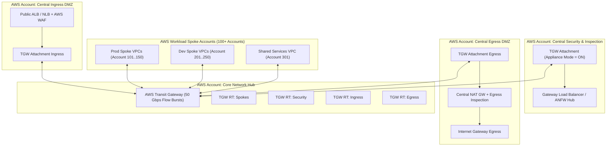
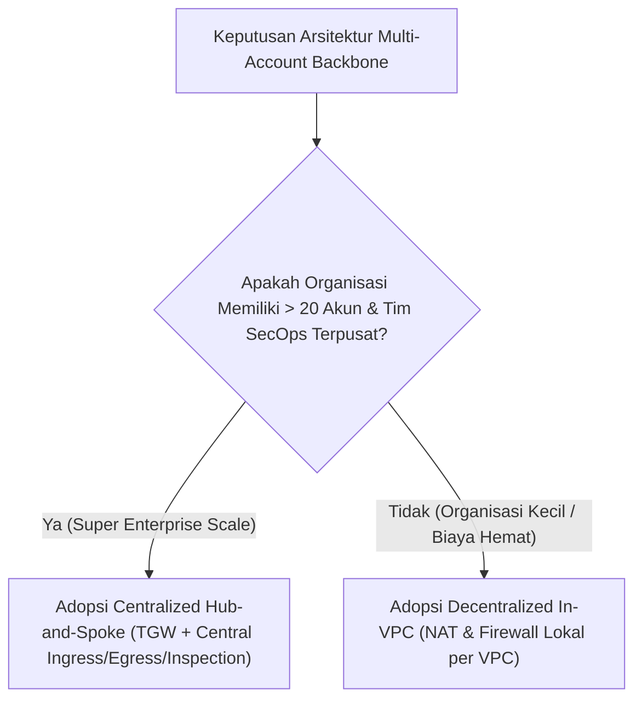

# Modul 31: Super Enterprise Multi-Account Hub-and-Spoke Architecture

<BadgeLabel type="sme" text="Level: Principal / SME" /> <BadgeLabel type="rfc" text="Hierarchical Core-Distribution Design / Zero-Trust Segmentation" /> <BadgeLabel type="aws" text="Multi-Account Network Backbone" />

Bagi korporasi multinasional, institusi perbankan, dan konglomerat digital, arsitektur jaringan cloud tidak mungkin dibangun di atas satu akun AWS tunggal. Diperlukan arsitektur **Super Enterprise Multi-Account Backbone** yang memisahkan tanggung jawab operasional (*separation of duties*), mengisolasi *blast radius*, serta mengonsolidasikan jalur keluar-masuk lalu lintas (*Central Ingress, Egress, & Inspection Hub*) dengan orkestrasi **AWS Transit Gateway** dan **AWS Organizations**.

---

## 1. Layer 1: Protocol Mechanics & RFC Theory

::: tip STANDAR BEST PRACTICE INDUSTRI (SME RECOMMENDATION)
Terapkan model **Hierarchical Three-Tier Network Design (Core, Distribution, Access)** yang disesuaikan dengan paradigma cloud: TGW Core Route Tables sebagai *Core Layer*, Central Inspection VPC sebagai *Distribution/Policy Layer*, dan Spoke VPCs sebagai *Access Layer*. Lakukan *Route Summarization* ketat di level TGW guna menjaga ukuran tabel perutean tetap efisien dan mudah diaudit.
:::

### A. Prinsip Segmentasi Zero-Trust & Blast Radius Isolation

Dalam arsitektur *Super Enterprise*, tidak boleh ada koneksi langsung *any-to-any* antar-VPC spoke. Seluruh lalu lintas dikelompokkan ke dalam zona keamanan (*Security Domains / Segments*):

```
+-------------------------------------------------------------------------------+
|                    ENTERPRISE SECURITY DOMAIN SEGREGATION                     |
+-------------------------------------------------------------------------------+
| 1. Production Spoke Zone (Prod Apps, Sensitive Data, PCI-DSS Workloads)       |
| 2. Non-Production Spoke Zone (Dev, QA, Staging, Sandboxes)                    |
| 3. Shared Services Zone (Active Directory, CI/CD, DNS Resolvers, Monitoring)  |
| 4. Ingress DMZ Zone (Public Load Balancers, WAF, External Partner APIs)       |
| 5. Egress DMZ Zone (Centralized NAT Gateways, Egress Network Firewalls)        |
| 6. Central Inspection Zone (Next-Gen Firewalls / IPS / GWLB Clusters)          |
+-------------------------------------------------------------------------------+
```

---

## 2. Layer 2: AWS Distributed Underlay & Hyperplane Internals

::: tip STANDAR BEST PRACTICE INDUSTRI (SME RECOMMENDATION)
Kelola seluruh infrastruktur *core networking* di dalam akun khusus terpisah: **Network Hub Services Account** dan **Security Services Account**. Bagikan (*share*) Transit Gateway, Prefix Lists, dan Subnet ke akun *Spoke Workload* (Prod/Dev) menggunakan **AWS Resource Access Manager (RAM)** yang terintegrasi langsung dengan unit organisasi (OU) di **AWS Organizations**.
:::

### A. Multi-Account Backbone Topology



---

## 3. Layer 3: AWS Resource Deep-Dive & Hard Limits

::: tip STANDAR BEST PRACTICE INDUSTRI (SME RECOMMENDATION)
Selalu buat **Dedicated Transit Subnet (`/28`)** di setiap AZ untuk penempatan ENI attachment Transit Gateway. Jangan pernah mencampur attachment TGW di subnet aplikasi yang sama untuk mencegah konflik perutean *Longest Prefix Match (LPM)* dan *asymmetric return routing*.
:::

### A. Matriks Isolasi & Asosiasi TGW Route Tables

| TGW Route Table Name | Di-associate ke Attachment | Diberikan Route Propagation dari | Static Routes Tambahan |
|---|---|---|---|
| **`tgw-rt-spokes`** | Seluruh Spoke VPCs (Prod, Dev, Shared) | Shared Services VPC Attachment | `0.0.0.0/0` $\to$ `tgw-attach-inspection` (Kirim semua keluar & antar-spoke ke Firewall) |
| **`tgw-rt-inspection`** | Central Inspection VPC Attachment | Seluruh Spoke VPC Attachments | `0.0.0.0/0` $\to$ `tgw-attach-egress` (Kirim ke Egress VPC setelah inspeksi) |
| **`tgw-rt-ingress`** | Central Ingress DMZ VPC Attachment | None (Strict Isolated) | `10.0.0.0/8` $\to$ `tgw-attach-inspection` (Traffic masuk wajib diinspeksi) |
| **`tgw-rt-egress`** | Central Egress VPC Attachment | Seluruh Spoke VPC Attachments | Mengembalikan return traffic internet langsung ke spoke via TGW |

### B. Quota & Limits Architecture Matrix

| Parameter / Resource | Batasan Bawaan (Default Quota) | Opsi Skalabilitas |
|---|---|---|
| **VPC Attachments per Transit Gateway** | **5,000 VPC Attachments** | Sangat besar (mencakup skala enterprise) |
| **Routes per Transit Gateway Route Table** | **10,000 Routes** | Skalabilitas rute memadai |
| **Throughput per VPC Attachment** | **50 Gbps Burst per AZ** | Skala otomatis tanpa manajemen instan |
| **Direct Connect Gateways per TGW** | 3 DXGWs per TGW | Standard Quota |
| **Transit Gateway Peering Attachments** | 50 Peering Attachments | Menghubungkan Region Global |

---

## 4. Layer 4: Hop-by-Hop Packet Walkthrough & Flow Lifecycle

### A. East-West Inter-Spoke Inspection Flow (Spoke A to Spoke B)

```
[1. Spoke VPC A - App Node: 10.10.1.50]
   * Mengirim request ke Spoke VPC B - Database: 10.20.2.100.
   * VPC Subnet Route Table: 10.0.0.0/8 -> tgw-attach-spokeA.
       │
       ▼ (TGW Ingress: Dievaluasi oleh tgw-rt-spokes)
[2. TGW Route Table: tgw-rt-spokes]
   * Route 10.20.2.100 dicocokkan dengan Static Route: 0.0.0.0/0 -> tgw-attach-inspection.
       │
       ▼ (TGW Egress ke Inspection VPC - Appliance Mode ON)
[3. Central Inspection VPC (Transit Subnet)]
   * Transit Subnet RT: 0.0.0.0/0 -> vpce-firewall (Network Firewall / GWLBe).
   * Firewall memeriksa 5-Tuple, Suricata IPS, dan Security Zone: APPROVED.
   * Firewall Subnet RT: 10.0.0.0/8 -> tgw-attach-inspection.
       │
       ▼ (TGW Ingress ke-2: Dievaluasi oleh tgw-rt-inspection)
[4. TGW Route Table: tgw-rt-inspection]
   * Mencari rute tujuan: 10.20.0.0/16 dipropagasi oleh Spoke VPC B.
   * Target: tgw-attach-spokeB.
       │
       ▼
[5. Spoke VPC B - DB Node: 10.20.2.100]
   * Paket diterima di port 3306 dengan Source IP asli 10.10.1.50!
```

---

## 5. Layer 5: Production Terraform IaC & CLI Implementation Blueprints

::: tip STANDAR BEST PRACTICE INDUSTRI (SME RECOMMENDATION)
Nonaktifkan `default_route_table_association` dan `default_route_table_propagation` saat mendeklarasikan `aws_ec2_transit_gateway`. Ini mewajibkan tim infrastruktur mendefinisikan asosiasi perutean secara eksplisit, mengeliminasi risiko kebocoran rute (*route leak*) antar-segmen.
:::

### Blueprint: Production Multi-Account TGW Hub with Segregated Route Tables

```hcl
# 1. AWS Transit Gateway Master Hub in Network Account
resource "aws_ec2_transit_gateway" "super_hub" {
  description                     = "Super Enterprise Core Network Hub"
  auto_accept_shared_attachments  = "disable"
  default_route_table_association = "disable" # Explicit Association Only!
  default_route_table_propagation = "disable" # Explicit Propagation Only!
  dns_support                     = "enable"
  vpn_ecmp_support                = "enable"

  tags = {
    Name        = "super-enterprise-tgw-core"
    Environment = "Production"
    ManagedBy   = "CoreNetworkTeam"
  }
}

# 2. Segregated TGW Route Tables
resource "aws_ec2_transit_gateway_route_table" "rt_spokes" {
  transit_gateway_id = aws_ec2_transit_gateway.super_hub.id
  tags               = { Name = "tgw-rt-spokes" }
}

resource "aws_ec2_transit_gateway_route_table" "rt_inspection" {
  transit_gateway_id = aws_ec2_transit_gateway.super_hub.id
  tags               = { Name = "tgw-rt-inspection" }
}

resource "aws_ec2_transit_gateway_route_table" "rt_egress" {
  transit_gateway_id = aws_ec2_transit_gateway.super_hub.id
  tags               = { Name = "tgw-rt-egress" }
}

# 3. Central Inspection VPC Attachment with Mandatory Appliance Mode
resource "aws_ec2_transit_gateway_vpc_attachment" "inspection_attach" {
  transit_gateway_id     = aws_ec2_transit_gateway.super_hub.id
  vpc_id                 = aws_vpc.central_inspection.id
  subnet_ids             = [aws_subnet.inspection_transit_az1.id, aws_subnet.inspection_transit_az2.id]
  appliance_mode_support = "enable" # MANDATORY: Enforce AZ Symmetric Flow!

  tags = {
    Name = "tgw-attach-inspection-appliance"
  }
}

# 4. Spoke Route Table: Default Route (0.0.0.0/0) to Inspection Hub
resource "aws_ec2_transit_gateway_route" "spokes_default_to_sec" {
  destination_cidr_block         = "0.0.0.0/0"
  transit_gateway_attachment_id  = aws_ec2_transit_gateway_vpc_attachment.inspection_attach.id
  transit_gateway_route_table_id = aws_ec2_transit_gateway_route_table.rt_spokes.id
}

# 5. AWS RAM Resource Share to Distribute TGW to AWS Organizations
resource "aws_ram_resource_share" "tgw_share" {
  name                      = "enterprise-tgw-resource-share"
  allow_external_principals = false

  tags = {
    Environment = "Production"
  }
}

resource "aws_ram_resource_association" "tgw_ram_assoc" {
  resource_arn       = aws_ec2_transit_gateway.super_hub.arn
  resource_share_arn = aws_ram_resource_share.tgw_share.arn
}

resource "aws_ram_principal_association" "org_principal" {
  principal          = "arn:aws:organizations::123456789012:organization/o-enterprise123"
  resource_share_arn = aws_ram_resource_share.tgw_share.arn
}
```

---

## 6. Layer 6: Failure Modes, Edge Cases, Anti-Patterns & SEV-1 Troubleshooting Matrix

::: tip STANDAR BEST PRACTICE INDUSTRI (SME RECOMMENDATION)
Saat mengonfigurasi *Egress Inspection*, jangan tempatkan *NAT Gateway* di depan *Network Firewall*. Selalu tempatkan *Network Firewall* **sebelum** *NAT Gateway* pada arah *outbound* agar firewall dapat mencatat alamat IP privat asli host pengirim, bukan IP publik NAT Gateway.
:::

| Gejala / Failure Mode | Root Cause Teknis | Perintah Diagnosa / Log Query | Solusi & Mitigasi Definitif |
|---|---|---|---|
| **Dev Spoke Bisa Akses Database Prod secara Ilegal** | TGW Spoke Route Table mengaktifkan *Route Propagation* dari Prod dan Dev VPC sekaligus tanpa melalui Inspection. | `aws ec2 get-transit-gateway-route-table-propagations --transit-gateway-route-table-id <RT_ID>` | Hapus asosiasi propagasi langsung. Arahkan default route `0.0.0.0/0` ke Central Inspection Firewall. |
| **Return Traffic Internet Drop Total** | Egress VPC Route Table lupa mengonfigurasi rute balik `10.0.0.0/8` ke TGW Attachment. | Athena VPC Flow Logs: `action = 'REJECT'` pada interface NAT Gateway. | Tambahkan rute `10.0.0.0/8` $\to$ `tgw-attach-egress` pada Egress VPC Subnet Route Tables. |
| **Kapasitas NAT Gateway Egress Tersaturasi** | Ratusan Spoke VPC berbagi 1 pasang NAT Gateway di Egress Hub, memicu *Port Allocation Error*. | Metrik CloudWatch NAT Gateway: `ErrorPortAllocation` melonjak. | Tambahkan Secondary EIPs pada NAT Gateway atau kelompokkan Egress Hub per unit bisnis besar. |
| **Blackhole Route saat Spoke VPC Dihapus** | VPC spoke dihapus sebelum attachment rute statis di-update di TGW route tables. | `aws ec2 search-transit-gateway-routes --transit-gateway-route-table-id <RT_ID> --filters Name=state,Values=blackhole` | Bersihkan rute *blackhole* secara otomatis via skrip CI/CD atau EventBridge trigger. |

---

## 7. Layer 7: Principal Architect Tradeoff Framework

::: tip STANDAR BEST PRACTICE INDUSTRI (SME RECOMMENDATION)
Terapkan arsitektur **Centralized Ingress, Egress, & Inspection Hub** sebagai standar baku enterprise. Model ini memberikan penghematan biaya lisensi keamanan dan efisiensi kepatuhan audit regulasi (PCI-DSS / ISO 27001) yang jauh lebih tinggi dibandingkan model *Decentralized In-VPC*.
:::

### Comparison Matrix: Centralized Hub vs Decentralized In-VPC Architecture



| Parameter Arsitektur | Centralized Hub-and-Spoke (TGW) | Decentralized In-VPC Inspection | AWS Cloud WAN Global Backbone |
|---|---|---|---|
| **Manajemen Kebijakan Keamanan** | **Terpusat di Akun SecOps (Sangat Mudah)** | Tersebar di Ratusan Akun (Sulit Diaudit) | **Terpusat via Global Policy Document (JSON)** |
| **Efisiensi Biaya Lisensi Firewall** | **Tinggi (Hanya butuh 1 klaster NGFW)** | Sangat Boros (Bayar endpoint di tiap VPC) | **Tinggi (Integrasi Network Function Groups)** |
| **Biaya Data Transfer TGW** | Dikenakan $0.02/GB pemrosesan data TGW | **$0 (Zero TGW Data Processing Fee)** | Dikenakan $0.02/GB data processing |
| **Skalabilitas Multi-Region** | Kompleksitas $O(N^2)$ manual peering mesh | Terisolasi per VPC | **Otomatis $O(1)$ Core Network Engine** |
| **Rekomendasi Organisasi** | **Enterprise Skala Menengah–Besar (10–100 VPC)** | Startup / Skala Kecil (<5 VPC) | **Super Enterprise Global (Multi-Region 3+ Region)** |
