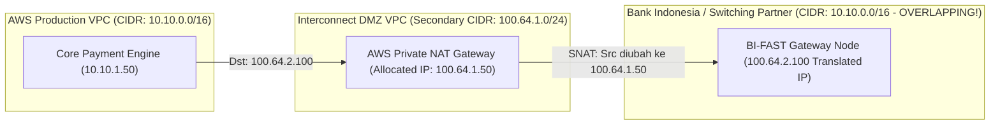
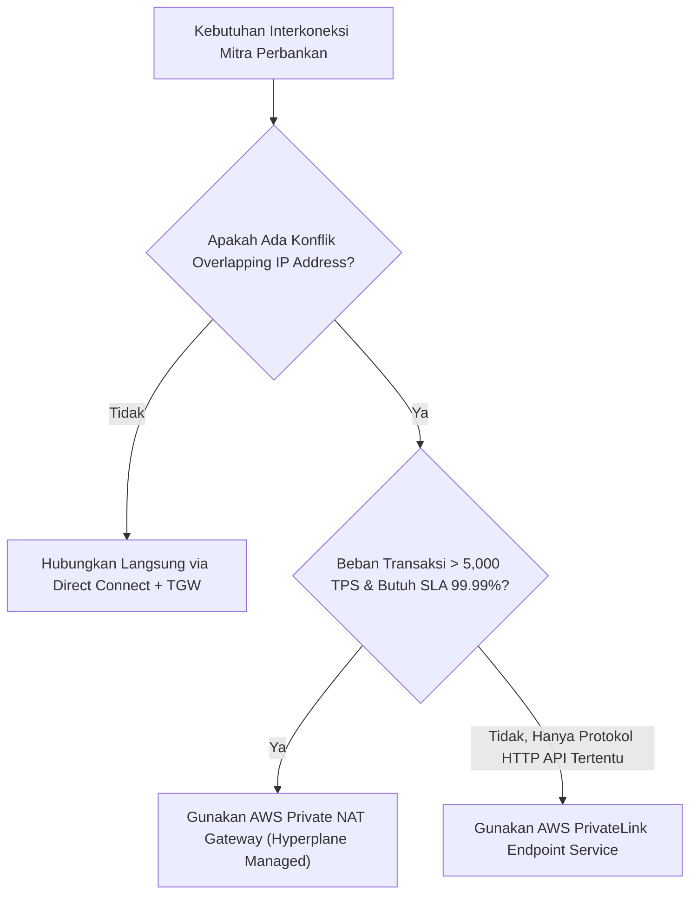

# Modul 32: Financial & Banking Partner Interconnect (BI-FAST / ISO 8583)

<BadgeLabel type="sme" text="Level: Principal / SME" /> <BadgeLabel type="rfc" text="ISO 8583 / ISO 20022 (BI-FAST) / PCI-DSS v4.0" /> <BadgeLabel type="aws" text="Private NAT Gateway & Financial Backbone" />

Menghubungkan ekosistem cloud perbankan (*Core Banking & Payment Gateway*) dengan *Central Switching Networks* nasional (seperti **Bank Indonesia Fast Payment / BI-FAST**, **Artajasa / ATM Bersama**, **Rintis / Prima**, dan **Alto**) merupakan tugas dengan tingkat kesulitan dan risiko tertinggi. Seorang **Principal Cloud Network Architect** wajib menavigasi protokol biner *legacy* (ISO 8583), standar API modern (ISO 20022), regulasi keamanan ketat **PCI-DSS & PCI-PTS**, integrasi perangkat keras kriptografi **AWS CloudHSM**, serta memecahkan masalah klasik: **konflik tumpang tindih alamat IP (*overlapping RFC 1918 CIDR*)**.

---

## 1. Layer 1: Protocol Mechanics & RFC Theory

::: tip STANDAR BEST PRACTICE INDUSTRI (SME RECOMMENDATION)
Untuk transaksi kartu debit/kredit dan ATM berbasis **ISO 8583**, konfigurasikan *TCP Keep-Alive* secara agresif (interval 15–30 detik) pada socket koneksi core banking. Protokol ISO 8583 menggunakan koneksi TCP persisten jangka panjang (*long-lived stateful sessions*); tanpa keep-alive yang sinkron, firewall stateful atau NAT Gateway akan memutus sesi idle secara sepihak, memicu status transaksi menggantung (*settlement timeout*).
:::

### A. Anatomi Protokol ISO 8583 (Card Originated Financial Messages)

Paket ISO 8583 memiliki struktur *fixed header* dan *dynamic bitmap payload*:

```
+-----------------------------------------------------------------------------+
| TPDU (5 Bytes) | MTI (4 Bytes) | Primary Bitmap (8 Bytes) | Secondary Bitmap|
+-----------------------------------------------------------------------------+
| Data Elements: Bit 2 (PAN), Bit 3 (Processing Code), Bit 4 (Amount)...      |
+-----------------------------------------------------------------------------+
```

```
1. TPDU (Transport Header): Routing identifier untuk switch perbankan.
2. MTI (Message Type Identifier):
   - 0100: Authorization Request (Permintaan Otorisasi Saldo).
   - 0110: Authorization Response (Persetujuan / Penolakan dari Issuer Bank).
   - 0200: Financial Transaction Request (Debet / Tarik Tunai).
   - 0800: Network Management Request (Echo Test / Log-on sesi B2B).
3. Primary Bitmap: 64-bit array yang menandai keberadaan field data 1 s/d 64.
```

### B. Arsitektur BI-FAST (ISO 20022 XML/JSON over mTLS)

BI-FAST (Bank Indonesia) mengadopsi standar modern **ISO 20022** yang berjalan di atas protokol HTTPS/REST API dengan enkripsi ganda:
1. **Transport Layer**: Mutual TLS (mTLS) dengan sertifikat digital X.509 resmi dari Bank Indonesia.
2. **Payload Layer**: Enkripsi payload transaksi menggunakan kunci kriptografi dari **Hardware Security Module (HSM)**.

---

## 2. Layer 2: AWS Distributed Underlay & Hyperplane Internals

::: tip STANDAR BEST PRACTICE INDUSTRI (SME RECOMMENDATION)
Gunakan **AWS Private NAT Gateway** yang ditenagai oleh mesin *AWS Hyperplane* untuk melakukan translasi alamat IP non-Internet secara *stateful*. Alokasikan ruang alamat **Carrier-Grade NAT (RFC 6598 `100.64.0.0/10`)** sebagai *Interconnect Transit CIDR* untuk menghubungkan VPC perbankan dengan jaringan Bank Indonesia dan mitra switching.
:::

### A. Masalah Overlapping CIDR pada Jaringan Perbankan

Hampir seluruh bank komersial dan lembaga switching di Indonesia menggunakan blok IP privat `10.0.0.0/8` atau `172.16.0.0/12`. Ketika kedua belah pihak menggunakan subnet yang identik (misal sama-sama menggunakan `10.10.1.0/24`), perutean standar akan gagal (*routing collision*).



- **Translasi SNAT**: Private NAT Gateway mengubah Source IP `10.10.1.50` menjadi `100.64.1.50`.
- **Translasi DNAT di Sisi Mitra**: Switch perbankan mengenali AWS sebagai `100.64.1.50` dan mengekspos layanannya sebagai `100.64.2.100`.
- **Hasil**: Tidak ada konflik perutean, kepatuhan RFC 1918 terjaga utuh.

---

## 3. Layer 3: AWS Resource Deep-Dive & Hard Limits

::: tip STANDAR BEST PRACTICE INDUSTRI (SME RECOMMENDATION)
Untuk kepatuhan **PCI-DSS v4.0 Requirement 1**, letakkan cluster **AWS CloudHSM** di dalam *Dedicated Isolated Subnet* yang tidak memiliki rute default ke Internet (`0.0.0.0/0`) dan tidak memiliki rute ke subnet non-production. Komunikasi ke CloudHSM hanya boleh diakses melalui port TCP 2223–2225 dari Security Group Payment Worker resmi.
:::

### A. Matriks Fitur AWS Private NAT Gateway

| Parameter / Kemampuan | Public NAT Gateway | Private NAT Gateway |
|---|---|---|
| **Konektivitas Keluar** | Ke Public Internet via IGW | Ke On-Prem / VPC lain via TGW & DX |
| **Alamat IP yang Diikat** | Public Elastic IPv4 Address | **Private IPv4 Address (Subnet CIDR)** |
| **Dukungan Overlapping CIDR** | Terbatas pada Internet Egress | **Dirancang Khusus untuk Resolusi Overlap** |
| **Throughput Scaling** | **100 Gbps (Hyperplane Auto-Scale)** | **100 Gbps (Hyperplane Auto-Scale)** |
| **Concurrent Connections** | 64,512 koneksi per IP | 64,512 koneksi per IP |

---

## 4. Layer 4: Hop-by-Hop Packet Walkthrough & Flow Lifecycle

### A. End-to-End BI-FAST Transaction Packet Walk

```
[1. Payment Application Pod di AWS VPC (10.10.1.50:41280)]
   * Mengirim transaksi ISO 20022 ke BI-FAST Switch Virtual IP: 100.64.2.100:443.
   * VPC Route Table: 100.64.2.0/24 -> natgw-private-01.
       │
       ▼
[2. AWS Private NAT Gateway (100.64.1.50)]
   * Hyperplane Flow Engine melakukan Stateful Source NAT:
     - Mengubah Header Paket: Src IP 10.10.1.50 -> 100.64.1.50, Port -> 58210.
     - Menyimpan pemetaan 5-Tuple di internal state table.
   * Route Table: 100.64.2.0/24 -> tgw-attach-interconnect.
       │
       ▼ (AWS Transit Gateway Backbone)
[3. Direct Connect Dedicated Link (VLAN 802.1Q - BGP Peering)]
   * Paket dikirim melalui jalur private fiber optik ke Gedung Bank Indonesia.
       │
       ▼
[4. Bank Indonesia BI-FAST Core Engine (100.64.2.100:443)]
   * Menerima paket dari Source IP 100.64.1.50 (Lolos Access Control List).
   * Memproses otorisasi perbankan dan mengirim respons HTTP 200 OK.
       │
       ▼ (Return Flow)
[5. Return Flow ke AWS Private NAT Gateway -> De-NAT -> Payment Pod 10.10.1.50]
```

---

## 5. Layer 5: Production Terraform IaC & CLI Implementation Blueprints

::: tip STANDAR BEST PRACTICE INDUSTRI (SME RECOMMENDATION)
Gunakan konfigurasi **Dual Direct Connect Circuits** dari dua *Colocation Provider* yang berbeda (misal: Equinix SG1 dan Global Switch SIN) dengan protokol **BFD (Bidirectional Forwarding Detection)** aktif untuk menjamin sub-second failover pada link perbankan.
:::

### Blueprint: Production Banking Interconnect VPC with Private NAT Gateway

```hcl
# 1. Banking Interconnect VPC with Primary & Secondary CGNAT CIDRs
resource "aws_vpc" "banking_interconnect" {
  cidr_block           = "10.50.0.0/16"
  enable_dns_hostnames = true
  enable_dns_support   = true

  tags = {
    Name        = "banking-interconnect-vpc"
    Compliance  = "PCI-DSS-v4"
    Environment = "Production"
  }
}

resource "aws_vpc_ipv4_cidr_block_association" "cgnat_secondary" {
  vpc_id     = aws_vpc.banking_interconnect.id
  cidr_block = "100.64.1.0/24" # CGNAT pool for Private NAT translation
}

# 2. Subnet for Private NAT Gateway
resource "aws_subnet" "private_nat_subnet" {
  vpc_id            = aws_vpc.banking_interconnect.id
  cidr_block        = "100.64.1.0/28"
  availability_zone = "ap-southeast-1a"

  depends_on = [aws_vpc_ipv4_cidr_block_association.cgnat_secondary]

  tags = {
    Name = "banking-private-nat-subnet-az1"
  }
}

# 3. AWS Private NAT Gateway (Zero Internet Exposure)
resource "aws_nat_gateway" "banking_private_nat" {
  connectivity_type = "private" # MANDATORY: Private Connectivity Type!
  subnet_id         = aws_subnet.private_nat_subnet.id

  tags = {
    Name = "bi-fast-private-nat-gw"
  }
}

# 4. Route Table for Core Banking Subnet (Routing to Private NAT)
resource "aws_route_table" "core_banking_rt" {
  vpc_id = aws_vpc.banking_interconnect.id

  route {
    cidr_block     = "100.64.2.0/24" # Partner BI-FAST Target Range
    nat_gateway_id = aws_nat_gateway.banking_private_nat.id
  }

  tags = {
    Name = "core-banking-rt"
  }
}
```

---

## 6. Layer 6: Failure Modes, Edge Cases, Anti-Patterns & SEV-1 Troubleshooting Matrix

::: tip STANDAR BEST PRACTICE INDUSTRI (SME RECOMMENDATION)
Terapkan alarm CloudWatch pada metrik `PacketsDropCount` di Direct Connect Virtual Interface. Pada transaksi keuangan, *packet loss* sebesar 0.1% saja dapat melipatgandakan waktu respons settlement dan memicu *deadlock* pada antrean transaksi perbankan.
:::

| Gejala / Failure Mode | Root Cause Teknis | Perintah Diagnosa / Log Query | Solusi & Mitigasi Definitif |
|---|---|---|---|
| **Transaksi Settlement Timeout / Gantung** | Sesi TCP ISO 8583 diputus oleh Private NAT Gateway karena idle melampaui batas timeout 350 detik. | Tangkap paket via `tcpdump -nnvv -i eth0 port 9000` (Cari flag TCP RST). | Konfigurasikan TCP Keep-Alive di level OS/Aplikasi setiap **60 detik** atau gunakan ISO 8583 Echo Test (0800). |
| **Koneksi Ditolak oleh Switch Perbankan (TCP Reset)** | Alamat Source IP setelah SNAT belum di-whitelist di firewall perimeter Bank Indonesia / Mitra. | Cek IP pengirim di log Private NAT Gateway. | Pastikan blok IP CGNAT `100.64.1.0/24` telah didaftarkan dalam dokumen MoU / Berita Acara Jaringan Mitra. |
| **Konflik Rute di Transit Gateway** | Spoke VPC dan Mitra Perbankan sama-sama mengiklankan CIDR `10.0.0.0/16` ke TGW Route Table yang sama. | `aws ec2 search-transit-gateway-routes --transit-gateway-route-table-id <RT_ID>` | Terapkan segregasi TGW Route Table dan gunakan Private NAT Gateway sebagai perantara isolasi CIDR. |
| **Degradasi Transaksi saat Failover Direct Connect** | Router mitra tidak mendukung BFD sehingga deteksi kegagalan link memakan waktu 90 detik (BGP Hold Time). | Periksa status BFD: `show ip bfd neighbors` pada router edge. | Wajibkan aktivasi **BFD (Interval 300ms, Multiplier 3)** di kedua sisi sirkuit Direct Connect. |

---

## 7. Layer 7: Principal Architect Tradeoff Framework

::: tip STANDAR BEST PRACTICE INDUSTRI (SME RECOMMENDATION)
Gunakan **AWS Private NAT Gateway** untuk interkoneksi perbankan skala besar (>10,000 TPS). Hindari penggunaan VM EC2 Proxy NAT (iptables/nftables) buatan sendiri karena VM NAT menjadi *single point of failure*, memiliki batas kapasitas *packets per second (PPS)* yang rendah, dan memerlukan sertifikasi audit keamanan OS tambahan untuk kepatuhan PCI-DSS.
:::

### Architectural Tradeoff Matrix: Interconnect Translation Options



| Parameter Arsitektur | AWS Private NAT Gateway | Self-Managed EC2 iptables NAT | AWS PrivateLink Service |
|---|---|---|---|
| **Kapasitas Throughput** | **100 Gbps (Auto-scaling instan)** | Dibatasi kapasitas ENI/CPU instance | **Puluhan Gbps per Endpoint** |
| **SLA Ketersediaan** | **99.99% Multi-AZ Bawaan** | Bergantung pada skrip HA failover manual | **99.99% Multi-AZ Bawaan** |
| **Kepatuhan Audit PCI-DSS** | **Tercakup dalam AWS PCI Attestation (AOC)** | Memerlukan vulnerability scan & OS patching | **Tercakup dalam AWS AOC** |
| **Dukungan Protokol** | **Semua Protokol L4 (TCP, UDP, ICMP)** | Semua Protokol L4 | Hanya TCP / TLS |
| **Biaya Pemeliharaan** | **$0.045/jam + $0.045/GB data** | Biaya Instance EC2 + EBS Storage | $0.01/jam + $0.01/GB data |
