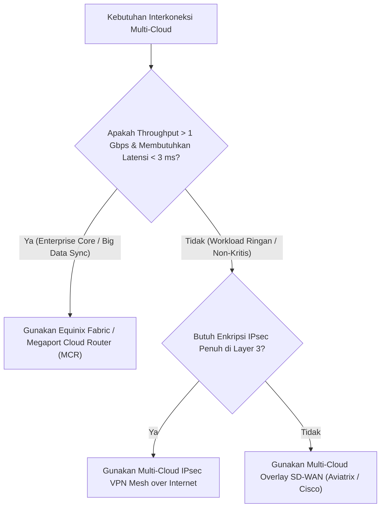

# Modul 33: Multi-Cloud Backbone Interconnect (AWS + Azure + GCP via Equinix)

<BadgeLabel type="sme" text="Level: Principal / SME" /> <BadgeLabel type="rfc" text="RFC 4271 (BGP-4) / IEEE 802.1Q (QinQ) / RFC 1997" /> <BadgeLabel type="aws" text="Multi-Cloud Interconnect Architecture" />

Di era adopsi strategi *multi-cloud* enterprise, organisasi kerap menempatkan *workload* analitik data di Google Cloud Platform (GCP BigQuery), sistem enterprise ERP di Microsoft Azure, dan aplikasi inti transaksi di Amazon Web Services (AWS). Menghubungkan ketiga penyedia cloud (*Cloud Service Providers* - CSPs) melalui internet publik dengan tunnel IPsec VPN akan membatasi performa dan meningkatkan latensi. Solusi definitif level Principal SME adalah membangun **Multi-Cloud Private Backbone** berlatensi sub-milidetik memanfaatkan **Equinix Fabric** atau **Megaport Cloud Router (MCR)** dengan perutean dinamis **BGP-4 (RFC 4271)**.

---

## 1. Layer 1: Protocol Mechanics & RFC Theory

::: tip STANDAR BEST PRACTICE INDUSTRI (SME RECOMMENDATION)
Terapkan **BGP AS-Path Prepending** ($3\times$ ASN) dan komunitas BGP **Local Preference** yang konsisten pada seluruh sesi perutean multi-cloud. Pastikan router cloud exchange (seperti Megaport MCR) mengonfigurasi `as-override` atau `allowas-in` jika Anda menggunakan nomor ASN privat yang sama (`ASN 64512`) di beberapa region AWS/Azure untuk mencegah fitur *BGP Loop Prevention* menolak rute secara diam-diam.
:::

### A. Mekanika BGP Loop Prevention (RFC 4271)

Algoritma dasar eBGP menolak setiap pembaruan rute (*UPDATE message*) yang mencantumkan nomor AS lokal di dalam atribut `AS_PATH`:

```
[AWS VPC (AS 64512)] ──> Mengiklankan 10.10.0.0/16 [AS_PATH: 64512]
                              │
                              ▼
[Equinix / Megaport MCR (AS 65000)] ──> [AS_PATH: 65000, 64512]
                              │
                              ▼
[Azure VNet (Menggunakan AS 64512 secara tidak sengaja)]
  └── Azure BGP Router memeriksa AS_PATH: Menemukan ASN 64512!
      ▲
      │ REJECTED / DROPPED: Terdeteksi Routing Loop (AS_LOOP Error)!
```

### B. Segmentasi Layer 2 Cloud Exchange (IEEE 802.1ad QinQ & 802.1Q)

Penyedia Cloud Exchange (seperti Equinix Fabric) mengisolasi sirkuit virtual multi-cloud pada satu port fisik menggunakan enkapsulasi *Double VLAN Tagging (QinQ)*:

```
+-----------------------------------------------------------------------------+
| Outer Ethernet Header | Service VLAN / S-Tag (Equinix) | Customer VLAN / C-Tag (CSP) |
+-----------------------------------------------------------------------------+
| C-Tag 101: AWS Direct Connect Transit VIF (BGP Session ke AWS DXGW)         |
| C-Tag 202: Azure ExpressRoute Private Peering (BGP Session ke Azure MSEE)   |
| C-Tag 303: Google Cloud Partner Interconnect (BGP Session ke GCP Cloud Router)
+-----------------------------------------------------------------------------+
```

---

## 2. Layer 2: AWS Distributed Underlay & Hyperplane Internals

::: tip STANDAR BEST PRACTICE INDUSTRI (SME RECOMMENDATION)
Di area metropolitan yang sama (misal Singapura Equinix SG1/SG3), koneksi fisik *Direct Connect ke ExpressRoute* melalui Equinix Fabric memiliki latensi RTT **< 1.5 milidetik**. Manfaatkan latensi sub-milidetik ini untuk arsitektur *Synchronous Database Replication* (misal: AWS Aurora ke Azure SQL Managed Instance) dengan jaminan zero data loss.
:::

### A. Multi-Cloud Underlay Backbone Topology

```mermaid
graph LR
    subgraph AWS_Cloud["Amazon Web Services (AWS)"]
        AWS_VPC["Spoke VPC (10.10.0.0/16)"] --> AWS_TGW["AWS Transit Gateway"]
        AWS_TGW --> AWS_DXGW["Direct Connect Gateway (AS 64512)"]
    end

    subgraph Equinix_Fabric["Equinix Fabric / Megaport Cloud Router (MCR)"]
        MCR["Megaport Cloud Router (AS 65000)"]
    end

    subgraph Azure_Cloud["Microsoft Azure"]
        Azure_ER["ExpressRoute Gateway (AS 65515)"] --> Azure_VNet["Production VNet (10.20.0.0/16)"]
    end

    subgraph GCP_Cloud["Google Cloud Platform (GCP)"]
        GCP_Router["GCP Cloud Router (AS 16550)"] --> GCP_VPC["Analytics VPC (10.30.0.0/16)"]
    end

    AWS_DXGW <==|"AWS Direct Connect (VLAN 101)"| MCR
    MCR <==|"Azure ExpressRoute (VLAN 202)"| Azure_ER
    MCR <==|"GCP Interconnect (VLAN 303)"| GCP_Router
```

---

## 3. Layer 3: AWS Resource Deep-Dive & Hard Limits

::: tip STANDAR BEST PRACTICE INDUSTRI (SME RECOMMENDATION)
Konfigurasikan **Allowed Prefixes** secara ketat pada AWS Direct Connect Gateway dan batasi iklan rute (*BGP Prefix Limits*) pada router MCR. Kegagalan membatasi rute dapat memicu pemutusan sesi BGP secara sepihak (*BGP Session Reset*) ketika batas maksimum kuota prefix terlampaui.
:::

### A. Matriks Batasan Rute Antar-Cloud

| Parameter / Kuota | Amazon Web Services (AWS) | Microsoft Azure | Google Cloud Platform (GCP) |
|---|---|---|---|
| **Konektivitas Fisik** | AWS Direct Connect (DX) | Azure ExpressRoute (ER) | GCP Cloud Interconnect |
| **Maksimum BGP Prefixes** | **100 s/d 200 Prefixes per DXGW** | **4,000 Prefixes per Circuit** | **100 Prefixes per Cloud Router** |
| **Dukungan Jumbo Frames MTU** | **9001 bytes (VPC) / 8500 (TGW)**| **1500 bytes (Maksimum)** | **1440–1500 bytes** |
| **BGP Autonomous System** | Private ASN (64512–65534) | ASN 12076 / ASN 65515 | ASN 16550 / Private ASN |
| **Enkripsi Hardware Wire** | **IEEE 802.1AE MACsec (10G/100G)** | MACsec (Direct Ports only) | Cloud Interconnect MACsec |

::: warning JEBAKAN MTU MISMATCH MULTI-CLOUD (9001 VS 1500)
AWS mendukung Jumbo Frames (MTU 9001 / 8500), namun sirkuit Azure ExpressRoute dan GCP Interconnect membatasi paket pada **MTU 1500 bytes**. Jika host EC2 di AWS mengirim paket 9000 bytes dengan bit *Don't Fragment (DF)* aktif menuju VM Azure, paket akan di-drop di router perantara, memicu insiden **PMTUD Black Hole**!
:::

---

## 4. Layer 4: Hop-by-Hop Packet Walkthrough & Flow Lifecycle

### A. End-to-End Multi-Cloud Packet Walk: AWS to Azure

```
[1. AWS EC2 Instance (Singapore: 10.10.1.10:5432)]
   * Mengirim replikasi database ke Azure VM (Singapore: 10.20.1.10:5432).
   * Interface MTU di-clamp ke 1500 bytes untuk kompatibilitas ExpressRoute.
       │
       ▼ (AWS Nitro Underlay -> TGW -> DXGW)
[2. AWS Direct Connect Gateway (AS 64512)]
   * Membungkus paket ke VLAN 101 dan mengirim ke port Equinix Fabric.
       │
       ▼ (Fiber Cross-Connect Intra-Datacenter Equinix SG1)
[3. Megaport Cloud Router / Equinix Fabric (AS 65000)]
   * Menerima paket di Interface VLAN 101.
   * Melakukan BGP Routing Lookup: Prefix 10.20.0.0/16 dipelajari dari Azure BGP Peer.
   * Meneruskan paket ke Interface VLAN 202 (ExpressRoute Circuit).
       │
       ▼ (Microsoft Enterprise Edge Router - MSEE)
[4. Azure ExpressRoute Gateway (AS 65515)]
   * Menerima paket dan meneruskannya ke VNet Hub.
       │
       ▼
[5. Azure Production VM (10.20.1.10:5432)]
   * Paket diterima dengan latensi RTT total: 1.2 milidetik!
```

---

## 5. Layer 5: Production Terraform IaC & CLI Implementation Blueprints

::: tip STANDAR BEST PRACTICE INDUSTRI (SME RECOMMENDATION)
Deklarasikan parameter `allowed_prefixes` pada resource `aws_dx_gateway_association` dengan ringkasan (*summarized blocks*, misal `10.10.0.0/16`) alih-alih mendaftarkan ratusan subnet `/24`. Ini menjaga kepatuhan terhadap batas kuota 100 prefix AWS DXGW.
:::

### Blueprint: AWS Direct Connect Gateway & Transit VIF for Multi-Cloud Fabric

```hcl
# 1. AWS Direct Connect Gateway for Global Multi-Cloud Peering
resource "aws_dx_gateway" "multicloud_dxgw" {
  name            = "multicloud-interconnect-dxgw"
  amazon_side_asn = "64512" # Dedicated AWS Private ASN
}

# 2. Transit Virtual Interface (VIF) connected to Equinix / Megaport Port
resource "aws_dx_transit_virtual_interface" "transit_vif" {
  name           = "megaport-mcr-transit-vif"
  dx_gateway_id  = aws_dx_gateway.multicloud_dxgw.id
  connection_id  = "dxcon-01a2b3c4d5e6" # Equinix Dedicated Port ID
  vlan           = 101
  address_family = "ipv4"
  bgp_asn        = 65000 # Megaport Cloud Router ASN
  bgp_auth_key   = "EnterpriseBgpSecret2026!"

  amazon_address = "169.254.100.1/30"
  customer_address = "169.254.100.2/30"

  tags = {
    Environment = "Production"
    Role        = "MultiCloudBackbone"
  }
}

# 3. Associate DXGW to Central AWS Transit Gateway
resource "aws_dx_gateway_association" "tgw_dxgw_assoc" {
  dx_gateway_id         = aws_dx_gateway.multicloud_dxgw.id
  associated_gateway_id = aws_ec2_transit_gateway.super_hub.id

  # Summarized prefixes advertised to Azure & GCP
  allowed_prefixes = [
    "10.10.0.0/16",
    "100.64.0.0/16"
  ]
}
```

---

## 6. Layer 6: Failure Modes, Edge Cases, Anti-Patterns & SEV-1 Troubleshooting Matrix

::: tip STANDAR BEST PRACTICE INDUSTRI (SME RECOMMENDATION)
Saat terjadi kegagalan link multi-cloud, periksa status **BGP Session FSM** di kedua sisi. Jika status BGP berada di state `Active` atau `Connect`, masalah hampir selalu disebabkan oleh salah konfigurasi *BGP Peer IP*, *VLAN Tag ID*, atau *BGP MD5 Authentication Key*.
:::

| Gejala / Failure Mode | Root Cause Teknis | Perintah Diagnosa / Log Query | Solusi & Mitigasi Definitif |
|---|---|---|---|
| **Rute AWS Menghilang di Azure Routing Table** | BGP AS-Path mengandung ASN yang sama sehingga ditolak oleh algoritma BGP loop prevention. | Periksa BGP neighbor table: `show ip bgp neighbors <IP> routes` | Rencanakan ASN unik per penyedia cloud: AWS (64512), MCR (65000), Azure (65515), GCP (64513). |
| **File Transfer Besar Hang (Koneksi SSH Normal)** | MTU Mismatch antara AWS (MTU 9001/8500) dan Azure ExpressRoute (MTU 1500), memicu PMTUD drop. | Tes ping dengan flag Don't Fragment: `ping -M do -s 1472 10.20.1.10` | Konfigurasikan **TCP MSS Clamping ke 1460** pada router perantara atau set MTU host ke 1500 bytes. |
| **Asymmetric Routing & Tagihan Egress Membengkak** | Traffic keluar lewat sirkuit direct Megaport, tetapi traffic balik masuk lewat Public IPsec VPN karena Local-Pref tidak selaras. | Trace route dua arah: `mtr --report 10.20.1.10` dari kedua cloud. | Terapkan BGP Local Preference tinggi (`100` ke Direct Circuit vs `50` ke Internet VPN) secara simetris di kedua sisi. |
| **BGP Session Flapping setiap 90 Detik** | BGP Keepalive paket hilang akibat firewall on-premise memblokir TCP Port 179 atau BFD timer terlalu sensitif. | Cek CloudWatch Direct Connect metric: `ConnectionState`. | Izinkan TCP port 179 dan selaraskan parameter BFD (Transmit 300ms, Receive 300ms, Multiplier 3). |

---

## 7. Layer 7: Principal Architect Tradeoff Framework

::: tip STANDAR BEST PRACTICE INDUSTRI (SME RECOMMENDATION)
Untuk enterprise dengan volume transfer data multi-cloud >50 TB/bulan, gunakan **Cloud Exchange (Equinix Fabric / Megaport MCR)**. Selain memangkas latensi hingga <2 ms, biaya data transfer keluar (*Egress Data Transfer Fee*) melalui Direct Connect/ExpressRoute jauh lebih murah ($0.02/GB) dibandingkan egress internet biasa ($0.09/GB).
:::

### Multi-Cloud Interconnect Architecture Comparison



| Parameter Keputusan | Cloud Exchange Dedicated (Equinix / Megaport) | Multi-Cloud IPsec VPN over Internet | Managed Cloud Overlay (Aviatrix) |
|---|---|---|---|
| **Profil Latensi (Singapore)** | **Ultra Rendah (< 1.5 milidetik)** | Bervariasi & Fluktuatif (15–60 ms) | Sedang (+2–5 ms overlay overhead) |
| **Throughput Jaringan** | **1 Gbps s/d 100 Gbps Dedicated** | Terbatas (1.25 Gbps per tunnel) | Skala horizontal dengan compute VM |
| **Jaminan SLA Jaringan** | **99.999% SLA Dedicated Fiber** | Best-effort Public Internet | Tergantung underlay cloud |
| **Beban Operasional Tim** | Rendah (Dikelola oleh Cloud Exchange) | Rumit (Mengelola puluhan tunnel IPsec) | Rendah (Control Plane Terpusat) |
| **Model Biaya** | Port Fee ($200–$500/bln) + Data Egress Murah | **$0 Port Fee**, tetapi Data Egress Internet Mahal | Lisensi Software ($$$$) + VM Compute |
