# Modul 34: 15 Principal SEV-1 Troubleshooting War Rooms

<BadgeLabel type="sme" text="Level: Principal / SME" /> <BadgeLabel type="warning" text="15 Production SEV-1 Outage Runbooks" /> <BadgeLabel type="aws" text="Incident Post-Mortem Standard" />

Ketika sistem produksi skala besar bernilai puluhan juta dolar mengalami pemadaman total (*SEV-1 Outage*), waktu terus berjalan dan setiap detik kepanikan memperbesar kerugian finansial. Seorang **Principal Cloud Network Architect** tidak bertindak berdasarkan tebakan intuitif semata. Ia memimpin *War Room* dengan metodologi investigasi berbasis data telemetri, mengeksekusi *root-cause analysis (RCA)* secara presisi, memulihkan traffic dalam hitungan menit, dan mendesain solusi arsitektur permanen agar insiden yang sama tidak pernah terulang kembali.

---

## 🎮 Simulator Interaktif: SEV-1 Incident Drills

Uji ketajaman intuisi dan metodologi pemecahan masalah Anda melalui modul simulasi insiden produksi:

<ClientOnly>
  <TroubleshootingDrill />
</ClientOnly>

---

## 📑 15 SEV-1 Incident Post-Mortem & Triage Runbooks

Berikut adalah 15 dokumen *Post-Mortem & Triage Runbook* berstandar internasional yang mencakup seluruh skenario kegagalan jaringan paling mematikan di AWS Enterprise:

---

### SEV-1 War Room 01: Direct Connect BGP Session Flapping & Dampening Penalty

::: tip STANDAR BEST PRACTICE INDUSTRI (SME RECOMMENDATION)
Selalu aktifkan **BFD (Bidirectional Forwarding Detection)** dengan interval sub-detik (300ms $\times$ 3) pada semua sirkuit Direct Connect sebelum masa pemeliharaan (*maintenance window*). BFD mendeteksi kegagalan link optik seketika tanpa membiarkan fluktuasi sinyal memicu algoritma *BGP Route Flap Dampening (RFC 2439)* di router penyedia telekomunikasi.
:::

#### 1. Skenario & Dampak Produksi (Production Impact & Alert)
- **Alert**: PagerDuty Trigger `[P1-CRITICAL] Direct Connect BGP Session DOWN & Packet Loss 100% to AWS ap-southeast-1`.
- **Dampak**: Seluruh transaksi core banking on-premise ke microservices AWS terputus total. Kerugian transaksi diperkirakan $80,000 per menit.

#### 2. Topologi Masalah (Incident Topology)
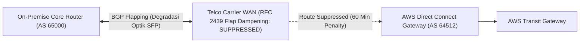

#### 3. Triase & Investigasi Step-by-Step (Triage & CLI Commands)
```bash
# 1. Periksa status fisik & BGP Virtual Interface di AWS
aws directconnect describe-virtual-interfaces --virtual-interface-id dxvif-01a2b3c4

# 2. Periksa status BGP neighbor & dampening penalty di router on-premise (Cisco/Juniper)
show ip bgp summary
show ip bgp flap-statistics
show ip bgp dampened-paths
```

#### 4. Analisis Akar Masalah (Root Cause Analysis - RCA)
Kabel fiber optik di *Meet-Me-Room (MMR)* mengalami *micro-bending* saat aktivitas teknisi vendor, memicu fluktuasi link (5 kali *down-up* dalam 2 menit). Router ISP menerapkan **BGP Route Flap Dampening (RFC 2439)** dan memberikan penalti (*suppress limit 2000*), sehingga meskipun kabel fisik sudah stabil, rute ke AWS di-drop oleh ISP selama 60 menit (*half-life decay timer*).

#### 5. Mitigasi Cepat (Immediate Hotfix)
Eksekusi pembersihan paksa tabel *dampening penalty* di router border on-premise dan minta NOC telco me-reset suppress state:
```bash
clear ip bgp flap-statistics
clear ip bgp 64512 soft in
```

#### 6. Solusi Arsitektur Permanen (Permanent Architectural Fix)
```hcl
# Terapkan BFD pada Direct Connect VIF dan konfigurasikan Dual Circuit Redundancy
resource "aws_dx_transit_virtual_interface" "primary_vif" {
  name           = "primary-dx-vif-with-bfd"
  dx_gateway_id  = aws_dx_gateway.core.id
  connection_id  = "dxcon-primary"
  vlan           = 101
  address_family = "ipv4"
  bgp_asn        = 65000
  enable_site_link = false

  # Minimum BFD interval for sub-second failure detection
  # Note: Configured on BGP neighbor session
}
```

#### 7. Pencegahan Proaktif & Alarm Monitoring (Proactive Prevention)
- **CloudWatch Metric**: `aws.dx.ConnectionState` dan `aws.dx.VirtualInterfaceBgpState`.
- **Threshold**: Alarm jika `VirtualInterfaceBgpState < 1` selama 1 evaluasi periode (1 menit).

---

### SEV-1 War Room 02: Asymmetric Routing State Drop across Centralized GWLB Hub

::: tip STANDAR BEST PRACTICE INDUSTRI (SME RECOMMENDATION)
Wajib aktifkan opsi `ApplianceModeSupport = enable` pada **setiap TGW Attachment** yang mengarah ke VPC Keamanan / Firewall Hub. Jangan pernah mengaktifkan opsi ini pada Spoke VPC biasa.
:::

#### 1. Skenario & Dampak Produksi (Production Impact & Alert)
- **Alert**: Datadog `High TCP Reset (RST) Rate > 45% between Spoke-AZ1 and Spoke-AZ2`.
- **Dampak**: 50% panggilan API antar-layanan gagal secara acak dengan error `Connection Reset by Peer`.

#### 2. Topologi Masalah (Incident Topology)
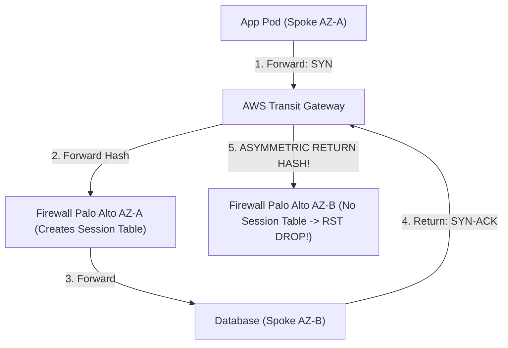

#### 3. Triase & Investigasi Step-by-Step (Triage & CLI Commands)
```sql
-- Query Athena pada Custom VPC Flow Logs mencari paket TCP RST (Flag = 4 atau 20)
SELECT srcaddr, dstaddr, srcport, dstport, tcp_flags, action, count(*) as rst_count
FROM "vpc_flow_logs_db"."parquet_flow_logs"
WHERE tcp_flags IN (4, 20) AND action = 'REJECT'
GROUP BY srcaddr, dstaddr, srcport, dstport, tcp_flags, action
ORDER BY rst_count DESC LIMIT 10;
```

#### 4. Analisis Akar Masalah (Root Cause Analysis - RCA)
AWS Transit Gateway secara default merutekan paket *forward* dan *return* berdasarkan hash 5-tuple independen tanpa mempertimbangkan Availability Zone asal. Paket `SYN` masuk ke firewall di AZ-A (membuat session table), namun paket `SYN-ACK` balasan dilempar oleh TGW ke firewall di AZ-B. Karena firewall di AZ-B tidak memiliki *session state*, firewall menolak paket dan mengirimkan **TCP RST**.

#### 5. Mitigasi Cepat (Immediate Hotfix)
Aktifkan *Appliance Mode* pada Security VPC Attachment secara langsung via AWS CLI:
```bash
aws ec2 modify-transit-gateway-vpc-attachment \
  --transit-gateway-attachment-id tgw-attach-01a2b3c4d5sec \
  --options ApplianceModeSupport=enable
```

#### 6. Solusi Arsitektur Permanen (Permanent Architectural Fix)
```hcl
resource "aws_ec2_transit_gateway_vpc_attachment" "security_inspection" {
  transit_gateway_id     = aws_ec2_transit_gateway.core_hub.id
  vpc_id                 = aws_vpc.security_vpc.id
  subnet_ids             = [aws_subnet.sec_transit_az1.id, aws_subnet.sec_transit_az2.id]
  appliance_mode_support = "enable" # MANDATORY: Enforce bidirectional flow symmetry

  tags = {
    Name = "tgw-attachment-security-appliance-mode"
  }
}
```

#### 7. Pencegahan Proaktif & Alarm Monitoring (Proactive Prevention)
- **CloudWatch Metric**: `aws.transitgateway.BytesDropCountBlackhole` dan `PacketDropCountUnroutable`.

---

### SEV-1 War Room 03: PMTUD Black Hole on Hybrid Direct Connect Jumbo Frames

::: tip STANDAR BEST PRACTICE INDUSTRI (SME RECOMMENDATION)
Terapkan **TCP MSS Clamping (1460 bytes)** pada interface router on-premise atau edge gateway. Jangan pernah memblokir paket **ICMP Type 3 Code 4 (Destination Unreachable: Fragmentation Needed and DF set)** pada firewall korporat.
:::

#### 1. Skenario & Dampak Produksi (Production Impact & Alert)
- **Alert**: Bugsnag `API Timeout during Large Payload Export (> 100KB)`.
- **Dampak**: Perintah `ping` dan koneksi `SSH` normal, namun proses sinkronisasi file batch dan query database besar *hang* tanpa error code.

#### 2. Topologi Masalah (Incident Topology)
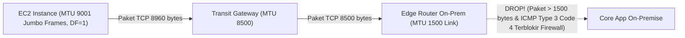

#### 3. Triase & Investigasi Step-by-Step (Triage & CLI Commands)
```bash
# 1. Jalankan probe MTU dengan Don't Fragment (DF) flag aktif dari EC2 ke On-Prem
ping -M do -s 1472 192.168.10.50   # 1472 + 28 = 1500 bytes (BERHASIL)
ping -M do -s 8472 192.168.10.50   # 8472 + 28 = 8500 bytes (DROPPED / HANG!)

# 2. Periksa MTU interface host Linux
ip link show dev eth0
```

#### 4. Analisis Akar Masalah (Root Cause Analysis - RCA)
EC2 mengirim paket jumbo frame (MTU 9001) dengan bit *Don't Fragment (DF)* aktif. Ketika paket melintasi router on-premise dengan link MTU 1500, router men-drop paket dan mengirimkan ICMP Type 3 Code 4. Namun, firewall keamanan on-premise memblokir seluruh pesan ICMP, menyebabkan EC2 tidak pernah menerima sinyal penurunan ukuran paket (*PMTUD Black Hole*).

#### 5. Mitigasi Cepat (Immediate Hotfix)
Turunkan MTU interface EC2 pengirim ke 1500 bytes secara instan:
```bash
sudo ip link set dev eth0 mtu 1500
```

#### 6. Solusi Arsitektur Permanen (Permanent Architectural Fix)
Konfigurasikan *MSS Clamping* di router Cisco/Juniper border dan pastikan Security Group / Firewall mengizinkan ICMP Fragmentation:
```text
! Cisco IOS-XE MSS Clamping Configuration
interface GigabitEthernet0/0/1.100
 ip tcp adjust-mss 1460
```

#### 7. Pencegahan Proaktif & Alarm Monitoring (Proactive Prevention)
- Uji otomatis jalur jaringan menggunakan skrip probe `nping --tcp --df -p 443 -g 8000 <Target_IP>` di pipeline CI/CD.

---

### SEV-1 War Room 04: NAT Gateway SNAT Port Exhaustion during Flash Sale

::: tip STANDAR BEST PRACTICE INDUSTRI (SME RECOMMENDATION)
Asosiasikan **hingga 8 Secondary Elastic IP** pada AWS NAT Gateway untuk memperluas alokasi port concurrent connection dari 55,000 menjadi lebih dari 400,000 koneksi per NAT Gateway.
:::

#### 1. Skenario & Dampak Produksi (Production Impact & Alert)
- **Alert**: CloudWatch Alarm `NAT Gateway ErrorPortAllocation > 500`.
- **Dampak**: 30% transaksi pembayaran e-commerce gagal dengan error `HTTP 504 Gateway Timeout` ke Payment Gateway eksternal.

#### 2. Topologi Masalah (Incident Topology)
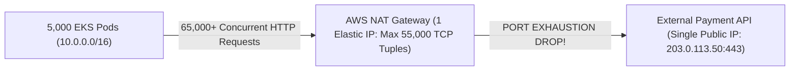

#### 3. Triase & Investigasi Step-by-Step (Triage & CLI Commands)
```bash
# 1. Periksa metrik ErrorPortAllocation di CloudWatch
aws cloudwatch get-metric-data --metric-data-queries file://query-nat-ports.json --start-time 2026-08-22T14:00:00Z --end-time 2026-08-22T14:15:00Z

# 2. Periksa jumlah koneksi aktif per target IP di EKS nodes
netstat -nat | grep ESTABLISHED | awk '{print $5}' | cut -d: -f1 | sort | uniq -c | sort -nr | head -10
```

#### 4. Analisis Akar Masalah (Root Cause Analysis - RCA)
5,000 Pod microservice memanggil 1 IP publik Payment Gateway yang sama secara masif tanpa *HTTP Keep-Alive / Connection Pooling*. NAT Gateway hanya memiliki 1 Elastic IP (kapasitas maksimum 64,512 port ephemeral minus port reserved = ~55,000 koneksi aktif per destination tuple). Ketika koneksi mencapai 55,000, NAT Gateway menolak alokasi port baru (*SNAT Port Exhaustion*).

#### 5. Mitigasi Cepat (Immediate Hotfix)
Asosiasikan 3 Secondary Elastic IP tambahan ke NAT Gateway secara langsung tanpa downtime:
```bash
# Alokasikan EIP baru dan asosiasikan ke NAT Gateway
EIP_ID=$(aws ec2 allocate-address --domain vpc --query AllocationId --output text)
aws ec2 associate-nat-gateway-address --nat-gateway-id nat-01a2b3c4d5e6 --allocation-ids $EIP_ID
```

#### 6. Solusi Arsitektur Permanen (Permanent Architectural Fix)
```hcl
resource "aws_nat_gateway" "scaled_nat" {
  allocation_id = aws_eip.nat_primary.id
  subnet_id     = aws_subnet.public_az1.id

  # Associate 3 additional secondary EIPs for 4x connection scaling
  secondary_allocation_ids = [
    aws_eip.nat_secondary_1.id,
    aws_eip.nat_secondary_2.id,
    aws_eip.nat_secondary_3.id
  ]

  tags = {
    Name = "prod-scaled-nat-gateway"
  }
}
```

#### 7. Pencegahan Proaktif & Alarm Monitoring (Proactive Prevention)
- **CloudWatch Metric**: `aws.natgateway.ErrorPortAllocation` dan `ConnectionEstablishedCount`.
- **Threshold**: Alarm jika `ErrorPortAllocation > 0` selama 1 menit.

---

### SEV-1 War Room 05: Route 53 Hybrid DNS Recursive Forwarding Loop

::: tip STANDAR BEST PRACTICE INDUSTRI (SME RECOMMENDATION)
Gunakan nama subdomain spesifik (misal: `aws.corp.internal` untuk AWS dan `onprem.corp.internal` untuk On-Prem) pada *Conditional Forwarder*. Jangan pernah membuat forwarding rule wildcard `.` (Root) atau domain overlapping pada kedua sisi resolver.
:::

#### 1. Skenario & Dampak Produksi (Production Impact & Alert)
- **Alert**: SCOM Alert `Windows Active Directory DNS Server CPU 100% & Memory Exhaustion`.
- **Dampak**: Seluruh resolusi nama domain internal di kantor pusat dan AWS lumpuh total.

#### 2. Topologi Masalah (Incident Topology)
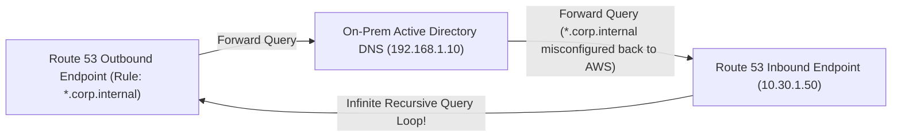

#### 3. Triase & Investigasi Step-by-Step (Triage & CLI Commands)
```bash
# 1. Jalankan query tracing DNS untuk melihat loop
dig +trace @10.30.1.50 test.corp.internal

# 2. Tangkap paket DNS di interface On-Prem AD Server
sudo tcpdump -nn -i eth0 port 53 -c 100
```

#### 4. Analisis Akar Masalah (Root Cause Analysis - RCA)
Admin jaringan mengonfigurasi forwarder di Route 53 Outbound Endpoint untuk domain `corp.internal` menuju On-Prem AD. Di saat yang sama, admin server AD mengonfigurasi forwarder `corp.internal` ke Inbound Endpoint AWS. Query domain yang tidak terdaftar (*NXDOMAIN*) terpental bolak-balik tanpa henti (*infinite DNS amplification loop*), menghabiskan CPU dan memory server.

#### 5. Mitigasi Cepat (Immediate Hotfix)
Hapus *Conditional Forwarder* yang bentrok di DNS Manager Active Directory dan restart service DNS:
```powershell
Remove-DnsServerForwarder -IPAddress 10.30.1.50 -Force
Clear-DnsServerCache -Force
```

#### 6. Solusi Arsitektur Permanen (Permanent Architectural Fix)
```hcl
# Definisikan aturan forwarder spesifik, pisahkan zona AWS dan On-Prem
resource "aws_route53_resolver_rule" "forward_onprem_specific" {
  domain_name          = "onprem-only.corp.internal"
  name                 = "forward-onprem-specific"
  rule_type            = "FORWARD"
  resolver_endpoint_id = aws_route53_resolver_endpoint.outbound.id

  target_ip {
    ip   = "192.168.1.10"
    port = 53
  }
}
```

#### 7. Pencegahan Proaktif & Alarm Monitoring (Proactive Prevention)
- **CloudWatch Metric**: `aws.route53resolver.InboundQueryVolume` dan `OutboundQueryVolume`.
- **Threshold**: Alarm jika query volume melonjak $>500\%$ dari baseline normal dalam 5 menit.

---

### SEV-1 War Room 06: Amazon EKS Pod IP Exhaustion & Subnet Fragmentation

::: tip STANDAR BEST PRACTICE INDUSTRI (SME RECOMMENDATION)
Terapkan **Amazon VPC CNI Custom Networking** dengan mengalokasikan *Secondary VPC CIDR* khusus Pods (RFC 6598 `100.64.0.0/10`) dan aktifkan `ENABLE_PREFIX_DELEGATION=true`.
:::

#### 1. Skenario & Dampak Produksi (Production Impact & Alert)
- **Alert**: Prometheus Alert `KubePodNotReady: Pod stuck in ContainerCreating state for > 15 minutes`.
- **Dampak**: Autoscaling cluster EKS gagal saat lonjakan traffic malam hari; layanan checkout down.

#### 2. Topologi Masalah (Incident Topology)
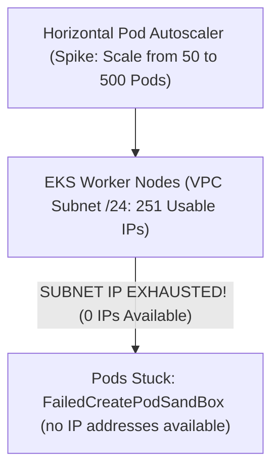

#### 3. Triase & Investigasi Step-by-Step (Triage & CLI Commands)
```bash
# 1. Periksa ketersediaan IP di subnet VPC
aws ec2 describe-subnets --subnet-ids subnet-01a2b3c4 --query "Subnets[*].[SubnetId,AvailableIpAddressCount]"

# 2. Periksa event kegagalan pod di Kubernetes
kubectl get pods -A | grep ContainerCreating
kubectl describe pod <stuck-pod-name> -n production
```

#### 4. Analisis Akar Masalah (Root Cause Analysis - RCA)
Subnet VPC aplikasi dialokasikan dengan prefix `/24` (251 usable IPs). Saat lonjakan traffic, HPA mencoba membuat 300 Pod baru. Setiap Pod menggunakan 1 IP privat VPC langsung via Amazon VPC CNI. Subnet kehabisan alamat IP (`AvailableIpAddressCount = 0`), menyebabkan kubelet gagal melampirkan ENI IP baru ke Pod.

#### 5. Mitigasi Cepat (Immediate Hotfix)
Tambahkan Secondary CIDR pada VPC dan buat subnet baru untuk node group tambahan:
```bash
aws ec2 associate-vpc-cidr-block --vpc-id vpc-01a2b3c4 --cidr-block 100.64.0.0/16
```

#### 6. Solusi Arsitektur Permanen (Permanent Architectural Fix)
```yaml
# Helm values untuk aws-vpc-cni dengan Prefix Delegation aktif
init:
  env:
    ENABLE_PREFIX_DELEGATION: "true"
    WARM_PREFIX_TARGET: "1"
    AWS_VPC_K8S_CNI_CUSTOM_NETWORK_CFG: "true"
    ENI_CONFIG_LABEL_DEF: "topology.kubernetes.io/zone"
```

#### 7. Pencegahan Proaktif & Alarm Monitoring (Proactive Prevention)
- **CloudWatch Metric**: `aws.vpc.SubnetAvailableIpAddresses`.
- **Threshold**: Alarm jika `AvailableIpAddressCount < 50`.

---

### SEV-1 War Room 07: Multi-ENI EC2 Instance Asymmetric Routing Drop

::: tip STANDAR BEST PRACTICE INDUSTRI (SME RECOMMENDATION)
Saat memasang *Secondary ENI* pada instance Linux EC2, selalu konfigurasikan **Linux Policy Routing (`ip rule` & `ip route`)** atau nonaktifkan *Reverse Path Filtering (`rp_filter=2` loose mode)* untuk mencegah kernel menolak paket balasan dari interface sekunder.
:::

#### 1. Skenario & Dampak Produksi (Production Impact & Alert)
- **Alert**: Datadog `Backend Admin Portal on eth1 Unreachable from Management Network`.
- **Dampak**: Tim Network Security tidak dapat mengakses interface audit manajemen di port 8443.

#### 2. Topologi Masalah (Incident Topology)
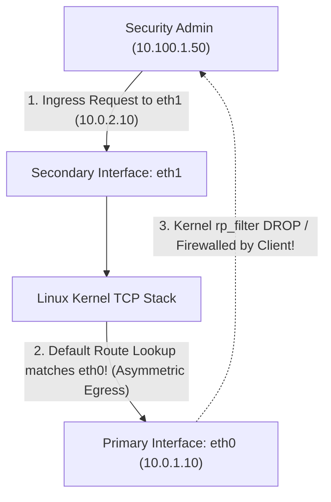

#### 3. Triase & Investigasi Step-by-Step (Triage & CLI Commands)
```bash
# 1. Periksa tabel routing dan policy routing di instance Linux
ip rule show
ip route show table all

# 2. Periksa status Reverse Path Filtering
sysctl -a | grep rp_filter
```

#### 4. Analisis Akar Masalah (Root Cause Analysis - RCA)
Paket masuk melalui `eth1` (10.0.2.10). Ketika kernel Linux mengirim respons, kernel memeriksa tabel perutean utama (*main routing table*) yang hanya memiliki satu rute default `default via 10.0.1.1 dev eth0`. Respons dikirim keluar melalui `eth0`. Sisi pengirim menolak paket karena *Source IP* berubah atau kernel lokal me-drop paket akibat *Strict Reverse Path Filtering (`net.ipv4.conf.all.rp_filter=1`)*.

#### 5. Mitigasi Cepat (Immediate Hotfix)
Tambahkan policy routing tabel sekunder di Linux:
```bash
# Konfigurasi policy routing untuk eth1
ip route add default via 10.0.2.1 dev eth1 table 100
ip rule add from 10.0.2.10/32 table 100
sysctl -w net.ipv4.conf.all.rp_filter=2
```

#### 6. Solusi Arsitektur Permanen (Permanent Architectural Fix)
Gunakan `cloud-init` / systemd networkd configuration untuk memastikan konfigurasi routing tabel sekunder bersifat permanen setelah reboot:
```yaml
#cloud-config
write_files:
  - path: /etc/sysctl.d/99-network.conf
    content: |
      net.ipv4.conf.all.rp_filter = 2
      net.ipv4.conf.eth1.rp_filter = 2
```

#### 7. Pencegahan Proaktif & Alarm Monitoring (Proactive Prevention)
- Terapkan automated testing reachability via `aws ec2 start-network-insights-analysis`.

---

### SEV-1 War Room 08: Transit Gateway Missing Return Route Trap

::: tip STANDAR BEST PRACTICE INDUSTRI (SME RECOMMENDATION)
Terapkan prinsip **Bidirectional Route Propagation Validation**. Mempropagasi rute Spoke A ke TGW Route Table tidak otomatis mengizinkan Spoke B membalas traffic tanpa rute balik yang simetris di tabel Spoke B.
:::

#### 1. Skenario & Dampak Produksi (Production Impact & Alert)
- **Alert**: PagerDuty `Payment Service Cannot Connect to Accounting Database`.
- **Dampak**: Proses reconciliasi keuangan harian tertunda 3 jam.

#### 2. Topologi Masalah (Incident Topology)
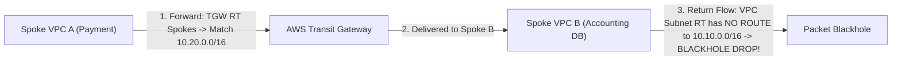

#### 3. Triase & Investigasi Step-by-Step (Triage & CLI Commands)
```bash
# 1. Periksa route table di VPC Spoke B
aws ec2 describe-route-tables --route-table-ids rtb-01a2b3c4spokeB

# 2. Jalankan VPC Reachability Analyzer
aws ec2 create-network-insights-path --source eni-spokeA --destination eni-spokeB --protocol tcp --destination-port 3306
```

#### 4. Analisis Akar Masalah (Root Cause Analysis - RCA)
Tim DevOps menambahkan VPC Spoke A baru dan mengonfigurasi rute ke TGW di Spoke A. Namun, mereka lupa menambahkan entri rute balik `10.10.0.0/16 -> tgw-attach-xxxx` pada Route Table subnet database di VPC Spoke B. Paket data berhasil sampai ke database, tetapi respons TCP SYN-ACK di-drop di router VPC Spoke B (*Blackhole Trap*).

#### 5. Mitigasi Cepat (Immediate Hotfix)
Tambahkan rute balik ke TGW pada Route Table Subnet Spoke B:
```bash
aws ec2 create-route --route-table-id rtb-01a2b3c4spokeB --destination-cidr-block 10.10.0.0/16 --transit-gateway-id tgw-01a2b3c4d5e6
```

#### 6. Solusi Arsitektur Permanen (Permanent Architectural Fix)
Gunakan default summary route `10.0.0.0/8` mengarah ke TGW pada seluruh Spoke Route Tables:
```hcl
resource "aws_route" "spoke_b_to_tgw_summary" {
  route_table_id         = aws_route_table.spoke_b_private.id
  destination_cidr_block = "10.0.0.0/8" # Core Enterprise Supernet
  transit_gateway_id     = aws_ec2_transit_gateway.super_hub.id
}
```

#### 7. Pencegahan Proaktif & Alarm Monitoring (Proactive Prevention)
- Lakukan audit rute otomatis menggunakan **AWS Config Rule** `transit-gateway-blackhole-routes-check`.

---

### SEV-1 War Room 09: PrivateLink Cross-Account DNS Resolution Mismatch

::: tip STANDAR BEST PRACTICE INDUSTRI (SME RECOMMENDATION)
Saat mengaktifkan **Private DNS** pada *Interface VPC Endpoint*, pastikan akun penyedia layanan (*Service Provider*) telah mengeksekusi otorisasi lintas akun (`create-vpc-association-authorization`) sebelum konsumen mencoba me-resolve nama FQDN publik.
:::

#### 1. Skenario & Dampak Produksi (Production Impact & Alert)
- **Alert**: Sentry `SSL: Certificate Subject Mismatch on Internal API Call`.
- **Dampak**: Aplikasi konsumen di Akun B memanggil endpoint privat tetapi menerima sertifikat SSL publik yang salah atau dialihkan ke public IP.

#### 2. Topologi Masalah (Incident Topology)
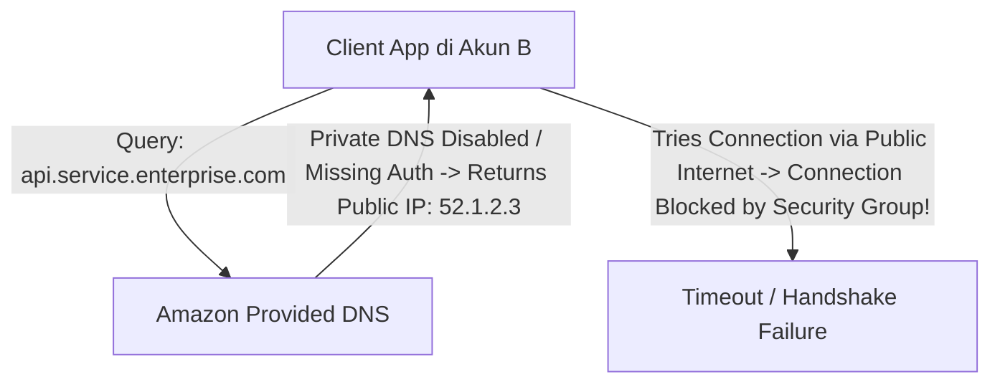

#### 3. Triase & Investigasi Step-by-Step (Triage & CLI Commands)
```bash
# 1. Periksa status DNS resolution dari instance EC2 di Akun B
dig api.service.enterprise.com +short

# 2. Periksa atribut Interface VPC Endpoint di Akun B
aws ec2 describe-vpc-endpoints --vpc-endpoint-ids vpce-01a2b3c4d5e6
```

#### 4. Analisis Akar Masalah (Root Cause Analysis - RCA)
Endpoint PrivateLink dibuat di Akun B, namun opsi **Enable Private DNS** dinonaktifkan karena Private Hosted Zone di Akun A belum di-associate dengan VPC Akun B. Akibatnya, query DNS mengembalikan alamat IP publik ALB, bukan IP Endpoint ENI privat (`10.0.2.50`).

#### 5. Mitigasi Cepat (Immediate Hotfix)
Eksekusi otorisasi dan asosiasi Private Hosted Zone lintas akun:
```bash
# Di Akun A (Provider)
aws route53 create-vpc-association-authorization --hosted-zone-id Z123456 --vpc VPCRegion=ap-southeast-1,VPCId=vpc-accountB

# Di Akun B (Consumer)
aws route53 associate-vpc-with-hosted-zone --hosted-zone-id Z123456 --vpc VPCRegion=ap-southeast-1,VPCId=vpc-accountB
```

#### 6. Solusi Arsitektur Permanen (Permanent Architectural Fix)
Gunakan Terraform untuk mengotomasi otorisasi lintas akun via module:
```hcl
resource "aws_route53_vpc_association_authorization" "auth" {
  vpc_id  = var.consumer_vpc_id
  zone_id = aws_route53_zone.provider_zone.id
}
```

#### 7. Pencegahan Proaktif & Alarm Monitoring (Proactive Prevention)
- Pantau metrik `PrivateDnsNamesEnabled` pada seluruh VPC Endpoints melalui script audit berkala.

---

### SEV-1 War Room 10: Security Group Conntrack Table Exhaustion under UDP Flood

::: tip STANDAR BEST PRACTICE INDUSTRI (SME RECOMMENDATION)
Untuk instance yang menangani *high-rate UDP / DNS workloads*, buat aturan Security Group yang memenuhi syarat **Untracked** (Inbound & Outbound Allow All) guna memotong pemrosesan tabel *conntrack* di Nitro ASIC.
:::

#### 1. Skenario & Dampak Produksi (Production Impact & Alert)
- **Alert**: CloudWatch Metric Alert `c5.large instance conntrack_allowance_exceeded > 10,000 drops/sec`.
- **Dampak**: Server DNS internal mengalami *packet loss* 80%, ribuan aplikasi microservice gagal menemukan database.

#### 2. Topologi Masalah (Incident Topology)
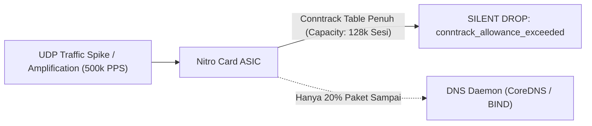

#### 3. Triase & Investigasi Step-by-Step (Triage & CLI Commands)
```bash
# 1. Jalankan ethtool di instance EC2 untuk membaca counter Nitro
ethtool -S eth0 | grep -E "conntrack_allowance_exceeded|linklocal_allowance_exceeded"

# 2. Periksa jumlah koneksi aktif di conntrack OS Linux
cat /proc/sys/net/netfilter/nf_conntrack_count
```

#### 4. Analisis Akar Masalah (Root Cause Analysis - RCA)
Security Group dikonfigurasi dengan aturan Inbound spesifik UDP 53 dan Outbound spesifik TCP/UDP. Karena aturan tidak bersifat simetris dua arah `0.0.0.0/0`, Nitro ASIC menganggap setiap paket UDP sebagai *Tracked Connection*. Setiap paket UDP baru memakan 1 entri conntrack selama 30 detik. Lonjakan 500k PPS menghabiskan kapasitas memori tabel conntrack Nitro dalam hitungan detik.

#### 5. Mitigasi Cepat (Immediate Hotfix)
Ubah aturan Security Group menjadi **Untracked** (Inbound: Allow All Protocols from 0.0.0.0/0, Outbound: Allow All Protocols to 0.0.0.0/0).

#### 6. Solusi Arsitektur Permanen (Permanent Architectural Fix)
```hcl
# Buat aturan SG Untracked khusus untuk UDP/DNS Proxy Fleet
resource "aws_security_group_rule" "untracked_inbound" {
  type              = "ingress"
  from_port         = 0
  to_port           = 0
  protocol          = "-1"
  cidr_blocks       = ["0.0.0.0/0"]
  security_group_id = aws_security_group.dns_proxy_sg.id
}

resource "aws_security_group_rule" "untracked_outbound" {
  type              = "egress"
  from_port         = 0
  to_port           = 0
  protocol          = "-1"
  cidr_blocks       = ["0.0.0.0/0"]
  security_group_id = aws_security_group.dns_proxy_sg.id
}
```

#### 7. Pencegahan Proaktif & Alarm Monitoring (Proactive Prevention)
- **CloudWatch Metric**: `aws.ec2.ConntrackAllowanceExceeded`.
- **Threshold**: Alarm jika `conntrack_allowance_exceeded > 0`.

---

### SEV-1 War Room 11: Subnet NACL Ephemeral Port Denial on Return Traffic

::: tip STANDAR BEST PRACTICE INDUSTRI (SME RECOMMENDATION)
Selalu tetapkan aturan *Outbound NACL Rule 100* sebagai `ALLOW TCP 1024-65535 to 0.0.0.0/0` pada seluruh subnet aplikasi dan database.
:::

#### 1. Skenario & Dampak Produksi (Production Impact & Alert)
- **Alert**: Datadog `EC2 Yum Update & S3 Access Timeout in Private Subnet`.
- **Dampak**: Deployment pipeline CI/CD gagal total, patching keamanan darurat terhenti.

#### 2. Topologi Masalah (Incident Topology)
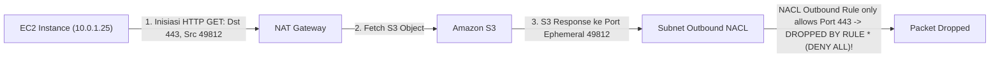

#### 3. Triase & Investigasi Step-by-Step (Triage & CLI Commands)
```bash
# 1. Periksa aturan NACL di subnet terkait
aws ec2 describe-network-acls --filters Name=association.subnet-id,Values=subnet-01a2b3c4

# 2. Uji curl dari instance dengan timeout pendek
curl -Iv https://s3.ap-southeast-1.amazonaws.com --connect-timeout 5
```

#### 4. Analisis Akar Masalah (Root Cause Analysis - RCA)
Insinyur sekuriti junior memperketat Outbound NACL dengan hanya mengizinkan `Port 80 dan Port 443`. Karena NACL bersifat **Stateless**, paket balasan dari S3/Internet dikirim ke *Ephemeral Port* klien (misal: port 49812). Karena port 49812 tidak diizinkan di Outbound NACL, seluruh respons di-drop oleh aturan `* (Default Deny)`.

#### 5. Mitigasi Cepat (Immediate Hotfix)
Tambahkan aturan Outbound NACL untuk rentang ephemeral port:
```bash
aws ec2 create-network-acl-entry \
  --network-acl-id acl-01a2b3c4d5e6 \
  --rule-number 100 \
  --protocol tcp \
  --rule-action allow \
  --egress \
  --cidr-block 0.0.0.0/0 \
  --port-range From=1024,To=65535
```

#### 6. Solusi Arsitektur Permanen (Permanent Architectural Fix)
```hcl
resource "aws_network_acl_rule" "allow_ephemeral_outbound" {
  network_acl_id = aws_network_acl.app_nacl.id
  rule_number    = 100
  egress         = true
  protocol       = "tcp"
  rule_action    = "allow"
  cidr_block     = "0.0.0.0/0"
  from_port      = 1024
  to_port        = 65535
}
```

#### 7. Pencegahan Proaktif & Alarm Monitoring (Proactive Prevention)
- Lakukan validasi sintaks Terraform via pre-commit hook untuk memastikan NACL outbound selalu memuat aturan ephemeral ports.

---

### SEV-1 War Room 12: Direct Connect Failover to Accelerated VPN Routing Loop

::: tip STANDAR BEST PRACTICE INDUSTRI (SME RECOMMENDATION)
Gunakan komunitas BGP **Local Preference (`7224:7300` High, `7224:7100` Low)** yang dipadukan dengan **AS-Path Prepending ($3\times$)** secara simetris di kedua sirkuit (Direct Connect dan Site-to-Site VPN).
:::

#### 1. Skenario & Dampak Produksi (Production Impact & Alert)
- **Alert**: PagerDuty `Traffic Blackhole after Direct Connect Link Recovery`.
- **Dampak**: Setelah link DX yang sempat down kembali UP, traffic dari on-premise ke AWS mengalami packet loss 100%.

#### 2. Topologi Masalah (Incident Topology)
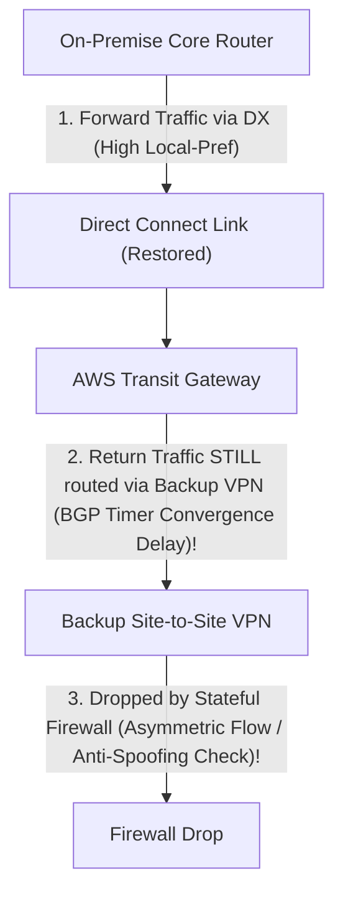

#### 3. Triase & Investigasi Step-by-Step (Triage & CLI Commands)
```bash
# 1. Periksa rute BGP yang dipelajari TGW
aws ec2 search-transit-gateway-routes --transit-gateway-route-table-id tgw-rtb-01a2b3c4 --filters Name=type,Values=propagated

# 2. Periksa rute BGP aktif di router on-premise
show ip bgp 10.0.0.0/8
```

#### 4. Analisis Akar Masalah (Root Cause Analysis - RCA)
Router on-premise langsung mengalihkan traffic keluar ke Direct Connect seketika setelah link optik UP. Namun di sisi AWS, TGW masih memproses rute VPN karena *BGP Route Propagation Delay* dan ketiadaan komunitas BGP Local Preference di sisi iklan rute VPN, menciptakan kondisi perutean asimetris yang diblokir oleh firewall stateful on-premise.

#### 5. Mitigasi Cepat (Immediate Hotfix)
Terapkan manual BGP soft reset pada sesi VPN di router on-premise untuk memaksa konvergensi:
```bash
clear ip bgp <VPN_Peer_IP> soft out
```

#### 6. Solusi Arsitektur Permanen (Permanent Architectural Fix)
Iklankan rute VPN dengan AS-Path Prepending $3\times$ dan tag BGP Community `7224:7100` (Low Preference):
```text
! Cisco BGP Route-Map Configuration
route-map AWS-VPN-OUT permit 10
 set as-path prepend 65000 65000 65000
 set community 7224:7100
```

#### 7. Pencegahan Proaktif & Alarm Monitoring (Proactive Prevention)
- Pantau metrik `TunnelState` dan waktu failover menggunakan probe sintetis Datadog Network Performance Monitoring.

---

### SEV-1 War Room 13: Network Firewall Suricata Rule Syntax Error Silent Drop

::: tip STANDAR BEST PRACTICE INDUSTRI (SME RECOMMENDATION)
Selalu validasi sintaks aturan Suricata menggunakan pipeline CI/CD dengan *Suricata Linter CLI* (`suricata -T`) sebelum mengunggah rule ke AWS Network Firewall Policy.
:::

#### 1. Skenario & Dampak Produksi (Production Impact & Alert)
- **Alert**: PagerDuty `Egress Network Firewall Policy Out-of-Sync & Silent Packet Drops`.
- **Dampak**: Pembaruan aturan firewall keamanan gagal diterapkan; sebagian traffic SaaS terputus.

#### 2. Topologi Masalah (Incident Topology)
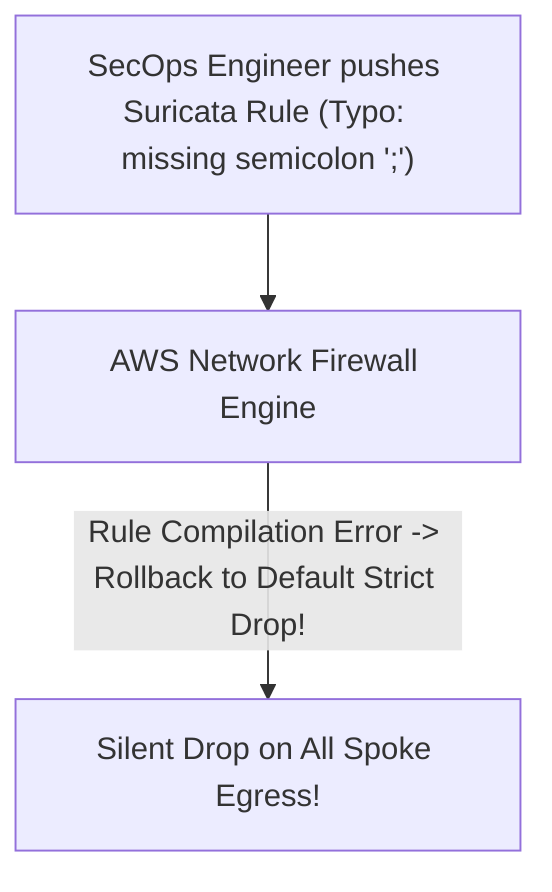

#### 3. Triase & Investigasi Step-by-Step (Triage & CLI Commands)
```bash
# 1. Periksa status sinkronisasi Firewall Policy
aws network-firewall describe-firewall --firewall-name central-inspection-firewall --query "FirewallStatus.Status"

# 2. Periksa detail pesan kesalahan pada Rule Group
aws network-firewall describe-rule-group --rule-group-arn <RuleGroupARN> --query "RuleGroupResponse.AnalysisResults"
```

#### 4. Analisis Akar Masalah (Root Cause Analysis - RCA)
Insinyur SecOps menambahkan aturan Suricata kustom tanpa titik-koma penutup (`;`). Mesin Suricata AWS menolak kompilasi aturan. Karena policy menggunakan mode `STRICT_ORDER` dengan default action `DROP`, kegagalan kompilasi menyebabkan engine masuk ke mode proteksi fallback yang memblokir seluruh paket yang belum dievaluasi.

#### 5. Mitigasi Cepat (Immediate Hotfix)
Hapus signature yang rusak via AWS CLI atau pulihkan (*rollback*) ke revisi rule group sebelumnya:
```bash
aws network-firewall update-rule-group --rule-group-arn <ARN> --rules-source file://repaired-rules.txt
```

#### 6. Solusi Arsitektur Permanen (Permanent Architectural Fix)
Tambahkan linter validation step pada GitHub Actions / GitLab CI pipeline sebelum `terraform apply`:
```yaml
- name: Validate Suricata Syntax
  run: |
    docker run --rm -v $(pwd)/rules:/rules jasonish/suricata:latest suricata -T -c /rules/suricata-test.yaml
```

#### 7. Pencegahan Proaktif & Alarm Monitoring (Proactive Prevention)
- **CloudWatch Metric**: `aws.networkfirewall.DroppedPackets` dan `CountAction`.

---

### SEV-1 War Room 14: GWLB GENEVE TLV Option Drop on Third-Party Appliance

::: tip STANDAR BEST PRACTICE INDUSTRI (SME RECOMMENDATION)
Pastikan perangkat virtual firewall (Palo Alto VM-Series / Fortinet) mengaktifkan dukungan **GENEVE TLV Options Decoding (Class `0x0108`, Type `0x01`)** dan interface MTU dikonfigurasi minimal **8500 / 9001 bytes** untuk mengakomodasi 64-byte overhead enkapsulasi GWLB.
:::

#### 1. Skenario & Dampak Produksi (Production Impact & Alert)
- **Alert**: Datadog `All Backend Firewall Targets Marked UNHEALTHY by GWLB`.
- **Dampak**: Seluruh inspeksi lalu lintas North-South dan East-West mati total.

#### 2. Topologi Masalah (Incident Topology)
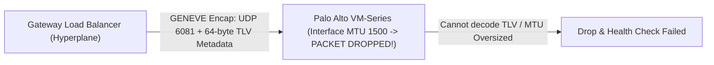

#### 3. Triase & Investigasi Step-by-Step (Triage & CLI Commands)
```bash
# 1. Periksa status kesehatan target di GWLB Target Group
aws elbv2 describe-target-health --target-group-arn <GWLB_TG_ARN>

# 2. Tangkap paket GENEVE di interface firewall VM
tcpdump -nn -i eth1 udp port 6081 -vvv
```

#### 4. Analisis Akar Masalah (Root Cause Analysis - RCA)
Setelah update firmware appliance firewall, konfigurasi interface MTU ter-reset ke 1500 bytes. Ketika GWLB mengirim paket dengan enkapsulasi **GENEVE (UDP port 6081 + 64 bytes TLV Option Header)**, paket melebihi batas MTU interface firewall sehingga di-drop oleh kernel appliance, menyebabkan health check gagal serentak.

#### 5. Mitigasi Cepat (Immediate Hotfix)
Naikkan MTU interface firewall VM ke 9001 bytes dan restart daemon GENEVE di firewall:
```bash
# Pada console appliance Palo Alto PAN-OS
set network interface ethernet ethernet1/1 mtu 9001
commit
```

#### 6. Solusi Arsitektur Permanen (Permanent Architectural Fix)
```hcl
# Pastikan template launch EC2 appliance firewall menyetel MTU 9001 di script user-data
resource "aws_launch_template" "firewall_lt" {
  name_prefix   = "ngfw-appliance-"
  image_id      = data.aws_ami.palo_alto.id
  instance_type = "c5n.4xlarge" # Nitro instance supporting 100Gbps Jumbo Frames

  network_interfaces {
    associate_public_ip_address = false
    device_index                = 0
    security_groups             = [aws_security_group.gwlb_firewall_sg.id]
  }
}
```

#### 7. Pencegahan Proaktif & Alarm Monitoring (Proactive Prevention)
- **CloudWatch Metric**: `aws.gatewayelb.UnHealthyHostCount` dan `HealthyHostCount`.

---

### SEV-1 War Room 15: Cloud WAN Segment Policy Propagation Desynchronization

::: tip STANDAR BEST PRACTICE INDUSTRI (SME RECOMMENDATION)
Selalu gunakan fitur **Policy Staging & Change Set Review** di AWS Network Manager sebelum mengeksekusi *Execute Core Network Policy*. Jangan pernah mengubah *Segment Actions* langsung pada live production policy tanpa validasi change-set.
:::

#### 1. Skenario & Dampak Produksi (Production Impact & Alert)
- **Alert**: AWS Network Manager Alert `Core Network Segment Routing Leak: Dev Segment can route to Prod Segment`.
- **Dampak**: Pelanggaran kepatuhan audit keamanan ketat (PCI-DSS); risiko kebocoran data nasabah.

#### 2. Topologi Masalah (Incident Topology)
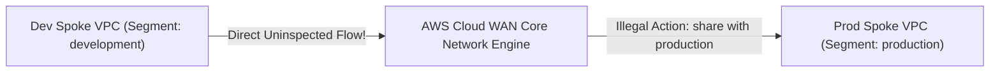

#### 3. Triase & Investigasi Step-by-Step (Triage & CLI Commands)
```bash
# 1. Periksa policy document aktif di AWS Cloud WAN
aws networkmanager get-core-network-policy --core-network-id ccore-01a2b3c4d5e6 --alias LIVE

# 2. Periksa rute aktif di segmen production
aws networkmanager get-core-network-segment-routes --core-network-id ccore-01a2b3c4d5e6 --segment-name production
```

#### 4. Analisis Akar Masalah (Root Cause Analysis - RCA)
Seorang teknisi menambahkan `segment-actions: share` pada segmen `development` yang secara tidak sengaja membagikan seluruh rute development ke segmen `production` tanpa melalui `send-via security inspection group`, melanggar isolasi zero-trust.

#### 5. Mitigasi Cepat (Immediate Hotfix)
Kembalikan (*rollback*) kebijakan Core Network ke versi sebelumnya (*Previous LIVE Policy Version*):
```bash
aws networkmanager execute-core-network-change-set --core-network-id ccore-01a2b3c4d5e6 --policy-version-id 3
```

#### 6. Solusi Arsitektur Permanen (Permanent Architectural Fix)
```json
{
  "version": "2021.12",
  "segments": [
    {
      "name": "development",
      "isolate-attachments": true,
      "require-attachment-acceptance": true
    },
    {
      "name": "production",
      "isolate-attachments": false,
      "require-attachment-acceptance": true
    }
  ],
  "segment-actions": [
    {
      "action": "send-via",
      "segment": "development",
      "network-function-group-name": "firewall-nfg",
      "when-sent-to": { "segments": ["*"] }
    }
  ]
}
```

#### 7. Pencegahan Proaktif & Alarm Monitoring (Proactive Prevention)
- Pasang OPA (Open Policy Agent) / Conftest di pipeline CI/CD untuk me-reject policy JSON yang membagikan rute production secara langsung.
